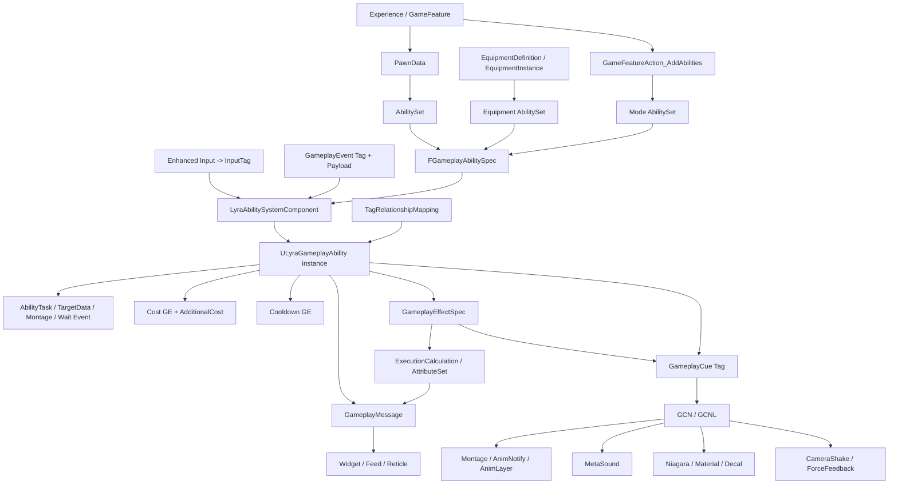
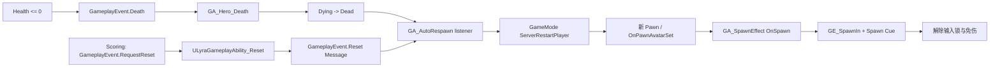

# Lyra GAS、完整 Ability 组织与表现层架构深度分析（UE 5.8）

> 工程：`D:\GameDev\Unreal_Projects\LyraStarterGame`
>
> 引擎：`D:\GameEngine\Epic Games\UE_5.8`
>
> 分析日期：2026-07-16
>
> 配套前篇：`Lyra_Rifle_Fire_Vertical_Slice_Study_and_Analysis.md`

## 0. 文档定位与证据标准

前篇以“步枪开火”作为竖切，回答一次射击怎样经过 Enhanced Input、GameplayTag、GAS、装备、预测、伤害、消息、动画、GameplayCue、MetaSound 和 Niagara。本篇把视角抬高一层，回答以下问题：

1. Lyra 如何在整个项目中组织 GAS，而不是只组织一把枪。
2. 一个完整 Ability 到底由哪些对象共同组成，各对象分别拥有哪部分配置。
3. 主动输入能力、装备能力、被动能力、状态能力和服务器生命周期能力，是否遵守同一套架构。
4. GA、GE、GC、Tag、动画、声音、粒子、材质、相机、UI 是否集中在统一位置配置。
5. 表现内容怎样从权威玩法结果中获得语义、上下文和时序，并在客户端生成。
6. Lyra 的方案哪些部分真正通用，哪些部分仍然是 ShooterCore 的项目特化内容。

本文的证据分四级：

| 级别 | 证据 | 定位粒度 |
|---|---|---|
| A | Lyra 与 UE 5.8 C++ 源码 | 绝对文件路径、行号、类和函数 |
| B | 配置文件与 GameplayTag 定义 | 绝对路径、节名、行号或具体 Tag |
| C | UE 5.8 实际加载的 `.uasset` | 对象路径、类、父类、CDO 覆写、数组索引、依赖和反向引用 |
| D | Blueprint 图表机器提取 | Graph 名、节点类、节点位置、默认 Pin、Pin 连接 |

`.uasset` 是二进制对象，没有与 C++ 相同意义的“源码行号”。因此本篇对资产采用更可靠的定位方式：`包路径 + 对象/Graph + 节点类或字段 + Pin/数组索引`。文末“机器提取附录”保存了 44 个关键资产和 23 个蓝图的原始结构化结果，便于把正文判断反查到资产内部。

## 1. 最直接的答案

### 1.1 Lyra 有没有把所有内容集中在一个统一位置配置

**没有。Lyra 没有一个同时配置 GA、GE、GC、Tag、动画、声音、粒子和材质的万能 DataAsset。**

它统一的是协议、语义和生命周期入口，而不是物理存储位置。配置按所有权分散：

| 内容 | 主要所有者 | 为什么放在这里 |
|---|---|---|
| 一个 Pawn 固有的能力集合 | `ULyraPawnData` -> `ULyraAbilitySet` | 角色原型和 Experience 组合需要复用 |
| 装备期间才存在的能力 | `ULyraEquipmentDefinition` -> AbilitySet | 装备实例负责授予和撤销，Spec SourceObject 指回装备实例 |
| Ability 激活策略、互斥组、Cost、Cooldown、触发器 | GA 类 CDO/蓝图默认值 | 这是单个能力的玩法规则 |
| Ability 间 block/cancel/required 关系 | `ULyraAbilityTagRelationshipMapping` | 关系随 Pawn 原型变化，不必修改每个 GA |
| 数值修改、持续时间、Granted/Asset Tags、GameplayCue | GE CDO | 这是效果的声明式规则和复制载体 |
| 伤害/治疗公式 | `ExecutionCalculation` C++ + GE 配置 | 公式保持权威和可测试，GE 决定何时使用 |
| Cue Tag 到表现对象的路由 | GameplayCue Manager + GCN/GCNL | Ability 只表达语义，不硬引用具体 VFX/SFX |
| Cue 的声音、粒子、贴花、相机震动、力反馈 | GameplayCue Notify CDO/蓝图 | 表现资源由表现域拥有 |
| 人物动作时序 | Montage、AnimNotify、AbilityTask | 动画时间轴是动作事件的自然所有者 |
| 武器网格、AnimLayer、射击动画/声音接口参数 | Weapon Definition/Instance、`B_Weapon`、MetaSound | 同一玩法 Ability 可换武器表现 |
| 表面反馈 | PhysicalMaterial、SurfaceType、材质/粒子/声音映射 | 命中对象和表现系统拥有表面语义 |
| UI/提示/击杀播报 | GameplayMessage channel + payload + Widget | UI 按频道订阅，不反向依赖 GA |

所以，Lyra 的正确阅读方式不是寻找“总配置表”，而是沿着四种连接追踪：

1. **硬引用**：DataAsset、类默认值和蓝图变量直接引用另一资产。
2. **GameplayTag 间接路由**：输入、激活、状态、GameplayCue 和消息都以 Tag 对齐。
3. **结构体协议**：`FGameplayAbilitySpec`、`FGameplayEffectSpec`、`FLyraGameplayEffectContext`、`FGameplayCueParameters`、消息 Payload 携带运行时数据。
4. **约定参数名**：MetaSound 输入、Niagara User Parameter、AnimNotify/GameplayEvent 名称形成局部协议。

### 1.2 一个完整 Ability 是不是一个 GA 文件

**不是。GA 是运行时编排器和策略宿主，只是完整 Ability 的核心节点之一。**

完整 Ability 更接近一个按生命周期装配的依赖图：



对任意 Ability 做完整审计时，至少要回答九个问题：

1. 谁授予它，何时撤销，授予句柄保存在哪里。
2. `OwnerActor`、`AvatarActor`、`SourceObject` 分别是谁。
3. 它由 InputTag、GameplayEvent 还是 `OnSpawn` 启动。
4. `NetExecutionPolicy`、`NetSecurityPolicy`、预测键和 Authority gate 怎样分工。
5. Cost、Cooldown、AdditionalCost 在何时检查和提交。
6. AbilityTags、OwnedTags、ActivationGroup 和 RelationshipMapping 怎样决定并发。
7. 它等待哪些 AbilityTask、TargetData、Montage Notify、委托或消息。
8. 权威结果如何通过 GE、Attribute、GameplayCue 或 RPC 到达客户端。
9. `EndAbility`、`OnAbilityRemoved`、Avatar 切换时分别清理什么。

### 1.3 Lyra 是否形成高度复用、可扩展的 Ability 架构

答案是：**基础设施高度复用，内容编排中度复用，具体技能逻辑不会自动通用。**

| 层 | 复用程度 | 判断 |
|---|---:|---|
| ASC 输入缓冲、激活调度、TagRelationship、ActivationGroup | 高 | 可直接作为多人项目底座 |
| AbilitySet 授予/撤销、Equipment SourceObject、GameFeature 注入 | 高 | 明确解决不同生命周期的能力装配 |
| EffectContext、AbilitySource、AdditionalCost、失败消息 | 高 | 为射击、库存、UI 和伤害提供稳定扩展点 |
| GameplayCue、MetaSound/Niagara 参数协议 | 中高 | 语义解耦良好，但参数名和 GCN 图仍需项目规范 |
| 通用 Ability 蓝图模板 | 中 | Jump、Dash、Reload、AutoRespawn 的图结构差异很大 |
| 具体武器和技能内容 | 中低 | Rifle、Shotgun、Grenade、Arena Bomb 都有领域特化逻辑 |

Lyra 没有试图造一个“所有技能都填同一张表”的系统，因为那会把网络、异步、动画时序、目标数据和生命周期差异压进巨型配置结构。它选择统一外围契约，同时允许 Ability 内部按问题形态采用不同实现模式。

## 2. Lyra GAS 的五层组织模型

### 2.1 进程和全局层

这一层选择 Lyra 的 GAS 基础设施：

- `DefaultGame.ini` 指定 `ULyraAbilitySystemGlobals` 和 `ULyraGameplayCueManager`。
- `ULyraAbilitySystemGlobals::AllocGameplayEffectContext()` 创建 `FLyraGameplayEffectContext`。
- `ULyraAssetManager` 加载全局 `ULyraGameData`，提供 Damage、Heal、DynamicTag 等通用 GE。
- `ULyraGlobalAbilitySystem` 可以向世界中所有已注册 ASC 临时施加 GA/GE。
- `ULyraGamePhaseSubsystem` 把 GamePhase 也建模为运行在 GameState ASC 上的 Ability。

### 2.2 Experience 和 GameFeature 层

Experience 决定当前玩法模式启用哪些 GameFeature、ActionSet 和默认 PawnData。`UGameFeatureAction_AddAbilities` 能在 Feature 激活时为指定 Actor 类追加 GA、AttributeSet 或整个 AbilitySet，并在 Feature 卸载时撤销。

这层适合“只在某模式存在”的能力，例如 Elimination/ControlPoint 的 AutoRespawn，而不是每个 Hero 永久拥有的能力。

### 2.3 Pawn 原型层

`ULyraPawnData` 是角色原型的组合根，拥有：

- PawnClass
- AbilitySets
- TagRelationshipMapping
- InputConfig
- DefaultCameraMode

玩家的 ASC 和核心 AttributeSet 位于 PlayerState，Pawn 是可替换 Avatar。这使死亡、换 Pawn、重生不会要求重建玩家的长期 AbilitySystem 状态。

### 2.4 装备和临时来源层

Equipment Manager 在装备时创建 EquipmentInstance，并把它作为 `SourceObject` 授予 EquipmentDefinition 中的 AbilitySet。卸装时使用保存的 `FLyraAbilitySet_GrantedHandles` 精确撤销。

这是步枪开火能够从 GA 回到“当前是哪一把枪、弹药和距离衰减数据在哪里”的关键。

### 2.5 单个 Ability 运行层

`ULyraGameplayAbility` 统一：

- ActivationPolicy：`OnInputTriggered`、`WhileInputActive`、`OnSpawn`
- ActivationGroup：独立、可替换独占、阻塞独占
- CostGE、CooldownGE、AdditionalCosts
- FailureTag 到文本/蒙太奇/消息的解释
- EffectContext 和 AbilitySource
- CameraMode 设置/清理
- OnGive、OnRemove、OnPawnAvatarSet、OnSpawn 激活

具体 GA 再选择适合自己的 Task、TargetData、动画、RPC、GE 和 Cue。

## 3. Tag 在 Lyra 中不是一种用途，而是六种不同契约

| Tag 类别 | 典型例子 | 存放位置 | 作用 |
|---|---|---|---|
| InputTag | `InputTag.Weapon.FireAuto` | InputConfig + Spec Dynamic Tags | 从输入定位可激活 Spec |
| AbilityTag | `Ability.Type.Action.WeaponFire` | GA CDO | 描述能力语义，供取消/关系查询 |
| ActivationOwnedTag | `Event.Movement.Dash` | GA CDO | Ability 激活期间临时表示状态 |
| Status/GameplayEffect Tag | `Status.Death.Dead` | GE/ASC | 表示持续状态，参与激活条件和 UI |
| GameplayCue Tag | `GameplayCue.Weapon.Rifle.Fire` | GE 或 GA 调用 + GCN | 把玩法语义路由到表现对象 |
| Message Channel Tag | Ability 失败、伤害、淘汰等频道 | C++ Native Tag/蓝图 | 把结构化事件路由到 UI/监听器 |

不能因为它们都是 GameplayTag 就混用。InputTag 是 Spec 选择键；AbilityTag 是分类；OwnedTag 是状态；CueTag 是表现路由；MessageTag 是事件总线频道。Lyra 的可扩展性很大程度来自这几类 Tag 在语义上保持分工。

## 4. 一个完整 Ability 的三条并行链

### 4.1 装配链：它为什么存在

```text
Experience
  -> PawnData / GameFeature Action / EquipmentDefinition
  -> AbilitySet
  -> GiveToAbilitySystem
  -> FGameplayAbilitySpec
     - Ability class
     - Level
     - Dynamic InputTag
     - SourceObject
  -> ASC 保存 Spec
```

### 4.2 执行链：它怎样改变玩法状态

```text
InputTag / GameplayEvent / OnSpawn
  -> ASC 选择 Spec 并 TryActivateAbility
  -> GAS 标准检查 + Lyra TagRelationship + ActivationGroup
  -> ActivateAbility
  -> CommitAbility
     - CheckCost
     - ApplyCost
     - ApplyCooldown
  -> AbilityTask / TargetData / GameplayEffectSpec
  -> ExecutionCalculation
  -> AttributeSet PostGameplayEffectExecute
  -> Health/Death/Inventory 等权威状态变化
```

### 4.3 表现链：玩家怎样看见和听见结果

```text
GA 或 GE 发出 GameplayCue Tag
  -> GameplayCueManager 找到 GCN/GCNL
  -> FGameplayCueParameters 携带 Instigator、EffectCauser、Location、Normal、PhysicalMaterial 等上下文
  -> GCN 生成或控制 Niagara、MetaSound、Decal、Material、CameraShake、ForceFeedback

Montage / AbilityTask
  -> AnimNotify / GameplayEvent
  -> 推动换弹、近战、武器动作等关键时序

GA / Health / GameState
  -> GameplayMessage channel + payload
  -> UI、准星、伤害提示、击杀播报订阅
```

三条链会交叉，但不应混成一条：装配链解释所有权和生命周期；执行链决定权威玩法；表现链消费语义和上下文。调试时先判断问题属于哪条链，效率会高得多。

## 5. 代表性 Ability 模式地图

| 模式 | 代表能力 | 授予来源 | 启动 | 核心异步/状态 | 表现出口 |
|---|---|---|---|---|---|
| 输入型轻量动作 | Jump | Hero AbilitySet | InputTag | CharacterMovement + WaitInputRelease | 人物动画状态 |
| 预测型角色动作 | Dash | Hero AbilitySet | InputTag/GameplayEvent | 自定义方向同步 + RootMotion Task + Cooldown GE | Dash GCNL + MetaSound + Niagara |
| 装备 TargetData 能力 | Rifle Fire | Equipment AbilitySet | InputTag | 客户端瞄准 TargetData、服务器弹药和伤害 | WeaponFire Cue + Montage + Audio/VFX |
| 动画时序能力 | Reload | Equipment AbilitySet | InputTag/GameplayEvent | Montage + AnimNotify + ItemTagStack | 人物/武器 Montage、声音 |
| 被动事件路由器 | AutoReload | Equipment AbilitySet | OnSpawn | 监听弹药条件并发送 Reload Event | 间接触发 Reload |
| 长期 Avatar 监听器 | AutoRespawn | Mode AbilitySet | OnSpawn/生命周期回调 | 监听死亡、服务器请求重生、UI 倒计时 | Message/UI |
| 状态能力 | SpawnEffect | Hero AbilitySet | OnSpawn | 无限 GE 持有 Spawn 状态 | Looping Spawn Cue |
| 服务器生命周期能力 | Death/Reset | Hero AbilitySet/原生 | GameplayEvent | 取消能力、切换互斥组、GameMode Reset | Death Cue、消息、UI |
| 投射物能力 | Grenade | Hero AbilitySet | InputTag | 预测/服务器生成 Actor、Cooldown、爆炸 GE | Detonate Cue + Niagara + MetaSound |
| 玩法 Feature 能力 | Arena DropBomb | Arena AbilitySet | 模式输入/调用 | Bomb Actor、Bomb GE、模式资源 | Arena 专用动画/VFX |

这些模式共享同一外围架构，但不会强迫使用同一张 Ability 蓝图模板。正文第三部分会逐个比较它们的节点、网络边界和清理职责。

## 6. 专项学习计划：从 GAS 骨架到完整 Ability

这份计划建立在前篇“步枪开火竖切”已经完成的基础上，建议按 5 个阶段、18 个学习单元执行。每个单元都要求留下可验证产物，而不是只阅读。

### 阶段 A：建立 GAS 运行时模型（4 个单元）

| 单元 | 阅读目标 | 必看对象 | 实践产物 |
|---|---|---|---|
| A1 | 确认 Globals、AssetManager 和 GameData 的启动顺序 | `DefaultGame.ini`、`LyraAbilitySystemGlobals`、`LyraAssetManager`、`LyraGameData` | 一张“进程启动到全局 GE 可用”的时序图 |
| A2 | 理解 PlayerState ASC 与 Pawn Avatar 分离 | `LyraPlayerState::SetPawnData`、`LyraPawnExtensionComponent`、`InitAbilityActorInfo` | 在 PIE 记录 OwnerActor、AvatarActor、ASC NetMode |
| A3 | 理解 AbilitySet 的授予/撤销协议 | `LyraAbilitySet.h/.cpp`、`FLyraAbilitySet_GrantedHandles` | 写出 Pawn、Equipment、GameFeature 三种授予来源对照表 |
| A4 | 理解 Experience/PawnData/GameFeature 组合 | Experience Definition、ActionSet、`GameFeatureAction_AddAbilities` | 追踪一个 Experience 最终给 Hero 的全部 AbilitySet |

通过标准：可以准确回答某个 Spec 为什么在 ASC 中、谁能撤销它、SourceObject 是谁。

### 阶段 B：掌握激活、互斥和成本（4 个单元）

| 单元 | 阅读目标 | 必看对象 | 实践产物 |
|---|---|---|---|
| B1 | 跟踪 InputTag 到 `TryActivateAbility` | InputData、HeroComponent、Lyra ASC 输入函数 | 给 Jump、Dash、Fire 分别画输入路由 |
| B2 | 区分 ActivationPolicy 与触发器 | `OnInputTriggered`、`WhileInputActive`、`OnSpawn`、AbilityTriggers | 修改实验 Ability 分别验证三种策略 |
| B3 | 区分 ActivationGroup 与 TagRelationship | `AddAbilityToActivationGroup`、TagRelationships_ShooterHero | 人工制造两个互斥 Ability，记录失败 Tag |
| B4 | 理解标准 CostGE 与 AdditionalCost | `CheckCost`、`ApplyCost`、ItemTagStack Cost、OnlyApplyCostOnHit | 为测试 Ability 增加“命中才消耗”成本 |

通过标准：能解释“为什么没有激活”和“为什么激活后没有扣资源”，并定位到具体检查层。

### 阶段 C：比较五种 Ability 实现模式（5 个单元）

| 单元 | 样本 | 重点 | 实践产物 |
|---|---|---|---|
| C1 | Jump | 最小输入 Ability、WaitInputRelease、CharacterMovement 预测 | 复刻一个不依赖武器的 Hold/Release 动作 |
| C2 | Dash | RootMotion Task、方向同步、Cooldown GE、GCNL | 记录客户端与服务器各自激活实例和预测键 |
| C3 | Rifle Fire/Reload | Equipment SourceObject、TargetData、Montage/Notify、弹药成本 | 前篇竖切图增加 AbilitySet 和清理面 |
| C4 | AutoReload/AutoRespawn | OnSpawn、OnAbilityAdded、OnPawnAvatarSet、长期监听 | 制作一个监听状态并发送 GameplayEvent 的被动 Ability |
| C5 | Death/Reset/SpawnEffect | 服务器事件、互斥组、无限 GE、Looping Cue | 画完整死亡到重生再到 Spawn 状态移除的时序图 |

通过标准：面对新需求时，先选择实现模式，再决定节点，而不是从空白 EventGraph 随意堆逻辑。

### 阶段 D：表现层协议（3 个单元）

| 单元 | 阅读目标 | 必看对象 | 实践产物 |
|---|---|---|---|
| D1 | 理解 Burst、BurstLatent、Looping Cue | 三种 GameplayCueNotify 基类、Dash/Spawn/Weapon GCN | 为同一测试 Tag 各做一次瞬时和持续表现 |
| D2 | 理解参数如何越过系统边界 | `FGameplayCueParameters`、SpawnResult、PhysicalMaterial、SurfaceType | 打印命中 Cue 的 EffectCauser、Location、Normal、PhysMat |
| D3 | 理解动画/声音/粒子的局部协议 | Montage/AnimNotify、WeaponAudioFunctions、MetaSound 输入、Niagara User Params | 建立项目自己的参数命名表并验证缺参行为 |

通过标准：更换一个 GCN、MetaSound 或 Niagara 资产时，不修改伤害公式和服务器逻辑。

### 阶段 E：自己实现一个生产级 Ability（2 个单元）

| 单元 | 目标 | 必须包含 | 验收 |
|---|---|---|---|
| E1 | 设计与实现 | AbilitySet、InputTag、GA、Cost/Cooldown、TagRelationship、至少一个 Task、GE/GC、动画或音频/粒子 | Dedicated Server + 2 Client 验证激活、拒绝、预测、取消、重生 |
| E2 | 可维护性审计 | 配置归属表、网络职责表、清理表、失败消息、资产依赖、性能预算 | 另一种 PawnData 或装备能复用核心 GA，表现资产可替换 |

建议选题是“可蓄力的装备技能”：按下进入瞄准/蓄力，松开发送 TargetData，命中才扣资源，服务器计算伤害，GameplayCue 根据表面生成不同反馈。这一题能覆盖 Lyra GAS 架构的大多数关键接口，又不会与步枪代码完全重复。

## 7. 阅读本报告的方法

后续正文按以下顺序组织：

1. **GAS 核心组织与可扩展框架审计**：从进程初始化、Experience、PawnData、AbilitySet 一直深入到 ASC、Ability 基类、成本、失败消息、EffectContext、Attribute 和 Execution。
2. **GameplayAbility 组织模式对比**：比较 Rifle、Reload、Jump、Dash、Death、Reset、Spawn、AutoReload、AutoRespawn。
3. **表现层架构审计**：逐层分析 GameplayCue、动画、MetaSound、Niagara、材质、相机、力反馈和 UI 消息。
4. **Ability 与表现资产机器提取附录**：保存资产字段、依赖、反向引用，以及 23 个 Blueprint 的 Graph/节点/Pin/连接证据。

如果目标是快速形成全局认识，先读本章、GAS 核心的第 1/3/4/6/7/8/9 节、Ability 模式对比的第 7/8/9 节、表现层的第 1/2/4/5/18/19 节。如果要复刻或排错某个具体能力，再进入相应样本和机器附录。

---

# Lyra GAS 核心组织与可扩展框架审计（UE 5.8）

> 工程：`D:\GameDev\Unreal_Projects\LyraStarterGame`
>
> 引擎：`D:\GameEngine\Epic Games\UE_5.8`；`D:\GameDev\Unreal_Projects\LyraStarterGame\LyraStarterGame.uproject:3` 的 `EngineAssociation` 为 `5.8`。
>
> 本文聚焦 `ULyraAbilitySystemComponent`、`ULyraGameplayAbility`、AbilitySet、PawnData/Experience、TagRelationshipMapping、ActivationPolicy/Group、AdditionalCost、失败标签与消息、EffectContext/AbilitySource、AttributeSet/Execution、全局初始化。`.uasset` 字段由 UE 5.8 `UnrealEditor-Cmd` 实际加载 CDO/DataAsset 后读取；二进制资产没有“源码行号”，所以精确到对象路径、字段、数组索引和可确认的蓝图节点类型。

## 1. 先回答核心问题：Lyra 的 GAS 配置是否集中

结论：**不集中在单个配置文件或单个 DataAsset；它是“由 Experience 发起、按生命周期分层组合”的配置体系。**

Experience 是运行模式的组合根，但它并不拥有所有 GAS 参数：

```text
进程级 DefaultEngine.ini / DefaultGame.ini
  ├─ 选择 LyraAssetManager、LyraAbilitySystemGlobals、GameplayCueManager
  ├─ 配置 GAS 通用失败 Tag 和全局 GameData 路径
  └─ 配置无 Experience/PawnData 时的保底资产

Experience Definition（当前局/玩法模式）
  ├─ 激活 GameFeature 插件
  ├─ 选择 DefaultPawnData
  ├─ 组合 ActionSets
  └─ 通过 GameFeatureAction_AddAbilities 增补模式级 Ability/Attribute/AbilitySet

PawnData（角色原型）
  ├─ PawnClass
  ├─ 基线 AbilitySets
  ├─ TagRelationshipMapping
  ├─ InputConfig
  └─ CameraMode

AbilitySet（可授予包）
  ├─ Ability class + level + InputTag
  ├─ GameplayEffect class + level
  └─ AttributeSet class

Ability 类/蓝图 CDO（单个能力规则）
  ├─ Net/Instancing/Replication
  ├─ ActivationPolicy / ActivationGroup
  ├─ Ability/Activation/Source/Target Tags
  ├─ CostGE / CooldownGE / AdditionalCosts
  ├─ FailureTag -> 文本/蒙太奇
  └─ AbilityTriggers

装备定义 / GameFeature Action / GlobalAbilitySystem（运行时增补）
  └─ 按装备、Feature 或全世界事件临时授予并保存撤销句柄
```

因此，Lyra 的“集中”体现在**统一的组合协议和生命周期入口**，而不是所有数据都放在一张表里。要定位一个 Ability 的最终行为，至少要同时看 Experience、PawnData、AbilitySet、Ability CDO、TagRelationship、全局 GAS 配置以及可能的装备/GameFeature 来源。

### 1.1 配置所有权速查表

| 配置内容 | 所有者/载体 | 数据形态 | 典型生命周期 |
|---|---|---|---|
| ASC/Globals/CueManager/AssetManager 类 | `DefaultEngine.ini`、`DefaultGame.ini` | Config | 进程级 |
| 通用失败 Tag | `DefaultGame.ini` + Native GameplayTags | Config Tag / Native Tag | 进程级 |
| 通用伤害、治疗、动态 Tag GE | `DefaultGameData.uasset` | `ULyraGameData` PrimaryDataAsset | 进程级常驻 |
| 当前玩法插件、ActionSet、默认 PawnData | Experience CDO | `ULyraExperienceDefinition` PrimaryDataAsset | 一局/一个 Experience |
| Pawn 类、基线 AbilitySet、TagRelationship | PawnData | `ULyraPawnData` PrimaryDataAsset | PlayerState/Pawn 原型 |
| Ability/Effect/Attribute 授予包 | AbilitySet | `ULyraAbilitySet` PrimaryDataAsset | 基线、装备或 Feature 决定 |
| 激活策略、激活组、网络策略、Tags、成本、失败文案 | Ability 类 CDO/蓝图 CDO | 类默认值 | 每个 Ability 类 |
| Ability 间 block/cancel/required/blocked 关系 | TagRelationship DataAsset | `ULyraAbilityTagRelationshipMapping` | 当前 PawnData |
| 武器能力和 SourceObject | EquipmentDefinition CDO + AbilitySet | 类默认值 + DataAsset | 装备期间 |
| 模式临时能力/属性 | `GameFeatureAction_AddAbilities` 实例 | Experience/ActionSet 内嵌对象 | Feature 激活期间 |
| 世界范围临时 Ability/Effect | `ULyraGlobalAbilitySystem` | WorldSubsystem 运行时表 | World 生命周期 |
| Health/Combat 默认属性 | C++ AttributeSet 子对象 CDO | Native class defaults | PlayerState/Actor 生命周期 |
| 伤害/治疗公式 | ExecutionCalculation C++ + GE CDO | Native algorithm + Blueprint GE | 每次 GE 执行 |

## 2. 进程级 GAS 初始化

### 2.1 项目配置选择 Lyra 实现

文件：`D:\GameDev\Unreal_Projects\LyraStarterGame\Config\DefaultEngine.ini`

- `:25-32`：`[/Script/Engine.Engine]` 将 `GameEngine` 设为 `ULyraGameEngine`，将 `AssetManagerClassName` 设为 `ULyraAssetManager`。
- `:70-73`：全局 GameMode、GameInstance 和默认地图入口。

文件：`D:\GameDev\Unreal_Projects\LyraStarterGame\Config\DefaultGame.ini`

- `:14-15`：`AbilitySystemGlobalsClassName=/Script/LyraGame.LyraAbilitySystemGlobals`。
- `:16-24`：调试目标、全局属性表、GameplayCueManager、Cue 路径、预测 Target GE、ActivationOwnedTags 复制等 GAS 全局开关。
- `:25-29`：Cooldown、Cost、Networking、TagsBlocked、TagsMissing 的标准失败 Tag。
- `:54-56`：`ULyraAssetManager` 的 `LyraGameDataPath` 和保底 `DefaultPawnData`。
- `:58-68`：将 `LyraGameData`、`LyraExperienceDefinition`、`LyraExperienceActionSet` 等注册为 Primary Asset 类型。

### 2.2 UE 5.8 自动创建 AbilitySystemGlobals

引擎文件：`D:\GameEngine\Epic Games\UE_5.8\Engine\Plugins\Runtime\GameplayAbilities\Source\GameplayAbilities\Private\GameplayAbilitiesModule.cpp`

- `:24-27`：`GetAbilitySystemGlobals()` 第一次被请求时才创建单例。
- `:30-38`：从 `UGameplayAbilitiesDeveloperSettings` 读取 Globals 类，创建对象、Root 它并调用 `InitGlobalData()`。
- `:38-39`：初始化完成后广播 ready callback。
- `:70-84`：模块启动本身不立即创建 Globals，只清空指针并注册 Gameplay Debugger/HUD debug；真正初始化是 first use。

引擎文件：`D:\GameEngine\Epic Games\UE_5.8\Engine\Plugins\Runtime\GameplayAbilities\Source\GameplayAbilities\Private\AbilitySystemGlobals.cpp`

- `:63-70`：UE 5.3 以后 `InitGlobalData()` 自动执行且防重复。
- `:73-84`：加载全局 CurveTable、Attribute metadata/default、GameplayCueManager、TagResponseTable、全局失败 Tag、TargetData struct cache。
- `:86-94`：注册换图和 PIE 前清理。
- `:305-325`：兼容旧 AbilitySystemGlobals 配置中的失败 Tag 名称。
- `:328-367`：将旧 Globals 配置与新 `UGameplayAbilitiesDeveloperSettings` 同步。因此 Lyra 当前仍在 `[/Script/GameplayAbilities.AbilitySystemGlobals]` 下写配置，在 UE 5.8 中由升级逻辑兼容。
- `:612-643`：按配置创建自定义 GameplayCueManager，失败则回退基类。
- `:645-648`：没有 Cue 搜索路径时退回扫描整个 `/Game`；Lyra 已在 `DefaultGame.ini:20-21` 显式配置路径。

### 2.3 自定义 EffectContext 从全局分配器接管

文件：`D:\GameDev\Unreal_Projects\LyraStarterGame\Source\LyraGame\AbilitySystem\LyraAbilitySystemGlobals.h`

- `:12-19`：`ULyraAbilitySystemGlobals` 只覆盖 `AllocGameplayEffectContext()`。

文件：`D:\GameDev\Unreal_Projects\LyraStarterGame\Source\LyraGame\AbilitySystem\LyraAbilitySystemGlobals.cpp`

- `:16-19`：返回 `new FLyraGameplayEffectContext()`。

引擎文件：`D:\GameEngine\Epic Games\UE_5.8\Engine\Plugins\Runtime\GameplayAbilities\Source\GameplayAbilities\Private\AbilitySystemComponent.cpp`

- `:544-546`：ASC `MakeEffectContext()` 通过 `UAbilitySystemGlobals::Get().AllocGameplayEffectContext()` 分配，因此配置错 Globals 类会让 Lyra 后续 `ExtractEffectContext()` 失败。
- `:548-552`：基础上下文默认以 OwnerActor 为 Instigator、AvatarActor 为 EffectCauser。

这条配置不是装饰性的：`ULyraGameplayAbility::MakeEffectContext()` 在 `LyraGameplayAbility.cpp:282-283` 对提取出的 Lyra Context 执行 `check`，项目依赖它一定是正确类型。

### 2.4 AssetManager 启动任务和全局 GameData

文件：`D:\GameDev\Unreal_Projects\LyraStarterGame\Source\LyraGame\System\LyraAssetManager.h`

- `:30-31`：`ULyraAssetManager` 是 `Config=Game` 的自定义 AssetManager。
- `:53-54`：提供 `GetGameData()` 和 `GetDefaultPawnData()`。
- `:87-97`：全局 GameData 与保底 PawnData 都是 Config soft pointer。

文件：`D:\GameDev\Unreal_Projects\LyraStarterGame\Source\LyraGame\System\LyraAssetManager.cpp`

- `:106-121`：`StartInitialLoading()` 先调用引擎扫描，再排队初始化 GameplayCueManager 和加载 GameData；GameData 权重为 25，说明它是核心启动资产。
- `:124-131`：取得 `ULyraGameplayCueManager` 并加载 always-loaded cues。
- `:134-141`：同步取得 GameData/DefaultPawnData。
- `:144-189`：GameData 加载失败是 Fatal，而不是可恢复警告。

文件：`D:\GameDev\Unreal_Projects\LyraStarterGame\Source\LyraGame\System\LyraGameData.h`

- `:15-20`：不可变 `UPrimaryDataAsset`。
- `:33-43`：保存 SetByCaller Damage GE、SetByCaller Heal GE、DynamicTag GE 三个全局类引用。

实际资产：`D:\GameDev\Unreal_Projects\LyraStarterGame\Content\DefaultGameData.uasset`

| 字段 | UE 5.8 实测值 |
|---|---|
| `DamageGameplayEffect_SetByCaller` | `/Game/GameplayEffects/Damage/GE_Damage_Basic_SetByCaller.GE_Damage_Basic_SetByCaller_C` |
| `HealGameplayEffect_SetByCaller` | `/Game/GameplayEffects/Heal/GE_Heal_SetByCaller.GE_Heal_SetByCaller_C` |
| `DynamicTagGameplayEffect` | `/Game/GameplayEffects/GE_DynamicTag.GE_DynamicTag_C` |

## 3. Experience 与 PawnData：模式根和角色根

### 3.1 Experience 负责组合，不负责定义单个 Ability

文件：`D:\GameDev\Unreal_Projects\LyraStarterGame\Source\LyraGame\GameModes\LyraExperienceDefinition.h`

- `:15-16`：Experience 是 `Const UPrimaryDataAsset`，允许 Blueprint 子类。
- `:35-38`：要激活的 GameFeature 插件列表。
- `:40-43`：默认 PawnData。
- `:45-47`：内嵌 `UGameFeatureAction`。
- `:49-51`：额外的 ExperienceActionSet 组合。

文件：`D:\GameDev\Unreal_Projects\LyraStarterGame\Source\LyraGame\GameModes\LyraExperienceActionSet.h`

- `:13-15`：ActionSet 自身也是 PrimaryDataAsset，但不可 Blueprint 派生。
- `:33-40`：封装 Actions 和 Feature dependencies，用组合代替 Experience 蓝图多层继承。

### 3.2 Experience 的选择顺序

文件：`D:\GameDev\Unreal_Projects\LyraStarterGame\Source\LyraGame\GameModes\LyraGameMode.cpp`

- `:90-100`：注释定义优先级：匹配分配、URL、PIE DeveloperSettings、命令行、WorldSettings、专服、默认 Experience。
- `:104-109`：URL `?Experience=`。
- `:111-115`：PIE 的 `ExperienceOverride`。
- `:117-129`：命令行 `Experience=`。
- `:132-139`：WorldSettings 默认 Experience。
- `:142-148`：AssetManager 验证 PrimaryAssetId，无效则回退。
- `:150-161`：最终硬编码回退 `B_LyraDefaultExperience`。
- `:289-298`：找到 Experience 后交给 GameState 上的 ExperienceManager。

### 3.3 Experience 的加载和 Action 激活发生在 PawnData 授予之前

文件：`D:\GameDev\Unreal_Projects\LyraStarterGame\Source\LyraGame\GameModes\LyraExperienceManagerComponent.cpp`

- `:56-67`：按 PrimaryAssetId 加载 Experience 蓝图类 CDO，设置 `CurrentExperience` 并开始加载。
- `:123-146`：将 Experience 与全部 ActionSet 加入 bundle 加载列表。
- `:217-259`：收集 Experience/ActionSet 的 GameFeature 插件依赖。
- `:261-275`：加载并激活全部 GameFeature 插件。
- `:289-308`：插件完成后进入 ExecutingActions。
- `:320-343`：依次对 Experience 和 ActionSet 内的 Action 调 `OnGameFeatureRegistering`、`Loading`、`Activating`。
- `:345-354`：所有 Action 激活后才把状态设为 Loaded，并按 High/Normal/Low 优先级广播 ExperienceLoaded。
- `:412-431`：卸载时反向对所有 Action 调 deactivating/unregistering。
- `:460-465`：目前仅 deactivated，没有完整 unload，源码有明确 TODO。

这个顺序使 `GameFeatureAction_AddAbilities` 能先注册 Actor extension handler；随后 PlayerState 收到 ExperienceLoaded，设置 PawnData 并发送 `NAME_LyraAbilityReady`，Feature 再追加模式能力。

### 3.4 Shooter Experience 实际组合

资产：`D:\GameDev\Unreal_Projects\LyraStarterGame\Plugins\GameFeatures\ShooterCore\Content\Experiences\B_ShooterGame_Elimination.uasset`

- `GameFeaturesToEnable = [ShooterCore]`。
- `DefaultPawnData = /ShooterCore/Game/HeroData_ShooterGame`。
- Actions：`GameFeatureAction_AddAbilities_0`、`AddComponents_0`、`AddWidgets_1`。
- ActionSets：`LAS_ShooterGame_SharedInput`、`LAS_ShooterGame_StandardComponents`、`LAS_ShooterGame_StandardHUD`、`EAS_BasicShooterAcolades`。
- 资产内部引用 `/ShooterCore/Elimination/AbilitySet_Elimination`，说明玩法模式能力通过 Experience Action 增补，而不是写进 Hero PawnData。

资产：`D:\GameDev\Unreal_Projects\LyraStarterGame\Plugins\GameFeatures\ShooterCore\Content\Experiences\B_LyraShooterGame_ControlPoints.uasset`

- 同样使用 `HeroData_ShooterGame` 和三个 Shooter 标准 ActionSet。
- 内含 `GameFeatureAction_AddAbilities`，资产引用 `/ShooterCore/ControlPoint/AbilitySet_ControlPoint`。

资产：`D:\GameDev\Unreal_Projects\LyraStarterGame\Content\System\Experiences\B_LyraDefaultExperience.uasset`

- 无 GameFeature 依赖。
- `DefaultPawnData=/Game/Characters/Heroes/SimplePawnData/SimplePawnData`。
- 只有一个 AddWidgets Action。

这三个资产说明：**Experience 选择角色原型并叠加模式模块；同一个 HeroData 可以被多个玩法 Experience 复用。**

### 3.5 PawnData 的职责

文件：`D:\GameDev\Unreal_Projects\LyraStarterGame\Source\LyraGame\Character\LyraPawnData.h`

- `:24-25`：不可变 PrimaryDataAsset。
- `:35-37`：PawnClass。
- `:39-41`：基线 AbilitySets。
- `:43-45`：TagRelationshipMapping。
- `:47-53`：InputConfig、DefaultCameraMode。

实际资产：`D:\GameDev\Unreal_Projects\LyraStarterGame\Plugins\GameFeatures\ShooterCore\Content\Game\HeroData_ShooterGame.uasset`

| 字段 | 实际值 |
|---|---|
| PawnClass | `/ShooterCore/Game/B_Hero_ShooterMannequin.B_Hero_ShooterMannequin_C` |
| AbilitySets[0] | `/ShooterCore/Game/AbilitySet_ShooterHero` |
| TagRelationshipMapping | `/ShooterCore/Game/TagRelationships_ShooterHero` |
| InputConfig | `/Game/Input/InputData_Hero` |
| DefaultCameraMode | `/Game/Characters/Cameras/CM_ThirdPerson_C` |

保底资产：`D:\GameDev\Unreal_Projects\LyraStarterGame\Content\Characters\Heroes\EmptyPawnData\DefaultPawnData_EmptyPawn.uasset`

- UE 实测 PawnClass、AbilitySets、TagRelationship、InputConfig、CameraMode 全为空。
- 它只是防止 Config soft pointer 无效，并不是正常 Shooter 角色配置。

### 3.6 PawnData 如何进入 PlayerState 和 ASC

文件：`D:\GameDev\Unreal_Projects\LyraStarterGame\Source\LyraGame\GameModes\LyraGameMode.cpp`

- `:45-57`：优先使用 PlayerState 已有 PawnData。
- `:59-73`：否则取当前 Experience 的 DefaultPawnData，再回退 AssetManager 默认 PawnData。
- `:332-343`：PawnClass 来自 PawnData。
- `:345-368`：Deferred Spawn 后，在 FinishSpawning 前把 PawnData 写入 PawnExtension。

文件：`D:\GameDev\Unreal_Projects\LyraStarterGame\Source\LyraGame\Player\LyraPlayerState.cpp`

- `:34-36`：PlayerState 创建 replicated `ULyraAbilitySystemComponent`，ReplicationMode 为 Mixed。
- `:38-40`：HealthSet、CombatSet 是 PlayerState 原生默认子对象。
- `:42-43`：PlayerState NetUpdateFrequency 提高到 100 Hz。
- `:167-181`：PostInitialize 先用 `Owner=this, Avatar=GetPawn()` 初始化 ActorInfo；服务器注册 ExperienceLoaded 回调。
- `:109-121`：Experience loaded 后经 GameMode 取得 PawnData。
- `:185-201`：PawnData 只能在 Authority 设置一次。
- `:203-208`：遍历 PawnData AbilitySets 并授予 ASC；传入的 GrantedHandles 为 `nullptr`。
- `:211-213`：发送 `NAME_LyraAbilityReady` extension event 并强制网络更新。
- `:216-218`：`OnRep_PawnData()` 为空；客户端不自行授予 Ability，依赖 AbilitySpec/Effect/Attribute 的 GAS 复制。

重要生命周期结论：PlayerState 的 PawnData AbilitySet 没有保存撤销句柄，而且 PawnData 不允许重设。因此它被视为 **PlayerState 生命周期内的基线能力**，不是可热切换层。

### 3.7 OwnerActor 在 PlayerState，AvatarActor 在 Pawn

文件：`D:\GameDev\Unreal_Projects\LyraStarterGame\Source\LyraGame\Character\LyraHeroComponent.cpp`

- `:145-165`：DataAvailable -> DataInitialized 时，HeroComponent 明确说明持久数据、ASC 和 AttributeSet 住在 PlayerState，并调用 `PawnExtComp->InitializeAbilitySystem(PlayerStateASC, PlayerState)`。

文件：`D:\GameDev\Unreal_Projects\LyraStarterGame\Source\LyraGame\Character\LyraPawnExtensionComponent.cpp`

- `:105-142`：处理旧 Avatar 冲突，然后执行 `InitAbilityActorInfo(InOwnerActor, Pawn)`。
- `:144-147`：把 PawnData 的 TagRelationshipMapping 写进 ASC。
- `:152-182`：卸载 Pawn 时取消除 `Ability.Behavior.SurvivesDeath` 外的 Ability、清输入、移除 GameplayCue、清 Avatar，但 ASC 本体继续留在 PlayerState。
- `:185-200`：Controller 改变时刷新 ActorInfo。

这就是 Lyra 角色死亡/重生后属性和常驻 Ability 可持续存在的基础。装备 AbilitySet 由装备系统另行撤销，PawnData 基线 Ability 则继续存在。

### 3.8 非 PlayerState Actor 的替代模式

文件：`D:\GameDev\Unreal_Projects\LyraStarterGame\Source\LyraGame\Character\LyraCharacterWithAbilities.cpp`

- `:12-24`：角色自身创建 ASC、HealthSet、CombatSet，仍使用 Mixed replication 和 100 Hz。
- `:27-33`：`InitAbilityActorInfo(this, this)`，Owner 与 Avatar 都是角色。

因此 Lyra 框架并未强制所有 ASC 都在 PlayerState；标准玩家角色采用 PlayerState 模式，测试目标、AI 或自包含 Actor 可以采用 Actor-owned ASC。

## 4. AbilitySet：统一授予协议

### 4.1 数据结构

文件：`D:\GameDev\Unreal_Projects\LyraStarterGame\Source\LyraGame\AbilitySystem\LyraAbilitySet.h`

- `:25-43`：每个 Ability 条目保存 `TSubclassOf<ULyraGameplayAbility>`、AbilityLevel、InputTag。
- `:51-65`：每个 GE 条目保存 GE class 和 EffectLevel。
- `:72-81`：Attribute 条目只保存 AttributeSet class。
- `:89-115`：GrantedHandles 分别追踪 AbilitySpecHandle、ActiveGEHandle、AttributeSet 指针。
- `:119-134`：`ULyraAbilitySet` 是 `Const UPrimaryDataAsset`，`GiveToAbilitySystem` 可选接收撤销句柄和 SourceObject。
- `:138-148`：三类授予数组。

注意：AbilitySet 的 Attribute 条目**没有初始化 DataTable 字段**。属性初值来自 AttributeSet CDO、后续初始化 GE，或 GameFeatureAction 的独立 Attribute grant。

### 4.2 授予顺序和 Spec 构造

文件：`D:\GameDev\Unreal_Projects\LyraStarterGame\Source\LyraGame\AbilitySystem\LyraAbilitySet.cpp`

- `:73-81`：只有 ASC Owner Authority 可以授予。
- `:83-101`：先 NewObject AttributeSet，以 ASC Owner 为 Outer，加入 ASC。
- `:103-126`：再创建 AbilitySpec。
- `:114-120`：取 Ability CDO，设置 Level、SourceObject，把 InputTag 写入 `DynamicSpecSourceTags`，最后 `GiveAbility`。
- `:128-146`：最后应用 GameplayEffects；因此 GE 可以安全引用本 AbilitySet 刚加入的 AttributeSet。

完整的 AbilitySpec 关键字段来源：

```text
Ability 类 CDO       -> 行为、网络策略、AbilityTags、成本、冷却
AbilitySet 条目      -> AbilityLevel、InputTag
授予调用者           -> SourceObject
ASC::GiveAbility     -> SpecHandle、复制与运行时实例
```

### 4.3 撤销顺序

同文件：

- `:32-40`：撤销同样必须 Authority。
- `:42-48`：ClearAbility。
- `:50-56`：RemoveActiveGameplayEffect。
- `:58-65`：RemoveSpawnedAttribute，然后清空所有句柄数组。

### 4.4 不同来源的撤销语义

| 来源 | 是否保存 GrantedHandles | 是否可撤销 | 代码位置 |
|---|---:|---:|---|
| PawnData 基线 | 否 | PlayerState 生命周期内不撤销 | `LyraPlayerState.cpp:203-208` |
| 装备 | 是 | Unequip 时撤销 | `LyraEquipmentManagerComponent.cpp:89-94,109-119` |
| GameFeature AbilitySet | 是 | Feature deactivation 时撤销 | `GameFeatureAction_AddAbilities.cpp:214-220,247-250` |
| GlobalAbilitySystem | 独立 Map | 全局 Remove 或 ASC unregister | `LyraGlobalAbilitySystem.cpp` |

### 4.5 ShooterHero AbilitySet 实际内容

资产：`D:\GameDev\Unreal_Projects\LyraStarterGame\Plugins\GameFeatures\ShooterCore\Content\Game\AbilitySet_ShooterHero.uasset`

UE 5.8 实测授予 11 个 Ability：

| 索引 | Ability | InputTag |
|---:|---|---|
| 0 | `GA_Hero_Jump_C` | `InputTag.Jump` |
| 1 | `GA_Hero_Death_C` | 空，靠 GameplayEvent.Death |
| 2 | `GA_Hero_Dash_C` | `InputTag.Ability.Dash` |
| 3 | `GA_Emote_C` | `InputTag.Ability.Emote` |
| 4 | `GA_QuickbarSlots_C` | `InputTag.Ability.Quickslot` |
| 5 | `GA_ADS_C` | `InputTag.Weapon.ADS` |
| 6 | `GA_Grenade_C` | `InputTag.Weapon.Grenade` |
| 7 | `GA_DropWeapon_C` | `InputTag.Ability.Quickslot.Drop` |
| 8 | `GA_Melee_C` | `InputTag.Ability.Melee` |
| 9 | `GA_SpawnEffect_C` | 空 |
| 10 | Native `ULyraGameplayAbility_Reset` | 空，靠 GameplayEvent.RequestReset |

还授予一个无限 GE：`/Game/GameplayEffects/GE_IsPlayer.GE_IsPlayer_C`；其 TargetTags GameplayEffectComponent 授予 `Lyra.Player`。没有额外 AttributeSet，因为 Health/Combat 已由 PlayerState 构造。

### 4.6 装备把 SourceObject 连接到武器实例

文件：`D:\GameDev\Unreal_Projects\LyraStarterGame\Source\LyraGame\Equipment\LyraEquipmentDefinition.h`

- `:45-55`：EquipmentDefinition CDO 保存 InstanceType、AbilitySetsToGrant、ActorsToSpawn。

文件：`D:\GameDev\Unreal_Projects\LyraStarterGame\Source\LyraGame\Equipment\LyraEquipmentManagerComponent.cpp`

- `:68-87`：Authority 创建 EquipmentInstance。
- `:89-94`：授予 Equipment AbilitySets，并把 `Result`（EquipmentInstance）作为 SourceObject。
- `:109-119`：卸装时用 GrantedHandles 撤销。

装备 Ability 之后可经 `Spec.SourceObject` 找回具体武器实例；同一个 Ability 类因此可以使用不同装备实例的弹药、距离衰减和物理材质配置。

## 5. GameFeatureAction_AddAbilities：运行时扩展层

文件：`D:\GameDev\Unreal_Projects\LyraStarterGame\Source\LyraGame\GameFeatures\GameFeatureAction_AddAbilities.h`

- `:18-30`：直接 Ability grant 只有 AbilityType；InputAction 字段已注释。
- `:32-44`：Attribute grant 有 AttributeSet class 和可选初始化 DataTable。
- `:46-65`：每个条目指定 ActorClass，并可同时添加直接 Ability、AttributeSet、AbilitySet。
- `:91-109`：Action 保存 AbilitiesList；每个激活 Context 保存 Actor 扩展和撤销句柄。

文件：`D:\GameDev\Unreal_Projects\LyraStarterGame\Source\LyraGame\GameFeatures\GameFeatureAction_AddAbilities.cpp`

- `:22-42`：Feature 激活建立 Context；停用时 Reset。
- `:104-128`：对每个 ActorClass 注册 GameFramework extension handler。
- `:142-155`：ExtensionAdded 或 PlayerState 的 `NAME_LyraAbilityReady` 触发授予；ExtensionRemoved/ReceiverRemoved 触发移除。
- `:159-170`：只在 Authority 执行，并防止重复应用。
- `:180-188`：直接 Ability 通过 `GiveAbility` 添加。
- `:191-210`：动态创建 AttributeSet；如果配置 InitializationData，调用 `InitFromMetaDataTable`。
- `:214-220`：AbilitySet 走 Lyra 的统一授予协议并保存 handles。
- `:231-250`：停用时移除 Attribute；直接 Ability 使用 `SetRemoveAbilityOnEnd`，AbilitySet 则 `TakeFromAbilitySystem`。

两个容易忽略的差异：

1. 直接 `GrantedAbilities` 没有 AbilityLevel、InputTag、SourceObject；需要输入和来源语义时应优先使用 AbilitySet。
2. 直接 Ability 停用时允许活动实例结束后再移除；AbilitySet 的 `ClearAbility` 更直接。两条撤销语义并不完全相同。

## 6. ULyraAbilitySystemComponent 的职责边界

文件：`D:\GameDev\Unreal_Projects\LyraStarterGame\Source\LyraGame\AbilitySystem\LyraAbilitySystemComponent.h`

- `:40`：扩展 ActorInfo 初始化。
- `:42-56`：按函数或激活组取消 Ability、处理输入、维护 ActivationGroup。
- `:58-71`：动态 Tag GE、TargetData、TagRelationship API。
- `:73`：OnSpawn Ability 激活。
- `:77-90`：输入事件、Ability 生命周期、block/cancel、失败通知的 GAS override。
- `:93-107`：当前 TagRelationship、三组输入句柄、ActivationGroup 计数。

它不是“存放全部玩法规则”的类；它提供的是所有 Lyra Ability 共用的调度、关系扩展、失败路由和运行时状态。

### 6.1 新 Avatar 初始化

文件：`D:\GameDev\Unreal_Projects\LyraStarterGame\Source\LyraGame\AbilitySystem\LyraAbilitySystemComponent.cpp`

- `:39-47`：识别新的 Pawn Avatar，再调用 GAS 基类。
- `:49-68`：通知所有已实例化 Ability 的 `OnPawnAvatarSet`。
- `:70-74`：有 Pawn Avatar 后才注册到 GlobalAbilitySystem，防止全局 GE 在 Avatar 缺失时应用。
- `:76-79`：把 ASC 注入 LyraAnimInstance。
- `:81-92`：扫描所有 Spec，尝试激活 OnSpawn Ability。
- `:29-36`：EndPlay 时从 GlobalAbilitySystem 注销。

### 6.2 输入只是 ASC 的一个调度入口

- `LyraAbilitySystemComponent.cpp:186-213`：InputTag 与 Spec DynamicSpecSourceTags 精确匹配，形成 Pressed/Held/Released 队列。
- `:216-311`：逐帧按 ActivationPolicy 激活或转发 InputPressed/InputReleased。
- `:150-183`：活动 Ability 的输入通过 GAS replicated event，而不是 `bReplicateInputDirectly`。

ActivationPolicy 属于 Ability CDO，不属于 ASC；ASC 只读取并执行它。

### 6.3 通用取消 API

- `LyraAbilitySystemComponent.cpp:97-137`：`CancelAbilitiesByFunc` 遍历活动 Spec 的全部实例，只取消 `CanBeCanceled()` 的实例。
- `:139-148`：`CancelInputActivatedAbilities` 只取消 OnInputTriggered/WhileInputActive，不影响 OnSpawn 被动 Ability。

### 6.4 动态拥有 Tag 通过 GE 实现

- `LyraAbilitySystemComponent.cpp:482-503`：从 GameData 加载 `GE_DynamicTag`，向 Spec 的 DynamicGrantedTags 添加目标 Tag并应用到自己。
- `:505-517`：按 GE 定义和 owning tag 查询并移除全部匹配实例。

实际 `D:\GameDev\Unreal_Projects\LyraStarterGame\Content\GameplayEffects\GE_DynamicTag.uasset` 是 Infinite GE，没有固定 Modifier/Execution/Component；Tag 完全在运行时写入 Spec。

### 6.5 TargetData 缓存服务 AdditionalCost

- `LyraAbilitySystemComponent.cpp:520-526`：按 `(AbilitySpecHandle, ActivationPredictionKey)` 从 `AbilityTargetDataMap` 读取 replicated TargetData。

这让服务器在 Commit/ApplyCost 时能够判断本次预测激活是否真的包含 HitResult。

## 7. ULyraGameplayAbility：单个能力的策略宿主

### 7.1 基类默认值

文件：`D:\GameDev\Unreal_Projects\LyraStarterGame\Source\LyraGame\AbilitySystem\Abilities\LyraGameplayAbility.cpp`

- `:36-45`：默认 `ReplicateNo`、`InstancedPerActor`、`LocalPredicted`、`ClientOrServer`、`OnInputTriggered`、`Independent`。
- `:47-49`：取消日志关闭，ActiveCameraMode 为空。

这些是 **native CDO 默认值**。具体蓝图 Ability 可在 Class Defaults 覆盖。例如 Rifle Auto Fire 实测改为 `WhileInputActive` 和 `ReplicateYes`。

### 7.2 ActivationPolicy

文件：`D:\GameDev\Unreal_Projects\LyraStarterGame\Source\LyraGame\AbilitySystem\Abilities\LyraGameplayAbility.h`

- `:38-49`：三种策略：`OnInputTriggered`、`WhileInputActive`、`OnSpawn`。

含义：

| Policy | 调度者 | 触发条件 |
|---|---|---|
| OnInputTriggered | ASC `ProcessAbilityInput` | 本帧 Pressed 且 Ability 未激活 |
| WhileInputActive | ASC `ProcessAbilityInput` | InputHeld 且 Ability 未激活；结束后若仍按住可再次启动 |
| OnSpawn | Ability `OnGiveAbility` + ASC `InitAbilityActorInfo` | Spec 已授予且有效 Avatar 就绪 |

OnSpawn 有两个入口是为了覆盖两种顺序：先有 Avatar 后授予，以及先授予后切换 Avatar。

- `LyraGameplayAbility.cpp:174-180`：OnGiveAbility 后立即尝试 OnSpawn。
- `:442-464`：过滤 active spec、torn-off/即将销毁 Avatar，并按 NetExecutionPolicy 只在正确网络侧 `TryActivateAbility`。
- `LyraAbilitySystemComponent.cpp:85-94`：新 Pawn Avatar 设置后再次扫描。

### 7.3 GAS 激活检查的真实顺序

引擎文件：`D:\GameEngine\Epic Games\UE_5.8\Engine\Plugins\Runtime\GameplayAbilities\Source\GameplayAbilities\Private\AbilitySystemComponent_Abilities.cpp`

- `:1704-1708`：`InternalTryActivateAbility` 开始，清空本次失败 Tag。
- `:1706`：取得全局 Networking failure Tag。
- `:1770-1791`：网络角色不符合时添加 Networking failure 并 NotifyAbilityFailed。
- `:1812-1827`：调用 Ability `CanActivateAbility`；若没有返回任何具体原因，补通用 `ActivateFailCanActivateAbilityTag`，然后 NotifyAbilityFailed。

引擎文件：`D:\GameEngine\Epic Games\UE_5.8\Engine\Plugins\Runtime\GameplayAbilities\Source\GameplayAbilities\Private\Abilities\GameplayAbility.cpp`

- `:457-504`：检查 Avatar、角色、Spec、ASC、UserAbilityActivationInhibited。
- `:506-515`：Cooldown。
- `:518-525`：Cost；虚调用进入 Lyra `CheckCost`，所以同时包含 CostGE 和 AdditionalCosts。
- `:528-535`：Ability/Source/Target Tag requirements；虚调用进入 Lyra 扩展版本。
- Lyra `CanActivateAbility` 随后在 `LyraGameplayAbility.cpp:136-159` 调 Super，再检查 ActivationGroup。

可概括为：

```text
网络角色/预测前置
  -> 基类 Avatar/ASC/Spec/UI inhibit
  -> CooldownGE
  -> CostGE + Lyra AdditionalCosts
  -> Ability + Source + Target Tags + TagRelationship 扩展
  -> Lyra ActivationGroup
  -> 实例化、预测、ActivateAbility
```

### 7.4 Ability 生命周期扩展

- `LyraGameplayAbility.cpp:174-188`：授予/移除时调用 Blueprint `OnAbilityAdded`、`OnAbilityRemoved`。
- `:195-200`：EndAbility 自动清 Ability 设置的 CameraMode。
- `:423-426`：新 Pawn Avatar 时调用 Blueprint `OnPawnAvatarSet`。

### 7.5 Tag requirement 扩展

文件：`D:\GameDev\Unreal_Projects\LyraStarterGame\Source\LyraGame\AbilitySystem\Abilities\LyraGameplayAbility.cpp`

- `:316-325`：取得 GAS 全局 Blocked/Missing 失败 Tag。
- `:327-330`：先检查 ASC 当前 block 的 AbilityTags。
- `:333-344`：把 Ability 自身 ActivationRequired/Blocked 与 PawnData TagRelationship 推导出的要求合并。
- `:346-369`：检查 ASC owned tags；如果因死亡 Tag 被阻断，额外添加 `Ability.ActivateFail.IsDead`。
- `:371-400`：分别检查 SourceTags、TargetTags。
- `:403-417`：添加通用 TagsBlocked/TagsMissing 失败 Tag。

这里的 AbilityTags 来自 Ability CDO；TagRelationship 通过 `AbilityTags.HasTag(Relationship.AbilityTag)` 做层级匹配，因此 `Ability.Type.Action.WeaponFire` 会同时命中 `Ability.Type.Action` 规则。

## 8. ActivationGroup：运行时互斥状态机

### 8.1 三个组

文件：`D:\GameDev\Unreal_Projects\LyraStarterGame\Source\LyraGame\AbilitySystem\Abilities\LyraGameplayAbility.h:53-70`

| Group | 语义 |
|---|---|
| Independent | 与其他 Ability 独立，永不被组机制阻止 |
| Exclusive_Replaceable | 独占，但可被下一个 Exclusive Ability 取消替换 |
| Exclusive_Blocking | 独占，并阻止其他 Exclusive Ability 激活 |

### 8.2 激活、结束与计数

文件：`D:\GameDev\Unreal_Projects\LyraStarterGame\Source\LyraGame\AbilitySystem\LyraAbilitySystemComponent.cpp`

- `:320-327`：Ability 激活后加入其 ActivationGroup。
- `:346-353`：结束后移出。
- `:407-429`：Independent 永不阻断；只要存在 Exclusive_Blocking，两个 Exclusive 组都不能新激活。
- `:432-450`：加入任一 Exclusive 组时取消已有 Exclusive_Replaceable。
- `:457-461`：确保 Replaceable + Blocking 总数不超过 1。
- `:472-479`：按组筛选并复用通用取消函数。

### 8.3 动态切组

文件：`D:\GameDev\Unreal_Projects\LyraStarterGame\Source\LyraGame\AbilitySystem\Abilities\LyraGameplayAbility.cpp`

- `:467-494`：只有实例化且 active 的 Ability 能切组；不能切入被阻断的组；不可取消 Ability 不能成为 Replaceable。
- `:497-515`：先从旧组移除，再加入新组并修改实例字段。
- `:162-171`：Replaceable Ability 不允许把自己设置为不可取消。

### 8.4 Death Ability 展示了动态切组的设计

文件：`D:\GameDev\Unreal_Projects\LyraStarterGame\Source\LyraGame\AbilitySystem\Abilities\LyraGameplayAbility_Death.cpp`

- `:14-29`：ServerInitiated；在 native CDO 构造期注册 `GameplayEvent.Death` trigger。
- `:32-49`：激活时取消除 `Ability.Behavior.SurvivesDeath` 外的 Ability，设置不可取消，再切到 `Exclusive_Blocking`。
- `:51-67`：开始死亡；Ability 结束时保证 FinishDeath。

`GA_Hero_Death` 资产 CDO 实测 AbilityTags 为 `Ability.Type.StatusChange.Death`，并直接配置 `CancelAbilitiesWithTag`、`BlockAbilitiesWithTag` 为 `Ability.Type.Action`。它初始 ActivationGroup 仍是 Independent，激活后才动态成为 Blocking。

### 8.5 ActivationGroup 与 TagRelationship 不是重复机制

- ActivationGroup 是极小的通用互斥状态机，基于计数，适合“当前只能有一个独占流程”。
- TagRelationship 基于语义 Tag，能表达 WeaponFire/Reload/Emote/Dash 等具体关系和激活前置。
- Death 同时使用 AbilityTags block/cancel 和动态 Blocking group，前者覆盖所有 Action，后者阻止其他 Exclusive 流程。

## 9. TagRelationshipMapping：每个 Pawn 原型的语义关系表

### 9.1 数据结构和运行时入口

文件：`D:\GameDev\Unreal_Projects\LyraStarterGame\Source\LyraGame\AbilitySystem\LyraAbilityTagRelationshipMapping.h`

- `:12-37`：每条关系包含 AbilityTag、TagsToBlock、TagsToCancel、ActivationRequiredTags、ActivationBlockedTags。
- `:40-49`：关系表是普通 `UDataAsset`，不是 PrimaryDataAsset。
- `:52-59`：提供 block/cancel、required/blocked 和 cancel 查询。

文件：`D:\GameDev\Unreal_Projects\LyraStarterGame\Source\LyraGame\AbilitySystem\LyraAbilityTagRelationshipMapping.cpp`

- `:8-26`：激活/结束时扩展 block/cancel tags。
- `:28-46`：CanActivate 时扩展 required/blocked tags。
- 两个函数都在 `:14`/`:34` 使用 `HasTag`，支持父子层级匹配。
- `:48-62`：`IsAbilityCancelledByTag` 当前项目中没有调用者，是预留 helper。

ASC 接入点：

- `LyraAbilitySystemComponent.cpp:356-367`：在 GAS 应用 block/cancel 前合并 Relationship。
- `:379-389`：CanActivate 时提供附加 required/blocked。
- `LyraPawnExtensionComponent.cpp:144-147`：每次 Pawn Avatar 初始化时从 PawnData 设置当前 Mapping。

### 9.2 ShooterHero 实际 9 条关系

资产：`D:\GameDev\Unreal_Projects\LyraStarterGame\Plugins\GameFeatures\ShooterCore\Content\Game\TagRelationships_ShooterHero.uasset`

| AbilityTag | Block | Cancel | ActivationBlocked |
|---|---|---|---|
| `Ability.Type.Action` | 空 | 空 | `Status.Death.Dead`, `Status.Death.Dying` |
| `Ability.Type.Action.WeaponFire` | Emote, Reload | Emote, Reload | 空 |
| `Ability.Type.Action.ADS` | 空 | 空 | 空 |
| `Ability.Type.Action.Melee` | WeaponFire, Emote, Reload | Emote, Reload | 空 |
| `Ability.Type.Action.Dash` | `Ability.Type.Action` | `Ability.Type.Action` | 空 |
| `Ability.Type.Action.Drop` | WeaponFire, Emote, Reload | Emote, Reload | 空 |
| `Ability.Type.Action.Grenade` | WeaponFire, Emote, Reload | Emote, Reload | 空 |
| `Ability.Type.Action.Reload` | Emote | 空 | 空 |
| `Ability.Type.Action.Emote` | 空 | 空 | `Movement.Mode.Falling` |

全部 ActivationRequiredTags 为空。

关键解释：

- 任一 Action 子类都会继承第一条死亡阻断。
- WeaponFire 激活时会取消并阻止 Reload/Emote。
- Dash 用父 Tag `Ability.Type.Action` 一次性 block/cancel 所有动作，是层级 Tag 的典型用法。
- `Status.Death.Dying/Dead` 是实际拥有的子 Tag；`HasTag(Status.Death)` 仍为 true，因此失败路由能追加 `Ability.ActivateFail.IsDead`。

## 10. AdditionalCost：超出标准 CostGE 的可插拔成本

### 10.1 基类和所有权

文件：`D:\GameDev\Unreal_Projects\LyraStarterGame\Source\LyraGame\AbilitySystem\Abilities\LyraAbilityCost.h`

- `:12-18`：`DefaultToInstanced, EditInlineNew, Abstract`，意味着成本对象作为 Ability CDO 的内嵌实例保存。
- `:27-40`：`CheckCost` 可向 OptionalRelevantTags 添加失败原因。
- `:42-51`：`ApplyCost` 执行实际扣除。
- `:53-59`：可配置 `bOnlyApplyCostOnHit`。

文件：`D:\GameDev\Unreal_Projects\LyraStarterGame\Source\LyraGame\AbilitySystem\Abilities\LyraGameplayAbility.h`

- `:201-203`：每个 Ability CDO 保存 `TArray<TObjectPtr<ULyraAbilityCost>> AdditionalCosts`。

因此 AdditionalCost 不是 AbilitySet 数据；它属于具体 Ability 类默认值。

### 10.2 Check/Apply 顺序

文件：`D:\GameDev\Unreal_Projects\LyraStarterGame\Source\LyraGame\AbilitySystem\Abilities\LyraGameplayAbility.cpp`

- `:202-221`：先 `Super::CheckCost` 检查标准 CostGE，再顺序检查全部 AdditionalCost；任一失败即停止。
- `:224-226`：Apply 时先支付标准 CostGE。
- `:230-250`：仅服务器从 ASC TargetData cache 判断是否含 HitResult。
- `:252-275`：按成本配置决定是否只有命中才支付，再调用每个 AdditionalCost 的 ApplyCost。

引擎文件：`D:\GameEngine\Epic Games\UE_5.8\Engine\Plugins\Runtime\GameplayAbilities\Source\GameplayAbilities\Private\Abilities\GameplayAbility.cpp`

- `:1115-1135`：标准 CostGE 通过 `CanApplyAttributeModifiers` 检查，失败添加全局 Cost failure Tag。
- `:631-645`：CommitAbilityCost 会在真正支付前再次 CheckCost，防止激活后资源状态已改变。
- `:684-688`：CommitExecute 依次应用 Cooldown 和 Cost；Lyra override 会把 AdditionalCost 纳入。

### 10.3 三个内置成本类型

#### ItemTagStack

文件：`D:\GameDev\Unreal_Projects\LyraStarterGame\Source\LyraGame\AbilitySystem\Abilities\LyraAbilityCost_ItemTagStack.cpp`

- `:11-17`：默认数量 1，默认失败 Tag `Ability.ActivateFail.Cost`。
- `:19-39`：要求 Ability 是 FromEquipment，取得关联 InventoryItemInstance，比较 Item stat tag stack。
- `:31-35`：不足时添加可配置 FailureTag。
- `:42-58`：只有 Authority 实际移除 stack。

#### PlayerTagStack

文件：`D:\GameDev\Unreal_Projects\LyraStarterGame\Source\LyraGame\AbilitySystem\Abilities\LyraAbilityCost_PlayerTagStack.cpp`

- `:16-30`：经 Controller -> PlayerState 检查 StatTag stack。
- `:33-49`：Authority 扣除。
- `LyraPlayerState.cpp:272-284`：StatTags 的增、减、查询入口。

#### InventoryItem

文件：`D:\GameDev\Unreal_Projects\LyraStarterGame\Source\LyraGame\AbilitySystem\Abilities\LyraAbilityCost_InventoryItem.cpp`

- `:14-30`：原实现整个包在 `#if 0`，当前 `CheckCost` 恒定返回 false。
- `:33-52`：ApplyCost 也全部禁用。

**审计结论：当前版本不能实际使用 `ULyraAbilityCost_InventoryItem`；一旦加到 Ability AdditionalCosts，该 Ability 永远无法通过成本检查。**

### 10.4 Rifle Auto Fire 的真实 AdditionalCost

资产：`D:\GameDev\Unreal_Projects\LyraStarterGame\Plugins\GameFeatures\ShooterCore\Content\Weapons\Rifle\GA_Weapon_Fire_Rifle_Auto.uasset`

- `AdditionalCosts[0]` 类：`ULyraAbilityCost_ItemTagStack`。
- Quantity = 1。
- Tag = `Lyra.ShooterGame.Weapon.MagazineAmmo`。
- FailureTag = `Ability.ActivateFail.Cost`。
- OnlyApplyCostOnHit = false。

因此每次 Commit 都尝试消耗武器关联 InventoryItem 上的一发 MagazineAmmo；并非修改 Health/Combat Attribute，也没有 CostGE。

## 11. 失败 Tag 与 Gameplay Message 路由

### 11.1 失败 Tag 的来源

| 失败原因 | Tag 来源 | 产生位置 |
|---|---|---|
| Cooldown | `DefaultGame.ini:25` | Engine `CheckCooldown` |
| CostGE/AdditionalCost | `DefaultGame.ini:26` 或成本自定义 | Engine/Lyra `CheckCost` |
| Networking | `DefaultGame.ini:27` | Engine `InternalTryActivateAbility` |
| TagsBlocked | `DefaultGame.ini:28` | Lyra `DoesAbilitySatisfyTagRequirements` |
| TagsMissing | `DefaultGame.ini:29` | Lyra `DoesAbilitySatisfyTagRequirements` |
| IsDead | Native `LyraGameplayTags.cpp:11` | Lyra tag check发现 `Status.Death` |
| ActivationGroup | Native `LyraGameplayTags.cpp:17` | Lyra `CanActivateAbility` |
| NoSpareAmmo/MagazineFull | ShooterCore Tags ini `:2-3` | 武器 Reload Ability/成本逻辑 |

### 11.2 服务器失败如何回到 owning client

文件：`D:\GameDev\Unreal_Projects\LyraStarterGame\Source\LyraGame\AbilitySystem\LyraAbilitySystemComponent.cpp`

- `:330-343`：如果当前 Avatar 不是本地控制且 Ability 支持网络，调用 Client RPC；否则本地处理。
- `LyraAbilitySystemComponent.h:86-90`：`ClientNotifyAbilityFailed` 是 `Client, Unreliable`。
- `LyraAbilitySystemComponent.cpp:392-404`：客户端/本地最终调用 Ability 的 `OnAbilityFailedToActivate`。

Unreliable 是有意的轻量反馈选择：失败提示可能丢包，不应承载权威游戏状态。

### 11.3 Ability CDO 决定如何解释 FailureTag

文件：`D:\GameDev\Unreal_Projects\LyraStarterGame\Source\LyraGame\AbilitySystem\Abilities\LyraGameplayAbility.h`

- `:146-159`：失败处理先 Native，再 BlueprintImplementableEvent。
- `:205-211`：Ability CDO 保存 FailureTag -> FText 和 FailureTag -> AnimMontage 两张 Map。

文件：`D:\GameDev\Unreal_Projects\LyraStarterGame\Source\LyraGame\AbilitySystem\Abilities\LyraGameplayAbility.cpp`

- `:33-34`：定义消息频道 `Ability.UserFacingSimpleActivateFail.Message` 与 `Ability.PlayMontageOnActivateFail.Message`。
- `:102-120`：遍历全部失败 Tag，但简单文本只选择第一条匹配并广播一次。
- `:122-132`：每个匹配到的 Montage 都会广播，没有“只取第一条”的限制。

消息结构：

- `LyraAbilitySimpleFailureMessage.h:13-26`：PlayerController、FailureTags、UserFacingReason。
- `LyraGameplayAbility.h:72-92`：Montage 消息还包含 AvatarActor 和 FailureMontage。

### 11.4 Rifle 的失败映射

`GA_Weapon_Fire_Rifle_Auto` CDO 实测：

| FailureTag | 文本 | Montage |
|---|---|---|
| `Ability.ActivateFail.Cost` | `No Ammo!` | `/Game/Weapons/Rifle/Animations/AM_MM_Rifle_DryFire` |

父资产 `D:\GameDev\Unreal_Projects\LyraStarterGame\Content\Weapons\GA_Weapon_Fire.uasset` 也定义同一 Cost failure 映射，子类继承后使用。

### 11.5 UI 接收端蓝图节点

资产：`D:\GameDev\Unreal_Projects\LyraStarterGame\Plugins\GameFeatures\ShooterCore\Content\UserInterface\HUD\W_AbilityFailureFeedback.uasset`

资产元数据可确认以下节点/字段链：

```text
K2Node_AsyncAction_ListenForGameplayMessages
  Channel = Ability.UserFacingSimpleActivateFail.Message
  Payload type = FLyraAbilitySimpleFailureMessage
  -> On Message Received / ActualChannel
  -> Payload_UserFacingReason
  -> FailureReasonTextWidget.SetText
  -> PlayAnimationForward
```

同资产还读取 Payload.PlayerController、Payload.FailureTags，并取得 OwningPlayer/OwningPlayerPawn，用于把反馈限制在正确的本地玩家上下文。

资产：`D:\GameDev\Unreal_Projects\LyraStarterGame\Plugins\GameFeatures\ShooterCore\Content\Blueprint\B_WeaponSpawner.uasset`

- 含 `Broadcast Failure Message` 蓝图函数。
- 节点元数据包含 `MakeStruct_LyraAbilitySimpleFailureMessage`、`GetPlayerControllerFromObject`、GameplayMessageSubsystem `K2_BroadcastMessage`。
- 说明同一消息协议不仅供 Ability 激活失败使用，也允许世界交互逻辑复用。

当前工程硬引用扫描只在 `GA_Weapon_Fire.uasset` 中发现 `Ability.PlayMontageOnActivateFail.Message` 字符串，没有发现独立的硬引用接收资产；C++ 广播接口已存在，但该通道在当前内容中的实际消费端应在运行时调试中再确认。

## 12. EffectContext 与 AbilitySource

### 12.1 Lyra Context 增加了什么

文件：`D:\GameDev\Unreal_Projects\LyraStarterGame\Source\LyraGame\AbilitySystem\LyraGameplayEffectContext.h`

- `:15-17`：继承 `FGameplayEffectContext`。
- `:30-37`：安全提取、设置/获取 `ILyraAbilitySourceInterface`。
- `:39-49`：Duplicate 深复制 HitResult。
- `:56-60`：自定义 NetSerialize 和 PhysicalMaterial helper。
- `:63-70`：增加 `CartridgeID` 与弱引用 `AbilitySourceObject`。

文件：`D:\GameDev\Unreal_Projects\LyraStarterGame\Source\LyraGame\AbilitySystem\LyraGameplayEffectContext.cpp`

- `:16-25`：只有 ScriptStruct 是 Lyra Context 或其子类才返回。
- `:27-35`：NetSerialize 只调用基类；注释明确 CartridgeID 不序列化。
- `:44-48`：SetAbilitySource 保存弱 UObject；`SourceLevel` 当前被注释掉，没有持久化。
- `:50-53`：AbilitySource 只在对象仍有效的一侧可取。
- `:55-62`：PhysicalMaterial 来自 HitResult。

`AbilitySourceObject` 头文件注释同样明确“NOT replicated currently”。因此：

- 服务器伤害 Execution 可以使用武器实例接口。
- 客户端从网络 EffectContext 不能可靠恢复 AbilitySourceObject 或 CartridgeID。
- `SourceLevel` 是预留参数，当前没有任何实际效果。

### 12.2 Ability 如何填充 Context

文件：`D:\GameDev\Unreal_Projects\LyraStarterGame\Source\LyraGame\AbilitySystem\Abilities\LyraGameplayAbility.cpp`

- `:278-283`：先让 GAS 创建 Context，再提取 Lyra 类型。
- `:287-290`：调用虚函数 `GetAbilitySource`。
- `:292-298`：读取 Spec.SourceObject，设置 AbilitySource、Instigator、EffectCauser、SourceObject。
- `:428-440`：默认 EffectCauser 是 Avatar；如果 SourceObject 实现 `ILyraAbilitySourceInterface`，将其作为 AbilitySource。

AbilitySet 装备授予时把 EquipmentInstance 写入 Spec.SourceObject，因此武器实例自然成为伤害计算源，而 EffectCauser 仍默认是 Pawn Avatar。

### 12.3 AbilitySource 接口

文件：`D:\GameDev\Unreal_Projects\LyraStarterGame\Source\LyraGame\AbilitySystem\LyraAbilitySourceInterface.h`

- `:13-35`：接口要求提供 DistanceAttenuation 和 PhysicalMaterialAttenuation，可接收 Source/Target tags。

文件：`D:\GameDev\Unreal_Projects\LyraStarterGame\Source\LyraGame\Weapons\LyraRangedWeaponInstance.h`

- `:19-20`：RangedWeaponInstance 实现该接口。
- `:181-190`：CDO 配置距离伤害曲线和 MaterialTag -> multiplier Map。
- `:227-230`：接口 override。

文件：`D:\GameDev\Unreal_Projects\LyraStarterGame\Source\LyraGame\Weapons\LyraRangedWeaponInstance.cpp`

- `:125-129`：有距离曲线则 Eval，否则 1.0。
- `:131-145`：遍历 PhysicalMaterialWithTags 的 Tags，乘算所有匹配 multiplier。

## 13. AttributeSet 与 ExecutionCalculation

### 13.1 AttributeSet 的创建来源

Lyra 有三条路径：

1. PlayerState/Character 原生子对象：HealthSet、CombatSet。
2. AbilitySet 动态创建：`LyraAbilitySet.cpp:83-101`。
3. GameFeature 动态创建并可用 DataTable 初始化：`GameFeatureAction_AddAbilities.cpp:191-210`。

### 13.2 基类

文件：`D:\GameDev\Unreal_Projects\LyraStarterGame\Source\LyraGame\AbilitySystem\Attributes\LyraAttributeSet.h`

- `:18-33`：`ATTRIBUTE_ACCESSORS` 宏统一生成 attribute getter/value getter/setter/initter。
- `:35-44`：`FLyraAttributeEvent` 携带 Instigator、Causer、Spec、Magnitude、Old/New Value。
- `:47-63`：基础 AttributeSet 提供 World 和强类型 Lyra ASC helper。

### 13.3 HealthSet：状态属性与 Meta Attribute 分离

文件：`D:\GameDev\Unreal_Projects\LyraStarterGame\Source\LyraGame\AbilitySystem\Attributes\LyraHealthSet.h`

- `:40-43`：Health、MaxHealth、Healing、Damage。
- `:45-52`：HealthChanged、MaxHealthChanged、OutOfHealth delegate。
- `:62-69`：GE execute、属性变更、Clamp hooks。
- `:73-79`：Health/MaxHealth 是 replicated 状态；Health 标记 HideFromModifiers，避免普通 Modifier 绕过伤害管线。
- `:88-98`：Healing/Damage 是非持久 Meta Attributes。

文件：`D:\GameDev\Unreal_Projects\LyraStarterGame\Source\LyraGame\AbilitySystem\Attributes\LyraHealthSet.cpp`

- `:21-27`：native 默认 Health=100、MaxHealth=100。
- `:30-35`：Health/MaxHealth 对所有客户端复制，Always RepNotify。
- `:68-105`：Damage 执行前处理 DamageImmunity、SelfDestruct 例外、GodMode，并缓存变更前值。
- `:108-150`：Damage > 0 时广播 `Lyra.Damage.Message`，把 Damage Meta Attribute 转换为 `Health -= Damage` 并清零 Damage。
- `:151-156`：Healing 转换为 `Health += Healing` 并清零。
- `:170-182`：广播 HealthChanged/OutOfHealth。
- `:199-218`：MaxHealth 下降时强制压低 Health；复活后清 bOutOfHealth。
- `:221-232`：Health 限制 `[0, MaxHealth]`，MaxHealth 最低 1。

### 13.4 CombatSet：Execution 的来源输入

文件：`D:\GameDev\Unreal_Projects\LyraStarterGame\Source\LyraGame\AbilitySystem\Attributes\LyraCombatSet.h`

- `:29-30`：BaseDamage、BaseHeal。
- `:42-48`：两个 Attribute 都 replicated。

文件：`D:\GameDev\Unreal_Projects\LyraStarterGame\Source\LyraGame\AbilitySystem\Attributes\LyraCombatSet.cpp`

- `:13-16`：默认都是 0。
- `:19-25`：只复制给 Owner，避免向其他客户端暴露攻击/治疗计算输入。

### 13.5 Damage Execution

文件：`D:\GameDev\Unreal_Projects\LyraStarterGame\Source\LyraGame\AbilitySystem\Executions\LyraDamageExecution.cpp`

- `:14-21`：捕获 Source 的 `CombatSet.BaseDamage`，snapshot=true。
- `:31-34`：注册 RelevantAttributesToCapture。
- `:36-41`：只在 WITH_SERVER_CODE 执行并要求 Lyra EffectContext。
- `:43-51`：用 Source/Target tags 计算捕获后的 BaseDamage。
- `:53-87`：从 Context HitResult 取得命中 Actor/位置；没有 HitResult 时回退 Target ASC Avatar。
- `:89-98`：TeamSubsystem 决定能否造成伤害。
- `:100-114`：从 Context Origin 或 EffectCauser 推导距离。
- `:116-128`：AbilitySource 计算材质和距离衰减。
- `:130-137`：最终公式并输出到 `HealthSet.Damage` Meta Attribute。

公式：

```text
DamageDone = max(
    BaseDamage
    * DistanceAttenuation
    * PhysicalMaterialAttenuation
    * TeamDamageAllowedMultiplier,
    0)
```

### 13.6 Heal Execution

文件：`D:\GameDev\Unreal_Projects\LyraStarterGame\Source\LyraGame\AbilitySystem\Executions\LyraHealExecution.cpp`

- `:10-17`：捕获 Source `CombatSet.BaseHeal`，snapshot=true。
- `:27-30`：注册捕获定义。
- `:32-45`：服务器按 Source/Target tags 计算 BaseHeal。
- `:47-53`：正数输出到 `HealthSet.Healing` Meta Attribute。

### 13.7 GE 资产把 SetByCaller 写入捕获 Attribute

资产：`D:\GameDev\Unreal_Projects\LyraStarterGame\Content\GameplayEffects\Damage\GE_Damage_Basic_SetByCaller.uasset`

- Instant GE。
- Execution[0] = `ULyraDamageExecution`。
- CalculationModifiers[0]：Source、snapshot 的 `BaseDamage`，op=`AddBase`。
- Magnitude type=`SetByCaller`，DataTag=`SetByCaller.Damage`。

资产：`D:\GameDev\Unreal_Projects\LyraStarterGame\Content\GameplayEffects\Heal\GE_Heal_SetByCaller.uasset`

- Instant GE。
- Execution[0] = `ULyraHealExecution`。
- CalculationModifiers[0]：Source、snapshot 的 `BaseHeal`，op=`AddBase`。
- Magnitude type=`SetByCaller`，DataTag=`SetByCaller.Heal`。

父资产 `GameplayEffectParent_Damage_Basic.uasset` 和 `GameplayEffectParent_Heal.uasset` 已配置对应 Execution；SetByCaller 子类通过 scoped calculation modifier 把调用者输入叠加进 BaseDamage/BaseHeal 捕获值。

### 13.8 完整伤害到死亡链

```text
Ability 创建 FLyraGameplayEffectContext
  -> Context 保存 HitResult / Instigator / EffectCauser / AbilitySource
  -> Damage GE 的 SetByCaller.Damage 写入 Source BaseDamage 捕获
  -> ULyraDamageExecution::Execute_Implementation
       Team rule + Distance curve + PhysicalMaterial multiplier
  -> 输出 ULyraHealthSet::Damage Meta Attribute
  -> HealthSet::PreGameplayEffectExecute
       Immunity / GodMode / SelfDestruct 例外
  -> HealthSet::PostGameplayEffectExecute
       Damage -> -Health, 广播 Lyra.Damage.Message
  -> OnOutOfHealth
  -> LyraHealthComponent::HandleOutOfHealth
  -> ASC::HandleGameplayEvent(GameplayEvent.Death)
  -> GA_Hero_Death trigger
  -> cancel/block Action Abilities, StartDeath / FinishDeath
```

文件：`D:\GameDev\Unreal_Projects\LyraStarterGame\Source\LyraGame\Character\LyraHealthComponent.cpp`

- `:52-88`：从 ASC 找 HealthSet、绑定三类事件，并暂时把 Health base 重置为 MaxHealth；源码注释说明未来应由 spreadsheet 驱动。
- `:148-167`：OutOfHealth 只在服务器构造 GameplayEvent.Death payload，携带 DamageEffectSpec Context、Source/Target tags 和 magnitude。
- `:169-181`：同时广播标准 Elimination Verb Message。
- `:235-254`：StartDeath 设置 `Status.Death.Dying` loose tag。
- `:257-276`：FinishDeath 设置 `Status.Death.Dead` loose tag。
- `:279-305`：SelfDestruct 从全局 GameData 获取 SetByCaller Damage GE，并添加 SelfDestruct/FellOutOfWorld asset tags。

## 14. GlobalAbilitySystem：面向所有 ASC 的世界级覆盖层

文件：`D:\GameDev\Unreal_Projects\LyraStarterGame\Source\LyraGame\AbilitySystem\LyraGlobalAbilitySystem.h`

- `:20-44`：每个全局 Ability/Effect 分别保存 ASC -> Handle Map。
- `:46-70`：WorldSubsystem 提供 Apply/Remove all，以及 Register/Unregister ASC。
- `:72-80`：保存已应用类和已注册 ASC。

文件：`D:\GameDev\Unreal_Projects\LyraStarterGame\Source\LyraGame\AbilitySystem\LyraGlobalAbilitySystem.cpp`

- `:9-20`：给单个 ASC 直接 GiveAbility，并记录 SpecHandle。
- `:22-41`：按 ASC 或全局 ClearAbility。
- `:45-55`：把 GE CDO 以 level 1 应用到 ASC 自身。
- `:57-76`：按句柄移除 GE。
- `:82-104`：ApplyToAll 会覆盖当前已注册 ASC。
- `:106-123`：RemoveFromAll。
- `:126-140`：新 ASC 注册时补齐所有当前全局 Ability/Effect。
- `:142-155`：注销时移除这个 ASC 上的所有全局内容。

这层适合比赛阶段、全局 mutator、世界事件等横切规则；它不通过 AbilitySet，因此没有 InputTag、SourceObject 或 AbilityLevel 配置（AbilitySpec 使用默认 level）。

## 15. GameplayTag 的所有权分类

### 15.1 Native Tags

文件：`D:\GameDev\Unreal_Projects\LyraStarterGame\Source\LyraGame\LyraGameplayTags.cpp`

- `:11-17`：标准 Lyra failure tags。
- `:19`：`Ability.Behavior.SurvivesDeath`。
- `:27-30`：Pawn 初始化状态。
- `:32-37`：Death/Reset GameplayEvent 与 SetByCaller Damage/Heal。
- `:39-46`：Cheat 和 Death status。

文件：`D:\GameDev\Unreal_Projects\LyraStarterGame\Source\LyraGame\AbilitySystem\LyraAbilitySystemComponent.cpp:17`

- Native `Gameplay.AbilityInputBlocked`。

文件：`D:\GameDev\Unreal_Projects\LyraStarterGame\Source\LyraGame\AbilitySystem\Attributes\LyraHealthSet.cpp:15-19`

- Damage、DamageImmunity、SelfDestruct、FellOutOfWorld、Damage message。

Native Tag 适合 C++ 控制流必须依赖、需要编译期符号的协议。

### 15.2 项目 Config Tags

文件：`D:\GameDev\Unreal_Projects\LyraStarterGame\Config\DefaultGameplayTags.ini`

- `:15-34`：Ability.Type 层级。
- `:78-87`：InputTag。
- `:103`：Status.SpawningIn。

### 15.3 GameFeature 插件 Tags

文件：`D:\GameDev\Unreal_Projects\LyraStarterGame\Plugins\GameFeatures\ShooterCore\Config\Tags\ShooterCoreTags.ini`

- `:2-3`：MagazineFull、NoSpareAmmo 失败原因。
- `:4-8`：动画/移动事件 Tags。
- `:27-35`：ShooterCore 附加输入 Tags。
- `:48-50`：MagazineAmmo、MagazineSize、SpareAmmo stat stack。

插件专属 Tag 放在插件 Config 中，使 Feature 内容可模块化注册，而不是污染基础项目 Tag 表。

### 15.4 Ability CDO Tags

单个 Ability 蓝图 CDO 决定：AbilityTags、ActivationOwnedTags、Required/Blocked、Source/Target Required/Blocked、Cancel/Block Ability Tags。

例如 Rifle Auto Fire 实测：

- AbilityTags = `Ability.Type.Action.WeaponFire`。
- ActivationOwnedTags = `Event.Movement.WeaponFire`。
- SourceBlockedTags = `Ability.Weapon.NoFiring`。
- 其余 required/blocked/cancel/block 容器为空，主要依赖 PawnData TagRelationship 扩展。

### 15.5 Spec 动态 Tags 与运行时 Owned Tags

- AbilitySet InputTag 写入 `FGameplayAbilitySpec.DynamicSpecSourceTags`，用于输入选中 Spec；不是 AbilityTags。
- ASC DynamicTag GE 将任意 Tag 写入 `FGameplayEffectSpec.DynamicGrantedTags`，成为运行时 owned tag。
- HealthComponent 用 LooseGameplayTagCount 表示 Dying/Dead。

这三类 Tag 容器不能混为一谈。

## 16. 关键完整调用关系

### 16.1 启动到 PlayerState 基线能力

```text
FGameplayAbilitiesModule::GetAbilitySystemGlobals
  -> 创建 ULyraAbilitySystemGlobals
  -> InitGlobalData
  -> 创建 ULyraGameplayCueManager / 初始化失败 Tags / TargetData cache

ULyraAssetManager::StartInitialLoading
  -> InitializeGameplayCueManager
  -> Load DefaultGameData

ALyraGameMode::InitGame / OnMatchAssignmentGiven
  -> ULyraExperienceManagerComponent::SetCurrentExperience
  -> Load Experience + ActionSets
  -> Activate GameFeature plugins
  -> Activate Experience/ActionSet GameFeatureActions
  -> Broadcast OnExperienceLoaded

ALyraPlayerState::OnExperienceLoaded
  -> ALyraGameMode::GetPawnDataForController
  -> ALyraPlayerState::SetPawnData
  -> PawnData.AbilitySets[*].GiveToAbilitySystem
  -> Send NAME_LyraAbilityReady
  -> GameFeatureAction_AddAbilities 可追加模式能力
```

### 16.2 Pawn Avatar 接入持久 ASC

```text
GameMode deferred spawn Pawn
  -> PawnExtension.SetPawnData
  -> HeroComponent reaches DataInitialized
  -> PawnExtension.InitializeAbilitySystem(PlayerStateASC, PlayerState)
  -> ASC.InitAbilityActorInfo(Owner=PlayerState, Avatar=Pawn)
  -> Ability instances OnPawnAvatarSet
  -> RegisterASC(GlobalAbilitySystem)
  -> AnimInstance.InitializeWithAbilitySystem
  -> TryActivateAbilitiesOnSpawn
  -> PawnData.TagRelationshipMapping set into ASC
```

### 16.3 Ability 激活失败到 UI

```text
ASC::TryActivateAbility
  -> Engine InternalTryActivateAbility
  -> Ability::CanActivateAbility
       Cooldown -> CostGE -> AdditionalCosts -> TagRequirements -> ActivationGroup
  -> FailureTags
  -> ULyraAbilitySystemComponent::NotifyAbilityFailed
       remote owning player: ClientNotifyAbilityFailed (Unreliable)
       local: HandleAbilityFailed
  -> ULyraGameplayAbility::OnAbilityFailedToActivate
  -> FailureTagToUserFacingMessages / FailureTagToAnimMontage
  -> GameplayMessageSubsystem.BroadcastMessage
  -> W_AbilityFailureFeedback ListenForGameplayMessages
  -> SetText + PlayAnimationForward
```

### 16.4 装备能力与 AbilitySource

```text
EquipmentManager.AddEntry
  -> New EquipmentInstance
  -> EquipmentDefinition.AbilitySetsToGrant
  -> AbilitySet.GiveToAbilitySystem(SourceObject=EquipmentInstance)
  -> AbilitySpec.SourceObject = EquipmentInstance

Ability.MakeEffectContext
  -> GetSourceObject
  -> Cast ILyraAbilitySourceInterface
  -> FLyraGameplayEffectContext.AbilitySourceObject
  -> DamageExecution.GetAbilitySource
  -> distance/material attenuation
```

## 17. 审计发现与实现边界

### 17.1 配置不是单点真源

Experience 是组合根，但无法单独回答某 Ability 的成本、失败反馈、网络策略和互斥关系。调试时必须按“Experience -> PawnData -> AbilitySet -> Ability CDO -> TagRelationship -> 全局 Config/Tags -> 运行时授予来源”逐层确认。

### 17.2 PawnData 基线 AbilitySet 是不可热撤销层

`LyraPlayerState.cpp:203-208` 不保存 GrantedHandles，且 `SetPawnData` 拒绝第二次设置。若要在同一 PlayerState 生命周期中切换角色职业/载荷，不应直接依赖当前 PawnData 基线路径；需要增加显式撤销和重授予协议。

### 17.3 InventoryItem AdditionalCost 当前不可用

`LyraAbilityCost_InventoryItem.cpp` 的实现被 `#if 0` 包围，Check 恒 false。它是未完成示例，不是可直接投入使用的成本类型。

### 17.4 EffectContext 的 Lyra 扩展字段不复制

AbilitySourceObject、CartridgeID 不走 NetSerialize；SourceLevel 也没有存储。依赖这些字段的逻辑应放在 Authority/服务器 Execution 中。客户端表现需要显式复制所需的最小数据，不能假设 EffectContext 会携带完整武器来源。

### 17.5 失败通知是 Unreliable

用户提示和 dry-fire 动画可能因网络丢包缺失。权威逻辑不得依赖失败消息到达；需要可靠 UX 时应使用可复制状态或另建可靠协议。

### 17.6 简单失败文本只取第一个匹配 Tag

`NativeOnAbilityFailedToActivate` 遍历 FailureTags，但一旦找到一条文本就不再寻找其他文本；Map/TagContainer 的遍历顺序不应被当作业务优先级。若多失败原因需要稳定优先级，应在 Ability 覆盖失败处理或建立显式优先级表。

### 17.7 Montage failure 通道在当前内容中的接收证据不足

C++ 和 Rifle CDO 均配置了 montage 广播，但硬引用扫描没有找到独立监听资产。应在 PIE 中给 `TAG_ABILITY_PLAY_MONTAGE_FAILURE_MESSAGE` 注册点或 GameplayMessageSubsystem 下断点验证实际消费者。

### 17.8 GameFeature 直接 Ability grant 功能较弱

直接条目没有 level、InputTag、SourceObject；复杂能力应走 AbilitySet。其移除使用 SetRemoveAbilityOnEnd，而 AbilitySet 使用 ClearAbility，设计扩展时要选择一致的结束语义。

### 17.9 AbilitySet Attribute 没有初始化表

AbilitySet 只指定 AttributeSet class；需要 DataTable 初始化必须用 GameFeatureAction_AddAbilities 的 GrantedAttributes，或用初始化 GameplayEffect。HealthComponent 目前还在初始化时临时把 Health 重置为 MaxHealth，源码明确留有 spreadsheet TODO。

### 17.10 TagRelationship 目前是线性扫描

每次 block/cancel 或 activation requirement 扩展都会遍历全部关系。ShooterHero 只有 9 条，成本可以忽略；若项目发展到数百条关系，应考虑按 AbilityTag 缓存索引，同时保留父 Tag 匹配语义。

### 17.11 `IsAbilityCancelledByTag` 当前未使用

它是公开 helper，但整个 Source 中只有声明和实现，没有调用者。不要把它误认成当前 block/cancel 主路径；实际路径是 ASC `ApplyAbilityBlockAndCancelTags`。

### 17.12 GlobalAbilitySystem 不携带 AbilitySet 元数据

它直接构造默认 `FGameplayAbilitySpec(AbilityCDO)`，没有 InputTag/SourceObject/自定义 Level。适用于全局被动/事件 Ability，不适合需要输入路由或来源对象的装备能力。

## 18. 推荐断点顺序

### 18.1 验证配置加载

1. `D:\GameEngine\Epic Games\UE_5.8\Engine\Plugins\Runtime\GameplayAbilities\Source\GameplayAbilities\Private\GameplayAbilitiesModule.cpp:36`
   - 验证 SingletonClass 是 `ULyraAbilitySystemGlobals`。
2. `D:\GameDev\Unreal_Projects\LyraStarterGame\Source\LyraGame\AbilitySystem\LyraAbilitySystemGlobals.cpp:18`
   - 验证所有 Context 分配都是 `FLyraGameplayEffectContext`。
3. `D:\GameDev\Unreal_Projects\LyraStarterGame\Source\LyraGame\System\LyraAssetManager.cpp:134`
   - 验证 DefaultGameData 已加载。

### 18.2 验证 Experience/PawnData/AbilitySet

1. `LyraExperienceManagerComponent.cpp:336`
   - 查看当前 Experience Actions 激活顺序。
2. `LyraPlayerState.cpp:201`
   - 查看最终 PawnData。
3. `LyraAbilitySet.cpp:94`
   - 动态 AttributeSet 创建。
4. `LyraAbilitySet.cpp:116-120`
   - 查看 AbilityCDO、Level、SourceObject、DynamicSpecSourceTags。
5. `GameFeatureAction_AddAbilities.cpp:219`
   - 验证模式 AbilitySet 在 `NAME_LyraAbilityReady` 后追加。

### 18.3 验证激活资格和互斥

1. `LyraGameplayAbility.cpp:204`
   - 标准 CostGE 是否先失败。
2. `LyraGameplayAbility.cpp:214`
   - 哪个 AdditionalCost 返回 false。
3. `LyraGameplayAbility.cpp:343`
   - TagRelationship 合并后的 required/blocked。
4. `LyraGameplayAbility.cpp:150`
   - ActivationGroup 是否阻断。
5. `LyraAbilitySystemComponent.cpp:364`
   - 激活后实际扩展的 block/cancel Tags。
6. `LyraAbilitySystemComponent.cpp:449`
   - Exclusive Ability 取消 Replaceable。

### 18.4 验证失败消息

1. Engine `AbilitySystemComponent_Abilities.cpp:1817-1827`
   - 查看完整 FailureTags。
2. `LyraAbilitySystemComponent.cpp:330-343`
   - 确认走本地还是 Client RPC。
3. `LyraGameplayAbility.cpp:109-131`
   - 查看选中的文本和 montage。
4. 在 GameplayMessageSubsystem 的 BroadcastMessage 对 `Ability.UserFacingSimpleActivateFail.Message` 下条件断点。

### 18.5 验证伤害执行

1. `LyraGameplayAbility.cpp:296`
   - 查看 Context AbilitySource 是否为武器实例。
2. `LyraDamageExecution.cpp:50-51`
   - 查看 SetByCaller 后的 BaseDamage。
3. `LyraDamageExecution.cpp:119-127`
   - 查看距离/材质衰减。
4. `LyraDamageExecution.cpp:131-136`
   - 最终 DamageDone。
5. `LyraHealthSet.cpp:76-98`
   - Immunity/GodMode 是否清零。
6. `LyraHealthSet.cpp:128-150`
   - Meta Damage 转 Health。
7. `LyraHealthComponent.cpp:165-166`
   - OutOfHealth -> GameplayEvent.Death。

## 19. 最终架构判断

Lyra 的 GAS 设计可以概括为五条原则：

1. **持久 ASC 与易替换 Avatar 分离。** 标准玩家 ASC/AttributeSet 在 PlayerState，Pawn 只作为 Avatar；死亡换 Pawn 不重建全部能力状态。
2. **用不可变 DataAsset 做组合，用类 CDO 做行为。** PawnData/AbilitySet/TagRelationship 组织“有什么”；Ability CDO 和 Execution C++ 定义“怎么运行”。
3. **按生命周期授予。** PawnData 是基线，装备是临时来源，Experience/GameFeature 是模式扩展，GlobalAbilitySystem 是世界覆盖层；只有临时层保存撤销句柄。
4. **用 GameplayTag 连接但不混淆职责。** InputTag 选择 Spec，AbilityTags 表示语义，Relationship 推导互斥，Owned Tags 表示状态，FailureTags 解释拒绝原因，Message Tags 路由反馈。
5. **权威计算与表现解耦。** AdditionalCost/Execution/Health 由 Authority 决定；失败、伤害、淘汰通过 GameplayMessage 广播给 UI、音画或其他系统。

它并不是一个“集中配置的 GAS 模板”，而是一个**高度模块化、数据驱动、按生命周期组合的 GAS 应用框架**。学习和扩展时，最重要的不是记住某个蓝图节点，而是始终追问四件事：谁拥有这份配置、何时授予、在哪个网络侧执行、由谁保存撤销句柄。

# Lyra GameplayAbility 组织模式对比：武器、角色动作、死亡重置与被动能力

> 工程：`D:\GameDev\Unreal_Projects\LyraStarterGame`，UE 5.8。  
> `.uasset` 字段和蓝图节点由 UE 编辑器加载 ShooterCore GameFeature 后读取；资产按“绝对路径 + Graph + 节点/引脚”定位。C++ 按绝对路径和源码行号定位。  
> 比较样本不只选四个 Ability，而是用六个样本覆盖四类模式：Rifle Fire/Reload、Jump、Dash、Death/Reset/Spawn、AutoReload/AutoRespawn。

## 1. 结论先行

Lyra 没有一套要求所有 Ability 都按相同蓝图模板实现的“标准技能基类”。它真正统一的是外围契约：

1. **授予契约**：PawnData AbilitySet、GameFeature AbilitySet 或 Equipment AbilitySet 最终都创建 `FGameplayAbilitySpec`。
2. **路由契约**：Dynamic Spec InputTag、GameplayEvent Trigger 或 `ActivationPolicy=OnSpawn` 决定如何启动。
3. **状态契约**：AbilityTags、ActivationOwnedTags、Cooldown GE、AdditionalCost 和 Ability Relationship Mapping 决定并发、成本和阻塞。
4. **异步契约**：AbilityTask、TargetData、动画 Notify 和 GameplayMessage 决定 Ability 如何等待外部事件。
5. **网络契约**：NetExecutionPolicy、NetSecurityPolicy、PredictionKey、Authority gate 和自定义 RPC 决定哪一端算什么。
6. **表现契约**：GameplayCue、Montage、CameraMode、UIExtension 和本地 Message 将表现从玩法状态中拆出。
7. **清理契约**：`EndAbility()`、`OnAbilityRemoved()`、`OnPawnAvatarSet()` 以及 AbilityTask 自动销毁分别处理一次激活、Spec 生命周期和 Avatar 切换。

四类能力的核心差异如下：

| 类型 | 代表 | 主启动方式 | 真正的工作载体 | 权威边界 |
|---|---|---|---|---|
| 装备武器 | Rifle Fire / Reload / AutoReload | InputTag、GameplayEvent、OnSpawn | TargetData、Montage/Notify、ItemTagStack | 客户端预测瞄准；服务器弹药/伤害 |
| 角色固有动作 | Jump | InputTag | CharacterMovement + WaitInputRelease | 客户端移动预测，服务器移动校正 |
| 角色固有动作 | Dash | InputTag 或同名 GameplayEvent | 自定义 Server RPC + RootMotion AbilityTask + Cooldown GE | 客户端先算方向；服务器执行同方向 RootMotion |
| 死亡/重置 | Death / Reset / SpawnEffect | GameplayEvent、OnSpawn | HealthComponent、服务器 GameMode、无限 GE | 服务器发起与销毁 Pawn |
| 被动/自动 | AutoReload / AutoRespawn | OnSpawn、Spec/Avatar 生命周期 | 轮询、Delegate、GameplayMessage | 本地监听与 UI；Authority gate 执行状态变更 |

最重要的架构判断是：**不要把“GameplayAbility”理解成只在 ActivateAbility 到 EndAbility 之间工作的对象。** `GA_AutoRespawn` 的主要功能由 `OnAbilityAdded` 和 `OnPawnAvatarSet` 驱动，即使 Ability 本身没有按传统方式持续 Active，它仍然是 PlayerState ASC 上的长期行为模块。

## 2. 共同装配骨架

### 2.1 PawnData 与角色固有 AbilitySet

资产：`D:\GameDev\Unreal_Projects\LyraStarterGame\Plugins\GameFeatures\ShooterCore\Content\Game\HeroData_ShooterGame.uasset`

- `PawnClass = B_Hero_ShooterMannequin`。
- `AbilitySets = [AbilitySet_ShooterHero]`。
- `InputConfig = /Game/Input/InputData_Hero`。
- `DefaultCameraMode = CM_ThirdPerson`。

资产：`D:\GameDev\Unreal_Projects\LyraStarterGame\Plugins\GameFeatures\ShooterCore\Content\Game\AbilitySet_ShooterHero.uasset`

关键授予项：

| Ability | InputTag |
|---|---|
| `GA_Hero_Jump` | `InputTag.Jump` |
| `GA_Hero_Death` | 无 |
| `GA_Hero_Dash` | `InputTag.Ability.Dash` |
| `GA_Emote` | `InputTag.Ability.Emote` |
| `GA_QuickbarSlots` | `InputTag.Ability.Quickslot` |
| `GA_ADS` | `InputTag.Weapon.ADS` |
| `GA_Grenade` | `InputTag.Weapon.Grenade` |
| `GA_DropWeapon` | `InputTag.Ability.Quickslot.Drop` |
| `GA_Melee` | `InputTag.Ability.Melee` |
| `GA_SpawnEffect` | 无 |
| 原生 `ULyraGameplayAbility_Reset` | 无 |

同一个 AbilitySet 还授予 `GE_IsPlayer`，不授予额外 AttributeSet。

文件：`D:\GameDev\Unreal_Projects\LyraStarterGame\Source\LyraGame\Player\LyraPlayerState.cpp`

- `SetPawnData()`，185-213 行仅 Authority 执行。
- 203-208 行遍历 `PawnData->AbilitySets` 并调用 `GiveToAbilitySystem(AbilitySystemComponent, nullptr)`。
- 211 行发送 `NAME_LyraAbilityReady` 扩展事件，告诉其他 ModularGameplay Feature：核心 ASC 已经可用。

### 2.2 AbilitySet 创建 Spec 的共同过程

文件：`D:\GameDev\Unreal_Projects\LyraStarterGame\Source\LyraGame\AbilitySystem\LyraAbilitySet.cpp`

- `GiveToAbilitySystem()`，73-81 行只允许 Authority 授予。
- 103-126 行为每个 Ability 创建 `FGameplayAbilitySpec`。
- 117 行写入可选 `SourceObject`。
- 118 行把 AbilitySet 配置的 InputTag 写入 Spec Dynamic Source Tags。
- 120 行 `GiveAbility()`；122-124 行保存 Handle，供 Feature/Equipment 卸载时移除。
- 32-66 行 `TakeFromAbilitySystem()` 清除 Ability、Active GE 与动态 AttributeSet。

角色 PawnData 授予时 SourceObject 为 null；Equipment 授予时 SourceObject 是具体 EquipmentInstance。这一个参数决定了武器 Ability 可以精确找回枪械和库存物品，而 Jump/Dash 不依赖装备。

### 2.3 GameFeature 按模式追加 AbilitySet

`GA_AutoRespawn` 不在 ShooterHero 的通用 AbilitySet 中，而在模式 AbilitySet：

- `D:\GameDev\Unreal_Projects\LyraStarterGame\Plugins\GameFeatures\ShooterCore\Content\Elimination\AbilitySet_Elimination.uasset`
- `D:\GameDev\Unreal_Projects\LyraStarterGame\Plugins\GameFeatures\ShooterCore\Content\ControlPoint\AbilitySet_ControlPoint.uasset`

两者都授予 `GA_AutoRespawn`，无 InputTag；同时分别授予各模式的 ShowLeaderboard Ability。前者被 Elimination/Perf Experience 引用，后者被 ControlPoint Experience 引用。

文件：`D:\GameDev\Unreal_Projects\LyraStarterGame\Source\LyraGame\GameFeatures\GameFeatureAction_AddAbilities.cpp`

- 160-170 行：只在 Authority 且 Actor 尚未扩展时应用。
- 173-220 行：可直接授予 Ability/Attribute，也可授予整个 AbilitySet；219 行保存 GrantedHandles。
- 238-251 行：Feature 卸载时移除 Attribute、标记 Ability 在结束后删除，并 TakeFromAbilitySystem。

这让“自动重生”成为模式 Feature，而不是所有 Lyra Pawn 的硬编码能力。

### 2.4 输入到 Spec 的统一路由

资产：`D:\GameDev\Unreal_Projects\LyraStarterGame\Content\Input\InputData_Hero.uasset`

- `IA_Jump -> InputTag.Jump`。
- `IA_Ability_Dash -> InputTag.Ability.Dash`。
- `IA_Weapon_Reload -> InputTag.Weapon.Reload`。
- Rifle Fire 使用 `InputTag.Weapon.FireAuto`。

资产：`D:\GameDev\Unreal_Projects\LyraStarterGame\Content\Input\Mappings\IMC_Default.uasset`

- Jump：键盘 SpaceBar；Gamepad FaceButton Bottom，并带 Pressed Trigger。
- Dash：键盘 LeftShift；Gamepad LeftThumbstick，并带 Pressed Trigger。
- Reload：键盘 R；Gamepad FaceButton Left，并带 Pressed Trigger。

文件：`D:\GameDev\Unreal_Projects\LyraStarterGame\Source\LyraGame\Character\LyraHeroComponent.cpp`

- 270-283 行：`ULyraInputComponent::BindAbilityActions()` 把 InputConfig 中的 Ability Action 绑定到 Pressed/Released tag 回调。
- 343-352 行把 Pressed tag 交给 ASC。
- 357-369 行把 Released tag 交给 ASC。

文件：`D:\GameDev\Unreal_Projects\LyraStarterGame\Source\LyraGame\AbilitySystem\LyraAbilitySystemComponent.cpp`

- 186-198 行：Pressed 时精确匹配 Spec Dynamic Source Tag，写入 Pressed 与 Held handle 集合。
- 201-212 行：Released 时写入 Released 并从 Held 移除。
- 230-245 行：Held 只自动启动 `WhileInputActive` Ability。
- 248-274 行：本帧 Pressed 启动 `OnInputTriggered` Ability；已 Active 时转成 Replicated Input Event。
- 277-284 行统一调用 `TryActivateAbility()`。
- 287-303 行把 Released event 发给 Active Ability。

### 2.5 OnSpawn、Spec 生命周期与 Avatar 生命周期

文件：`D:\GameDev\Unreal_Projects\LyraStarterGame\Source\LyraGame\AbilitySystem\Abilities\LyraGameplayAbility.cpp`

- `OnGiveAbility()`，174-181 行：先调用蓝图 `OnAbilityAdded`，再尝试 OnSpawn 激活。
- `OnRemoveAbility()`，183-188 行：先调用蓝图 `OnAbilityRemoved`，再交给 GAS 清理。
- `OnPawnAvatarSet()`，423-425 行：调用蓝图生命周期事件。
- `TryActivateAbilityOnSpawn()`，442-465 行：
  - 必须 `ActivationPolicy=OnSpawn` 且 Spec 未 Active；
  - Avatar 不能 TearOff/即将销毁；
  - LocalPredicted/LocalOnly 在 locally controlled 端启动；
  - ServerOnly/ServerInitiated 在 Authority 启动。

文件：`D:\GameDev\Unreal_Projects\LyraStarterGame\Source\LyraGame\AbilitySystem\LyraAbilitySystemComponent.cpp`

- 60-65 行：Avatar 改变时通知所有 Ability 实例 `OnPawnAvatarSet()`。
- 81-93 行：Avatar 初始化后再次遍历所有 Spec，尝试 OnSpawn 激活。

这两个生命周期是 AutoRespawn 和 SpawnEffect 能在 PlayerState ASC 跨多代 Pawn 工作的基础。

## 3. 模式一：装备武器 Ability 组合

### 3.1 装备授予边界

资产：`D:\GameDev\Unreal_Projects\LyraStarterGame\Plugins\GameFeatures\ShooterCore\Content\Weapons\Rifle\AbilitySet_ShooterRifle.uasset`

| Ability | InputTag | 角色 |
|---|---|---|
| `GA_Weapon_Fire_Rifle_Auto` | `InputTag.Weapon.FireAuto` | 主动、WhileInputActive |
| `GA_Weapon_Reload_Rifle` | `InputTag.Weapon.Reload` | 主动、OnInputTriggered + GameplayEvent Trigger |
| `GA_Weapon_AutoReload` | 无 | LocalOnly、OnSpawn 被动轮询 |

文件：`D:\GameDev\Unreal_Projects\LyraStarterGame\Source\LyraGame\Equipment\LyraEquipmentManagerComponent.cpp`

- 68-107 行只在服务器创建 EquipmentInstance。
- 89-95 行把 Rifle AbilitySet 授予 ASC，并把该 EquipmentInstance 作为所有 Spec 的 SourceObject。
- 118 行附近在卸装时通过 GrantedHandles 清理这三个 Ability。

文件：`D:\GameDev\Unreal_Projects\LyraStarterGame\Source\LyraGame\Equipment\LyraGameplayAbility_FromEquipment.cpp`

- 18-26 行从当前 AbilitySpec.SourceObject 取 EquipmentInstance。
- 28-35 行从 EquipmentInstance.Instigator 取 InventoryItemInstance。

### 3.2 Rifle Fire：TargetData 型主动能力

资产：`D:\GameDev\Unreal_Projects\LyraStarterGame\Plugins\GameFeatures\ShooterCore\Content\Weapons\Rifle\GA_Weapon_Fire_Rifle_Auto.uasset`

关键 Defaults：

- Parent：`/Game/Weapons/GA_Weapon_Fire`，最终原生父类 `ULyraGameplayAbility_RangedWeapon`。
- `ActivationPolicy=WhileInputActive`。
- `NetExecutionPolicy=LocalPredicted`、`ReplicationPolicy=ReplicateYes`、`InstancedPerActor`。
- AbilityTag=`Ability.Type.Action.WeaponFire`。
- ActivationOwnedTag=`Event.Movement.WeaponFire`。
- SourceBlockedTag=`Ability.Weapon.NoFiring`。
- `GE_Damage=GE_Damage_RifleAuto`；`FireDelay=0.12 s`。
- AdditionalCost=`ULyraAbilityCost_ItemTagStack`：每次消耗 1 个 `MagazineAmmo`，`bOnlyApplyCostOnHit=false`。

文件：`D:\GameDev\Unreal_Projects\LyraStarterGame\Source\LyraGame\Weapons\LyraGameplayAbility_RangedWeapon.cpp`

- 440-454 行：Activate 时以 SpecHandle + ActivationPredictionKey 绑定 TargetData delegate。
- 552-595 行：拥有者客户端本地射线，生成 `SingleTargetHit + CartridgeID`，加入未确认 Hit Marker 后立即回调。
- 477-550 行：客户端用 GAS Reliable TargetData RPC 上传完整 HitResult；客户端和服务器 Commit；服务器确认 marker；随后调用蓝图事件。
- 495 行把 TargetData validity 直接设为 true，因此服务器没有重射线验证。

蓝图 `/Game/Weapons/GA_Weapon_Fire.uasset` 的主节点链：

```text
ActivateAbility
  -> IsLocallyControlled -> StartRangedWeaponTargeting
  -> PlayMontageAndWait(AM_MM_Rifle_Fire)
  -> SetTimerByEvent(0.12) -> EndAbility

OnRangedWeaponTargetDataReady
  -> Fire GameplayCue
  -> ForLoop each Hit -> Impact GameplayCue
  -> HasAuthority -> ApplyGameplayEffectToTarget(完整 TargetData, GE_Damage_RifleAuto)
```

文件：`D:\GameDev\Unreal_Projects\LyraStarterGame\Source\LyraGame\AbilitySystem\Abilities\LyraAbilityCost_ItemTagStack.cpp`

- 19-39 行读取 Associated Item 的 MagazineAmmo。
- 42-59 行只有 Authority 真正移除 TagStack。

组织特征：Fire Ability 自己不保存弹药或伤害公式；EquipmentInstance 提供散布/衰减，InventoryItem 保存弹药，GE/Execution 计算伤害，TargetData 只描述一次目标结果。

### 3.3 AutoReload：OnSpawn LocalOnly 事件路由器

资产：`D:\GameDev\Unreal_Projects\LyraStarterGame\Content\Weapons\GA_Weapon_AutoReload.uasset`

Defaults：

- Parent=`ULyraGameplayAbility_FromEquipment`。
- `ActivationPolicy=OnSpawn`。
- `NetExecutionPolicy=LocalOnly`、`ReplicationPolicy=ReplicateNo`。
- AbilityTag=`Ability.Type.Passive.AutoReload`。
- `PollInterval=0.25 s`，`TimeSinceActivityToReload=0.66 s`。
- 无 InputTag、AdditionalCost、Cooldown GE、TargetData、GameplayCue、Montage 或 Message。

`CheckAmmoState` 图共 12 节点：

```text
GetAssociatedItem -> IsValid
  -> MagazineAmmo == 0
  -> SpareAmmo > 0
  -> AND -> Return
```

`EventGraph` 共 19 节点：

```text
ActivateAbility -> PeriodicCheck
PeriodicCheck -> WaitDelay(PollInterval=0.25)
  -> CheckAmmoState
  -> Cast AssociatedEquipment to LyraWeaponInstance
  -> GetTimeSinceLastInteractedWith >= 0.66
  -> Avatar HasMatchingGameplayTag(Event.Movement.Reload)?
  -> False: SendGameplayEvent(InputTag.Weapon.Reload)
  -> 再次 PeriodicCheck
```

图中没有 EndAbility；它打算在装备存在期间一直运行。装备卸下移除 Spec 时，GAS 销毁 AbilityTask 和实例。其职责只是判断“该不该请求装填”，并不直接改弹药。

### 3.4 Reload：同一 Ability 同时接受手动输入与自动 GameplayEvent

资产：`D:\GameDev\Unreal_Projects\LyraStarterGame\Content\Weapons\GA_Weapon_ReloadMagazine.uasset`  
Rifle 子资产：`D:\GameDev\Unreal_Projects\LyraStarterGame\Plugins\GameFeatures\ShooterCore\Content\Weapons\Rifle\GA_Weapon_Reload_Rifle.uasset`

- Rifle 子资产 EventGraph 只有 Parent Activate 调用；主要逻辑在基类资产。
- `ActivationPolicy=OnInputTriggered`，同时 AbilityTrigger=`GameplayEvent(InputTag.Weapon.Reload)`。
- 因而手动按 R 走 Dynamic Spec InputTag；AutoReload 的 `SendGameplayEvent` 走 AbilityTrigger；二者汇入同一个 Ability。
- `NetExecutionPolicy=LocalPredicted`，无 AdditionalCost、Cooldown GE 或 TargetData。
- AbilityTag=`Ability.Type.Action.Reload`；ActivationOwnedTag=`Event.Movement.Reload`。
- Rifle Montage=`AM_MM_Rifle_Reload`。

`K2_CanActivateAbility` 图共 14 节点：

- `MagazineAmmo < MagazineSize` 才继续，否则返回 false + `Ability.ActivateFail.MagazineFull`。
- `SpareAmmo > 0` 才返回 true，否则 false + `Ability.ActivateFail.NoSpareAmmo`。
- FailureTagToUserFacingMessages 将两标签映射为 `Already Full of Ammo` 和 `Not Enough Ammo`。

`EventGraph` 的有效链：

```text
ActivateAbility
  -> DidBlockFiring = (MagazineAmmo == 0)
  -> 若 true，AddLooseGameplayTags(Ability.Weapon.NoFiring)
  -> PlayMontageAndWait(ReloadMontage)
  -> WaitGameplayEvent(GameplayEvent.ReloadDone, exact, once)
  -> HasAuthority -> ReloadAmmoIntoMagazine -> EndAbility

OnEndAbility
  -> Parent OnEndAbility
  -> 若 DidBlockFiring，RemoveLooseGameplayTags(Ability.Weapon.NoFiring)
```

动画 Notify 资产：`D:\GameDev\Unreal_Projects\LyraStarterGame\Content\Characters\Heroes\Abilities\AN_Reload.uasset`

`Received_Notify` 图只有 4 个节点：

```text
Received_Notify(MeshComp)
  -> MeshComp.GetOwner
  -> SendGameplayEventToActor(GameplayEvent.ReloadDone)
  -> Return
```

`ReloadAmmoIntoMagazine` 图在 Authority 上读取 MagazineSize、MagazineAmmo、SpareAmmo，计算：

```text
TotalAmmo = SpareAmmo + MagazineAmmo
NewMagazineAmmo = min(MagazineSize, TotalAmmo)
NumToAdd = NewMagazineAmmo - MagazineAmmo
AddStatTagStack(MagazineAmmo, NumToAdd)
RemoveStatTagStack(SpareAmmo, NumToAdd)
```

这里没有 GameplayEffect Cost，因为库存弹药不是 Attribute。它把“何时装填完成”交给 Montage Notify，把“实际改弹药”用 HasAuthority 门控。

一个值得注意的特例：只有空弹匣装填时才加 `Ability.Weapon.NoFiring`；战术装填时该标签不加。若项目要求所有装填都严格禁止开火，需要调整该策略或用 Ability Tag Relationship 明确互斥。

## 4. 模式二：角色固有动作 Jump

资产：`D:\GameDev\Unreal_Projects\LyraStarterGame\Content\Characters\Heroes\Abilities\GA_Hero_Jump.uasset`

### 4.1 配置

- Parent=`ULyraGameplayAbility_Jump`。
- 由 `AbilitySet_ShooterHero` 授予，Dynamic InputTag=`InputTag.Jump`。
- `ActivationPolicy=OnInputTriggered`。
- `NetExecutionPolicy=LocalPredicted`、`ReplicationPolicy=ReplicateNo`、`InstancedPerActor`。
- AbilityTag=`Ability.Type.Action.Jump`。
- ActivationGroup=`Independent`。
- 无 AbilityTrigger、AdditionalCost、Cost GE、Cooldown GE、TargetData、GameplayCue、GameplayMessage、Montage 或 CameraMode。
- UI：`WidgetClass=W_JumpTouchButton`，ExtensionPoint=`HUD.Slot.RightSideTouchInputs`。

### 4.2 Native 能力只包装 CharacterMovement

文件：`D:\GameDev\Unreal_Projects\LyraStarterGame\Source\LyraGame\AbilitySystem\Abilities\LyraGameplayAbility_Jump.cpp`

- 13-18 行设置 InstancedPerActor 与 LocalPredicted。
- `CanActivateAbility()`，20-39 行：Avatar 必须是 LyraCharacter，且 `Character->CanJump()` 通过，再走通用 GAS CanActivate。
- `EndAbility()`，41-47 行无条件调用 `CharacterJumpStop()`，保证蓝图取消/异常结束也释放 Jump。
- `CharacterJumpStart()`，49-59 行：只在 locally controlled 且尚未 `bPressedJump` 时 UnCrouch + Jump。
- `CharacterJumpStop()`，61-70 行：只在 locally controlled 且 `bPressedJump` 时 StopJumping。

文件：`D:\GameDev\Unreal_Projects\LyraStarterGame\Source\LyraGame\AbilitySystem\Abilities\LyraGameplayAbility_Jump.h`

- 31-38 行只暴露 CanActivate、End 和两个 BlueprintCallable 跳跃函数。它没有引入目标选择或自定义复制结构。

### 4.3 蓝图节点

`EventGraph` 共 20 节点，动作主链：

```text
Event ActivateAbility
  -> CharacterJumpStart
  -> StartAbilityState(StateName=Jumping, bEndCurrentState=true)
       -> OnStateEnded/OnStateInterrupted -> CharacterJumpStop
  -> WaitInputRelease(bTestAlreadyReleased=true)
       -> OnRelease -> EndAbility
       -> Native EndAbility -> CharacterJumpStop
```

UI 生命周期链：

```text
OnAbilityAdded
  -> IsValidClass(WidgetClass)
  -> Get UIExtensionSubsystem
  -> RegisterExtension(
       Point=HUD.Slot.RightSideTouchInputs,
       Widget=W_JumpTouchButton,
       Context=OwningActor,
       Priority=-1)
  -> 保存 WidgetExtensionHandle

OnAbilityRemoved -> WidgetExtensionHandle.Unregister
```

### 4.4 网络语义

Jump Ability 本身不向服务器发送 TargetData，也没有自定义 RPC。客户端立刻调用 Character.Jump，随后 CharacterMovement 的标准移动预测/ServerMove/校正负责服务器同步。

释放输入由 GAS Generic Replicated Event 支撑：

文件：`D:\GameDev\Unreal_Projects\LyraStarterGame\Source\LyraGame\AbilitySystem\LyraAbilitySystemComponent.cpp`

- 168-182 行：Ability Active 时，InputReleased 用 SpecHandle + 当前 ActivationPredictionKey 调用 `InvokeReplicatedEvent(InputReleased)`。
- 源码 172-173 行明确 Lyra 不使用 `bReplicateInputDirectly`，而让 WaitInputRelease Task 按需复制 Generic Event。

### 4.5 结束清理

- 正常：松开输入 -> EndAbility -> StopJumping。
- AbilityState 被其他 State 中断：立即 StopJumping。
- 被取消/死亡清理：Native EndAbility 仍 StopJumping。
- Spec 移除：OnAbilityRemoved 注销 Touch Widget。

Jump 是最薄的 Ability 适配器：GAS 负责输入、可激活性、取消和 UI 生命周期；真正的运动预测仍由 CharacterMovement 负责。这种拆法适合已有成熟网络系统的动作，不应为了“都用 GAS”而重写移动协议。

## 5. 模式三：角色固有动作 Dash

资产：`D:\GameDev\Unreal_Projects\LyraStarterGame\Plugins\GameFeatures\ShooterCore\Content\Game\Dash\GA_Hero_Dash.uasset`

### 5.1 配置与授予

- 由 `AbilitySet_ShooterHero` 授予，Dynamic InputTag=`InputTag.Ability.Dash`。
- Parent=`GA_AbilityWithWidget`，最终父类 `ULyraGameplayAbility`。
- `ActivationPolicy=OnInputTriggered`。
- 同时配置 AbilityTrigger：`GameplayEvent(InputTag.Ability.Dash)`，使 Touch/UI 或其他系统也可用同一 tag 发 GameplayEvent 启动。
- `NetExecutionPolicy=LocalPredicted`、`ReplicationPolicy=ReplicateYes`、NetSecurity=`ClientOrServer`。
- AbilityTag=`Ability.Type.Action.Dash`。
- ActivationOwnedTag=`Event.Movement.Dash`。
- Cooldown GE=`GE_HeroDash_Cooldown`；无 AdditionalCost、Cost GE 或 TargetData。
- `Strength=1850`、`RootMotionDuration=0.25 s`、`AbilityDuration=0.55 s`。
- 四向 Montage：Forward/Backward/Left/Right。

输入有两条等价入口：

1. Enhanced Input Pressed -> Spec Dynamic InputTag -> `TryActivateAbility()`。
2. `SendGameplayEventToActor(InputTag.Ability.Dash)` -> AbilityTrigger。

这使键鼠、手柄、Touch Widget、AI 或脚本都可以复用 Dash，而不用模拟某个物理按键。

### 5.2 Widget 基类

父资产：`D:\GameDev\Unreal_Projects\LyraStarterGame\Content\Characters\Heroes\Abilities\GA_AbilityWithWidget.uasset`

Dash 配置：

- `W_DashCooldown -> HUD.Slot.Reticle`。
- `W_DashTouchButton -> HUD.Slot.ExtraEquipment`。

父蓝图 EventGraph 共 19 节点：

```text
OnAbilityAdded
  -> ForEach WidgetClasses[index]
  -> RegisterExtension(
       WidgetClass[index], WidgetExtensionPointTags[index],
       Context=OwningActor, Priority=-1)
  -> Add returned handle to WidgetExtensionHandles

OnAbilityRemoved
  -> ForEach WidgetExtensionHandles -> Unregister
  -> Clear handles
```

它把 UI 生命周期从 Dash 动作图中抽出，是适合复用的 Blueprint 基类；约束是两个配置数组必须保持相同索引语义，编辑器目前没有额外校验。

### 5.3 方向与 Montage 选择

`SelectDirectionalMontage` 函数图共 26 节点：

- 将 FacingDirection 和 MovementDirection 转为 Rotator，计算 Delta Yaw。
- `abs(yaw) < 45` 选 Forward，并把 `BiasForwardMovement=true`。
- `abs(yaw) > 135` 选 Backward。
- 其余根据 yaw 正负选择 Left/Right。
- Forward 分支可用 LastMovementInput 作为实际方向，其他分支按 Movement/Facing 选择结果。

### 5.4 客户端预测与自定义服务器同步

`EventGraph` 共 50 节点，关键流程：

```text
ActivateAbility
  -> IsLocallyControlled
  -> Get Direction(Facing, LastMovementInput, Movement)
  -> SelectDirectionalMontage
  -> Set Montage + Direction
  -> Direction IsNearlyZero?
       true  -> CancelAbility
       false -> CommitAbility
  -> Commit 成功后若 crouched 则 UnCrouch
  -> HasAuthority?
       true  -> PlayMontageAndWait
       false -> SendInfo(Direction, Montage) [Run on Server custom event]
                -> 本地 PlayMontageAndWait

Server SendInfo(Direction, Montage)
  -> Set server Direction/Montage
  -> CommitAbility
  -> PlayMontageAndWait
```

资产二进制和节点流表明 `SendInfo` 是 Run-on-Server 自定义事件。Toolset 未直接暴露该节点的 Reliable flag；原始资产可见 `Server` 而未见 `Reliable` 标记，因此不能把它当成“已证实的可靠 RPC”，应在编辑器 Details 中复核后再依赖可靠投递。这里没有使用通用 TargetData，只同步两个自定义参数。

与 Rifle 比较：Rifle 用 GAS TargetData Reliable RPC，并按 PredictionKey 缓存；Dash 自己定义 Server RPC。Dash 简单直接，但若以后加入目标点、碰撞结果、服务器校验或批处理，TargetData/自定义 UStruct 会更可扩展。

### 5.5 Commit、Cooldown、RootMotion 与结束

Commit 成功后：

```text
PlayMontageAndWait(Montage, bStopWhenAbilityEnds=false)
  -> Sequence
     -> ApplyRootMotionConstantForce(
          Direction, Strength=1850, Duration=0.25,
          bIsAdditive=true,
          VelocityOnFinish=ClampVelocity,
          Clamp=1000,
          bEnableGravity=false)
     -> Broadcast Ability.Dash.Duration.Message(
          Instigator=Character,
          Duration=GetCooldownTimeRemaining)

RootMotion OnFinish
  -> Delay(AbilityDuration - RootMotionDuration = 0.30)
  -> EndAbility

Montage Interrupted/Cancelled -> EndAbility
```

Cooldown 资产：`D:\GameDev\Unreal_Projects\LyraStarterGame\Content\GameplayEffects\GE_HeroDash_Cooldown.uasset`

- DurationPolicy=`HasDuration`，Duration=`1.5 s`。
- 无 Modifier/Execution。
- Granted/Owned Tag=`GameplayCue.Character.Dash.Cooldown`。

命名上它是 GameplayCue 层级 tag，但这里同时作为 Cooldown Tag 使用。技术上可行，语义上把“冷却状态”和“表现地址”混在同一命名空间；大型项目更适合拆成 `Cooldown.Ability.Dash` 与单独 Cue tag。

引擎文件：`D:\GameEngine\Epic Games\UE_5.8\Engine\Plugins\Runtime\GameplayAbilities\Source\GameplayAbilities\Private\Abilities\Tasks\AbilityTask_ApplyRootMotionConstantForce.cpp`

- 20-51 行标准化 Direction 并创建 Task。
- 54-81 行创建 `FRootMotionSource_ConstantForce`，Priority=5，设置强度/时长/结束速度并交给 CharacterMovement。
- 91-125 行超时后广播 OnFinish 并 EndTask。
- 128-138 行复制 Direction、Strength、Duration、Additive、Curve 和 Gravity 配置。
- 146-153 行 Task 销毁时从 MovementComponent 移除 RootMotionSource。

### 5.6 Dash GameplayCue

Ability 在 RootMotion Task 启动后通过 HasAuthority gate 执行 `GameplayCue.Character.Dash`：

- CueParameters.NormalizedMagnitude=`RootMotionDuration`。
- RawMagnitude=`Strength`。
- Normal=`Direction`。

资产：`D:\GameDev\Unreal_Projects\LyraStarterGame\Plugins\GameFeatures\ShooterCore\Content\GameplayCues\GCNL_Dash.uasset`

- Parent=`GameplayCueNotify_BurstLatent`，CueTag=`GameplayCue.Character.Dash`。
- Burst Sound=`sfx_DashStereo_nl_meta_Preset`，附着 `head`。
- OnBurst 解包 Duration、Strength、Direction 与 Target。
- 遍历 Target 的 SkeletalMeshComponent，为每个未带 Ignore Tag 的 Mesh `SpawnSystemAttached(NS_CharacterDash)`。
- 给 Niagara 写 `DashDuration`、`DashDirection`、`TeamColor`，并设置 Skeletal Mesh Data Interface。
- Timeline 驱动所有 Mesh 材质参数 `DashDeform`，并同步 Niagara `LifetimeMultiplier`。
- 结束时逐个 `Deactivate` Niagara，并 Clear `SpawnedEffects`。

### 5.7 Dash 的清理面

- Commit 失败或方向为零：CancelAbility，未创建 RootMotion。
- RootMotion Task 销毁：原生 Task 移除 RootMotionSource。
- Montage Cancel/Interrupt：EndAbility。
- Cooldown 由 GE 自行到期。
- Cue 自行 Deactivate/Clear Niagara。
- Spec 被移除：Widget 基类注销两项 UIExtension。

Dash 是一个“跨多系统主动动作”模板，但它也暴露出两个扩展风险：自定义 RPC 参数逐渐增长时会变脆；四向 Montage 和方向阈值直接写在 Ability 蓝图中，若多个动作复用应提取成 DirectionalAction 数据/函数库。

## 6. 模式四：Death、Reset、AutoRespawn 与 SpawnEffect

这不是一个 Ability，而是四个 Ability 围绕 PlayerState ASC 和可替换 Pawn 构成的生命周期协议：



### 6.1 Death Ability：服务器 GameplayEvent 驱动

资产：`D:\GameDev\Unreal_Projects\LyraStarterGame\Content\Characters\Heroes\Abilities\GA_Hero_Death.uasset`

- 由 `AbilitySet_ShooterHero` 无 InputTag 授予。
- Parent=`ULyraGameplayAbility_Death`。
- AbilityTrigger=`GameplayEvent.Death`。
- `NetExecutionPolicy=ServerInitiated`、`ReplicationPolicy=ReplicateNo`。
- AbilityTag=`Ability.Type.StatusChange.Death`。
- `Duration=8 s`、CameraMode=`CM_ThirdPerson_Death`、`bAutoStartDeath=true`。
- 无 Cost、Cooldown、AdditionalCost 或 TargetData；触发它的 GameplayEventData 已携带伤害 EffectContext、Instigator 和 Magnitude。

文件：`D:\GameDev\Unreal_Projects\LyraStarterGame\Source\LyraGame\AbilitySystem\Abilities\LyraGameplayAbility_Death.cpp`

- 14-29 行在 CDO 上增加 `GameplayEvent.Death` Trigger，并设 ServerInitiated。
- 32-57 行激活时取消所有 Ability，唯一保留标签是 `Ability.Behavior.SurvivesDeath`；将自身设为不可取消，运行时切到 `Exclusive_Blocking`，然后 StartDeath。
- 59-68 行结束时始终 FinishDeath。
- 70-90 行分别调用 HealthComponent.StartDeath/FinishDeath。

Death 蓝图 EventGraph 共 9 节点：

```text
ActivateAbilityFromEvent(EventData)
  -> SetCameraMode(CM_ThirdPerson_Death)
  -> Break GameplayEventData
  -> MakeGameplayCueParameters
  -> ExecuteGameplayCueWithParamsOnOwner(GameplayCue.Character.Death)
  -> WaitDelay(8)
  -> EndAbility
  -> Native FinishDeath
```

文件：`D:\GameDev\Unreal_Projects\LyraStarterGame\Source\LyraGame\AbilitySystem\Abilities\LyraGameplayAbility.cpp`

- 195-200 行通用 EndAbility 先 `ClearCameraMode()`。
- 520-543 行 CameraMode 以 CurrentSpecHandle 为所有权 token 设置/清除，避免一个 Ability 清掉另一个 Ability 的相机。

文件：`D:\GameDev\Unreal_Projects\LyraStarterGame\Source\LyraGame\Character\LyraCharacter.cpp`

- 339-365 行 DeathStarted 立即忽略移动输入、关闭 Capsule Collision、停止并禁用 CharacterMovement。
- 344-371 行 DeathFinished 下一 Tick 调 `UninitAndDestroy()`。

Death 的结束不是“播放完动画就复活”，而是把旧 Pawn 安全销毁；重生由模式 Ability 另行负责。

### 6.2 Reset Ability：原生、瞬时、服务器发起

类文件：`D:\GameDev\Unreal_Projects\LyraStarterGame\Source\LyraGame\AbilitySystem\Abilities\LyraGameplayAbility_Reset.cpp`

- 12-25 行：InstancedPerActor、ServerInitiated；CDO Trigger=`GameplayEvent.RequestReset`。
- 28-40 行：取消除 `Ability.Behavior.SurvivesDeath` 外所有 Ability，并设自身不可取消。
- 42-46 行调用 Character.Reset。
- 48-52 行广播 `GameplayEvent.Reset` GameplayMessage，Payload=`FLyraPlayerResetMessage{OwnerPlayerState}`。
- 54-58 行立即 EndAbility。

Header `D:\GameDev\Unreal_Projects\LyraStarterGame\Source\LyraGame\AbilitySystem\Abilities\LyraGameplayAbility_Reset.h:37-44` 定义只有 OwnerPlayerState 的 Reset Message Payload。

文件：`D:\GameDev\Unreal_Projects\LyraStarterGame\Source\LyraGame\Character\LyraCharacter.cpp`

- `Reset()`，120-127 行：禁用移动/碰撞，调用 `K2_OnReset()`，然后 `UninitAndDestroy()`。

谁发送 RequestReset：

资产：`D:\GameDev\Unreal_Projects\LyraStarterGame\Plugins\GameFeatures\ShooterCore\Content\Game\B_ShooterGameScoring_Base.uasset`

`ResetAllActivePlayers` 图共 17 节点：

```text
GetAllActorsOfClass(LyraCharacter)
  -> ForEach
  -> Controller valid && ASC valid
  -> OwnedTags.HasTag(Status.SpawningIn)?
       false -> SendGameplayEventToActor(GameplayEvent.RequestReset)
```

它跳过正在 SpawnIn 的 Pawn，避免一边重建一边再次 Reset。

注意同一个 `GameplayEvent.Reset` tag 在这里被用作 GameplayMessage channel，而 `GameplayEvent.RequestReset` 是 Ability Trigger。名字相近但系统契约不同：前者是 Reset 已发生的广播，后者是执行 Reset 的命令。

### 6.3 AutoRespawn：模式 Feature 的长期 Avatar 监听器

资产：`D:\GameDev\Unreal_Projects\LyraStarterGame\Plugins\GameFeatures\ShooterCore\Content\Game\Respawn\GA_AutoRespawn.uasset`

Defaults：

- 由 Elimination/ControlPoint AbilitySet 无 InputTag 授予。
- `ActivationPolicy=OnSpawn`。
- `NetExecutionPolicy=LocalPredicted`，但 `NetSecurityPolicy=ServerOnly`。
- `ReplicationPolicy=ReplicateNo`、`bRetriggerInstancedAbility=true`、`bServerRespectsRemoteAbilityCancellation=false`。
- AbilityTags=`Ability.Type.Passive.AutoRespawn` + `Ability.Behavior.SurvivesDeath`。
- `RespawnDelayDuration=5 s`。
- 无 Cost、Cooldown、GE、TargetData、Montage 或 CameraMode。

这个 LocalPredicted + ServerOnly 组合看似矛盾：客户端可按 OnSpawn 规则尝试本地激活，但服务器忽略客户端对执行/终止的请求。它之所以仍能工作，是因为主要逻辑不依赖传统 Active 区间，而同时挂在 `OnPawnAvatarSet` 生命周期上；服务器和客户端各自的 Ability 实例都会在 Avatar 变化时绑定本地 HealthComponent，真正重启操作再由 HasAuthority gate 限制。

#### `OnAbilityAdded/Removed`

```text
OnAbilityAdded
  -> UIExtensionSubsystem.RegisterExtension(
       HUD.Slot.Reticle,
       W_RespawnTimer,
       Context=OwningPlayerState)
  -> 保存 Extension Handle

OnAbilityRemoved
  -> ClearDeathListener
  -> Unregister Extension
```

#### `OnPawnAvatarSet/ActivateAbility`

两个事件汇入同一 Sequence：

1. 若尚未监听，`ListenForGameplayMessages(Channel=GameplayEvent.Reset, Payload=FLyraPlayerResetMessage, ExactMatch)`。
2. 检查当前 Avatar 是否已经 Dead/Dying；是则直接调用 OnDeathStarted，否则 BindDeathListener。
3. BindDeathListener 先解除旧 Avatar/HealthComponent Delegate，再绑定新 Avatar 的 OnEndPlay 和 HealthComponent.OnDeathStarted。

#### `OnDeathStarted`

```text
OnDeathStarted
  -> ClearDeathListener
  -> ControllerToReset = GetControllerFromActorInfo
  -> Broadcast Ability.Respawn.Duration.Message(
       Instigator=OwningPlayerState, Duration=5)
  -> HasAuthority
       -> ShouldFinishRestart=true
       -> Delay(5)
       -> 若仍为 true且 Controller valid：
            EndDeathAbilities(exact Ability.Type.StatusChange.Death)
            Delay(0.1)
            GameMode.RequestPlayerRestartNextFrame(Controller, bForceReset=true)
```

`EndDeathAbilities` 使用 `FindAllAbilitiesWithTags(..., bExactMatch=true)`，取得每个 Death Ability 实例并主动 `End Ability`，确保 HealthComponent.FinishDeath 和相机清理执行。

文件：`D:\GameDev\Unreal_Projects\LyraStarterGame\Source\LyraGame\GameModes\LyraGameMode.cpp`

- `RequestPlayerRestartNextFrame()`，469-483 行：可先 Controller.Reset；PlayerController 下一 Tick `ServerRestartPlayer_Implementation()`，Bot 下一 Tick `ServerRestartController()`。

#### Reset Message 分支

AutoRespawn 的 `ListenForGameplayMessages(GameplayEvent.Reset)` 收到消息后：

- Break Payload，只有 `OwnerPlayerState == GetOwningActorFromActorInfo()` 才处理。
- Authority 缓存 Controller、ClearDeathListener，并把 `ShouldFinishRestart=false`，阻止旧的 5 秒死亡 Timer 重复重启。
- 随后同样 EndDeathAbilities -> RequestPlayerRestartNextFrame。

#### Respawn Completed Message

重启请求后构造 `FLyraVerbMessage`：

- Verb=`Ability.Respawn.Completed.Message`。
- Instigator=OwningPlayerState。
- Magnitude=1。

通过 GameState `MulticastReliableMessageToClients()` 发送，再在可执行 Cosmetic Event 的本地端 Broadcast 到 GameplayMessageSubsystem。

文件：`D:\GameDev\Unreal_Projects\LyraStarterGame\Source\LyraGame\GameModes\LyraGameState.h`

- 56-64 行分别定义 Unreliable 和 Reliable NetMulticast 消息桥。

文件：`D:\GameDev\Unreal_Projects\LyraStarterGame\Source\LyraGame\GameModes\LyraGameState.cpp`

- 103-113 行只在 NM_Client 把收到的 VerbMessage 广播进本地 GameplayMessageSubsystem。

这说明 GameplayMessageSubsystem 本身不是网络总线；需要 GameState Multicast、GameplayCue 或属性复制做跨网络桥。

### 6.4 SpawnEffect：每代新 Pawn 的 OnSpawn 状态 Ability

资产：`D:\GameDev\Unreal_Projects\LyraStarterGame\Plugins\GameFeatures\ShooterCore\Content\Game\Respawn\GA_SpawnEffect.uasset`

- 由 `AbilitySet_ShooterHero` 授予。
- `ActivationPolicy=OnSpawn`、`NetExecutionPolicy=ServerInitiated`。
- AbilityTag=`Ability.Type.StatusChange.Spawning`。
- ActivationOwnedTag=`Status.SpawningIn`。
- Montage=`AM_MM_Pistol_Spawn`。
- `EnableInputAfterTimeFraction=0.75`。
- 无 Cost、Cooldown、AdditionalCost 或 TargetData。

由于 ASC 位于 PlayerState，AbilitySpec 跨 Pawn 保留；每次 `InitAbilityActorInfo` 设置新 Avatar 后，ASC 81-93 行重新尝试 OnSpawn，使 SpawnEffect 对每一代 Pawn 再执行一次。

蓝图 EventGraph 共 32 节点：

```text
ActivateAbility
  -> CachedController = GetControllerFromActorInfo
  -> ApplyGameplayEffectToSelf(GE_SpawnIn) -> 保存 ActiveGEHandle
  -> DisableInput(SetIgnoreMoveInput=true)
  -> Sequence
     -> Delay(Montage.PlayLength) -> EndAbility
     -> Delay(Montage.PlayLength * 0.75) -> EnableInputAgain
     -> PlayMontageAndWait(SpawnMontage)
          -> OnCompleted -> EndAbility

OnEndAbility
  -> RemoveGameplayEffectFromOwnerWithHandle(SpawnInGEHandle, all stacks)
  -> EnableInputAgain
```

DoOnce 节点保证 EnableInputAgain 不重复执行；即使 Montage 中断或 Ability 被取消，OnEndAbility 仍移除免伤并恢复输入。

### 6.5 `GE_SpawnIn` 与 Spawn GameplayCue

GE 资产：`D:\GameDev\Unreal_Projects\LyraStarterGame\Plugins\GameFeatures\ShooterCore\Content\Game\Respawn\GE_SpawnIn.uasset`

- Parent=`GE_DamageImmunity_FromGameMode`。
- DurationPolicy=`Infinite`。
- Granted/Owned Tag=`Gameplay.DamageImmunity`。
- GameplayCue=`GameplayCue.Character.Spawn`。
- 无 Attribute Modifier 或 Execution；它是纯状态/免伤/Cue GE。

Cue 资产：`D:\GameDev\Unreal_Projects\LyraStarterGame\Plugins\GameFeatures\ShooterCore\Content\GameplayCues\GCNL_Spawning.uasset`

- Parent=`GameplayCueNotify_Looping`，CueTag=`GameplayCue.Character.Spawn`。
- `SpawningDuration=2 s`。
- Niagara 模板随机选 `NS_CharacterSpawnIn` 或 `NS_CharacterSpawnIn2`。
- Application Sound=`sfx_Spawn_nl_meta_Preset`，附着 Target。

节点级行为：

- `OnApplication` 保存 Target，随机 Niagara Template，获取 Pawn Cosmetic Component。
- `SpawnEffectForEachMeshComponent` 遍历所有 SkeletalMeshComponent；检查 Ignore Tag 和 SpawnedEffectMap 防重复；`SpawnSystemAttached`，设置 `TeamColor` 与 `SpawningDuration` Niagara 参数。
- `ObserveTeamColors -> OnTeamColorChanged` 动态更新全部 Niagara TeamColor。
- 绑定 Cosmetic Component `OnCharacterPartsChanged`，新部件出现时也补生成 Spawn Effect。
- Timeline 驱动材质 `SpawnAge`，`UpdateActorColors` 同时写 TeamColor。
- `OnRemoval` 把 SpawnAge 设为 1，逐个 Deactivate Niagara，Clear Array/Map，取消 TeamColor Watcher，并解除 CharacterParts Delegate。

Spawn Effect 是“GE 持有 Cue 生命周期”的典型：Ability 只保存并移除 ActiveGEHandle；Cue 的 OnApplication/OnRemoval 与 GE 生命周期严格对应，不需要 Ability 手动找每个 Niagara Component。

## 7. 完整横向对比

### 7.1 授予、启动与网络

| Ability | 授予来源 | Input/Trigger | ActivationPolicy | NetExecution | NetSecurity | Replication |
|---|---|---|---|---|---|---|
| Rifle Fire | Equipment AbilitySet | `FireAuto` Dynamic Tag | WhileInputActive | LocalPredicted | ClientOrServer | ReplicateYes |
| Rifle Reload | Equipment AbilitySet | `Reload` Dynamic Tag + 同名 GameplayEvent | OnInputTriggered | LocalPredicted | ClientOrServer | ReplicateNo |
| AutoReload | Equipment AbilitySet | 无 | OnSpawn | LocalOnly | ClientOrServer | ReplicateNo |
| Jump | PawnData AbilitySet | `InputTag.Jump` | OnInputTriggered | LocalPredicted | ClientOrServer | ReplicateNo |
| Dash | PawnData AbilitySet | Dynamic Tag + 同名 GameplayEvent | OnInputTriggered | LocalPredicted | ClientOrServer | ReplicateYes |
| Death | PawnData AbilitySet | `GameplayEvent.Death` | Trigger 驱动 | ServerInitiated | ClientOrServer | ReplicateNo |
| Reset | PawnData AbilitySet | `GameplayEvent.RequestReset` | Trigger 驱动 | ServerInitiated | ClientOrServer | Native |
| AutoRespawn | Mode AbilitySet | 无；Avatar/Death/Message 生命周期 | OnSpawn | LocalPredicted | ServerOnly | ReplicateNo |
| SpawnEffect | PawnData AbilitySet | 无 | OnSpawn | ServerInitiated | ClientOrServer | ReplicateNo |

`ReplicationPolicy=ReplicateNo` 不表示 Ability 没有网络效果。ServerInitiated Ability 可由 GAS 在两端执行；GameplayEffect、GameplayCue、CharacterMovement、属性、死亡状态、GameState RPC 各自负责它们的数据复制。ReplicationPolicy 只控制 Ability 实例本身的复制策略。

### 7.2 Cost、Cooldown、GE 与 Commit

| Ability | Commit | AdditionalCost | Cooldown | 其他 GE |
|---|---|---|---|---|
| Rifle Fire | TargetData Ready 后两端 Commit | 服务器扣 1 MagazineAmmo | 无 | 服务器应用 Damage GE |
| Rifle Reload | 不调用 Commit | 无 | 无 | 无；直接 Authority 改 TagStack |
| AutoReload | 无 | 无 | 无 | 无 |
| Jump | 无 | 无 | 无 | 无 |
| Dash | 客户端和服务器各自 Commit | 无 | 1.5 s Dash Cooldown GE | 无 |
| Death | 无 | 无 | 无 | 伤害 GE 已在触发前完成 |
| Reset | 无 | 无 | 无 | 无 |
| AutoRespawn | 无 | 无 | 无 | 无 |
| SpawnEffect | 无 | 无 | 无 | Infinite `GE_SpawnIn`，End 时按 Handle 移除 |

由此可见 Commit 不是 ActivateAbility 的必选样板。只有 Ability 配置了 Cost/Cooldown，或需要原子确认激活资源时才必须 Commit。没有 Cost/Cooldown 的 Reload 用 Notify + Authority gate 完成状态变化，同样有效；但项目团队应明确规范，避免设计者误以为每个 Ability 都自动应用成本。

### 7.3 TargetData、Task 和外部事件

| Ability | TargetData | AbilityTask/等待点 | 外部完成信号 |
|---|---|---|---|
| Rifle Fire | `SingleTargetHit + CartridgeID` | TargetData delegate、Montage、Timer | 客户端 TargetData RPC |
| Rifle Reload | 无 | PlayMontageAndWait、WaitGameplayEvent | `AN_Reload -> GameplayEvent.ReloadDone` |
| AutoReload | 无 | 无限 WaitDelay 轮询 | ItemTagStack/Weapon inactivity |
| Jump | 无 | StartAbilityState、WaitInputRelease | GAS Generic InputReleased event |
| Dash | 无 | PlayMontageAndWait、ApplyRootMotionConstantForce、Delay | 自定义 Server `SendInfo` RPC、RootMotion OnFinish |
| Death | GameplayEventData 内有 EffectContext | WaitDelay | HealthComponent 发 GameplayEvent.Death |
| Reset | GameplayEventData | 无，瞬时 | Scoring 发 RequestReset |
| AutoRespawn | 无 | Delay、ListenForGameplayMessages、Delegate | DeathStarted、Reset Message、Avatar EndPlay |
| SpawnEffect | 无 | Montage、两个 Delay | Montage completed/timeout |

TargetData 适用于“客户端产生、服务器消费、与 PredictionKey 绑定的目标结果”。Jump 不需要，因为 CharacterMovement 已有协议；Reload 不需要，因为只等本角色动画事件；Dash 当前只传两个值，选择自定义 RPC；Death 使用 GameplayEventData 而非 TargetData，因为命中已经在 Damage GE 阶段解析。

### 7.4 GameplayCue、Message、动画与相机

| Ability | GameplayCue | GameplayMessage | 动画/相机 |
|---|---|---|---|
| Rifle Fire | Rifle Fire/Impact；DamageTaken | Damage、DamageTaken、Elimination | Fire Montage |
| Rifle Reload | 无 | FailureTag 用户提示 | Rifle Reload Montage + ReloadDone Notify |
| AutoReload | 无 | 无 | 无 |
| Jump | 无 | 无 | CharacterMovement 跳跃状态；Touch UI |
| Dash | `GameplayCue.Character.Dash` | Dash Duration | 四向 Montage；RootMotion；Cooldown/Touch UI |
| Death | `GameplayCue.Character.Death` | Elimination | Death CameraMode，8 秒延迟 |
| Reset | 无 | `GameplayEvent.Reset` | Character K2_OnReset |
| AutoRespawn | 无 | Respawn Duration/Completed | RespawnTimer UI |
| SpawnEffect | `GameplayCue.Character.Spawn` | 无 | Spawn Montage，输入锁，Spawn Niagara/MetaSound |

GameplayCue 和 GameplayMessage 的分工很稳定：Cue 负责与 GE/预测关联的世界表现；Message 负责 UI/模式逻辑的松耦合通知。不要用 GameplayMessage 代替网络复制，也不要让 GameplayCue 承担权威规则计算。

### 7.5 结束与清理

| Ability | 正常结束 | 取消/移除清理 |
|---|---|---|
| Rifle Fire | FireDelay/Montage 结束 | 移除 TargetData delegate、消费缓存 |
| Rifle Reload | Notify 后服务器改弹药并 End；客户端 Montage 完成 EndLocal | End 时移除 NoFiring tag |
| AutoReload | 设计上不主动结束 | Equipment 移除 Spec，WaitDelay Task 随实例销毁 |
| Jump | InputRelease -> End | Native End 必 StopJumping；OnRemove 注销 Widget |
| Dash | RootMotion 后 Delay -> End | Task 移除 RootMotion；Cue Deactivate；OnRemove 注销 Widget |
| Death | WaitDelay8 -> End/FinishDeath | 不可取消；End 清 Camera/FinishDeath |
| Reset | 同帧 End | 先取消其他能力、销毁旧 Pawn、发 Reset Message |
| AutoRespawn | 长期存在 | Clear Death/EndPlay delegates、取消旧 Timer 标志、注销 UI |
| SpawnEffect | Montage/PlayLength -> End | 按 ActiveGEHandle 移除免伤，DoOnce 恢复输入，Cue OnRemoval 清 VFX watcher |

## 8. 可复用的 Ability 组合模板

### 8.1 输入型动作模板

适用 Jump、Dash、Melee、Grenade 等：

```text
PawnData AbilitySet
  -> Dynamic InputTag
  -> OnInputTriggered / WhileInputActive
  -> CanActivate
  -> [可选] Commit Cost/Cooldown
  -> AbilityTask / CharacterMovement / GameplayEvent
  -> [可选] GameplayCue + Message
  -> EndAbility
  -> 保底清理状态、相机、RootMotion、UI
```

选择标准：

- 已有成熟网络协议的移动动作，像 Jump 一样薄包装。
- 需要预测位移且参数少，可像 Dash 用 RootMotion AbilityTask；参数变多时改 TargetData/结构化 RPC。
- 需要按动画帧落地状态，像 Reload 用 AnimNotify -> GameplayEvent。

### 8.2 装备 Ability 模板

```text
ItemDefinition -> EquipmentDefinition -> EquipmentInstance
  -> Equipment AbilitySet(SourceObject=EquipmentInstance)
  -> FromEquipment Ability
       -> GetAssociatedEquipment: 参数/运行态
       -> GetAssociatedItem: 弹药/物品栈
  -> Equipment removal -> GrantedHandles.TakeFromAbilitySystem
```

该模板的扩展性很好：新增枪械通常只需新的 EquipmentDefinition、WeaponInstance 数据与 AbilitySet 组合。不要把具体枪械通过 GetAllActors/当前槽位反查；SourceObject 已经提供了依赖注入。

### 8.3 被动监听模板

AutoReload 和 AutoRespawn 代表两种不同被动：

- **Active passive**：OnSpawn 后长期 Active，用 AbilityTask 轮询/等待，例如 AutoReload。
- **Lifecycle module**：主要在 `OnAbilityAdded/Removed/OnPawnAvatarSet` 注册/解除监听，例如 AutoRespawn。

推荐优先事件驱动而非轮询。AutoReload 每 0.25 秒轮询对单枪成本很低，但若大量装备/状态都照搬，会产生可避免的 Tick/Timer 扇出。更可扩展的方案是监听 MagazineAmmo TagStack change、Weapon interaction timestamp change 或 firing结束事件，然后安排一次延迟检查。

### 8.4 状态 Ability + 持有型 GE 模板

SpawnEffect 是最完整示例：

```text
OnSpawn ServerInitiated Ability
  -> Apply Infinite GE，保存 Handle
       -> Granted Tag 控制权威规则
       -> GameplayCue Looper 管理 VFX/Audio
  -> Ability 管理输入、Montage、时间窗口
  -> End 时按 Handle Remove GE
       -> Cue OnRemoval 自动清理
```

这种组合适合 Spawn Protection、Stealth、Shield、Objective Carry 等有明确进入/退出边界的状态。必须保存 ActiveGEHandle，避免按 Tag 模糊移除别的来源施加的同类效果。

### 8.5 服务器生命周期模板

Death/Reset/Respawn 展示的原则：

- Health/Scoring 只发送标准 GameplayEvent。
- Death/Reset Ability 集中取消其他能力和切换状态。
- AutoRespawn 作为模式 Feature 决定等待时间与重启策略。
- GameMode 是实际创建新 Pawn 的 Authority。
- SpawnEffect 负责新 Pawn 的保护和表现。

这一层拆分允许 Elimination 模式自动重生，而其他 Experience 可以替换为有限生命、观战或回合结束，不需要改 HealthComponent。

## 9. 复用性与扩展性评估

### 9.1 设计得好的部分

1. **授予来源可组合。** PawnData 提供角色基线，GameFeature 提供模式能力，Equipment 提供临时能力，三者落到同一 ASC。
2. **SourceObject 避免硬耦合。** 装备 Ability 可直接访问授予它的实例；同一 Ability 类可以服务多把枪。
3. **输入与事件双入口。** Dash/Reload 既可被物理输入激活，也可被 Touch、AI、自动逻辑用 GameplayEvent 激活。
4. **任务边界清晰。** Jump 用 InputRelease，Reload 用 AnimNotify Event，Dash 用 RootMotion Task，Rifle 用 TargetData；没有强迫所有异步都套同一抽象。
5. **GameplayCue 持有复杂表现。** Spawn Cue 自己处理部件动态变化、TeamColor watcher 和 Niagara 清理，Ability 不需要知道表现组件细节。
6. **PlayerState ASC 支持跨 Pawn。** AutoRespawn/SpawnEffect 可在 Avatar 切换时重新绑定/重新激活，而不重新构建整个能力账户。
7. **模式能力可卸载。** AbilitySet GrantedHandles 让 GameFeature 退出时恢复干净状态。

### 9.2 需要提高技术门槛的部分

1. **Rifle TargetData 信任客户端。** 服务器未验证几何、距离、遮挡与 PhysicalMaterial；生产项目必须增加重射线或回溯。
2. **Dash 自定义 RPC 不易扩展。** Direction/Montage 已手动同步；再加入目标、碰撞、充能、版本兼容时应换结构化数据。
3. **AutoRespawn 的网络配置不直观。** LocalPredicted + ServerOnly，再依赖 OnPawnAvatarSet 执行核心逻辑，读者很容易误判 Active 状态。建议在团队版本中加设计注释，或把长期监听抽成明确的 ActorComponent/原生 Passive Ability 基类。
4. **AutoReload 轮询扩展性有限。** 单武器可接受，大规模被动系统应改事件驱动。
5. **Cooldown tag 命名混用。** `GameplayCue.Character.Dash.Cooldown` 同时作为 GE Owned/Cooldown Tag，表现与规则命名空间耦合。
6. **Widget 配置使用平行数组。** `WidgetClasses[index]` 必须对应 `WidgetExtensionPointTags[index]`；应改成结构数组并做 DataValidation。
7. **Reload 只在空匣时阻止 Fire。** 是否允许战术装填中开火属于显式设计策略，不应由 `MagazineAmmo==0` 隐式决定。
8. **同一 tag 名字跨系统易混淆。** `InputTag.Weapon.Reload` 既是输入路由又是 GameplayEvent Trigger；`GameplayEvent.Reset` 是 Message channel。可复用，但文档和调试日志必须同时打印“系统类型 + tag”。

### 9.3 建议的项目级抽象

不应建立一个包含 TargetData、Montage、Cooldown、UI 和 Message 的巨型万能 Ability 基类。更合适的是少量正交组件：

- `EquipmentAbilityBase`：已有 `ULyraGameplayAbility_FromEquipment`。
- `AbilityWithWidgets`：已有蓝图版本，建议原生化并用结构数组 + 校验。
- `DirectionalRootMotionAbility`：封装方向选择、结构化预测数据、RootMotion Task 与取消清理。
- `PassiveAvatarListenerAbility`：封装 OnAbilityAdded/Removed/OnPawnAvatarSet 的 Delegate 重绑。
- `StateWithOwnedEffectAbility`：封装 Apply GE、保存 Handle、End 时可靠 Remove。
- `AnimationEventAbility`：约定 Montage + WaitGameplayEvent + Authority state mutation。

抽象准则是消除真实重复和错误清理风险，而不是让所有 Ability 图长得一样。

## 10. 建议的学习与调试顺序

1. Jump：理解最小 InputTag -> Ability -> CharacterMovement -> InputRelease。
2. SpawnEffect：理解 OnSpawn、ServerInitiated、ActiveGEHandle、GameplayCue 生命周期。
3. Reload + AutoReload：理解 Equipment SourceObject、自动 GameplayEvent、Montage Notify 和 Authority 数据修改。
4. Dash：理解 LocalPrediction、自定义 Server 参数同步、Cooldown GE、RootMotion Task、UI/Message/Cue。
5. Rifle Fire：理解 TargetData、PredictionKey、命中与伤害。
6. Death/Reset/AutoRespawn：最后理解 PlayerState ASC、Avatar 切换、模式 AbilitySet、GameMode 重建 Pawn。

调试时每条日志至少输出：`AbilityName`、`SpecHandle`、`ActivationPredictionKey`、`NetMode`、`LocalRole`、`IsLocallyControlled`、`IsNetAuthority`、ActivationPolicy、NetExecutionPolicy。否则客户端预测、服务器实例和生命周期回调会混成一条难以判断的日志。

## 11. 核心文件与资产索引

| 主题 | 绝对路径 |
|---|---|
| PawnData | `D:\GameDev\Unreal_Projects\LyraStarterGame\Plugins\GameFeatures\ShooterCore\Content\Game\HeroData_ShooterGame.uasset` |
| Hero AbilitySet | `D:\GameDev\Unreal_Projects\LyraStarterGame\Plugins\GameFeatures\ShooterCore\Content\Game\AbilitySet_ShooterHero.uasset` |
| AbilitySet 实现 | `D:\GameDev\Unreal_Projects\LyraStarterGame\Source\LyraGame\AbilitySystem\LyraAbilitySet.cpp`<br>`D:\GameDev\Unreal_Projects\LyraStarterGame\Source\LyraGame\AbilitySystem\LyraAbilitySet.h` |
| ASC 输入/OnSpawn | `D:\GameDev\Unreal_Projects\LyraStarterGame\Source\LyraGame\AbilitySystem\LyraAbilitySystemComponent.cpp`<br>`D:\GameDev\Unreal_Projects\LyraStarterGame\Source\LyraGame\AbilitySystem\LyraAbilitySystemComponent.h` |
| Ability 基类 | `D:\GameDev\Unreal_Projects\LyraStarterGame\Source\LyraGame\AbilitySystem\Abilities\LyraGameplayAbility.cpp`<br>`D:\GameDev\Unreal_Projects\LyraStarterGame\Source\LyraGame\AbilitySystem\Abilities\LyraGameplayAbility.h` |
| Jump Native | `D:\GameDev\Unreal_Projects\LyraStarterGame\Source\LyraGame\AbilitySystem\Abilities\LyraGameplayAbility_Jump.cpp`<br>`D:\GameDev\Unreal_Projects\LyraStarterGame\Source\LyraGame\AbilitySystem\Abilities\LyraGameplayAbility_Jump.h` |
| Jump BP | `D:\GameDev\Unreal_Projects\LyraStarterGame\Content\Characters\Heroes\Abilities\GA_Hero_Jump.uasset` |
| Dash BP | `D:\GameDev\Unreal_Projects\LyraStarterGame\Plugins\GameFeatures\ShooterCore\Content\Game\Dash\GA_Hero_Dash.uasset` |
| Dash GE | `D:\GameDev\Unreal_Projects\LyraStarterGame\Content\GameplayEffects\GE_HeroDash_Cooldown.uasset` |
| Dash Cue | `D:\GameDev\Unreal_Projects\LyraStarterGame\Plugins\GameFeatures\ShooterCore\Content\GameplayCues\GCNL_Dash.uasset` |
| Rifle AbilitySet | `D:\GameDev\Unreal_Projects\LyraStarterGame\Plugins\GameFeatures\ShooterCore\Content\Weapons\Rifle\AbilitySet_ShooterRifle.uasset` |
| Rifle Fire | `D:\GameDev\Unreal_Projects\LyraStarterGame\Plugins\GameFeatures\ShooterCore\Content\Weapons\Rifle\GA_Weapon_Fire_Rifle_Auto.uasset` |
| Ranged Native | `D:\GameDev\Unreal_Projects\LyraStarterGame\Source\LyraGame\Weapons\LyraGameplayAbility_RangedWeapon.cpp`<br>`D:\GameDev\Unreal_Projects\LyraStarterGame\Source\LyraGame\Weapons\LyraGameplayAbility_RangedWeapon.h` |
| AutoReload | `D:\GameDev\Unreal_Projects\LyraStarterGame\Content\Weapons\GA_Weapon_AutoReload.uasset` |
| Reload | `D:\GameDev\Unreal_Projects\LyraStarterGame\Content\Weapons\GA_Weapon_ReloadMagazine.uasset` |
| Reload Notify | `D:\GameDev\Unreal_Projects\LyraStarterGame\Content\Characters\Heroes\Abilities\AN_Reload.uasset` |
| Death Native | `D:\GameDev\Unreal_Projects\LyraStarterGame\Source\LyraGame\AbilitySystem\Abilities\LyraGameplayAbility_Death.cpp`<br>`D:\GameDev\Unreal_Projects\LyraStarterGame\Source\LyraGame\AbilitySystem\Abilities\LyraGameplayAbility_Death.h` |
| Death BP | `D:\GameDev\Unreal_Projects\LyraStarterGame\Content\Characters\Heroes\Abilities\GA_Hero_Death.uasset` |
| Reset Native | `D:\GameDev\Unreal_Projects\LyraStarterGame\Source\LyraGame\AbilitySystem\Abilities\LyraGameplayAbility_Reset.cpp`<br>`D:\GameDev\Unreal_Projects\LyraStarterGame\Source\LyraGame\AbilitySystem\Abilities\LyraGameplayAbility_Reset.h` |
| AutoRespawn | `D:\GameDev\Unreal_Projects\LyraStarterGame\Plugins\GameFeatures\ShooterCore\Content\Game\Respawn\GA_AutoRespawn.uasset` |
| SpawnEffect | `D:\GameDev\Unreal_Projects\LyraStarterGame\Plugins\GameFeatures\ShooterCore\Content\Game\Respawn\GA_SpawnEffect.uasset` |
| Spawn GE | `D:\GameDev\Unreal_Projects\LyraStarterGame\Plugins\GameFeatures\ShooterCore\Content\Game\Respawn\GE_SpawnIn.uasset` |
| Spawn Cue | `D:\GameDev\Unreal_Projects\LyraStarterGame\Plugins\GameFeatures\ShooterCore\Content\GameplayCues\GCNL_Spawning.uasset` |
| GameMode Restart | `D:\GameDev\Unreal_Projects\LyraStarterGame\Source\LyraGame\GameModes\LyraGameMode.cpp`<br>`D:\GameDev\Unreal_Projects\LyraStarterGame\Source\LyraGame\GameModes\LyraGameMode.h` |
| GameState Message RPC | `D:\GameDev\Unreal_Projects\LyraStarterGame\Source\LyraGame\GameModes\LyraGameState.cpp`<br>`D:\GameDev\Unreal_Projects\LyraStarterGame\Source\LyraGame\GameModes\LyraGameState.h` |

# Lyra 表现层架构审计：Ability、GameplayCue、动画、音频、Niagara、反馈与 UI

> 项目：`D:\GameDev\Unreal_Projects\LyraStarterGame`
>
> 引擎：Unreal Engine 5.8
>
> 本文以 Rifle 为主样本，并用 Pistol、Shotgun、Melee、Heal、DamageTaken、Test Looping、Elimination Feed 等非 Rifle 样本验证结论。蓝图节点来自编辑器中的真实 `UEdGraphNode`、Pin 默认值和 Link；MetaSound 来自完整 `rootMetasoundDocument`；Niagara 来自 System/Emitter/Module Stack 与 User Parameter 数据。

## 1. 核心答案：没有统一配置中心，有统一协议与多个局部配置中心

Lyra 不存在一个能集中配置“某个 Ability 的动画、音频、Niagara、相机震动、触觉、UI”的总 Data Asset。它采用的是：

1. **统一语义路由**：GameplayTag 标识事件，GameplayCueManager 根据 Cue Tag 找 Notify。
2. **统一运行时载荷**：`FGameplayCueParameters` 携带 Location、Normal、PhysicalMaterial、Magnitude、EffectContext、Source/Target Tags 等跨系统数据。
3. **统一效果槽模式**：`GameplayCueNotify_Burst`、`BurstLatent`、`Looping` 提供 Particle、Sound、CameraShake、Lens、ForceFeedback、DeviceProperty、Decal 等标准槽。
4. **领域内局部配置中心**：武器 Ability CDO、GameplayCue Notify CDO、`B_Weapon`、Weapon Instance、Montage、MetaSound、Niagara System、PhysicalMaterial、UI Widget 各自保存本领域配置。
5. **软耦合消费者**：UI 通过 GameplayMessage Channel 监听，Ability 和 UI 不互相引用；Ability 与 Cue Notify 之间也通常只有 GameplayTag，不形成硬资产引用。

因此更准确的说法是：

> Lyra 有统一的表现事件协议和注册机制，但没有统一的表现内容配置中心。配置按职责分散，运行时通过 Tag、Parameters、对象引用和消息频道汇合。

## 2. 配置分布矩阵

| 配置内容 | 实际存放位置 | Rifle 示例 | Pistol/Shotgun 验证 |
|---|---|---|---|
| 何时触发表现 | Ability 图和 Ability CDO | `GA_Weapon_Fire_Rifle_Auto`、父 `GA_Weapon_Fire` | Pistol/Shotgun 继承同一父图 |
| 使用哪个 Cue | Ability CDO 中的 GameplayCueTag | `GameplayCue.Weapon.Rifle.Fire` | Pistol/Shotgun 分别覆盖 Fire Tag |
| Cue Tag 对应哪个 Notify | GameplayCueManager + Notify 的 `GameplayCueTag` | `GCN_Weapon_Rifle_Fire` | Pistol/Shotgun GCN，无 Ability 硬引用 |
| Cue 的标准粒子/声音/震动/触觉 | GameplayCue Notify CDO 的 Burst/Looping Effects | Rifle GCN 的 Shake/FFE | Pistol/Shotgun 的 BurstSounds、Shake、FFE |
| 武器枪口焰/弹壳/曳光资源 | 武器表现 Actor 子类 CDO | `B_Rifle` | `B_Pistol`、`B_Shotgun` |
| VFX 的统一触发逻辑 | `B_Weapon`、`B_WeaponFire` 蓝图 | 同一父图 | 三种武器复用 |
| 弹丸数量、散布、弱点倍率 | Weapon Instance CDO | `B_WeaponInstance_Rifle` | Pistol/Shotgun 覆盖曲线与 Pellet 数 |
| 人物动画层 | Weapon Instance 的 `EquippedAnimSet` | Rifle AnimLayers | Pistol/Shotgun AnimLayers |
| 每枪人物 Montage | Ability CDO | `AM_MM_Rifle_Fire` | Pistol/Shotgun 对应 Montage |
| 人物/武器 Montage 配对 | 人物 Montage 上的 `AN_PlayWeaponMontage` | Rifle 人物 Montage 引用武器 Montage | Pistol/Shotgun 完全同构 |
| 枪声音色与内部 DSP | MetaSound Source | `MSS_Weapons_Rifle2_Fire` | Pistol/Shotgun 独立图，但共享参数协议 |
| 通用空间音频算法 | `WeaponAudioFunctions` 蓝图库 | SendWeaponFire、EarlyReflections、WhizBy | 三个 GCN 复用 |
| Niagara 数据协议 | Niagara User Parameters + `B_WeaponFire` 写参 | Trigger、Direction、ImpactPositions | Shotgun 使用同名参数和专用 Tracer System |
| 命中批处理 | `B_WeaponImpacts` + Niagara Data Channel | `ImpactDataChannel` | 三种枪共用 |
| 表面分类 | PhysicalMaterial、Project Settings、Cue SpawnCondition | SurfaceType1/2/3 | 所有枪共享 `GCN_Weapon_Impact` |
| CameraShake 参数 | 独立 CameraShake Blueprint | `CS_Weapon_Fire_Rifle` | Pistol/Shotgun 各自独立 |
| ForceFeedback 曲线 | ForceFeedbackEffect | 自动枪专用 FFE | Pistol/Shotgun 使用通用 FFE |
| HUD 消费 | GameplayMessage Listener Widget/Processor | Rifle Reticle | Pistol/Shotgun Reticle、Elimination Feed |

## 3. GameplayCue 的注册与 Tag 路由

### 3.1 全局 Cue Manager

配置文件：

`D:\GameDev\Unreal_Projects\LyraStarterGame\Config\DefaultGame.ini`

- 第 18 行：`GlobalGameplayCueManagerClass=/Script/LyraGame.LyraGameplayCueManager`
- 第 20 行：`GameplayCueNotifyPaths=/Game/GameplayCueNotifies`
- 第 21 行：`GameplayCueNotifyPaths=/Game/GameplayCues`

主项目 Cue 路径由全局 Manager 扫描，但 ShooterCore 是 Game Feature Plugin，其 Cue 通过 GameFeature 动态注册。

### 3.2 ShooterCore 的 GameFeature 注册

资产绝对路径：

`D:\GameDev\Unreal_Projects\LyraStarterGame\Plugins\GameFeatures\ShooterCore\Content\ShooterCore.uasset`

对象路径：`/ShooterCore/ShooterCore`

其 `Actions` 包含：

- `GameFeatureAction_AddComponents_0`
- `GameFeatureAction_DataRegistry_0`
- `GameFeatureAction_AddGameplayCuePath_0`
- `GameFeatureAction_AddInputContextMapping_0`

`GameFeatureAction_AddGameplayCuePath` 类默认添加相对目录 `/GameplayCues`，Lyra GameFeature Policy 在插件注册时将其转换为 ShooterCore Mount 下的 Cue 路径，在卸载时移除。它是“Cue 路径注册中心”，不是“具体表现配置中心”。

### 3.3 Tag 声明

文件：`D:\GameDev\Unreal_Projects\LyraStarterGame\Config\DefaultGameplayTags.ini`

声明了：

- `GameplayCue.Character.DamageTaken`
- `GameplayCue.Character.Heal`
- `GameplayCue.Test.Burst`
- `GameplayCue.Test.BurstLatent`
- `GameplayCue.Test.Looping`
- `GameplayCue.Weapon.Melee.Hit`
- `GameplayCue.Weapon.Melee.Impact`
- `GameplayCue.Weapon.Pistol.Fire`
- `GameplayCue.Weapon.Rifle.Fire`
- `GameplayCue.Weapon.Rifle.Impact`
- `GameplayCue.Weapon.Shotgun.Fire`

Tag 声明只保证语义名字存在，不保存 Sound、Niagara 或 Montage。

### 3.4 间接引用证据

`GCN_Weapon_Pistol_Fire` 与 `GCN_Weapon_Shotgun_Fire` 的 Asset Registry Referencers 都为空，但各自 Ability 能通过 Cue Tag 触发它们：

- Pistol Ability CDO：`Gameplay Cue TagFiring = GameplayCue.Weapon.Pistol.Fire`
- Pistol GCN CDO：`GameplayCueTag = GameplayCue.Weapon.Pistol.Fire`
- Shotgun Ability CDO：`Gameplay Cue TagFiring = GameplayCue.Weapon.Shotgun.Fire`
- Shotgun GCN CDO：`GameplayCueTag = GameplayCue.Weapon.Shotgun.Fire`

这证明 Ability -> GCN 的核心关系是 Tag 匹配，不是硬 Object Reference。

## 4. Ability 到表现层的统一调用协议

父资产：

`D:\GameDev\Unreal_Projects\LyraStarterGame\Content\Weapons\GA_Weapon_Fire.uasset`

对象路径：`/Game/Weapons/GA_Weapon_Fire`

### 4.1 Ability 只选择语义与时间

父图 `OnRangedWeaponTargetDataReady`：

1. 从 TargetData/HitResult 构造 `GameplayCueParameters`。
2. 立即执行 `Gameplay Cue TagFiring`。
3. 遍历所有 TargetData Hit。
4. 对 Blocking Hit 执行 `GameplayCue_Impact`。
5. Authority 才对 TargetData 应用 `GE_Damage`。

因此客户端预测可以先看到开火、动画、枪口焰；权威伤害仍由服务端 GE 处理。

### 4.2 三种枪的数据覆盖

| 字段 | Pistol | Rifle | Shotgun |
|---|---:|---:|---:|
| Ability Asset | `GA_Weapon_Fire_Pistol` | `GA_Weapon_Fire_Rifle_Auto` | `GA_Weapon_Fire_Shotgun` |
| AbilitySet InputTag | `InputTag.Weapon.Fire` | `InputTag.Weapon.FireAuto` | `InputTag.Weapon.FireAuto` |
| ActivationPolicy | WhileInputActive | WhileInputActive | WhileInputActive |
| TraceMaxDistance | 10000 | 10000 | 1000 |
| FireDelayTimeSecs | 0.12 | 0.12 | 0.5 |
| AutoRate | 1.0 | 1.0 | 2.2 |
| Montage | `AM_MM_Pistol_Fire` | `AM_MM_Rifle_Fire` | `AM_MM_Shotgun_Fire` |
| Firing Cue | Pistol.Fire | Rifle.Fire | Shotgun.Fire |
| Impact Cue | Rifle.Impact | Rifle.Impact | Rifle.Impact |
| GE | `GE_Damage_Pistol` | `GE_Damage_RifleAuto` | `GE_Damage_Shotgun` |

值得注意：三个枪种都使用历史命名为 `GameplayCue.Weapon.Rifle.Impact` 的共享命中 Cue。这是共享实现的证据，也说明 Tag 名称并不总能准确反映当前复用范围。

### 4.3 Ability 不配置具体 Sound/Niagara

三个 Ability 只直接持有：

- Cue Tag
- Character Montage
- Damage GE
- Fire Delay / Montage Rate
- 弹药 Cost

它们不直接引用枪声音色、枪口 Niagara、CameraShake、ForceFeedback、Reticle Widget。这些配置分别由 Cue、Weapon Actor、MetaSound、UI 资产持有。

## 5. `FGameplayCueParameters` 是表现层的统一运行时数据总线

它不是“统一配置中心”，而是统一的瞬时数据契约。

### 5.1 武器开火 Cue 使用字段

Pistol、Rifle、Shotgun 的 `OnBurst` 都执行 `BreakGameplayCueParameters`，使用：

- `Location` -> ImpactPositions[0]
- `Normal` -> ImpactNormals[0]
- `PhysicalMaterial` -> `SurfaceType`
- `Parameters` 整体 -> EarlyReflections / WhizBy

若 PhysicalMaterial 无效，SurfaceType 退回 `SurfaceType_Default`。

### 5.2 DamageTaken Cue 使用字段

资产：

`D:\GameDev\Unreal_Projects\LyraStarterGame\Content\GameplayCueNotifies\GCNL_Character_DamageTaken.uasset`

`OnExecute` 使用：

- `RawMagnitude` -> NumberPop 数值
- `EffectContext` -> InstigatorActor 和 HitResult
- `AggregatedSourceTags` -> NumberPop SourceTags
- `AggregatedTargetTags` -> NumberPop TargetTags
- HitResult.PhysMat -> WeakSpot 判断
- HitResult.Location -> NumberPop WorldLocation

`OnBurst` 使用：

- HitResult Location、ImpactNormal、HitBoneName -> 贴花骨骼空间 Transform
- TraceStart/TraceEnd -> 受击方向
- PhysicalMaterial.SurfaceType -> 是否生成角色命中贴花
- SpawnResults.CameraLensEffects -> 找到 `NCLE_DamageTaken` 并设置 Niagara User 参数

### 5.3 Spawn Result 是另一个重要契约

GameplayCue Notify 的标准效果槽生成后返回 `GameplayCueNotifySpawnResult`：

- `AudioComponents`：`SetWeaponSoundParams` 遍历并写 MetaSound 参数。
- `CameraLensEffects`：DamageTaken Cue 找到 Lens Effect 中的 Niagara Component。

也就是说，Cue 子类不需要自己维护所有生成对象，基类用 Spawn Result 把它们交回自定义图继续配置。

## 6. Burst、BurstLatent 与 Looping Cue

### 6.1 `GameplayCueNotify_Burst`

适合瞬时、无持续状态的表现。标准 CDO 槽：

- BurstParticles
- BurstSounds
- BurstCameraShake
- BurstCameraLensEffect
- BurstForceFeedback
- BurstDevicePropertyEffect
- BurstDecal

数据型样本：

`D:\GameDev\Unreal_Projects\LyraStarterGame\Content\GameplayCueNotifies\GCN_Test_Burst.uasset`

- Tag：`GameplayCue.Test.Burst`
- Sound：Engine `PossessPlayer_Cue`
- CameraShake：`CS_Character_Heal`
- ForceFeedback：`FFE_Character_Heal`
- 没有自定义图节点，全部由标准槽驱动。

非枪械样本：

- `D:\GameDev\Unreal_Projects\LyraStarterGame\Plugins\GameFeatures\ShooterCore\Content\GameplayCues\GCN_Weapon_Melee.uasset`
- `D:\GameDev\Unreal_Projects\LyraStarterGame\Plugins\GameFeatures\ShooterCore\Content\GameplayCues\GCN_Weapon_MeleeImpact.uasset`

Melee Hit/Impact 复用 Shotgun CameraShake 与通用 FFE；Impact 额外引用 `sfx_Weapon_MeleeImpact_nl_meta`。这证明标准效果槽并不要求“一个资源只属于一个武器”。

### 6.2 `GameplayCueNotify_BurstLatent`

适合“一次触发，但生成对象后还需延迟处理/自定义”的表现。

Heal 样本：

`D:\GameDev\Unreal_Projects\LyraStarterGame\Content\GameplayCueNotifies\GCN_Character_Heal.uasset`

- Tag：`GameplayCue.Character.Heal`
- Niagara：`NS_Heal`
- CameraShake：`CS_Character_Heal`
- ForceFeedback：`FFE_Character_Heal`
- 无自定义 EventGraph，说明 BurstLatent 也可以是纯数据配置。

DamageTaken 样本：

`GCNL_Character_DamageTaken` 父类是 `GameplayCueNotify_BurstLatent`，并非真正的 Looping Cue。配置：

- Tag：`GameplayCue.Character.DamageTaken`
- `AutoDestroyDelay = 1.0`
- `NumPreallocatedInstances = 32`
- Niagara：`NS_ImactSparksCharacter`
- CameraShake：`CS_Character_DamageTaken`
- CameraLensEffect：`NCLE_DamageTaken`
- ForceFeedback：`FFE_Character_Damage`

其图分两层：

- `OnExecute` 55 节点：攻击者/受击者本地音效、弱点音效、击杀音效、NumberPop。
- `EventGraph.OnBurst` 61 节点：Damage Message、受击 Montage、贴花、Lens Niagara 参数。

### 6.3 `GameplayCueNotify_Looping`

样本：

`D:\GameDev\Unreal_Projects\LyraStarterGame\Content\GameplayCueNotifies\GCNL_Test_Looping.uasset`

Tag：`GameplayCue.Test.Looping`。

它把生命周期拆成四类配置：

1. `ApplicationEffects`：Cue 首次激活时的一次性效果。
2. `LoopingEffects`：WhileActive 阶段维持的 Particle/Sound/Shake/FFE。
3. `RecurringEffects`：每次 Executed/重复脉冲的 Burst 效果。
4. `RemovalEffects`：Removed 时的一次性结束效果。

样本配置：

- 默认 Placement：`AttachToTarget`
- Recurring Sound：Engine `PossessPlayer_Cue`
- Recurring CameraShake：`CS_Character_Heal`
- Removal Sound：Engine `EndSimulate_Cue`
- Application/Looping 中保留标准槽，但没有配置实际生产资源

该资产主要用于展示生命周期模式。Lyra 当前核心枪械 Fire Cue 都是 Burst，不需要 Looping Cue Actor；自动步枪的持续声音由 MetaSound 的 Fire/OnStop/TriggerRepeat 管理。

## 7. 三种枪的 GCN 节点对照

### 7.1 绝对路径

- Pistol：`D:\GameDev\Unreal_Projects\LyraStarterGame\Plugins\GameFeatures\ShooterCore\Content\Weapons\Pistol\GCN_Weapon_Pistol_Fire.uasset`
- Rifle：`D:\GameDev\Unreal_Projects\LyraStarterGame\Plugins\GameFeatures\ShooterCore\Content\Weapons\Rifle\GCN_Weapon_Rifle_Fire.uasset`
- Shotgun：`D:\GameDev\Unreal_Projects\LyraStarterGame\Plugins\GameFeatures\ShooterCore\Content\Weapons\Shotgun\GCN_Weapon_Shotgun_Fire.uasset`

### 7.2 共同节点协议

三个 `OnBurst` 都包含：

1. `SendWeaponFire(Target, Strength)`
2. `Lyra Get Weapon(Target)`
3. `BreakGameplayCueParameters`
4. `MakeArray(Location)`
5. `MakeArray(Normal)`
6. `IsValid(PhysicalMaterial)`
7. `Select SurfaceType / Default`
8. `B_Weapon.Fire(ImpactPositions, ImpactNormals, ImpactSurfaceTypes)`
9. `SetWeaponSoundParams(Actor, SpawnResults)`
10. `EarlyReflections`
11. `WhizBy`

节点数和强度：

- Pistol：26 节点，Strength=`0.1`
- Rifle：30 节点，Strength=`0.15`
- Shotgun：20 节点，Strength=`0.2`

### 7.3 音频生成方式的差异

Pistol GCN 的 BurstSounds 槽：

- Sound：`MSS_Weapons_Pistol_Fire`
- SoundCue 字段：`sfx_Weapon_SemiAutomaticPistol_nl_metaPreset`
- Placement：`hand_r`、AttachToTarget、SnapToTarget

Shotgun GCN 的 BurstSounds 槽：

- Sound：`MSS_Weapons_Shotgun_Fire`
- SoundCue 字段：`sfx_Weapon_SemiAutomaticShotgun_nl_metaPreset`
- Placement：`hand_r`、AttachToTarget、SnapToTarget

Rifle GCN 不依赖标准 BurstSounds 创建当前声音，而在图中显式调用：

`TriggerFireAudio(Sound=MSS_Weapons_Rifle2_Fire)`

原因与资产形态相符：Pistol/Shotgun 是一次 OnPlay 的半自动 MetaSound；Rifle2 有 Fire、OnStop、ShotInterval 和 TriggerRepeat，需要由武器音频逻辑显式触发并维护自动射击状态。

### 7.4 一个可见的版本漂移点

Pistol/Shotgun 的 `EarlyReflections` 节点连接了 `CueParameters`；Rifle 当前导出的该调用只有 Target 连接，Parameters Pin 未连接/未出现在已编译调用节点连接中。该差异说明：虽然存在通用函数库，具体 Cue 图仍可能发生资产版本漂移，因此它不是完全由统一配置生成的。

## 8. `B_Weapon` 是枪械表现域的局部编排中心

父资产：

`D:\GameDev\Unreal_Projects\LyraStarterGame\Content\Weapons\B_Weapon.uasset`

GCN 只传入结构化命中数组；`B_Weapon.Fire` 再分三支：

- `B_WeaponFire`：Muzzle、Shell、Tracer
- `B_WeaponImpacts`：Impact Niagara/Data Channel
- `B_WeaponDecals`：Decal

各 Weapon Actor 子类只提供资源引用和少量策略：

| 字段 | Pistol | Rifle | Shotgun |
|---|---|---|---|
| Muzzle Flash | `NS_WeaponFire` | `NS_WeaponFire_MuzzleFlash_Rifle` | `NS_WeaponFire` |
| Shell Eject | `NS_WeaponFire_ShellEject` | 同左 | 同左 |
| Tracer | `NS_WeaponFire_Tracer` | 同左 | `NS_WeaponFire_Tracer_Shotgun` |
| Shell Mesh | `SM_pistolshell` | `SM_rifleshell` | `SM_shotgunshell` |
| NeedsFakeProjectileData | false | false | true |
| NumberOfFakeProjectiles | 0 | 0 | 8 |

Shotgun Weapon Instance 的 `BulletsPerCartridge = 9`，而 GCN Firing Cue 只携带单个主 Location。`B_Shotgun` 补 8 条 Fake Projectile Data，使表现数组形成 9 条散弹视觉弹道；权威命中和伤害仍来自 Ability TargetData。这是 gameplay 与 cosmetic 数据明确分离的实例。

## 9. Weapon Instance 与 AnimLayer

### 9.1 AnimLayer 配置的位置

AnimLayer 不在 Ability 或 GCN 中配置，而在 Weapon Instance：

- Pistol：`B_WeaponInstance_Pistol.EquippedAnimSet`
- Rifle：`B_WeaponInstance_Rifle.EquippedAnimSet`
- Shotgun：`B_WeaponInstance_Shotgun.EquippedAnimSet`

每个 AnimSet 都有：

- Default Layer
- 按 Cosmetic GameplayTag 匹配的 LayerRules
- `Cosmetic.AnimationStyle.Feminine` 对应 Feminine AnimLayer

绝对路径示例：

- `D:\GameDev\Unreal_Projects\LyraStarterGame\Content\Characters\Heroes\Mannequin\Animations\Locomotion\Pistol\ABP_PistolAnimLayers.uasset`
- `D:\GameDev\Unreal_Projects\LyraStarterGame\Content\Characters\Heroes\Mannequin\Animations\Locomotion\Rifle\ABP_RifleAnimLayers.uasset`
- `D:\GameDev\Unreal_Projects\LyraStarterGame\Content\Characters\Heroes\Mannequin\Animations\Locomotion\Shotgun\ABP_ShotgunAnimLayers.uasset`

### 9.2 数值与表现共存于 Weapon Instance

Weapon Instance 同时保存散布、热量、姿态倍率、弱点倍率和 AnimLayer。它是“装备后的武器运行时配置中心”，但不保存声音或 Niagara。

Shotgun 对照：

- `BulletsPerCartridge = 9`
- `BulletTraceSweepRadius = 0.5`
- HeatToSpread：`0->6`、`6->9.5`、`18->20`
- Damage Falloff：600 内 1.0，640 起 0.7，2001 起 0.5
- Jump/Fall Spread Multiplier：1.75

Pistol 对照：

- `BulletsPerCartridge = 1`
- `BulletTraceSweepRadius = 6`
- HeatToSpread：`0->2.5`、`8->12`
- Damage Falloff：2000 内 1.0，2001 起 0.5
- Jump/Fall Spread Multiplier：1.25

三种武器都在 `MaterialDamageMultiplier` 中声明 `Gameplay.Zone.WeakSpot`。

## 10. Montage、AnimNotify 与人物/武器同步

### 10.1 配置所有权

- Ability CDO 选择人物 `CharacterFireMontage`。
- 人物 Montage 自己持有对武器 Montage 的引用。
- 人物 Montage 时间 0 放置 `AN_PlayWeaponMontage`。
- AnimNotify 查找当前装备 Actor，播放武器 Montage 并同步。

因此 Ability 不需要知道武器 SkeletalMesh 或 AnimInstance。

### 10.2 三组 Montage

Pistol：

- 人物：`D:\GameDev\Unreal_Projects\LyraStarterGame\Content\Weapons\Pistol\Animations\AM_MM_Pistol_Fire.uasset`
- 武器：`D:\GameDev\Unreal_Projects\LyraStarterGame\Content\Weapons\Pistol\Animations\AM_Weap_Pistol_Fire.uasset`
- Length：0.6667s
- 人物 Slot：`FullBodyAdditivePreAim`
- 武器 Slot：`DefaultSlot`

Rifle：

- 人物：`D:\GameDev\Unreal_Projects\LyraStarterGame\Content\Weapons\Rifle\Animations\AM_MM_Rifle_Fire.uasset`
- 武器：`D:\GameDev\Unreal_Projects\LyraStarterGame\Content\Weapons\Rifle\Animations\AM_Weap_Rifle_Fire.uasset`
- Length：约 0.533s

Shotgun：

- 人物：`D:\GameDev\Unreal_Projects\LyraStarterGame\Content\Weapons\Shotgun\Animations\AM_MM_Shotgun_Fire.uasset`
- 武器：`D:\GameDev\Unreal_Projects\LyraStarterGame\Content\Weapons\Shotgun\Animations\AM_Weap_Shotgun_Fire.uasset`
- Length：0.6667s

三个人物 Montage 都在时间约 0 放置 `AN_PlayWeaponMontage`，并直接依赖对应武器 Montage。Asset Registry 中武器 Montage 的 Referencer 就是人物 Montage。

### 10.3 `AN_PlayWeaponMontage.Received_Notify`

资产：

`D:\GameDev\Unreal_Projects\LyraStarterGame\Content\Characters\Heroes\Mannequin\Animations\AnimNotifies\AN_PlayWeaponMontage.uasset`

35 节点：

1. `Cast To AnimMontage(Animation)` -> 保存 MontageLeader。
2. `MeshComp.GetOwner()`。
3. `GetComponentByClass(LyraEquipmentManagerComponent)`。
4. `GetEquipmentInstancesOfType(LyraWeaponInstance)`。
5. 取第一个 Weapon Instance。
6. `GetSpawnedActors()`，取第一个武器 Actor。
7. `GetComponentByClass(SkeletalMeshComponent)`。
8. `GetAnimInstance()` -> FollowerAnimInstance。
9. `Montage_Play(MontageToPlay, InPlayRate=RateScale, bStopAllMontages=true)`。
10. `MontageSync_Follow(OtherAnimInstance=人物 AnimInstance, MontageLeader=人物 Montage)`。

AnimNotify 是动画域的统一桥梁；具体配对仍保存在各人物 Montage 内。

## 11. MetaSound：共享参数协议，不共享声音图

### 11.1 图规模对照

| MetaSound | Nodes | Edges | Variables |
|---|---:|---:|---:|
| Pistol `MSS_Weapons_Pistol_Fire` | 92 | 122 | 10 |
| Rifle2 `MSS_Weapons_Rifle2_Fire` | 138 | 187 | 7 |
| Shotgun `MSS_Weapons_Shotgun_Fire` | 129 | 181 | 4 |

绝对路径：

- `D:\GameDev\Unreal_Projects\LyraStarterGame\Content\Audio\Sounds\Weapons\Pistol\MSS_Weapons_Pistol_Fire.uasset`
- `D:\GameDev\Unreal_Projects\LyraStarterGame\Content\Audio\Sounds\Weapons\Rifle2\MSS_Weapons_Rifle2_Fire.uasset`
- `D:\GameDev\Unreal_Projects\LyraStarterGame\Content\Audio\Sounds\Weapons\Shotgun\MSS_Weapons_Shotgun_Fire.uasset`

### 11.2 共同接口

三者共同具有：

- `UE.Source.OnPlay`
- `UE.Attenuation.Distance`
- `MagazineAmmo`
- `PawnSeed`
- Stereo Output
- SFX SoundClass、SFXSubmix
- EarlyReflectionsSubmix Send
- `SCON_Guns_LimitToOwner`
- `SCON_Guns_StopFarthest`

共同使用的 MetaSound Patch：

- `MS_LowAmmoTone`
- `MS_RandomEQ`
- `MS_StereoGain`
- `MS_StereoHighShelf`/HomeMadeShelf

### 11.3 武器专用接口

Pistol：

- FinalGain=`0.4`
- Release Time=`0.3`
- Punch Close/Distant/Far、Mech、Sweetener、Interior Noise 数组
- 主要节点：2 个 `MS_GatedWavePlayer`、2 个 `MS_WavePlayerCrossfader`、6 个 MapRange、4 个 TriggerDelay/RandomTime/RandomFloat
- 没有独立 Fire Trigger，依靠 OnPlay 产生一次枪声

Rifle2：

- `Fire`、`OnStop`
- `ShotInterval=0.15`
- `Period=0.10939985`
- FinalGain=`0.6`
- TriggerToggle、TriggerRepeat、变量状态构成自动射击循环

Shotgun：

- `Trigger Release`
- `IndoorFactor=1`
- Threshold dB=`-17.6`
- WetDry=`1`
- `MS_WaveArrayCrossfader`
- Interior Close/Distant/Far 与 Exterior Close 分层
- Compressor、WaveShaper 各 2 个

声音内容没有统一图生成器；统一的是参数名字、并发策略、Submix 和通用 Patch。

## 12. `WeaponAudioFunctions` 节点级审计

资产：

`D:\GameDev\Unreal_Projects\LyraStarterGame\Plugins\GameFeatures\ShooterCore\Content\System\Audio\WeaponAudioFunctions.uasset`

### 12.1 `SendWeaponFire`，15 节点

流程：

1. 输入 `Player`、`Strength`，默认 Strength=`0.01`。
2. `GetPlayerPawn(0)` 并验证输入 Player 是本地 Pawn。
3. `GetGameState` -> Cast `LyraGameState`。
4. `GetComponentByClass(B_MusicManagerComponent_Base)`。
5. 有效时调用 `Receive Weapon Fire(Player, Strength)`。
6. 无组件时 Print：`<GameState> does not have a MusicManager.`

Pistol/Rifle/Shotgun GCN 分别传 `0.1/0.15/0.2`。这个函数把武器开火表现通知给全局音乐管理器，但只对本地玩家执行。

### 12.2 `SetWeaponSoundParams`，33 节点

流程：

1. Actor Cast Pawn，并判断 `IsLocallyViewed`。
2. 宏 `Lyra Get Weapon Ammo` 取得 MagazineAmmo。
3. `Break Gameplay Cue Notify Spawn Result` -> `AudioComponents`。
4. ForEach AudioComponent。
5. 本地 Pawn：`Set Integer Parameter(PawnSeed=-1)`，允许随机。
6. 非本地 Pawn：从 Actor DisplayName 最后一个字符转换为数字，作为 PawnSeed，使远端随机选择更稳定。
7. `Set Integer Parameter(MagazineAmmo=<当前弹匣>)`。

注意：函数不需要知道具体 MetaSound 资产，只依赖参数名契约。

### 12.3 `EarlyReflections`，154 节点

主要节点：

- `BreakGameplayCueParameters`
- 多个 `Line Trace By Channel`，TraceChannel=`TraceTypeQuery1`
- `GetPlayerCameraManager`
- `GetSideReflectionAngles`
- `Calculate Tap Properties`：Direct.Primary、Direct.Second.C/L/R、Side.First.L/R、Side.Second.L/R
- PhysicalMaterial `SurfaceType`

`Calculate Tap Properties` 内：

- 计算命中点相对 Camera 的方向和距离。
- 用 MapRange 生成 Tap Delay、Gain、Pan。
- 对 TapDelay Preset 调用 `SetTap`。
- 没命中时读取旧 Tap 并把 Gain 设为 `-60dB`，平滑关闭 Tap。

这是几何声学近似，配置在函数蓝图与 TapDelay Preset 中，不在 MetaSound 枪声图内部。

### 12.4 `WhizBy`，43 节点

执行条件：

- 平台为 Windows/Linux/Mac
- Actor 与本地 PlayerPawn 有效
- Actor 不是本地 PlayerPawn
- Physical Surface 不是 `SurfaceType1` Character

`Calculate Whiz By`：

- `FindClosestPointOnSegment(Listener, FireOrigin, ImpactPosition)`
- 计算 Listener 到弹道垂线距离
- Dot(FiringRightVector, Perpendicular) 判断左右方向
- `StereoSpread = DistanceToPerpendicular + MinStereoSpread(1000)`
- 输出 ClosestPoint、Spread、FromTheRight、FiringDistance

随后：

- `SpawnSoundAtLocation(sfx_WhizBys_nl_meta)`
- 改写 Attenuation StereoSpread
- `OnsetDelay = FiringDistance * 0.00001`
- `SwapLR = FromTheRight ? 1 : 0`
- `Play`

### 12.5 `WeaponAudioMacros`

资产：

`D:\GameDev\Unreal_Projects\LyraStarterGame\Content\Audio\Blueprints\WeaponAudioMacros.uasset`

提供：

- `LyraGetWeapon`
- `LyraGetWeaponAmmo`

宏图节点数组在当前编辑器 API 中未完整公开，但调用点、输入/输出 Pin 和所有引用已确认。其作用是从 Pawn 的装备/Inventory 路径取得 `B_Weapon` 与弹匣 ItemTagStack，避免三个 GCN 重复查找逻辑。

## 13. Niagara User Parameters 与模块栈

### 13.1 蓝图到 Niagara 的统一参数协议

`B_WeaponFire` 写入：

- `User.Trigger`
- `User.Direction`
- `User.ShellEjectStaticMesh`
- `User.ImpactPositions`
- `User.MuzzlePosition`

Trigger 使用 Bool 翻转，而不是销毁/重建 System；Niagara 模块监听边沿并复用 Component。

### 13.2 通用 Tracer

资产：

`D:\GameDev\Unreal_Projects\LyraStarterGame\Content\Effects\Particles\Weapons\NS_WeaponFire_Tracer.uasset`

User Parameters：

- `User.ImpactPositions`：ArrayFloat3 Data Interface
- `User.MuzzlePosition`：Position
- `User.Trigger`：Bool

Emitter `Tracer`：CPUSim，Sprite + Light Renderer。

模块栈：

- Emitter Update：EmitterState、SpawnPerFrame
- Particle Spawn：InitializeParticle、Set HitPosition、Set Color
- Particle Update：ParticleState、TracerUpdate、SmokeColor、ScaleColor、NM_ParticleLight

关键值：

- Spawn Count <- `System.Num`
- Spawn <- `System.Trigger`
- Lifetime=`0.5`
- TracerUpdate Speed=`40000`
- TracerLength=`1`

### 13.3 Shotgun Tracer

资产：

`D:\GameDev\Unreal_Projects\LyraStarterGame\Content\Effects\Particles\Weapons\NS_WeaponFire_Tracer_Shotgun.uasset`

使用完全相同的三个 User Parameters 和相同 Renderer/核心模块协议。

差异：

- Lifetime=`0.25`
- 增加一个禁用的 `SpawnPerFrame001`，固定 SpawnCount=`7`
- 增加禁用的 `VisualTracers` 模块
- 主 SpawnPerFrame 仍使用 `System.Num` 和 `System.Trigger`
- TracerUpdate Speed=`40000`、Length=`1`

这证明 Niagara 系统可以替换而无需修改 `B_WeaponFire`，前提是保持 User Parameter 协议。

## 14. Niagara Data Channel 命中批处理

Data Channel 资产：

`D:\GameDev\Unreal_Projects\LyraStarterGame\Content\Effects\DataChannels\ImpactDataChannel.uasset`

对象路径：`/Game/Effects/DataChannels/ImpactDataChannel`

类：`NiagaraDataChannelAsset`。

反向引用：

- `B_WeaponImpacts`
- `NS_ImpactDataChannel`
- 多个 Impact Emitter：Core、Sparks、Rocks、Dust、ParticleLight 等

编排资产：

`D:\GameDev\Unreal_Projects\LyraStarterGame\Content\Effects\Blueprints\B_WeaponImpacts.uasset`

函数图：

- `AddImpactsToBuckets`：47 节点
- `SpawnParticlesFromImpacts`：23 节点
- `SpawnFromArrays`：63 节点
- `SpawnFromDataChannels`：36 节点

Data Channel 路径：

1. `Make Niagara Data Channel Search Parameters`
2. OwningComponent=DefaultSceneRoot，Location=命中点
3. `Write To Niagara Data Channel (Batch) (Legacy)`
4. Count=Impact 数组长度
5. 批量写 Position、Normal、MuzzlePosition、Surface/索引数据

Array 路径则 Spawn/复用 Niagara Component，再设置 Position/Vector Arrays、Count、MuzzlePosition。二者共享输入数组协议。

## 15. PhysicalMaterial、SurfaceType 与 WeakSpot

### 15.1 Surface 枚举配置

文件：`D:\GameDev\Unreal_Projects\LyraStarterGame\Config\DefaultEngine.ini`

- `SurfaceType1 = Character`
- `SurfaceType2 = Concrete`
- `SurfaceType3 = Glass`

### 15.2 资产

Concrete：

- `D:\GameDev\Unreal_Projects\LyraStarterGame\Content\PhysicsMaterials\PM_Concrete.uasset`
- `SurfaceType = 2`

Glass：

- `D:\GameDev\Unreal_Projects\LyraStarterGame\Content\PhysicsMaterials\PM_Glass.uasset`
- `SurfaceType = 3`

Character：

- `D:\GameDev\Unreal_Projects\LyraStarterGame\Content\Characters\Heroes\PhysMat_Player.uasset`
- `SurfaceType = 1`
- GameplayTags 为空

WeakSpot：

- `D:\GameDev\Unreal_Projects\LyraStarterGame\Content\Characters\Heroes\PhysMat_Player_WeakSpot.uasset`
- `SurfaceType = 1`
- GameplayTags 包含 `Gameplay.Zone.WeakSpot`

### 15.3 两套并行分类

SurfaceType 和 WeakSpot Tag 不是一套配置：

- SurfaceType 用于选择冲击音效、粒子、WhizBy 排除 Character。
- `PhysicalMaterialWithTags` 的 `Gameplay.Zone.WeakSpot` 用于伤害倍率和 Critical Feedback。

因此角色普通身体和弱点都属于 SurfaceType1，但 WeakSpot 通过额外 GameplayTag 区分。

### 15.4 SurfaceType -> Context Tag

`D:\GameDev\Unreal_Projects\LyraStarterGame\Config\DefaultGame.ini`：

- SurfaceType3 -> `SurfaceType.Glass`
- SurfaceType2 -> `SurfaceType.Concrete`
- SurfaceType1 -> `SurfaceType.Character`
- Default -> `SurfaceType.Default`

GameplayTag 表：

`D:\GameDev\Unreal_Projects\LyraStarterGame\Content\ContextEffects\DT_SurfaceTypes.uasset`

这条映射主要供 Context Effects 使用；武器 `GCN_Weapon_Impact` 直接使用 PhysicalSurface SpawnCondition。

## 16. CameraShake 与 ForceFeedback

### 16.1 CameraShake 仍是每武器资产配置

| Shake | Duration | 主要位置振荡 | 主要旋转振荡 | FOV |
|---|---:|---|---|---|
| Pistol | 0.2 | X=1.0、Z=0.5，15Hz | Pitch=0.22、Roll=0.1，5Hz | 0.2@10Hz |
| Rifle | 0.3 | X=0.6@55、Z=0.5@75 | Roll=0.3@25 | 0.6@75Hz |
| Shotgun | 0.15 | X=1.1、Z=0.5，15Hz | Pitch=0.45@10、Roll=0.5@15 | 0.2@10Hz |

绝对路径位于：

`D:\GameDev\Unreal_Projects\LyraStarterGame\Content\Feedback\CameraShakes\`

各 Shake 的反向引用是对应 GCN；Shotgun Shake 还被 Melee Hit/Impact 复用。

### 16.2 ForceFeedback

通用：

`D:\GameDev\Unreal_Projects\LyraStarterGame\Content\Feedback\Haptics\FFE_Weapon_Fire.uasset`

自动枪：

`D:\GameDev\Unreal_Projects\LyraStarterGame\Content\Feedback\Haptics\Weapon_Fire_Auto\FFE_Weapon_Fire_Auto.uasset`

两者当前 ChannelDetails 相同：

- Duration=`0.2s`
- 影响 LeftLarge、LeftSmall、RightLarge、RightSmall
- 曲线关键点：0 起始、0.05 时 0.5、0.15 时 0.5、0.2 回落

Pistol/Shotgun/Impact/Melee 使用通用 FFE；Rifle Fire 使用 Auto FFE。资源选择在 GCN BurstEffects，不在 Ability。

## 17. UI 与 GameplayMessage

### 17.1 Reticle 直接监听消息频道

Pistol Reticle：

`D:\GameDev\Unreal_Projects\LyraStarterGame\Plugins\GameFeatures\ShooterCore\Content\Weapons\Pistol\W_Reticle_Pistol.uasset`

Shotgun Reticle：

`D:\GameDev\Unreal_Projects\LyraStarterGame\Plugins\GameFeatures\ShooterCore\Content\Weapons\Shotgun\W_Reticle_Shotgun.uasset`

二者都监听：

- `Gameplay.Message.ADS`，Payload=`Struct_UIMessaging`
- `Lyra.Elimination.Message`，Payload=`LyraVerbMessage`

Construct 创建 Listener；Destruct 对 AsyncAction 调用 `Cancel`。消息中的 Controller/Instigator/Target 与 OwningPlayer 比较后，播放 ADS 或 Elimination UI Animation。

准星散布由 Widget Tick 调用 `ComputeMaxScreenspaceSpreadRadius`，数据来自当前 Weapon Instance，而不是 GameplayCue。

Pistol 阈值：

- Spread Diameter = Radius * 2
- 外框阈值 40 / 80

Shotgun 额外处理更大的散布范围：

- Radius * 1.25，阈值 32 / 64
- Radius * 2，阈值 56 / 160
- 额外 96 阈值分支

### 17.2 Elimination Feed Relay

资产：

`D:\GameDev\Unreal_Projects\LyraStarterGame\Plugins\GameFeatures\ShooterCore\Content\Accolades\B_EliminationFeedRelay.uasset`

父类：`GameplayMessageProcessor`；30 节点。

流程：

1. BeginPlay -> `ListenForGameplayMessages`
2. Channel=`Lyra.Elimination.Message`
3. Payload=`LyraVerbMessage`
4. Authority：`LyraGameState.MulticastReliableMessageToClients`
5. Cosmetic 可执行端解析 Instigator/Target PlayerState
6. `LyraTeamSubsystem.FindTeamFromActor` 取得双方 TeamId
7. `Make Elimination Feed Message`
   - TargetChannel=`HUD.Slot.EliminationFeed`
   - Attacker/Attackee Text
   - Attacker/Attackee TeamId
   - InstigatorTags
8. `GameplayMessageSubsystem.Broadcast Message`
   - Channel=`Lyra.AddNotification.KillFeed`

GameFeatureData `ShooterCore.uasset` 对 `B_EliminationFeedRelay` 有硬依赖，表示插件激活时注册该处理器；武器 Ability 与 Feed Widget 没有直接引用。

### 17.3 消息和 Cue 的职责差异

- GameplayCue：短生命周期、位置相关、预测友好的视听表现。
- GameplayMessage：面向系统/界面的结构化事件广播，可以经过 Relay 转换频道和 Payload。
- UI 不应监听 Rifle GCN 或 Weapon Actor；它监听 `Lyra.Elimination.Message`、ADS、KillFeed 等语义频道。

## 18. 引用方向总结

### 18.1 硬引用

- WID -> Weapon Instance、AbilitySet、Weapon Actor
- AbilitySet -> Ability Class
- Ability -> Montage、GE
- GCN -> MetaSound、CameraShake、FFE、音频蓝图库
- Weapon Actor -> Niagara、Shell Mesh、Weapon AnimBP
- 人物 Montage -> AnimNotify、武器 Montage
- Niagara System -> Module Scripts、Materials
- B_WeaponImpacts -> DataChannel、Impact Niagara

### 18.2 Tag 间接引用

- Ability Cue Tag -> GCN GameplayCueTag
- PhysicalMaterialWithTags -> WeakSpot Damage Multiplier
- GameplayMessage Channel -> UI/Processor Listener

### 18.3 参数协议

- Ability -> GCN：`FGameplayCueParameters`
- GameplayCue 基类 -> 自定义图：`GameplayCueNotifySpawnResult`
- B_Weapon -> B_WeaponFire/Impacts/Decals：命中数组
- B_WeaponFire -> Niagara：User Parameters
- WeaponAudioFunctions -> MetaSound：PawnSeed、MagazineAmmo、OnsetDelay、SwapLR

## 19. 最终判断

Lyra 表现层的“统一性”来自五个稳定契约：

1. GameplayTag 命名和 Cue Manager 路由。
2. `FGameplayCueParameters`。
3. GameplayCue Notify 的标准效果槽与 Spawn Result。
4. 武器表现 Actor 的命中数组接口和 Niagara User Parameter 名称。
5. GameplayMessage Channel + Payload 类型。

内容配置则有意分散：

- Ability 决定事件语义和时序。
- GCN 决定一次 Cue 的标准多模态反馈及自定义编排。
- Weapon Actor 决定枪械模型相关 VFX 资源。
- Weapon Instance 决定数值和 AnimLayer。
- Montage/AnimNotify 决定人物与武器动画配对。
- MetaSound 决定声音内部图。
- Niagara 决定粒子内部模块栈。
- PhysicalMaterial 决定表面与弱点语义。
- UI/Processor 决定消息如何呈现。

这种设计避免了巨型“全能武器表现配置”资产，也允许 Pistol、Rifle、Shotgun 在复用同一父 Ability、同一 `B_Weapon`、同一音频函数库和同一消息系统的同时，独立替换各自的资源与局部算法。代价是配置分散，且可能出现 Rifle `EarlyReflections` 参数连接之类的资产版本漂移；学习和调试时应按 Tag -> GCN -> Weapon Actor -> Domain Asset 的引用方向逐层追踪，而不是寻找一个不存在的总配置表。

## 20. 原始证据与可复现性

本次审计生成的只读数据：

- `work/presentation_asset_dump.json`：57 个对照资产、18 个蓝图图表。
- `work/ue_asset_dump.json`：Rifle 主链蓝图节点/Pin。
- `work/mcp_metasound_pistol.json`
- `work/mcp_metasound_rifle2.json`
- `work/mcp_metasound_shotgun.json`
- `work/mcp_niagara_results.json`
- `work/mcp_niagara_topology.json`
- `work/mcp_niagara_shotgun.json`
- `work/mcp_presentation_objects.json`
- `D:\GameDev\Unreal_Projects\LyraStarterGame\Saved\Logs\LyraStarterGame.log` 中的 `CODEX_PRESENTATION_VALUES_BEGIN/END` 区段

限制：

- `WeaponAudioMacros` 的宏图 `Nodes` 在 UE Python 中未公开，本文仅报告调用 Pin 与引用；`WeaponAudioFunctions` 已完整到节点/Pin。
- `W_EliminationFeed` 在无完整 GameFeature UI 上下文的 Commandlet 中未加载，但其 Schema、Relay、频道和 Payload 已由 MCP 与 `B_EliminationFeedRelay` 图确认。
- `GCNL_Test_Looping` 是测试资产，不代表生产内容，但它是项目中用于验证 `GameplayCueNotify_Looping` 四阶段槽结构的直接样本。
- 未保存、编译或修改任何原项目资产。

# Ability 与表现资产机器提取附录

- Engine：`5.8.0-55116800+++UE5+Release-5.8`
- Project：`D:/GameDev/Unreal_Projects/LyraStarterGame/LyraStarterGame.uproject`
- 资产数：`44`；蓝图图表资产数：`23`。
- GameFeature 内容在命令行环境中通过 Asset Registry 显式扫描 `/ShooterCore` 与 `/TopDownArena` 后读取。

## Asset：`/Game/Characters/Heroes/Abilities/GA_AbilityWithWidget`

- Class：`/Script/Engine.Blueprint`
- Native/Blueprint Parent：`/Script/LyraGame.LyraGameplayAbility`
- Graphs：`EventGraph`
- Dependencies：`/Script/GameplayTags`、`/Script/UMG`、`/Script/LyraGame`、`/Script/GameplayAbilities`、`/Script/UIExtension`、`/Engine/EditorBlueprintResources/StandardMacros`
- Referencers：`/Game/DefaultGame_Label`、`/ShooterCore/Game/Dash/GA_Hero_Dash`、`/ShooterCore/Game/Emote/GA_Emote`、`/ShooterCore/Game/Melee/GA_Melee`、`/ShooterCore/Input/Abilities/GA_ADS`

### CDO Overrides

- 无可见覆盖。

## Asset：`/ShooterCore/Game/HeroData_ShooterGame`

- Class：`/Script/LyraGame.LyraPawnData`
- Dependencies：`/Script/LyraGame`、`/Game/Characters/Cameras/CM_ThirdPerson`、`/Game/Input/InputData_Hero`、`/ShooterCore/Game/B_Hero_ShooterMannequin`、`/ShooterCore/Game/AbilitySet_ShooterHero`、`/ShooterCore/Game/TagRelationships_ShooterHero`
- Referencers：`/ShooterCore/Experiences/B_LyraShooterGame_ControlPoints`、`/ShooterCore/Experiences/B_ShooterGame_Elimination`、`/ShooterCore/Experiences/B_ShooterGame_Perf`、`/ShooterTests/System/Experiences/B_BasicShooterTest`、`/ShooterTests/System/Experiences/B_AutomatedShooterTest`

### Visible Properties

| Property | Value |
|---|---|
| ability_sets | [{"object":"/ShooterCore/Game/AbilitySet_ShooterHero.AbilitySet_ShooterHero","class":"/Script/LyraGame.LyraAbilitySet"}] |
| default_camera_mode | {"object":"/Game/Characters/Cameras/CM_ThirdPerson.CM_ThirdPerson_C","class":"/Script/Engine.BlueprintGeneratedClass"} |
| input_config | {"object":"/Game/Input/InputData_Hero.InputData_Hero","class":"/Script/LyraGame.LyraInputConfig"} |
| pawn_class | {"object":"/ShooterCore/Game/B_Hero_ShooterMannequin.B_Hero_ShooterMannequin_C","class":"/Script/Engine.BlueprintGeneratedClass"} |
| tag_relationship_mapping | {"object":"/ShooterCore/Game/TagRelationships_ShooterHero.TagRelationships_ShooterHero","class":"/Script/LyraGame.LyraAbilityTagRelationshipMapping"} |

## Asset：`/ShooterCore/Game/AbilitySet_ShooterHero`

- Class：`/Script/LyraGame.LyraAbilitySet`
- Dependencies：`/Script/GameplayTags`、`/Script/LyraGame`、`/Game/Characters/Heroes/Abilities/GA_Hero_Death`、`/Game/Characters/Heroes/Abilities/GA_Hero_Jump`、`/Game/GameplayEffects/GE_IsPlayer`、`/ShooterCore/Game/GA_QuickbarSlots`、`/ShooterCore/Game/Dash/GA_Hero_Dash`、`/ShooterCore/Game/Emote/GA_Emote`、`/ShooterCore/Game/Melee/GA_Melee`、`/ShooterCore/Game/Respawn/GA_SpawnEffect`、`/ShooterCore/Input/Abilities/GA_ADS`、`/ShooterCore/Input/Abilities/GA_DropWeapon`、`/ShooterCore/Input/Abilities/GA_Grenade`
- Referencers：`/ShooterCore/Game/HeroData_ShooterGame`

### Visible Properties

| Property | Value |
|---|---|
| granted_attributes | [] |
| granted_gameplay_abilities | ["(Ability=\"/Script/Engine.BlueprintGeneratedClass'/Game/Characters/Heroes/Abilities/GA_Hero_Jump.GA_Hero_Jump_C'\",AbilityLevel=1,InputTag=(TagName=\"InputTag.Jump\"))","(Ability=\"/Script/Engine.BlueprintGeneratedClass'/Game/Characters/Heroes/Abilities/GA_Hero_Death.GA_Hero_Death_C'\",AbilityLevel=1,InputTag=(TagName=\"\"))","(Ability=\"/Script/Engine.BlueprintGeneratedClass'/ShooterCore/Game/Dash/GA_Hero_Dash.GA_Hero_Dash_C'\",AbilityLevel=1,InputTag=(TagName=\"InputTag.Ability.Dash\"))","(Ability=\"/Script/Engine.BlueprintGeneratedClass'/ShooterCore/Game/Emote/GA_Emote.GA_Emote_C'\",AbilityLevel=1,InputTag=(TagName=\"InputTag.Ability.Emote\"))","(Ability=\"/Script/Engine.BlueprintGeneratedClass'/ShooterCore/Game/GA_QuickbarSlots.GA_QuickbarSlots_C'\",AbilityLevel=1,InputTag=(TagName=\"InputTag.Ability.Quickslot\"))","(Ability=\"/Script/Engine.BlueprintGeneratedClass'/ShooterCore/Input/Abilities/GA_ADS.GA_ADS_C'\",AbilityLevel=1,InputTag=(TagName=\"InputTag.Weapon.ADS\"))","(Ability=\"/Script/Engine.BlueprintGeneratedClass'/ShooterCore/Input/Abilities/GA_Grenade.GA_Grenade_C'\",AbilityLevel=1,InputTag=(TagName=\"InputTag.Weapon.Grenade\"))","(Ability=\"/Script/Engine.BlueprintGeneratedClass'/ShooterCore/Input/Abilities/GA_DropWeapon.GA_DropWeapon_C'\",AbilityLevel=1,InputTag=(TagName=\"InputTag.Ability.Quickslot.Drop\"))","(Ability=\"/Script/Engine.BlueprintGeneratedClass'/ShooterCore/Game/Melee/GA_Melee.GA_Melee_C'\",AbilityLevel=1,InputTag=(TagName=\"InputTag.Ability.Melee\"))","(Ability=\"/Script/Engine.BlueprintGeneratedClass'/ShooterCore/Game/Respawn/GA_SpawnEffect.GA_SpawnEffect_C'\",AbilityLevel=1,InputTag=(TagName=\"\"))","(Ability=\"/Script/CoreUObject.Class'/Script/LyraGame.LyraGameplayAbility_Reset'\",AbilityLevel=1,InputTag=(TagName=\"\"))"] |
| granted_gameplay_effects | ["(GameplayEffect=\"/Script/Engine.BlueprintGeneratedClass'/Game/GameplayEffects/GE_IsPlayer.GE_IsPlayer_C'\",EffectLevel=1.000000)"] |

## Asset：`/ShooterCore/Game/TagRelationships_ShooterHero`

- Class：`/Script/LyraGame.LyraAbilityTagRelationshipMapping`
- Dependencies：`/Script/GameplayTags`、`/Script/LyraGame`
- Referencers：`/ShooterCore/Game/HeroData_ShooterGame`

### Visible Properties

| Property | Value |
|---|---|
| ability_tag_relationships | ["(AbilityTag=(TagName=\"Ability.Type.Action\"),AbilityTagsToBlock=(GameplayTags=),AbilityTagsToCancel=(GameplayTags=),ActivationRequiredTags=(GameplayTags=),ActivationBlockedTags=(GameplayTags=((TagName=\"Status.Death.Dead\"),(TagName=\"Status.Death.Dying\"))))","(AbilityTag=(TagName=\"Ability.Type.Action.WeaponFire\"),AbilityTagsToBlock=(GameplayTags=((TagName=\"Ability.Type.Action.Emote\"),(TagName=\"Ability.Type.Action.Reload\"))),AbilityTagsToCancel=(GameplayTags=((TagName=\"Ability.Type.Action.Emote\"),(TagName=\"Ability.Type.Action.Reload\"))),ActivationRequiredTags=(GameplayTags=),ActivationBlockedTags=(GameplayTags=))","(AbilityTag=(TagName=\"Ability.Type.Action.ADS\"),AbilityTagsToBlock=(GameplayTags=),AbilityTagsToCancel=(GameplayTags=),ActivationRequiredTags=(GameplayTags=),ActivationBlockedTags=(GameplayTags=))","(AbilityTag=(TagName=\"Ability.Type.Action.Melee\"),AbilityTagsToBlock=(GameplayTags=((TagName=\"Ability.Type.Action.WeaponFire\"),(TagName=\"Ability.Type.Action.Emote\"),(TagName=\"Ability.Type.Action.Reload\"))),AbilityTagsToCancel=(GameplayTags=((TagName=\"Ability.Type.Action.Emote\"),(TagName=\"Ability.Type.Action.Reload\"))),ActivationRequiredTags=(GameplayTags=),ActivationBlockedTags=(GameplayTags=))","(AbilityTag=(TagName=\"Ability.Type.Action.Dash\"),AbilityTagsToBlock=(GameplayTags=((TagName=\"Ability.Type.Action\"))),AbilityTagsToCancel=(GameplayTags=((TagName=\"Ability.Type.Action\"))),ActivationRequiredTags=(GameplayTags=),ActivationBlockedTags=(GameplayTags=))","(AbilityTag=(TagName=\"Ability.Type.Action.Drop\"),AbilityTagsToBlock=(GameplayTags=((TagName=\"Ability.Type.Action.WeaponFire\"),(TagName=\"Ability.Type.Action.Emote\"),(TagName=\"Ability.Type.Action.Reload\"))),AbilityTagsToCancel=(GameplayTags=((TagName=\"Ability.Type.Action.Emote\"),(TagName=\"Ability.Type.Action.Reload\"))),ActivationRequiredTags=(GameplayTags=),ActivationBlockedTags=(GameplayTags=))","(AbilityTag=(TagName=\"Ability.Type.Action.Grenade\"),AbilityTagsToBlock=(GameplayTags=((TagName=\"Ability.Type.Action.WeaponFire\"),(TagName=\"Ability.Type.Action.Emote\"),(TagName=\"Ability.Type.Action.Reload\"))),AbilityTagsToCancel=(GameplayTags=((TagName=\"Ability.Type.Action.Emote\"),(TagName=\"Ability.Type.Action.Reload\"))),ActivationRequiredTags=(GameplayTags=),ActivationBlockedTags=(GameplayTags=))","(AbilityTag=(TagName=\"Ability.Type.Action.Reload\"),AbilityTagsToBlock=(GameplayTags=((TagName=\"Ability.Type.Action.Emote\"))),AbilityTagsToCancel=(GameplayTags=),ActivationRequiredTags=(GameplayTags=),ActivationBlockedTags=(GameplayTags=))","(AbilityTag=(TagName=\"Ability.Type.Action.Emote\"),AbilityTagsToBlock=(GameplayTags=),AbilityTagsToCancel=(GameplayTags=),ActivationRequiredTags=(GameplayTags=),ActivationBlockedTags=(GameplayTags=((TagName=\"Movement.Mode.Falling\"))))"] |

## Asset：`/Game/Input/InputData_Hero`

- Class：`/Script/LyraGame.LyraInputConfig`
- Dependencies：`/Script/GameplayTags`、`/Script/LyraGame`、`/Game/Input/Actions/IA_Ability_Dash`、`/Game/Input/Actions/IA_Ability_Heal`、`/Game/Input/Actions/IA_AutoRun`、`/Game/Input/Actions/IA_Crouch`、`/Game/Input/Actions/IA_Jump`、`/Game/Input/Actions/IA_Look_Mouse`、`/Game/Input/Actions/IA_Look_Stick`、`/Game/Input/Actions/IA_Move`、`/Game/Input/Actions/IA_Weapon_Fire`、`/Game/Input/Actions/IA_Weapon_Fire_Auto`、`/Game/Input/Actions/IA_Weapon_Reload`
- Referencers：`/Game/DefaultGame_Label`、`/ShooterCore/Game/HeroData_ShooterGame`

### Visible Properties

| Property | Value |
|---|---|
| ability_input_actions | ["(InputAction=\"/Script/EnhancedInput.InputAction'/Game/Input/Actions/IA_Jump.IA_Jump'\",InputTag=(TagName=\"InputTag.Jump\"))","(InputAction=\"/Script/EnhancedInput.InputAction'/Game/Input/Actions/IA_Weapon_Reload.IA_Weapon_Reload'\",InputTag=(TagName=\"InputTag.Weapon.Reload\"))","(InputAction=\"/Script/EnhancedInput.InputAction'/Game/Input/Actions/IA_Ability_Heal.IA_Ability_Heal'\",InputTag=(TagName=\"InputTag.Ability.Heal\"))","(InputAction=\"/Script/EnhancedInput.InputAction'/Game/Input/Actions/IA_Ability_Dash.IA_Ability_Dash'\",InputTag=(TagName=\"InputTag.Ability.Dash\"))","(InputAction=\"/Script/EnhancedInput.InputAction'/Game/Input/Actions/IA_Weapon_Fire.IA_Weapon_Fire'\",InputTag=(TagName=\"InputTag.Weapon.Fire\"))","(InputAction=\"/Script/EnhancedInput.InputAction'/Game/Input/Actions/IA_Weapon_Fire_Auto.IA_Weapon_Fire_Auto'\",InputTag=(TagName=\"InputTag.Weapon.FireAuto\"))"] |
| native_input_actions | ["(InputAction=\"/Script/EnhancedInput.InputAction'/Game/Input/Actions/IA_Move.IA_Move'\",InputTag=(TagName=\"InputTag.Move\"))","(InputAction=\"/Script/EnhancedInput.InputAction'/Game/Input/Actions/IA_Look_Mouse.IA_Look_Mouse'\",InputTag=(TagName=\"InputTag.Look.Mouse\"))","(InputAction=\"/Script/EnhancedInput.InputAction'/Game/Input/Actions/IA_Look_Stick.IA_Look_Stick'\",InputTag=(TagName=\"InputTag.Look.Stick\"))","(InputAction=\"/Script/EnhancedInput.InputAction'/Game/Input/Actions/IA_Crouch.IA_Crouch'\",InputTag=(TagName=\"InputTag.Crouch\"))","(InputAction=\"/Script/EnhancedInput.InputAction'/Game/Input/Actions/IA_AutoRun.IA_AutoRun'\",InputTag=(TagName=\"InputTag.AutoRun\"))"] |

## Asset：`/ShooterCore/Input/Actions/InputData_ShooterGame_AddOns`

- Class：`/Script/LyraGame.LyraInputConfig`
- Dependencies：`/Script/GameplayTags`、`/Script/LyraGame`、`/ShooterCore/Input/Actions/IA_Grenade`、`/ShooterCore/Input/Actions/IA_ADS`、`/ShooterCore/Input/Actions/IA_Emote`、`/ShooterCore/Input/Actions/IA_Melee`、`/ShooterCore/Input/Actions/IA_DropWeapon`、`/ShooterCore/Input/Actions/IA_ShowScoreboard`
- Referencers：`/ShooterCore/Experiences/LAS_ShooterGame_SharedInput`

### Visible Properties

| Property | Value |
|---|---|
| ability_input_actions | ["(InputAction=\"/Script/EnhancedInput.InputAction'/ShooterCore/Input/Actions/IA_ShowScoreboard.IA_ShowScoreboard'\",InputTag=(TagName=\"InputTag.Ability.ShowLeaderboard\"))","(InputAction=\"/Script/EnhancedInput.InputAction'/ShooterCore/Input/Actions/IA_ADS.IA_ADS'\",InputTag=(TagName=\"InputTag.Weapon.ADS\"))","(InputAction=\"/Script/EnhancedInput.InputAction'/ShooterCore/Input/Actions/IA_Grenade.IA_Grenade'\",InputTag=(TagName=\"InputTag.Weapon.Grenade\"))","(InputAction=\"/Script/EnhancedInput.InputAction'/ShooterCore/Input/Actions/IA_Emote.IA_Emote'\",InputTag=(TagName=\"InputTag.Ability.Emote\"))","(InputAction=\"/Script/EnhancedInput.InputAction'/ShooterCore/Input/Actions/IA_DropWeapon.IA_DropWeapon'\",InputTag=(TagName=\"InputTag.Ability.Quickslot.Drop\"))","(InputAction=\"/Script/EnhancedInput.InputAction'/ShooterCore/Input/Actions/IA_Melee.IA_Melee'\",InputTag=(TagName=\"InputTag.Ability.Melee\"))"] |
| native_input_actions | [] |

## Asset：`/Game/Characters/Heroes/Abilities/GA_Hero_Jump`

- Class：`/Script/Engine.Blueprint`
- Native/Blueprint Parent：`/Script/LyraGame.LyraGameplayAbility_Jump`
- Graphs：`EventGraph`
- Dependencies：`/Script/GameplayTasks`、`/Script/GameplayTags`、`/Script/UMG`、`/Script/LyraGame`、`/Script/GameplayAbilities`、`/Script/GameplayAbilitiesEditor`、`/Script/UIExtension`、`/Game/Characters/Heroes/Abilities/W_JumpTouchButton`、`/Engine/EditorBlueprintResources/StandardMacros`
- Referencers：`/Game/DefaultGame_Label`、`/ShooterCore/Game/AbilitySet_ShooterHero`

### CDO Overrides

| Property | Value |
|---|---|
| ability_tags | {"value":"(GameplayTags=((TagName=\"Ability.Type.Action.Jump\")))","parent_value":"(GameplayTags=)"} |

## Asset：`/Game/Characters/Heroes/Abilities/GA_Hero_Heal`

- Class：`/Script/Engine.Blueprint`
- Native/Blueprint Parent：`/Script/LyraGame.LyraGameplayAbility`
- Graphs：`EventGraph`
- Dependencies：`/Script/GameplayTasks`、`/Script/GameplayTags`、`/Script/LyraGame`、`/Script/GameplayAbilities`、`/Script/GameplayAbilitiesEditor`、`/Game/Characters/Heroes/Mannequin/Animations/Actions/AM_MM_Generic_Unequip`、`/Game/Environments/Gameplay/GE_GameplayEffectPad_Heal`
- Referencers：`/Game/DefaultGame_Label`

### CDO Overrides

| Property | Value |
|---|---|
| ability_triggers | {"value":["(TriggerTag=(TagName=\"InputTag.Ability.Heal\"),TriggerSource=GameplayEvent)"],"parent_value":[]} |
| activation_blocked_tags | {"value":"(GameplayTags=((TagName=\"Movement.Mode.Falling\")))","parent_value":"(GameplayTags=)"} |
| block_abilities_with_tag | {"value":"(GameplayTags=((TagName=\"Ability.Type.Action.Jump\")))","parent_value":"(GameplayTags=)"} |
| ge_heal | {"object":"/Game/Environments/Gameplay/GE_GameplayEffectPad_Heal.GE_GameplayEffectPad_Heal_C","class":"/Script/Engine.BlueprintGeneratedClass"} |

## Asset：`/Game/Characters/Heroes/Abilities/GA_Hero_Death`

- Class：`/Script/Engine.Blueprint`
- Native/Blueprint Parent：`/Script/LyraGame.LyraGameplayAbility_Death`
- Graphs：`EventGraph`
- Dependencies：`/Script/PhysicsCore`、`/Script/GameplayTasks`、`/Script/GameplayTags`、`/Script/LyraGame`、`/Script/GameplayAbilities`、`/Script/GameplayAbilitiesEditor`、`/Game/Characters/Cameras/CM_ThirdPerson_Death`
- Referencers：`/Game/DefaultGame_Label`、`/ShooterCore/Game/AbilitySet_ShooterHero`

### CDO Overrides

| Property | Value |
|---|---|
| ability_tags | {"value":"(GameplayTags=((TagName=\"Ability.Type.StatusChange.Death\")))","parent_value":"(GameplayTags=)"} |
| block_abilities_with_tag | {"value":"(GameplayTags=((TagName=\"Ability.Type.Action\")))","parent_value":"(GameplayTags=)"} |
| cancel_abilities_with_tag | {"value":"(GameplayTags=((TagName=\"Ability.Type.Action\")))","parent_value":"(GameplayTags=)"} |
| duration | 8 |

## Asset：`/ShooterCore/Game/Dash/GA_Hero_Dash`

- Class：`/Script/Engine.Blueprint`
- Native/Blueprint Parent：`/Game/Characters/Heroes/Abilities/GA_AbilityWithWidget.GA_AbilityWithWidget_C`
- Graphs：`SelectDirectionalMontage`、`EventGraph`、`Get Direction`
- Dependencies：`/Script/PhysicsCore`、`/Script/GameplayTasks`、`/Script/GameplayTags`、`/Script/AIModule`、`/Script/NavigationSystem`、`/Script/LyraGame`、`/Script/GameplayAbilities`、`/Script/GameplayAbilitiesEditor`、`/Script/GameplayMessageRuntime`、`/Game/Characters/Heroes/Abilities/GA_AbilityWithWidget`、`/Game/Characters/Heroes/Mannequin/Animations/Actions/AM_MM_Dash_Backward`、`/Game/Characters/Heroes/Mannequin/Animations/Actions/AM_MM_Dash_Forward`、`/Game/Characters/Heroes/Mannequin/Animations/Actions/AM_MM_Dash_Left`、`/Game/Characters/Heroes/Mannequin/Animations/Actions/AM_MM_Dash_Right`、`/Game/GameplayEffects/GE_HeroDash_Cooldown`、`/ShooterCore/Game/Dash/W_DashCooldown`、`/ShooterCore/Game/Dash/W_DashTouchButton`
- Referencers：`/ShooterCore/Game/AbilitySet_ShooterHero`

### CDO Overrides

| Property | Value |
|---|---|
| ability_tags | {"value":"(GameplayTags=((TagName=\"Ability.Type.Action.Dash\")))","parent_value":"(GameplayTags=)"} |
| ability_triggers | {"value":["(TriggerTag=(TagName=\"InputTag.Ability.Dash\"),TriggerSource=GameplayEvent)"],"parent_value":[]} |
| activation_owned_tags | {"value":"(GameplayTags=((TagName=\"Event.Movement.Dash\")))","parent_value":"(GameplayTags=)"} |
| cooldown | 0 |
| cooldown_gameplay_effect_class | {"value":{"object":"/Game/GameplayEffects/GE_HeroDash_Cooldown.GE_HeroDash_Cooldown_C","class":"/Script/Engine.BlueprintGeneratedClass"},"parent_value":null} |
| direction | "(X=0.000000,Y=0.000000,Z=0.000000)" |
| montage | null |
| replication_policy | {"value":"<GameplayAbilityReplicationPolicy.REPLICATE_YES: 1>","parent_value":"<GameplayAbilityReplicationPolicy.REPLICATE_NO: 0>"} |
| strength | 1850 |

## Asset：`/Game/GameplayEffects/GE_HeroDash_Cooldown`

- Class：`/Script/Engine.Blueprint`
- Native/Blueprint Parent：`/Script/GameplayAbilities.GameplayEffect`
- Graphs：`EventGraph`
- Dependencies：`/Script/GameplayTags`、`/Script/GameplayAbilities`
- Referencers：`/Game/DefaultGame_Label`、`/ShooterCore/Game/Dash/GA_Hero_Dash`

### CDO Overrides

| Property | Value |
|---|---|
| duration_magnitude | {"value":"(MagnitudeCalculationType=ScalableFloat,ScalableFloatMagnitude=(Value=1.500000,Curve=(CurveTable=None,RowName=\"\"),RegistryType=\"None\"),AttributeBasedMagnitude=(Coefficient=(Value=1.000000,Curve=(CurveTable=None,RowName=\"\"),RegistryType=\"None\"),PreMultiplyAdditiveValue=(Value=0.000000,Curve=(CurveTable=None,RowName=\"\"),RegistryType=\"None\"),PostMultiplyAdditiveValue=(Value=0.000000,Curve=(CurveTable=None,RowName=\"\"),RegistryType=\"None\"),BackingAttribute=(AttributeToCapture=(AttributeName=\"\",Attribute=,AttributeOwner=None),AttributeSource=Source,bSnapshot=False),AttributeCurve=(CurveTable=None,RowName=\"\"),AttributeCalculationType=AttributeMagnitude,FinalChannel=Channel0,SourceTagFilter=(GameplayTags=),TargetTagFilter=(GameplayTags=)),CustomMagnitude=(CalculationClassMagnitude=None,Coefficient=(Value=1.000000,Curve=(CurveTable=None,RowName=\"\"),RegistryType=\"None\"),PreMultiplyAdditiveValue=(Value=0.000000,Curve=(CurveTable=None,RowName=\"\"),RegistryType=\"None\"),PostMultiplyAdditiveValue=(Value=0.000000,Curve=(CurveTable=None,RowName=\"\"),RegistryType=\"None\"),FinalLookupCurve=(CurveTable=None,RowName=\"\")),SetByCallerMagnitude=(DataName=\"\",DataTag=(TagName=\"\")))","parent_value":"(MagnitudeCalculationType=ScalableFloat,ScalableFloatMagnitude=(Value=0.000000,Curve=(CurveTable=None,RowName=\"\"),RegistryType=\"None\"),AttributeBasedMagnitude=(Coefficient=(Value=1.000000,Curve=(CurveTable=None,RowName=\"\"),RegistryType=\"None\"),PreMultiplyAdditiveValue=(Value=0.000000,Curve=(CurveTable=None,RowName=\"\"),RegistryType=\"None\"),PostMultiplyAdditiveValue=(Value=0.000000,Curve=(CurveTable=None,RowName=\"\"),RegistryType=\"None\"),BackingAttribute=(AttributeToCapture=(AttributeName=\"\",Attribute=,AttributeOwner=None),AttributeSource=Source,bSnapshot=False),AttributeCurve=(CurveTable=None,RowName=\"\"),AttributeCalculationType=AttributeMagnitude,FinalChannel=Channel0,SourceTagFilter=(GameplayTags=),TargetTagFilter=(GameplayTags=)),CustomMagnitude=(CalculationClassMagnitude=None,Coefficient=(Value=1.000000,Curve=(CurveTable=None,RowName=\"\"),RegistryType=\"None\"),PreMultiplyAdditiveValue=(Value=0.000000,Curve=(CurveTable=None,RowName=\"\"),RegistryType=\"None\"),PostMultiplyAdditiveValue=(Value=0.000000,Curve=(CurveTable=None,RowName=\"\"),RegistryType=\"None\"),FinalLookupCurve=(CurveTable=None,RowName=\"\")),SetByCallerMagnitude=(DataName=\"\",DataTag=(TagName=\"\")))"} |
| duration_policy | {"value":"<GameplayEffectDurationType.HAS_DURATION: 2>","parent_value":"<GameplayEffectDurationType.INSTANT: 0>"} |
| ge_components | {"value":[{"object":"/Game/GameplayEffects/GE_HeroDash_Cooldown.Default__GE_HeroDash_Cooldown_C:TargetTagsGameplayEffectComponent_0","class":"/Script/GameplayAbilities.TargetTagsGameplayEffectComponent"}],"parent_value":[]} |
| inheritable_owned_tags_container | {"value":"(CombinedTags=(GameplayTags=((TagName=\"GameplayCue.Character.Dash.Cooldown\"))),Added=(GameplayTags=((TagName=\"GameplayCue.Character.Dash.Cooldown\"))),Removed=(GameplayTags=))","parent_value":"(CombinedTags=(GameplayTags=),Added=(GameplayTags=),Removed=(GameplayTags=))"} |

## Asset：`/ShooterCore/GameplayCues/GCNL_Dash`

- Class：`/Script/Engine.Blueprint`
- Native/Blueprint Parent：`/Script/GameplayAbilities.GameplayCueNotify_BurstLatent`
- Graphs：`UserConstructionScript`、`EventGraph`
- Dependencies：`/Script/PhysicsCore`、`/Script/GameplayTags`、`/Script/Niagara`、`/Script/LyraGame`、`/Script/GameplayAbilities`、`/Game/Audio/MetaSounds/sfx_DashStereo_nl_meta_Preset`、`/Game/Effects/Particles/Environmental/NS_CharacterDash`、`/Engine/EditorBlueprintResources/StandardMacros`、`/ShooterCore/Blueprint/Macros/BPML_VFXMacros`
- Referencers：无

### CDO Overrides

| Property | Value |
|---|---|
| burst_effects | {"value":"(BurstParticles=,BurstSounds=((PlacementInfoOverride=(SocketName=\"head\",AttachPolicy=AttachToTarget,AttachmentRule=SnapToTarget),Sound=\"/Script/MetasoundEngine.MetaSoundSource'/Game/Audio/MetaSounds/sfx_DashStereo_nl_meta_Preset.sfx_DashStereo_nl_meta_Preset'\",bOverridePlacementInfo=True)),BurstCameraShake=(SpawnConditionOverride=(LocallyControlledSource=InstigatorActor,LocallyControlledPolicy=Always,ChanceToPlay=1.000000,AllowedSurfaceTypes=,RejectedSurfaceTypes=),PlacementInfoOverride=(SocketName=\"\",AttachPolicy=DoNotAttach,AttachmentRule=KeepWorld,bOverrideRotation=False,bOverrideScale=True,RotationOverride=(Pitch=0.000000,Yaw=0.000000,Roll=0.000000),ScaleOverride=(X=1.000000,Y=1.000000,Z=1.000000)),CameraShake=None,ShakeScale=1.000000,PlaySpace=CameraSpace,bOverrideSpawnCondition=False,bOverridePlacementInfo=False,bPlayInWorld=False,WorldInnerRadius=0.000000,WorldOuterRadius=0.000000,WorldFalloffExponent=1.000000),BurstCameraLensEffect=(SpawnConditionOverride=(LocallyControlledSource=InstigatorActor,LocallyControlledPolicy=Always,ChanceToPlay=1.000000,AllowedSurfaceTypes=,RejectedSurfaceTypes=),PlacementInfoOverride=(SocketName=\"\",AttachPolicy=DoNotAttach,AttachmentRule=KeepWorld,bOverrideRotation=False,bOverrideScale=True,RotationOverride=(Pitch=0.000000,Yaw=0.000000,Roll=0.000000),ScaleOverride=(X=1.000000,Y=1.000000,Z=1.000000)),CameraLensEffect=None,bOverrideSpawnCondition=False,bOverridePlacementInfo=False,bPlayInWorld=False,WorldInnerRadius=0.000000,WorldOuterRadius=0.000000),BurstForceFeedback=(SpawnConditionOverride=(LocallyControlledSource=InstigatorActor,LocallyControlledPolicy=Always,ChanceToPlay=1.000000,AllowedSurfaceTypes=,RejectedSurfaceTypes=),PlacementInfoOverride=(SocketName=\"\",AttachPolicy=DoNotAttach,AttachmentRule=KeepWorld,bOverrideRotation=False,bOverrideScale=True,RotationOverride=(Pitch=0.000000,Yaw=0.000000,Roll=0.000000),ScaleOverride=(X=1.000000,Y=1.000000,Z=1.000000)),ForceFeedbackEffect=None,ForceFeedbackTag=\"\",bIsLooping=False,bOverrideSpawnCondition=False,bOverridePlacementInfo=False,bPlayInWorld=False,WorldIntensity=1.000000,WorldAttenuation=None),BurstDevicePropertyEffect=(DeviceProperties=),BurstDecal=(SpawnConditionOverride=(LocallyControlledSource=InstigatorActor,LocallyControlledPolicy=Always,ChanceToPlay=1.000000,AllowedSurfaceTypes=,RejectedSurfaceTypes=),PlacementInfoOverride=(SocketName=\"\",AttachPolicy=DoNotAttach,AttachmentRule=KeepWorld,bOverrideRotation=False,bOverrideScale=True,RotationOverride=(Pitch=0.000000,Yaw=0.000000,Roll=0.000000),ScaleOverride=(X=1.000000,Y=1.000000,Z=1.000000)),DecalMaterial=None,DecalSize=(X=128.000000,Y=256.000000,Z=256.000000),bOverrideSpawnCondition=False,bOverridePlacementInfo=False,bOverrideFadeOut=False,FadeOutStartDelay=0.000000,FadeOutDuration=0.000000))","parent_value":"(BurstParticles=,BurstSounds=,BurstCameraShake=(SpawnConditionOverride=(LocallyControlledSource=InstigatorActor,LocallyControlledPolicy=Always,ChanceToPlay=1.000000,AllowedSurfaceTypes=,RejectedSurfaceTypes=),PlacementInfoOverride=(SocketName=\"\",AttachPolicy=DoNotAttach,AttachmentRule=KeepWorld,bOverrideRotation=False,bOverrideScale=True,RotationOverride=(Pitch=0.000000,Yaw=0.000000,Roll=0.000000),ScaleOverride=(X=1.000000,Y=1.000000,Z=1.000000)),CameraShake=None,ShakeScale=1.000000,PlaySpace=CameraSpace,bOverrideSpawnCondition=False,bOverridePlacementInfo=False,bPlayInWorld=False,WorldInnerRadius=0.000000,WorldOuterRadius=0.000000,WorldFalloffExponent=1.000000),BurstCameraLensEffect=(SpawnConditionOverride=(LocallyControlledSource=InstigatorActor,LocallyControlledPolicy=Always,ChanceToPlay=1.000000,AllowedSurfaceTypes=,RejectedSurfaceTypes=),PlacementInfoOverride=(SocketName=\"\",AttachPolicy=DoNotAttach,AttachmentRule=KeepWorld,bOverrideRotation=False,bOverrideScale=True,RotationOverride=(Pitch=0.000000,Yaw=0.000000,Roll=0.000000),ScaleOverride=(X=1.000000,Y=1.000000,Z=1.000000)),CameraLensEffect=None,bOverrideSpawnCondition=False,bOverridePlacementInfo=False,bPlayInWorld=False,WorldInnerRadius=0.000000,WorldOuterRadius=0.000000),BurstForceFeedback=(SpawnConditionOverride=(LocallyControlledSource=InstigatorActor,LocallyControlledPolicy=Always,ChanceToPlay=1.000000,AllowedSurfaceTypes=,RejectedSurfaceTypes=),PlacementInfoOverride=(SocketName=\"\",AttachPolicy=DoNotAttach,AttachmentRule=KeepWorld,bOverrideRotation=False,bOverrideScale=True,RotationOverride=(Pitch=0.000000,Yaw=0.000000,Roll=0.000000),ScaleOverride=(X=1.000000,Y=1.000000,Z=1.000000)),ForceFeedbackEffect=None,ForceFeedbackTag=\"\",bIsLooping=False,bOverrideSpawnCondition=False,bOverridePlacementInfo=False,bPlayInWorld=False,WorldIntensity=1.000000,WorldAttenuation=None),BurstDevicePropertyEffect=(DeviceProperties=),BurstDecal=(SpawnConditionOverride=(LocallyControlledSource=InstigatorActor,LocallyControlledPolicy=Always,ChanceToPlay=1.000000,AllowedSurfaceTypes=,RejectedSurfaceTypes=),PlacementInfoOverride=(SocketName=\"\",AttachPolicy=DoNotAttach,AttachmentRule=KeepWorld,bOverrideRotation=False,bOverrideScale=True,RotationOverride=(Pitch=0.000000,Yaw=0.000000,Roll=0.000000),ScaleOverride=(X=1.000000,Y=1.000000,Z=1.000000)),DecalMaterial=None,DecalSize=(X=128.000000,Y=256.000000,Z=256.000000),bOverrideSpawnCondition=False,bOverridePlacementInfo=False,bOverrideFadeOut=False,FadeOutStartDelay=0.000000,FadeOutDuration=0.000000))"} |
| direction | "(X=0.000000,Y=0.000000,Z=0.000000)" |
| duration | 0 |
| gameplay_cue_tag | {"value":"(TagName=\"GameplayCue.Character.Dash\")","parent_value":"(TagName=\"\")"} |
| num_preallocated_instances | {"value":10,"parent_value":3} |
| pawn | null |
| root_component | {"value":{"object":"/ShooterCore/GameplayCues/GCNL_Dash.Default__GCNL_Dash_C:RootComponent","class":"/Script/Engine.SceneComponent","properties":{"absolute_location":false,"absolute_rotation":false,"absolute_scale":false,"auto_activate":false,"b_absolute_translation":false,"component_tags":[],"detail_mode":"<DetailMode.DM_LOW: 0>","hidden_in_game":false,"is_editor_only":false,"mobility":"<ComponentMobility.MOVABLE: 2>","modify_frequency":"<ComponentMobility.MOVABLE: 2>","relative_location":"(X=0.000000,Y=0.000000,Z=0.000000)","relative_rotation":"(Pitch=0.000000,Yaw=0.000000,Roll=0.000000)","relative_scale3d":"(X=1.000000,Y=1.000000,Z=1.000000)","relative_translation":"(X=0.000000,Y=0.000000,Z=0.000000)","replicate_using_registered_sub_object_list":true,"replicates":false,"should_update_physics_volume":false,"use_attach_parent_bound":false,"visible":true}},"parent_value":{"object":"/Script/GameplayAbilities.Default__GameplayCueNotify_BurstLatent:RootComponent","class":"/Script/Engine.SceneComponent","properties":{"absolute_location":false,"absolute_rotation":false,"absolute_scale":false,"auto_activate":false,"b_absolute_translation":false,"component_tags":[],"detail_mode":"<DetailMode.DM_LOW: 0>","hidden_in_game":false,"is_editor_only":false,"mobility":"<ComponentMobility.MOVABLE: 2>","modify_frequency":"<ComponentMobility.MOVABLE: 2>","relative_location":"(X=0.000000,Y=0.000000,Z=0.000000)","relative_rotation":"(Pitch=0.000000,Yaw=0.000000,Roll=0.000000)","relative_scale3d":"(X=1.000000,Y=1.000000,Z=1.000000)","relative_translation":"(X=0.000000,Y=0.000000,Z=0.000000)","replicate_using_registered_sub_object_list":true,"replicates":false,"should_update_physics_volume":false,"use_attach_parent_bound":false,"visible":true}}} |
| strenght | 0 |

## Asset：`/ShooterCore/Input/Abilities/GA_Grenade`

- Class：`/Script/Engine.Blueprint`
- Native/Blueprint Parent：`/Script/LyraGame.LyraGameplayAbility`
- Graphs：`OnRep_Cooldown Time`、`EventGraph`、`Get Spawn Location`、`Get Spawn Rotation`
- Dependencies：`/Script/PhysicsCore`、`/Script/GameplayTasks`、`/Script/GameplayTags`、`/Script/UMG`、`/Script/LyraGame`、`/Script/GameplayAbilities`、`/Script/GameplayAbilitiesEditor`、`/Script/UIExtension`、`/Script/GameplayMessageRuntime`、`/Game/Characters/Heroes/Mannequin/Animations/Actions/AM_MM_Rifle_GrenadeToss`、`/Engine/EditorBlueprintResources/StandardMacros`、`/ShooterCore/Weapon/Grenade/B_Grenade`、`/ShooterCore/Weapons/Grenade/GE_Grenade_Cooldown`、`/ShooterCore/Weapons/Grenade/W_GrenadeCooldown`
- Referencers：`/ShooterCore/Game/AbilitySet_ShooterHero`

### CDO Overrides

| Property | Value |
|---|---|
| ability_tags | {"value":"(GameplayTags=((TagName=\"Ability.Type.Action.Grenade\")))","parent_value":"(GameplayTags=)"} |
| ability_triggers | {"value":["(TriggerTag=(TagName=\"InputTag.Weapon.Grenade\"),TriggerSource=GameplayEvent)"],"parent_value":[]} |
| cooldown_gameplay_effect_class | {"value":{"object":"/ShooterCore/Weapons/Grenade/GE_Grenade_Cooldown.GE_Grenade_Cooldown_C","class":"/Script/Engine.BlueprintGeneratedClass"},"parent_value":null} |
| direction | "(Pitch=0.000000,Yaw=0.000000,Roll=0.000000)" |
| extension | "()" |
| location | "(X=0.000000,Y=0.000000,Z=0.000000)" |
| replication_policy | {"value":"<GameplayAbilityReplicationPolicy.REPLICATE_YES: 1>","parent_value":"<GameplayAbilityReplicationPolicy.REPLICATE_NO: 0>"} |

## Asset：`/ShooterCore/Weapon/Grenade/B_Grenade`

- Class：`/Script/Engine.Blueprint`
- Native/Blueprint Parent：`/Script/Engine.Actor`
- Graphs：`UserConstructionScript`、`Setup VFX`、`EventGraph`
- Dependencies：`/Script/PhysicsCore`、`/Script/GameplayTags`、`/Script/Niagara`、`/Script/LyraGame`、`/Script/GameplayAbilities`、`/Game/Audio/AttenuationPresets/ATT_Projectile`、`/Game/Audio/MetaSounds/sfx_Weapon_GrenadeImpact_nl_meta`、`/Game/Effects/Materials/Pyro/Instances/MI_Flipbook_Pyro_Grenade`、`/Game/Effects/Particles/Explosion/NS_Grenade_Trail`、`/Game/Weapons/Grenade/Mesh/SM_grenade`、`/Engine/EditorBlueprintResources/StandardMacros`、`/Engine/EditorBlueprintResources/ActorMacros`、`/ShooterCore/Weapons/Grenade/GE_Damage_Grenade`
- Referencers：`/ShooterCore/Blueprint/B_Teleport`、`/ShooterCore/Weapons/Grenade/GCN_Grenade_Detonate`、`/ShooterCore/Game/B_ShooterGameScoring_Base`、`/ShooterCore/Input/Abilities/GA_Grenade`

### CDO Overrides

| Property | Value |
|---|---|
| ns_trail | null |
| radius | 450 |
| replicates | {"value":true,"parent_value":false} |
| timer | "()" |

## Asset：`/ShooterCore/Weapons/Grenade/GE_Damage_Grenade`

- Class：`/Script/Engine.Blueprint`
- Native/Blueprint Parent：`/Game/GameplayEffects/Damage/GE_Damage_Basic_Instant.GE_Damage_Basic_Instant_C`
- Graphs：`EventGraph`
- Dependencies：`/Script/GameplayTags`、`/Script/LyraGame`、`/Game/GameplayEffects/Damage/GE_Damage_Basic_Instant`、`/ShooterCore/Weapons/Grenade/Curve_GrenadeDamage`
- Referencers：`/ShooterCore/Weapon/Grenade/B_Grenade`

### CDO Overrides

| Property | Value |
|---|---|
| executions | {"value":["(CalculationClass=\"/Script/CoreUObject.Class'/Script/LyraGame.LyraDamageExecution'\",PassedInTags=(GameplayTags=),CalculationModifiers=((CapturedAttribute=(AttributeToCapture=(AttributeName=\"BaseDamage\",Attribute=/Script/LyraGame.LyraCombatSet:BaseDamage,AttributeOwner=\"/Script/CoreUObject.Class'/Script/LyraGame.LyraCombatSet'\"),bSnapshot=True),ModifierMagnitude=(ScalableFloatMagnitude=(Value=105.000000,Curve=(CurveTable=\"/Script/Engine.CurveTable'/ShooterCore/Weapons/Grenade/Curve_GrenadeDamage.Curve_GrenadeDamage'\",RowName=\"Curve\"))))),ConditionalGameplayEffects=)"],"parent_value":["(CalculationClass=\"/Script/CoreUObject.Class'/Script/LyraGame.LyraDamageExecution'\",PassedInTags=(GameplayTags=),CalculationModifiers=((CapturedAttribute=(AttributeToCapture=(AttributeName=\"BaseDamage\",Attribute=/Script/LyraGame.LyraCombatSet:BaseDamage,AttributeOwner=\"/Script/CoreUObject.Class'/Script/LyraGame.LyraCombatSet'\"),bSnapshot=True),ModifierMagnitude=(ScalableFloatMagnitude=(Value=1.000000)))),ConditionalGameplayEffects=)"]} |
| ge_components | {"value":[{"object":"/ShooterCore/Weapons/Grenade/GE_Damage_Grenade.Default__GE_Damage_Grenade_C:AssetTagsGameplayEffectComponent_0","class":"/Script/GameplayAbilities.AssetTagsGameplayEffectComponent"}],"parent_value":[{"object":"/Game/GameplayEffects/Damage/GE_Damage_Basic_Instant.Default__GE_Damage_Basic_Instant_C:AssetTagsGameplayEffectComponent_0","class":"/Script/GameplayAbilities.AssetTagsGameplayEffectComponent"}]} |
| inheritable_gameplay_effect_tags | {"value":"(CombinedTags=(GameplayTags=((TagName=\"GameplayEffect.DamageType.Basic\"),(TagName=\"GameplayEffect.DamageTrait.Instant\"),(TagName=\"GameplayEffect.DamageType.Grenade\"))),Added=(GameplayTags=((TagName=\"GameplayEffect.DamageType.Grenade\"))),Removed=(GameplayTags=))","parent_value":"(CombinedTags=(GameplayTags=((TagName=\"GameplayEffect.DamageType.Basic\"),(TagName=\"GameplayEffect.DamageTrait.Instant\"))),Added=(GameplayTags=((TagName=\"GameplayEffect.DamageType.Basic\"),(TagName=\"GameplayEffect.DamageTrait.Instant\"))),Removed=(GameplayTags=))"} |

## Asset：`/ShooterCore/Weapons/Grenade/GE_Grenade_Cooldown`

- Class：`/Script/Engine.Blueprint`
- Native/Blueprint Parent：`/Script/GameplayAbilities.GameplayEffect`
- Graphs：`EventGraph`
- Dependencies：`/Script/GameplayTags`、`/Script/GameplayAbilities`
- Referencers：`/ShooterCore/Input/Abilities/GA_Grenade`

### CDO Overrides

| Property | Value |
|---|---|
| duration_magnitude | {"value":"(MagnitudeCalculationType=ScalableFloat,ScalableFloatMagnitude=(Value=5.000000,Curve=(CurveTable=None,RowName=\"\"),RegistryType=\"None\"),AttributeBasedMagnitude=(Coefficient=(Value=1.000000,Curve=(CurveTable=None,RowName=\"\"),RegistryType=\"None\"),PreMultiplyAdditiveValue=(Value=0.000000,Curve=(CurveTable=None,RowName=\"\"),RegistryType=\"None\"),PostMultiplyAdditiveValue=(Value=0.000000,Curve=(CurveTable=None,RowName=\"\"),RegistryType=\"None\"),BackingAttribute=(AttributeToCapture=(AttributeName=\"\",Attribute=,AttributeOwner=None),AttributeSource=Source,bSnapshot=False),AttributeCurve=(CurveTable=None,RowName=\"\"),AttributeCalculationType=AttributeMagnitude,FinalChannel=Channel0,SourceTagFilter=(GameplayTags=),TargetTagFilter=(GameplayTags=)),CustomMagnitude=(CalculationClassMagnitude=None,Coefficient=(Value=1.000000,Curve=(CurveTable=None,RowName=\"\"),RegistryType=\"None\"),PreMultiplyAdditiveValue=(Value=0.000000,Curve=(CurveTable=None,RowName=\"\"),RegistryType=\"None\"),PostMultiplyAdditiveValue=(Value=0.000000,Curve=(CurveTable=None,RowName=\"\"),RegistryType=\"None\"),FinalLookupCurve=(CurveTable=None,RowName=\"\")),SetByCallerMagnitude=(DataName=\"\",DataTag=(TagName=\"\")))","parent_value":"(MagnitudeCalculationType=ScalableFloat,ScalableFloatMagnitude=(Value=0.000000,Curve=(CurveTable=None,RowName=\"\"),RegistryType=\"None\"),AttributeBasedMagnitude=(Coefficient=(Value=1.000000,Curve=(CurveTable=None,RowName=\"\"),RegistryType=\"None\"),PreMultiplyAdditiveValue=(Value=0.000000,Curve=(CurveTable=None,RowName=\"\"),RegistryType=\"None\"),PostMultiplyAdditiveValue=(Value=0.000000,Curve=(CurveTable=None,RowName=\"\"),RegistryType=\"None\"),BackingAttribute=(AttributeToCapture=(AttributeName=\"\",Attribute=,AttributeOwner=None),AttributeSource=Source,bSnapshot=False),AttributeCurve=(CurveTable=None,RowName=\"\"),AttributeCalculationType=AttributeMagnitude,FinalChannel=Channel0,SourceTagFilter=(GameplayTags=),TargetTagFilter=(GameplayTags=)),CustomMagnitude=(CalculationClassMagnitude=None,Coefficient=(Value=1.000000,Curve=(CurveTable=None,RowName=\"\"),RegistryType=\"None\"),PreMultiplyAdditiveValue=(Value=0.000000,Curve=(CurveTable=None,RowName=\"\"),RegistryType=\"None\"),PostMultiplyAdditiveValue=(Value=0.000000,Curve=(CurveTable=None,RowName=\"\"),RegistryType=\"None\"),FinalLookupCurve=(CurveTable=None,RowName=\"\")),SetByCallerMagnitude=(DataName=\"\",DataTag=(TagName=\"\")))"} |
| duration_policy | {"value":"<GameplayEffectDurationType.HAS_DURATION: 2>","parent_value":"<GameplayEffectDurationType.INSTANT: 0>"} |
| ge_components | {"value":[{"object":"/ShooterCore/Weapons/Grenade/GE_Grenade_Cooldown.Default__GE_Grenade_Cooldown_C:TargetTagsGameplayEffectComponent_0","class":"/Script/GameplayAbilities.TargetTagsGameplayEffectComponent"}],"parent_value":[]} |
| inheritable_owned_tags_container | {"value":"(CombinedTags=(GameplayTags=((TagName=\"GameplayCue.Weapon.Grenade.Detonate\"))),Added=(GameplayTags=((TagName=\"GameplayCue.Weapon.Grenade.Detonate\"))),Removed=(GameplayTags=))","parent_value":"(CombinedTags=(GameplayTags=),Added=(GameplayTags=),Removed=(GameplayTags=))"} |
| period | {"value":"(Value=5.000000,Curve=(CurveTable=None,RowName=\"\"),RegistryType=\"None\")","parent_value":"(Value=0.000000,Curve=(CurveTable=None,RowName=\"\"),RegistryType=\"None\")"} |

## Asset：`/ShooterCore/Weapons/Grenade/GCN_Grenade_Detonate`

- Class：`/Script/Engine.Blueprint`
- Native/Blueprint Parent：`/Script/GameplayAbilities.GameplayCueNotify_Burst`
- Graphs：`OnBurst`、`EventGraph`
- Dependencies：`/Script/GameplayTags`、`/Script/Niagara`、`/Script/GameplayAbilities`、`/Game/Audio/MetaSounds/sfx_Weapon_GrenadeExplosion_nl_meta`、`/Game/Audio/Sounds/Explosions/MSS_Explosions_Grenade`、`/Game/Effects/Particles/Explosion/NS_Grenade_Explosion`、`/ShooterCore/Weapon/Grenade/B_Grenade`
- Referencers：无

### CDO Overrides

| Property | Value |
|---|---|
| burst_effects | {"value":"(BurstParticles=((NiagaraSystem=\"/Script/Niagara.NiagaraSystem'/Game/Effects/Particles/Explosion/NS_Grenade_Explosion.NS_Grenade_Explosion'\")),BurstSounds=((Sound=\"/Script/MetasoundEngine.MetaSoundSource'/Game/Audio/Sounds/Explosions/MSS_Explosions_Grenade.MSS_Explosions_Grenade'\",SoundCue=\"/Script/MetasoundEngine.MetaSoundSource'/Game/Audio/MetaSounds/sfx_Weapon_GrenadeExplosion_nl_meta.sfx_Weapon_GrenadeExplosion_nl_meta'\")),BurstCameraShake=(SpawnConditionOverride=(LocallyControlledSource=InstigatorActor,LocallyControlledPolicy=Always,ChanceToPlay=1.000000,AllowedSurfaceTypes=,RejectedSurfaceTypes=),PlacementInfoOverride=(SocketName=\"\",AttachPolicy=DoNotAttach,AttachmentRule=KeepWorld,bOverrideRotation=False,bOverrideScale=True,RotationOverride=(Pitch=0.000000,Yaw=0.000000,Roll=0.000000),ScaleOverride=(X=1.000000,Y=1.000000,Z=1.000000)),CameraShake=None,ShakeScale=1.000000,PlaySpace=CameraSpace,bOverrideSpawnCondition=False,bOverridePlacementInfo=False,bPlayInWorld=False,WorldInnerRadius=0.000000,WorldOuterRadius=0.000000,WorldFalloffExponent=1.000000),BurstCameraLensEffect=(SpawnConditionOverride=(LocallyControlledSource=InstigatorActor,LocallyControlledPolicy=Always,ChanceToPlay=1.000000,AllowedSurfaceTypes=,RejectedSurfaceTypes=),PlacementInfoOverride=(SocketName=\"\",AttachPolicy=DoNotAttach,AttachmentRule=KeepWorld,bOverrideRotation=False,bOverrideScale=True,RotationOverride=(Pitch=0.000000,Yaw=0.000000,Roll=0.000000),ScaleOverride=(X=1.000000,Y=1.000000,Z=1.000000)),CameraLensEffect=None,bOverrideSpawnCondition=False,bOverridePlacementInfo=False,bPlayInWorld=False,WorldInnerRadius=0.000000,WorldOuterRadius=0.000000),BurstForceFeedback=(SpawnConditionOverride=(LocallyControlledSource=InstigatorActor,LocallyControlledPolicy=Always,ChanceToPlay=1.000000,AllowedSurfaceTypes=,RejectedSurfaceTypes=),PlacementInfoOverride=(SocketName=\"\",AttachPolicy=DoNotAttach,AttachmentRule=KeepWorld,bOverrideRotation=False,bOverrideScale=True,RotationOverride=(Pitch=0.000000,Yaw=0.000000,Roll=0.000000),ScaleOverride=(X=1.000000,Y=1.000000,Z=1.000000)),ForceFeedbackEffect=None,ForceFeedbackTag=\"\",bIsLooping=False,bOverrideSpawnCondition=False,bOverridePlacementInfo=False,bPlayInWorld=False,WorldIntensity=1.000000,WorldAttenuation=None),BurstDevicePropertyEffect=(DeviceProperties=),BurstDecal=(SpawnConditionOverride=(LocallyControlledSource=InstigatorActor,LocallyControlledPolicy=Always,ChanceToPlay=1.000000,AllowedSurfaceTypes=,RejectedSurfaceTypes=),PlacementInfoOverride=(SocketName=\"\",AttachPolicy=DoNotAttach,AttachmentRule=KeepWorld,bOverrideRotation=False,bOverrideScale=True,RotationOverride=(Pitch=0.000000,Yaw=0.000000,Roll=0.000000),ScaleOverride=(X=1.000000,Y=1.000000,Z=1.000000)),DecalMaterial=None,DecalSize=(X=128.000000,Y=256.000000,Z=256.000000),bOverrideSpawnCondition=False,bOverridePlacementInfo=False,bOverrideFadeOut=False,FadeOutStartDelay=0.000000,FadeOutDuration=0.000000))","parent_value":"(BurstParticles=,BurstSounds=,BurstCameraShake=(SpawnConditionOverride=(LocallyControlledSource=InstigatorActor,LocallyControlledPolicy=Always,ChanceToPlay=1.000000,AllowedSurfaceTypes=,RejectedSurfaceTypes=),PlacementInfoOverride=(SocketName=\"\",AttachPolicy=DoNotAttach,AttachmentRule=KeepWorld,bOverrideRotation=False,bOverrideScale=True,RotationOverride=(Pitch=0.000000,Yaw=0.000000,Roll=0.000000),ScaleOverride=(X=1.000000,Y=1.000000,Z=1.000000)),CameraShake=None,ShakeScale=1.000000,PlaySpace=CameraSpace,bOverrideSpawnCondition=False,bOverridePlacementInfo=False,bPlayInWorld=False,WorldInnerRadius=0.000000,WorldOuterRadius=0.000000,WorldFalloffExponent=1.000000),BurstCameraLensEffect=(SpawnConditionOverride=(LocallyControlledSource=InstigatorActor,LocallyControlledPolicy=Always,ChanceToPlay=1.000000,AllowedSurfaceTypes=,RejectedSurfaceTypes=),PlacementInfoOverride=(SocketName=\"\",AttachPolicy=DoNotAttach,AttachmentRule=KeepWorld,bOverrideRotation=False,bOverrideScale=True,RotationOverride=(Pitch=0.000000,Yaw=0.000000,Roll=0.000000),ScaleOverride=(X=1.000000,Y=1.000000,Z=1.000000)),CameraLensEffect=None,bOverrideSpawnCondition=False,bOverridePlacementInfo=False,bPlayInWorld=False,WorldInnerRadius=0.000000,WorldOuterRadius=0.000000),BurstForceFeedback=(SpawnConditionOverride=(LocallyControlledSource=InstigatorActor,LocallyControlledPolicy=Always,ChanceToPlay=1.000000,AllowedSurfaceTypes=,RejectedSurfaceTypes=),PlacementInfoOverride=(SocketName=\"\",AttachPolicy=DoNotAttach,AttachmentRule=KeepWorld,bOverrideRotation=False,bOverrideScale=True,RotationOverride=(Pitch=0.000000,Yaw=0.000000,Roll=0.000000),ScaleOverride=(X=1.000000,Y=1.000000,Z=1.000000)),ForceFeedbackEffect=None,ForceFeedbackTag=\"\",bIsLooping=False,bOverrideSpawnCondition=False,bOverridePlacementInfo=False,bPlayInWorld=False,WorldIntensity=1.000000,WorldAttenuation=None),BurstDevicePropertyEffect=(DeviceProperties=),BurstDecal=(SpawnConditionOverride=(LocallyControlledSource=InstigatorActor,LocallyControlledPolicy=Always,ChanceToPlay=1.000000,AllowedSurfaceTypes=,RejectedSurfaceTypes=),PlacementInfoOverride=(SocketName=\"\",AttachPolicy=DoNotAttach,AttachmentRule=KeepWorld,bOverrideRotation=False,bOverrideScale=True,RotationOverride=(Pitch=0.000000,Yaw=0.000000,Roll=0.000000),ScaleOverride=(X=1.000000,Y=1.000000,Z=1.000000)),DecalMaterial=None,DecalSize=(X=128.000000,Y=256.000000,Z=256.000000),bOverrideSpawnCondition=False,bOverridePlacementInfo=False,bOverrideFadeOut=False,FadeOutStartDelay=0.000000,FadeOutDuration=0.000000))"} |
| gameplay_cue_tag | {"value":"(TagName=\"GameplayCue.Weapon.Grenade.Detonate\")","parent_value":"(TagName=\"\")"} |

## Asset：`/ShooterCore/Input/Abilities/GA_ADS`

- Class：`/Script/Engine.Blueprint`
- Native/Blueprint Parent：`/Game/Characters/Heroes/Abilities/GA_AbilityWithWidget.GA_AbilityWithWidget_C`
- Graphs：`BroadcastToUI`、`EventGraph`
- Dependencies：`/Script/GameplayTasks`、`/Script/GameplayTags`、`/Script/EnhancedInput`、`/Script/LyraGame`、`/Script/GameplayAbilities`、`/Script/GameplayAbilitiesEditor`、`/Script/GameplayMessageRuntime`、`/Game/Audio/MetaSounds/sfx_ZoomIn_nl_meta_Preset`、`/Game/Audio/MetaSounds/sfx_ZoomOut_nl_meta_Preset`、`/Game/Characters/Heroes/Abilities/GA_AbilityWithWidget`、`/Engine/EditorBlueprintResources/StandardMacros`、`/ShooterCore/Input/Abilities/Struct_UIMessaging`、`/ShooterCore/Camera/CM_ThirdPersonADS`、`/ShooterCore/UserInterface/W_ToggleADSTouchButton`、`/ShooterCore/Input/Mappings/IMC_ADS_Speed`
- Referencers：`/ShooterCore/Game/AbilitySet_ShooterHero`

### CDO Overrides

| Property | Value |
|---|---|
| ability_tags | {"value":"(GameplayTags=((TagName=\"Ability.Type.Action.ADS\")))","parent_value":"(GameplayTags=)"} |
| ability_triggers | {"value":["(TriggerTag=(TagName=\"InputTag.Weapon.ADS\"),TriggerSource=GameplayEvent)"],"parent_value":[]} |
| activation_owned_tags | {"value":"(GameplayTags=((TagName=\"Event.Movement.ADS\")))","parent_value":"(GameplayTags=)"} |

## Asset：`/ShooterCore/Game/GA_QuickbarSlots`

- Class：`/Script/Engine.Blueprint`
- Native/Blueprint Parent：`/Script/LyraGame.LyraGameplayAbility`
- Graphs：`EventGraph`
- Dependencies：`/Script/GameplayTasks`、`/Script/GameplayTags`、`/Script/LyraGame`、`/Script/GameplayAbilities`、`/Script/GameplayAbilitiesEditor`
- Referencers：`/ShooterCore/Game/AbilitySet_ShooterHero`

### CDO Overrides

| Property | Value |
|---|---|
| ability_tags | {"value":"(GameplayTags=((TagName=\"Ability.Type.Passive.ChangeQuickbarSlot\")))","parent_value":"(GameplayTags=)"} |
| activation_policy | {"value":"<LyraAbilityActivationPolicy.ON_SPAWN: 2>","parent_value":"<LyraAbilityActivationPolicy.ON_INPUT_TRIGGERED: 0>"} |

## Asset：`/Game/Weapons/GA_Weapon_AutoReload`

- Class：`/Script/Engine.Blueprint`
- Native/Blueprint Parent：`/Script/LyraGame.LyraGameplayAbility_FromEquipment`
- Graphs：`CheckAmmoState`、`EventGraph`
- Dependencies：`/Script/GameplayTasks`、`/Script/GameplayTags`、`/Script/LyraGame`、`/Script/GameplayAbilities`、`/Script/GameplayAbilitiesEditor`、`/Engine/EditorBlueprintResources/StandardMacros`
- Referencers：`/Game/DefaultGame_Label`、`/ShooterCore/Weapons/Pistol/AbilitySet_ShooterPistol`、`/ShooterCore/Weapons/Rifle/AbilitySet_ShooterRifle`、`/ShooterCore/Weapons/Shotgun/AbilitySet_ShooterShotgun`

### CDO Overrides

| Property | Value |
|---|---|
| ability_tags | {"value":"(GameplayTags=((TagName=\"Ability.Type.Passive.AutoReload\")))","parent_value":"(GameplayTags=)"} |
| activation_policy | {"value":"<LyraAbilityActivationPolicy.ON_SPAWN: 2>","parent_value":"<LyraAbilityActivationPolicy.ON_INPUT_TRIGGERED: 0>"} |
| net_execution_policy | {"value":"<GameplayAbilityNetExecutionPolicy.LOCAL_ONLY: 1>","parent_value":"<GameplayAbilityNetExecutionPolicy.LOCAL_PREDICTED: 0>"} |

## Asset：`/ShooterCore/Game/Respawn/GA_AutoRespawn`

- Class：`/Script/Engine.Blueprint`
- Native/Blueprint Parent：`/Script/LyraGame.LyraGameplayAbility`
- Graphs：`GetOwningPlayerState`、`EndDeathAbilities`、`BindDeathListener`、`ClearDeathListener`、`Is Avatar Dead or Dying`、`EventGraph`
- Dependencies：`/Script/GameplayTags`、`/Script/UMG`、`/Script/LyraGame`、`/Script/GameplayAbilities`、`/Script/UIExtension`、`/Script/GameplayMessageNodes`、`/Script/GameplayMessageRuntime`、`/Engine/EditorBlueprintResources/StandardMacros`、`/ShooterCore/Game/Respawn/W_RespawnTimer`
- Referencers：`/ShooterCore/ControlPoint/AbilitySet_ControlPoint`、`/ShooterCore/Elimination/AbilitySet_Elimination`

### CDO Overrides

| Property | Value |
|---|---|
| ability_tags | {"value":"(GameplayTags=((TagName=\"Ability.Type.Passive.AutoRespawn\"),(TagName=\"Ability.Behavior.SurvivesDeath\")))","parent_value":"(GameplayTags=)"} |
| activation_policy | {"value":"<LyraAbilityActivationPolicy.ON_SPAWN: 2>","parent_value":"<LyraAbilityActivationPolicy.ON_INPUT_TRIGGERED: 0>"} |
| extension | "()" |
| net_security_policy | {"value":"<GameplayAbilityNetSecurityPolicy.SERVER_ONLY: 3>","parent_value":"<GameplayAbilityNetSecurityPolicy.CLIENT_OR_SERVER: 0>"} |

## Asset：`/ShooterCore/Game/Respawn/GA_SpawnEffect`

- Class：`/Script/Engine.Blueprint`
- Native/Blueprint Parent：`/Script/LyraGame.LyraGameplayAbility`
- Graphs：`EventGraph`
- Dependencies：`/Script/GameplayTasks`、`/Script/GameplayTags`、`/Script/LyraGame`、`/Script/GameplayAbilities`、`/Script/GameplayAbilitiesEditor`、`/Game/Characters/Heroes/Mannequin/Animations/Actions/AM_MM_Pistol_Spawn`、`/Engine/EditorBlueprintResources/StandardMacros`、`/ShooterCore/Game/Respawn/GE_SpawnIn`
- Referencers：`/ShooterCore/Game/AbilitySet_ShooterHero`

### CDO Overrides

| Property | Value |
|---|---|
| ability_tags | {"value":"(GameplayTags=((TagName=\"Ability.Type.StatusChange.Spawning\")))","parent_value":"(GameplayTags=)"} |
| activation_owned_tags | {"value":"(GameplayTags=((TagName=\"Status.SpawningIn\")))","parent_value":"(GameplayTags=)"} |
| activation_policy | {"value":"<LyraAbilityActivationPolicy.ON_SPAWN: 2>","parent_value":"<LyraAbilityActivationPolicy.ON_INPUT_TRIGGERED: 0>"} |
| net_execution_policy | {"value":"<GameplayAbilityNetExecutionPolicy.SERVER_INITIATED: 2>","parent_value":"<GameplayAbilityNetExecutionPolicy.LOCAL_PREDICTED: 0>"} |

## Asset：`/ShooterCore/Game/Respawn/GE_SpawnIn`

- Class：`/Script/Engine.Blueprint`
- Native/Blueprint Parent：`/ShooterCore/Experiences/Phases/GE_DamageImmunity_FromGameMode.GE_DamageImmunity_FromGameMode_C`
- Graphs：`EventGraph`
- Dependencies：`/Script/GameplayTags`、`/ShooterCore/Experiences/Phases/GE_DamageImmunity_FromGameMode`
- Referencers：`/ShooterCore/Game/Respawn/GA_SpawnEffect`

### CDO Overrides

| Property | Value |
|---|---|
| gameplay_cues | {"value":["(MagnitudeAttribute=(AttributeName=\"\",Attribute=,AttributeOwner=None),MinLevel=0.000000,MaxLevel=0.000000,GameplayCueTags=(GameplayTags=((TagName=\"GameplayCue.Character.Spawn\"))))"],"parent_value":[]} |
| ge_components | {"value":[{"object":"/ShooterCore/Game/Respawn/GE_SpawnIn.Default__GE_SpawnIn_C:TargetTagsGameplayEffectComponent_0","class":"/Script/GameplayAbilities.TargetTagsGameplayEffectComponent"}],"parent_value":[{"object":"/ShooterCore/Experiences/Phases/GE_DamageImmunity_FromGameMode.Default__GE_DamageImmunity_FromGameMode_C:TargetTagsGameplayEffectComponent_0","class":"/Script/GameplayAbilities.TargetTagsGameplayEffectComponent"}]} |

## Asset：`/ShooterCore/GameplayCues/GCNL_Spawning`

- Class：`/Script/Engine.Blueprint`
- Native/Blueprint Parent：`/Script/GameplayAbilities.GameplayCueNotify_Looping`
- Graphs：`UserConstructionScript`、`OnTeamColorChanged`、`SpawnEffectForEachMeshComponent`、`UpdateActorColors`、`EventGraph`
- Dependencies：`/Script/GameplayTags`、`/Script/Niagara`、`/Script/LyraGame`、`/Script/GameplayAbilities`、`/Game/Audio/MetaSounds/sfx_Spawn_nl_meta_Preset`、`/Game/Effects/Particles/Environmental/NS_CharacterSpawnIn`、`/Game/Effects/Particles/Environmental/NS_CharacterSpawnIn2`、`/Engine/EditorBlueprintResources/StandardMacros`、`/ShooterCore/Blueprint/Macros/BPML_VFXMacros`
- Referencers：无

### CDO Overrides

| Property | Value |
|---|---|
| application_effects | {"value":"(BurstParticles=,BurstSounds=((PlacementInfoOverride=(AttachPolicy=AttachToTarget),Sound=\"/Script/MetasoundEngine.MetaSoundSource'/Game/Audio/MetaSounds/sfx_Spawn_nl_meta_Preset.sfx_Spawn_nl_meta_Preset'\",bOverridePlacementInfo=True)),BurstCameraShake=(SpawnConditionOverride=(LocallyControlledSource=InstigatorActor,LocallyControlledPolicy=Always,ChanceToPlay=1.000000,AllowedSurfaceTypes=,RejectedSurfaceTypes=),PlacementInfoOverride=(SocketName=\"\",AttachPolicy=DoNotAttach,AttachmentRule=KeepWorld,bOverrideRotation=False,bOverrideScale=True,RotationOverride=(Pitch=0.000000,Yaw=0.000000,Roll=0.000000),ScaleOverride=(X=1.000000,Y=1.000000,Z=1.000000)),CameraShake=None,ShakeScale=1.000000,PlaySpace=CameraSpace,bOverrideSpawnCondition=False,bOverridePlacementInfo=False,bPlayInWorld=False,WorldInnerRadius=0.000000,WorldOuterRadius=0.000000,WorldFalloffExponent=1.000000),BurstCameraLensEffect=(SpawnConditionOverride=(LocallyControlledSource=InstigatorActor,LocallyControlledPolicy=Always,ChanceToPlay=1.000000,AllowedSurfaceTypes=,RejectedSurfaceTypes=),PlacementInfoOverride=(SocketName=\"\",AttachPolicy=DoNotAttach,AttachmentRule=KeepWorld,bOverrideRotation=False,bOverrideScale=True,RotationOverride=(Pitch=0.000000,Yaw=0.000000,Roll=0.000000),ScaleOverride=(X=1.000000,Y=1.000000,Z=1.000000)),CameraLensEffect=None,bOverrideSpawnCondition=False,bOverridePlacementInfo=False,bPlayInWorld=False,WorldInnerRadius=0.000000,WorldOuterRadius=0.000000),BurstForceFeedback=(SpawnConditionOverride=(LocallyControlledSource=InstigatorActor,LocallyControlledPolicy=Always,ChanceToPlay=1.000000,AllowedSurfaceTypes=,RejectedSurfaceTypes=),PlacementInfoOverride=(SocketName=\"\",AttachPolicy=DoNotAttach,AttachmentRule=KeepWorld,bOverrideRotation=False,bOverrideScale=True,RotationOverride=(Pitch=0.000000,Yaw=0.000000,Roll=0.000000),ScaleOverride=(X=1.000000,Y=1.000000,Z=1.000000)),ForceFeedbackEffect=None,ForceFeedbackTag=\"\",bIsLooping=False,bOverrideSpawnCondition=False,bOverridePlacementInfo=False,bPlayInWorld=False,WorldIntensity=1.000000,WorldAttenuation=None),BurstDevicePropertyEffect=(DeviceProperties=),BurstDecal=(SpawnConditionOverride=(LocallyControlledSource=InstigatorActor,LocallyControlledPolicy=Always,ChanceToPlay=1.000000,AllowedSurfaceTypes=,RejectedSurfaceTypes=),PlacementInfoOverride=(SocketName=\"\",AttachPolicy=DoNotAttach,AttachmentRule=KeepWorld,bOverrideRotation=False,bOverrideScale=True,RotationOverride=(Pitch=0.000000,Yaw=0.000000,Roll=0.000000),ScaleOverride=(X=1.000000,Y=1.000000,Z=1.000000)),DecalMaterial=None,DecalSize=(X=128.000000,Y=256.000000,Z=256.000000),bOverrideSpawnCondition=False,bOverridePlacementInfo=False,bOverrideFadeOut=False,FadeOutStartDelay=0.000000,FadeOutDuration=0.000000))","parent_value":"(BurstParticles=,BurstSounds=,BurstCameraShake=(SpawnConditionOverride=(LocallyControlledSource=InstigatorActor,LocallyControlledPolicy=Always,ChanceToPlay=1.000000,AllowedSurfaceTypes=,RejectedSurfaceTypes=),PlacementInfoOverride=(SocketName=\"\",AttachPolicy=DoNotAttach,AttachmentRule=KeepWorld,bOverrideRotation=False,bOverrideScale=True,RotationOverride=(Pitch=0.000000,Yaw=0.000000,Roll=0.000000),ScaleOverride=(X=1.000000,Y=1.000000,Z=1.000000)),CameraShake=None,ShakeScale=1.000000,PlaySpace=CameraSpace,bOverrideSpawnCondition=False,bOverridePlacementInfo=False,bPlayInWorld=False,WorldInnerRadius=0.000000,WorldOuterRadius=0.000000,WorldFalloffExponent=1.000000),BurstCameraLensEffect=(SpawnConditionOverride=(LocallyControlledSource=InstigatorActor,LocallyControlledPolicy=Always,ChanceToPlay=1.000000,AllowedSurfaceTypes=,RejectedSurfaceTypes=),PlacementInfoOverride=(SocketName=\"\",AttachPolicy=DoNotAttach,AttachmentRule=KeepWorld,bOverrideRotation=False,bOverrideScale=True,RotationOverride=(Pitch=0.000000,Yaw=0.000000,Roll=0.000000),ScaleOverride=(X=1.000000,Y=1.000000,Z=1.000000)),CameraLensEffect=None,bOverrideSpawnCondition=False,bOverridePlacementInfo=False,bPlayInWorld=False,WorldInnerRadius=0.000000,WorldOuterRadius=0.000000),BurstForceFeedback=(SpawnConditionOverride=(LocallyControlledSource=InstigatorActor,LocallyControlledPolicy=Always,ChanceToPlay=1.000000,AllowedSurfaceTypes=,RejectedSurfaceTypes=),PlacementInfoOverride=(SocketName=\"\",AttachPolicy=DoNotAttach,AttachmentRule=KeepWorld,bOverrideRotation=False,bOverrideScale=True,RotationOverride=(Pitch=0.000000,Yaw=0.000000,Roll=0.000000),ScaleOverride=(X=1.000000,Y=1.000000,Z=1.000000)),ForceFeedbackEffect=None,ForceFeedbackTag=\"\",bIsLooping=False,bOverrideSpawnCondition=False,bOverridePlacementInfo=False,bPlayInWorld=False,WorldIntensity=1.000000,WorldAttenuation=None),BurstDevicePropertyEffect=(DeviceProperties=),BurstDecal=(SpawnConditionOverride=(LocallyControlledSource=InstigatorActor,LocallyControlledPolicy=Always,ChanceToPlay=1.000000,AllowedSurfaceTypes=,RejectedSurfaceTypes=),PlacementInfoOverride=(SocketName=\"\",AttachPolicy=DoNotAttach,AttachmentRule=KeepWorld,bOverrideRotation=False,bOverrideScale=True,RotationOverride=(Pitch=0.000000,Yaw=0.000000,Roll=0.000000),ScaleOverride=(X=1.000000,Y=1.000000,Z=1.000000)),DecalMaterial=None,DecalSize=(X=128.000000,Y=256.000000,Z=256.000000),bOverrideSpawnCondition=False,bOverridePlacementInfo=False,bOverrideFadeOut=False,FadeOutStartDelay=0.000000,FadeOutDuration=0.000000))"} |
| gameplay_cue_tag | {"value":"(TagName=\"GameplayCue.Character.Spawn\")","parent_value":"(TagName=\"\")"} |
| num_preallocated_instances | {"value":8,"parent_value":3} |
| root_component | {"value":{"object":"/ShooterCore/GameplayCues/GCNL_Spawning.Default__GCNL_Spawning_C:RootComponent","class":"/Script/Engine.SceneComponent","properties":{"absolute_location":false,"absolute_rotation":false,"absolute_scale":false,"auto_activate":false,"b_absolute_translation":false,"component_tags":[],"detail_mode":"<DetailMode.DM_LOW: 0>","hidden_in_game":false,"is_editor_only":false,"mobility":"<ComponentMobility.MOVABLE: 2>","modify_frequency":"<ComponentMobility.MOVABLE: 2>","relative_location":"(X=0.000000,Y=0.000000,Z=0.000000)","relative_rotation":"(Pitch=0.000000,Yaw=0.000000,Roll=0.000000)","relative_scale3d":"(X=1.000000,Y=1.000000,Z=1.000000)","relative_translation":"(X=0.000000,Y=0.000000,Z=0.000000)","replicate_using_registered_sub_object_list":true,"replicates":false,"should_update_physics_volume":false,"use_attach_parent_bound":false,"visible":true}},"parent_value":{"object":"/Script/GameplayAbilities.Default__GameplayCueNotify_Looping:RootComponent","class":"/Script/Engine.SceneComponent","properties":{"absolute_location":false,"absolute_rotation":false,"absolute_scale":false,"auto_activate":false,"b_absolute_translation":false,"component_tags":[],"detail_mode":"<DetailMode.DM_LOW: 0>","hidden_in_game":false,"is_editor_only":false,"mobility":"<ComponentMobility.MOVABLE: 2>","modify_frequency":"<ComponentMobility.MOVABLE: 2>","relative_location":"(X=0.000000,Y=0.000000,Z=0.000000)","relative_rotation":"(Pitch=0.000000,Yaw=0.000000,Roll=0.000000)","relative_scale3d":"(X=1.000000,Y=1.000000,Z=1.000000)","relative_translation":"(X=0.000000,Y=0.000000,Z=0.000000)","replicate_using_registered_sub_object_list":true,"replicates":false,"should_update_physics_volume":false,"use_attach_parent_bound":false,"visible":true}}} |

## Asset：`/ShooterCore/GameplayCues/GCNL_Death`

- Class：`/Script/Engine.Blueprint`
- Native/Blueprint Parent：`/Script/GameplayAbilities.GameplayCueNotify_BurstLatent`
- Graphs：`UserConstructionScript`、`EventGraph`
- Dependencies：`/Script/PhysicsCore`、`/Script/GameplayTags`、`/Script/Niagara`、`/Script/LyraGame`、`/Script/GameplayAbilities`、`/Game/Audio/MetaSounds/sfx_Death_nl_meta_Preset`、`/Game/Effects/Particles/Environmental/NS_ElectricMovement`、`/Game/Effects/Particles/Impacts/NS_DeathCubes`、`/Engine/EditorBlueprintResources/StandardMacros`、`/ShooterCore/Blueprint/Macros/BPML_VFXMacros`
- Referencers：无

### CDO Overrides

| Property | Value |
|---|---|
| burst_effects | {"value":"(BurstParticles=,BurstSounds=((PlacementInfoOverride=(AttachPolicy=AttachToTarget,AttachmentRule=SnapToTarget),Sound=\"/Script/MetasoundEngine.MetaSoundSource'/Game/Audio/MetaSounds/sfx_Death_nl_meta_Preset.sfx_Death_nl_meta_Preset'\",bOverridePlacementInfo=True)),BurstCameraShake=(SpawnConditionOverride=(LocallyControlledSource=InstigatorActor,LocallyControlledPolicy=Always,ChanceToPlay=1.000000,AllowedSurfaceTypes=,RejectedSurfaceTypes=),PlacementInfoOverride=(SocketName=\"\",AttachPolicy=DoNotAttach,AttachmentRule=KeepWorld,bOverrideRotation=False,bOverrideScale=True,RotationOverride=(Pitch=0.000000,Yaw=0.000000,Roll=0.000000),ScaleOverride=(X=1.000000,Y=1.000000,Z=1.000000)),CameraShake=None,ShakeScale=1.000000,PlaySpace=CameraSpace,bOverrideSpawnCondition=False,bOverridePlacementInfo=False,bPlayInWorld=False,WorldInnerRadius=0.000000,WorldOuterRadius=0.000000,WorldFalloffExponent=1.000000),BurstCameraLensEffect=(SpawnConditionOverride=(LocallyControlledSource=InstigatorActor,LocallyControlledPolicy=Always,ChanceToPlay=1.000000,AllowedSurfaceTypes=,RejectedSurfaceTypes=),PlacementInfoOverride=(SocketName=\"\",AttachPolicy=DoNotAttach,AttachmentRule=KeepWorld,bOverrideRotation=False,bOverrideScale=True,RotationOverride=(Pitch=0.000000,Yaw=0.000000,Roll=0.000000),ScaleOverride=(X=1.000000,Y=1.000000,Z=1.000000)),CameraLensEffect=None,bOverrideSpawnCondition=False,bOverridePlacementInfo=False,bPlayInWorld=False,WorldInnerRadius=0.000000,WorldOuterRadius=0.000000),BurstForceFeedback=(SpawnConditionOverride=(LocallyControlledSource=InstigatorActor,LocallyControlledPolicy=Always,ChanceToPlay=1.000000,AllowedSurfaceTypes=,RejectedSurfaceTypes=),PlacementInfoOverride=(SocketName=\"\",AttachPolicy=DoNotAttach,AttachmentRule=KeepWorld,bOverrideRotation=False,bOverrideScale=True,RotationOverride=(Pitch=0.000000,Yaw=0.000000,Roll=0.000000),ScaleOverride=(X=1.000000,Y=1.000000,Z=1.000000)),ForceFeedbackEffect=None,ForceFeedbackTag=\"\",bIsLooping=False,bOverrideSpawnCondition=False,bOverridePlacementInfo=False,bPlayInWorld=False,WorldIntensity=1.000000,WorldAttenuation=None),BurstDevicePropertyEffect=(DeviceProperties=),BurstDecal=(SpawnConditionOverride=(LocallyControlledSource=InstigatorActor,LocallyControlledPolicy=Always,ChanceToPlay=1.000000,AllowedSurfaceTypes=,RejectedSurfaceTypes=),PlacementInfoOverride=(SocketName=\"\",AttachPolicy=DoNotAttach,AttachmentRule=KeepWorld,bOverrideRotation=False,bOverrideScale=True,RotationOverride=(Pitch=0.000000,Yaw=0.000000,Roll=0.000000),ScaleOverride=(X=1.000000,Y=1.000000,Z=1.000000)),DecalMaterial=None,DecalSize=(X=128.000000,Y=256.000000,Z=256.000000),bOverrideSpawnCondition=False,bOverridePlacementInfo=False,bOverrideFadeOut=False,FadeOutStartDelay=0.000000,FadeOutDuration=0.000000))","parent_value":"(BurstParticles=,BurstSounds=,BurstCameraShake=(SpawnConditionOverride=(LocallyControlledSource=InstigatorActor,LocallyControlledPolicy=Always,ChanceToPlay=1.000000,AllowedSurfaceTypes=,RejectedSurfaceTypes=),PlacementInfoOverride=(SocketName=\"\",AttachPolicy=DoNotAttach,AttachmentRule=KeepWorld,bOverrideRotation=False,bOverrideScale=True,RotationOverride=(Pitch=0.000000,Yaw=0.000000,Roll=0.000000),ScaleOverride=(X=1.000000,Y=1.000000,Z=1.000000)),CameraShake=None,ShakeScale=1.000000,PlaySpace=CameraSpace,bOverrideSpawnCondition=False,bOverridePlacementInfo=False,bPlayInWorld=False,WorldInnerRadius=0.000000,WorldOuterRadius=0.000000,WorldFalloffExponent=1.000000),BurstCameraLensEffect=(SpawnConditionOverride=(LocallyControlledSource=InstigatorActor,LocallyControlledPolicy=Always,ChanceToPlay=1.000000,AllowedSurfaceTypes=,RejectedSurfaceTypes=),PlacementInfoOverride=(SocketName=\"\",AttachPolicy=DoNotAttach,AttachmentRule=KeepWorld,bOverrideRotation=False,bOverrideScale=True,RotationOverride=(Pitch=0.000000,Yaw=0.000000,Roll=0.000000),ScaleOverride=(X=1.000000,Y=1.000000,Z=1.000000)),CameraLensEffect=None,bOverrideSpawnCondition=False,bOverridePlacementInfo=False,bPlayInWorld=False,WorldInnerRadius=0.000000,WorldOuterRadius=0.000000),BurstForceFeedback=(SpawnConditionOverride=(LocallyControlledSource=InstigatorActor,LocallyControlledPolicy=Always,ChanceToPlay=1.000000,AllowedSurfaceTypes=,RejectedSurfaceTypes=),PlacementInfoOverride=(SocketName=\"\",AttachPolicy=DoNotAttach,AttachmentRule=KeepWorld,bOverrideRotation=False,bOverrideScale=True,RotationOverride=(Pitch=0.000000,Yaw=0.000000,Roll=0.000000),ScaleOverride=(X=1.000000,Y=1.000000,Z=1.000000)),ForceFeedbackEffect=None,ForceFeedbackTag=\"\",bIsLooping=False,bOverrideSpawnCondition=False,bOverridePlacementInfo=False,bPlayInWorld=False,WorldIntensity=1.000000,WorldAttenuation=None),BurstDevicePropertyEffect=(DeviceProperties=),BurstDecal=(SpawnConditionOverride=(LocallyControlledSource=InstigatorActor,LocallyControlledPolicy=Always,ChanceToPlay=1.000000,AllowedSurfaceTypes=,RejectedSurfaceTypes=),PlacementInfoOverride=(SocketName=\"\",AttachPolicy=DoNotAttach,AttachmentRule=KeepWorld,bOverrideRotation=False,bOverrideScale=True,RotationOverride=(Pitch=0.000000,Yaw=0.000000,Roll=0.000000),ScaleOverride=(X=1.000000,Y=1.000000,Z=1.000000)),DecalMaterial=None,DecalSize=(X=128.000000,Y=256.000000,Z=256.000000),bOverrideSpawnCondition=False,bOverridePlacementInfo=False,bOverrideFadeOut=False,FadeOutStartDelay=0.000000,FadeOutDuration=0.000000))"} |
| gameplay_cue_tag | {"value":"(TagName=\"GameplayCue.Character.Death\")","parent_value":"(TagName=\"\")"} |
| num_preallocated_instances | {"value":8,"parent_value":3} |
| root_component | {"value":{"object":"/ShooterCore/GameplayCues/GCNL_Death.Default__GCNL_Death_C:RootComponent","class":"/Script/Engine.SceneComponent","properties":{"absolute_location":false,"absolute_rotation":false,"absolute_scale":false,"auto_activate":false,"b_absolute_translation":false,"component_tags":[],"detail_mode":"<DetailMode.DM_LOW: 0>","hidden_in_game":false,"is_editor_only":false,"mobility":"<ComponentMobility.MOVABLE: 2>","modify_frequency":"<ComponentMobility.MOVABLE: 2>","relative_location":"(X=0.000000,Y=0.000000,Z=0.000000)","relative_rotation":"(Pitch=0.000000,Yaw=0.000000,Roll=0.000000)","relative_scale3d":"(X=1.000000,Y=1.000000,Z=1.000000)","relative_translation":"(X=0.000000,Y=0.000000,Z=0.000000)","replicate_using_registered_sub_object_list":true,"replicates":false,"should_update_physics_volume":false,"use_attach_parent_bound":false,"visible":true}},"parent_value":{"object":"/Script/GameplayAbilities.Default__GameplayCueNotify_BurstLatent:RootComponent","class":"/Script/Engine.SceneComponent","properties":{"absolute_location":false,"absolute_rotation":false,"absolute_scale":false,"auto_activate":false,"b_absolute_translation":false,"component_tags":[],"detail_mode":"<DetailMode.DM_LOW: 0>","hidden_in_game":false,"is_editor_only":false,"mobility":"<ComponentMobility.MOVABLE: 2>","modify_frequency":"<ComponentMobility.MOVABLE: 2>","relative_location":"(X=0.000000,Y=0.000000,Z=0.000000)","relative_rotation":"(Pitch=0.000000,Yaw=0.000000,Roll=0.000000)","relative_scale3d":"(X=1.000000,Y=1.000000,Z=1.000000)","relative_translation":"(X=0.000000,Y=0.000000,Z=0.000000)","replicate_using_registered_sub_object_list":true,"replicates":false,"should_update_physics_volume":false,"use_attach_parent_bound":false,"visible":true}}} |

## Asset：`/Game/GameplayEffects/Heal/GE_Heal_Instant`

- Class：`/Script/Engine.Blueprint`
- Native/Blueprint Parent：`/Game/GameplayEffects/Heal/GameplayEffectParent_Heal.GameplayEffectParent_Heal_C`
- Graphs：`EventGraph`
- Dependencies：`/Script/GameplayTags`、`/Game/GameplayEffects/Heal/GameplayEffectParent_Heal`
- Referencers：`/Game/DefaultGame_Label`、`/Game/Environments/Gameplay/AS_InstantHeal`

### CDO Overrides

| Property | Value |
|---|---|
| ge_components | {"value":[{"object":"/Game/GameplayEffects/Heal/GE_Heal_Instant.Default__GE_Heal_Instant_C:AssetTagsGameplayEffectComponent_0","class":"/Script/GameplayAbilities.AssetTagsGameplayEffectComponent"}],"parent_value":[{"object":"/Game/GameplayEffects/Heal/GameplayEffectParent_Heal.Default__GameplayEffectParent_Heal_C:AssetTagsGameplayEffectComponent_0","class":"/Script/GameplayAbilities.AssetTagsGameplayEffectComponent"}]} |
| inheritable_gameplay_effect_tags | {"value":"(CombinedTags=(GameplayTags=((TagName=\"GameplayEffect.Heal\"),(TagName=\"GameplayEffect.Heal.Instant\"))),Added=(GameplayTags=((TagName=\"GameplayEffect.Heal.Instant\"))),Removed=(GameplayTags=))","parent_value":"(CombinedTags=(GameplayTags=((TagName=\"GameplayEffect.Heal\"))),Added=(GameplayTags=((TagName=\"GameplayEffect.Heal\"))),Removed=(GameplayTags=))"} |

## Asset：`/Game/GameplayEffects/Heal/GE_Heal_Periodic`

- Class：`/Script/Engine.Blueprint`
- Native/Blueprint Parent：`/Game/GameplayEffects/Heal/GameplayEffectParent_Heal.GameplayEffectParent_Heal_C`
- Graphs：`EventGraph`
- Dependencies：`/Script/GameplayTags`、`/Game/GameplayEffects/Heal/GameplayEffectParent_Heal`
- Referencers：`/Game/DefaultGame_Label`、`/Game/Environments/Gameplay/GE_GameplayEffectPad_Heal`

### CDO Overrides

| Property | Value |
|---|---|
| duration_policy | {"value":"<GameplayEffectDurationType.INFINITE: 1>","parent_value":"<GameplayEffectDurationType.INSTANT: 0>"} |
| ge_components | {"value":[{"object":"/Game/GameplayEffects/Heal/GE_Heal_Periodic.Default__GE_Heal_Periodic_C:AssetTagsGameplayEffectComponent_0","class":"/Script/GameplayAbilities.AssetTagsGameplayEffectComponent"}],"parent_value":[{"object":"/Game/GameplayEffects/Heal/GameplayEffectParent_Heal.Default__GameplayEffectParent_Heal_C:AssetTagsGameplayEffectComponent_0","class":"/Script/GameplayAbilities.AssetTagsGameplayEffectComponent"}]} |
| inheritable_gameplay_effect_tags | {"value":"(CombinedTags=(GameplayTags=((TagName=\"GameplayEffect.Heal\"),(TagName=\"GameplayEffect.Heal.Periodic\"))),Added=(GameplayTags=((TagName=\"GameplayEffect.Heal.Periodic\"))),Removed=(GameplayTags=))","parent_value":"(CombinedTags=(GameplayTags=((TagName=\"GameplayEffect.Heal\"))),Added=(GameplayTags=((TagName=\"GameplayEffect.Heal\"))),Removed=(GameplayTags=))"} |
| period | {"value":"(Value=1.000000,Curve=(CurveTable=None,RowName=\"\"),RegistryType=\"None\")","parent_value":"(Value=0.000000,Curve=(CurveTable=None,RowName=\"\"),RegistryType=\"None\")"} |

## Asset：`/Game/GameplayEffects/Heal/GE_Heal_SetByCaller`

- Class：`/Script/Engine.Blueprint`
- Native/Blueprint Parent：`/Game/GameplayEffects/Heal/GameplayEffectParent_Heal.GameplayEffectParent_Heal_C`
- Graphs：`EventGraph`
- Dependencies：`/Script/GameplayTags`、`/Script/LyraGame`、`/Game/GameplayEffects/Heal/GameplayEffectParent_Heal`
- Referencers：`/Game/DefaultGameData`、`/Game/DefaultGame_Label`

### CDO Overrides

| Property | Value |
|---|---|
| executions | {"value":["(CalculationClass=\"/Script/CoreUObject.Class'/Script/LyraGame.LyraHealExecution'\",PassedInTags=(GameplayTags=),CalculationModifiers=((CapturedAttribute=(AttributeToCapture=(AttributeName=\"BaseHeal\",Attribute=/Script/LyraGame.LyraCombatSet:BaseHeal,AttributeOwner=\"/Script/CoreUObject.Class'/Script/LyraGame.LyraCombatSet'\"),bSnapshot=True),ModifierMagnitude=(MagnitudeCalculationType=SetByCaller,SetByCallerMagnitude=(DataTag=(TagName=\"SetByCaller.Heal\"))))),ConditionalGameplayEffects=)"],"parent_value":["(CalculationClass=\"/Script/CoreUObject.Class'/Script/LyraGame.LyraHealExecution'\",PassedInTags=(GameplayTags=),CalculationModifiers=((CapturedAttribute=(AttributeToCapture=(AttributeName=\"BaseHeal\",Attribute=/Script/LyraGame.LyraCombatSet:BaseHeal,AttributeOwner=\"/Script/CoreUObject.Class'/Script/LyraGame.LyraCombatSet'\"),bSnapshot=True),ModifierMagnitude=(ScalableFloatMagnitude=(Value=1.000000)))),ConditionalGameplayEffects=)"]} |
| ge_components | {"value":[{"object":"/Game/GameplayEffects/Heal/GE_Heal_SetByCaller.Default__GE_Heal_SetByCaller_C:AssetTagsGameplayEffectComponent_0","class":"/Script/GameplayAbilities.AssetTagsGameplayEffectComponent"}],"parent_value":[{"object":"/Game/GameplayEffects/Heal/GameplayEffectParent_Heal.Default__GameplayEffectParent_Heal_C:AssetTagsGameplayEffectComponent_0","class":"/Script/GameplayAbilities.AssetTagsGameplayEffectComponent"}]} |
| inheritable_gameplay_effect_tags | {"value":"(CombinedTags=(GameplayTags=((TagName=\"GameplayEffect.Heal\"),(TagName=\"GameplayEffect.Heal.Instant\"))),Added=(GameplayTags=((TagName=\"GameplayEffect.Heal.Instant\"))),Removed=(GameplayTags=))","parent_value":"(CombinedTags=(GameplayTags=((TagName=\"GameplayEffect.Heal\"))),Added=(GameplayTags=((TagName=\"GameplayEffect.Heal\"))),Removed=(GameplayTags=))"} |

## Asset：`/Game/GameplayCueNotifies/GCN_Character_Heal`

- Class：`/Script/Engine.Blueprint`
- Native/Blueprint Parent：`/Script/GameplayAbilities.GameplayCueNotify_BurstLatent`
- Graphs：`UserConstructionScript`、`EventGraph`
- Dependencies：`/Script/GameplayTags`、`/Script/GameplayAbilities`、`/Game/Audio/MetaSounds/sfx_Heal_nl_metaPreset`、`/Game/Effects/Particles/Item/NS_Heal`、`/Game/Feedback/CameraShakes/CS_Character_Heal`、`/Game/Feedback/Haptics/FFE_Character_Heal`
- Referencers：`/Game/DefaultGame_Label`

### CDO Overrides

| Property | Value |
|---|---|
| burst_effects | {"value":"(BurstParticles=((NiagaraSystem=\"/Script/Niagara.NiagaraSystem'/Game/Effects/Particles/Item/NS_Heal.NS_Heal'\")),BurstSounds=,BurstCameraShake=(SpawnConditionOverride=(LocallyControlledSource=InstigatorActor,LocallyControlledPolicy=Always,ChanceToPlay=1.000000,AllowedSurfaceTypes=,RejectedSurfaceTypes=),PlacementInfoOverride=(SocketName=\"\",AttachPolicy=DoNotAttach,AttachmentRule=KeepWorld,bOverrideRotation=False,bOverrideScale=True,RotationOverride=(Pitch=0.000000,Yaw=0.000000,Roll=0.000000),ScaleOverride=(X=1.000000,Y=1.000000,Z=1.000000)),CameraShake=\"/Script/Engine.BlueprintGeneratedClass'/Game/Feedback/CameraShakes/CS_Character_Heal.CS_Character_Heal_C'\",ShakeScale=1.000000,PlaySpace=CameraSpace,bOverrideSpawnCondition=False,bOverridePlacementInfo=False,bPlayInWorld=False,WorldInnerRadius=0.000000,WorldOuterRadius=0.000000,WorldFalloffExponent=1.000000),BurstCameraLensEffect=(SpawnConditionOverride=(LocallyControlledSource=InstigatorActor,LocallyControlledPolicy=Always,ChanceToPlay=1.000000,AllowedSurfaceTypes=,RejectedSurfaceTypes=),PlacementInfoOverride=(SocketName=\"\",AttachPolicy=DoNotAttach,AttachmentRule=KeepWorld,bOverrideRotation=False,bOverrideScale=True,RotationOverride=(Pitch=0.000000,Yaw=0.000000,Roll=0.000000),ScaleOverride=(X=1.000000,Y=1.000000,Z=1.000000)),CameraLensEffect=None,bOverrideSpawnCondition=False,bOverridePlacementInfo=False,bPlayInWorld=False,WorldInnerRadius=0.000000,WorldOuterRadius=0.000000),BurstForceFeedback=(SpawnConditionOverride=(LocallyControlledSource=InstigatorActor,LocallyControlledPolicy=Always,ChanceToPlay=1.000000,AllowedSurfaceTypes=,RejectedSurfaceTypes=),PlacementInfoOverride=(SocketName=\"\",AttachPolicy=DoNotAttach,AttachmentRule=KeepWorld,bOverrideRotation=False,bOverrideScale=True,RotationOverride=(Pitch=0.000000,Yaw=0.000000,Roll=0.000000),ScaleOverride=(X=1.000000,Y=1.000000,Z=1.000000)),ForceFeedbackEffect=\"/Script/Engine.ForceFeedbackEffect'/Game/Feedback/Haptics/FFE_Character_Heal.FFE_Character_Heal'\",ForceFeedbackTag=\"\",bIsLooping=False,bOverrideSpawnCondition=False,bOverridePlacementInfo=False,bPlayInWorld=False,WorldIntensity=1.000000,WorldAttenuation=None),BurstDevicePropertyEffect=(DeviceProperties=),BurstDecal=(SpawnConditionOverride=(LocallyControlledSource=InstigatorActor,LocallyControlledPolicy=Always,ChanceToPlay=1.000000,AllowedSurfaceTypes=,RejectedSurfaceTypes=),PlacementInfoOverride=(SocketName=\"\",AttachPolicy=DoNotAttach,AttachmentRule=KeepWorld,bOverrideRotation=False,bOverrideScale=True,RotationOverride=(Pitch=0.000000,Yaw=0.000000,Roll=0.000000),ScaleOverride=(X=1.000000,Y=1.000000,Z=1.000000)),DecalMaterial=None,DecalSize=(X=128.000000,Y=256.000000,Z=256.000000),bOverrideSpawnCondition=False,bOverridePlacementInfo=False,bOverrideFadeOut=False,FadeOutStartDelay=0.000000,FadeOutDuration=0.000000))","parent_value":"(BurstParticles=,BurstSounds=,BurstCameraShake=(SpawnConditionOverride=(LocallyControlledSource=InstigatorActor,LocallyControlledPolicy=Always,ChanceToPlay=1.000000,AllowedSurfaceTypes=,RejectedSurfaceTypes=),PlacementInfoOverride=(SocketName=\"\",AttachPolicy=DoNotAttach,AttachmentRule=KeepWorld,bOverrideRotation=False,bOverrideScale=True,RotationOverride=(Pitch=0.000000,Yaw=0.000000,Roll=0.000000),ScaleOverride=(X=1.000000,Y=1.000000,Z=1.000000)),CameraShake=None,ShakeScale=1.000000,PlaySpace=CameraSpace,bOverrideSpawnCondition=False,bOverridePlacementInfo=False,bPlayInWorld=False,WorldInnerRadius=0.000000,WorldOuterRadius=0.000000,WorldFalloffExponent=1.000000),BurstCameraLensEffect=(SpawnConditionOverride=(LocallyControlledSource=InstigatorActor,LocallyControlledPolicy=Always,ChanceToPlay=1.000000,AllowedSurfaceTypes=,RejectedSurfaceTypes=),PlacementInfoOverride=(SocketName=\"\",AttachPolicy=DoNotAttach,AttachmentRule=KeepWorld,bOverrideRotation=False,bOverrideScale=True,RotationOverride=(Pitch=0.000000,Yaw=0.000000,Roll=0.000000),ScaleOverride=(X=1.000000,Y=1.000000,Z=1.000000)),CameraLensEffect=None,bOverrideSpawnCondition=False,bOverridePlacementInfo=False,bPlayInWorld=False,WorldInnerRadius=0.000000,WorldOuterRadius=0.000000),BurstForceFeedback=(SpawnConditionOverride=(LocallyControlledSource=InstigatorActor,LocallyControlledPolicy=Always,ChanceToPlay=1.000000,AllowedSurfaceTypes=,RejectedSurfaceTypes=),PlacementInfoOverride=(SocketName=\"\",AttachPolicy=DoNotAttach,AttachmentRule=KeepWorld,bOverrideRotation=False,bOverrideScale=True,RotationOverride=(Pitch=0.000000,Yaw=0.000000,Roll=0.000000),ScaleOverride=(X=1.000000,Y=1.000000,Z=1.000000)),ForceFeedbackEffect=None,ForceFeedbackTag=\"\",bIsLooping=False,bOverrideSpawnCondition=False,bOverridePlacementInfo=False,bPlayInWorld=False,WorldIntensity=1.000000,WorldAttenuation=None),BurstDevicePropertyEffect=(DeviceProperties=),BurstDecal=(SpawnConditionOverride=(LocallyControlledSource=InstigatorActor,LocallyControlledPolicy=Always,ChanceToPlay=1.000000,AllowedSurfaceTypes=,RejectedSurfaceTypes=),PlacementInfoOverride=(SocketName=\"\",AttachPolicy=DoNotAttach,AttachmentRule=KeepWorld,bOverrideRotation=False,bOverrideScale=True,RotationOverride=(Pitch=0.000000,Yaw=0.000000,Roll=0.000000),ScaleOverride=(X=1.000000,Y=1.000000,Z=1.000000)),DecalMaterial=None,DecalSize=(X=128.000000,Y=256.000000,Z=256.000000),bOverrideSpawnCondition=False,bOverridePlacementInfo=False,bOverrideFadeOut=False,FadeOutStartDelay=0.000000,FadeOutDuration=0.000000))"} |
| gameplay_cue_tag | {"value":"(TagName=\"GameplayCue.Character.Heal\")","parent_value":"(TagName=\"\")"} |
| root_component | {"value":{"object":"/Game/GameplayCueNotifies/GCN_Character_Heal.Default__GCN_Character_Heal_C:RootComponent","class":"/Script/Engine.SceneComponent","properties":{"absolute_location":false,"absolute_rotation":false,"absolute_scale":false,"auto_activate":false,"b_absolute_translation":false,"component_tags":[],"detail_mode":"<DetailMode.DM_LOW: 0>","hidden_in_game":false,"is_editor_only":false,"mobility":"<ComponentMobility.MOVABLE: 2>","modify_frequency":"<ComponentMobility.MOVABLE: 2>","relative_location":"(X=0.000000,Y=0.000000,Z=0.000000)","relative_rotation":"(Pitch=0.000000,Yaw=0.000000,Roll=0.000000)","relative_scale3d":"(X=1.000000,Y=1.000000,Z=1.000000)","relative_translation":"(X=0.000000,Y=0.000000,Z=0.000000)","replicate_using_registered_sub_object_list":true,"replicates":false,"should_update_physics_volume":false,"use_attach_parent_bound":false,"visible":true}},"parent_value":{"object":"/Script/GameplayAbilities.Default__GameplayCueNotify_BurstLatent:RootComponent","class":"/Script/Engine.SceneComponent","properties":{"absolute_location":false,"absolute_rotation":false,"absolute_scale":false,"auto_activate":false,"b_absolute_translation":false,"component_tags":[],"detail_mode":"<DetailMode.DM_LOW: 0>","hidden_in_game":false,"is_editor_only":false,"mobility":"<ComponentMobility.MOVABLE: 2>","modify_frequency":"<ComponentMobility.MOVABLE: 2>","relative_location":"(X=0.000000,Y=0.000000,Z=0.000000)","relative_rotation":"(Pitch=0.000000,Yaw=0.000000,Roll=0.000000)","relative_scale3d":"(X=1.000000,Y=1.000000,Z=1.000000)","relative_translation":"(X=0.000000,Y=0.000000,Z=0.000000)","replicate_using_registered_sub_object_list":true,"replicates":false,"should_update_physics_volume":false,"use_attach_parent_bound":false,"visible":true}}} |

## Asset：`/Game/GameplayEffects/Heal/GameplayEffectParent_Heal`

- Class：`/Script/Engine.Blueprint`
- Native/Blueprint Parent：`/Script/GameplayAbilities.GameplayEffect`
- Graphs：`EventGraph`
- Dependencies：`/Script/GameplayTags`、`/Script/LyraGame`、`/Script/GameplayAbilities`
- Referencers：`/Game/GameplayEffects/Heal/GE_Heal_SetByCaller`、`/Game/DefaultGame_Label`、`/Game/GameplayEffects/Heal/GE_Heal_Instant`、`/Game/GameplayEffects/Heal/GE_Heal_Periodic`、`/ShooterCore/Items/HealthPickup/GE_InstantHeal_Big`、`/ShooterCore/Items/HealthPickup/GE_InstantHeal_Part`、`/ShooterCore/Items/HealthPickup/GE_InstantHeal_Pickup`

### CDO Overrides

| Property | Value |
|---|---|
| executions | {"value":["(CalculationClass=\"/Script/CoreUObject.Class'/Script/LyraGame.LyraHealExecution'\",PassedInTags=(GameplayTags=),CalculationModifiers=((CapturedAttribute=(AttributeToCapture=(AttributeName=\"BaseHeal\",Attribute=/Script/LyraGame.LyraCombatSet:BaseHeal,AttributeOwner=\"/Script/CoreUObject.Class'/Script/LyraGame.LyraCombatSet'\"),bSnapshot=True),ModifierMagnitude=(ScalableFloatMagnitude=(Value=1.000000)))),ConditionalGameplayEffects=)"],"parent_value":[]} |
| gameplay_cues | {"value":["(MagnitudeAttribute=(AttributeName=\"\",Attribute=,AttributeOwner=None),MinLevel=0.000000,MaxLevel=0.000000,GameplayCueTags=(GameplayTags=((TagName=\"GameplayCue.Character.Heal\"))))"],"parent_value":[]} |
| ge_components | {"value":[{"object":"/Game/GameplayEffects/Heal/GameplayEffectParent_Heal.Default__GameplayEffectParent_Heal_C:AssetTagsGameplayEffectComponent_0","class":"/Script/GameplayAbilities.AssetTagsGameplayEffectComponent"}],"parent_value":[]} |
| inheritable_gameplay_effect_tags | {"value":"(CombinedTags=(GameplayTags=((TagName=\"GameplayEffect.Heal\"))),Added=(GameplayTags=((TagName=\"GameplayEffect.Heal\"))),Removed=(GameplayTags=))","parent_value":"(CombinedTags=(GameplayTags=),Added=(GameplayTags=),Removed=(GameplayTags=))"} |

## Asset：`/Game/GameplayEffects/Damage/GameplayEffectParent_Damage_Basic`

- Class：`/Script/Engine.Blueprint`
- Native/Blueprint Parent：`/Script/GameplayAbilities.GameplayEffect`
- Graphs：`EventGraph`
- Dependencies：`/Script/GameplayTags`、`/Script/LyraGame`、`/Script/GameplayAbilities`
- Referencers：`/Game/GameplayEffects/Damage/GE_Damage_Basic_SetByCaller`、`/Game/DefaultGame_Label`、`/Game/GameplayEffects/Damage/GE_Damage_Basic_Instant`、`/Game/GameplayEffects/Damage/GE_Damage_Basic_Periodic`、`/TopDownArena/Game/Bombs/GE_Damaged_By_Bomb`

### CDO Overrides

| Property | Value |
|---|---|
| executions | {"value":["(CalculationClass=\"/Script/CoreUObject.Class'/Script/LyraGame.LyraDamageExecution'\",PassedInTags=(GameplayTags=),CalculationModifiers=((CapturedAttribute=(AttributeToCapture=(AttributeName=\"BaseDamage\",Attribute=/Script/LyraGame.LyraCombatSet:BaseDamage,AttributeOwner=\"/Script/CoreUObject.Class'/Script/LyraGame.LyraCombatSet'\"),bSnapshot=True),ModifierMagnitude=(ScalableFloatMagnitude=(Value=1.000000)))),ConditionalGameplayEffects=)"],"parent_value":[]} |
| gameplay_cues | {"value":["(MagnitudeAttribute=(AttributeName=\"Damage\",Attribute=/Script/LyraGame.LyraHealthSet:Damage,AttributeOwner=\"/Script/CoreUObject.Class'/Script/LyraGame.LyraHealthSet'\"),MinLevel=0.000000,MaxLevel=0.000000,GameplayCueTags=(GameplayTags=((TagName=\"GameplayCue.Character.DamageTaken\"))))"],"parent_value":[]} |
| ge_components | {"value":[{"object":"/Game/GameplayEffects/Damage/GameplayEffectParent_Damage_Basic.Default__GameplayEffectParent_Damage_Basic_C:AssetTagsGameplayEffectComponent_0","class":"/Script/GameplayAbilities.AssetTagsGameplayEffectComponent"}],"parent_value":[]} |
| inheritable_gameplay_effect_tags | {"value":"(CombinedTags=(GameplayTags=((TagName=\"GameplayEffect.DamageType.Basic\"))),Added=(GameplayTags=((TagName=\"GameplayEffect.DamageType.Basic\"))),Removed=(GameplayTags=))","parent_value":"(CombinedTags=(GameplayTags=),Added=(GameplayTags=),Removed=(GameplayTags=))"} |

## Asset：`/Game/GameplayEffects/Damage/GE_Damage_Basic_Instant`

- Class：`/Script/Engine.Blueprint`
- Native/Blueprint Parent：`/Game/GameplayEffects/Damage/GameplayEffectParent_Damage_Basic.GameplayEffectParent_Damage_Basic_C`
- Graphs：`EventGraph`
- Dependencies：`/Script/GameplayTags`、`/Game/GameplayEffects/Damage/GameplayEffectParent_Damage_Basic`
- Referencers：`/Game/DefaultGame_Label`、`/Game/Weapons/Pistol/GE_Damage_Pistol`、`/ShooterCore/Weapons/GE_Damage_Melee`、`/ShooterCore/Weapons/Rifle/GE_Damage_RifleAuto`、`/ShooterCore/Weapons/Shotgun/GE_Damage_Shotgun`、`/ShooterCore/Weapons/Grenade/GE_Damage_Grenade`

### CDO Overrides

| Property | Value |
|---|---|
| ge_components | {"value":[{"object":"/Game/GameplayEffects/Damage/GE_Damage_Basic_Instant.Default__GE_Damage_Basic_Instant_C:AssetTagsGameplayEffectComponent_0","class":"/Script/GameplayAbilities.AssetTagsGameplayEffectComponent"}],"parent_value":[{"object":"/Game/GameplayEffects/Damage/GameplayEffectParent_Damage_Basic.Default__GameplayEffectParent_Damage_Basic_C:AssetTagsGameplayEffectComponent_0","class":"/Script/GameplayAbilities.AssetTagsGameplayEffectComponent"}]} |
| inheritable_gameplay_effect_tags | {"value":"(CombinedTags=(GameplayTags=((TagName=\"GameplayEffect.DamageType.Basic\"),(TagName=\"GameplayEffect.DamageTrait.Instant\"))),Added=(GameplayTags=((TagName=\"GameplayEffect.DamageType.Basic\"),(TagName=\"GameplayEffect.DamageTrait.Instant\"))),Removed=(GameplayTags=))","parent_value":"(CombinedTags=(GameplayTags=((TagName=\"GameplayEffect.DamageType.Basic\"))),Added=(GameplayTags=((TagName=\"GameplayEffect.DamageType.Basic\"))),Removed=(GameplayTags=))"} |

## Asset：`/Game/GameplayCueNotifies/GCNL_Character_DamageTaken`

- Class：`/Script/Engine.Blueprint`
- Native/Blueprint Parent：`/Script/GameplayAbilities.GameplayCueNotify_BurstLatent`
- Graphs：`UserConstructionScript`、`OnExecute`、`Select Hit Montage`、`BroadcastDamageTaken`、`EvaluateWeakSpot`、`EventGraph`
- Dependencies：`/Script/PhysicsCore`、`/Script/GameplayTags`、`/Script/Niagara`、`/Script/LyraGame`、`/Script/GameplayAbilities`、`/Script/GameplayMessageRuntime`、`/Game/Audio/MetaSounds/sfx_Character_DamageGiven_nl_meta`、`/Game/Audio/MetaSounds/sfx_Character_DamageGivenKill_nl_meta`、`/Game/Audio/MetaSounds/sfx_Character_DamageGivenWeakSpot_nl_meta`、`/Game/Audio/MetaSounds/sfx_Character_DamageTaken_nl_meta`、`/Game/Audio/MetaSounds/sfx_Character_DamageTakenWeakSpot_nl_meta`、`/Game/Characters/Heroes/Mannequin/Animations/Actions/AM_MM_HitReact_Back_Med_01`、`/Game/Characters/Heroes/Mannequin/Animations/Actions/AM_MM_HitReact_Front_Lgt_01`、`/Game/Characters/Heroes/Mannequin/Animations/Actions/AM_MM_HitReact_Front_Lgt_02`、`/Game/Characters/Heroes/Mannequin/Animations/Actions/AM_MM_HitReact_Front_Med_01`、`/Game/Characters/Heroes/Mannequin/Animations/Actions/AM_MM_HitReact_Front_Med_02`、`/Game/Characters/Heroes/Mannequin/Animations/Actions/AM_MM_HitReact_Left_Med_01`、`/Game/Characters/Heroes/Mannequin/Animations/Actions/AM_MM_HitReact_Right_Med_01`、`/Game/Effects/Camera/Damage/NCLE_DamageTaken`、`/Game/Effects/Materials/Decals/M_Honetcomb_BulletHit_Decal`、`/Game/Effects/Particles/Impacts/NS_ImactSparksCharacter`、`/Game/Feedback/CameraShakes/CS_Character_DamageTaken`、`/Game/Feedback/Haptics/FFE_Character_Damage`、`/Engine/EditorBlueprintResources/StandardMacros`
- Referencers：`/Game/DefaultGame_Label`

### CDO Overrides

| Property | Value |
|---|---|
| auto_destroy_delay | {"value":1,"parent_value":0} |
| burst_effects | {"value":"(BurstParticles=((NiagaraSystem=\"/Script/Niagara.NiagaraSystem'/Game/Effects/Particles/Impacts/NS_ImactSparksCharacter.NS_ImactSparksCharacter'\")),BurstSounds=,BurstCameraShake=(SpawnConditionOverride=(LocallyControlledSource=InstigatorActor,LocallyControlledPolicy=Always,ChanceToPlay=1.000000,AllowedSurfaceTypes=,RejectedSurfaceTypes=),PlacementInfoOverride=(SocketName=\"\",AttachPolicy=DoNotAttach,AttachmentRule=KeepWorld,bOverrideRotation=False,bOverrideScale=True,RotationOverride=(Pitch=0.000000,Yaw=0.000000,Roll=0.000000),ScaleOverride=(X=1.000000,Y=1.000000,Z=1.000000)),CameraShake=\"/Script/Engine.BlueprintGeneratedClass'/Game/Feedback/CameraShakes/CS_Character_DamageTaken.CS_Character_DamageTaken_C'\",ShakeScale=1.000000,PlaySpace=CameraSpace,bOverrideSpawnCondition=False,bOverridePlacementInfo=False,bPlayInWorld=False,WorldInnerRadius=0.000000,WorldOuterRadius=0.000000,WorldFalloffExponent=1.000000),BurstCameraLensEffect=(SpawnConditionOverride=(LocallyControlledSource=InstigatorActor,LocallyControlledPolicy=Always,ChanceToPlay=1.000000,AllowedSurfaceTypes=,RejectedSurfaceTypes=),PlacementInfoOverride=(SocketName=\"\",AttachPolicy=DoNotAttach,AttachmentRule=KeepWorld,bOverrideRotation=False,bOverrideScale=True,RotationOverride=(Pitch=0.000000,Yaw=0.000000,Roll=0.000000),ScaleOverride=(X=1.000000,Y=1.000000,Z=1.000000)),CameraLensEffect=\"/Script/Engine.BlueprintGeneratedClass'/Game/Effects/Camera/Damage/NCLE_DamageTaken.NCLE_DamageTaken_C'\",bOverrideSpawnCondition=False,bOverridePlacementInfo=False,bPlayInWorld=False,WorldInnerRadius=0.000000,WorldOuterRadius=0.000000),BurstForceFeedback=(SpawnConditionOverride=(LocallyControlledSource=InstigatorActor,LocallyControlledPolicy=Always,ChanceToPlay=1.000000,AllowedSurfaceTypes=,RejectedSurfaceTypes=),PlacementInfoOverride=(SocketName=\"\",AttachPolicy=DoNotAttach,AttachmentRule=KeepWorld,bOverrideRotation=False,bOverrideScale=True,RotationOverride=(Pitch=0.000000,Yaw=0.000000,Roll=0.000000),ScaleOverride=(X=1.000000,Y=1.000000,Z=1.000000)),ForceFeedbackEffect=\"/Script/Engine.ForceFeedbackEffect'/Game/Feedback/Haptics/FFE_Character_Damage.FFE_Character_Damage'\",ForceFeedbackTag=\"\",bIsLooping=False,bOverrideSpawnCondition=False,bOverridePlacementInfo=False,bPlayInWorld=False,WorldIntensity=1.000000,WorldAttenuation=None),BurstDevicePropertyEffect=(DeviceProperties=),BurstDecal=(SpawnConditionOverride=(LocallyControlledSource=InstigatorActor,LocallyControlledPolicy=Always,ChanceToPlay=1.000000,AllowedSurfaceTypes=,RejectedSurfaceTypes=),PlacementInfoOverride=(SocketName=\"\",AttachPolicy=DoNotAttach,AttachmentRule=KeepWorld,bOverrideRotation=False,bOverrideScale=True,RotationOverride=(Pitch=0.000000,Yaw=0.000000,Roll=0.000000),ScaleOverride=(X=1.000000,Y=1.000000,Z=1.000000)),DecalMaterial=None,DecalSize=(X=128.000000,Y=256.000000,Z=256.000000),bOverrideSpawnCondition=False,bOverridePlacementInfo=False,bOverrideFadeOut=False,FadeOutStartDelay=0.000000,FadeOutDuration=0.000000))","parent_value":"(BurstParticles=,BurstSounds=,BurstCameraShake=(SpawnConditionOverride=(LocallyControlledSource=InstigatorActor,LocallyControlledPolicy=Always,ChanceToPlay=1.000000,AllowedSurfaceTypes=,RejectedSurfaceTypes=),PlacementInfoOverride=(SocketName=\"\",AttachPolicy=DoNotAttach,AttachmentRule=KeepWorld,bOverrideRotation=False,bOverrideScale=True,RotationOverride=(Pitch=0.000000,Yaw=0.000000,Roll=0.000000),ScaleOverride=(X=1.000000,Y=1.000000,Z=1.000000)),CameraShake=None,ShakeScale=1.000000,PlaySpace=CameraSpace,bOverrideSpawnCondition=False,bOverridePlacementInfo=False,bPlayInWorld=False,WorldInnerRadius=0.000000,WorldOuterRadius=0.000000,WorldFalloffExponent=1.000000),BurstCameraLensEffect=(SpawnConditionOverride=(LocallyControlledSource=InstigatorActor,LocallyControlledPolicy=Always,ChanceToPlay=1.000000,AllowedSurfaceTypes=,RejectedSurfaceTypes=),PlacementInfoOverride=(SocketName=\"\",AttachPolicy=DoNotAttach,AttachmentRule=KeepWorld,bOverrideRotation=False,bOverrideScale=True,RotationOverride=(Pitch=0.000000,Yaw=0.000000,Roll=0.000000),ScaleOverride=(X=1.000000,Y=1.000000,Z=1.000000)),CameraLensEffect=None,bOverrideSpawnCondition=False,bOverridePlacementInfo=False,bPlayInWorld=False,WorldInnerRadius=0.000000,WorldOuterRadius=0.000000),BurstForceFeedback=(SpawnConditionOverride=(LocallyControlledSource=InstigatorActor,LocallyControlledPolicy=Always,ChanceToPlay=1.000000,AllowedSurfaceTypes=,RejectedSurfaceTypes=),PlacementInfoOverride=(SocketName=\"\",AttachPolicy=DoNotAttach,AttachmentRule=KeepWorld,bOverrideRotation=False,bOverrideScale=True,RotationOverride=(Pitch=0.000000,Yaw=0.000000,Roll=0.000000),ScaleOverride=(X=1.000000,Y=1.000000,Z=1.000000)),ForceFeedbackEffect=None,ForceFeedbackTag=\"\",bIsLooping=False,bOverrideSpawnCondition=False,bOverridePlacementInfo=False,bPlayInWorld=False,WorldIntensity=1.000000,WorldAttenuation=None),BurstDevicePropertyEffect=(DeviceProperties=),BurstDecal=(SpawnConditionOverride=(LocallyControlledSource=InstigatorActor,LocallyControlledPolicy=Always,ChanceToPlay=1.000000,AllowedSurfaceTypes=,RejectedSurfaceTypes=),PlacementInfoOverride=(SocketName=\"\",AttachPolicy=DoNotAttach,AttachmentRule=KeepWorld,bOverrideRotation=False,bOverrideScale=True,RotationOverride=(Pitch=0.000000,Yaw=0.000000,Roll=0.000000),ScaleOverride=(X=1.000000,Y=1.000000,Z=1.000000)),DecalMaterial=None,DecalSize=(X=128.000000,Y=256.000000,Z=256.000000),bOverrideSpawnCondition=False,bOverridePlacementInfo=False,bOverrideFadeOut=False,FadeOutStartDelay=0.000000,FadeOutDuration=0.000000))"} |
| gameplay_cue_tag | {"value":"(TagName=\"GameplayCue.Character.DamageTaken\")","parent_value":"(TagName=\"\")"} |
| montage | null |
| num_preallocated_instances | {"value":32,"parent_value":3} |
| root_component | {"value":{"object":"/Game/GameplayCueNotifies/GCNL_Character_DamageTaken.Default__GCNL_Character_DamageTaken_C:RootComponent","class":"/Script/Engine.SceneComponent","properties":{"absolute_location":false,"absolute_rotation":false,"absolute_scale":false,"auto_activate":false,"b_absolute_translation":false,"component_tags":[],"detail_mode":"<DetailMode.DM_LOW: 0>","hidden_in_game":false,"is_editor_only":false,"mobility":"<ComponentMobility.MOVABLE: 2>","modify_frequency":"<ComponentMobility.MOVABLE: 2>","relative_location":"(X=0.000000,Y=0.000000,Z=0.000000)","relative_rotation":"(Pitch=0.000000,Yaw=0.000000,Roll=0.000000)","relative_scale3d":"(X=1.000000,Y=1.000000,Z=1.000000)","relative_translation":"(X=0.000000,Y=0.000000,Z=0.000000)","replicate_using_registered_sub_object_list":true,"replicates":false,"should_update_physics_volume":false,"use_attach_parent_bound":false,"visible":true}},"parent_value":{"object":"/Script/GameplayAbilities.Default__GameplayCueNotify_BurstLatent:RootComponent","class":"/Script/Engine.SceneComponent","properties":{"absolute_location":false,"absolute_rotation":false,"absolute_scale":false,"auto_activate":false,"b_absolute_translation":false,"component_tags":[],"detail_mode":"<DetailMode.DM_LOW: 0>","hidden_in_game":false,"is_editor_only":false,"mobility":"<ComponentMobility.MOVABLE: 2>","modify_frequency":"<ComponentMobility.MOVABLE: 2>","relative_location":"(X=0.000000,Y=0.000000,Z=0.000000)","relative_rotation":"(Pitch=0.000000,Yaw=0.000000,Roll=0.000000)","relative_scale3d":"(X=1.000000,Y=1.000000,Z=1.000000)","relative_translation":"(X=0.000000,Y=0.000000,Z=0.000000)","replicate_using_registered_sub_object_list":true,"replicates":false,"should_update_physics_volume":false,"use_attach_parent_bound":false,"visible":true}}} |
| target | null |

## Asset：`/Game/GameplayEffects/GE_BlockAbilityInput`

- Class：`/Script/Engine.Blueprint`
- Native/Blueprint Parent：`/Script/GameplayAbilities.GameplayEffect`
- Graphs：`EventGraph`
- Dependencies：`/Script/GameplayTags`、`/Script/GameplayAbilities`
- Referencers：`/Game/DefaultGame_Label`、`/ShooterCore/Experiences/Phases/Phase_PostGame`

### CDO Overrides

| Property | Value |
|---|---|
| duration_policy | {"value":"<GameplayEffectDurationType.INFINITE: 1>","parent_value":"<GameplayEffectDurationType.INSTANT: 0>"} |
| ge_components | {"value":[{"object":"/Game/GameplayEffects/GE_BlockAbilityInput.Default__GE_BlockAbilityInput_C:TargetTagsGameplayEffectComponent_0","class":"/Script/GameplayAbilities.TargetTagsGameplayEffectComponent"}],"parent_value":[]} |
| inheritable_owned_tags_container | {"value":"(CombinedTags=(GameplayTags=((TagName=\"Gameplay.AbilityInputBlocked\"))),Added=(GameplayTags=((TagName=\"Gameplay.AbilityInputBlocked\"))),Removed=(GameplayTags=))","parent_value":"(CombinedTags=(GameplayTags=),Added=(GameplayTags=),Removed=(GameplayTags=))"} |

## Asset：`/Game/GameplayEffects/GE_DynamicTag`

- Class：`/Script/Engine.Blueprint`
- Native/Blueprint Parent：`/Script/GameplayAbilities.GameplayEffect`
- Graphs：`EventGraph`
- Dependencies：`/Script/GameplayAbilities`
- Referencers：`/Game/DefaultGameData`、`/Game/DefaultGame_Label`

### CDO Overrides

| Property | Value |
|---|---|
| duration_policy | {"value":"<GameplayEffectDurationType.INFINITE: 1>","parent_value":"<GameplayEffectDurationType.INSTANT: 0>"} |

## Asset：`/Game/GameplayEffects/GE_GameplayCueTest_Burst`

- Class：`/Script/Engine.Blueprint`
- Native/Blueprint Parent：`/Script/GameplayAbilities.GameplayEffect`
- Graphs：`EventGraph`
- Dependencies：`/Script/GameplayTags`、`/Script/GameplayAbilities`
- Referencers：`/Game/DefaultGame_Label`

### CDO Overrides

| Property | Value |
|---|---|
| gameplay_cues | {"value":["(MagnitudeAttribute=(AttributeName=\"\",Attribute=,AttributeOwner=None),MinLevel=0.000000,MaxLevel=0.000000,GameplayCueTags=(GameplayTags=((TagName=\"GameplayCue.Test.Burst\"))))"],"parent_value":[]} |

## Asset：`/Game/GameplayEffects/GE_GameplayCueTest_Looping`

- Class：`/Script/Engine.Blueprint`
- Native/Blueprint Parent：`/Script/GameplayAbilities.GameplayEffect`
- Graphs：`EventGraph`
- Dependencies：`/Script/GameplayTags`、`/Script/GameplayAbilities`
- Referencers：`/Game/DefaultGame_Label`

### CDO Overrides

| Property | Value |
|---|---|
| duration_policy | {"value":"<GameplayEffectDurationType.INFINITE: 1>","parent_value":"<GameplayEffectDurationType.INSTANT: 0>"} |
| gameplay_cues | {"value":["(MagnitudeAttribute=(AttributeName=\"\",Attribute=,AttributeOwner=None),MinLevel=0.000000,MaxLevel=0.000000,GameplayCueTags=(GameplayTags=((TagName=\"GameplayCue.Test.Looping\"))))"],"parent_value":[]} |
| period | {"value":"(Value=1.000000,Curve=(CurveTable=None,RowName=\"\"),RegistryType=\"None\")","parent_value":"(Value=0.000000,Curve=(CurveTable=None,RowName=\"\"),RegistryType=\"None\")"} |

## Asset：`/Game/GameplayCueNotifies/GCN_Test_Burst`

- Class：`/Script/Engine.Blueprint`
- Native/Blueprint Parent：`/Script/GameplayAbilities.GameplayCueNotify_Burst`
- Graphs：`OnBurst`、`EventGraph`
- Dependencies：`/Script/GameplayTags`、`/Script/GameplayAbilities`、`/Game/Feedback/CameraShakes/CS_Character_Heal`、`/Game/Feedback/Haptics/FFE_Character_Heal`、`/Engine/EditorSounds/GamePreview/PossessPlayer_Cue`
- Referencers：`/Game/DefaultGame_Label`

### CDO Overrides

| Property | Value |
|---|---|
| burst_effects | {"value":"(BurstParticles=((PlacementInfoOverride=(bOverrideScale=False))),BurstSounds=((Sound=\"/Script/Engine.SoundCue'/Engine/EditorSounds/GamePreview/PossessPlayer_Cue.PossessPlayer_Cue'\")),BurstCameraShake=(SpawnConditionOverride=(LocallyControlledSource=InstigatorActor,LocallyControlledPolicy=Always,ChanceToPlay=1.000000,AllowedSurfaceTypes=,RejectedSurfaceTypes=),PlacementInfoOverride=(SocketName=\"\",AttachPolicy=DoNotAttach,AttachmentRule=KeepWorld,bOverrideRotation=False,bOverrideScale=True,RotationOverride=(Pitch=0.000000,Yaw=0.000000,Roll=0.000000),ScaleOverride=(X=1.000000,Y=1.000000,Z=1.000000)),CameraShake=\"/Script/Engine.BlueprintGeneratedClass'/Game/Feedback/CameraShakes/CS_Character_Heal.CS_Character_Heal_C'\",ShakeScale=1.000000,PlaySpace=CameraSpace,bOverrideSpawnCondition=False,bOverridePlacementInfo=False,bPlayInWorld=False,WorldInnerRadius=0.000000,WorldOuterRadius=0.000000,WorldFalloffExponent=1.000000),BurstCameraLensEffect=(SpawnConditionOverride=(LocallyControlledSource=InstigatorActor,LocallyControlledPolicy=Always,ChanceToPlay=1.000000,AllowedSurfaceTypes=,RejectedSurfaceTypes=),PlacementInfoOverride=(SocketName=\"\",AttachPolicy=DoNotAttach,AttachmentRule=KeepWorld,bOverrideRotation=False,bOverrideScale=True,RotationOverride=(Pitch=0.000000,Yaw=0.000000,Roll=0.000000),ScaleOverride=(X=1.000000,Y=1.000000,Z=1.000000)),CameraLensEffect=None,bOverrideSpawnCondition=False,bOverridePlacementInfo=False,bPlayInWorld=False,WorldInnerRadius=0.000000,WorldOuterRadius=0.000000),BurstForceFeedback=(SpawnConditionOverride=(LocallyControlledSource=InstigatorActor,LocallyControlledPolicy=Always,ChanceToPlay=1.000000,AllowedSurfaceTypes=,RejectedSurfaceTypes=),PlacementInfoOverride=(SocketName=\"\",AttachPolicy=DoNotAttach,AttachmentRule=KeepWorld,bOverrideRotation=False,bOverrideScale=True,RotationOverride=(Pitch=0.000000,Yaw=0.000000,Roll=0.000000),ScaleOverride=(X=1.000000,Y=1.000000,Z=1.000000)),ForceFeedbackEffect=\"/Script/Engine.ForceFeedbackEffect'/Game/Feedback/Haptics/FFE_Character_Heal.FFE_Character_Heal'\",ForceFeedbackTag=\"\",bIsLooping=False,bOverrideSpawnCondition=False,bOverridePlacementInfo=False,bPlayInWorld=False,WorldIntensity=1.000000,WorldAttenuation=None),BurstDevicePropertyEffect=(DeviceProperties=),BurstDecal=(SpawnConditionOverride=(LocallyControlledSource=InstigatorActor,LocallyControlledPolicy=Always,ChanceToPlay=1.000000,AllowedSurfaceTypes=,RejectedSurfaceTypes=),PlacementInfoOverride=(SocketName=\"\",AttachPolicy=DoNotAttach,AttachmentRule=KeepWorld,bOverrideRotation=False,bOverrideScale=True,RotationOverride=(Pitch=0.000000,Yaw=0.000000,Roll=0.000000),ScaleOverride=(X=1.000000,Y=1.000000,Z=1.000000)),DecalMaterial=None,DecalSize=(X=128.000000,Y=256.000000,Z=256.000000),bOverrideSpawnCondition=False,bOverridePlacementInfo=False,bOverrideFadeOut=False,FadeOutStartDelay=0.000000,FadeOutDuration=0.000000))","parent_value":"(BurstParticles=,BurstSounds=,BurstCameraShake=(SpawnConditionOverride=(LocallyControlledSource=InstigatorActor,LocallyControlledPolicy=Always,ChanceToPlay=1.000000,AllowedSurfaceTypes=,RejectedSurfaceTypes=),PlacementInfoOverride=(SocketName=\"\",AttachPolicy=DoNotAttach,AttachmentRule=KeepWorld,bOverrideRotation=False,bOverrideScale=True,RotationOverride=(Pitch=0.000000,Yaw=0.000000,Roll=0.000000),ScaleOverride=(X=1.000000,Y=1.000000,Z=1.000000)),CameraShake=None,ShakeScale=1.000000,PlaySpace=CameraSpace,bOverrideSpawnCondition=False,bOverridePlacementInfo=False,bPlayInWorld=False,WorldInnerRadius=0.000000,WorldOuterRadius=0.000000,WorldFalloffExponent=1.000000),BurstCameraLensEffect=(SpawnConditionOverride=(LocallyControlledSource=InstigatorActor,LocallyControlledPolicy=Always,ChanceToPlay=1.000000,AllowedSurfaceTypes=,RejectedSurfaceTypes=),PlacementInfoOverride=(SocketName=\"\",AttachPolicy=DoNotAttach,AttachmentRule=KeepWorld,bOverrideRotation=False,bOverrideScale=True,RotationOverride=(Pitch=0.000000,Yaw=0.000000,Roll=0.000000),ScaleOverride=(X=1.000000,Y=1.000000,Z=1.000000)),CameraLensEffect=None,bOverrideSpawnCondition=False,bOverridePlacementInfo=False,bPlayInWorld=False,WorldInnerRadius=0.000000,WorldOuterRadius=0.000000),BurstForceFeedback=(SpawnConditionOverride=(LocallyControlledSource=InstigatorActor,LocallyControlledPolicy=Always,ChanceToPlay=1.000000,AllowedSurfaceTypes=,RejectedSurfaceTypes=),PlacementInfoOverride=(SocketName=\"\",AttachPolicy=DoNotAttach,AttachmentRule=KeepWorld,bOverrideRotation=False,bOverrideScale=True,RotationOverride=(Pitch=0.000000,Yaw=0.000000,Roll=0.000000),ScaleOverride=(X=1.000000,Y=1.000000,Z=1.000000)),ForceFeedbackEffect=None,ForceFeedbackTag=\"\",bIsLooping=False,bOverrideSpawnCondition=False,bOverridePlacementInfo=False,bPlayInWorld=False,WorldIntensity=1.000000,WorldAttenuation=None),BurstDevicePropertyEffect=(DeviceProperties=),BurstDecal=(SpawnConditionOverride=(LocallyControlledSource=InstigatorActor,LocallyControlledPolicy=Always,ChanceToPlay=1.000000,AllowedSurfaceTypes=,RejectedSurfaceTypes=),PlacementInfoOverride=(SocketName=\"\",AttachPolicy=DoNotAttach,AttachmentRule=KeepWorld,bOverrideRotation=False,bOverrideScale=True,RotationOverride=(Pitch=0.000000,Yaw=0.000000,Roll=0.000000),ScaleOverride=(X=1.000000,Y=1.000000,Z=1.000000)),DecalMaterial=None,DecalSize=(X=128.000000,Y=256.000000,Z=256.000000),bOverrideSpawnCondition=False,bOverridePlacementInfo=False,bOverrideFadeOut=False,FadeOutStartDelay=0.000000,FadeOutDuration=0.000000))"} |
| gameplay_cue_tag | {"value":"(TagName=\"GameplayCue.Test.Burst\")","parent_value":"(TagName=\"\")"} |

## Asset：`/Game/GameplayCueNotifies/GCNL_Test_Looping`

- Class：`/Script/Engine.Blueprint`
- Native/Blueprint Parent：`/Script/GameplayAbilities.GameplayCueNotify_Looping`
- Graphs：`UserConstructionScript`、`EventGraph`
- Dependencies：`/Script/GameplayTags`、`/Script/GameplayAbilities`、`/Game/Feedback/CameraShakes/CS_Character_Heal`、`/Engine/EditorSounds/GamePreview/EndSimulate_Cue`、`/Engine/EditorSounds/GamePreview/PossessPlayer_Cue`
- Referencers：`/Game/DefaultGame_Label`

### CDO Overrides

| Property | Value |
|---|---|
| application_effects | {"value":"(BurstParticles=(()),BurstSounds=,BurstCameraShake=(SpawnConditionOverride=(LocallyControlledSource=InstigatorActor,LocallyControlledPolicy=Always,ChanceToPlay=1.000000,AllowedSurfaceTypes=,RejectedSurfaceTypes=),PlacementInfoOverride=(SocketName=\"\",AttachPolicy=DoNotAttach,AttachmentRule=KeepWorld,bOverrideRotation=False,bOverrideScale=True,RotationOverride=(Pitch=0.000000,Yaw=0.000000,Roll=0.000000),ScaleOverride=(X=1.000000,Y=1.000000,Z=1.000000)),CameraShake=None,ShakeScale=1.000000,PlaySpace=CameraSpace,bOverrideSpawnCondition=False,bOverridePlacementInfo=False,bPlayInWorld=False,WorldInnerRadius=0.000000,WorldOuterRadius=0.000000,WorldFalloffExponent=1.000000),BurstCameraLensEffect=(SpawnConditionOverride=(LocallyControlledSource=InstigatorActor,LocallyControlledPolicy=Always,ChanceToPlay=1.000000,AllowedSurfaceTypes=,RejectedSurfaceTypes=),PlacementInfoOverride=(SocketName=\"\",AttachPolicy=DoNotAttach,AttachmentRule=KeepWorld,bOverrideRotation=False,bOverrideScale=True,RotationOverride=(Pitch=0.000000,Yaw=0.000000,Roll=0.000000),ScaleOverride=(X=1.000000,Y=1.000000,Z=1.000000)),CameraLensEffect=None,bOverrideSpawnCondition=False,bOverridePlacementInfo=False,bPlayInWorld=False,WorldInnerRadius=0.000000,WorldOuterRadius=0.000000),BurstForceFeedback=(SpawnConditionOverride=(LocallyControlledSource=InstigatorActor,LocallyControlledPolicy=Always,ChanceToPlay=1.000000,AllowedSurfaceTypes=,RejectedSurfaceTypes=),PlacementInfoOverride=(SocketName=\"\",AttachPolicy=DoNotAttach,AttachmentRule=KeepWorld,bOverrideRotation=False,bOverrideScale=True,RotationOverride=(Pitch=0.000000,Yaw=0.000000,Roll=0.000000),ScaleOverride=(X=1.000000,Y=1.000000,Z=1.000000)),ForceFeedbackEffect=None,ForceFeedbackTag=\"\",bIsLooping=False,bOverrideSpawnCondition=False,bOverridePlacementInfo=False,bPlayInWorld=False,WorldIntensity=1.000000,WorldAttenuation=None),BurstDevicePropertyEffect=(DeviceProperties=),BurstDecal=(SpawnConditionOverride=(LocallyControlledSource=InstigatorActor,LocallyControlledPolicy=Always,ChanceToPlay=1.000000,AllowedSurfaceTypes=,RejectedSurfaceTypes=),PlacementInfoOverride=(SocketName=\"\",AttachPolicy=DoNotAttach,AttachmentRule=KeepWorld,bOverrideRotation=False,bOverrideScale=True,RotationOverride=(Pitch=0.000000,Yaw=0.000000,Roll=0.000000),ScaleOverride=(X=1.000000,Y=1.000000,Z=1.000000)),DecalMaterial=None,DecalSize=(X=128.000000,Y=256.000000,Z=256.000000),bOverrideSpawnCondition=False,bOverridePlacementInfo=False,bOverrideFadeOut=False,FadeOutStartDelay=0.000000,FadeOutDuration=0.000000))","parent_value":"(BurstParticles=,BurstSounds=,BurstCameraShake=(SpawnConditionOverride=(LocallyControlledSource=InstigatorActor,LocallyControlledPolicy=Always,ChanceToPlay=1.000000,AllowedSurfaceTypes=,RejectedSurfaceTypes=),PlacementInfoOverride=(SocketName=\"\",AttachPolicy=DoNotAttach,AttachmentRule=KeepWorld,bOverrideRotation=False,bOverrideScale=True,RotationOverride=(Pitch=0.000000,Yaw=0.000000,Roll=0.000000),ScaleOverride=(X=1.000000,Y=1.000000,Z=1.000000)),CameraShake=None,ShakeScale=1.000000,PlaySpace=CameraSpace,bOverrideSpawnCondition=False,bOverridePlacementInfo=False,bPlayInWorld=False,WorldInnerRadius=0.000000,WorldOuterRadius=0.000000,WorldFalloffExponent=1.000000),BurstCameraLensEffect=(SpawnConditionOverride=(LocallyControlledSource=InstigatorActor,LocallyControlledPolicy=Always,ChanceToPlay=1.000000,AllowedSurfaceTypes=,RejectedSurfaceTypes=),PlacementInfoOverride=(SocketName=\"\",AttachPolicy=DoNotAttach,AttachmentRule=KeepWorld,bOverrideRotation=False,bOverrideScale=True,RotationOverride=(Pitch=0.000000,Yaw=0.000000,Roll=0.000000),ScaleOverride=(X=1.000000,Y=1.000000,Z=1.000000)),CameraLensEffect=None,bOverrideSpawnCondition=False,bOverridePlacementInfo=False,bPlayInWorld=False,WorldInnerRadius=0.000000,WorldOuterRadius=0.000000),BurstForceFeedback=(SpawnConditionOverride=(LocallyControlledSource=InstigatorActor,LocallyControlledPolicy=Always,ChanceToPlay=1.000000,AllowedSurfaceTypes=,RejectedSurfaceTypes=),PlacementInfoOverride=(SocketName=\"\",AttachPolicy=DoNotAttach,AttachmentRule=KeepWorld,bOverrideRotation=False,bOverrideScale=True,RotationOverride=(Pitch=0.000000,Yaw=0.000000,Roll=0.000000),ScaleOverride=(X=1.000000,Y=1.000000,Z=1.000000)),ForceFeedbackEffect=None,ForceFeedbackTag=\"\",bIsLooping=False,bOverrideSpawnCondition=False,bOverridePlacementInfo=False,bPlayInWorld=False,WorldIntensity=1.000000,WorldAttenuation=None),BurstDevicePropertyEffect=(DeviceProperties=),BurstDecal=(SpawnConditionOverride=(LocallyControlledSource=InstigatorActor,LocallyControlledPolicy=Always,ChanceToPlay=1.000000,AllowedSurfaceTypes=,RejectedSurfaceTypes=),PlacementInfoOverride=(SocketName=\"\",AttachPolicy=DoNotAttach,AttachmentRule=KeepWorld,bOverrideRotation=False,bOverrideScale=True,RotationOverride=(Pitch=0.000000,Yaw=0.000000,Roll=0.000000),ScaleOverride=(X=1.000000,Y=1.000000,Z=1.000000)),DecalMaterial=None,DecalSize=(X=128.000000,Y=256.000000,Z=256.000000),bOverrideSpawnCondition=False,bOverridePlacementInfo=False,bOverrideFadeOut=False,FadeOutStartDelay=0.000000,FadeOutDuration=0.000000))"} |
| gameplay_cue_tag | {"value":"(TagName=\"GameplayCue.Test.Looping\")","parent_value":"(TagName=\"\")"} |
| looping_effects | {"value":"(LoopingParticles=((PlacementInfoOverride=(bOverrideScale=False))),LoopingSounds=,LoopingCameraShake=(SpawnConditionOverride=(LocallyControlledSource=InstigatorActor,LocallyControlledPolicy=Always,ChanceToPlay=1.000000,AllowedSurfaceTypes=,RejectedSurfaceTypes=),PlacementInfoOverride=(SocketName=\"\",AttachPolicy=DoNotAttach,AttachmentRule=KeepWorld,bOverrideRotation=False,bOverrideScale=True,RotationOverride=(Pitch=0.000000,Yaw=0.000000,Roll=0.000000),ScaleOverride=(X=1.000000,Y=1.000000,Z=1.000000)),CameraShake=None,ShakeScale=1.000000,PlaySpace=CameraSpace,bOverrideSpawnCondition=False,bOverridePlacementInfo=False,bPlayInWorld=False,WorldInnerRadius=0.000000,WorldOuterRadius=0.000000,WorldFalloffExponent=1.000000),LoopingCameraLensEffect=(SpawnConditionOverride=(LocallyControlledSource=InstigatorActor,LocallyControlledPolicy=Always,ChanceToPlay=1.000000,AllowedSurfaceTypes=,RejectedSurfaceTypes=),PlacementInfoOverride=(SocketName=\"\",AttachPolicy=DoNotAttach,AttachmentRule=KeepWorld,bOverrideRotation=False,bOverrideScale=True,RotationOverride=(Pitch=0.000000,Yaw=0.000000,Roll=0.000000),ScaleOverride=(X=1.000000,Y=1.000000,Z=1.000000)),CameraLensEffect=None,bOverrideSpawnCondition=False,bOverridePlacementInfo=False,bPlayInWorld=False,WorldInnerRadius=0.000000,WorldOuterRadius=0.000000),LoopingForceFeedback=(SpawnConditionOverride=(LocallyControlledSource=InstigatorActor,LocallyControlledPolicy=Always,ChanceToPlay=1.000000,AllowedSurfaceTypes=,RejectedSurfaceTypes=),PlacementInfoOverride=(SocketName=\"\",AttachPolicy=DoNotAttach,AttachmentRule=KeepWorld,bOverrideRotation=False,bOverrideScale=True,RotationOverride=(Pitch=0.000000,Yaw=0.000000,Roll=0.000000),ScaleOverride=(X=1.000000,Y=1.000000,Z=1.000000)),ForceFeedbackEffect=None,ForceFeedbackTag=\"\",bIsLooping=False,bOverrideSpawnCondition=False,bOverridePlacementInfo=False,bPlayInWorld=False,WorldIntensity=1.000000,WorldAttenuation=None),LoopingInputDevicePropertyEffect=(DeviceProperties=))","parent_value":"(LoopingParticles=,LoopingSounds=,LoopingCameraShake=(SpawnConditionOverride=(LocallyControlledSource=InstigatorActor,LocallyControlledPolicy=Always,ChanceToPlay=1.000000,AllowedSurfaceTypes=,RejectedSurfaceTypes=),PlacementInfoOverride=(SocketName=\"\",AttachPolicy=DoNotAttach,AttachmentRule=KeepWorld,bOverrideRotation=False,bOverrideScale=True,RotationOverride=(Pitch=0.000000,Yaw=0.000000,Roll=0.000000),ScaleOverride=(X=1.000000,Y=1.000000,Z=1.000000)),CameraShake=None,ShakeScale=1.000000,PlaySpace=CameraSpace,bOverrideSpawnCondition=False,bOverridePlacementInfo=False,bPlayInWorld=False,WorldInnerRadius=0.000000,WorldOuterRadius=0.000000,WorldFalloffExponent=1.000000),LoopingCameraLensEffect=(SpawnConditionOverride=(LocallyControlledSource=InstigatorActor,LocallyControlledPolicy=Always,ChanceToPlay=1.000000,AllowedSurfaceTypes=,RejectedSurfaceTypes=),PlacementInfoOverride=(SocketName=\"\",AttachPolicy=DoNotAttach,AttachmentRule=KeepWorld,bOverrideRotation=False,bOverrideScale=True,RotationOverride=(Pitch=0.000000,Yaw=0.000000,Roll=0.000000),ScaleOverride=(X=1.000000,Y=1.000000,Z=1.000000)),CameraLensEffect=None,bOverrideSpawnCondition=False,bOverridePlacementInfo=False,bPlayInWorld=False,WorldInnerRadius=0.000000,WorldOuterRadius=0.000000),LoopingForceFeedback=(SpawnConditionOverride=(LocallyControlledSource=InstigatorActor,LocallyControlledPolicy=Always,ChanceToPlay=1.000000,AllowedSurfaceTypes=,RejectedSurfaceTypes=),PlacementInfoOverride=(SocketName=\"\",AttachPolicy=DoNotAttach,AttachmentRule=KeepWorld,bOverrideRotation=False,bOverrideScale=True,RotationOverride=(Pitch=0.000000,Yaw=0.000000,Roll=0.000000),ScaleOverride=(X=1.000000,Y=1.000000,Z=1.000000)),ForceFeedbackEffect=None,ForceFeedbackTag=\"\",bIsLooping=False,bOverrideSpawnCondition=False,bOverridePlacementInfo=False,bPlayInWorld=False,WorldIntensity=1.000000,WorldAttenuation=None),LoopingInputDevicePropertyEffect=(DeviceProperties=))"} |
| recurring_effects | {"value":"(BurstParticles=,BurstSounds=((Sound=\"/Script/Engine.SoundCue'/Engine/EditorSounds/GamePreview/PossessPlayer_Cue.PossessPlayer_Cue'\")),BurstCameraShake=(SpawnConditionOverride=(LocallyControlledSource=InstigatorActor,LocallyControlledPolicy=Always,ChanceToPlay=1.000000,AllowedSurfaceTypes=,RejectedSurfaceTypes=),PlacementInfoOverride=(SocketName=\"\",AttachPolicy=DoNotAttach,AttachmentRule=KeepWorld,bOverrideRotation=False,bOverrideScale=True,RotationOverride=(Pitch=0.000000,Yaw=0.000000,Roll=0.000000),ScaleOverride=(X=1.000000,Y=1.000000,Z=1.000000)),CameraShake=\"/Script/Engine.BlueprintGeneratedClass'/Game/Feedback/CameraShakes/CS_Character_Heal.CS_Character_Heal_C'\",ShakeScale=1.000000,PlaySpace=CameraSpace,bOverrideSpawnCondition=False,bOverridePlacementInfo=False,bPlayInWorld=False,WorldInnerRadius=0.000000,WorldOuterRadius=0.000000,WorldFalloffExponent=1.000000),BurstCameraLensEffect=(SpawnConditionOverride=(LocallyControlledSource=InstigatorActor,LocallyControlledPolicy=Always,ChanceToPlay=1.000000,AllowedSurfaceTypes=,RejectedSurfaceTypes=),PlacementInfoOverride=(SocketName=\"\",AttachPolicy=DoNotAttach,AttachmentRule=KeepWorld,bOverrideRotation=False,bOverrideScale=True,RotationOverride=(Pitch=0.000000,Yaw=0.000000,Roll=0.000000),ScaleOverride=(X=1.000000,Y=1.000000,Z=1.000000)),CameraLensEffect=None,bOverrideSpawnCondition=False,bOverridePlacementInfo=False,bPlayInWorld=False,WorldInnerRadius=0.000000,WorldOuterRadius=0.000000),BurstForceFeedback=(SpawnConditionOverride=(LocallyControlledSource=InstigatorActor,LocallyControlledPolicy=Always,ChanceToPlay=1.000000,AllowedSurfaceTypes=,RejectedSurfaceTypes=),PlacementInfoOverride=(SocketName=\"\",AttachPolicy=DoNotAttach,AttachmentRule=KeepWorld,bOverrideRotation=False,bOverrideScale=True,RotationOverride=(Pitch=0.000000,Yaw=0.000000,Roll=0.000000),ScaleOverride=(X=1.000000,Y=1.000000,Z=1.000000)),ForceFeedbackEffect=None,ForceFeedbackTag=\"\",bIsLooping=False,bOverrideSpawnCondition=False,bOverridePlacementInfo=False,bPlayInWorld=False,WorldIntensity=1.000000,WorldAttenuation=None),BurstDevicePropertyEffect=(DeviceProperties=),BurstDecal=(SpawnConditionOverride=(LocallyControlledSource=InstigatorActor,LocallyControlledPolicy=Always,ChanceToPlay=1.000000,AllowedSurfaceTypes=,RejectedSurfaceTypes=),PlacementInfoOverride=(SocketName=\"\",AttachPolicy=DoNotAttach,AttachmentRule=KeepWorld,bOverrideRotation=True,bOverrideScale=True,RotationOverride=(Pitch=90.000000,Yaw=0.000000,Roll=0.000000),ScaleOverride=(X=0.500000,Y=0.500000,Z=0.500000)),DecalMaterial=None,DecalSize=(X=100.000000,Y=100.000000,Z=100.000000),bOverrideSpawnCondition=False,bOverridePlacementInfo=True,bOverrideFadeOut=True,FadeOutStartDelay=1.000000,FadeOutDuration=0.500000))","parent_value":"(BurstParticles=,BurstSounds=,BurstCameraShake=(SpawnConditionOverride=(LocallyControlledSource=InstigatorActor,LocallyControlledPolicy=Always,ChanceToPlay=1.000000,AllowedSurfaceTypes=,RejectedSurfaceTypes=),PlacementInfoOverride=(SocketName=\"\",AttachPolicy=DoNotAttach,AttachmentRule=KeepWorld,bOverrideRotation=False,bOverrideScale=True,RotationOverride=(Pitch=0.000000,Yaw=0.000000,Roll=0.000000),ScaleOverride=(X=1.000000,Y=1.000000,Z=1.000000)),CameraShake=None,ShakeScale=1.000000,PlaySpace=CameraSpace,bOverrideSpawnCondition=False,bOverridePlacementInfo=False,bPlayInWorld=False,WorldInnerRadius=0.000000,WorldOuterRadius=0.000000,WorldFalloffExponent=1.000000),BurstCameraLensEffect=(SpawnConditionOverride=(LocallyControlledSource=InstigatorActor,LocallyControlledPolicy=Always,ChanceToPlay=1.000000,AllowedSurfaceTypes=,RejectedSurfaceTypes=),PlacementInfoOverride=(SocketName=\"\",AttachPolicy=DoNotAttach,AttachmentRule=KeepWorld,bOverrideRotation=False,bOverrideScale=True,RotationOverride=(Pitch=0.000000,Yaw=0.000000,Roll=0.000000),ScaleOverride=(X=1.000000,Y=1.000000,Z=1.000000)),CameraLensEffect=None,bOverrideSpawnCondition=False,bOverridePlacementInfo=False,bPlayInWorld=False,WorldInnerRadius=0.000000,WorldOuterRadius=0.000000),BurstForceFeedback=(SpawnConditionOverride=(LocallyControlledSource=InstigatorActor,LocallyControlledPolicy=Always,ChanceToPlay=1.000000,AllowedSurfaceTypes=,RejectedSurfaceTypes=),PlacementInfoOverride=(SocketName=\"\",AttachPolicy=DoNotAttach,AttachmentRule=KeepWorld,bOverrideRotation=False,bOverrideScale=True,RotationOverride=(Pitch=0.000000,Yaw=0.000000,Roll=0.000000),ScaleOverride=(X=1.000000,Y=1.000000,Z=1.000000)),ForceFeedbackEffect=None,ForceFeedbackTag=\"\",bIsLooping=False,bOverrideSpawnCondition=False,bOverridePlacementInfo=False,bPlayInWorld=False,WorldIntensity=1.000000,WorldAttenuation=None),BurstDevicePropertyEffect=(DeviceProperties=),BurstDecal=(SpawnConditionOverride=(LocallyControlledSource=InstigatorActor,LocallyControlledPolicy=Always,ChanceToPlay=1.000000,AllowedSurfaceTypes=,RejectedSurfaceTypes=),PlacementInfoOverride=(SocketName=\"\",AttachPolicy=DoNotAttach,AttachmentRule=KeepWorld,bOverrideRotation=False,bOverrideScale=True,RotationOverride=(Pitch=0.000000,Yaw=0.000000,Roll=0.000000),ScaleOverride=(X=1.000000,Y=1.000000,Z=1.000000)),DecalMaterial=None,DecalSize=(X=128.000000,Y=256.000000,Z=256.000000),bOverrideSpawnCondition=False,bOverridePlacementInfo=False,bOverrideFadeOut=False,FadeOutStartDelay=0.000000,FadeOutDuration=0.000000))"} |
| removal_effects | {"value":"(BurstParticles=(()),BurstSounds=((Sound=\"/Script/Engine.SoundCue'/Engine/EditorSounds/GamePreview/EndSimulate_Cue.EndSimulate_Cue'\")),BurstCameraShake=(SpawnConditionOverride=(LocallyControlledSource=InstigatorActor,LocallyControlledPolicy=Always,ChanceToPlay=1.000000,AllowedSurfaceTypes=,RejectedSurfaceTypes=),PlacementInfoOverride=(SocketName=\"\",AttachPolicy=DoNotAttach,AttachmentRule=KeepWorld,bOverrideRotation=False,bOverrideScale=True,RotationOverride=(Pitch=0.000000,Yaw=0.000000,Roll=0.000000),ScaleOverride=(X=1.000000,Y=1.000000,Z=1.000000)),CameraShake=None,ShakeScale=1.000000,PlaySpace=CameraSpace,bOverrideSpawnCondition=False,bOverridePlacementInfo=False,bPlayInWorld=False,WorldInnerRadius=0.000000,WorldOuterRadius=0.000000,WorldFalloffExponent=1.000000),BurstCameraLensEffect=(SpawnConditionOverride=(LocallyControlledSource=InstigatorActor,LocallyControlledPolicy=Always,ChanceToPlay=1.000000,AllowedSurfaceTypes=,RejectedSurfaceTypes=),PlacementInfoOverride=(SocketName=\"\",AttachPolicy=DoNotAttach,AttachmentRule=KeepWorld,bOverrideRotation=False,bOverrideScale=True,RotationOverride=(Pitch=0.000000,Yaw=0.000000,Roll=0.000000),ScaleOverride=(X=1.000000,Y=1.000000,Z=1.000000)),CameraLensEffect=None,bOverrideSpawnCondition=False,bOverridePlacementInfo=False,bPlayInWorld=False,WorldInnerRadius=0.000000,WorldOuterRadius=0.000000),BurstForceFeedback=(SpawnConditionOverride=(LocallyControlledSource=InstigatorActor,LocallyControlledPolicy=Always,ChanceToPlay=1.000000,AllowedSurfaceTypes=,RejectedSurfaceTypes=),PlacementInfoOverride=(SocketName=\"\",AttachPolicy=DoNotAttach,AttachmentRule=KeepWorld,bOverrideRotation=False,bOverrideScale=True,RotationOverride=(Pitch=0.000000,Yaw=0.000000,Roll=0.000000),ScaleOverride=(X=1.000000,Y=1.000000,Z=1.000000)),ForceFeedbackEffect=None,ForceFeedbackTag=\"\",bIsLooping=False,bOverrideSpawnCondition=False,bOverridePlacementInfo=False,bPlayInWorld=False,WorldIntensity=1.000000,WorldAttenuation=None),BurstDevicePropertyEffect=(DeviceProperties=),BurstDecal=(SpawnConditionOverride=(LocallyControlledSource=InstigatorActor,LocallyControlledPolicy=Always,ChanceToPlay=1.000000,AllowedSurfaceTypes=,RejectedSurfaceTypes=),PlacementInfoOverride=(SocketName=\"\",AttachPolicy=DoNotAttach,AttachmentRule=KeepWorld,bOverrideRotation=False,bOverrideScale=True,RotationOverride=(Pitch=0.000000,Yaw=0.000000,Roll=0.000000),ScaleOverride=(X=1.000000,Y=1.000000,Z=1.000000)),DecalMaterial=None,DecalSize=(X=128.000000,Y=256.000000,Z=256.000000),bOverrideSpawnCondition=False,bOverridePlacementInfo=False,bOverrideFadeOut=False,FadeOutStartDelay=0.000000,FadeOutDuration=0.000000))","parent_value":"(BurstParticles=,BurstSounds=,BurstCameraShake=(SpawnConditionOverride=(LocallyControlledSource=InstigatorActor,LocallyControlledPolicy=Always,ChanceToPlay=1.000000,AllowedSurfaceTypes=,RejectedSurfaceTypes=),PlacementInfoOverride=(SocketName=\"\",AttachPolicy=DoNotAttach,AttachmentRule=KeepWorld,bOverrideRotation=False,bOverrideScale=True,RotationOverride=(Pitch=0.000000,Yaw=0.000000,Roll=0.000000),ScaleOverride=(X=1.000000,Y=1.000000,Z=1.000000)),CameraShake=None,ShakeScale=1.000000,PlaySpace=CameraSpace,bOverrideSpawnCondition=False,bOverridePlacementInfo=False,bPlayInWorld=False,WorldInnerRadius=0.000000,WorldOuterRadius=0.000000,WorldFalloffExponent=1.000000),BurstCameraLensEffect=(SpawnConditionOverride=(LocallyControlledSource=InstigatorActor,LocallyControlledPolicy=Always,ChanceToPlay=1.000000,AllowedSurfaceTypes=,RejectedSurfaceTypes=),PlacementInfoOverride=(SocketName=\"\",AttachPolicy=DoNotAttach,AttachmentRule=KeepWorld,bOverrideRotation=False,bOverrideScale=True,RotationOverride=(Pitch=0.000000,Yaw=0.000000,Roll=0.000000),ScaleOverride=(X=1.000000,Y=1.000000,Z=1.000000)),CameraLensEffect=None,bOverrideSpawnCondition=False,bOverridePlacementInfo=False,bPlayInWorld=False,WorldInnerRadius=0.000000,WorldOuterRadius=0.000000),BurstForceFeedback=(SpawnConditionOverride=(LocallyControlledSource=InstigatorActor,LocallyControlledPolicy=Always,ChanceToPlay=1.000000,AllowedSurfaceTypes=,RejectedSurfaceTypes=),PlacementInfoOverride=(SocketName=\"\",AttachPolicy=DoNotAttach,AttachmentRule=KeepWorld,bOverrideRotation=False,bOverrideScale=True,RotationOverride=(Pitch=0.000000,Yaw=0.000000,Roll=0.000000),ScaleOverride=(X=1.000000,Y=1.000000,Z=1.000000)),ForceFeedbackEffect=None,ForceFeedbackTag=\"\",bIsLooping=False,bOverrideSpawnCondition=False,bOverridePlacementInfo=False,bPlayInWorld=False,WorldIntensity=1.000000,WorldAttenuation=None),BurstDevicePropertyEffect=(DeviceProperties=),BurstDecal=(SpawnConditionOverride=(LocallyControlledSource=InstigatorActor,LocallyControlledPolicy=Always,ChanceToPlay=1.000000,AllowedSurfaceTypes=,RejectedSurfaceTypes=),PlacementInfoOverride=(SocketName=\"\",AttachPolicy=DoNotAttach,AttachmentRule=KeepWorld,bOverrideRotation=False,bOverrideScale=True,RotationOverride=(Pitch=0.000000,Yaw=0.000000,Roll=0.000000),ScaleOverride=(X=1.000000,Y=1.000000,Z=1.000000)),DecalMaterial=None,DecalSize=(X=128.000000,Y=256.000000,Z=256.000000),bOverrideSpawnCondition=False,bOverridePlacementInfo=False,bOverrideFadeOut=False,FadeOutStartDelay=0.000000,FadeOutDuration=0.000000))"} |
| root_component | {"value":{"object":"/Game/GameplayCueNotifies/GCNL_Test_Looping.Default__GCNL_Test_Looping_C:RootComponent","class":"/Script/Engine.SceneComponent","properties":{"absolute_location":false,"absolute_rotation":false,"absolute_scale":false,"auto_activate":false,"b_absolute_translation":false,"component_tags":[],"detail_mode":"<DetailMode.DM_LOW: 0>","hidden_in_game":false,"is_editor_only":false,"mobility":"<ComponentMobility.MOVABLE: 2>","modify_frequency":"<ComponentMobility.MOVABLE: 2>","relative_location":"(X=0.000000,Y=0.000000,Z=0.000000)","relative_rotation":"(Pitch=0.000000,Yaw=0.000000,Roll=0.000000)","relative_scale3d":"(X=1.000000,Y=1.000000,Z=1.000000)","relative_translation":"(X=0.000000,Y=0.000000,Z=0.000000)","replicate_using_registered_sub_object_list":true,"replicates":false,"should_update_physics_volume":false,"use_attach_parent_bound":false,"visible":true}},"parent_value":{"object":"/Script/GameplayAbilities.Default__GameplayCueNotify_Looping:RootComponent","class":"/Script/Engine.SceneComponent","properties":{"absolute_location":false,"absolute_rotation":false,"absolute_scale":false,"auto_activate":false,"b_absolute_translation":false,"component_tags":[],"detail_mode":"<DetailMode.DM_LOW: 0>","hidden_in_game":false,"is_editor_only":false,"mobility":"<ComponentMobility.MOVABLE: 2>","modify_frequency":"<ComponentMobility.MOVABLE: 2>","relative_location":"(X=0.000000,Y=0.000000,Z=0.000000)","relative_rotation":"(Pitch=0.000000,Yaw=0.000000,Roll=0.000000)","relative_scale3d":"(X=1.000000,Y=1.000000,Z=1.000000)","relative_translation":"(X=0.000000,Y=0.000000,Z=0.000000)","replicate_using_registered_sub_object_list":true,"replicates":false,"should_update_physics_volume":false,"use_attach_parent_bound":false,"visible":true}}} |

## Asset：`/TopDownArena/Game/AbilitySet_Arena`

- Class：`/Script/LyraGame.LyraAbilitySet`
- Dependencies：`/Script/GameplayTags`、`/Script/LyraGame`、`/Script/TopDownArenaRuntime`、`/TopDownArena/Game/Bombs/GA_DropBomb`、`/TopDownArena/Game/GA_ArenaHero_Death`
- Referencers：`/TopDownArena/TopDownArena_Label`、`/TopDownArena/Game/HeroData_Arena`

### Visible Properties

| Property | Value |
|---|---|
| granted_attributes | ["(AttributeSet=\"/Script/CoreUObject.Class'/Script/TopDownArenaRuntime.TopDownArenaAttributeSet'\")"] |
| granted_gameplay_abilities | ["(Ability=\"/Script/Engine.BlueprintGeneratedClass'/TopDownArena/Game/GA_ArenaHero_Death.GA_ArenaHero_Death_C'\",AbilityLevel=1,InputTag=(TagName=\"\"))","(Ability=\"/Script/Engine.BlueprintGeneratedClass'/TopDownArena/Game/Bombs/GA_DropBomb.GA_DropBomb_C'\",AbilityLevel=1,InputTag=(TagName=\"InputTag.Weapon.Fire\"))"] |
| granted_gameplay_effects | [] |

## Asset：`/TopDownArena/Game/Bombs/GA_DropBomb`

- Class：`/Script/Engine.Blueprint`
- Native/Blueprint Parent：`/Script/LyraGame.LyraGameplayAbility`
- Graphs：`GetBombSpawnLocation`、`K2_CanActivateAbility`、`EventGraph`
- Dependencies：`/Script/GameplayTasks`、`/Script/GameplayTags`、`/Script/GameplayTasksEditor`、`/Script/LyraGame`、`/Script/GameplayAbilities`、`/Script/GameplayAbilitiesEditor`、`/TopDownArena/Game/Bombs/B_Bomb_Base`、`/TopDownArena/Game/Bombs/B_Bomb_Standard`、`/TopDownArena/Game/Bombs/DropBomb_Montage`、`/TopDownArena/Game/Bombs/GE_DecrementBombsRemaining`
- Referencers：`/TopDownArena/TopDownArena_Label`、`/TopDownArena/Game/AbilitySet_Arena`

### CDO Overrides

| Property | Value |
|---|---|
| cost_gameplay_effect_class | {"value":{"object":"/TopDownArena/Game/Bombs/GE_DecrementBombsRemaining.GE_DecrementBombsRemaining_C","class":"/Script/Engine.BlueprintGeneratedClass"},"parent_value":null} |

## Asset：`/TopDownArena/Game/Bombs/B_Bomb_Base`

- Class：`/Script/Engine.Blueprint`
- Native/Blueprint Parent：`/Script/Engine.Actor`
- Graphs：`UserConstructionScript`、`ServerAddFireballInstance`、`ServerExpandFireballInAllDirections`、`SnapshotRange`、`SpawnBonus`、`OnRep_DirectionalRadius`、`ClientUpdateFireballVisuals`、`FuseStepPause`、`EventGraph`
- Dependencies：`/Script/NavigationSystem`、`/Engine/BasicShapes/Sphere`、`/Script/GameplayAbilities`、`/Script/TopDownArenaRuntime`、`/Engine/EditorBlueprintResources/StandardMacros`、`/Engine/EditorBlueprintResources/ActorMacros`、`/TopDownArena/Game/Bombs/GE_Damaged_By_Bomb`、`/TopDownArena/Game/Bombs/GE_IncrementBombsRemaining`、`/TopDownArena/Game/Environment/B_DestructableBlock`、`/TopDownArena/Game/Pickups/B_TopDownArena_Pickup`、`/TopDownArena/Game/Pickups/GE_BombCountUp`、`/TopDownArena/Game/Pickups/GE_BombRangeUp`
- Referencers：`/TopDownArena/TopDownArena_Label`、`/TopDownArena/Game/Bombs/B_Bomb_Standard`、`/TopDownArena/Game/Bombs/GA_DropBomb`

### CDO Overrides

| Property | Value |
|---|---|
| replicates | {"value":true,"parent_value":false} |

## Asset：`/TopDownArena/Game/Bombs/GE_Damaged_By_Bomb`

- Class：`/Script/Engine.Blueprint`
- Native/Blueprint Parent：`/Game/GameplayEffects/Damage/GameplayEffectParent_Damage_Basic.GameplayEffectParent_Damage_Basic_C`
- Graphs：`EventGraph`
- Dependencies：`/Script/GameplayTags`、`/Script/LyraGame`、`/Game/GameplayEffects/Damage/GameplayEffectParent_Damage_Basic`
- Referencers：`/TopDownArena/TopDownArena_Label`、`/TopDownArena/Game/Bombs/B_Bomb_Base`

### CDO Overrides

| Property | Value |
|---|---|
| executions | {"value":["(CalculationClass=\"/Script/CoreUObject.Class'/Script/LyraGame.LyraDamageExecution'\",PassedInTags=(GameplayTags=),CalculationModifiers=((CapturedAttribute=(AttributeToCapture=(AttributeName=\"BaseDamage\",Attribute=/Script/LyraGame.LyraCombatSet:BaseDamage,AttributeOwner=\"/Script/CoreUObject.Class'/Script/LyraGame.LyraCombatSet'\"),bSnapshot=True),ModifierMagnitude=(ScalableFloatMagnitude=(Value=100.000000)))),ConditionalGameplayEffects=)"],"parent_value":["(CalculationClass=\"/Script/CoreUObject.Class'/Script/LyraGame.LyraDamageExecution'\",PassedInTags=(GameplayTags=),CalculationModifiers=((CapturedAttribute=(AttributeToCapture=(AttributeName=\"BaseDamage\",Attribute=/Script/LyraGame.LyraCombatSet:BaseDamage,AttributeOwner=\"/Script/CoreUObject.Class'/Script/LyraGame.LyraCombatSet'\"),bSnapshot=True),ModifierMagnitude=(ScalableFloatMagnitude=(Value=1.000000)))),ConditionalGameplayEffects=)"]} |
| ge_components | {"value":[{"object":"/TopDownArena/Game/Bombs/GE_Damaged_By_Bomb.Default__GE_Damaged_By_Bomb_C:AssetTagsGameplayEffectComponent_0","class":"/Script/GameplayAbilities.AssetTagsGameplayEffectComponent"}],"parent_value":[{"object":"/Game/GameplayEffects/Damage/GameplayEffectParent_Damage_Basic.Default__GameplayEffectParent_Damage_Basic_C:AssetTagsGameplayEffectComponent_0","class":"/Script/GameplayAbilities.AssetTagsGameplayEffectComponent"}]} |
| inheritable_gameplay_effect_tags | {"value":"(CombinedTags=(GameplayTags=((TagName=\"GameplayEffect.DamageType.Basic\"),(TagName=\"GameplayEffect.DamageTrait.Instant\"))),Added=(GameplayTags=((TagName=\"GameplayEffect.DamageType.Basic\"),(TagName=\"GameplayEffect.DamageTrait.Instant\"))),Removed=(GameplayTags=))","parent_value":"(CombinedTags=(GameplayTags=((TagName=\"GameplayEffect.DamageType.Basic\"))),Added=(GameplayTags=((TagName=\"GameplayEffect.DamageType.Basic\"))),Removed=(GameplayTags=))"} |

## Asset：`/TopDownArena/Game/GA_ArenaHero_Death`

- Class：`/Script/Engine.Blueprint`
- Native/Blueprint Parent：`/Script/LyraGame.LyraGameplayAbility_Death`
- Graphs：`EventGraph`
- Dependencies：`/Script/GameplayTasks`、`/Script/GameplayTags`、`/Script/LyraGame`、`/Script/GameplayAbilities`、`/Script/GameplayAbilitiesEditor`
- Referencers：`/TopDownArena/TopDownArena_Label`、`/TopDownArena/Game/AbilitySet_Arena`

### CDO Overrides

| Property | Value |
|---|---|
| duration | 2 |

# Blueprint Graph 节点与连接

## Blueprint：`/Game/Characters/Heroes/Abilities/GA_AbilityWithWidget`

### Graph：`EventGraph`（0 nodes）

- 空图。

## Blueprint：`/Game/Characters/Heroes/Abilities/GA_Hero_Jump`

### Graph：`EventGraph`（2 nodes）

| # | Node Title | Class | Position | 非空默认引脚 | Connections | Node Object |
|---:|---|---|---|---|---|---|
| 1 | 事件ActivateAbility | K2Node_Event | 0,0 |  | then -> K2Node_CallFunction_4.execute | `K2Node_Event_0` |
| 2 | CharacterJumpStart | K2Node_CallFunction | 256,-16 |  | execute -> K2Node_Event_0.then; then -> K2Node_LatentAbilityCall_0.execute | `K2Node_CallFunction_4` |

## Blueprint：`/Game/Characters/Heroes/Abilities/GA_Hero_Heal`

### Graph：`EventGraph`（19 nodes）

| # | Node Title | Class | Position | 非空默认引脚 | Connections | Node Object |
|---:|---|---|---|---|---|---|
| 1 | 事件ActivateAbility | K2Node_Event | -576,0 |  | then -> K2Node_LatentAbilityCall_0.execute | `K2Node_Event_0` |
| 2 | PlayMontageAndWait | K2Node_LatentAbilityCall | 832,0 | TaskInstanceName=None; Rate=1.000000; StartSection=None; bStopWhenAbilityEnds=true; AnimRootMotionTranslationScale=1.000000; StartTimeSeconds=0.000000; bAllowInterruptAfterBlendOut=false | execute -> K2Node_CallFunction_12.then; MontageToPlay -> K2Node_VariableGet_1.HealMontage; then -> K2Node_CallFunction_6.execute; OnBlendOut -> K2Node_Knot_0.InputPin; OnInterrupted -> K2Node_Knot_0.InputPin; OnCancelled -> K2Node_Knot_0.InputPin | `K2Node_LatentAbilityCall_1` |
| 3 | Get HealMontage | K2Node_VariableGet | 672,128 |  | HealMontage -> K2Node_LatentAbilityCall_1.MontageToPlay | `K2Node_VariableGet_1` |
| 4 | StartAbilityState | K2Node_LatentAbilityCall | -304,0 | StateName=HealAbility; bEndCurrentState=true | execute -> K2Node_Event_0.then; then -> K2Node_CallFunction_12.execute; OnStateEnded -> K2Node_CallFunction_0.execute; OnStateInterrupted -> K2Node_CallFunction_0.execute | `K2Node_LatentAbilityCall_0` |
| 5 | PrintString | K2Node_CallFunction | -32,272 | InString=End Ability State; bPrintToScreen=false; bPrintToLog=false; TextColor=(R=0.000000,G=0.660000,B=1.000000,A=1.000000); Duration=2.000000; Key=None | execute -> K2Node_LatentAbilityCall_0.OnStateEnded; execute -> K2Node_LatentAbilityCall_0.OnStateInterrupted; execute -> K2Node_Event_1.then; then -> K2Node_CallFunction_14.execute | `K2Node_CallFunction_0` |
| 6 | 事件OnEndAbility | K2Node_Event | -464,272 | bWasCancelled=false | then -> K2Node_CallFunction_0.execute | `K2Node_Event_1` |
| 7 | SetIgnoreMoveInput | K2Node_CallFunction | 272,336 | bNewMoveInput=false | execute -> K2Node_CallFunction_0.then; self -> K2Node_CallFunction_7.ReturnValue; then -> K2Node_CallFunction_3.execute | `K2Node_CallFunction_14` |
| 8 | SetIgnoreMoveInput | K2Node_CallFunction | 480,-16 | bNewMoveInput=true | execute -> K2Node_LatentAbilityCall_0.then; self -> K2Node_CallFunction_1.ReturnValue; then -> K2Node_LatentAbilityCall_1.execute | `K2Node_CallFunction_12` |
| 9 | ApplyGameplayEffectToOwner | K2Node_CallFunction | 1392,-16 | GameplayEffectLevel=1; Stacks=1 | execute -> K2Node_LatentAbilityCall_1.then; GameplayEffectClass -> K2Node_VariableGet_0.GE_Heal; then -> K2Node_LatentAbilityCall_2.execute | `K2Node_CallFunction_6` |
| 10 | Get GE_Heal | K2Node_VariableGet | 1232,96 |  | GE_Heal -> K2Node_CallFunction_6.GameplayEffectClass | `K2Node_VariableGet_0` |
| 11 | Get GE_Heal | K2Node_VariableGet | 400,656 |  | GE_Heal -> K2Node_CallFunction_3.GameplayEffect | `K2Node_VariableGet_2` |
| 12 | GetLyraAbilitySystemComponentFromActorInfo | K2Node_CallFunction | 144,560 |  | ReturnValue -> K2Node_CallFunction_3.self | `K2Node_CallFunction_2` |
| 13 | RemoveActiveGameplayEffectBySourceEffect | K2Node_CallFunction | 560,528 | StacksToRemove=-1 | execute -> K2Node_CallFunction_14.then; self -> K2Node_CallFunction_2.ReturnValue; GameplayEffect -> K2Node_VariableGet_2.GE_Heal | `K2Node_CallFunction_3` |
| 14 | WaitInputPress | K2Node_LatentAbilityCall | 1776,0 | bTestAlreadyPressed=false | execute -> K2Node_CallFunction_6.then; then -> K2Node_CallFunction_5.execute; OnPress -> K2Node_CallFunction_4.execute | `K2Node_LatentAbilityCall_2` |
| 15 | End Ability | K2Node_CallFunction | 2144,208 |  | execute -> K2Node_LatentAbilityCall_2.OnPress; execute -> K2Node_Knot_0.OutputPin | `K2Node_CallFunction_4` |
| 16 | PrintString | K2Node_CallFunction | 2160,0 | InString=HEAL; bPrintToScreen=true; bPrintToLog=true; TextColor=(R=0.000000,G=0.660000,B=1.000000,A=1.000000); Duration=2.000000; Key=None | execute -> K2Node_LatentAbilityCall_2.then | `K2Node_CallFunction_5` |
| 17 | 变更路线节点 | K2Node_Knot | 1392,256 |  | InputPin -> K2Node_LatentAbilityCall_1.OnBlendOut; InputPin -> K2Node_LatentAbilityCall_1.OnInterrupted; InputPin -> K2Node_LatentAbilityCall_1.OnCancelled; OutputPin -> K2Node_CallFunction_4.execute | `K2Node_Knot_0` |
| 18 | GetControllerFromActorInfo | K2Node_CallFunction | -32,432 |  | ReturnValue -> K2Node_CallFunction_14.self | `K2Node_CallFunction_7` |
| 19 | GetControllerFromActorInfo | K2Node_CallFunction | 192,96 |  | ReturnValue -> K2Node_CallFunction_12.self | `K2Node_CallFunction_1` |

## Blueprint：`/Game/Characters/Heroes/Abilities/GA_Hero_Death`

### Graph：`EventGraph`（0 nodes）

- 空图。

## Blueprint：`/ShooterCore/Game/Dash/GA_Hero_Dash`

### Graph：`SelectDirectionalMontage`（8 nodes）

| # | Node Title | Class | Position | 非空默认引脚 | Connections | Node Object |
|---:|---|---|---|---|---|---|
| 1 | SelectDirectionalMontage | K2Node_FunctionEntry | -704,0 |  | then -> K2Node_IfThenElse_1.execute; FacingDirection -> K2Node_CallFunction_11.InVec; MovementDirection -> K2Node_CallFunction_12.InVec | `K2Node_FunctionEntry_0` |
| 2 | 返回节点 | K2Node_FunctionResult | 2272,176 | BiasForwardMovement=false | execute -> K2Node_Knot_0.OutputPin; DirectionalMontage -> K2Node_VariableGet_0.MontageToPick; BiasForwardMovement -> K2Node_VariableGet_5.BiasForward | `K2Node_FunctionResult_0` |
| 3 | Rotation From X Vector | K2Node_CallFunction | -384,288 | InVec=0, 0, 0; ReturnValue=0, 0, 0 | InVec -> K2Node_FunctionEntry_0.FacingDirection; ReturnValue -> K2Node_CallFunction_14.B | `K2Node_CallFunction_11` |
| 4 | Rotation From X Vector | K2Node_CallFunction | -384,208 | InVec=0, 0, 0; ReturnValue=0, 0, 0 | InVec -> K2Node_FunctionEntry_0.MovementDirection; ReturnValue -> K2Node_CallFunction_14.A | `K2Node_CallFunction_12` |
| 5 | Delta (Rotator) | K2Node_CallFunction | -160,240 | A=0, 0, 0; B=0, 0, 0; ReturnValue_Roll=0.0; ReturnValue_Pitch=0.0; ReturnValue_Yaw=0.0 | A -> K2Node_CallFunction_12.ReturnValue; B -> K2Node_CallFunction_11.ReturnValue; ReturnValue_Yaw -> K2Node_CallFunction_1.A; ReturnValue_Yaw -> K2Node_PromotableOperator_4.A | `K2Node_CallFunction_14` |
| 6 | 分支 | K2Node_IfThenElse | 592,0 | Condition=true | execute -> K2Node_FunctionEntry_0.then; Condition -> K2Node_PromotableOperator_1.ReturnValue; then -> K2Node_VariableSet_1.execute; else -> K2Node_IfThenElse_2.execute | `K2Node_IfThenElse_1` |
| 7 | Absolute (Float) | K2Node_CallFunction | 128,240 | A=0.0; ReturnValue=0.0 | A -> K2Node_CallFunction_14.ReturnValue_Yaw; ReturnValue -> K2Node_PromotableOperator_1.A; ReturnValue -> K2Node_PromotableOperator_2.A | `K2Node_CallFunction_1` |
| 8 | float < float | K2Node_PromotableOperator | 384,144 | B=45.000000 | A -> K2Node_CallFunction_1.ReturnValue; ReturnValue -> K2Node_IfThenElse_1.Condition | `K2Node_PromotableOperator_1` |

### Graph：`EventGraph`（82 nodes）

| # | Node Title | Class | Position | 非空默认引脚 | Connections | Node Object |
|---:|---|---|---|---|---|---|
| 1 | Set Direction | K2Node_VariableSet | -4000,-1568 | Direction=0, 0, 0; Output_Get=0, 0, 0 | execute -> K2Node_VariableSet_2.then; Direction -> K2Node_Select_0.ReturnValue; then -> K2Node_IfThenElse_2.execute; Output_Get -> K2Node_CallFunction_3.A | `K2Node_VariableSet_0` |
| 2 | ApplyRootMotionConstantForce | K2Node_LatentAbilityCall | 1168,-1376 | TaskInstanceName=None; WorldDirection=0, 0, 0; Strength=0.0; Duration=0.0; bIsAdditive=true; VelocityOnFinishMode=ClampVelocity; SetVelocityOnFinish=0, 0, 0; ClampVelocityOnFinish=1000.000000; bEnableGravity=false | execute -> K2Node_ExecutionSequence_0.then_0; WorldDirection -> K2Node_VariableGet_13.Direction; Strength -> K2Node_VariableGet_10.Strength; Duration -> K2Node_VariableGet_12.RootMotionDuration; then -> K2Node_CallFunction_4.execute; OnFinish -> K2Node_CallFunction_8.execute | `K2Node_LatentAbilityCall_0` |
| 3 | Get Strength | K2Node_VariableGet | 1168,-1472 | Strength=0.0 | Strength -> K2Node_LatentAbilityCall_0.Strength | `K2Node_VariableGet_10` |
| 4 | Get RootMotionDuration | K2Node_VariableGet | 1168,-1520 | RootMotionDuration=0.0 | RootMotionDuration -> K2Node_LatentAbilityCall_0.Duration | `K2Node_VariableGet_12` |
| 5 | PlayMontageAndWait | K2Node_LatentAbilityCall | 32,-1392 | TaskInstanceName=None; Rate=1.000000; StartSection=None; bStopWhenAbilityEnds=false; AnimRootMotionTranslationScale=1.000000; StartTimeSeconds=0.000000; bAllowInterruptAfterBlendOut=false | execute -> K2Node_CallFunction_21.then; execute -> K2Node_Knot_1.OutputPin; execute -> K2Node_CallFunction_17.then; MontageToPlay -> K2Node_VariableGet_1.Montage; then -> K2Node_ExecutionSequence_0.execute; OnInterrupted -> K2Node_CallFunction_22.execute; OnCancelled -> K2Node_CallFunction_22.execute | `K2Node_LatentAbilityCall_1` |
| 6 | SendInfo | K2Node_CustomEvent | -1296,-1056 |  | then -> K2Node_VariableSet_5.execute; Vector -> K2Node_VariableSet_5.Direction; Montage -> K2Node_VariableSet_6.Montage | `K2Node_CustomEvent_1` |
| 7 | SendInfo | K2Node_CallFunction | -1024,-1440 | Vector=0, 0, 0 | execute -> K2Node_CallFunction_19.False; Vector -> K2Node_VariableGet_7.Direction; Montage -> K2Node_VariableGet_2.Montage; then -> K2Node_LatentAbilityCall_1.execute | `K2Node_CallFunction_21` |
| 8 | Get Direction | K2Node_VariableGet | -1296,-1184 | Direction=0, 0, 0 | Direction -> K2Node_CallFunction_21.Vector | `K2Node_VariableGet_7` |
| 9 | EdGraphNode_Comment | EdGraphNode_Comment | null |  |  | `EdGraphNode_Comment_0` |
| 10 | SelectDirectionalMontage | K2Node_CallFunction | -4704,-1600 | FacingDirection=0, 0, 0; MovementDirection=0, 0, 0; BiasForwardMovement=false | execute -> K2Node_CallFunction_30.True; FacingDirection -> K2Node_Composite_0.Facing; MovementDirection -> K2Node_Composite_0.Last Movement Input; then -> K2Node_VariableSet_2.execute; DirectionalMontage -> K2Node_VariableSet_2.Montage; BiasForwardMovement -> K2Node_Select_0.Index | `K2Node_CallFunction_16` |
| 11 | 选择 | K2Node_Select | -4345,-1429 | Option 0=0, 0, 0; Option 1=0, 0, 0; Index=false | Option 0 -> K2Node_Composite_0.Last Movement Input; Option 1 -> K2Node_Composite_0.Movement; Index -> K2Node_CallFunction_16.BiasForwardMovement; ReturnValue -> K2Node_VariableSet_0.Direction | `K2Node_Select_0` |
| 12 | 获取GameplayMessageSubsystem | K2Node_GetSubsystem | 1541,-358 |  | ReturnValue -> K2Node_CallFunction_10.self | `K2Node_GetSubsystem_1` |
| 13 | Broadcast Message | K2Node_CallFunction | 1808,-512 | Channel=(TagName="Ability.Dash.Duration.Message") | execute -> K2Node_ExecutionSequence_0.then_1; self -> K2Node_GetSubsystem_1.ReturnValue; Message -> K2Node_MakeStruct_1.LyraInteractionDurationMessage | `K2Node_CallFunction_10` |
| 14 | Make Lyra Interaction Duration Message | K2Node_MakeStruct | 1424,-192 | Duration=0.000000 | Instigator -> K2Node_CallFunction_7.ReturnValue; Duration -> K2Node_CallFunction_33.ReturnValue; LyraInteractionDurationMessage -> K2Node_CallFunction_10.Message | `K2Node_MakeStruct_1` |
| 15 | GetLyraCharacterFromActorInfo | K2Node_CallFunction | 992,-272 |  | ReturnValue -> K2Node_MakeStruct_1.Instigator | `K2Node_CallFunction_7` |
| 16 | Get Direction | K2Node_Composite | -5353,-1461 |  | Facing -> K2Node_CallFunction_16.FacingDirection; Last Movement Input -> K2Node_CallFunction_16.MovementDirection; Last Movement Input -> K2Node_Select_0.Option 0; Movement -> K2Node_Select_0.Option 1 | `K2Node_Composite_0` |
| 17 | GetCooldownTimeRemaining | K2Node_CallFunction | 992,-176 | ReturnValue=0.0 | ReturnValue -> K2Node_MakeStruct_1.Duration | `K2Node_CallFunction_33` |
| 18 | Get RootMotionDuration | K2Node_VariableGet | 2412,-2105 | RootMotionDuration=0.0 | RootMotionDuration -> K2Node_CallFunction_15.NormalizedMagnitude | `K2Node_VariableGet_5` |
| 19 | Get Strength | K2Node_VariableGet | 2412,-2153 | Strength=0.0 | Strength -> K2Node_CallFunction_15.RawMagnitude | `K2Node_VariableGet_6` |
| 20 | MakeGameplayCueParameters | K2Node_CallFunction | 2412,-2057 | NormalizedMagnitude=0.0; RawMagnitude=0.0; Location=0,0,0; Normal=0,0,0; GameplayEffectLevel=1; AbilityLevel=1; bReplicateLocationWhenUsingMinimalRepProxy=false | NormalizedMagnitude -> K2Node_VariableGet_5.RootMotionDuration; RawMagnitude -> K2Node_VariableGet_6.Strength; Normal -> K2Node_VariableGet_0.Direction; ReturnValue -> K2Node_CallFunction_20.GameplayCueParameters | `K2Node_CallFunction_15` |
| 21 | Execute GameplayCueWithParams On Owner | K2Node_CallFunction | 2412,-1721 | GameplayCueTag=(TagName="GameplayCue.Character.Dash") | execute -> K2Node_CallFunction_4.True; GameplayCueParameters -> K2Node_CallFunction_15.ReturnValue | `K2Node_CallFunction_20` |
| 22 | Set Montage | K2Node_VariableSet | -4288,-1568 |  | execute -> K2Node_CallFunction_16.then; Montage -> K2Node_CallFunction_16.DirectionalMontage; then -> K2Node_VariableSet_0.execute | `K2Node_VariableSet_2` |
| 23 | Get Montage | K2Node_VariableGet | -144,-1248 |  | Montage -> K2Node_LatentAbilityCall_1.MontageToPlay | `K2Node_VariableGet_1` |
| 24 | Get Montage | K2Node_VariableGet | -1296,-1152 |  | Montage -> K2Node_CallFunction_21.Montage | `K2Node_VariableGet_2` |
| 25 | 事件ActivateAbility | K2Node_Event | -6112,-1584 |  | then -> K2Node_CallFunction_30.execute | `K2Node_Event_4` |
| 26 | End Ability | K2Node_CallFunction | 2768,-1344 |  | execute -> K2Node_CallFunction_8.then | `K2Node_CallFunction_5` |
| 27 | GetLyraCharacterFromActorInfo | K2Node_CallFunction | -2401,-1722 |  | ReturnValue -> K2Node_VariableGet_3.self; ReturnValue -> K2Node_CallFunction_14.self | `K2Node_CallFunction_11` |
| 28 | Get bIsCrouched | K2Node_VariableGet | -2332,-1626 | bIsCrouched=false | self -> K2Node_CallFunction_11.ReturnValue; bIsCrouched -> K2Node_IfThenElse_3.Condition | `K2Node_VariableGet_3` |
| 29 | 分支 | K2Node_IfThenElse | -2320,-1584 | Condition=true | execute -> K2Node_IfThenElse_4.then; Condition -> K2Node_VariableGet_3.bIsCrouched; then -> K2Node_CallFunction_14.execute; else -> K2Node_CallFunction_19.execute | `K2Node_IfThenElse_3` |
| 30 | UnCrouch | K2Node_CallFunction | -2030,-1674 |  | execute -> K2Node_IfThenElse_3.then; self -> K2Node_CallFunction_11.ReturnValue; then -> K2Node_CallFunction_19.execute | `K2Node_CallFunction_14` |
| 31 | 序列 | K2Node_ExecutionSequence | 448,-1392 |  | execute -> K2Node_LatentAbilityCall_1.then; then_0 -> K2Node_LatentAbilityCall_0.execute; then_1 -> K2Node_CallFunction_10.execute | `K2Node_ExecutionSequence_0` |
| 32 | HasAuthority | K2Node_CallFunction | -1680,-1568 |  | execute -> K2Node_IfThenElse_3.else; execute -> K2Node_CallFunction_14.then; True -> K2Node_Knot_1.InputPin; False -> K2Node_CallFunction_21.execute | `K2Node_CallFunction_19` |
| 33 | HasAuthority | K2Node_CallFunction | 2092,-1721 |  | execute -> K2Node_LatentAbilityCall_0.then; True -> K2Node_CallFunction_20.execute | `K2Node_CallFunction_4` |
| 34 | Set Direction | K2Node_VariableSet | -1040,-1004 | Direction=0, 0, 0; Output_Get=0, 0, 0 | execute -> K2Node_CustomEvent_1.then; Direction -> K2Node_CustomEvent_1.Vector; then -> K2Node_VariableSet_6.execute | `K2Node_VariableSet_5` |
| 35 | Set Montage | K2Node_VariableSet | -832,-1004 |  | execute -> K2Node_VariableSet_5.then; Montage -> K2Node_CustomEvent_1.Montage; then -> K2Node_CallFunction_17.execute | `K2Node_VariableSet_6` |
| 36 | 变更路线节点 | K2Node_Knot | -368,-1520 |  | InputPin -> K2Node_CallFunction_19.True; OutputPin -> K2Node_LatentAbilityCall_1.execute | `K2Node_Knot_1` |
| 37 | Get Direction | K2Node_VariableGet | 2412,-2201 | Direction=0, 0, 0 | Direction -> K2Node_CallFunction_15.Normal | `K2Node_VariableGet_0` |
| 38 | Get Direction | K2Node_VariableGet | 1168,-1424 | Direction=0, 0, 0 | Direction -> K2Node_LatentAbilityCall_0.WorldDirection | `K2Node_VariableGet_13` |
| 39 | IsLocallyControlled | K2Node_CallFunction | -5728,-1600 |  | execute -> K2Node_Event_4.then; True -> K2Node_CallFunction_16.execute | `K2Node_CallFunction_30` |
| 40 | Delay | K2Node_CallFunction | 2412,-1328 | Duration=0.2 | execute -> K2Node_LatentAbilityCall_0.OnFinish; Duration -> K2Node_PromotableOperator_0.ReturnValue; then -> K2Node_CallFunction_5.execute | `K2Node_CallFunction_8` |
| 41 | Get AbilityDuration | K2Node_VariableGet | 2092,-1232 | AbilityDuration=0.0 | AbilityDuration -> K2Node_PromotableOperator_0.A | `K2Node_VariableGet_4` |
| 42 | float - float | K2Node_PromotableOperator | 2412,-1232 |  | A -> K2Node_VariableGet_4.AbilityDuration; B -> K2Node_VariableGet_8.RootMotionDuration; ReturnValue -> K2Node_CallFunction_8.Duration | `K2Node_PromotableOperator_0` |
| 43 | Get RootMotionDuration | K2Node_VariableGet | 2092,-1184 | RootMotionDuration=0.0 | RootMotionDuration -> K2Node_PromotableOperator_0.B | `K2Node_VariableGet_8` |
| 44 | EdGraphNode_Comment | EdGraphNode_Comment | null |  |  | `EdGraphNode_Comment_2` |
| 45 | EdGraphNode_Comment | EdGraphNode_Comment | null |  |  | `EdGraphNode_Comment_3` |
| 46 | EdGraphNode_Comment | EdGraphNode_Comment | null |  |  | `EdGraphNode_Comment_4` |
| 47 | EdGraphNode_Comment | EdGraphNode_Comment | null |  |  | `EdGraphNode_Comment_5` |
| 48 | EdGraphNode_Comment | EdGraphNode_Comment | null |  |  | `EdGraphNode_Comment_6` |
| 49 | EdGraphNode_Comment | EdGraphNode_Comment | null |  |  | `EdGraphNode_Comment_7` |
| 50 | CommitAbility | K2Node_CallFunction | -3328,-1600 | ReturnValue=false | execute -> K2Node_IfThenElse_2.else; then -> K2Node_IfThenElse_4.execute; ReturnValue -> K2Node_IfThenElse_4.Condition | `K2Node_CallFunction_2` |
| 51 | Vector_IsNearlyZero | K2Node_CallFunction | -3712,-1680 | A=0, 0, 0; Tolerance=0.000100; ReturnValue=false | A -> K2Node_VariableSet_0.Output_Get; ReturnValue -> K2Node_IfThenElse_2.Condition | `K2Node_CallFunction_3` |
| 52 | 分支 | K2Node_IfThenElse | -3600,-1584 | Condition=true | execute -> K2Node_VariableSet_0.then; Condition -> K2Node_CallFunction_3.ReturnValue; then -> K2Node_Knot_2.InputPin; else -> K2Node_CallFunction_2.execute | `K2Node_IfThenElse_2` |
| 53 | CancelAbility | K2Node_CallFunction | -2816,-1744 |  | execute -> K2Node_IfThenElse_4.else; execute -> K2Node_Knot_2.OutputPin | `K2Node_CallFunction_9` |
| 54 | EdGraphNode_Comment | EdGraphNode_Comment | null |  |  | `EdGraphNode_Comment_8` |
| 55 | CommitAbility | K2Node_CallFunction | -640,-1040 | ReturnValue=false | execute -> K2Node_VariableSet_6.then; then -> K2Node_LatentAbilityCall_1.execute | `K2Node_CallFunction_17` |
| 56 | 分支 | K2Node_IfThenElse | -3040,-1584 | Condition=true | execute -> K2Node_CallFunction_2.then; Condition -> K2Node_CallFunction_2.ReturnValue; then -> K2Node_IfThenElse_3.execute; else -> K2Node_CallFunction_9.execute | `K2Node_IfThenElse_4` |
| 57 | 变更路线节点 | K2Node_Knot | -3360,-1696 |  | InputPin -> K2Node_IfThenElse_2.then; OutputPin -> K2Node_CallFunction_9.execute | `K2Node_Knot_2` |
| 58 | End Ability | K2Node_CallFunction | 464,-1152 |  | execute -> K2Node_LatentAbilityCall_1.OnInterrupted; execute -> K2Node_LatentAbilityCall_1.OnCancelled | `K2Node_CallFunction_22` |
| 59 | 输入 | K2Node_Tunnel | -5392,-1104 |  |  | `K2Node_Tunnel_0` |
| 60 | 输出 | K2Node_Tunnel | -2576,-1168 |  | Facing -> K2Node_Knot_0.OutputPin; Last Movement Input -> K2Node_Select_2.ReturnValue; Movement -> K2Node_Select_1.ReturnValue; Positive -> K2Node_CommutativeAssociativeBinaryOperator_0.ReturnValue | `K2Node_Tunnel_1` |
| 61 | GetLyraCharacterFromActorInfo | K2Node_CallFunction | -5232,-1152 |  | ReturnValue -> K2Node_CallFunction_19.self; ReturnValue -> K2Node_VariableGet_3.self; ReturnValue -> K2Node_CallFunction_0.ControlledActor; ReturnValue -> K2Node_CallFunction_25.self; ReturnValue -> K2Node_Knot_1.InputPin | `K2Node_CallFunction_6` |
| 62 | GetActorForwardVector | K2Node_CallFunction | -3530,-1300 | ReturnValue=0, 0, 0 | self -> K2Node_Knot_1.OutputPin; ReturnValue -> K2Node_Knot_0.InputPin | `K2Node_CallFunction_3` |
| 63 | Vector Length | K2Node_CallFunction | -3905,-937 | A=0, 0, 0; ReturnValue=0.0 | A -> K2Node_CallFunction_19.ReturnValue; ReturnValue -> K2Node_PromotableOperator_1.A | `K2Node_CallFunction_2` |
| 64 | float > float | K2Node_PromotableOperator | -3136,-800 |  | A -> K2Node_CallFunction_2.ReturnValue; ReturnValue -> K2Node_CommutativeAssociativeBinaryOperator_0.A | `K2Node_PromotableOperator_1` |
| 65 | Get CameraComponent | K2Node_VariableGet | -4672,-1081 |  | self -> K2Node_CallFunction_6.ReturnValue; CameraComponent -> K2Node_CallFunction_17.self | `K2Node_VariableGet_3` |
| 66 | GetForwardVector | K2Node_CallFunction | -4305,-1120 | ReturnValue=0, 0, 0 | self -> K2Node_VariableGet_3.CameraComponent; ReturnValue -> K2Node_PromotableOperator_2.A | `K2Node_CallFunction_17` |
| 67 | GetLastMovementInputVector | K2Node_CallFunction | -4334,-953 | ReturnValue=0, 0, 0 | self -> K2Node_CallFunction_6.ReturnValue; ReturnValue -> K2Node_CallFunction_2.A; ReturnValue -> K2Node_Select_2.Option 0 | `K2Node_CallFunction_19` |
| 68 | GetAIController | K2Node_CallFunction | -4336,-704 |  | ControlledActor -> K2Node_CallFunction_6.ReturnValue; ReturnValue -> K2Node_CallFunction_1.Object | `K2Node_CallFunction_0` |
| 69 | IsValid | K2Node_CallFunction | -3935,-704 | ReturnValue=false | Object -> K2Node_CallFunction_0.ReturnValue; ReturnValue -> K2Node_CommutativeAssociativeBinaryOperator_0.B; ReturnValue -> K2Node_Knot_2.InputPin | `K2Node_CallFunction_1` |
| 70 | OR Boolean | K2Node_CommutativeAssociativeBinaryOperator | -3126,-720 | A=false; B=false; ReturnValue=false | A -> K2Node_PromotableOperator_1.ReturnValue; B -> K2Node_CallFunction_1.ReturnValue; ReturnValue -> K2Node_Tunnel_1.Positive | `K2Node_CommutativeAssociativeBinaryOperator_0` |
| 71 | GetNavigationSystem | K2Node_CallFunction | -4528,-1792 |  | ReturnValue -> K2Node_CallFunction_13.None | `K2Node_CallFunction_23` |
| 72 | Get Actor Location | K2Node_CallFunction | -4880,-1488 | ReturnValue=0, 0, 0 | self -> K2Node_CallFunction_6.ReturnValue; ReturnValue -> K2Node_PromotableOperator_0.B; ReturnValue -> K2Node_CallFunction_13.Point | `K2Node_CallFunction_25` |
| 73 | 选择 | K2Node_Select | -3170,-948 | Option 0=0, 0, 0; Option 1=0, 0, 0; Index=false | Option 0 -> K2Node_CallFunction_19.ReturnValue; Option 1 -> K2Node_CallFunction_5.ReturnValue; Index -> K2Node_Knot_2.OutputPin; ReturnValue -> K2Node_Tunnel_1.Last Movement Input | `K2Node_Select_2` |
| 74 | 选择 | K2Node_Select | -3170,-1104 | Option 0=0, 0, 0; Option 1=0, 0, 0; Index=false | Option 0 -> K2Node_PromotableOperator_2.ReturnValue; Option 1 -> K2Node_CallFunction_5.ReturnValue; Index -> K2Node_Knot_2.OutputPin; ReturnValue -> K2Node_Tunnel_1.Movement | `K2Node_Select_1` |
| 75 | vector - vector | K2Node_PromotableOperator | -4080,-1466 |  | A -> K2Node_CallFunction_13.ProjectedLocation; B -> K2Node_CallFunction_25.ReturnValue; ReturnValue -> K2Node_PromotableOperator_4.A | `K2Node_PromotableOperator_0` |
| 76 | Normalize | K2Node_CallFunction | -3581,-1488 | A=0, 0, 0; Tolerance=0.000100; ReturnValue=0, 0, 0 | A -> K2Node_PromotableOperator_4.ReturnValue; ReturnValue -> K2Node_Select_1.Option 1; ReturnValue -> K2Node_Select_2.Option 1 | `K2Node_CallFunction_5` |
| 77 | vector * vector | K2Node_PromotableOperator | -3920,-1466 | B=1.000000,1.000000,0.000000 | A -> K2Node_PromotableOperator_0.ReturnValue; ReturnValue -> K2Node_CallFunction_5.A | `K2Node_PromotableOperator_4` |
| 78 | Project Point to Navigation | K2Node_CallFunction | -4528,-1712 | Point=0, 0, 0; QueryExtent=500.000000,500.000000,500.000000; ProjectedLocation=0, 0, 0; ReturnValue=false | Point -> K2Node_CallFunction_25.ReturnValue; ProjectedLocation -> K2Node_PromotableOperator_0.A | `K2Node_CallFunction_13` |
| 79 | 变更路线节点 | K2Node_Knot | -3024,-1248 |  | InputPin -> K2Node_CallFunction_3.ReturnValue; OutputPin -> K2Node_Tunnel_1.Facing | `K2Node_Knot_0` |
| 80 | 变更路线节点 | K2Node_Knot | -3352,-864 |  | InputPin -> K2Node_CallFunction_1.ReturnValue; OutputPin -> K2Node_Select_1.Index; OutputPin -> K2Node_Select_2.Index | `K2Node_Knot_2` |
| 81 | vector * vector | K2Node_PromotableOperator | -4000,-1080 | B=1.000000,1.000000,1.200000 | A -> K2Node_CallFunction_17.ReturnValue; ReturnValue -> K2Node_Select_1.Option 0 | `K2Node_PromotableOperator_2` |
| 82 | 变更路线节点 | K2Node_Knot | -4544,-1247 |  | InputPin -> K2Node_CallFunction_6.ReturnValue; OutputPin -> K2Node_CallFunction_3.self | `K2Node_Knot_1` |

### Graph：`Get Direction`（24 nodes）

| # | Node Title | Class | Position | 非空默认引脚 | Connections | Node Object |
|---:|---|---|---|---|---|---|
| 1 | 输入 | K2Node_Tunnel | -5392,-1104 |  |  | `K2Node_Tunnel_0` |
| 2 | 输出 | K2Node_Tunnel | -2576,-1168 |  | Facing -> K2Node_Knot_0.OutputPin; Last Movement Input -> K2Node_Select_2.ReturnValue; Movement -> K2Node_Select_1.ReturnValue; Positive -> K2Node_CommutativeAssociativeBinaryOperator_0.ReturnValue | `K2Node_Tunnel_1` |
| 3 | GetLyraCharacterFromActorInfo | K2Node_CallFunction | -5232,-1152 |  | ReturnValue -> K2Node_CallFunction_19.self; ReturnValue -> K2Node_VariableGet_3.self; ReturnValue -> K2Node_CallFunction_0.ControlledActor; ReturnValue -> K2Node_CallFunction_25.self; ReturnValue -> K2Node_Knot_1.InputPin | `K2Node_CallFunction_6` |
| 4 | GetActorForwardVector | K2Node_CallFunction | -3530,-1300 | ReturnValue=0, 0, 0 | self -> K2Node_Knot_1.OutputPin; ReturnValue -> K2Node_Knot_0.InputPin | `K2Node_CallFunction_3` |
| 5 | Vector Length | K2Node_CallFunction | -3905,-937 | A=0, 0, 0; ReturnValue=0.0 | A -> K2Node_CallFunction_19.ReturnValue; ReturnValue -> K2Node_PromotableOperator_1.A | `K2Node_CallFunction_2` |
| 6 | float > float | K2Node_PromotableOperator | -3136,-800 |  | A -> K2Node_CallFunction_2.ReturnValue; ReturnValue -> K2Node_CommutativeAssociativeBinaryOperator_0.A | `K2Node_PromotableOperator_1` |
| 7 | Get CameraComponent | K2Node_VariableGet | -4672,-1081 |  | self -> K2Node_CallFunction_6.ReturnValue; CameraComponent -> K2Node_CallFunction_17.self | `K2Node_VariableGet_3` |
| 8 | GetForwardVector | K2Node_CallFunction | -4305,-1120 | ReturnValue=0, 0, 0 | self -> K2Node_VariableGet_3.CameraComponent; ReturnValue -> K2Node_PromotableOperator_2.A | `K2Node_CallFunction_17` |
| 9 | GetLastMovementInputVector | K2Node_CallFunction | -4334,-953 | ReturnValue=0, 0, 0 | self -> K2Node_CallFunction_6.ReturnValue; ReturnValue -> K2Node_CallFunction_2.A; ReturnValue -> K2Node_Select_2.Option 0 | `K2Node_CallFunction_19` |
| 10 | GetAIController | K2Node_CallFunction | -4336,-704 |  | ControlledActor -> K2Node_CallFunction_6.ReturnValue; ReturnValue -> K2Node_CallFunction_1.Object | `K2Node_CallFunction_0` |
| 11 | IsValid | K2Node_CallFunction | -3935,-704 | ReturnValue=false | Object -> K2Node_CallFunction_0.ReturnValue; ReturnValue -> K2Node_CommutativeAssociativeBinaryOperator_0.B; ReturnValue -> K2Node_Knot_2.InputPin | `K2Node_CallFunction_1` |
| 12 | OR Boolean | K2Node_CommutativeAssociativeBinaryOperator | -3126,-720 | A=false; B=false; ReturnValue=false | A -> K2Node_PromotableOperator_1.ReturnValue; B -> K2Node_CallFunction_1.ReturnValue; ReturnValue -> K2Node_Tunnel_1.Positive | `K2Node_CommutativeAssociativeBinaryOperator_0` |
| 13 | GetNavigationSystem | K2Node_CallFunction | -4528,-1792 |  | ReturnValue -> K2Node_CallFunction_13.None | `K2Node_CallFunction_23` |
| 14 | Get Actor Location | K2Node_CallFunction | -4880,-1488 | ReturnValue=0, 0, 0 | self -> K2Node_CallFunction_6.ReturnValue; ReturnValue -> K2Node_PromotableOperator_0.B; ReturnValue -> K2Node_CallFunction_13.Point | `K2Node_CallFunction_25` |
| 15 | 选择 | K2Node_Select | -3170,-948 | Option 0=0, 0, 0; Option 1=0, 0, 0; Index=false | Option 0 -> K2Node_CallFunction_19.ReturnValue; Option 1 -> K2Node_CallFunction_5.ReturnValue; Index -> K2Node_Knot_2.OutputPin; ReturnValue -> K2Node_Tunnel_1.Last Movement Input | `K2Node_Select_2` |
| 16 | 选择 | K2Node_Select | -3170,-1104 | Option 0=0, 0, 0; Option 1=0, 0, 0; Index=false | Option 0 -> K2Node_PromotableOperator_2.ReturnValue; Option 1 -> K2Node_CallFunction_5.ReturnValue; Index -> K2Node_Knot_2.OutputPin; ReturnValue -> K2Node_Tunnel_1.Movement | `K2Node_Select_1` |
| 17 | vector - vector | K2Node_PromotableOperator | -4080,-1466 |  | A -> K2Node_CallFunction_13.ProjectedLocation; B -> K2Node_CallFunction_25.ReturnValue; ReturnValue -> K2Node_PromotableOperator_4.A | `K2Node_PromotableOperator_0` |
| 18 | Normalize | K2Node_CallFunction | -3581,-1488 | A=0, 0, 0; Tolerance=0.000100; ReturnValue=0, 0, 0 | A -> K2Node_PromotableOperator_4.ReturnValue; ReturnValue -> K2Node_Select_1.Option 1; ReturnValue -> K2Node_Select_2.Option 1 | `K2Node_CallFunction_5` |
| 19 | vector * vector | K2Node_PromotableOperator | -3920,-1466 | B=1.000000,1.000000,0.000000 | A -> K2Node_PromotableOperator_0.ReturnValue; ReturnValue -> K2Node_CallFunction_5.A | `K2Node_PromotableOperator_4` |
| 20 | Project Point to Navigation | K2Node_CallFunction | -4528,-1712 | Point=0, 0, 0; QueryExtent=500.000000,500.000000,500.000000; ProjectedLocation=0, 0, 0; ReturnValue=false | Point -> K2Node_CallFunction_25.ReturnValue; ProjectedLocation -> K2Node_PromotableOperator_0.A | `K2Node_CallFunction_13` |
| 21 | 变更路线节点 | K2Node_Knot | -3024,-1248 |  | InputPin -> K2Node_CallFunction_3.ReturnValue; OutputPin -> K2Node_Tunnel_1.Facing | `K2Node_Knot_0` |
| 22 | 变更路线节点 | K2Node_Knot | -3352,-864 |  | InputPin -> K2Node_CallFunction_1.ReturnValue; OutputPin -> K2Node_Select_1.Index; OutputPin -> K2Node_Select_2.Index | `K2Node_Knot_2` |
| 23 | vector * vector | K2Node_PromotableOperator | -4000,-1080 | B=1.000000,1.000000,1.200000 | A -> K2Node_CallFunction_17.ReturnValue; ReturnValue -> K2Node_Select_1.Option 0 | `K2Node_PromotableOperator_2` |
| 24 | 变更路线节点 | K2Node_Knot | -4544,-1247 |  | InputPin -> K2Node_CallFunction_6.ReturnValue; OutputPin -> K2Node_CallFunction_3.self | `K2Node_Knot_1` |

## Blueprint：`/ShooterCore/GameplayCues/GCNL_Dash`

### Graph：`UserConstructionScript`（0 nodes）

- 空图。

### Graph：`EventGraph`（62 nodes）

| # | Node Title | Class | Position | 非空默认引脚 | Connections | Node Object |
|---:|---|---|---|---|---|---|
| 1 | DashDeformTimeline | K2Node_Timeline | 896,2576 | NewTime=0.0 | PlayFromStart -> K2Node_CallFunction_25.then; Update -> K2Node_CallFunction_35.execute; Finished -> K2Node_MacroInstance_5.Exec; Deform -> K2Node_CallFunction_35.ParameterValue; RibbonTrail -> K2Node_Knot_17.InputPin | `K2Node_Timeline_1` |
| 2 | Get DashDeformTimeline | K2Node_VariableGet | 304,2704 |  | DashDeformTimeline -> K2Node_CallFunction_25.self | `K2Node_VariableGet_23` |
| 3 | Get Duration | K2Node_VariableGet | 320,2832 | Duration=0.0 | Duration -> K2Node_PromotableOperator_3.B | `K2Node_VariableGet_12` |
| 4 | SetPlayRate | K2Node_CallFunction | 544,2592 | NewRate=0.0 | execute -> K2Node_Knot_35.OutputPin; self -> K2Node_VariableGet_23.DashDeformTimeline; NewRate -> K2Node_PromotableOperator_3.ReturnValue; then -> K2Node_Timeline_1.PlayFromStart | `K2Node_CallFunction_25` |
| 5 | float / float | K2Node_PromotableOperator | 304,2768 | A=1.000000 | B -> K2Node_VariableGet_12.Duration; ReturnValue -> K2Node_CallFunction_25.NewRate | `K2Node_PromotableOperator_3` |
| 6 | Get Direction | K2Node_VariableGet | 336,2224 | Direction=0, 0, 0 | Direction -> K2Node_CallFunction_34.ParameterValue | `K2Node_VariableGet_9` |
| 7 | Set Niagara Skeletal Mesh Component | K2Node_CallFunction | 1968,1504 | OverrideName=SkeletalMesh | execute -> K2Node_CallArrayFunction_2.then; NiagaraSystem -> K2Node_Knot_5.OutputPin; SkeletalMeshComponent -> K2Node_Knot_15.OutputPin; then -> K2Node_CallFunction_14.execute | `K2Node_CallFunction_27` |
| 8 | Set Niagara Variable (Float) | K2Node_CallFunction | 2352,2560 | InVariableName=LifetimeMultiplier; InValue=0.0 | execute -> K2Node_MacroInstance_6.LoopBody; self -> K2Node_MacroInstance_6.Array Element; InValue -> K2Node_Knot_16.OutputPin | `K2Node_CallFunction_7` |
| 9 | Set Niagara Variable (Float) | K2Node_CallFunction | 2320,1488 | InVariableName=DashDuration; InValue=0.0 | execute -> K2Node_CallFunction_27.then; self -> K2Node_Knot_6.OutputPin; InValue -> K2Node_PromotableOperator_4.ReturnValue; then -> K2Node_CallFunction_28.execute | `K2Node_CallFunction_14` |
| 10 | Get Duration | K2Node_VariableGet | 1936,1760 | Duration=0.0 | Duration -> K2Node_PromotableOperator_4.A | `K2Node_VariableGet_11` |
| 11 | float * float | K2Node_PromotableOperator | 2112,1760 | B=2.000000 | A -> K2Node_VariableGet_11.Duration; ReturnValue -> K2Node_CallFunction_14.InValue | `K2Node_PromotableOperator_4` |
| 12 | Set Niagara Variable (Vector3) | K2Node_CallFunction | 2704,1488 | InVariableName=DashDirection; InValue=0, 0, 0 | execute -> K2Node_CallFunction_14.then; self -> K2Node_Knot_7.OutputPin; InValue -> K2Node_VariableGet_4.Direction; then -> K2Node_CallFunction_9.execute | `K2Node_CallFunction_28` |
| 13 | Get Direction | K2Node_VariableGet | 2448,1760 | Direction=0, 0, 0 | Direction -> K2Node_CallFunction_28.InValue | `K2Node_VariableGet_4` |
| 14 | Set Niagara Variable (LinearColor) | K2Node_CallFunction | 3088,1488 | InVariableName=TeamColor | execute -> K2Node_CallFunction_28.then; self -> K2Node_Knot_10.OutputPin; InValue -> K2Node_VariableGet_21.TeamColor | `K2Node_CallFunction_9` |
| 15 | EdGraphNode_Comment | EdGraphNode_Comment | null |  |  | `EdGraphNode_Comment_4` |
| 16 | FindTeamFromObject | K2Node_CallFunction | -1424,1824 | bLogIfNotSet=false; bIsPartOfTeam=false; TeamId=0 | execute -> K2Node_VariableSet_8.then; Agent -> K2Node_VariableGet_6.TargetActor; then -> K2Node_VariableSet_0.execute; DisplayAsset -> K2Node_VariableSet_0.TeamDisplayAsset | `K2Node_CallFunction_19` |
| 17 | Set TeamDisplayAsset | K2Node_VariableSet | -1168,1840 |  | execute -> K2Node_CallFunction_19.then; TeamDisplayAsset -> K2Node_CallFunction_19.DisplayAsset; then -> K2Node_CallFunction_21.execute; Output_Get -> K2Node_CallFunction_21.DisplayAsset | `K2Node_VariableSet_0` |
| 18 | Set TargetActor | K2Node_VariableSet | -2768,1840 |  | execute -> K2Node_Event_1.then; TargetActor -> K2Node_Event_1.Target; then -> K2Node_VariableSet_7.execute | `K2Node_VariableSet_3` |
| 19 | GetTeamColorWithFallback | K2Node_CallFunction | -896,1824 | ParameterName=TeamColor; DefaultValue=(R=1.000000,G=0.000000,B=0.721921,A=1.000000) | execute -> K2Node_VariableSet_0.then; DisplayAsset -> K2Node_VariableSet_0.Output_Get; then -> K2Node_VariableSet_5.execute; ReturnValue -> K2Node_VariableSet_5.TeamColor | `K2Node_CallFunction_21` |
| 20 | Set TeamColor | K2Node_VariableSet | -576,1840 |  | execute -> K2Node_CallFunction_21.then; TeamColor -> K2Node_CallFunction_21.ReturnValue; then -> K2Node_ExecutionSequence_0.execute | `K2Node_VariableSet_5` |
| 21 | EdGraphNode_Comment | EdGraphNode_Comment | null |  |  | `EdGraphNode_Comment_3` |
| 22 | Get TargetActor | K2Node_VariableGet | -1392,1792 |  | TargetActor -> K2Node_CallFunction_19.Agent | `K2Node_VariableGet_6` |
| 23 | SpawnSystemAttached | K2Node_CallFunction | 1312,1504 | SystemTemplate=/Game/Effects/Particles/Environmental/NS_CharacterDash.NS_CharacterDash; AttachPointName=None; Location=0, 0, 0; Rotation=0, 0, 0; LocationType=KeepRelativeOffset; bAutoDestroy=false; bAutoActivate=true; PoolingMethod=None; bPreCullCheck=true | execute -> K2Node_MacroInstance_1.NotIgnoredPath; AttachToComponent -> K2Node_Knot_14.OutputPin; then -> K2Node_CallArrayFunction_2.execute; ReturnValue -> K2Node_Knot_9.InputPin; ReturnValue -> K2Node_CallArrayFunction_2.NewItem | `K2Node_CallFunction_1` |
| 24 | FindComponentsByClass | K2Node_CallFunction | 336,1504 | ComponentClass=/Script/Engine.SkeletalMeshComponent; bIncludeChildActors=true | execute -> K2Node_Knot_39.OutputPin; TargetActor -> K2Node_VariableGet_14.TargetActor; then -> K2Node_MacroInstance_4.Exec; ReturnValue -> K2Node_MacroInstance_4.Array | `K2Node_CallFunction_18` |
| 25 | Add | K2Node_CallArrayFunction | 1728,1520 | ReturnValue=0 | execute -> K2Node_CallFunction_1.then; TargetArray -> K2Node_VariableGet_25.SpawnedEffects; NewItem -> K2Node_CallFunction_1.ReturnValue; then -> K2Node_CallFunction_27.execute | `K2Node_CallArrayFunction_2` |
| 26 | Get TargetActor | K2Node_VariableGet | 416,1472 |  | TargetActor -> K2Node_CallFunction_18.TargetActor | `K2Node_VariableGet_14` |
| 27 | For Each Loop | K2Node_MacroInstance | 672,1504 |  | Exec -> K2Node_CallFunction_18.then; Array -> K2Node_CallFunction_18.ReturnValue; LoopBody -> K2Node_MacroInstance_1.exec; Array Element -> K2Node_Knot_14.InputPin; Array Element -> K2Node_MacroInstance_1.SkeletalMeshComponent | `K2Node_MacroInstance_4` |
| 28 | 变更路线节点 | K2Node_Knot | 1712,1456 |  | InputPin -> K2Node_CallFunction_1.ReturnValue; OutputPin -> K2Node_Knot_5.InputPin | `K2Node_Knot_9` |
| 29 | EdGraphNode_Comment | EdGraphNode_Comment | null |  |  | `EdGraphNode_Comment_2` |
| 30 | 序列 | K2Node_ExecutionSequence | -304,1824 |  | execute -> K2Node_VariableSet_5.then; then_1 -> K2Node_Knot_39.InputPin; then_2 -> K2Node_Knot_37.InputPin; then_3 -> K2Node_Knot_35.InputPin | `K2Node_ExecutionSequence_0` |
| 31 | EdGraphNode_Comment | EdGraphNode_Comment | null |  |  | `EdGraphNode_Comment_5` |
| 32 | EdGraphNode_Comment | EdGraphNode_Comment | null |  |  | `EdGraphNode_Comment_12` |
| 33 | Get SpawnedEffects | K2Node_VariableGet | 1872,2544 |  | SpawnedEffects -> K2Node_MacroInstance_6.Array | `K2Node_VariableGet_38` |
| 34 | For Each Loop | K2Node_MacroInstance | 1856,2576 |  | Exec -> K2Node_CallFunction_35.then; Array -> K2Node_VariableGet_38.SpawnedEffects; LoopBody -> K2Node_CallFunction_7.execute; Array Element -> K2Node_CallFunction_7.self | `K2Node_MacroInstance_6` |
| 35 | Get SpawnedEffects | K2Node_VariableGet | 1312,2848 |  | SpawnedEffects -> K2Node_MacroInstance_5.Array | `K2Node_VariableGet_24` |
| 36 | For Each Loop | K2Node_MacroInstance | 1296,2880 |  | Exec -> K2Node_Timeline_1.Finished; Array -> K2Node_VariableGet_24.SpawnedEffects; LoopBody -> K2Node_CallFunction_29.execute; Array Element -> K2Node_CallFunction_29.self; Completed -> K2Node_CallArrayFunction_1.execute | `K2Node_MacroInstance_5` |
| 37 | Deactivate | K2Node_CallFunction | 1568,2864 |  | execute -> K2Node_MacroInstance_5.LoopBody; self -> K2Node_MacroInstance_5.Array Element | `K2Node_CallFunction_29` |
| 38 | Get TargetActor | K2Node_VariableGet | 1488,2544 |  | TargetActor -> K2Node_CallFunction_35.TargetActor | `K2Node_VariableGet_29` |
| 39 | 变更路线节点 | K2Node_Knot | 272,2640 |  | InputPin -> K2Node_ExecutionSequence_0.then_3; OutputPin -> K2Node_CallFunction_25.execute | `K2Node_Knot_35` |
| 40 | 变更路线节点 | K2Node_Knot | 240,2128 |  | InputPin -> K2Node_ExecutionSequence_0.then_2; OutputPin -> K2Node_CallFunction_34.execute | `K2Node_Knot_37` |
| 41 | 变更路线节点 | K2Node_Knot | 224,1536 |  | InputPin -> K2Node_ExecutionSequence_0.then_1; OutputPin -> K2Node_CallFunction_18.execute | `K2Node_Knot_39` |
| 42 | Get SpawnedEffects | K2Node_VariableGet | 1568,3008 |  | SpawnedEffects -> K2Node_CallArrayFunction_1.TargetArray | `K2Node_VariableGet_33` |
| 43 | Clear | K2Node_CallArrayFunction | 1568,3040 |  | execute -> K2Node_MacroInstance_5.Completed; TargetArray -> K2Node_VariableGet_33.SpawnedEffects | `K2Node_CallArrayFunction_1` |
| 44 | 事件OnBurst | K2Node_Event | -3040,1824 |  | then -> K2Node_VariableSet_3.execute; Target -> K2Node_VariableSet_3.TargetActor; Parameters -> K2Node_CallFunction_20.Parameters | `K2Node_Event_1` |
| 45 | BreakGameplayCueParameters | K2Node_CallFunction | -2528,1968 | NormalizedMagnitude=0.0; RawMagnitude=0.0; Location=0, 0, 0; Normal=0, 0, 0; GameplayEffectLevel=0; AbilityLevel=0; bReplicateLocationWhenUsingMinimalRepProxy=false | Parameters -> K2Node_Event_1.Parameters; NormalizedMagnitude -> K2Node_VariableSet_7.Duration; RawMagnitude -> K2Node_VariableSet_6.Strenght; Normal -> K2Node_VariableSet_8.Direction | `K2Node_CallFunction_20` |
| 46 | Set Duration | K2Node_VariableSet | -2240,1840 | Duration=0.0; Output_Get=0.0 | execute -> K2Node_VariableSet_3.then; Duration -> K2Node_CallFunction_20.NormalizedMagnitude; then -> K2Node_VariableSet_6.execute | `K2Node_VariableSet_7` |
| 47 | Set Strenght | K2Node_VariableSet | -1984,1840 | Strenght=0.0; Output_Get=0.0 | execute -> K2Node_VariableSet_7.then; Strenght -> K2Node_CallFunction_20.RawMagnitude; then -> K2Node_VariableSet_8.execute | `K2Node_VariableSet_6` |
| 48 | Set Direction | K2Node_VariableSet | -1712,1840 | Direction=0, 0, 0; Output_Get=0, 0, 0 | execute -> K2Node_VariableSet_6.then; Direction -> K2Node_CallFunction_20.Normal; then -> K2Node_CallFunction_19.execute | `K2Node_VariableSet_8` |
| 49 | Get TeamColor | K2Node_VariableGet | 2944,1760 |  | TeamColor -> K2Node_CallFunction_9.InValue | `K2Node_VariableGet_21` |
| 50 | 变更路线节点 | K2Node_Knot | 1840,1456 |  | InputPin -> K2Node_Knot_9.OutputPin; OutputPin -> K2Node_CallFunction_27.NiagaraSystem; OutputPin -> K2Node_Knot_6.InputPin | `K2Node_Knot_5` |
| 51 | 变更路线节点 | K2Node_Knot | 2224,1456 |  | InputPin -> K2Node_Knot_5.OutputPin; OutputPin -> K2Node_CallFunction_14.self; OutputPin -> K2Node_Knot_7.InputPin | `K2Node_Knot_6` |
| 52 | 变更路线节点 | K2Node_Knot | 2624,1456 |  | InputPin -> K2Node_Knot_6.OutputPin; OutputPin -> K2Node_CallFunction_28.self; OutputPin -> K2Node_Knot_10.InputPin | `K2Node_Knot_7` |
| 53 | 变更路线节点 | K2Node_Knot | 3008,1456 |  | InputPin -> K2Node_Knot_7.OutputPin; OutputPin -> K2Node_CallFunction_9.self | `K2Node_Knot_10` |
| 54 | 变更路线节点 | K2Node_Knot | 1248,1664 |  | InputPin -> K2Node_MacroInstance_4.Array Element; OutputPin -> K2Node_CallFunction_1.AttachToComponent; OutputPin -> K2Node_Knot_15.InputPin | `K2Node_Knot_14` |
| 55 | 变更路线节点 | K2Node_Knot | 1872,1664 |  | InputPin -> K2Node_Knot_14.OutputPin; OutputPin -> K2Node_CallFunction_27.SkeletalMeshComponent | `K2Node_Knot_15` |
| 56 | SetVectorParameterValueOnAllMeshComponents | K2Node_CallFunction | 512,2096 | ParameterName=DashDirection; ParameterValue=0, 0, 0; bIncludeChildActors=true | execute -> K2Node_Knot_37.OutputPin; TargetActor -> K2Node_VariableGet_26.TargetActor; ParameterValue -> K2Node_VariableGet_9.Direction | `K2Node_CallFunction_34` |
| 57 | Get TargetActor | K2Node_VariableGet | 608,2064 |  | TargetActor -> K2Node_CallFunction_34.TargetActor | `K2Node_VariableGet_26` |
| 58 | SetScalarParameterValueOnAllMeshComponents | K2Node_CallFunction | 1392,2576 | ParameterName=DashDeform; ParameterValue=0.0; bIncludeChildActors=true | execute -> K2Node_Timeline_1.Update; TargetActor -> K2Node_VariableGet_29.TargetActor; ParameterValue -> K2Node_Timeline_1.Deform; then -> K2Node_MacroInstance_6.Exec | `K2Node_CallFunction_35` |
| 59 | 变更路线节点 | K2Node_Knot | 2096,2784 |  | InputPin -> K2Node_Knot_17.OutputPin; OutputPin -> K2Node_CallFunction_7.InValue | `K2Node_Knot_16` |
| 60 | 变更路线节点 | K2Node_Knot | 1296,2784 |  | InputPin -> K2Node_Timeline_1.RibbonTrail; OutputPin -> K2Node_Knot_16.InputPin | `K2Node_Knot_17` |
| 61 | Get SpawnedEffects | K2Node_VariableGet | 1728,1488 |  | SpawnedEffects -> K2Node_CallArrayFunction_2.TargetArray | `K2Node_VariableGet_25` |
| 62 | Ignore Skeletal Mesh Tag | K2Node_MacroInstance | 944,1472 |  | exec -> K2Node_MacroInstance_4.LoopBody; SkeletalMeshComponent -> K2Node_MacroInstance_4.Array Element; NotIgnoredPath -> K2Node_CallFunction_1.execute | `K2Node_MacroInstance_1` |

## Blueprint：`/ShooterCore/Input/Abilities/GA_Grenade`

### Graph：`OnRep_Cooldown Time`（0 nodes）

- 空图。

### Graph：`EventGraph`（74 nodes）

| # | Node Title | Class | Position | 非空默认引脚 | Connections | Node Object |
|---:|---|---|---|---|---|---|
| 1 | SpawnActor B Grenade | K2Node_SpawnActorFromClass | -1632,-528 | Class=/ShooterCore/Weapon/Grenade/B_Grenade.B_Grenade_C; SpawnTransform_Location=0, 0, 0; SpawnTransform_Rotation=0, 0, 0; SpawnTransform_Scale=1.000000,1.000000,1.000000; CollisionHandlingOverride=AlwaysSpawn; TransformScaleMethod=OverrideRootScale | execute -> K2Node_CallFunction_33.True; SpawnTransform_Location -> K2Node_VariableGet_2.Location; SpawnTransform_Rotation -> K2Node_VariableGet_4.Direction; Instigator -> K2Node_CallFunction_18.ReturnValue; then -> K2Node_VariableSet_4.execute | `K2Node_SpawnActorFromClass_0` |
| 2 | GetLyraCharacterFromActorInfo | K2Node_CallFunction | -1984,-240 |  | ReturnValue -> K2Node_SpawnActorFromClass_0.Instigator | `K2Node_CallFunction_18` |
| 3 | PlayMontageAndWait | K2Node_LatentAbilityCall | -464,-48 | TaskInstanceName=None; Rate=1.000000; StartSection=None; bStopWhenAbilityEnds=false; AnimRootMotionTranslationScale=1.000000; StartTimeSeconds=0.000000; bAllowInterruptAfterBlendOut=false | execute -> K2Node_Knot_1.OutputPin; execute -> K2Node_CallFunction_33.False; MontageToPlay -> K2Node_VariableGet_0.GrenadeThrowMontage; then -> K2Node_CallFunction_10.execute | `K2Node_LatentAbilityCall_0` |
| 4 | Get GrenadeThrowMontage | K2Node_VariableGet | -464,-96 |  | GrenadeThrowMontage -> K2Node_LatentAbilityCall_0.MontageToPlay | `K2Node_VariableGet_0` |
| 5 | Get Location | K2Node_VariableGet | -1848,-384 | Location=0, 0, 0 | Location -> K2Node_SpawnActorFromClass_0.SpawnTransform_Location | `K2Node_VariableGet_2` |
| 6 | Get Direction | K2Node_VariableGet | -1848,-352 | Direction=0, 0, 0 | Direction -> K2Node_SpawnActorFromClass_0.SpawnTransform_Rotation | `K2Node_VariableGet_4` |
| 7 | 变更路线节点 | K2Node_Knot | -880,-496 |  | InputPin -> K2Node_VariableSet_4.then; OutputPin -> K2Node_LatentAbilityCall_0.execute | `K2Node_Knot_1` |
| 8 | 获取GameplayMessageSubsystem | K2Node_GetSubsystem | 385,-198 |  | ReturnValue -> K2Node_CallFunction_10.self | `K2Node_GetSubsystem_1` |
| 9 | Broadcast Message | K2Node_CallFunction | 385,-70 | Channel=(TagName="Ability.Grenade.Duration.Message") | execute -> K2Node_LatentAbilityCall_0.then; self -> K2Node_GetSubsystem_1.ReturnValue; Message -> K2Node_MakeStruct_1.LyraInteractionDurationMessage; then -> K2Node_CallFunction_6.execute | `K2Node_CallFunction_10` |
| 10 | Make Lyra Interaction Duration Message | K2Node_MakeStruct | 385,154 | Duration=0.000000 | Instigator -> K2Node_CallFunction_7.ReturnValue; Duration -> K2Node_VariableGet_3.Cooldown Time; LyraInteractionDurationMessage -> K2Node_CallFunction_10.Message | `K2Node_MakeStruct_1` |
| 11 | GetLyraCharacterFromActorInfo | K2Node_CallFunction | 51,186 |  | ReturnValue -> K2Node_MakeStruct_1.Instigator | `K2Node_CallFunction_7` |
| 12 | Set Extension | K2Node_VariableSet | -3536,-704 |  | execute -> K2Node_CallFunction_5.then; Extension -> K2Node_CallFunction_5.ReturnValue | `K2Node_VariableSet_2` |
| 13 | EdGraphNode_Comment | EdGraphNode_Comment | null |  |  | `EdGraphNode_Comment_1` |
| 14 | Get Extension | K2Node_VariableGet | -5232,-304 |  | Extension -> K2Node_CallFunction_3.Handle | `K2Node_VariableGet_1` |
| 15 | Is Valid | K2Node_MacroInstance | -4304,-720 |  | exec -> K2Node_CallFunction_8.True; InputObject -> K2Node_GetSubsystem_0.ReturnValue; Is Valid -> K2Node_CallFunction_5.execute | `K2Node_MacroInstance_1` |
| 16 | CommitAbility | K2Node_CallFunction | -3536,-96 | ReturnValue=false | execute -> K2Node_IfThenElse_0.then; then -> K2Node_Composite_0.then | `K2Node_CallFunction_2` |
| 17 | CheckAbilityCost | K2Node_CallFunction | -4416,-94 | ReturnValue=false | execute -> K2Node_Event_4.then; then -> K2Node_CallFunction_13.execute; ReturnValue -> K2Node_CommutativeAssociativeBinaryOperator_0.A | `K2Node_CallFunction_12` |
| 18 | 分支 | K2Node_IfThenElse | -3808,-80 | Condition=true | execute -> K2Node_CallFunction_13.then; Condition -> K2Node_CommutativeAssociativeBinaryOperator_0.ReturnValue; then -> K2Node_CallFunction_2.execute; else -> K2Node_CallFunction_9.execute | `K2Node_IfThenElse_0` |
| 19 | CheckAbilityCooldown | K2Node_CallFunction | -4416,32 | ReturnValue=false | execute -> K2Node_CallFunction_12.then; then -> K2Node_IfThenElse_0.execute; ReturnValue -> K2Node_CommutativeAssociativeBinaryOperator_0.B | `K2Node_CallFunction_13` |
| 20 | AND Boolean | K2Node_CommutativeAssociativeBinaryOperator | -4080,-26 | A=false; B=false; ReturnValue=false | A -> K2Node_CallFunction_12.ReturnValue; B -> K2Node_CallFunction_13.ReturnValue; ReturnValue -> K2Node_IfThenElse_0.Condition | `K2Node_CommutativeAssociativeBinaryOperator_0` |
| 21 | GetCooldownTimeRemaining | K2Node_CallFunction | -1190,-608 | ReturnValue=0.0 | ReturnValue -> K2Node_VariableSet_4.Cooldown Time | `K2Node_CallFunction_29` |
| 22 | Set Cooldown Time | K2Node_VariableSet | -1136,-512 | Cooldown Time=0.0; Output_Get=0.0 | execute -> K2Node_SpawnActorFromClass_0.then; Cooldown Time -> K2Node_CallFunction_29.ReturnValue; then -> K2Node_Knot_1.InputPin | `K2Node_VariableSet_4` |
| 23 | Get Cooldown Time | K2Node_VariableGet | 184,282 | Cooldown Time=0.0 | Cooldown Time -> K2Node_MakeStruct_1.Duration | `K2Node_VariableGet_3` |
| 24 | HasAuthority | K2Node_CallFunction | -2480,-96 |  | execute -> K2Node_Composite_2.execute; True -> K2Node_SpawnActorFromClass_0.execute; False -> K2Node_LatentAbilityCall_0.execute | `K2Node_CallFunction_33` |
| 25 | 获取UIExtensionSubsystem | K2Node_GetSubsystem | -4304,-800 |  | ReturnValue -> K2Node_MacroInstance_1.InputObject; ReturnValue -> K2Node_CallFunction_5.self | `K2Node_GetSubsystem_0` |
| 26 | Unregister | K2Node_CallFunction | -5232,-400 |  | execute -> K2Node_Event_3.then; Handle -> K2Node_VariableGet_1.Extension; then -> K2Node_VariableSet_0.execute | `K2Node_CallFunction_3` |
| 27 | EdGraphNode_Comment | EdGraphNode_Comment | null |  |  | `EdGraphNode_Comment_0` |
| 28 | Get Spawn Location | K2Node_Composite | -3088,-96 |  | then -> K2Node_CallFunction_2.then; execute -> K2Node_Composite_2.then | `K2Node_Composite_0` |
| 29 | Get Spawn Rotation | K2Node_Composite | -2832,-96 |  | then -> K2Node_Composite_0.execute; execute -> K2Node_CallFunction_33.execute | `K2Node_Composite_2` |
| 30 | 事件OnAbilityRemoved | K2Node_Event | -5488,-400 |  | then -> K2Node_CallFunction_3.execute | `K2Node_Event_3` |
| 31 | 事件ActivateAbility | K2Node_Event | -4832,-80 |  | then -> K2Node_CallFunction_12.execute | `K2Node_Event_4` |
| 32 | End Ability | K2Node_CallFunction | 755,-70 |  | execute -> K2Node_CallFunction_10.then | `K2Node_CallFunction_6` |
| 33 | End Ability | K2Node_CallFunction | -3536,32 |  | execute -> K2Node_IfThenElse_0.else | `K2Node_CallFunction_9` |
| 34 | Register Extension (Widget For Context) | K2Node_CallFunction | -3984,-736 | ExtensionPointTag=(TagName="HUD.Slot.ExtraEquipment"); WidgetClass=/ShooterCore/Weapons/Grenade/W_GrenadeCooldown.W_GrenadeCooldown_C; Priority=-1 | execute -> K2Node_MacroInstance_1.Is Valid; self -> K2Node_GetSubsystem_0.ReturnValue; ContextObject -> K2Node_CallFunction_11.ReturnValue; then -> K2Node_VariableSet_2.execute; ReturnValue -> K2Node_VariableSet_2.Extension | `K2Node_CallFunction_5` |
| 35 | GetOwningActorFromActorInfo | K2Node_CallFunction | -4304,-560 |  | ReturnValue -> K2Node_CallFunction_5.ContextObject | `K2Node_CallFunction_11` |
| 36 | EdGraphNode_Comment | EdGraphNode_Comment | null |  |  | `EdGraphNode_Comment_2` |
| 37 | EdGraphNode_Comment | EdGraphNode_Comment | null |  |  | `EdGraphNode_Comment_3` |
| 38 | EdGraphNode_Comment | EdGraphNode_Comment | null |  |  | `EdGraphNode_Comment_4` |
| 39 | EdGraphNode_Comment | EdGraphNode_Comment | null |  |  | `EdGraphNode_Comment_5` |
| 40 | IsLocallyControlled | K2Node_CallFunction | -4608,-688 |  | execute -> K2Node_IfThenElse_1.else; True -> K2Node_MacroInstance_1.exec | `K2Node_CallFunction_8` |
| 41 | 事件OnPawnAvatarSet | K2Node_Event | -5488,-672 |  | then -> K2Node_CallFunction_14.execute | `K2Node_Event_0` |
| 42 | Get Extension | K2Node_VariableGet | -5152,-576 |  | Extension -> K2Node_CallFunction_14.Handle | `K2Node_VariableGet_5` |
| 43 | IsValid | K2Node_CallFunction | -5152,-672 | ReturnValue=false | execute -> K2Node_Event_0.then; Handle -> K2Node_VariableGet_5.Extension; then -> K2Node_IfThenElse_1.execute; ReturnValue -> K2Node_IfThenElse_1.Condition | `K2Node_CallFunction_14` |
| 44 | 分支 | K2Node_IfThenElse | -4880,-672 | Condition=true | execute -> K2Node_CallFunction_14.then; Condition -> K2Node_CallFunction_14.ReturnValue; else -> K2Node_CallFunction_8.execute | `K2Node_IfThenElse_1` |
| 45 | EdGraphNode_Comment | EdGraphNode_Comment | null |  |  | `EdGraphNode_Comment_6` |
| 46 | Set Extension | K2Node_VariableSet | -5056,-384 |  | execute -> K2Node_CallFunction_3.then | `K2Node_VariableSet_0` |
| 47 | 输入 | K2Node_Tunnel | -1152,16 |  | then -> K2Node_VariableSet_13.execute | `K2Node_Tunnel_0` |
| 48 | 输出 | K2Node_Tunnel | 128,16 |  | execute -> K2Node_VariableSet_13.then | `K2Node_Tunnel_1` |
| 49 | GetLyraCharacterFromActorInfo | K2Node_CallFunction | -1440,224 |  | ReturnValue -> K2Node_CallFunction_16.self; ReturnValue -> K2Node_CallFunction_10.self; ReturnValue -> K2Node_CallFunction_9.self | `K2Node_CallFunction_5` |
| 50 | Get Actor Location | K2Node_CallFunction | -992,145 | ReturnValue=0, 0, 0 | self -> K2Node_CallFunction_5.ReturnValue; ReturnValue -> K2Node_PromotableOperator_4.A | `K2Node_CallFunction_16` |
| 51 | vector + vector | K2Node_PromotableOperator | -432,192 |  | A -> K2Node_CallFunction_16.ReturnValue; B -> K2Node_PromotableOperator_0.ReturnValue; C -> K2Node_PromotableOperator_3.ReturnValue; ReturnValue -> K2Node_VariableSet_13.Location | `K2Node_PromotableOperator_4` |
| 52 | GetActorForwardVector | K2Node_CallFunction | -992,231 | ReturnValue=0, 0, 0 | self -> K2Node_CallFunction_5.ReturnValue; ReturnValue -> K2Node_PromotableOperator_0.A | `K2Node_CallFunction_10` |
| 53 | vector * vector | K2Node_PromotableOperator | -672,272 | B=5.000000 | A -> K2Node_CallFunction_10.ReturnValue; ReturnValue -> K2Node_PromotableOperator_4.B | `K2Node_PromotableOperator_0` |
| 54 | GetActorUpVector | K2Node_CallFunction | -992,327 | ReturnValue=0, 0, 0 | self -> K2Node_CallFunction_5.ReturnValue; ReturnValue -> K2Node_PromotableOperator_3.A | `K2Node_CallFunction_9` |
| 55 | vector * vector | K2Node_PromotableOperator | -672,368 | B=25.000000 | A -> K2Node_CallFunction_9.ReturnValue; ReturnValue -> K2Node_PromotableOperator_4.C | `K2Node_PromotableOperator_3` |
| 56 | Set Location | K2Node_VariableSet | -272,32 | Location=0, 0, 0; Output_Get=0, 0, 0 | execute -> K2Node_Tunnel_0.then; Location -> K2Node_PromotableOperator_4.ReturnValue; then -> K2Node_Tunnel_1.execute | `K2Node_VariableSet_13` |
| 57 | EdGraphNode_Comment | EdGraphNode_Comment | null |  |  | `EdGraphNode_Comment_0` |
| 58 | 输入 | K2Node_Tunnel | 96,-64 |  | then -> K2Node_CallFunction_7.execute | `K2Node_Tunnel_0` |
| 59 | 输出 | K2Node_Tunnel | 2176,-64 |  | execute -> K2Node_VariableSet_1.then; execute -> K2Node_VariableSet_0.then | `K2Node_Tunnel_1` |
| 60 | GetLyraPlayerControllerFromActorInfo | K2Node_CallFunction | -1085,176 |  | ReturnValue -> K2Node_VariableGet_0.self | `K2Node_CallFunction_3` |
| 61 | Get PlayerCameraManager | K2Node_VariableGet | -1040,264 |  | self -> K2Node_CallFunction_3.ReturnValue; PlayerCameraManager -> K2Node_CallFunction_12.self; PlayerCameraManager -> K2Node_CallFunction_11.self | `K2Node_VariableGet_0` |
| 62 | GetCameraRotation | K2Node_CallFunction | -704,352 | ReturnValue=0, 0, 0 | self -> K2Node_VariableGet_0.PlayerCameraManager; ReturnValue -> K2Node_CallFunction_2.InRot | `K2Node_CallFunction_12` |
| 63 | Get Rotation X Vector | K2Node_CallFunction | -653,440 | InRot=0, 0, 0; ReturnValue=0, 0, 0 | InRot -> K2Node_CallFunction_12.ReturnValue; ReturnValue -> K2Node_CallFunction_13.A; ReturnValue -> K2Node_CallFunction_24.A | `K2Node_CallFunction_2` |
| 64 | vector * float | K2Node_CallFunction | -328,465 | A=0, 0, 0; B=0.0; ReturnValue=0, 0, 0 | A -> K2Node_CallFunction_2.ReturnValue; B -> K2Node_VariableGet_2.Default Targeting Range; ReturnValue -> K2Node_CommutativeAssociativeBinaryOperator_1.B | `K2Node_CallFunction_13` |
| 65 | vector + vector | K2Node_CommutativeAssociativeBinaryOperator | 64,356 | A=0, 0, 0; B=0, 0, 0; ReturnValue=0, 0, 0 | A -> K2Node_CallFunction_11.ReturnValue; B -> K2Node_CallFunction_13.ReturnValue; ReturnValue -> K2Node_CallFunction_7.End; ReturnValue -> K2Node_CallFunction_15.Target | `K2Node_CommutativeAssociativeBinaryOperator_1` |
| 66 | Line Trace By Channel | K2Node_CallFunction | 384,-65 | Start=0, 0, 0; End=0, 0, 0; TraceChannel=TraceTypeQuery4; bTraceComplex=false; DrawDebugType=None; bIgnoreSelf=true; TraceColor=(R=1.000000,G=0.000000,B=0.000000,A=1.000000); TraceHitColor=(R=0.000000,G=1.000000,B=0.000000,A=1.000000); DrawTime=5.000000; ReturnValue=false | execute -> K2Node_Tunnel_0.then; Start -> K2Node_CommutativeAssociativeBinaryOperator_0.ReturnValue; End -> K2Node_CommutativeAssociativeBinaryOperator_1.ReturnValue; ActorsToIgnore -> K2Node_MakeArray_0.Array; then -> K2Node_IfThenElse_0.execute; OutHit -> K2Node_CallFunction_17.Hit; ReturnValue -> K2Node_Select_0.Index | `K2Node_CallFunction_7` |
| 67 | FindLookAtRotation | K2Node_CallFunction | 1232,304 | Start=0, 0, 0; Target=0, 0, 0; ReturnValue=0, 0, 0 | Start -> K2Node_Knot_0.OutputPin; Target -> K2Node_CommutativeAssociativeBinaryOperator_1.ReturnValue; ReturnValue -> K2Node_Select_0.Option 0 | `K2Node_CallFunction_15` |
| 68 | GetCameraLocation | K2Node_CallFunction | -704,224 | ReturnValue=0, 0, 0 | self -> K2Node_VariableGet_0.PlayerCameraManager; ReturnValue -> K2Node_CommutativeAssociativeBinaryOperator_1.A; ReturnValue -> K2Node_CommutativeAssociativeBinaryOperator_0.A | `K2Node_CallFunction_11` |
| 69 | 选择 | K2Node_Select | 1578,304 | Option 0=0, 0, 0; Option 1=0, 0, 0; Index=false | Option 0 -> K2Node_CallFunction_15.ReturnValue; Option 1 -> K2Node_CallFunction_8.ReturnValue; Index -> K2Node_CallFunction_7.ReturnValue; ReturnValue -> K2Node_VariableSet_0.Direction | `K2Node_Select_0` |
| 70 | 创建数组 | K2Node_MakeArray | 59,96 |  | [0] -> K2Node_CallFunction_14.ReturnValue; Array -> K2Node_CallFunction_7.ActorsToIgnore | `K2Node_MakeArray_0` |
| 71 | GetLyraCharacterFromActorInfo | K2Node_CallFunction | -64,16 |  | ReturnValue -> K2Node_MakeArray_0.[0] | `K2Node_CallFunction_14` |
| 72 | FindLookAtRotation | K2Node_CallFunction | 1232,425 | Start=0, 0, 0; Target=0, 0, 0; ReturnValue=0, 0, 0 | Start -> K2Node_Knot_0.OutputPin; Target -> K2Node_CallFunction_17.Location; ReturnValue -> K2Node_Select_0.Option 1 | `K2Node_CallFunction_8` |
| 73 | BreakHitResult | K2Node_CallFunction | 800,129 | bBlockingHit=false; bInitialOverlap=false; Time=0.0; Distance=0.0; Location=0, 0, 0; ImpactPoint=0, 0, 0; Normal=0, 0, 0; ImpactNormal=0, 0, 0; HitBoneName=None; BoneName=None; HitItem=0; ElementIndex=0; FaceIndex=0; TraceStart=0, 0, 0; TraceEnd=0, 0, 0 | Hit -> K2Node_CallFunction_7.OutHit; Distance -> K2Node_PromotableOperator_1.A; Location -> K2Node_CallFunction_8.Target | `K2Node_CallFunction_17` |
| 74 | 变更路线节点 | K2Node_Knot | 960,336 |  | InputPin -> K2Node_VariableGet_3.Location; OutputPin -> K2Node_CallFunction_15.Start; OutputPin -> K2Node_CallFunction_8.Start | `K2Node_Knot_0` |

### Graph：`Get Spawn Location`（11 nodes）

| # | Node Title | Class | Position | 非空默认引脚 | Connections | Node Object |
|---:|---|---|---|---|---|---|
| 1 | 输入 | K2Node_Tunnel | -1152,16 |  | then -> K2Node_VariableSet_13.execute | `K2Node_Tunnel_0` |
| 2 | 输出 | K2Node_Tunnel | 128,16 |  | execute -> K2Node_VariableSet_13.then | `K2Node_Tunnel_1` |
| 3 | GetLyraCharacterFromActorInfo | K2Node_CallFunction | -1440,224 |  | ReturnValue -> K2Node_CallFunction_16.self; ReturnValue -> K2Node_CallFunction_10.self; ReturnValue -> K2Node_CallFunction_9.self | `K2Node_CallFunction_5` |
| 4 | Get Actor Location | K2Node_CallFunction | -992,145 | ReturnValue=0, 0, 0 | self -> K2Node_CallFunction_5.ReturnValue; ReturnValue -> K2Node_PromotableOperator_4.A | `K2Node_CallFunction_16` |
| 5 | vector + vector | K2Node_PromotableOperator | -432,192 |  | A -> K2Node_CallFunction_16.ReturnValue; B -> K2Node_PromotableOperator_0.ReturnValue; C -> K2Node_PromotableOperator_3.ReturnValue; ReturnValue -> K2Node_VariableSet_13.Location | `K2Node_PromotableOperator_4` |
| 6 | GetActorForwardVector | K2Node_CallFunction | -992,231 | ReturnValue=0, 0, 0 | self -> K2Node_CallFunction_5.ReturnValue; ReturnValue -> K2Node_PromotableOperator_0.A | `K2Node_CallFunction_10` |
| 7 | vector * vector | K2Node_PromotableOperator | -672,272 | B=5.000000 | A -> K2Node_CallFunction_10.ReturnValue; ReturnValue -> K2Node_PromotableOperator_4.B | `K2Node_PromotableOperator_0` |
| 8 | GetActorUpVector | K2Node_CallFunction | -992,327 | ReturnValue=0, 0, 0 | self -> K2Node_CallFunction_5.ReturnValue; ReturnValue -> K2Node_PromotableOperator_3.A | `K2Node_CallFunction_9` |
| 9 | vector * vector | K2Node_PromotableOperator | -672,368 | B=25.000000 | A -> K2Node_CallFunction_9.ReturnValue; ReturnValue -> K2Node_PromotableOperator_4.C | `K2Node_PromotableOperator_3` |
| 10 | Set Location | K2Node_VariableSet | -272,32 | Location=0, 0, 0; Output_Get=0, 0, 0 | execute -> K2Node_Tunnel_0.then; Location -> K2Node_PromotableOperator_4.ReturnValue; then -> K2Node_Tunnel_1.execute | `K2Node_VariableSet_13` |
| 11 | EdGraphNode_Comment | EdGraphNode_Comment | null |  |  | `EdGraphNode_Comment_0` |

### Graph：`Get Spawn Rotation`（29 nodes）

| # | Node Title | Class | Position | 非空默认引脚 | Connections | Node Object |
|---:|---|---|---|---|---|---|
| 1 | 输入 | K2Node_Tunnel | 96,-64 |  | then -> K2Node_CallFunction_7.execute | `K2Node_Tunnel_0` |
| 2 | 输出 | K2Node_Tunnel | 2176,-64 |  | execute -> K2Node_VariableSet_1.then; execute -> K2Node_VariableSet_0.then | `K2Node_Tunnel_1` |
| 3 | GetLyraPlayerControllerFromActorInfo | K2Node_CallFunction | -1085,176 |  | ReturnValue -> K2Node_VariableGet_0.self | `K2Node_CallFunction_3` |
| 4 | Get PlayerCameraManager | K2Node_VariableGet | -1040,264 |  | self -> K2Node_CallFunction_3.ReturnValue; PlayerCameraManager -> K2Node_CallFunction_12.self; PlayerCameraManager -> K2Node_CallFunction_11.self | `K2Node_VariableGet_0` |
| 5 | GetCameraRotation | K2Node_CallFunction | -704,352 | ReturnValue=0, 0, 0 | self -> K2Node_VariableGet_0.PlayerCameraManager; ReturnValue -> K2Node_CallFunction_2.InRot | `K2Node_CallFunction_12` |
| 6 | Get Rotation X Vector | K2Node_CallFunction | -653,440 | InRot=0, 0, 0; ReturnValue=0, 0, 0 | InRot -> K2Node_CallFunction_12.ReturnValue; ReturnValue -> K2Node_CallFunction_13.A; ReturnValue -> K2Node_CallFunction_24.A | `K2Node_CallFunction_2` |
| 7 | vector * float | K2Node_CallFunction | -328,465 | A=0, 0, 0; B=0.0; ReturnValue=0, 0, 0 | A -> K2Node_CallFunction_2.ReturnValue; B -> K2Node_VariableGet_2.Default Targeting Range; ReturnValue -> K2Node_CommutativeAssociativeBinaryOperator_1.B | `K2Node_CallFunction_13` |
| 8 | vector + vector | K2Node_CommutativeAssociativeBinaryOperator | 64,356 | A=0, 0, 0; B=0, 0, 0; ReturnValue=0, 0, 0 | A -> K2Node_CallFunction_11.ReturnValue; B -> K2Node_CallFunction_13.ReturnValue; ReturnValue -> K2Node_CallFunction_7.End; ReturnValue -> K2Node_CallFunction_15.Target | `K2Node_CommutativeAssociativeBinaryOperator_1` |
| 9 | Line Trace By Channel | K2Node_CallFunction | 384,-65 | Start=0, 0, 0; End=0, 0, 0; TraceChannel=TraceTypeQuery4; bTraceComplex=false; DrawDebugType=None; bIgnoreSelf=true; TraceColor=(R=1.000000,G=0.000000,B=0.000000,A=1.000000); TraceHitColor=(R=0.000000,G=1.000000,B=0.000000,A=1.000000); DrawTime=5.000000; ReturnValue=false | execute -> K2Node_Tunnel_0.then; Start -> K2Node_CommutativeAssociativeBinaryOperator_0.ReturnValue; End -> K2Node_CommutativeAssociativeBinaryOperator_1.ReturnValue; ActorsToIgnore -> K2Node_MakeArray_0.Array; then -> K2Node_IfThenElse_0.execute; OutHit -> K2Node_CallFunction_17.Hit; ReturnValue -> K2Node_Select_0.Index | `K2Node_CallFunction_7` |
| 10 | FindLookAtRotation | K2Node_CallFunction | 1232,304 | Start=0, 0, 0; Target=0, 0, 0; ReturnValue=0, 0, 0 | Start -> K2Node_Knot_0.OutputPin; Target -> K2Node_CommutativeAssociativeBinaryOperator_1.ReturnValue; ReturnValue -> K2Node_Select_0.Option 0 | `K2Node_CallFunction_15` |
| 11 | GetCameraLocation | K2Node_CallFunction | -704,224 | ReturnValue=0, 0, 0 | self -> K2Node_VariableGet_0.PlayerCameraManager; ReturnValue -> K2Node_CommutativeAssociativeBinaryOperator_1.A; ReturnValue -> K2Node_CommutativeAssociativeBinaryOperator_0.A | `K2Node_CallFunction_11` |
| 12 | 选择 | K2Node_Select | 1578,304 | Option 0=0, 0, 0; Option 1=0, 0, 0; Index=false | Option 0 -> K2Node_CallFunction_15.ReturnValue; Option 1 -> K2Node_CallFunction_8.ReturnValue; Index -> K2Node_CallFunction_7.ReturnValue; ReturnValue -> K2Node_VariableSet_0.Direction | `K2Node_Select_0` |
| 13 | 创建数组 | K2Node_MakeArray | 59,96 |  | [0] -> K2Node_CallFunction_14.ReturnValue; Array -> K2Node_CallFunction_7.ActorsToIgnore | `K2Node_MakeArray_0` |
| 14 | GetLyraCharacterFromActorInfo | K2Node_CallFunction | -64,16 |  | ReturnValue -> K2Node_MakeArray_0.[0] | `K2Node_CallFunction_14` |
| 15 | FindLookAtRotation | K2Node_CallFunction | 1232,425 | Start=0, 0, 0; Target=0, 0, 0; ReturnValue=0, 0, 0 | Start -> K2Node_Knot_0.OutputPin; Target -> K2Node_CallFunction_17.Location; ReturnValue -> K2Node_Select_0.Option 1 | `K2Node_CallFunction_8` |
| 16 | BreakHitResult | K2Node_CallFunction | 800,129 | bBlockingHit=false; bInitialOverlap=false; Time=0.0; Distance=0.0; Location=0, 0, 0; ImpactPoint=0, 0, 0; Normal=0, 0, 0; ImpactNormal=0, 0, 0; HitBoneName=None; BoneName=None; HitItem=0; ElementIndex=0; FaceIndex=0; TraceStart=0, 0, 0; TraceEnd=0, 0, 0 | Hit -> K2Node_CallFunction_7.OutHit; Distance -> K2Node_PromotableOperator_1.A; Location -> K2Node_CallFunction_8.Target | `K2Node_CallFunction_17` |
| 17 | 变更路线节点 | K2Node_Knot | 960,336 |  | InputPin -> K2Node_VariableGet_3.Location; OutputPin -> K2Node_CallFunction_15.Start; OutputPin -> K2Node_CallFunction_8.Start | `K2Node_Knot_0` |
| 18 | EdGraphNode_Comment | EdGraphNode_Comment | null |  |  | `EdGraphNode_Comment_1` |
| 19 | vector * float | K2Node_CallFunction | -328,384 | A=0, 0, 0; B=0.0; ReturnValue=0, 0, 0 | A -> K2Node_CallFunction_2.ReturnValue; B -> K2Node_VariableGet_4.Start Trace Offset; ReturnValue -> K2Node_CommutativeAssociativeBinaryOperator_0.B | `K2Node_CallFunction_24` |
| 20 | vector + vector | K2Node_CommutativeAssociativeBinaryOperator | 64,256 | A=0, 0, 0; B=0, 0, 0; ReturnValue=0, 0, 0 | A -> K2Node_CallFunction_11.ReturnValue; B -> K2Node_CallFunction_24.ReturnValue; ReturnValue -> K2Node_CallFunction_7.Start | `K2Node_CommutativeAssociativeBinaryOperator_0` |
| 21 | Get Default Targeting Range | K2Node_VariableGet | -385,528 | Default Targeting Range=0.0 | Default Targeting Range -> K2Node_CallFunction_13.B | `K2Node_VariableGet_2` |
| 22 | float < float | K2Node_PromotableOperator | 1232,208 | B=45.000000 | A -> K2Node_CallFunction_17.Distance; ReturnValue -> K2Node_IfThenElse_0.Condition | `K2Node_PromotableOperator_1` |
| 23 | 分支 | K2Node_IfThenElse | 1578,-65 | Condition=true | execute -> K2Node_CallFunction_7.then; Condition -> K2Node_PromotableOperator_1.ReturnValue; then -> K2Node_VariableSet_1.execute; else -> K2Node_VariableSet_0.execute | `K2Node_IfThenElse_0` |
| 24 | GetLyraPlayerControllerFromActorInfo | K2Node_CallFunction | 1742,-240 |  | ReturnValue -> K2Node_CallFunction_0.self | `K2Node_CallFunction_4` |
| 25 | GetControlRotation | K2Node_CallFunction | 1855,-144 | ReturnValue=0, 0, 0 | self -> K2Node_CallFunction_4.ReturnValue; ReturnValue -> K2Node_VariableSet_1.Direction | `K2Node_CallFunction_0` |
| 26 | Set Direction | K2Node_VariableSet | 1907,-48 | Direction=0, 0, 0; Output_Get=0, 0, 0 | execute -> K2Node_IfThenElse_0.then; Direction -> K2Node_CallFunction_0.ReturnValue; then -> K2Node_Tunnel_1.execute | `K2Node_VariableSet_1` |
| 27 | Set Direction | K2Node_VariableSet | 1907,48 | Direction=0, 0, 0; Output_Get=0, 0, 0 | execute -> K2Node_IfThenElse_0.else; Direction -> K2Node_Select_0.ReturnValue; then -> K2Node_Tunnel_1.execute | `K2Node_VariableSet_0` |
| 28 | Get Location | K2Node_VariableGet | 800,326 | Location=0, 0, 0 | Location -> K2Node_Knot_0.InputPin | `K2Node_VariableGet_3` |
| 29 | Get Start Trace Offset | K2Node_VariableGet | -352,336 | Start Trace Offset=0.0 | Start Trace Offset -> K2Node_CallFunction_24.B | `K2Node_VariableGet_4` |

## Blueprint：`/ShooterCore/Weapon/Grenade/B_Grenade`

### Graph：`UserConstructionScript`（0 nodes）

- 空图。

### Graph：`Setup VFX`（19 nodes）

| # | Node Title | Class | Position | 非空默认引脚 | Connections | Node Object |
|---:|---|---|---|---|---|---|
| 1 | Setup VFX | K2Node_FunctionEntry | -736,0 |  | then -> K2Node_CallFunction_49.execute | `K2Node_FunctionEntry_0` |
| 2 | 获取LyraTeamSubsystem | K2Node_GetSubsystem | 320,-160 |  | ReturnValue -> K2Node_CallFunction_0.self | `K2Node_GetSubsystem_0` |
| 3 | FindTeamFromActor | K2Node_CallFunction | 320,-16 | bIsPartOfTeam=false; TeamId=0 | execute -> K2Node_VariableSet_3.then; self -> K2Node_GetSubsystem_0.ReturnValue; TestActor -> K2Node_VariableGet_0.Instigator; then -> K2Node_IfThenElse_0.execute; TeamId -> K2Node_PromotableOperator_0.A | `K2Node_CallFunction_0` |
| 4 | Get Instigator | K2Node_VariableGet | 320,-64 |  | Instigator -> K2Node_CallFunction_0.TestActor | `K2Node_VariableGet_0` |
| 5 | Equal (Integer) | K2Node_PromotableOperator | 640,112 | B=1 | A -> K2Node_CallFunction_0.TeamId; ReturnValue -> K2Node_IfThenElse_0.Condition | `K2Node_PromotableOperator_0` |
| 6 | 分支 | K2Node_IfThenElse | 880,0 | Condition=true | execute -> K2Node_CallFunction_0.then; Condition -> K2Node_PromotableOperator_0.ReturnValue; then -> K2Node_VariableSet_0.execute; else -> K2Node_VariableSet_1.execute | `K2Node_IfThenElse_0` |
| 7 | Get Team Color | K2Node_VariableGet | 2064,176 |  | Team Color -> K2Node_CallFunction_28.InValue | `K2Node_VariableGet_19` |
| 8 | Set Niagara Variable (LinearColor) | K2Node_CallFunction | 2064,0 | InVariableName=Team_Color | execute -> K2Node_VariableGet_2.then; self -> K2Node_VariableGet_2.NS_Trail; InValue -> K2Node_VariableGet_19.Team Color | `K2Node_CallFunction_28` |
| 9 | Set Team Color | K2Node_VariableSet | 1392,112 | Team Color=(R=0.010000,G=0.150000,B=1.000000,A=1.000000) | execute -> K2Node_IfThenElse_0.else; then -> K2Node_VariableGet_2.execute | `K2Node_VariableSet_1` |
| 10 | Set Team Color | K2Node_VariableSet | 1392,-48 | Team Color=(R=1.000000,G=0.050000,B=0.010000,A=1.000000) | execute -> K2Node_IfThenElse_0.then; then -> K2Node_VariableGet_2.execute | `K2Node_VariableSet_0` |
| 11 | EdGraphNode_Comment | EdGraphNode_Comment | null |  |  | `EdGraphNode_Comment_0` |
| 12 | SpawnSystemAttached | K2Node_CallFunction | -576,0 | SystemTemplate=/Game/Effects/Particles/Explosion/NS_Grenade_Trail.NS_Grenade_Trail; AttachPointName=None; Location=0, 0, 0; Rotation=0, 0, 0; LocationType=KeepRelativeOffset; bAutoDestroy=false; bAutoActivate=true; PoolingMethod=None; bPreCullCheck=true | execute -> K2Node_FunctionEntry_0.then; AttachToComponent -> K2Node_VariableGet_34.Mesh; then -> K2Node_MacroInstance_0.exec; ReturnValue -> K2Node_MacroInstance_0.InputObject; ReturnValue -> K2Node_Knot_0.InputPin | `K2Node_CallFunction_49` |
| 13 | Get Mesh | K2Node_VariableGet | -752,80 |  | Mesh -> K2Node_CallFunction_49.AttachToComponent | `K2Node_VariableGet_34` |
| 14 | Set NS_Trail | K2Node_VariableSet | 48,16 |  | execute -> K2Node_MacroInstance_0.Is Valid; NS_Trail -> K2Node_Knot_0.OutputPin; then -> K2Node_CallFunction_0.execute | `K2Node_VariableSet_3` |
| 15 | Get | K2Node_VariableGet | 1808,16 |  | execute -> K2Node_VariableSet_0.then; execute -> K2Node_VariableSet_1.then; then -> K2Node_CallFunction_28.execute; NS_Trail -> K2Node_CallFunction_28.self | `K2Node_VariableGet_2` |
| 16 | EdGraphNode_Comment | EdGraphNode_Comment | null |  |  | `EdGraphNode_Comment_1` |
| 17 | EdGraphNode_Comment | EdGraphNode_Comment | null |  |  | `EdGraphNode_Comment_2` |
| 18 | Is Valid | K2Node_MacroInstance | -192,0 |  | exec -> K2Node_CallFunction_49.then; InputObject -> K2Node_CallFunction_49.ReturnValue; Is Valid -> K2Node_VariableSet_3.execute | `K2Node_MacroInstance_0` |
| 19 | 变更路线节点 | K2Node_Knot | -112,128 |  | InputPin -> K2Node_CallFunction_49.ReturnValue; OutputPin -> K2Node_VariableSet_3.NS_Trail | `K2Node_Knot_0` |

### Graph：`EventGraph`（132 nodes）

| # | Node Title | Class | Position | 非空默认引脚 | Connections | Node Object |
|---:|---|---|---|---|---|---|
| 1 | 事件BeginPlay | K2Node_Event | -1024,-704 |  | then -> K2Node_CallFunction_0.execute | `K2Node_Event_0` |
| 2 | Get TimeBeforeExplode | K2Node_VariableGet | 2320,-352 | TimeBeforeExplode=0.0 | TimeBeforeExplode -> K2Node_CallFunction_2.Time | `K2Node_VariableGet_3` |
| 3 | Detonate | K2Node_CustomEvent | -304,92 |  | then -> K2Node_MacroInstance_1.execute | `K2Node_CustomEvent_0` |
| 4 | Sphere Overlap Actors | K2Node_CallFunction | 2048,128 | SpherePos=0, 0, 0; SphereRadius=0.0; ObjectTypes=ObjectTypeQuery1; ActorClassFilter=/Script/Engine.Pawn; ReturnValue=false | execute -> K2Node_MacroInstance_2.Authority; SpherePos -> K2Node_Knot_1.OutputPin; SphereRadius -> K2Node_VariableGet_32.Radius; ObjectTypes -> K2Node_MakeArray_1.Array; then -> K2Node_IfThenElse_0.execute; OutActors -> K2Node_Knot_4.InputPin; ReturnValue -> K2Node_IfThenElse_0.Condition | `K2Node_CallFunction_7` |
| 5 | 创建数组 | K2Node_MakeArray | 2048,352 | [0]=ObjectTypeQuery3 | Array -> K2Node_CallFunction_7.ObjectTypes | `K2Node_MakeArray_1` |
| 6 | Get Radius | K2Node_VariableGet | 2048,80 | Radius=0.0 | Radius -> K2Node_CallFunction_7.SphereRadius | `K2Node_VariableGet_32` |
| 7 | For Each Loop | K2Node_MacroInstance | 3602,127 |  | Exec -> K2Node_VariableSet_2.then; Array -> K2Node_Knot_5.OutputPin; LoopBody -> K2Node_VariableSet_4.execute; Array Element -> K2Node_Knot_2.InputPin; Completed -> K2Node_VariableGet_35.execute | `K2Node_MacroInstance_0` |
| 8 | Destroy Actor | K2Node_CallFunction | 4368,666 |  | execute -> K2Node_CustomEvent_2.then; execute -> K2Node_VariableGet_35.else | `K2Node_CallFunction_8` |
| 9 | 分支 | K2Node_IfThenElse | 2576,128 | Condition=true | execute -> K2Node_CallFunction_7.then; Condition -> K2Node_CallFunction_7.ReturnValue; then -> K2Node_VariableSet_2.execute; else -> K2Node_Knot_3.InputPin | `K2Node_IfThenElse_0` |
| 10 | ApplyGameplayEffectToTarget | K2Node_CallFunction | 7284,133 | GameplayEffectClass=/ShooterCore/Weapons/Grenade/GE_Damage_Grenade.GE_Damage_Grenade_C; Level=0.0 | execute -> K2Node_CallFunction_24.then; self -> K2Node_CallFunction_29.ReturnValue; Target -> K2Node_CallFunction_16.ReturnValue; Level -> K2Node_CallFunction_28.ReturnValue; Context -> K2Node_VariableGet_31.Gameplay Effect Context Handle Struct | `K2Node_CallFunction_9` |
| 11 | GetAbilitySystemComponent | K2Node_CallFunction | 6854,496 |  | Actor -> K2Node_Knot_6.OutputPin; ReturnValue -> K2Node_CallFunction_9.Target | `K2Node_CallFunction_16` |
| 12 | EdGraphNode_Comment | EdGraphNode_Comment | null |  |  | `EdGraphNode_Comment_0` |
| 13 | EdGraphNode_Comment | EdGraphNode_Comment | null |  |  | `EdGraphNode_Comment_1` |
| 14 | Get Actor Location | K2Node_CallFunction | -304,-112 | ReturnValue=0, 0, 0 | ReturnValue -> K2Node_Knot_0.InputPin | `K2Node_CallFunction_19` |
| 15 | MakeGameplayCueParameters | K2Node_CallFunction | 512,288 | NormalizedMagnitude=0.0; RawMagnitude=0.0; Location=0,0,0; Normal=0,0,0; GameplayEffectLevel=1; AbilityLevel=1; bReplicateLocationWhenUsingMinimalRepProxy=false | Location -> K2Node_Knot_0.OutputPin; ReturnValue -> K2Node_CallFunction_21.Parameters | `K2Node_CallFunction_5` |
| 16 | Switch Has Authority | K2Node_MacroInstance | 1760,128 |  | Execute -> K2Node_CallFunction_27.then; Authority -> K2Node_CallFunction_7.execute | `K2Node_MacroInstance_2` |
| 17 | 分支 | K2Node_IfThenElse | 6196,149 | Condition=true | execute -> K2Node_CallFunction_3.then; Condition -> K2Node_CallFunction_3.ReturnValue; then -> K2Node_CallFunction_24.execute | `K2Node_IfThenElse_2` |
| 18 | GetAbilitySystemComponent | K2Node_CallFunction | 7066,32 |  | Actor -> K2Node_VariableGet_17.Instigator; ReturnValue -> K2Node_CallFunction_9.self | `K2Node_CallFunction_29` |
| 19 | Get Instigator | K2Node_VariableGet | 7066,0 |  | Instigator -> K2Node_CallFunction_29.Actor | `K2Node_VariableGet_17` |
| 20 | Execute GameplayCue On Actor (Burst) | K2Node_CallFunction | 517,128 |  | execute -> K2Node_MacroInstance_1.Completed; Target -> K2Node_Self_0.self; GameplayCueTag -> K2Node_VariableGet_2.Gameplay Tag; Parameters -> K2Node_CallFunction_5.ReturnValue; then -> K2Node_CallFunction_34.execute | `K2Node_CallFunction_21` |
| 21 | 自引用 | K2Node_Self | 512,16 |  | self -> K2Node_CallFunction_21.Target | `K2Node_Self_0` |
| 22 | Get Gameplay Tag | K2Node_VariableGet | 512,64 |  | Gameplay Tag -> K2Node_CallFunction_21.GameplayCueTag | `K2Node_VariableGet_2` |
| 23 | 变更路线节点 | K2Node_Knot | 1872,-64 |  | InputPin -> K2Node_Knot_0.OutputPin; OutputPin -> K2Node_CallFunction_7.SpherePos | `K2Node_Knot_1` |
| 24 | Line Trace By Channel | K2Node_CallFunction | 5434,153 | Start=0, 0, 0; End=0, 0, 0; TraceChannel=TraceTypeQuery5; bTraceComplex=true; DrawDebugType=None; bIgnoreSelf=true; TraceColor=(R=1.000000,G=0.000000,B=0.000000,A=1.000000); TraceHitColor=(R=0.000000,G=1.000000,B=0.000000,A=1.000000); DrawTime=25.000000; ReturnValue=false | execute -> K2Node_CallArrayFunction_0.then; Start -> K2Node_CallFunction_18.ReturnValue; End -> K2Node_CallFunction_6.ReturnValue; ActorsToIgnore -> K2Node_VariableGet_13.IgnoreActors; then -> K2Node_IfThenElse_2.execute; OutHit -> K2Node_Knot_19.InputPin; ReturnValue -> K2Node_IfThenElse_2.Condition | `K2Node_CallFunction_3` |
| 25 | Get Actor Location | K2Node_CallFunction | 5168,272 | ReturnValue=0, 0, 0 | self -> K2Node_Knot_2.OutputPin; ReturnValue -> K2Node_CallFunction_3.End | `K2Node_CallFunction_6` |
| 26 | Get Actor Location | K2Node_CallFunction | 5168,64 | ReturnValue=0, 0, 0 | ReturnValue -> K2Node_CallFunction_3.Start | `K2Node_CallFunction_18` |
| 27 | 变更路线节点 | K2Node_Knot | 4147,266 |  | InputPin -> K2Node_MacroInstance_0.Array Element; OutputPin -> K2Node_CallFunction_6.self; OutputPin -> K2Node_Knot_6.InputPin; OutputPin -> K2Node_CallArrayFunction_0.Item | `K2Node_Knot_2` |
| 28 | 变更路线节点 | K2Node_Knot | 5130,534 |  | InputPin -> K2Node_Knot_2.OutputPin; OutputPin -> K2Node_CallFunction_16.Actor | `K2Node_Knot_6` |
| 29 | 事件Hit | K2Node_Event | -240,1027 | bSelfMoved=false; HitLocation=0, 0, 0; HitNormal=0, 0, 0; NormalImpulse=0, 0, 0 | then -> K2Node_CallFunction_20.execute; Other -> K2Node_CallFunction_20.A; HitLocation -> K2Node_Knot_16.InputPin | `K2Node_Event_1` |
| 30 | EdGraphNode_Comment | EdGraphNode_Comment | null |  |  | `EdGraphNode_Comment_3` |
| 31 | 变更路线节点 | K2Node_Knot | 112,-64 |  | InputPin -> K2Node_CallFunction_19.ReturnValue; OutputPin -> K2Node_CallFunction_5.Location; OutputPin -> K2Node_Knot_1.InputPin | `K2Node_Knot_0` |
| 32 | 变更路线节点 | K2Node_Knot | 3434,-26 |  | InputPin -> K2Node_Knot_4.OutputPin; OutputPin -> K2Node_MacroInstance_0.Array; OutputPin -> K2Node_Knot_20.InputPin | `K2Node_Knot_5` |
| 33 | Set Timer by Event | K2Node_CallFunction | 2624,-704 | Time=0.0; bLooping=false; bMaxOncePerFrame=false; InitialStartDelay=0.000000; InitialStartDelayVariance=0.000000 | execute -> K2Node_CallFunction_26.then; Delegate -> K2Node_CreateDelegate_1.OutputDelegate; Time -> K2Node_VariableGet_3.TimeBeforeExplode; then -> K2Node_VariableSet_3.execute; ReturnValue -> K2Node_VariableSet_3.Timer | `K2Node_CallFunction_2` |
| 34 | 创建事件 | K2Node_CreateDelegate | 2304,-496 |  | OutputDelegate -> K2Node_CallFunction_2.Delegate | `K2Node_CreateDelegate_1` |
| 35 | EdGraphNode_Comment | EdGraphNode_Comment | null |  |  | `EdGraphNode_Comment_2` |
| 36 | Set Timer by Event | K2Node_CallFunction | 3216,-704 | Time=0.160000; bLooping=false; bMaxOncePerFrame=false; InitialStartDelay=0.000000; InitialStartDelayVariance=0.000000 | execute -> K2Node_VariableSet_3.then; Delegate -> K2Node_CreateDelegate_0.OutputDelegate | `K2Node_CallFunction_1` |
| 37 | PostLaunchCleanup | K2Node_CustomEvent | 3536,-689 |  | then -> K2Node_DynamicCast_4.execute | `K2Node_CustomEvent_1` |
| 38 | 创建事件 | K2Node_CreateDelegate | 2928,-496 |  | OutputDelegate -> K2Node_CallFunction_1.Delegate | `K2Node_CreateDelegate_0` |
| 39 | IgnoreActorWhenMoving | K2Node_CallFunction | 1440,-720 | bShouldIgnore=true | execute -> K2Node_CallFunction_13.then; self -> K2Node_VariableGet_11.Mesh; Actor -> K2Node_Knot_12.OutputPin; then -> K2Node_CallFunction_26.execute | `K2Node_CallFunction_12` |
| 40 | Get Mesh | K2Node_VariableGet | 1273,-640 |  | Mesh -> K2Node_CallFunction_12.self | `K2Node_VariableGet_11` |
| 41 | Get Instigator | K2Node_VariableGet | -240,-416 |  | Instigator -> K2Node_Knot_12.InputPin; Instigator -> K2Node_DynamicCast_0.Object | `K2Node_VariableGet_12` |
| 42 | IgnoreActorWhenMoving | K2Node_CallFunction | 672,-720 | bShouldIgnore=true | execute -> K2Node_DynamicCast_0.then; self -> K2Node_VariableGet_14.CapsuleComponent; Actor -> K2Node_Self_2.self; then -> K2Node_CallFunction_12.execute | `K2Node_CallFunction_13` |
| 43 | Get CapsuleComponent | K2Node_VariableGet | 384,-624 |  | self -> K2Node_DynamicCast_0.As角色; CapsuleComponent -> K2Node_CallFunction_13.self | `K2Node_VariableGet_14` |
| 44 | 自引用 | K2Node_Self | 496,-544 |  | self -> K2Node_CallFunction_13.Actor | `K2Node_Self_2` |
| 45 | 变更路线节点 | K2Node_Knot | 272,-448 |  | InputPin -> K2Node_DynamicCast_0.CastFailed; OutputPin -> K2Node_Knot_14.InputPin | `K2Node_Knot_11` |
| 46 | 变更路线节点 | K2Node_Knot | 1056,-400 |  | InputPin -> K2Node_VariableGet_12.Instigator; OutputPin -> K2Node_CallFunction_12.Actor | `K2Node_Knot_12` |
| 47 | EdGraphNode_Comment | EdGraphNode_Comment | null |  |  | `EdGraphNode_Comment_5` |
| 48 | IgnoreActorWhenMoving | K2Node_CallFunction | 4928,-688 | bShouldIgnore=false | execute -> K2Node_Knot_15.OutputPin; execute -> K2Node_CallFunction_4.then; self -> K2Node_VariableGet_8.Mesh; Actor -> K2Node_Knot_10.OutputPin; then -> K2Node_VariableSet_0.execute | `K2Node_CallFunction_11` |
| 49 | Get Mesh | K2Node_VariableGet | 4928,-736 |  | Mesh -> K2Node_CallFunction_11.self | `K2Node_VariableGet_8` |
| 50 | Get Instigator | K2Node_VariableGet | 3600,-377 |  | Instigator -> K2Node_Knot_10.InputPin; Instigator -> K2Node_DynamicCast_4.Object | `K2Node_VariableGet_9` |
| 51 | IgnoreActorWhenMoving | K2Node_CallFunction | 4416,-688 | bShouldIgnore=false | execute -> K2Node_DynamicCast_4.then; self -> K2Node_VariableGet_10.CapsuleComponent; Actor -> K2Node_Self_1.self; then -> K2Node_CallFunction_11.execute | `K2Node_CallFunction_4` |
| 52 | Get CapsuleComponent | K2Node_VariableGet | 4128,-608 |  | self -> K2Node_DynamicCast_4.As角色; CapsuleComponent -> K2Node_CallFunction_4.self | `K2Node_VariableGet_10` |
| 53 | 自引用 | K2Node_Self | 4240,-512 |  | self -> K2Node_CallFunction_4.Actor | `K2Node_Self_1` |
| 54 | 变更路线节点 | K2Node_Knot | 4112,-368 |  | InputPin -> K2Node_VariableGet_9.Instigator; OutputPin -> K2Node_CallFunction_11.Actor | `K2Node_Knot_10` |
| 55 | EdGraphNode_Comment | EdGraphNode_Comment | null |  |  | `EdGraphNode_Comment_6` |
| 56 | 变更路线节点 | K2Node_Knot | 4144,-448 |  | InputPin -> K2Node_DynamicCast_4.CastFailed; OutputPin -> K2Node_Knot_15.InputPin | `K2Node_Knot_13` |
| 57 | 变更路线节点 | K2Node_Knot | 976,-448 |  | InputPin -> K2Node_Knot_11.OutputPin; OutputPin -> K2Node_CallFunction_26.execute | `K2Node_Knot_14` |
| 58 | 变更路线节点 | K2Node_Knot | 4752,-448 |  | InputPin -> K2Node_Knot_13.OutputPin; OutputPin -> K2Node_CallFunction_11.execute | `K2Node_Knot_15` |
| 59 | Detonate | K2Node_CallFunction | 1216,1017 |  | execute -> K2Node_CallFunction_25.then; then -> K2Node_CallFunction_15.execute | `K2Node_CallFunction_14` |
| 60 | Set Timer | K2Node_VariableSet | 2912,-688 |  | execute -> K2Node_CallFunction_2.then; Timer -> K2Node_CallFunction_2.ReturnValue; then -> K2Node_CallFunction_1.execute | `K2Node_VariableSet_3` |
| 61 | Get Timer | K2Node_VariableGet | 880,1008 |  | Timer -> K2Node_CallFunction_25.Handle | `K2Node_VariableGet_4` |
| 62 | 获取LyraTeamSubsystem | K2Node_GetSubsystem | 96,912 |  | ReturnValue -> K2Node_CallFunction_20.self | `K2Node_GetSubsystem_0` |
| 63 | CompareTeams | K2Node_CallFunction | 96,1010 | TeamIdA=0; TeamIdB=0 | execute -> K2Node_Event_1.then; self -> K2Node_GetSubsystem_0.ReturnValue; A -> K2Node_Event_1.Other; B -> K2Node_VariableGet_16.Instigator; OnSameTeam -> K2Node_Knot_8.InputPin; DifferentTeams -> K2Node_CallFunction_25.execute; InvalidArgument -> K2Node_Knot_8.InputPin | `K2Node_CallFunction_20` |
| 64 | Get Instigator | K2Node_VariableGet | 96,1216 |  | Instigator -> K2Node_CallFunction_20.B | `K2Node_VariableGet_16` |
| 65 | 变更路线节点 | K2Node_Knot | 96,1488 |  | InputPin -> K2Node_Event_1.HitLocation; OutputPin -> K2Node_Knot_25.InputPin | `K2Node_Knot_16` |
| 66 | Clear and Invalidate Timer by Handle | K2Node_CallFunction | 880,1053 |  | execute -> K2Node_CallFunction_20.DifferentTeams; Handle -> K2Node_VariableGet_4.Timer; then -> K2Node_CallFunction_14.execute | `K2Node_CallFunction_25` |
| 67 | SpawnSoundAtLocation | K2Node_CallFunction | 1904,1296 | Sound=/Game/Audio/MetaSounds/sfx_Weapon_GrenadeImpact_nl_meta.sfx_Weapon_GrenadeImpact_nl_meta; Location=0, 0, 0; Rotation=0, 0, 0; VolumeMultiplier=1.000000; PitchMultiplier=1.000000; StartTime=0.000000; AttenuationSettings=/Game/Audio/AttenuationPresets/ATT_Projectile.ATT_Projectile; bAutoDestroy=true | execute -> K2Node_CallFunction_14.then; execute -> K2Node_Knot_8.OutputPin; Location -> K2Node_Knot_25.OutputPin | `K2Node_CallFunction_15` |
| 68 | AddHitResult | K2Node_CallFunction | 6938,150 | bReset=true | execute -> K2Node_IfThenElse_2.then; EffectContext -> K2Node_VariableGet_31.Gameplay Effect Context Handle Struct; HitResult -> K2Node_Knot_19.OutputPin; then -> K2Node_CallFunction_9.execute | `K2Node_CallFunction_24` |
| 69 | Get Mesh | K2Node_VariableGet | 960,64 |  | Mesh -> K2Node_CallFunction_34.self | `K2Node_VariableGet_18` |
| 70 | Bind Event to On System Finished | K2Node_AddDelegate | 4368,528 |  | execute -> K2Node_VariableGet_35.then; self -> K2Node_VariableGet_35.NS_Trail; Delegate -> K2Node_CustomEvent_2.OutputDelegate | `K2Node_AddDelegate_1` |
| 71 | Destroy Grenade | K2Node_CustomEvent | 4039,666 |  | OutputDelegate -> K2Node_AddDelegate_1.Delegate; then -> K2Node_CallFunction_8.execute | `K2Node_CustomEvent_2` |
| 72 | SetHiddenInGame | K2Node_CallFunction | 957,112 | NewHidden=true; bPropagateToChildren=false | execute -> K2Node_CallFunction_21.then; self -> K2Node_VariableGet_18.Mesh; then -> K2Node_CallFunction_27.execute | `K2Node_CallFunction_34` |
| 73 | EdGraphNode_Comment | EdGraphNode_Comment | null |  |  | `EdGraphNode_Comment_7` |
| 74 | Do Once | K2Node_MacroInstance | 62,128 |  | execute -> K2Node_CustomEvent_0.then; Completed -> K2Node_CallFunction_21.execute | `K2Node_MacroInstance_1` |
| 75 | Setup VFX | K2Node_CallFunction | 1920,-720 |  | execute -> K2Node_CallFunction_12.then; execute -> K2Node_Knot_14.OutputPin; then -> K2Node_CallFunction_2.execute | `K2Node_CallFunction_26` |
| 76 | EdGraphNode_Comment | EdGraphNode_Comment | null |  |  | `EdGraphNode_Comment_9` |
| 77 | EdGraphNode_Comment | EdGraphNode_Comment | null |  |  | `EdGraphNode_Comment_8` |
| 78 | Set IgnoreActors | K2Node_VariableSet | 4041,150 |  | execute -> K2Node_MacroInstance_0.LoopBody; IgnoreActors -> K2Node_Knot_20.OutputPin; then -> K2Node_CallArrayFunction_0.execute; Output_Get -> K2Node_CallArrayFunction_0.TargetArray | `K2Node_VariableSet_4` |
| 79 | Get IgnoreActors | K2Node_VariableGet | 5440,496 |  | IgnoreActors -> K2Node_CallFunction_3.ActorsToIgnore | `K2Node_VariableGet_13` |
| 80 | Remove Item | K2Node_CallArrayFunction | 4368,145 | ReturnValue=false | execute -> K2Node_VariableSet_4.then; TargetArray -> K2Node_VariableSet_4.Output_Get; Item -> K2Node_Knot_2.OutputPin; then -> K2Node_CallFunction_3.execute | `K2Node_CallArrayFunction_0` |
| 81 | 变更路线节点 | K2Node_Knot | 5904,251 |  | InputPin -> K2Node_CallFunction_3.OutHit; OutputPin -> K2Node_CallFunction_24.HitResult; OutputPin -> K2Node_Knot_7.InputPin | `K2Node_Knot_19` |
| 82 | 变更路线节点 | K2Node_Knot | 3858,-26 |  | InputPin -> K2Node_Knot_5.OutputPin; OutputPin -> K2Node_VariableSet_4.IgnoreActors | `K2Node_Knot_20` |
| 83 | BreakHitResult | K2Node_CallFunction | 6924,651 | bBlockingHit=false; bInitialOverlap=false; Time=0.0; Distance=0.0; Location=0, 0, 0; ImpactPoint=0, 0, 0; Normal=0, 0, 0; ImpactNormal=0, 0, 0; HitBoneName=None; BoneName=None; HitItem=0; ElementIndex=0; FaceIndex=0; TraceStart=0, 0, 0; TraceEnd=0, 0, 0 | Hit -> K2Node_Knot_7.OutputPin; Distance -> K2Node_PromotableOperator_0.A | `K2Node_CallFunction_22` |
| 84 | float / float | K2Node_PromotableOperator | 7274,512 |  | A -> K2Node_CallFunction_22.Distance; B -> K2Node_VariableGet_5.Radius; ReturnValue -> K2Node_CallFunction_28.Value | `K2Node_PromotableOperator_0` |
| 85 | Get Radius | K2Node_VariableGet | 7274,584 | Radius=0.0 | Radius -> K2Node_PromotableOperator_0.B | `K2Node_VariableGet_5` |
| 86 | MakeEffectContext | K2Node_CallFunction | 3056,216 |  | self -> K2Node_CallFunction_10.ReturnValue; ReturnValue -> K2Node_VariableSet_2.Gameplay Effect Context Handle Struct | `K2Node_CallFunction_17` |
| 87 | GetAbilitySystemComponent | K2Node_CallFunction | 3056,291 |  | Actor -> K2Node_VariableGet_7.Instigator; ReturnValue -> K2Node_CallFunction_17.self | `K2Node_CallFunction_10` |
| 88 | Get Instigator | K2Node_VariableGet | 3056,352 |  | Instigator -> K2Node_CallFunction_10.Actor | `K2Node_VariableGet_7` |
| 89 | Set Gameplay Effect Context Handle Struct | K2Node_VariableSet | 3056,144 |  | execute -> K2Node_IfThenElse_0.then; Gameplay Effect Context Handle Struct -> K2Node_CallFunction_17.ReturnValue; then -> K2Node_MacroInstance_0.Exec | `K2Node_VariableSet_2` |
| 90 | 变更路线节点 | K2Node_Knot | 3104,560 |  | InputPin -> K2Node_IfThenElse_0.else; OutputPin -> K2Node_VariableGet_35.execute | `K2Node_Knot_3` |
| 91 | Get Gameplay Effect Context Handle Struct | K2Node_VariableGet | 6634,336 |  | Gameplay Effect Context Handle Struct -> K2Node_CallFunction_24.EffectContext; Gameplay Effect Context Handle Struct -> K2Node_CallFunction_9.Context | `K2Node_VariableGet_31` |
| 92 | EdGraphNode_Comment | EdGraphNode_Comment | null |  |  | `EdGraphNode_Comment_11` |
| 93 | Get ProjectileMovement | K2Node_VariableGet | 1312,64 |  | ProjectileMovement -> K2Node_CallFunction_27.self | `K2Node_VariableGet_21` |
| 94 | Deactivate | K2Node_CallFunction | 1312,112 |  | execute -> K2Node_CallFunction_34.then; self -> K2Node_VariableGet_21.ProjectileMovement; then -> K2Node_MacroInstance_2.Execute | `K2Node_CallFunction_27` |
| 95 | 变更路线节点 | K2Node_Knot | 2496,-32 |  | InputPin -> K2Node_CallFunction_7.OutActors; OutputPin -> K2Node_Knot_5.InputPin | `K2Node_Knot_4` |
| 96 | Teleport Grenade | K2Node_CustomEvent | -352,1728 |  | then -> K2Node_VariableSet_5.execute; TeleportLocation -> K2Node_Knot_17.InputPin; TeleportForward -> K2Node_Knot_22.InputPin | `K2Node_CustomEvent_5` |
| 97 | Get ProjectileMovement | K2Node_VariableGet | -347,1638 |  | ProjectileMovement -> K2Node_VariableGet_25.self; ProjectileMovement -> K2Node_Knot_9.InputPin | `K2Node_VariableGet_23` |
| 98 | Activate | K2Node_CallFunction | 1264,1728 | bReset=true | execute -> K2Node_CallFunction_30.then; self -> K2Node_Knot_18.OutputPin; then -> K2Node_VariableSet_6.execute | `K2Node_CallFunction_42` |
| 99 | Get Velocity | K2Node_VariableGet | 16,1680 | Velocity=0, 0, 0 | self -> K2Node_VariableGet_23.ProjectileMovement; Velocity -> K2Node_CallFunction_23.A | `K2Node_VariableGet_25` |
| 100 | Set Velocity | K2Node_VariableSet | 1648,1760 | Velocity=0, 0, 0; Output_Get=0, 0, 0 | execute -> K2Node_CallFunction_42.then; Velocity -> K2Node_PromotableOperator_3.ReturnValue; self -> K2Node_Knot_21.OutputPin; then -> K2Node_CallFunction_50.execute | `K2Node_VariableSet_6` |
| 101 | 变更路线节点 | K2Node_Knot | 352,1648 |  | InputPin -> K2Node_VariableGet_23.ProjectileMovement; OutputPin -> K2Node_Knot_18.InputPin | `K2Node_Knot_9` |
| 102 | 变更路线节点 | K2Node_Knot | 928,1648 |  | InputPin -> K2Node_Knot_9.OutputPin; OutputPin -> K2Node_Knot_21.InputPin; OutputPin -> K2Node_CallFunction_42.self | `K2Node_Knot_18` |
| 103 | 变更路线节点 | K2Node_Knot | 1312,1648 |  | InputPin -> K2Node_Knot_18.OutputPin; OutputPin -> K2Node_VariableSet_6.self | `K2Node_Knot_21` |
| 104 | EdGraphNode_Comment | EdGraphNode_Comment | null |  |  | `EdGraphNode_Comment_12` |
| 105 | Setup VFX | K2Node_CallFunction | 1872,1728 |  | execute -> K2Node_VariableSet_6.then | `K2Node_CallFunction_50` |
| 106 | Get | K2Node_VariableGet | 4047,528 |  | execute -> K2Node_MacroInstance_0.Completed; execute -> K2Node_Knot_3.OutputPin; then -> K2Node_AddDelegate_1.execute; else -> K2Node_CallFunction_8.execute; NS_Trail -> K2Node_AddDelegate_1.self | `K2Node_VariableGet_35` |
| 107 | Get | K2Node_VariableGet | 288,1744 |  | execute -> K2Node_VariableSet_5.then; then -> K2Node_CallFunction_51.execute; NS_Trail -> K2Node_CallFunction_51.self | `K2Node_VariableGet_36` |
| 108 | Deactivate | K2Node_CallFunction | 496,1728 |  | execute -> K2Node_VariableGet_36.then; self -> K2Node_VariableGet_36.NS_Trail; then -> K2Node_CallFunction_30.execute | `K2Node_CallFunction_51` |
| 109 | EdGraphNode_Comment | EdGraphNode_Comment | null |  |  | `EdGraphNode_Comment_10` |
| 110 | EdGraphNode_Comment | EdGraphNode_Comment | null |  |  | `EdGraphNode_Comment_13` |
| 111 | Vector Length | K2Node_CallFunction | 16,1712 | A=0, 0, 0; ReturnValue=0.0 | A -> K2Node_VariableGet_25.Velocity; ReturnValue -> K2Node_VariableSet_5.ConservedVelocity | `K2Node_CallFunction_23` |
| 112 | Set ConservedVelocity | K2Node_VariableSet | 16,1760 | ConservedVelocity=0.0; Output_Get=0.0 | execute -> K2Node_CustomEvent_5.then; ConservedVelocity -> K2Node_CallFunction_23.ReturnValue; then -> K2Node_VariableGet_36.execute | `K2Node_VariableSet_5` |
| 113 | Get ConservedVelocity | K2Node_VariableGet | 1648,2144 | ConservedVelocity=0.0 | ConservedVelocity -> K2Node_PromotableOperator_5.A | `K2Node_VariableGet_1` |
| 114 | vector * vector | K2Node_PromotableOperator | 1648,1984 |  | A -> K2Node_Knot_22.OutputPin; B -> K2Node_PromotableOperator_5.ReturnValue; ReturnValue -> K2Node_VariableSet_6.Velocity | `K2Node_PromotableOperator_3` |
| 115 | float / float | K2Node_PromotableOperator | 1648,2064 | B=2.000000 | A -> K2Node_VariableGet_1.ConservedVelocity; ReturnValue -> K2Node_PromotableOperator_3.B | `K2Node_PromotableOperator_5` |
| 116 | 变更路线节点 | K2Node_Knot | -128,1840 |  | InputPin -> K2Node_CustomEvent_5.TeleportLocation; OutputPin -> K2Node_CallFunction_30.NewLocation | `K2Node_Knot_17` |
| 117 | 变更路线节点 | K2Node_Knot | -128,2000 |  | InputPin -> K2Node_CustomEvent_5.TeleportForward; OutputPin -> K2Node_PromotableOperator_3.A | `K2Node_Knot_22` |
| 118 | EdGraphNode_Comment | EdGraphNode_Comment | null |  |  | `EdGraphNode_Comment_14` |
| 119 | 变更路线节点 | K2Node_Knot | 6362,688 |  | InputPin -> K2Node_Knot_19.OutputPin; OutputPin -> K2Node_CallFunction_22.Hit | `K2Node_Knot_7` |
| 120 | EdGraphNode_Comment | EdGraphNode_Comment | null |  |  | `EdGraphNode_Comment_15` |
| 121 | EdGraphNode_Comment | EdGraphNode_Comment | null |  |  | `EdGraphNode_Comment_16` |
| 122 | 变更路线节点 | K2Node_Knot | 544,1328 |  | InputPin -> K2Node_CallFunction_20.OnSameTeam; InputPin -> K2Node_CallFunction_20.InvalidArgument; OutputPin -> K2Node_CallFunction_15.execute | `K2Node_Knot_8` |
| 123 | Clamp (Float) | K2Node_CallFunction | 7274,384 | Value=0.0; Min=0.100000; Max=1.0; ReturnValue=0.0 | Value -> K2Node_PromotableOperator_0.ReturnValue; ReturnValue -> K2Node_CallFunction_9.Level | `K2Node_CallFunction_28` |
| 124 | Cast To Character | K2Node_DynamicCast | -64,-704 |  | execute -> K2Node_CallFunction_0.then; Object -> K2Node_VariableGet_12.Instigator; then -> K2Node_CallFunction_13.execute; CastFailed -> K2Node_Knot_11.InputPin; As角色 -> K2Node_VariableGet_14.self | `K2Node_DynamicCast_0` |
| 125 | Cast To Character | K2Node_DynamicCast | 3792,-672 |  | execute -> K2Node_CustomEvent_1.then; Object -> K2Node_VariableGet_9.Instigator; then -> K2Node_CallFunction_4.execute; CastFailed -> K2Node_Knot_13.InputPin; As角色 -> K2Node_VariableGet_10.self | `K2Node_DynamicCast_4` |
| 126 | 变更路线节点 | K2Node_Knot | 1791,1488 |  | InputPin -> K2Node_Knot_16.OutputPin; OutputPin -> K2Node_CallFunction_15.Location | `K2Node_Knot_25` |
| 127 | Get ProjectileMovement | K2Node_VariableGet | 5392,-528 |  | ProjectileMovement -> K2Node_VariableSet_0.self | `K2Node_VariableGet_6` |
| 128 | Set bRotationFollowsVelocity | K2Node_VariableSet | 5392,-656 | bRotationFollowsVelocity=true; Output_Get=false | execute -> K2Node_CallFunction_11.then; self -> K2Node_VariableGet_6.ProjectileMovement | `K2Node_VariableSet_0` |
| 129 | SetForceMipLevelsToBeResident | K2Node_CallFunction | -592,-720 | OverrideForceMiplevelsToBeResident=true; bForceMiplevelsToBeResidentValue=true; ForceDuration=3.000000; CinematicTextureGroups=0; bFastResponse=true | execute -> K2Node_Event_0.then; self -> K2Node_VariableGet_15.MaterialExplosion; then -> K2Node_DynamicCast_0.execute | `K2Node_CallFunction_0` |
| 130 | Get MaterialExplosion | K2Node_VariableGet | -800,-608 |  | MaterialExplosion -> K2Node_CallFunction_0.self | `K2Node_VariableGet_15` |
| 131 | EdGraphNode_Comment | EdGraphNode_Comment | null |  |  | `EdGraphNode_Comment_4` |
| 132 | Set Actor Location | K2Node_CallFunction | 832,1728 | NewLocation=0, 0, 0; bSweep=false; bTeleport=true; ReturnValue=false | execute -> K2Node_CallFunction_51.then; NewLocation -> K2Node_Knot_17.OutputPin; then -> K2Node_CallFunction_42.execute | `K2Node_CallFunction_30` |

## Blueprint：`/ShooterCore/Weapons/Grenade/GCN_Grenade_Detonate`

### Graph：`OnBurst`（0 nodes）

- 空图。

### Graph：`EventGraph`（0 nodes）

- 空图。

## Blueprint：`/ShooterCore/Input/Abilities/GA_ADS`

### Graph：`BroadcastToUI`（0 nodes）

- 空图。

### Graph：`EventGraph`（40 nodes）

| # | Node Title | Class | Position | 非空默认引脚 | Connections | Node Object |
|---:|---|---|---|---|---|---|
| 1 | 事件ActivateAbility | K2Node_Event | -1008,16 |  | then -> K2Node_CallFunction_10.execute | `K2Node_Event_0` |
| 2 | 事件OnEndAbility | K2Node_Event | -2016,400 | bWasCancelled=false | then -> K2Node_CallFunction_0.execute | `K2Node_Event_1` |
| 3 | SetCameraMode | K2Node_CallFunction | -432,0 | CameraMode=/ShooterCore/Camera/CM_ThirdPersonADS.CM_ThirdPersonADS_C | execute -> K2Node_Event_0.then; then -> K2Node_VariableSet_5.execute | `K2Node_CallFunction_10` |
| 4 | ClearCameraMode | K2Node_CallFunction | -1744,384 |  | execute -> K2Node_Event_1.then; then -> K2Node_CallFunction_1.execute | `K2Node_CallFunction_0` |
| 5 | End Ability | K2Node_CallFunction | 3456,64 |  | execute -> K2Node_LatentAbilityCall_1.OnRelease | `K2Node_CallFunction_4` |
| 6 | WaitInputRelease | K2Node_LatentAbilityCall | 3008,16 | bTestAlreadyReleased=true | execute -> K2Node_CallFunction_13.then; execute -> K2Node_Knot_5.OutputPin; OnRelease -> K2Node_CallFunction_4.execute | `K2Node_LatentAbilityCall_1` |
| 7 | Set MaxWalkSpeed | K2Node_VariableSet | 512,32 | MaxWalkSpeed=0.0; Output_Get=0.0 | execute -> K2Node_VariableSet_5.then; MaxWalkSpeed -> K2Node_PromotableOperator_0.ReturnValue; self -> K2Node_VariableGet_5.CharacterMovement; then -> K2Node_MacroInstance_2.exec | `K2Node_VariableSet_3` |
| 8 | GetLyraCharacterFromActorInfo | K2Node_CallFunction | -752,759 |  | ReturnValue -> K2Node_VariableGet_4.self | `K2Node_CallFunction_2` |
| 9 | Get CharacterMovement | K2Node_VariableGet | -688,720 |  | self -> K2Node_CallFunction_2.ReturnValue; CharacterMovement -> K2Node_VariableSet_0.self | `K2Node_VariableGet_4` |
| 10 | Set MaxWalkSpeed | K2Node_VariableSet | -416,448 | MaxWalkSpeed=0.0; Output_Get=0.0 | execute -> K2Node_CallFunction_1.False; execute -> K2Node_CallFunction_16.then; MaxWalkSpeed -> K2Node_VariableGet_6.Max Walk SpeedDefault; self -> K2Node_VariableGet_4.CharacterMovement; then -> K2Node_MacroInstance_0.exec | `K2Node_VariableSet_0` |
| 11 | GetLyraPlayerControllerFromActorInfo | K2Node_CallFunction | 800,256 |  | ReturnValue -> K2Node_GetSubsystemFromPC_1.PlayerController | `K2Node_CallFunction_18` |
| 12 | Get Max Walk SpeedDefault | K2Node_VariableGet | -688,560 | Max Walk SpeedDefault=0.0 | Max Walk SpeedDefault -> K2Node_VariableSet_0.MaxWalkSpeed | `K2Node_VariableGet_6` |
| 13 | Get Max Walk SpeedDefault | K2Node_VariableGet | 80,192 | Max Walk SpeedDefault=0.0 | Max Walk SpeedDefault -> K2Node_PromotableOperator_0.A | `K2Node_VariableGet_3` |
| 14 | float * float | K2Node_PromotableOperator | 288,192 |  | A -> K2Node_VariableGet_3.Max Walk SpeedDefault; B -> K2Node_VariableGet_0.ADSMultiplier; ReturnValue -> K2Node_VariableSet_3.MaxWalkSpeed | `K2Node_PromotableOperator_0` |
| 15 | Get ADSMultiplier | K2Node_VariableGet | 96,264 | ADSMultiplier=0.0 | ADSMultiplier -> K2Node_PromotableOperator_0.B | `K2Node_VariableGet_0` |
| 16 | 获取EnhancedInputLocalPlayerSubsystem | K2Node_GetSubsystemFromPC | 816,112 |  | PlayerController -> K2Node_CallFunction_18.ReturnValue; ReturnValue -> K2Node_CallFunction_20.self; ReturnValue -> K2Node_MacroInstance_2.InputObject | `K2Node_GetSubsystemFromPC_1` |
| 17 | AddMappingContext | K2Node_CallFunction | 1328,0 | MappingContext=/ShooterCore/Input/Mappings/IMC_ADS_Speed.IMC_ADS_Speed; Priority=11; Options_bIgnoreAllPressedKeysUntilRelease=false; Options_bForceImmediately=False; Options_bNotifyUserSettings=False | execute -> K2Node_MacroInstance_2.Is Valid; self -> K2Node_GetSubsystemFromPC_1.ReturnValue; then -> K2Node_CallFunction_9.execute | `K2Node_CallFunction_20` |
| 18 | Is Valid | K2Node_MacroInstance | 832,16 |  | exec -> K2Node_VariableSet_3.then; InputObject -> K2Node_GetSubsystemFromPC_1.ReturnValue; Is Valid -> K2Node_CallFunction_20.execute; Is Not Valid -> K2Node_Knot_2.InputPin | `K2Node_MacroInstance_2` |
| 19 | GetLyraPlayerControllerFromActorInfo | K2Node_CallFunction | -272,736 |  | ReturnValue -> K2Node_GetSubsystemFromPC_0.PlayerController | `K2Node_CallFunction_14` |
| 20 | 获取EnhancedInputLocalPlayerSubsystem | K2Node_GetSubsystemFromPC | -224,592 |  | PlayerController -> K2Node_CallFunction_14.ReturnValue; ReturnValue -> K2Node_MacroInstance_0.InputObject; ReturnValue -> K2Node_Knot_0.InputPin | `K2Node_GetSubsystemFromPC_0` |
| 21 | RemoveMappingContext | K2Node_CallFunction | 432,416 | MappingContext=/ShooterCore/Input/Mappings/IMC_ADS_Speed.IMC_ADS_Speed; Options_bIgnoreAllPressedKeysUntilRelease=false; Options_bForceImmediately=False; Options_bNotifyUserSettings=False | execute -> K2Node_MacroInstance_0.Is Valid; self -> K2Node_Knot_0.OutputPin | `K2Node_CallFunction_15` |
| 22 | Is Valid | K2Node_MacroInstance | 32,432 |  | exec -> K2Node_VariableSet_0.then; InputObject -> K2Node_GetSubsystemFromPC_0.ReturnValue; Is Valid -> K2Node_CallFunction_15.execute | `K2Node_MacroInstance_0` |
| 23 | 变更路线节点 | K2Node_Knot | 336,656 |  | InputPin -> K2Node_GetSubsystemFromPC_0.ReturnValue; OutputPin -> K2Node_CallFunction_15.self | `K2Node_Knot_0` |
| 24 | EdGraphNode_Comment | EdGraphNode_Comment | null |  |  | `EdGraphNode_Comment_1` |
| 25 | IsLocallyControlled | K2Node_CallFunction | 1856,0 |  | execute -> K2Node_CallFunction_20.then; execute -> K2Node_Knot_3.OutputPin; True -> K2Node_CallFunction_12.execute; False -> K2Node_Knot_4.InputPin | `K2Node_CallFunction_9` |
| 26 | BroadcastToUI | K2Node_CallFunction | 2256,0 | ON=true | execute -> K2Node_CallFunction_9.True; then -> K2Node_CallFunction_13.execute | `K2Node_CallFunction_12` |
| 27 | IsLocallyControlled | K2Node_CallFunction | -1392,384 |  | execute -> K2Node_CallFunction_0.then; True -> K2Node_CallFunction_7.execute; False -> K2Node_VariableSet_0.execute | `K2Node_CallFunction_1` |
| 28 | BroadcastToUI | K2Node_CallFunction | -1040,304 | ON=false | execute -> K2Node_CallFunction_1.True; then -> K2Node_CallFunction_16.execute | `K2Node_CallFunction_7` |
| 29 | PlaySound2D | K2Node_CallFunction | 2480,16 | Sound=/Game/Audio/MetaSounds/sfx_ZoomIn_nl_meta_Preset.sfx_ZoomIn_nl_meta_Preset; VolumeMultiplier=1.000000; PitchMultiplier=1.000000; StartTime=0.000000; bIsUISound=true | execute -> K2Node_CallFunction_12.then; then -> K2Node_LatentAbilityCall_1.execute | `K2Node_CallFunction_13` |
| 30 | PlaySound2D | K2Node_CallFunction | -784,320 | Sound=/Game/Audio/MetaSounds/sfx_ZoomOut_nl_meta_Preset.sfx_ZoomOut_nl_meta_Preset; VolumeMultiplier=1.000000; PitchMultiplier=1.000000; StartTime=0.000000; bIsUISound=true | execute -> K2Node_CallFunction_7.then; then -> K2Node_VariableSet_0.execute | `K2Node_CallFunction_16` |
| 31 | GetLyraCharacterFromActorInfo | K2Node_CallFunction | -128,-160 |  | ReturnValue -> K2Node_VariableGet_5.self | `K2Node_CallFunction_8` |
| 32 | Get CharacterMovement | K2Node_VariableGet | -112,-80 |  | self -> K2Node_CallFunction_8.ReturnValue; CharacterMovement -> K2Node_VariableGet_8.self; CharacterMovement -> K2Node_VariableSet_3.self | `K2Node_VariableGet_5` |
| 33 | Set Max Walk SpeedDefault | K2Node_VariableSet | -96,32 | Max Walk SpeedDefault=0.0; Output_Get=0.0 | execute -> K2Node_CallFunction_10.then; Max Walk SpeedDefault -> K2Node_VariableGet_8.MaxWalkSpeed; then -> K2Node_VariableSet_3.execute | `K2Node_VariableSet_5` |
| 34 | Get MaxWalkSpeed | K2Node_VariableGet | -96,-48 | MaxWalkSpeed=0.0 | self -> K2Node_VariableGet_5.CharacterMovement; MaxWalkSpeed -> K2Node_VariableSet_5.Max Walk SpeedDefault | `K2Node_VariableGet_8` |
| 35 | 变更路线节点 | K2Node_Knot | 1264,368 |  | InputPin -> K2Node_MacroInstance_2.Is Not Valid; OutputPin -> K2Node_Knot_3.InputPin | `K2Node_Knot_2` |
| 36 | 变更路线节点 | K2Node_Knot | 1696,368 |  | InputPin -> K2Node_Knot_2.OutputPin; OutputPin -> K2Node_CallFunction_9.execute | `K2Node_Knot_3` |
| 37 | 变更路线节点 | K2Node_Knot | 2176,192 |  | InputPin -> K2Node_CallFunction_9.False; OutputPin -> K2Node_Knot_5.InputPin | `K2Node_Knot_4` |
| 38 | 变更路线节点 | K2Node_Knot | 2752,192 |  | InputPin -> K2Node_Knot_4.OutputPin; OutputPin -> K2Node_LatentAbilityCall_1.execute | `K2Node_Knot_5` |
| 39 | Make Modify Context Options | K2Node_MakeStruct | 1318,0 |  |  | `K2Node_MakeStruct_0` |
| 40 | Make Modify Context Options | K2Node_MakeStruct | 422,416 |  |  | `K2Node_MakeStruct_1` |

## Blueprint：`/ShooterCore/Game/GA_QuickbarSlots`

### Graph：`EventGraph`（17 nodes）

| # | Node Title | Class | Position | 非空默认引脚 | Connections | Node Object |
|---:|---|---|---|---|---|---|
| 1 | 事件ActivateAbility | K2Node_Event | -496,720 |  | then -> K2Node_VariableSet_0.execute | `K2Node_Event_0` |
| 2 | WaitGameplayEvent | K2Node_LatentAbilityCall | 736,336 | EventTag=(TagName="InputTag.Ability.Quickslot.SelectSlot"); OnlyTriggerOnce=false; OnlyMatchExact=true | execute -> K2Node_ExecutionSequence_1.then_0; EventReceived -> K2Node_CallFunction_6.execute; Payload -> K2Node_BreakStruct_0.GameplayEventData | `K2Node_LatentAbilityCall_4` |
| 3 | Break Gameplay Event Data | K2Node_BreakStruct | 1504,480 |  | GameplayEventData -> K2Node_LatentAbilityCall_4.Payload; EventMagnitude -> K2Node_CallFunction_26.A | `K2Node_BreakStruct_0` |
| 4 | SetActiveSlotIndex | K2Node_CallFunction | 2064,352 | NewIndex=0 | execute -> K2Node_LatentAbilityCall_4.EventReceived; self -> K2Node_VariableGet_1.QuickBarComponent; NewIndex -> K2Node_CallFunction_26.ReturnValue | `K2Node_CallFunction_6` |
| 5 | Truncate | K2Node_CallFunction | 1824,528 | A=0.0; ReturnValue=0 | A -> K2Node_BreakStruct_0.EventMagnitude; ReturnValue -> K2Node_CallFunction_6.NewIndex | `K2Node_CallFunction_26` |
| 6 | 序列 | K2Node_ExecutionSequence | 400,720 |  | execute -> K2Node_VariableSet_0.then; then_0 -> K2Node_LatentAbilityCall_4.execute; then_1 -> K2Node_LatentAbilityCall_5.execute; then_2 -> K2Node_LatentAbilityCall_3.execute | `K2Node_ExecutionSequence_1` |
| 7 | GetComponentByClass | K2Node_CallFunction | -256,928 | ComponentClass=/Script/LyraGame.LyraQuickBarComponent | self -> K2Node_CallFunction_9.ReturnValue; ReturnValue -> K2Node_VariableSet_0.QuickBarComponent | `K2Node_CallFunction_21` |
| 8 | GetControllerFromActorInfo | K2Node_CallFunction | -240,848 |  | ReturnValue -> K2Node_CallFunction_21.self | `K2Node_CallFunction_9` |
| 9 | Set QuickBarComponent | K2Node_VariableSet | 80,736 |  | execute -> K2Node_Event_0.then; QuickBarComponent -> K2Node_CallFunction_21.ReturnValue; then -> K2Node_ExecutionSequence_1.execute | `K2Node_VariableSet_0` |
| 10 | WaitGameplayEvent | K2Node_LatentAbilityCall | 736,752 | EventTag=(TagName="InputTag.Ability.Quickslot.CycleBackward"); OnlyTriggerOnce=false; OnlyMatchExact=true | execute -> K2Node_ExecutionSequence_1.then_1; EventReceived -> K2Node_CallFunction_10.execute | `K2Node_LatentAbilityCall_5` |
| 11 | WaitGameplayEvent | K2Node_LatentAbilityCall | 736,1136 | EventTag=(TagName="InputTag.Ability.Quickslot.CycleForward"); OnlyTriggerOnce=false; OnlyMatchExact=true | execute -> K2Node_ExecutionSequence_1.then_2; EventReceived -> K2Node_CallFunction_11.execute | `K2Node_LatentAbilityCall_3` |
| 12 | Get QuickBarComponent | K2Node_VariableGet | 2048,320 |  | QuickBarComponent -> K2Node_CallFunction_6.self | `K2Node_VariableGet_1` |
| 13 | Get QuickBarComponent | K2Node_VariableGet | 1504,752 |  | QuickBarComponent -> K2Node_CallFunction_10.self | `K2Node_VariableGet_2` |
| 14 | CycleActiveSlotBackward | K2Node_CallFunction | 1520,784 |  | execute -> K2Node_LatentAbilityCall_5.EventReceived; self -> K2Node_VariableGet_2.QuickBarComponent | `K2Node_CallFunction_10` |
| 15 | Get QuickBarComponent | K2Node_VariableGet | 1488,1136 |  | QuickBarComponent -> K2Node_CallFunction_11.self | `K2Node_VariableGet_0` |
| 16 | CycleActiveSlotForward | K2Node_CallFunction | 1504,1168 |  | execute -> K2Node_LatentAbilityCall_3.EventReceived; self -> K2Node_VariableGet_0.QuickBarComponent | `K2Node_CallFunction_11` |
| 17 | EdGraphNode_Comment | EdGraphNode_Comment | null |  |  | `EdGraphNode_Comment_0` |

## Blueprint：`/Game/Weapons/GA_Weapon_AutoReload`

### Graph：`CheckAmmoState`（0 nodes）

- 空图。

### Graph：`EventGraph`（25 nodes）

| # | Node Title | Class | Position | 非空默认引脚 | Connections | Node Object |
|---:|---|---|---|---|---|---|
| 1 | 事件ActivateAbility | K2Node_Event | 0,0 |  | then -> K2Node_CallFunction_7.execute | `K2Node_Event_0` |
| 2 | WaitDelay | K2Node_LatentAbilityCall | 241,445 | Time=0.0 | execute -> K2Node_CustomEvent_0.then; Time -> K2Node_VariableGet_2.PollInterval; OnFinish -> K2Node_ExecutionSequence_0.execute | `K2Node_LatentAbilityCall_0` |
| 3 | PeriodicCheck | K2Node_CustomEvent | -63,429 |  | then -> K2Node_LatentAbilityCall_0.execute | `K2Node_CustomEvent_0` |
| 4 | Get PollInterval | K2Node_VariableGet | 65,525 | PollInterval=0.0 | PollInterval -> K2Node_LatentAbilityCall_0.Time | `K2Node_VariableGet_2` |
| 5 | 序列 | K2Node_ExecutionSequence | 480,544 |  | execute -> K2Node_LatentAbilityCall_0.OnFinish; then_0 -> K2Node_CallFunction_1.execute; then_1 -> K2Node_CallFunction_0.execute | `K2Node_ExecutionSequence_0` |
| 6 | PeriodicCheck | K2Node_CallFunction | 784,976 |  | execute -> K2Node_ExecutionSequence_0.then_1 | `K2Node_CallFunction_0` |
| 7 | CheckAmmoState | K2Node_CallFunction | 752,528 | ReturnValue=false | execute -> K2Node_ExecutionSequence_0.then_0; then -> K2Node_IfThenElse_0.execute; ReturnValue -> K2Node_IfThenElse_0.Condition | `K2Node_CallFunction_1` |
| 8 | 分支 | K2Node_IfThenElse | 1040,544 | Condition=true | execute -> K2Node_CallFunction_1.then; Condition -> K2Node_CallFunction_1.ReturnValue; then -> K2Node_DynamicCast_0.execute | `K2Node_IfThenElse_0` |
| 9 | GetAssociatedEquipment | K2Node_CallFunction | 1360,464 |  | ReturnValue -> K2Node_DynamicCast_0.Object | `K2Node_CallFunction_2` |
| 10 | Cast To LyraWeaponInstance | K2Node_DynamicCast | 1376,544 |  | execute -> K2Node_IfThenElse_0.then; Object -> K2Node_CallFunction_2.ReturnValue; then -> K2Node_IfThenElse_1.execute; AsLyra Weapon Instance -> K2Node_CallFunction_3.self | `K2Node_DynamicCast_0` |
| 11 | GetTimeSinceLastInteractedWith | K2Node_CallFunction | 1376,672 | ReturnValue=0.0 | self -> K2Node_DynamicCast_0.AsLyra Weapon Instance; ReturnValue -> K2Node_PromotableOperator_1.A | `K2Node_CallFunction_3` |
| 12 | Get TimeSinceActivityToReload | K2Node_VariableGet | 1440,752 | TimeSinceActivityToReload=0.0 | TimeSinceActivityToReload -> K2Node_PromotableOperator_1.B | `K2Node_VariableGet_3` |
| 13 | float >= float | K2Node_PromotableOperator | 1680,720 |  | A -> K2Node_CallFunction_3.ReturnValue; B -> K2Node_VariableGet_3.TimeSinceActivityToReload; ReturnValue -> K2Node_IfThenElse_1.Condition | `K2Node_PromotableOperator_1` |
| 14 | 分支 | K2Node_IfThenElse | 1872,544 | Condition=true | execute -> K2Node_DynamicCast_0.then; Condition -> K2Node_PromotableOperator_1.ReturnValue; then -> K2Node_Message_1.execute | `K2Node_IfThenElse_1` |
| 15 | PeriodicCheck | K2Node_CallFunction | 272,-16 |  | execute -> K2Node_Event_0.then | `K2Node_CallFunction_7` |
| 16 | SendGameplayEvent | K2Node_CallFunction | 2896,528 | EventTag=(TagName="InputTag.Weapon.Reload") | execute -> K2Node_IfThenElse_2.else | `K2Node_CallFunction_8` |
| 17 | GetAvatarActorFromActorInfo | K2Node_CallFunction | 2256,448 |  | ReturnValue -> K2Node_Message_1.self | `K2Node_CallFunction_12` |
| 18 | 分支 | K2Node_IfThenElse | 2576,544 | Condition=true | execute -> K2Node_Message_1.then; Condition -> K2Node_Message_1.ReturnValue; else -> K2Node_CallFunction_8.execute | `K2Node_IfThenElse_2` |
| 19 | EdGraphNode_Comment | EdGraphNode_Comment | null |  |  | `EdGraphNode_Comment_0` |
| 20 | EdGraphNode_Comment | EdGraphNode_Comment | null |  |  | `EdGraphNode_Comment_7` |
| 21 | EdGraphNode_Comment | EdGraphNode_Comment | null |  |  | `EdGraphNode_Comment_2` |
| 22 | EdGraphNode_Comment | EdGraphNode_Comment | null |  |  | `EdGraphNode_Comment_3` |
| 23 | EdGraphNode_Comment | EdGraphNode_Comment | null |  |  | `EdGraphNode_Comment_4` |
| 24 | HasMatchingGameplayTag | K2Node_Message | 2240,528 | TagToCheck=(TagName="Event.Movement.Reload"); ReturnValue=false | execute -> K2Node_IfThenElse_1.then; self -> K2Node_CallFunction_12.ReturnValue; then -> K2Node_IfThenElse_2.execute; ReturnValue -> K2Node_IfThenElse_2.Condition | `K2Node_Message_1` |
| 25 | EdGraphNode_Comment | EdGraphNode_Comment | null |  |  | `EdGraphNode_Comment_1` |

## Blueprint：`/ShooterCore/Game/Respawn/GA_AutoRespawn`

### Graph：`GetOwningPlayerState`（6 nodes）

| # | Node Title | Class | Position | 非空默认引脚 | Connections | Node Object |
|---:|---|---|---|---|---|---|
| 1 | GetOwningPlayerState | K2Node_FunctionEntry | 320,-112 |  | then -> K2Node_MacroInstance_0.exec | `K2Node_FunctionEntry_0` |
| 2 | 返回节点 | K2Node_FunctionResult | 1344,-112 |  | execute -> K2Node_MacroInstance_0.Is Valid; ReturnValue -> K2Node_CallFunction_9.ReturnValue | `K2Node_FunctionResult_0` |
| 3 | GetLyraAbilitySystemComponentFromActorInfo | K2Node_CallFunction | 192,80 |  | ReturnValue -> K2Node_CallFunction_9.self; ReturnValue -> K2Node_MacroInstance_0.InputObject | `K2Node_CallFunction_5` |
| 4 | GetOwner | K2Node_CallFunction | 704,80 |  | self -> K2Node_CallFunction_5.ReturnValue; ReturnValue -> K2Node_FunctionResult_0.ReturnValue | `K2Node_CallFunction_9` |
| 5 | Is Valid | K2Node_MacroInstance | 704,-112 |  | exec -> K2Node_FunctionEntry_0.then; InputObject -> K2Node_CallFunction_5.ReturnValue; Is Valid -> K2Node_FunctionResult_0.execute; Is Not Valid -> K2Node_FunctionResult_1.execute | `K2Node_MacroInstance_0` |
| 6 | 返回节点 | K2Node_FunctionResult | 1344,-208 |  | execute -> K2Node_MacroInstance_0.Is Not Valid | `K2Node_FunctionResult_1` |

### Graph：`EndDeathAbilities`（0 nodes）

- 空图。

### Graph：`BindDeathListener`（14 nodes）

| # | Node Title | Class | Position | 非空默认引脚 | Connections | Node Object |
|---:|---|---|---|---|---|---|
| 1 | BindDeathListener | K2Node_FunctionEntry | 576,0 |  | then -> K2Node_CallFunction_7.execute | `K2Node_FunctionEntry_0` |
| 2 | FindHealthComponent | K2Node_CallFunction | 2864,160 |  | Actor -> K2Node_Knot_1.OutputPin; ReturnValue -> K2Node_VariableSet_1.LastBoundHealthComponent | `K2Node_CallFunction_1` |
| 3 | GetAvatarActorFromActorInfo | K2Node_CallFunction | 1536,144 |  | ReturnValue -> K2Node_MacroInstance_2.InputObject; ReturnValue -> K2Node_Knot_0.InputPin; ReturnValue -> K2Node_VariableSet_0.LastBoundAvatarActor | `K2Node_CallFunction_12` |
| 4 | Bind Event to On Death Started | K2Node_AddDelegate | 3872,0 |  | execute -> K2Node_MacroInstance_1.Is Valid; self -> K2Node_VariableSet_1.Output_Get; Delegate -> K2Node_CreateDelegate_1.OutputDelegate | `K2Node_AddDelegate_3` |
| 5 | 创建事件 | K2Node_CreateDelegate | 3760,128 |  | OutputDelegate -> K2Node_AddDelegate_3.Delegate | `K2Node_CreateDelegate_1` |
| 6 | Is Valid | K2Node_MacroInstance | 1824,0 |  | exec -> K2Node_CallFunction_7.then; InputObject -> K2Node_CallFunction_12.ReturnValue; Is Valid -> K2Node_VariableSet_0.execute | `K2Node_MacroInstance_2` |
| 7 | Set LastBoundHealthComponent | K2Node_VariableSet | 3088,16 |  | execute -> K2Node_AddDelegate_1.then; LastBoundHealthComponent -> K2Node_CallFunction_1.ReturnValue; then -> K2Node_MacroInstance_1.exec; Output_Get -> K2Node_AddDelegate_3.self; Output_Get -> K2Node_MacroInstance_1.InputObject | `K2Node_VariableSet_1` |
| 8 | EdGraphNode_Comment | EdGraphNode_Comment | null |  |  | `EdGraphNode_Comment_1` |
| 9 | Is Valid | K2Node_MacroInstance | 3424,0 |  | exec -> K2Node_VariableSet_1.then; InputObject -> K2Node_VariableSet_1.Output_Get; Is Valid -> K2Node_AddDelegate_3.execute | `K2Node_MacroInstance_1` |
| 10 | ClearDeathListener | K2Node_CallFunction | 976,-16 |  | execute -> K2Node_FunctionEntry_0.then; then -> K2Node_MacroInstance_2.exec | `K2Node_CallFunction_7` |
| 11 | Bind Event to On End Play | K2Node_AddDelegate | 2464,0 |  | execute -> K2Node_VariableSet_0.then; self -> K2Node_VariableSet_0.Output_Get; Delegate -> K2Node_CreateDelegate_2.OutputDelegate; then -> K2Node_VariableSet_1.execute | `K2Node_AddDelegate_1` |
| 12 | 创建事件 | K2Node_CreateDelegate | 2032,128 |  | OutputDelegate -> K2Node_AddDelegate_1.Delegate | `K2Node_CreateDelegate_2` |
| 13 | 变更路线节点 | K2Node_Knot | 1984,272 |  | InputPin -> K2Node_CallFunction_12.ReturnValue; OutputPin -> K2Node_Knot_1.InputPin | `K2Node_Knot_0` |
| 14 | 变更路线节点 | K2Node_Knot | 2800,272 |  | InputPin -> K2Node_Knot_0.OutputPin; OutputPin -> K2Node_CallFunction_1.Actor | `K2Node_Knot_1` |

### Graph：`ClearDeathListener`（16 nodes）

| # | Node Title | Class | Position | 非空默认引脚 | Connections | Node Object |
|---:|---|---|---|---|---|---|
| 1 | ClearDeathListener | K2Node_FunctionEntry | -400,80 |  | then -> K2Node_MacroInstance_2.exec | `K2Node_FunctionEntry_0` |
| 2 | Get LastBoundHealthComponent | K2Node_VariableGet | 752,272 |  | LastBoundHealthComponent -> K2Node_MacroInstance_0.InputObject; LastBoundHealthComponent -> K2Node_RemoveDelegate_0.self | `K2Node_VariableGet_0` |
| 3 | Is Valid | K2Node_MacroInstance | 992,80 |  | exec -> K2Node_RemoveDelegate_1.then; exec -> K2Node_Knot_2.OutputPin; InputObject -> K2Node_VariableGet_0.LastBoundHealthComponent; Is Valid -> K2Node_RemoveDelegate_0.execute; Is Not Valid -> K2Node_Knot_0.InputPin | `K2Node_MacroInstance_0` |
| 4 | Unbind Event from On Death Started | K2Node_RemoveDelegate | 1360,80 |  | execute -> K2Node_MacroInstance_0.Is Valid; self -> K2Node_VariableGet_0.LastBoundHealthComponent; Delegate -> K2Node_CreateDelegate_2.OutputDelegate; then -> K2Node_VariableSet_0.execute | `K2Node_RemoveDelegate_0` |
| 5 | 创建事件 | K2Node_CreateDelegate | 1200,224 |  | OutputDelegate -> K2Node_RemoveDelegate_0.Delegate | `K2Node_CreateDelegate_2` |
| 6 | Set LastBoundHealthComponent | K2Node_VariableSet | 1712,96 |  | execute -> K2Node_Knot_1.OutputPin; execute -> K2Node_RemoveDelegate_0.then; then -> K2Node_FunctionResult_0.execute | `K2Node_VariableSet_0` |
| 7 | EdGraphNode_Comment | EdGraphNode_Comment | null |  |  | `EdGraphNode_Comment_0` |
| 8 | 变更路线节点 | K2Node_Knot | 1344,-32 |  | InputPin -> K2Node_MacroInstance_0.Is Not Valid; OutputPin -> K2Node_Knot_1.InputPin | `K2Node_Knot_0` |
| 9 | 变更路线节点 | K2Node_Knot | 1584,-32 |  | InputPin -> K2Node_Knot_0.OutputPin; OutputPin -> K2Node_VariableSet_0.execute | `K2Node_Knot_1` |
| 10 | 返回节点 | K2Node_FunctionResult | 2144,80 |  | execute -> K2Node_VariableSet_0.then | `K2Node_FunctionResult_0` |
| 11 | Is Valid | K2Node_MacroInstance | 208,80 |  | exec -> K2Node_FunctionEntry_0.then; InputObject -> K2Node_VariableGet_1.LastBoundAvatarActor; Is Valid -> K2Node_RemoveDelegate_1.execute; Is Not Valid -> K2Node_Knot_3.InputPin | `K2Node_MacroInstance_2` |
| 12 | Unbind Event from On End Play | K2Node_RemoveDelegate | 512,80 |  | execute -> K2Node_MacroInstance_2.Is Valid; self -> K2Node_VariableGet_1.LastBoundAvatarActor; Delegate -> K2Node_CreateDelegate_0.OutputDelegate; then -> K2Node_MacroInstance_0.exec | `K2Node_RemoveDelegate_1` |
| 13 | 创建事件 | K2Node_CreateDelegate | 320,304 |  | OutputDelegate -> K2Node_RemoveDelegate_1.Delegate | `K2Node_CreateDelegate_0` |
| 14 | 变更路线节点 | K2Node_Knot | 512,-32 |  | InputPin -> K2Node_MacroInstance_2.Is Not Valid; OutputPin -> K2Node_Knot_2.InputPin | `K2Node_Knot_3` |
| 15 | 变更路线节点 | K2Node_Knot | 848,-32 |  | InputPin -> K2Node_Knot_3.OutputPin; OutputPin -> K2Node_MacroInstance_0.exec | `K2Node_Knot_2` |
| 16 | Get LastBoundAvatarActor | K2Node_VariableGet | -32,320 |  | LastBoundAvatarActor -> K2Node_MacroInstance_2.InputObject; LastBoundAvatarActor -> K2Node_RemoveDelegate_1.self | `K2Node_VariableGet_1` |

### Graph：`Is Avatar Dead or Dying`（0 nodes）

- 空图。

### Graph：`EventGraph`（81 nodes）

| # | Node Title | Class | Position | 非空默认引脚 | Connections | Node Object |
|---:|---|---|---|---|---|---|
| 1 | 事件OnAbilityAdded | K2Node_Event | -1696,-915 |  | then -> K2Node_MacroInstance_2.exec | `K2Node_Event_2` |
| 2 | 获取UIExtensionSubsystem | K2Node_GetSubsystem | -1312,-809 |  | ReturnValue -> K2Node_Knot_0.InputPin | `K2Node_GetSubsystem_0` |
| 3 | Is Valid | K2Node_MacroInstance | -976,-912 |  | exec -> K2Node_Event_2.then; InputObject -> K2Node_Knot_0.OutputPin; Is Valid -> K2Node_CallFunction_27.execute | `K2Node_MacroInstance_2` |
| 4 | 事件OnAbilityRemoved | K2Node_Event | -1920,-497 |  | then -> K2Node_CallFunction_18.execute | `K2Node_Event_3` |
| 5 | Set Extension | K2Node_VariableSet | -288,-896 |  | execute -> K2Node_CallFunction_27.then; Extension -> K2Node_CallFunction_27.ReturnValue | `K2Node_VariableSet_2` |
| 6 | 变更路线节点 | K2Node_Knot | -1056,-784 |  | InputPin -> K2Node_GetSubsystem_0.ReturnValue; OutputPin -> K2Node_MacroInstance_2.InputObject; OutputPin -> K2Node_Knot_3.InputPin | `K2Node_Knot_0` |
| 7 | 变更路线节点 | K2Node_Knot | -768,-784 |  | InputPin -> K2Node_Knot_0.OutputPin; OutputPin -> K2Node_CallFunction_27.self | `K2Node_Knot_3` |
| 8 | GetGameMode | K2Node_CallFunction | 3234,348 |  | ReturnValue -> K2Node_DynamicCast_0.Object | `K2Node_CallFunction_28` |
| 9 | Cast To LyraGameMode | K2Node_DynamicCast | 3632,400 |  | execute -> K2Node_CallFunction_13.then; Object -> K2Node_CallFunction_28.ReturnValue; then -> K2Node_CallFunction_3.execute; AsLyra Game Mode -> K2Node_CallFunction_3.self | `K2Node_DynamicCast_0` |
| 10 | RequestPlayerRestartNextFrame | K2Node_CallFunction | 4192,384 | bForceReset=true | execute -> K2Node_DynamicCast_0.then; self -> K2Node_DynamicCast_0.AsLyra Game Mode; Controller -> K2Node_VariableGet_4.ControllerToReset; then -> K2Node_DynamicCast_2.execute | `K2Node_CallFunction_3` |
| 11 | 事件ActivateAbility | K2Node_Event | -1616,32 |  | then -> K2Node_ExecutionSequence_1.execute | `K2Node_Event_5` |
| 12 | OnDeathStarted | K2Node_CustomEvent | -896,1264 |  | then -> K2Node_CallFunction_26.execute | `K2Node_CustomEvent_4` |
| 13 | Set ControllerToReset | K2Node_VariableSet | 144,1296 |  | execute -> K2Node_CallFunction_26.then; ControllerToReset -> K2Node_CallFunction_22.ReturnValue; then -> K2Node_MacroInstance_0.exec; Output_Get -> K2Node_MacroInstance_0.InputObject | `K2Node_VariableSet_4` |
| 14 | Get ControllerToReset | K2Node_VariableGet | 4016,576 |  | ControllerToReset -> K2Node_CallFunction_3.Controller | `K2Node_VariableGet_4` |
| 15 | Delay | K2Node_CallFunction | 1504,1312 | Duration=0.2 | execute -> K2Node_VariableSet_3.then; Duration -> K2Node_VariableGet_2.RespawnDelayDuration; then -> K2Node_IfThenElse_2.execute | `K2Node_CallFunction_6` |
| 16 | Get RespawnDelayDuration | K2Node_VariableGet | 992,1424 | RespawnDelayDuration=0.0 | RespawnDelayDuration -> K2Node_CallFunction_6.Duration | `K2Node_VariableGet_2` |
| 17 | 获取GameplayMessageSubsystem | K2Node_GetSubsystem | 1072,1584 |  | ReturnValue -> K2Node_CallFunction_4.self | `K2Node_GetSubsystem_2` |
| 18 | Broadcast Message | K2Node_CallFunction | 1040,1680 | Channel=(TagName="Ability.Respawn.Duration.Message") | execute -> K2Node_ExecutionSequence_0.then_0; self -> K2Node_GetSubsystem_2.ReturnValue; Message -> K2Node_MakeStruct_1.LyraInteractionDurationMessage | `K2Node_CallFunction_4` |
| 19 | Make Lyra Interaction Duration Message | K2Node_MakeStruct | 480,1776 | Duration=0.000000 | Instigator -> K2Node_CallFunction_24.ReturnValue; Duration -> K2Node_VariableGet_6.RespawnDelayDuration; LyraInteractionDurationMessage -> K2Node_CallFunction_4.Message | `K2Node_MakeStruct_1` |
| 20 | Register Extension (Widget For Context) | K2Node_CallFunction | -656,-928 | ExtensionPointTag=(TagName="HUD.Slot.Reticle"); WidgetClass=/ShooterCore/Game/Respawn/W_RespawnTimer.W_RespawnTimer_C; Priority=-1 | execute -> K2Node_MacroInstance_2.Is Valid; self -> K2Node_Knot_3.OutputPin; ContextObject -> K2Node_CallFunction_20.ReturnValue; then -> K2Node_VariableSet_2.execute; ReturnValue -> K2Node_VariableSet_2.Extension | `K2Node_CallFunction_27` |
| 21 | Is Valid | K2Node_MacroInstance | 432,1280 |  | exec -> K2Node_VariableSet_4.then; InputObject -> K2Node_VariableSet_4.Output_Get; Is Valid -> K2Node_ExecutionSequence_0.execute | `K2Node_MacroInstance_0` |
| 22 | 序列 | K2Node_ExecutionSequence | 704,1280 |  | execute -> K2Node_MacroInstance_0.Is Valid; then_0 -> K2Node_CallFunction_4.execute; then_1 -> K2Node_CallFunction_8.execute | `K2Node_ExecutionSequence_0` |
| 23 | Get RespawnDelayDuration | K2Node_VariableGet | 224,1824 | RespawnDelayDuration=0.0 | RespawnDelayDuration -> K2Node_MakeStruct_1.Duration | `K2Node_VariableGet_6` |
| 24 | GetOwningPlayerState | K2Node_CallFunction | 208,1760 |  | ReturnValue -> K2Node_MakeStruct_1.Instigator | `K2Node_CallFunction_24` |
| 25 | HasAuthority | K2Node_CallFunction | 960,1296 |  | execute -> K2Node_ExecutionSequence_0.then_1; True -> K2Node_VariableSet_3.execute | `K2Node_CallFunction_8` |
| 26 | Get PlayerState | K2Node_VariableGet | 2640,640 |  | self -> K2Node_VariableGet_0.ControllerToReset; PlayerState -> K2Node_CallFunction_5.Actor | `K2Node_VariableGet_3` |
| 27 | GetAbilitySystemComponent | K2Node_CallFunction | 2624,672 |  | Actor -> K2Node_VariableGet_3.PlayerState; ReturnValue -> K2Node_CallFunction_16.AbilitySystem | `K2Node_CallFunction_5` |
| 28 | Delay | K2Node_CallFunction | 3216,400 | Duration=0.100000 | execute -> K2Node_CallFunction_16.then; then -> K2Node_DynamicCast_0.execute | `K2Node_CallFunction_13` |
| 29 | EndDeathAbilities | K2Node_CallFunction | 2896,384 |  | execute -> K2Node_MacroInstance_3.Is Valid; AbilitySystem -> K2Node_CallFunction_5.ReturnValue; then -> K2Node_CallFunction_13.execute | `K2Node_CallFunction_16` |
| 30 | Get ControllerToReset | K2Node_VariableGet | 2672,608 |  | ControllerToReset -> K2Node_VariableGet_3.self; ControllerToReset -> K2Node_MacroInstance_3.InputObject | `K2Node_VariableGet_0` |
| 31 | EdGraphNode_Comment | EdGraphNode_Comment | null |  |  | `EdGraphNode_Comment_0` |
| 32 | ListenForGameplayMessages | K2Node_AsyncAction_ListenForGameplayMessages | -432,-96 | Channel=(TagName="GameplayEvent.Reset"); PayloadType=/Script/LyraGame.LyraPlayerResetMessage; MatchType=ExactMatch | execute -> K2Node_IfThenElse_3.else; then -> K2Node_VariableSet_6.execute; OnMessageReceived -> K2Node_IfThenElse_0.execute; Payload -> K2Node_BreakStruct_0.LyraPlayerResetMessage | `K2Node_AsyncAction_ListenForGameplayMessages_0` |
| 33 | Break Lyra Player Reset Message | K2Node_BreakStruct | 16,80 |  | LyraPlayerResetMessage -> K2Node_AsyncAction_ListenForGameplayMessages_0.Payload; OwnerPlayerState -> K2Node_PromotableOperator_0.A | `K2Node_BreakStruct_0` |
| 34 | GetOwningActorFromActorInfo | K2Node_CallFunction | 16,160 |  | ReturnValue -> K2Node_PromotableOperator_0.B | `K2Node_CallFunction_39` |
| 35 | Equal (Object) | K2Node_PromotableOperator | 384,144 |  | A -> K2Node_BreakStruct_0.OwnerPlayerState; B -> K2Node_CallFunction_39.ReturnValue; ReturnValue -> K2Node_IfThenElse_0.Condition | `K2Node_PromotableOperator_0` |
| 36 | 分支 | K2Node_IfThenElse | 544,-48 | Condition=true | execute -> K2Node_AsyncAction_ListenForGameplayMessages_0.OnMessageReceived; Condition -> K2Node_PromotableOperator_0.ReturnValue; then -> K2Node_CallFunction_25.execute | `K2Node_IfThenElse_0` |
| 37 | HasAuthority | K2Node_CallFunction | 816,-64 |  | execute -> K2Node_IfThenElse_0.then; execute -> K2Node_CustomEvent_1.then; True -> K2Node_VariableSet_1.execute | `K2Node_CallFunction_25` |
| 38 | GetControllerFromActorInfo | K2Node_CallFunction | 992,128 |  | ReturnValue -> K2Node_VariableSet_1.ControllerToReset | `K2Node_CallFunction_9` |
| 39 | Set ControllerToReset | K2Node_VariableSet | 1456,-32 |  | execute -> K2Node_CallFunction_25.True; ControllerToReset -> K2Node_CallFunction_9.ReturnValue; then -> K2Node_CallFunction_2.execute | `K2Node_VariableSet_1` |
| 40 | EdGraphNode_Comment | EdGraphNode_Comment | null |  |  | `EdGraphNode_Comment_1` |
| 41 | EdGraphNode_Comment | EdGraphNode_Comment | null |  |  | `EdGraphNode_Comment_2` |
| 42 | 序列 | K2Node_ExecutionSequence | -1152,112 |  | execute -> K2Node_Event_5.then; execute -> K2Node_Event_4.then; then_0 -> K2Node_IfThenElse_3.execute; then_1 -> K2Node_IfThenElse_4.execute | `K2Node_ExecutionSequence_1` |
| 43 | BindDeathListener | K2Node_CallFunction | 64,832 |  | execute -> K2Node_IfThenElse_4.else | `K2Node_CallFunction_0` |
| 44 | ClearDeathListener | K2Node_CallFunction | -464,1264 |  | execute -> K2Node_CustomEvent_4.then; then -> K2Node_VariableSet_4.execute | `K2Node_CallFunction_26` |
| 45 | ClearDeathListener | K2Node_CallFunction | 1728,-64 |  | execute -> K2Node_VariableSet_1.then; then -> K2Node_VariableSet_7.execute | `K2Node_CallFunction_2` |
| 46 | ClearDeathListener | K2Node_CallFunction | -1664,-512 |  | execute -> K2Node_Event_3.then | `K2Node_CallFunction_18` |
| 47 | 事件OnPawnAvatarSet | K2Node_Event | -1648,160 |  | then -> K2Node_ExecutionSequence_1.execute | `K2Node_Event_4` |
| 48 | GetControllerFromActorInfo | K2Node_CallFunction | -128,1440 |  | ReturnValue -> K2Node_VariableSet_4.ControllerToReset | `K2Node_CallFunction_22` |
| 49 | Set ShouldFinishRestart | K2Node_VariableSet | 1216,1328 | ShouldFinishRestart=true; Output_Get=false | execute -> K2Node_CallFunction_8.True; then -> K2Node_CallFunction_6.execute | `K2Node_VariableSet_3` |
| 50 | 分支 | K2Node_IfThenElse | 1936,400 | Condition=true | execute -> K2Node_CallFunction_6.then; Condition -> K2Node_VariableGet_7.ShouldFinishRestart; then -> K2Node_VariableSet_7.execute | `K2Node_IfThenElse_2` |
| 51 | Get ShouldFinishRestart | K2Node_VariableGet | 1856,496 | ShouldFinishRestart=false | ShouldFinishRestart -> K2Node_IfThenElse_2.Condition | `K2Node_VariableGet_7` |
| 52 | Set ShouldFinishRestart | K2Node_VariableSet | 2368,416 | ShouldFinishRestart=false; Output_Get=false | execute -> K2Node_IfThenElse_2.then; execute -> K2Node_CallFunction_2.then; then -> K2Node_MacroInstance_3.exec | `K2Node_VariableSet_7` |
| 53 | Is Avatar Dead or Dying | K2Node_CallFunction | -640,640 | IsDeadOrDying=false | IsDeadOrDying -> K2Node_IfThenElse_4.Condition | `K2Node_CallFunction_23` |
| 54 | 分支 | K2Node_IfThenElse | -368,560 | Condition=true | execute -> K2Node_ExecutionSequence_1.then_1; Condition -> K2Node_CallFunction_23.IsDeadOrDying; then -> K2Node_CallFunction_19.execute; else -> K2Node_CallFunction_0.execute | `K2Node_IfThenElse_4` |
| 55 | OnDeathStarted | K2Node_CallFunction | 320,544 |  | execute -> K2Node_IfThenElse_4.then; DyingActor -> K2Node_CallFunction_12.ReturnValue | `K2Node_CallFunction_19` |
| 56 | GetAvatarActorFromActorInfo | K2Node_CallFunction | 0,640 |  | ReturnValue -> K2Node_CallFunction_19.DyingActor | `K2Node_CallFunction_12` |
| 57 | EdGraphNode_Comment | EdGraphNode_Comment | null |  |  | `EdGraphNode_Comment_3` |
| 58 | 获取GameplayMessageSubsystem | K2Node_GetSubsystem | 5984,288 |  | ReturnValue -> K2Node_CallFunction_10.self | `K2Node_GetSubsystem_1` |
| 59 | Broadcast Message | K2Node_CallFunction | 5936,384 | Channel=(TagName="Ability.Respawn.Completed.Message") | execute -> K2Node_MacroInstance_1.True; self -> K2Node_GetSubsystem_1.ReturnValue; Message -> K2Node_MakeStruct_0.LyraVerbMessage | `K2Node_CallFunction_10` |
| 60 | Make Lyra Verb Message | K2Node_MakeStruct | 4640,640 | Verb=(TagName="Ability.Respawn.Completed.Message"); InstigatorTags=(GameplayTags=); TargetTags=(GameplayTags=); ContextTags=(GameplayTags=); Magnitude=1.000000 | Instigator -> K2Node_CallFunction_21.ReturnValue; LyraVerbMessage -> K2Node_CallFunction_10.Message; LyraVerbMessage -> K2Node_CallFunction_29.Message | `K2Node_MakeStruct_0` |
| 61 | GetOwningPlayerState | K2Node_CallFunction | 4608,592 |  | ReturnValue -> K2Node_MakeStruct_0.Instigator | `K2Node_CallFunction_21` |
| 62 | EdGraphNode_Comment | EdGraphNode_Comment | null |  |  | `EdGraphNode_Comment_4` |
| 63 | MulticastReliableMessageToClients | K2Node_CallFunction | 5120,368 |  | execute -> K2Node_DynamicCast_2.then; self -> K2Node_DynamicCast_2.AsLyra Game State; Message -> K2Node_MakeStruct_0.LyraVerbMessage; then -> K2Node_MacroInstance_1.execute | `K2Node_CallFunction_29` |
| 64 | Can Execute Cosmetic Events | K2Node_MacroInstance | 5520,400 |  | execute -> K2Node_CallFunction_29.then; execute -> K2Node_Knot_4.OutputPin; True -> K2Node_CallFunction_10.execute | `K2Node_MacroInstance_1` |
| 65 | GetGameState | K2Node_CallFunction | 4608,352 |  | ReturnValue -> K2Node_DynamicCast_2.Object | `K2Node_CallFunction_1` |
| 66 | Cast To LyraGameState | K2Node_DynamicCast | 4656,400 |  | execute -> K2Node_CallFunction_3.then; Object -> K2Node_CallFunction_1.ReturnValue; then -> K2Node_CallFunction_29.execute; CastFailed -> K2Node_Knot_5.InputPin; AsLyra Game State -> K2Node_CallFunction_29.self | `K2Node_DynamicCast_2` |
| 67 | 变更路线节点 | K2Node_Knot | 5040,320 |  | InputPin -> K2Node_DynamicCast_2.CastFailed; OutputPin -> K2Node_Knot_4.InputPin | `K2Node_Knot_5` |
| 68 | 变更路线节点 | K2Node_Knot | 5424,320 |  | InputPin -> K2Node_Knot_5.OutputPin; OutputPin -> K2Node_MacroInstance_1.execute | `K2Node_Knot_4` |
| 69 | 事件OnEndAbility | K2Node_Event | -2480,509 | bWasCancelled=false | then -> K2Node_CallFunction_38.execute; bWasCancelled -> K2Node_Knot_1.InputPin | `K2Node_Event_0` |
| 70 | OnAvatarEndPlay | K2Node_CustomEvent | 528,-224 | End Play Reason=Destroyed | then -> K2Node_CallFunction_25.execute | `K2Node_CustomEvent_1` |
| 71 | ClearDeathListener | K2Node_CallFunction | -1984,496 |  | execute -> K2Node_CallFunction_38.then; then -> K2Node_CallParentFunction_0.execute | `K2Node_CallFunction_7` |
| 72 | 变更路线节点 | K2Node_Knot | -2176,640 |  | InputPin -> K2Node_Event_0.bWasCancelled; OutputPin -> K2Node_Knot_2.InputPin | `K2Node_Knot_1` |
| 73 | 变更路线节点 | K2Node_Knot | -1824,640 |  | InputPin -> K2Node_Knot_1.OutputPin; OutputPin -> K2Node_CallParentFunction_0.bWasCancelled | `K2Node_Knot_2` |
| 74 | 父类：OnEndAbility | K2Node_CallParentFunction | -1712,512 | bWasCancelled=false | execute -> K2Node_CallFunction_7.then; bWasCancelled -> K2Node_Knot_2.OutputPin | `K2Node_CallParentFunction_0` |
| 75 | Set IsListeningForReset | K2Node_VariableSet | 32,-96 | IsListeningForReset=true; Output_Get=false | execute -> K2Node_AsyncAction_ListenForGameplayMessages_0.then | `K2Node_VariableSet_6` |
| 76 | 分支 | K2Node_IfThenElse | -640,-128 | Condition=true | execute -> K2Node_ExecutionSequence_1.then_0; Condition -> K2Node_VariableGet_8.IsListeningForReset; else -> K2Node_AsyncAction_ListenForGameplayMessages_0.execute | `K2Node_IfThenElse_3` |
| 77 | Get IsListeningForReset | K2Node_VariableGet | -688,-160 | IsListeningForReset=false | IsListeningForReset -> K2Node_IfThenElse_3.Condition | `K2Node_VariableGet_8` |
| 78 | Get Extension | K2Node_VariableGet | -2432,640 |  | Extension -> K2Node_CallFunction_38.Handle | `K2Node_VariableGet_11` |
| 79 | Unregister | K2Node_CallFunction | -2192,512 |  | execute -> K2Node_Event_0.then; Handle -> K2Node_VariableGet_11.Extension; then -> K2Node_CallFunction_7.execute | `K2Node_CallFunction_38` |
| 80 | GetOwningPlayerState | K2Node_CallFunction | -944,-704 |  | ReturnValue -> K2Node_CallFunction_27.ContextObject | `K2Node_CallFunction_20` |
| 81 | Is Valid | K2Node_MacroInstance | 2640,400 |  | exec -> K2Node_VariableSet_7.then; InputObject -> K2Node_VariableGet_0.ControllerToReset; Is Valid -> K2Node_CallFunction_16.execute | `K2Node_MacroInstance_3` |

## Blueprint：`/ShooterCore/Game/Respawn/GA_SpawnEffect`

### Graph：`EventGraph`（33 nodes）

| # | Node Title | Class | Position | 非空默认引脚 | Connections | Node Object |
|---:|---|---|---|---|---|---|
| 1 | 事件ActivateAbility | K2Node_Event | -2992,-32 |  | then -> K2Node_VariableSet_3.execute | `K2Node_Event_0` |
| 2 | 事件OnEndAbility | K2Node_Event | -2976,496 | bWasCancelled=false | then -> K2Node_CallFunction_5.execute | `K2Node_Event_1` |
| 3 | PlayMontageAndWait | K2Node_LatentAbilityCall | -320,240 | TaskInstanceName=None; Rate=1.000000; StartSection=None; bStopWhenAbilityEnds=false; AnimRootMotionTranslationScale=1.000000; StartTimeSeconds=0.000000; bAllowInterruptAfterBlendOut=false | execute -> K2Node_ExecutionSequence_0.then_2; MontageToPlay -> K2Node_VariableGet_3.SpawnMontage; OnCompleted -> K2Node_CallFunction_17.execute | `K2Node_LatentAbilityCall_1` |
| 4 | End Ability | K2Node_CallFunction | 144,272 |  | execute -> K2Node_LatentAbilityCall_1.OnCompleted | `K2Node_CallFunction_17` |
| 5 | SetIgnoreMoveInput | K2Node_CallFunction | -1712,1376 | bNewMoveInput=false | execute -> K2Node_MacroInstance_4.Completed; self -> K2Node_VariableGet_7.CachedController | `K2Node_CallFunction_20` |
| 6 | Get SpawnMontage | K2Node_VariableGet | -528,400 |  | SpawnMontage -> K2Node_LatentAbilityCall_1.MontageToPlay | `K2Node_VariableGet_3` |
| 7 | GetAbilitySystemComponentFromActorInfo | K2Node_CallFunction | -2240,80 |  | ReturnValue -> K2Node_CallFunction_2.self; ReturnValue -> K2Node_CallFunction_4.self | `K2Node_CallFunction_1` |
| 8 | ApplyGameplayEffectToSelf | K2Node_CallFunction | -1856,-48 | GameplayEffectClass=/ShooterCore/Game/Respawn/GE_SpawnIn.GE_SpawnIn_C; Level=0.0 | execute -> K2Node_VariableSet_3.then; self -> K2Node_CallFunction_1.ReturnValue; EffectContext -> K2Node_CallFunction_4.ReturnValue; then -> K2Node_VariableSet_1.execute; ReturnValue -> K2Node_VariableSet_1.SpawnInGE_Spec | `K2Node_CallFunction_2` |
| 9 | MakeEffectContext | K2Node_CallFunction | -2160,160 |  | self -> K2Node_CallFunction_1.ReturnValue; ReturnValue -> K2Node_CallFunction_2.EffectContext | `K2Node_CallFunction_4` |
| 10 | Set SpawnInGE_Spec | K2Node_VariableSet | -1520,-16 |  | execute -> K2Node_CallFunction_2.then; SpawnInGE_Spec -> K2Node_CallFunction_2.ReturnValue; then -> K2Node_CallFunction_24.execute | `K2Node_VariableSet_1` |
| 11 | Get SpawnInGE_Spec | K2Node_VariableGet | -2544,448 |  | SpawnInGE_Spec -> K2Node_CallFunction_5.Handle | `K2Node_VariableGet_2` |
| 12 | RemoveGameplayEffectFromOwnerWithHandle | K2Node_CallFunction | -2640,480 | StacksToRemove=-1 | execute -> K2Node_Event_1.then; Handle -> K2Node_VariableGet_2.SpawnInGE_Spec; then -> K2Node_CallFunction_25.execute | `K2Node_CallFunction_5` |
| 13 | Delay | K2Node_CallFunction | -224,-288 | Duration=0.2 | execute -> K2Node_ExecutionSequence_0.then_0; Duration -> K2Node_CallFunction_16.ReturnValue; then -> K2Node_CallFunction_6.execute | `K2Node_CallFunction_15` |
| 14 | Get SpawnMontage | K2Node_VariableGet | -272,-416 |  | SpawnMontage -> K2Node_CallFunction_16.self | `K2Node_VariableGet_0` |
| 15 | GetPlayLength | K2Node_CallFunction | -304,-384 | ReturnValue=0.0 | self -> K2Node_VariableGet_0.SpawnMontage; ReturnValue -> K2Node_CallFunction_15.Duration; ReturnValue -> K2Node_PromotableOperator_0.A | `K2Node_CallFunction_16` |
| 16 | 序列 | K2Node_ExecutionSequence | -624,-32 |  | execute -> K2Node_CallFunction_24.then; then_0 -> K2Node_CallFunction_15.execute; then_1 -> K2Node_CallFunction_19.execute; then_2 -> K2Node_LatentAbilityCall_1.execute | `K2Node_ExecutionSequence_0` |
| 17 | End Ability | K2Node_CallFunction | 112,-304 |  | execute -> K2Node_CallFunction_15.then | `K2Node_CallFunction_6` |
| 18 | Get EnableInputAfterTimeFraction | K2Node_VariableGet | -352,-18 | EnableInputAfterTimeFraction=0.0 | EnableInputAfterTimeFraction -> K2Node_PromotableOperator_0.B | `K2Node_VariableGet_4` |
| 19 | Delay | K2Node_CallFunction | 64,0 | Duration=0.2 | execute -> K2Node_ExecutionSequence_0.then_1; Duration -> K2Node_PromotableOperator_0.ReturnValue; then -> K2Node_CallFunction_22.execute | `K2Node_CallFunction_19` |
| 20 | float * float | K2Node_PromotableOperator | -112,-66 |  | A -> K2Node_CallFunction_16.ReturnValue; B -> K2Node_VariableGet_4.EnableInputAfterTimeFraction; ReturnValue -> K2Node_CallFunction_19.Duration | `K2Node_PromotableOperator_0` |
| 21 | EnableInputAgain | K2Node_CustomEvent | -2352,1374 |  | then -> K2Node_MacroInstance_4.execute | `K2Node_CustomEvent_0` |
| 22 | DisableInput | K2Node_CustomEvent | -2336,1184 |  | then -> K2Node_ExecutionSequence_1.execute | `K2Node_CustomEvent_1` |
| 23 | Do Once | K2Node_MacroInstance | -2064,1392 | Start Closed=true | execute -> K2Node_CustomEvent_0.then; Reset -> K2Node_ExecutionSequence_1.then_1; Completed -> K2Node_CallFunction_20.execute | `K2Node_MacroInstance_4` |
| 24 | SetIgnoreMoveInput | K2Node_CallFunction | -1712,1184 | bNewMoveInput=true | execute -> K2Node_ExecutionSequence_1.then_0; self -> K2Node_VariableGet_6.CachedController | `K2Node_CallFunction_12` |
| 25 | EnableInputAgain | K2Node_CallFunction | -2160,480 |  | execute -> K2Node_CallFunction_5.then | `K2Node_CallFunction_25` |
| 26 | 序列 | K2Node_ExecutionSequence | -2040,1203 |  | execute -> K2Node_CustomEvent_1.then; then_0 -> K2Node_CallFunction_12.execute; then_1 -> K2Node_MacroInstance_4.Reset | `K2Node_ExecutionSequence_1` |
| 27 | DisableInput | K2Node_CallFunction | -1120,-48 |  | execute -> K2Node_VariableSet_1.then; then -> K2Node_ExecutionSequence_0.execute | `K2Node_CallFunction_24` |
| 28 | EnableInputAgain | K2Node_CallFunction | 320,-18 |  | execute -> K2Node_CallFunction_19.then | `K2Node_CallFunction_22` |
| 29 | GetControllerFromActorInfo | K2Node_CallFunction | -2608,-96 |  | ReturnValue -> K2Node_VariableSet_3.CachedController | `K2Node_CallFunction_26` |
| 30 | Set CachedController | K2Node_VariableSet | -2576,-16 |  | execute -> K2Node_Event_0.then; CachedController -> K2Node_CallFunction_26.ReturnValue; then -> K2Node_CallFunction_2.execute | `K2Node_VariableSet_3` |
| 31 | Get CachedController | K2Node_VariableGet | -1696,1152 |  | CachedController -> K2Node_CallFunction_12.self | `K2Node_VariableGet_6` |
| 32 | Get CachedController | K2Node_VariableGet | -1696,1344 |  | CachedController -> K2Node_CallFunction_20.self | `K2Node_VariableGet_7` |
| 33 | EdGraphNode_Comment | EdGraphNode_Comment | null |  |  | `EdGraphNode_Comment_6` |

## Blueprint：`/ShooterCore/GameplayCues/GCNL_Spawning`

### Graph：`UserConstructionScript`（0 nodes）

- 空图。

### Graph：`OnTeamColorChanged`（0 nodes）

- 空图。

### Graph：`SpawnEffectForEachMeshComponent`（29 nodes）

| # | Node Title | Class | Position | 非空默认引脚 | Connections | Node Object |
|---:|---|---|---|---|---|---|
| 1 | SpawnEffectForEachMeshComponent | K2Node_FunctionEntry | 117,-612 |  | then -> K2Node_CallFunction_18.execute | `K2Node_FunctionEntry_0` |
| 2 | SpawnSystemAttached | K2Node_CallFunction | 2272,-608 | AttachPointName=None; Location=0, 0, 0; Rotation=0, 0, 0; LocationType=KeepRelativeOffset; bAutoDestroy=false; bAutoActivate=true; PoolingMethod=None; bPreCullCheck=true | execute -> K2Node_IfThenElse_0.else; SystemTemplate -> K2Node_VariableGet_23.TemplateToUse; AttachToComponent -> K2Node_Knot_2.OutputPin; then -> K2Node_CallArrayFunction_2.execute; ReturnValue -> K2Node_Knot_9.InputPin; ReturnValue -> K2Node_CallArrayFunction_2.NewItem | `K2Node_CallFunction_1` |
| 3 | To Vector (LinearColor) | K2Node_CallFunction | 3584,-480 | ReturnValue=0, 0, 0 | InLinearColor -> K2Node_VariableGet_21.TeamColor; ReturnValue -> K2Node_CallFunction_6.InValue | `K2Node_CallFunction_26` |
| 4 | Set Niagara Variable (Vector3) | K2Node_CallFunction | 3792,-624 | InVariableName=BodyColor; InValue=0, 0, 0 | execute -> K2Node_CallFunction_11.then; self -> K2Node_Knot_13.OutputPin; InValue -> K2Node_CallFunction_26.ReturnValue | `K2Node_CallFunction_6` |
| 5 | Get SpawningDuration | K2Node_VariableGet | 2992,-416 | SpawningDuration=0.0 | SpawningDuration -> K2Node_CallFunction_11.InValue | `K2Node_VariableGet_10` |
| 6 | Set Niagara Variable (Float) | K2Node_CallFunction | 3168,-624 | InVariableName=SpawnTImeLength; InValue=0.0 | execute -> K2Node_CallFunction_2.then; self -> K2Node_Knot_11.OutputPin; InValue -> K2Node_VariableGet_10.SpawningDuration; then -> K2Node_CallFunction_6.execute | `K2Node_CallFunction_11` |
| 7 | FindComponentsByClass | K2Node_CallFunction | 560,-608 | ComponentClass=/Script/Engine.SkeletalMeshComponent; bIncludeChildActors=true | execute -> K2Node_FunctionEntry_0.then; TargetActor -> K2Node_VariableGet_14.TargetActor; then -> K2Node_MacroInstance_4.Exec; ReturnValue -> K2Node_MacroInstance_4.Array | `K2Node_CallFunction_18` |
| 8 | Get SpawnedEffects | K2Node_VariableGet | 2688,-624 |  | SpawnedEffects -> K2Node_CallArrayFunction_2.TargetArray | `K2Node_VariableGet_2` |
| 9 | Add | K2Node_CallArrayFunction | 2688,-592 | ReturnValue=0 | execute -> K2Node_CallFunction_1.then; TargetArray -> K2Node_VariableGet_2.SpawnedEffects; NewItem -> K2Node_CallFunction_1.ReturnValue; then -> K2Node_CallFunction_2.execute | `K2Node_CallArrayFunction_2` |
| 10 | Get TargetActor | K2Node_VariableGet | 640,-640 |  | TargetActor -> K2Node_CallFunction_18.TargetActor | `K2Node_VariableGet_14` |
| 11 | For Each Loop | K2Node_MacroInstance | 896,-608 |  | Exec -> K2Node_CallFunction_18.then; Array -> K2Node_CallFunction_18.ReturnValue; LoopBody -> K2Node_MacroInstance_1.exec; Array Element -> K2Node_Knot_0.InputPin | `K2Node_MacroInstance_4` |
| 12 | Get TemplateToUse | K2Node_VariableGet | 2384,-640 |  | TemplateToUse -> K2Node_CallFunction_1.SystemTemplate | `K2Node_VariableGet_23` |
| 13 | 变更路线节点 | K2Node_Knot | 2672,-672 |  | InputPin -> K2Node_CallFunction_1.ReturnValue; OutputPin -> K2Node_Knot_6.InputPin | `K2Node_Knot_9` |
| 14 | 变更路线节点 | K2Node_Knot | 3104,-672 |  | InputPin -> K2Node_Knot_6.OutputPin; OutputPin -> K2Node_CallFunction_11.self; OutputPin -> K2Node_Knot_12.InputPin | `K2Node_Knot_11` |
| 15 | 变更路线节点 | K2Node_Knot | 3488,-672 |  | InputPin -> K2Node_Knot_11.OutputPin; OutputPin -> K2Node_Knot_13.InputPin | `K2Node_Knot_12` |
| 16 | 变更路线节点 | K2Node_Knot | 3712,-672 |  | InputPin -> K2Node_Knot_12.OutputPin; OutputPin -> K2Node_CallFunction_6.self | `K2Node_Knot_13` |
| 17 | Get TeamColor | K2Node_VariableGet | 3584,-512 |  | TeamColor -> K2Node_CallFunction_26.InLinearColor | `K2Node_VariableGet_21` |
| 18 | Ignore Skeletal Mesh Tag | K2Node_MacroInstance | 1296,-608 |  | exec -> K2Node_MacroInstance_4.LoopBody; SkeletalMeshComponent -> K2Node_Knot_0.OutputPin; NotIgnoredPath -> K2Node_IfThenElse_0.execute | `K2Node_MacroInstance_1` |
| 19 | 变更路线节点 | K2Node_Knot | 1184,-368 |  | InputPin -> K2Node_MacroInstance_4.Array Element; OutputPin -> K2Node_MacroInstance_1.SkeletalMeshComponent; OutputPin -> K2Node_Knot_1.InputPin | `K2Node_Knot_0` |
| 20 | Get SpawnedEffectMap | K2Node_VariableGet | 1632,-512 |  | SpawnedEffectMap -> K2Node_CallFunction_0.TargetMap | `K2Node_VariableGet_1` |
| 21 | Contains | K2Node_CallFunction | 1600,-480 | ReturnValue=false | TargetMap -> K2Node_VariableGet_1.SpawnedEffectMap; Key -> K2Node_Knot_1.OutputPin; ReturnValue -> K2Node_IfThenElse_0.Condition | `K2Node_CallFunction_0` |
| 22 | 变更路线节点 | K2Node_Knot | 1504,-368 |  | InputPin -> K2Node_Knot_0.OutputPin; OutputPin -> K2Node_Knot_2.InputPin; OutputPin -> K2Node_CallFunction_0.Key | `K2Node_Knot_1` |
| 23 | 分支 | K2Node_IfThenElse | 1840,-608 | Condition=true | execute -> K2Node_MacroInstance_1.NotIgnoredPath; Condition -> K2Node_CallFunction_0.ReturnValue; else -> K2Node_CallFunction_1.execute | `K2Node_IfThenElse_0` |
| 24 | 变更路线节点 | K2Node_Knot | 1936,-368 |  | InputPin -> K2Node_Knot_1.OutputPin; OutputPin -> K2Node_CallFunction_1.AttachToComponent; OutputPin -> K2Node_Knot_4.InputPin | `K2Node_Knot_2` |
| 25 | Get SpawnedEffectMap | K2Node_VariableGet | 2912,-624 |  | SpawnedEffectMap -> K2Node_CallFunction_2.TargetMap | `K2Node_VariableGet_0` |
| 26 | Add | K2Node_CallFunction | 2928,-592 |  | execute -> K2Node_CallArrayFunction_2.then; TargetMap -> K2Node_VariableGet_0.SpawnedEffectMap; Key -> K2Node_Knot_5.OutputPin; Value -> K2Node_Knot_6.OutputPin; then -> K2Node_CallFunction_11.execute | `K2Node_CallFunction_2` |
| 27 | 变更路线节点 | K2Node_Knot | 2208,-112 |  | InputPin -> K2Node_Knot_2.OutputPin; OutputPin -> K2Node_Knot_5.InputPin | `K2Node_Knot_4` |
| 28 | 变更路线节点 | K2Node_Knot | 2704,-112 |  | InputPin -> K2Node_Knot_4.OutputPin; OutputPin -> K2Node_CallFunction_2.Key | `K2Node_Knot_5` |
| 29 | 变更路线节点 | K2Node_Knot | 2832,-672 |  | InputPin -> K2Node_Knot_9.OutputPin; OutputPin -> K2Node_Knot_11.InputPin; OutputPin -> K2Node_CallFunction_2.Value | `K2Node_Knot_6` |

### Graph：`UpdateActorColors`（0 nodes）

- 空图。

### Graph：`EventGraph`（53 nodes）

| # | Node Title | Class | Position | 非空默认引脚 | Connections | Node Object |
|---:|---|---|---|---|---|---|
| 1 | SpawnTimeline | K2Node_Timeline | 1472,1120 | NewTime=0.0 | PlayFromStart -> K2Node_CallFunction_8.then; Update -> K2Node_VariableSet_0.execute; SpawnLinearTime -> K2Node_Knot_18.InputPin; SpawnLinearTime -> K2Node_VariableSet_0.Spawn Linear Time | `K2Node_Timeline_0` |
| 2 | Get SpawnTimeline | K2Node_VariableGet | 1213,1083 |  | SpawnTimeline -> K2Node_CallFunction_8.self | `K2Node_VariableGet_5` |
| 3 | SetPlayRate | K2Node_CallFunction | 1181,1111 | NewRate=0.0 | execute -> K2Node_Knot_19.OutputPin; self -> K2Node_VariableGet_5.SpawnTimeline; NewRate -> K2Node_PromotableOperator_1.ReturnValue; then -> K2Node_Timeline_0.PlayFromStart | `K2Node_CallFunction_8` |
| 4 | float / float | K2Node_PromotableOperator | 1003,1263 | A=1.000000 | B -> K2Node_VariableGet_6.SpawningDuration; ReturnValue -> K2Node_CallFunction_8.NewRate | `K2Node_PromotableOperator_1` |
| 5 | Get SpawningDuration | K2Node_VariableGet | 1003,1327 | SpawningDuration=0.0 | SpawningDuration -> K2Node_PromotableOperator_1.B | `K2Node_VariableGet_6` |
| 6 | Set Niagara Variable (Float) | K2Node_CallFunction | 3008,1104 | InVariableName=SpawnTimeline; InValue=0.0 | execute -> K2Node_MacroInstance_3.Is Valid; self -> K2Node_MacroInstance_0.Array Element; InValue -> K2Node_Knot_17.OutputPin | `K2Node_CallFunction_31` |
| 7 | 变更路线节点 | K2Node_Knot | 2573,1319 |  | InputPin -> K2Node_Knot_18.OutputPin; OutputPin -> K2Node_CallFunction_31.InValue | `K2Node_Knot_17` |
| 8 | Get NiagaraSystemTemplates | K2Node_VariableGet | -416,192 |  | NiagaraSystemTemplates -> K2Node_GetArrayItem_0.Array; NiagaraSystemTemplates -> K2Node_CallArrayFunction_3.TargetArray | `K2Node_VariableGet_13` |
| 9 | Get（复制） | K2Node_GetArrayItem | -160,240 | Dimension 1=0 | Array -> K2Node_VariableGet_13.NiagaraSystemTemplates; Dimension 1 -> K2Node_CallFunction_14.ReturnValue; Output -> K2Node_VariableSet_4.TemplateToUse | `K2Node_GetArrayItem_0` |
| 10 | Length | K2Node_CallArrayFunction | -432,224 | ReturnValue=0 | TargetArray -> K2Node_VariableGet_13.NiagaraSystemTemplates; ReturnValue -> K2Node_CallFunction_14.Max | `K2Node_CallArrayFunction_3` |
| 11 | RandomInteger | K2Node_CallFunction | -400,304 | Max=0; ReturnValue=0 | Max -> K2Node_CallArrayFunction_3.ReturnValue; ReturnValue -> K2Node_GetArrayItem_0.Dimension 1 | `K2Node_CallFunction_14` |
| 12 | EdGraphNode_Comment | EdGraphNode_Comment | null |  |  | `EdGraphNode_Comment_0` |
| 13 | Set TargetActor | K2Node_VariableSet | -736,16 |  | execute -> K2Node_Event_2.then; TargetActor -> K2Node_Event_2.Target; then -> K2Node_VariableSet_2.execute | `K2Node_VariableSet_3` |
| 14 | Set TemplateToUse | K2Node_VariableSet | 208,16 |  | execute -> K2Node_VariableSet_2.then; TemplateToUse -> K2Node_GetArrayItem_0.Output; then -> K2Node_ExecutionSequence_0.execute | `K2Node_VariableSet_4` |
| 15 | 序列 | K2Node_ExecutionSequence | 560,0 |  | execute -> K2Node_VariableSet_4.then; then_0 -> K2Node_Knot_1.InputPin; then_1 -> K2Node_Knot_0.InputPin; then_2 -> K2Node_Knot_0.InputPin; then_3 -> K2Node_CallFunction_20.execute; then_4 -> K2Node_CallFunction_7.execute; then_5 -> K2Node_Knot_19.InputPin | `K2Node_ExecutionSequence_0` |
| 16 | EdGraphNode_Comment | EdGraphNode_Comment | null |  |  | `EdGraphNode_Comment_2` |
| 17 | Get SpawnedEffects | K2Node_VariableGet | 2512,1088 |  | SpawnedEffects -> K2Node_MacroInstance_0.Array | `K2Node_VariableGet_1` |
| 18 | For Each Loop | K2Node_MacroInstance | 2496,1120 |  | Exec -> K2Node_CallFunction_32.then; Array -> K2Node_VariableGet_1.SpawnedEffects; LoopBody -> K2Node_MacroInstance_3.exec; Array Element -> K2Node_CallFunction_31.self; Array Element -> K2Node_MacroInstance_3.InputObject | `K2Node_MacroInstance_0` |
| 19 | Get TargetActor | K2Node_VariableGet | 2144,1088 |  | TargetActor -> K2Node_CallFunction_32.TargetActor | `K2Node_VariableGet_29` |
| 20 | SetScalarParameterValueOnAllMeshComponents | K2Node_CallFunction | 2032,1120 | ParameterName=SpawnAge; ParameterValue=0.0; bIncludeChildActors=true | execute -> K2Node_VariableSet_0.then; TargetActor -> K2Node_VariableGet_29.TargetActor; ParameterValue -> K2Node_Knot_18.OutputPin; then -> K2Node_MacroInstance_0.Exec | `K2Node_CallFunction_32` |
| 21 | 变更路线节点 | K2Node_Knot | 1949,1319 |  | InputPin -> K2Node_Timeline_0.SpawnLinearTime; OutputPin -> K2Node_Knot_17.InputPin; OutputPin -> K2Node_CallFunction_32.ParameterValue | `K2Node_Knot_18` |
| 22 | EdGraphNode_Comment | EdGraphNode_Comment | null |  |  | `EdGraphNode_Comment_4` |
| 23 | EdGraphNode_Comment | EdGraphNode_Comment | null |  |  | `EdGraphNode_Comment_5` |
| 24 | 变更路线节点 | K2Node_Knot | 1021,1159 |  | InputPin -> K2Node_ExecutionSequence_0.then_5; OutputPin -> K2Node_CallFunction_8.execute | `K2Node_Knot_19` |
| 25 | Is Valid | K2Node_MacroInstance | 2736,1120 |  | exec -> K2Node_MacroInstance_0.LoopBody; InputObject -> K2Node_MacroInstance_0.Array Element; Is Valid -> K2Node_CallFunction_31.execute | `K2Node_MacroInstance_3` |
| 26 | 事件OnApplication | K2Node_Event | -992,0 |  | then -> K2Node_VariableSet_3.execute; Target -> K2Node_VariableSet_3.TargetActor | `K2Node_Event_2` |
| 27 | 事件OnRemoval | K2Node_Event | -1232,1632 |  | then -> K2Node_ExecutionSequence_2.execute | `K2Node_Event_3` |
| 28 | Get SpawnedEffects | K2Node_VariableGet | -608,1744 |  | SpawnedEffects -> K2Node_CallArrayFunction_0.TargetArray | `K2Node_VariableGet_28` |
| 29 | Clear | K2Node_CallArrayFunction | -608,1776 |  | execute -> K2Node_ExecutionSequence_2.then_2; TargetArray -> K2Node_VariableGet_28.SpawnedEffects; then -> K2Node_CallFunction_22.execute | `K2Node_CallArrayFunction_0` |
| 30 | Get SpawnedEffects | K2Node_VariableGet | -592,1504 |  | SpawnedEffects -> K2Node_MacroInstance_7.Array | `K2Node_VariableGet_0` |
| 31 | For Each Loop | K2Node_MacroInstance | -608,1536 |  | Exec -> K2Node_ExecutionSequence_2.then_1; Array -> K2Node_VariableGet_0.SpawnedEffects; LoopBody -> K2Node_MacroInstance_2.exec; Array Element -> K2Node_MacroInstance_2.InputObject; Array Element -> K2Node_CallFunction_0.self | `K2Node_MacroInstance_7` |
| 32 | Is Valid | K2Node_MacroInstance | -368,1536 |  | exec -> K2Node_MacroInstance_7.LoopBody; InputObject -> K2Node_MacroInstance_7.Array Element; Is Valid -> K2Node_CallFunction_0.execute | `K2Node_MacroInstance_2` |
| 33 | Deactivate | K2Node_CallFunction | -112,1520 |  | execute -> K2Node_MacroInstance_2.Is Valid; self -> K2Node_MacroInstance_7.Array Element | `K2Node_CallFunction_0` |
| 34 | Get TargetActor | K2Node_VariableGet | -496,1216 |  | TargetActor -> K2Node_CallFunction_27.TargetActor | `K2Node_VariableGet_15` |
| 35 | SetScalarParameterValueOnAllMeshComponents | K2Node_CallFunction | -608,1248 | ParameterName=SpawnAge; ParameterValue=1.000000; bIncludeChildActors=true | execute -> K2Node_ExecutionSequence_2.then_0; TargetActor -> K2Node_VariableGet_15.TargetActor | `K2Node_CallFunction_27` |
| 36 | Get TargetActor | K2Node_VariableGet | 1021,-649 |  | TargetActor -> K2Node_AsyncAction_1.TeamAgent | `K2Node_VariableGet_8` |
| 37 | ObserveTeamColors | K2Node_AsyncAction | 1213,-777 |  | execute -> K2Node_Knot_1.OutputPin; TeamAgent -> K2Node_VariableGet_8.TargetActor; then -> K2Node_VariableSet_1.execute; AsyncTaskProxy -> K2Node_VariableSet_1.TeamColorWatcherHandle; OnTeamChanged -> K2Node_CallFunction_9.execute; DisplayAsset -> K2Node_CallFunction_9.TeamDisplayAsset | `K2Node_AsyncAction_1` |
| 38 | OnTeamColorChanged | K2Node_CallFunction | 1600,-672 |  | execute -> K2Node_AsyncAction_1.OnTeamChanged; TeamDisplayAsset -> K2Node_AsyncAction_1.DisplayAsset; then -> K2Node_CallFunction_4.execute | `K2Node_CallFunction_9` |
| 39 | Cancel | K2Node_CallFunction | -272,1936 |  | execute -> K2Node_MacroInstance_10.Is Valid; self -> K2Node_VariableGet_9.TeamColorWatcherHandle | `K2Node_CallFunction_10` |
| 40 | Set TeamColorWatcherHandle | K2Node_VariableSet | 1597,-761 |  | execute -> K2Node_AsyncAction_1.then; TeamColorWatcherHandle -> K2Node_AsyncAction_1.AsyncTaskProxy | `K2Node_VariableSet_1` |
| 41 | Get TeamColorWatcherHandle | K2Node_VariableGet | -608,1920 |  | TeamColorWatcherHandle -> K2Node_MacroInstance_10.InputObject; TeamColorWatcherHandle -> K2Node_CallFunction_10.self | `K2Node_VariableGet_9` |
| 42 | Is Valid | K2Node_MacroInstance | -608,1952 |  | exec -> K2Node_ExecutionSequence_2.then_3; InputObject -> K2Node_VariableGet_9.TeamColorWatcherHandle; Is Valid -> K2Node_CallFunction_10.execute | `K2Node_MacroInstance_10` |
| 43 | SpawnEffectForEachMeshComponent | K2Node_CallFunction | 1085,327 |  | execute -> K2Node_ExecutionSequence_0.then_3 | `K2Node_CallFunction_20` |
| 44 | Get TargetActor | K2Node_VariableGet | 1037,-169 |  | TargetActor -> K2Node_CallFunction_18.self | `K2Node_VariableGet_10` |
| 45 | GetComponentByClass | K2Node_CallFunction | 1181,-217 | ComponentClass=/Script/LyraGame.LyraPawnComponent_CharacterParts | self -> K2Node_VariableGet_10.TargetActor; ReturnValue -> K2Node_Knot_2.InputPin | `K2Node_CallFunction_18` |
| 46 | Set PawnCosmeticSystem | K2Node_VariableSet | 2077,-281 |  | execute -> K2Node_MacroInstance_1.Is Valid; PawnCosmeticSystem -> K2Node_Knot_3.OutputPin; then -> K2Node_MacroInstance_12.exec; Output_Get -> K2Node_MacroInstance_12.InputObject; Output_Get -> K2Node_AddDelegate_0.self | `K2Node_VariableSet_6` |
| 47 | Is Valid | K2Node_MacroInstance | 2381,-297 |  | exec -> K2Node_VariableSet_6.then; InputObject -> K2Node_VariableSet_6.Output_Get; Is Valid -> K2Node_AddDelegate_0.execute | `K2Node_MacroInstance_12` |
| 48 | Bind Event to On Character Parts Changed | K2Node_AddDelegate | 2685,-297 |  | execute -> K2Node_MacroInstance_12.Is Valid; self -> K2Node_VariableSet_6.Output_Get; Delegate -> K2Node_CustomEvent_0.OutputDelegate | `K2Node_AddDelegate_0` |
| 49 | OnCharacterPartsChanged | K2Node_CustomEvent | 2400,-144 |  | OutputDelegate -> K2Node_AddDelegate_0.Delegate; OutputDelegate -> K2Node_RemoveDelegate_0.Delegate; then -> K2Node_CallFunction_16.execute | `K2Node_CustomEvent_0` |
| 50 | SpawnEffectForEachMeshComponent | K2Node_CallFunction | 2704,-144 |  | execute -> K2Node_CustomEvent_0.then; then -> K2Node_CallFunction_6.execute | `K2Node_CallFunction_16` |
| 51 | 变更路线节点 | K2Node_Knot | 1005,-265 |  | InputPin -> K2Node_ExecutionSequence_0.then_2; InputPin -> K2Node_ExecutionSequence_0.then_1; OutputPin -> K2Node_MacroInstance_1.exec | `K2Node_Knot_0` |
| 52 | 序列 | K2Node_ExecutionSequence | -976,1632 |  | execute -> K2Node_Event_3.then; then_0 -> K2Node_CallFunction_27.execute; then_1 -> K2Node_MacroInstance_7.Exec; then_2 -> K2Node_CallArrayFunction_0.execute; then_3 -> K2Node_MacroInstance_10.exec; then_4 -> K2Node_CallFunction_23.execute | `K2Node_ExecutionSequence_2` |
| 53 | Get SpawnedEffectMap | K2Node_VariableGet | -352,1744 |  | SpawnedEffectMap -> K2Node_CallFunction_22.TargetMap | `K2Node_VariableGet_11` |

## Blueprint：`/ShooterCore/GameplayCues/GCNL_Death`

### Graph：`UserConstructionScript`（1 nodes）

| # | Node Title | Class | Position | 非空默认引脚 | Connections | Node Object |
|---:|---|---|---|---|---|---|
| 1 | Construction Script | K2Node_FunctionEntry | 0,0 |  |  | `K2Node_FunctionEntry_0` |

### Graph：`EventGraph`（90 nodes）

| # | Node Title | Class | Position | 非空默认引脚 | Connections | Node Object |
|---:|---|---|---|---|---|---|
| 1 | 事件OnBurst | K2Node_Event | -3200,16 |  | then -> K2Node_VariableSet_3.execute; Target -> K2Node_VariableSet_3.TargetActor; Parameters -> K2Node_CallFunction_2.Parameters | `K2Node_Event_0` |
| 2 | BreakGameplayCueParameters | K2Node_CallFunction | -2720,112 | NormalizedMagnitude=0.0; RawMagnitude=0.0; Location=0, 0, 0; Normal=0, 0, 0; GameplayEffectLevel=0; AbilityLevel=0; bReplicateLocationWhenUsingMinimalRepProxy=false | Parameters -> K2Node_Event_0.Parameters; AggregatedSourceTags -> K2Node_CallFunction_13.TagContainer | `K2Node_CallFunction_2` |
| 3 | DeathCubesTimeline | K2Node_Timeline | 448,1168 | NewTime=0.0 | PlayFromStart -> K2Node_CallFunction_8.then; Update -> K2Node_CallFunction_44.execute; Finished -> K2Node_CallFunction_32.execute; KillTimeline -> K2Node_Knot_32.InputPin; EdgeGlow -> K2Node_Knot_33.InputPin | `K2Node_Timeline_0` |
| 4 | Get SpawningDuration | K2Node_VariableGet | -80,1408 | SpawningDuration=0.0 | SpawningDuration -> K2Node_PromotableOperator_1.B | `K2Node_VariableGet_16` |
| 5 | Get DeathCubesTimeline | K2Node_VariableGet | 160,1152 |  | DeathCubesTimeline -> K2Node_CallFunction_8.self | `K2Node_VariableGet_3` |
| 6 | SetPlayRate | K2Node_CallFunction | 128,1184 | NewRate=0.0 | execute -> K2Node_Knot_35.OutputPin; self -> K2Node_VariableGet_3.DeathCubesTimeline; NewRate -> K2Node_PromotableOperator_1.ReturnValue; then -> K2Node_Timeline_0.PlayFromStart | `K2Node_CallFunction_8` |
| 7 | float / float | K2Node_PromotableOperator | -81,1338 | A=1.000000 | B -> K2Node_VariableGet_16.SpawningDuration; ReturnValue -> K2Node_CallFunction_8.NewRate | `K2Node_PromotableOperator_1` |
| 8 | 变更路线节点 | K2Node_Knot | 2240,1360 |  | InputPin -> K2Node_Knot_32.OutputPin; OutputPin -> K2Node_CallFunction_42.Param | `K2Node_Knot_8` |
| 9 | EdGraphNode_Comment | EdGraphNode_Comment | null |  |  | `EdGraphNode_Comment_4` |
| 10 | SetFloatParameter | K2Node_CallFunction | 2352,1152 | ParameterName=KillTimeline; Param=0.0 | execute -> K2Node_MacroInstance_2.Is Valid; self -> K2Node_Knot_3.OutputPin; Param -> K2Node_Knot_8.OutputPin | `K2Node_CallFunction_42` |
| 11 | float * float | K2Node_PromotableOperator | 1136,1392 | B=20.000000 | A -> K2Node_Knot_34.OutputPin; ReturnValue -> K2Node_CallFunction_46.ParameterValue | `K2Node_PromotableOperator_2` |
| 12 | HasTag | K2Node_CallFunction | -2752,336 | Tag=(TagName="Gameplay.Damage.FellOutOfWorld"); bExactMatch=false; ReturnValue=false | TagContainer -> K2Node_CallFunction_2.AggregatedSourceTags; ReturnValue -> K2Node_VariableSet_1.KillPlaneDeath | `K2Node_CallFunction_13` |
| 13 | Set KillPlaneDeath | K2Node_VariableSet | -2352,32 | KillPlaneDeath=false; Output_Get=false | execute -> K2Node_VariableSet_3.then; KillPlaneDeath -> K2Node_CallFunction_13.ReturnValue; then -> K2Node_CallFunction_19.execute | `K2Node_VariableSet_1` |
| 14 | Get KillPlaneDeath | K2Node_VariableGet | -128,-896 | KillPlaneDeath=false | KillPlaneDeath -> K2Node_IfThenElse_1.Condition | `K2Node_VariableGet_5` |
| 15 | 分支 | K2Node_IfThenElse | 32,-960 | Condition=true | execute -> K2Node_Knot_36.OutputPin; Condition -> K2Node_VariableGet_5.KillPlaneDeath; then -> K2Node_CallFunction_23.execute | `K2Node_IfThenElse_1` |
| 16 | SpawnSystemAtLocation | K2Node_CallFunction | 464,-960 | SystemTemplate=/Game/Effects/Particles/Environmental/NS_ElectricMovement.NS_ElectricMovement; Location=0, 0, 0; Rotation=0, 0, 0; Scale=1.000000,1.000000,1.000000; bAutoDestroy=true; bAutoActivate=true; PoolingMethod=None; bPreCullCheck=false | execute -> K2Node_IfThenElse_1.then; Location -> K2Node_CallFunction_36.ReturnValue; then -> K2Node_CallFunction_31.execute; ReturnValue -> K2Node_CallFunction_31.self | `K2Node_CallFunction_23` |
| 17 | Get World Location | K2Node_CallFunction | 16,-736 | ReturnValue=0, 0, 0 | self -> K2Node_VariableGet_19.RootComponent; ReturnValue -> K2Node_CallFunction_23.Location | `K2Node_CallFunction_36` |
| 18 | EdGraphNode_Comment | EdGraphNode_Comment | null |  |  | `EdGraphNode_Comment_11` |
| 19 | SetColorParameter | K2Node_CallFunction | 1040,-976 | ParameterName=BodyColor | execute -> K2Node_CallFunction_23.then; self -> K2Node_CallFunction_23.ReturnValue; Param -> K2Node_VariableGet_17.TeamColor | `K2Node_CallFunction_31` |
| 20 | Get TeamColor | K2Node_VariableGet | 848,-848 |  | TeamColor -> K2Node_CallFunction_31.Param | `K2Node_VariableGet_17` |
| 21 | FindTeamFromObject | K2Node_CallFunction | -1936,16 | bLogIfNotSet=false; bIsPartOfTeam=false; TeamId=0 | execute -> K2Node_VariableSet_1.then; Agent -> K2Node_VariableGet_6.TargetActor; then -> K2Node_VariableSet_0.execute; DisplayAsset -> K2Node_VariableSet_0.TeamDisplayAsset | `K2Node_CallFunction_19` |
| 22 | Set TeamDisplayAsset | K2Node_VariableSet | -1680,32 |  | execute -> K2Node_CallFunction_19.then; TeamDisplayAsset -> K2Node_CallFunction_19.DisplayAsset; then -> K2Node_CallFunction_21.execute; Output_Get -> K2Node_CallFunction_21.DisplayAsset | `K2Node_VariableSet_0` |
| 23 | Set TargetActor | K2Node_VariableSet | -3008,32 |  | execute -> K2Node_Event_0.then; TargetActor -> K2Node_Event_0.Target; then -> K2Node_VariableSet_1.execute | `K2Node_VariableSet_3` |
| 24 | GetTeamColorWithFallback | K2Node_CallFunction | -1408,16 | ParameterName=TeamColor; DefaultValue=(R=1.000000,G=0.000000,B=0.721921,A=1.000000) | execute -> K2Node_VariableSet_0.then; DisplayAsset -> K2Node_VariableSet_0.Output_Get; then -> K2Node_VariableSet_5.execute; ReturnValue -> K2Node_VariableSet_5.TeamColor | `K2Node_CallFunction_21` |
| 25 | Set TeamColor | K2Node_VariableSet | -1088,32 |  | execute -> K2Node_CallFunction_21.then; TeamColor -> K2Node_CallFunction_21.ReturnValue; then -> K2Node_ExecutionSequence_0.execute | `K2Node_VariableSet_5` |
| 26 | EdGraphNode_Comment | EdGraphNode_Comment | null |  |  | `EdGraphNode_Comment_3` |
| 27 | Get TargetActor | K2Node_VariableGet | -1904,-16 |  | TargetActor -> K2Node_CallFunction_19.Agent | `K2Node_VariableGet_6` |
| 28 | SpawnSystemAttached | K2Node_CallFunction | 1264,-304 | SystemTemplate=/Game/Effects/Particles/Impacts/NS_DeathCubes.NS_DeathCubes; AttachPointName=None; Location=0, 0, 0; Rotation=0, 0, 0; LocationType=KeepRelativeOffset; bAutoDestroy=false; bAutoActivate=false; PoolingMethod=None; bPreCullCheck=true | execute -> K2Node_MacroInstance_1.NotIgnoredPath; AttachToComponent -> K2Node_MacroInstance_4.Array Element; then -> K2Node_CallArrayFunction_2.execute; ReturnValue -> K2Node_Knot_9.InputPin; ReturnValue -> K2Node_CallArrayFunction_2.NewItem | `K2Node_CallFunction_1` |
| 29 | To Vector (LinearColor) | K2Node_CallFunction | 2288,-176 | ReturnValue=0, 0, 0 | InLinearColor -> K2Node_VariableGet_21.TeamColor; ReturnValue -> K2Node_CallFunction_6.InValue | `K2Node_CallFunction_26` |
| 30 | Set Niagara Variable (Vector3) | K2Node_CallFunction | 2496,-320 | InVariableName=BodyColor; InValue=0, 0, 0 | execute -> K2Node_CallFunction_11.then; self -> K2Node_Knot_13.OutputPin; InValue -> K2Node_CallFunction_26.ReturnValue; then -> K2Node_CallFunction_12.execute | `K2Node_CallFunction_6` |
| 31 | Get SpawningDuration | K2Node_VariableGet | 1696,-112 | SpawningDuration=0.0 | SpawningDuration -> K2Node_CallFunction_11.InValue | `K2Node_VariableGet_10` |
| 32 | Set Niagara Variable (Float) | K2Node_CallFunction | 1872,-320 | InVariableName=KillTimeLength; InValue=0.0 | execute -> K2Node_CallArrayFunction_2.then; self -> K2Node_Knot_11.OutputPin; InValue -> K2Node_VariableGet_10.SpawningDuration; then -> K2Node_CallFunction_6.execute | `K2Node_CallFunction_11` |
| 33 | FindComponentsByClass | K2Node_CallFunction | -176,-304 | ComponentClass=/Script/Engine.SkeletalMeshComponent; bIncludeChildActors=true | execute -> K2Node_Knot_39.OutputPin; TargetActor -> K2Node_VariableGet_0.TargetActor; then -> K2Node_MacroInstance_4.Exec; ReturnValue -> K2Node_MacroInstance_4.Array | `K2Node_CallFunction_7` |
| 34 | Get SpawnedEffects | K2Node_VariableGet | 1680,-320 |  | SpawnedEffects -> K2Node_CallArrayFunction_2.TargetArray | `K2Node_VariableGet_2` |
| 35 | Add | K2Node_CallArrayFunction | 1680,-288 | ReturnValue=0 | execute -> K2Node_CallFunction_1.then; TargetArray -> K2Node_VariableGet_2.SpawnedEffects; NewItem -> K2Node_CallFunction_1.ReturnValue; then -> K2Node_CallFunction_11.execute | `K2Node_CallArrayFunction_2` |
| 36 | Get TargetActor | K2Node_VariableGet | -96,-336 |  | TargetActor -> K2Node_CallFunction_7.TargetActor | `K2Node_VariableGet_0` |
| 37 | For Each Loop | K2Node_MacroInstance | 176,-304 |  | Exec -> K2Node_CallFunction_7.then; Array -> K2Node_CallFunction_7.ReturnValue; LoopBody -> K2Node_MacroInstance_1.exec; Array Element -> K2Node_CallFunction_1.AttachToComponent; Array Element -> K2Node_MacroInstance_1.SkeletalMeshComponent | `K2Node_MacroInstance_4` |
| 38 | 变更路线节点 | K2Node_Knot | 1664,-368 |  | InputPin -> K2Node_CallFunction_1.ReturnValue; OutputPin -> K2Node_Knot_11.InputPin | `K2Node_Knot_9` |
| 39 | 变更路线节点 | K2Node_Knot | 1808,-368 |  | InputPin -> K2Node_Knot_9.OutputPin; OutputPin -> K2Node_CallFunction_11.self; OutputPin -> K2Node_Knot_12.InputPin | `K2Node_Knot_11` |
| 40 | 变更路线节点 | K2Node_Knot | 2192,-368 |  | InputPin -> K2Node_Knot_11.OutputPin; OutputPin -> K2Node_Knot_13.InputPin | `K2Node_Knot_12` |
| 41 | 变更路线节点 | K2Node_Knot | 2416,-368 |  | InputPin -> K2Node_Knot_12.OutputPin; OutputPin -> K2Node_CallFunction_6.self; OutputPin -> K2Node_Knot_42.InputPin | `K2Node_Knot_13` |
| 42 | EdGraphNode_Comment | EdGraphNode_Comment | null |  |  | `EdGraphNode_Comment_2` |
| 43 | Get TeamColor | K2Node_VariableGet | 2288,-208 |  | TeamColor -> K2Node_CallFunction_26.InLinearColor | `K2Node_VariableGet_21` |
| 44 | 序列 | K2Node_ExecutionSequence | -816,16 |  | execute -> K2Node_VariableSet_5.then; then_0 -> K2Node_Knot_36.InputPin; then_1 -> K2Node_Knot_39.InputPin; then_2 -> K2Node_Knot_4.InputPin; then_3 -> K2Node_Knot_37.InputPin; then_4 -> K2Node_Knot_35.InputPin | `K2Node_ExecutionSequence_0` |
| 45 | Get TargetActor | K2Node_VariableGet | 48,-800 |  | TargetActor -> K2Node_VariableGet_19.self | `K2Node_VariableGet_20` |
| 46 | Get RootComponent | K2Node_VariableGet | 0,-768 |  | self -> K2Node_VariableGet_20.TargetActor; RootComponent -> K2Node_CallFunction_36.self | `K2Node_VariableGet_19` |
| 47 | Get TargetActor | K2Node_VariableGet | 224,656 |  | TargetActor -> K2Node_CallFunction_5.TargetActor | `K2Node_VariableGet_22` |
| 48 | Get TeamColor | K2Node_VariableGet | -96,816 |  | TeamColor -> K2Node_CallFunction_5.ParameterValue | `K2Node_VariableGet_31` |
| 49 | EdGraphNode_Comment | EdGraphNode_Comment | null |  |  | `EdGraphNode_Comment_5` |
| 50 | Get TargetActor | K2Node_VariableGet | 832,656 |  | TargetActor -> K2Node_CallFunction_3.TargetActor | `K2Node_VariableGet_26` |
| 51 | Get TeamColor | K2Node_VariableGet | 528,832 |  | TeamColor -> K2Node_CallFunction_3.ParameterValue | `K2Node_VariableGet_18` |
| 52 | EdGraphNode_Comment | EdGraphNode_Comment | null |  |  | `EdGraphNode_Comment_12` |
| 53 | Get SpawnedEffects | K2Node_VariableGet | 1856,1136 |  | SpawnedEffects -> K2Node_MacroInstance_6.Array | `K2Node_VariableGet_25` |
| 54 | For Each Loop | K2Node_MacroInstance | 1840,1168 |  | Exec -> K2Node_CallFunction_46.then; Array -> K2Node_VariableGet_25.SpawnedEffects; LoopBody -> K2Node_MacroInstance_2.exec; Array Element -> K2Node_Knot_2.InputPin | `K2Node_MacroInstance_6` |
| 55 | Get TargetActor | K2Node_VariableGet | 1008,1136 |  | TargetActor -> K2Node_CallFunction_44.TargetActor | `K2Node_VariableGet_30` |
| 56 | SetScalarParameterValueOnAllMeshComponents | K2Node_CallFunction | 896,1168 | ParameterName=KillAge; ParameterValue=0.0; bIncludeChildActors=true | execute -> K2Node_Timeline_0.Update; TargetActor -> K2Node_VariableGet_30.TargetActor; ParameterValue -> K2Node_Knot_32.OutputPin; then -> K2Node_CallFunction_46.execute | `K2Node_CallFunction_44` |
| 57 | SetScalarParameterValueOnAllMeshComponents | K2Node_CallFunction | 1360,1168 | ParameterName=EdgeGlowMagnitude; ParameterValue=0.0; bIncludeChildActors=true | execute -> K2Node_CallFunction_44.then; TargetActor -> K2Node_VariableGet_32.TargetActor; ParameterValue -> K2Node_PromotableOperator_2.ReturnValue; then -> K2Node_MacroInstance_6.Exec | `K2Node_CallFunction_46` |
| 58 | Get TargetActor | K2Node_VariableGet | 1456,1136 |  | TargetActor -> K2Node_CallFunction_46.TargetActor | `K2Node_VariableGet_32` |
| 59 | 变更路线节点 | K2Node_Knot | 816,1360 |  | InputPin -> K2Node_Timeline_0.KillTimeline; OutputPin -> K2Node_Knot_8.InputPin; OutputPin -> K2Node_CallFunction_44.ParameterValue | `K2Node_Knot_32` |
| 60 | Get SpawnedEffects | K2Node_VariableGet | 1488,1536 |  | SpawnedEffects -> K2Node_MacroInstance_5.Array | `K2Node_VariableGet_24` |
| 61 | For Each Loop | K2Node_MacroInstance | 1472,1568 |  | Exec -> K2Node_CallFunction_32.then; Array -> K2Node_VariableGet_24.SpawnedEffects; LoopBody -> K2Node_MacroInstance_0.exec; Array Element -> K2Node_Knot_0.InputPin; Completed -> K2Node_CallArrayFunction_1.execute | `K2Node_MacroInstance_5` |
| 62 | Deactivate | K2Node_CallFunction | 2032,1552 |  | execute -> K2Node_MacroInstance_0.Is Valid; self -> K2Node_Knot_1.OutputPin | `K2Node_CallFunction_29` |
| 63 | SetScalarParameterValueOnAllMeshComponents | K2Node_CallFunction | 960,1568 | ParameterName=EdgeGlowMagnitude; ParameterValue=0.0; bIncludeChildActors=true | execute -> K2Node_Timeline_0.Finished; TargetActor -> K2Node_VariableGet_29.TargetActor; then -> K2Node_MacroInstance_5.Exec | `K2Node_CallFunction_32` |
| 64 | Get TargetActor | K2Node_VariableGet | 1056,1536 |  | TargetActor -> K2Node_CallFunction_32.TargetActor | `K2Node_VariableGet_29` |
| 65 | 变更路线节点 | K2Node_Knot | 784,1392 |  | InputPin -> K2Node_Timeline_0.EdgeGlow; OutputPin -> K2Node_Knot_34.InputPin | `K2Node_Knot_33` |
| 66 | 变更路线节点 | K2Node_Knot | 1072,1392 |  | InputPin -> K2Node_Knot_33.OutputPin; OutputPin -> K2Node_PromotableOperator_2.A | `K2Node_Knot_34` |
| 67 | 变更路线节点 | K2Node_Knot | -144,1232 |  | InputPin -> K2Node_ExecutionSequence_0.then_4; OutputPin -> K2Node_CallFunction_8.execute | `K2Node_Knot_35` |
| 68 | 变更路线节点 | K2Node_Knot | -272,-928 |  | InputPin -> K2Node_ExecutionSequence_0.then_0; OutputPin -> K2Node_IfThenElse_1.execute | `K2Node_Knot_36` |
| 69 | 变更路线节点 | K2Node_Knot | -176,720 |  | InputPin -> K2Node_ExecutionSequence_0.then_3; OutputPin -> K2Node_CallFunction_5.execute | `K2Node_Knot_37` |
| 70 | 变更路线节点 | K2Node_Knot | -288,-272 |  | InputPin -> K2Node_ExecutionSequence_0.then_1; OutputPin -> K2Node_CallFunction_7.execute | `K2Node_Knot_39` |
| 71 | Get SpawnedEffects | K2Node_VariableGet | 1744,1696 |  | SpawnedEffects -> K2Node_CallArrayFunction_1.TargetArray | `K2Node_VariableGet_33` |
| 72 | Clear | K2Node_CallArrayFunction | 1744,1728 |  | execute -> K2Node_MacroInstance_5.Completed; TargetArray -> K2Node_VariableGet_33.SpawnedEffects | `K2Node_CallArrayFunction_1` |
| 73 | Activate | K2Node_CallFunction | 2944,-320 | bReset=true | execute -> K2Node_CallFunction_6.then; self -> K2Node_Knot_42.OutputPin | `K2Node_CallFunction_12` |
| 74 | 变更路线节点 | K2Node_Knot | 2816,-368 |  | InputPin -> K2Node_Knot_13.OutputPin; OutputPin -> K2Node_CallFunction_12.self | `K2Node_Knot_42` |
| 75 | SetColorParameterValueOnAllMeshComponents | K2Node_CallFunction | 80,688 | ParameterName=KillEdgeColor; bIncludeChildActors=true | execute -> K2Node_Knot_37.OutputPin; TargetActor -> K2Node_VariableGet_22.TargetActor; ParameterValue -> K2Node_VariableGet_31.TeamColor; then -> K2Node_CallFunction_3.execute | `K2Node_CallFunction_5` |
| 76 | SetColorParameterValueOnAllMeshComponents | K2Node_CallFunction | 704,688 | ParameterName=EdgeGlowColor; bIncludeChildActors=true | execute -> K2Node_CallFunction_5.then; TargetActor -> K2Node_VariableGet_26.TargetActor; ParameterValue -> K2Node_VariableGet_18.TeamColor | `K2Node_CallFunction_3` |
| 77 | Is Valid | K2Node_MacroInstance | 2096,1168 |  | exec -> K2Node_MacroInstance_6.LoopBody; InputObject -> K2Node_Knot_2.OutputPin; Is Valid -> K2Node_CallFunction_42.execute | `K2Node_MacroInstance_2` |
| 78 | 变更路线节点 | K2Node_Knot | 2064,1264 |  | InputPin -> K2Node_MacroInstance_6.Array Element; OutputPin -> K2Node_MacroInstance_2.InputObject; OutputPin -> K2Node_Knot_3.InputPin | `K2Node_Knot_2` |
| 79 | 变更路线节点 | K2Node_Knot | 2288,1264 |  | InputPin -> K2Node_Knot_2.OutputPin; OutputPin -> K2Node_CallFunction_42.self | `K2Node_Knot_3` |
| 80 | Is Valid | K2Node_MacroInstance | 1744,1568 |  | exec -> K2Node_MacroInstance_5.LoopBody; InputObject -> K2Node_Knot_0.OutputPin; Is Valid -> K2Node_CallFunction_29.execute | `K2Node_MacroInstance_0` |
| 81 | 变更路线节点 | K2Node_Knot | 1696,1664 |  | InputPin -> K2Node_MacroInstance_5.Array Element; OutputPin -> K2Node_MacroInstance_0.InputObject; OutputPin -> K2Node_Knot_1.InputPin | `K2Node_Knot_0` |
| 82 | 变更路线节点 | K2Node_Knot | 1968,1664 |  | InputPin -> K2Node_Knot_0.OutputPin; OutputPin -> K2Node_CallFunction_29.self | `K2Node_Knot_1` |
| 83 | Ignore Skeletal Mesh Tag | K2Node_MacroInstance | 560,-352 |  | exec -> K2Node_MacroInstance_4.LoopBody; SkeletalMeshComponent -> K2Node_MacroInstance_4.Array Element; NotIgnoredPath -> K2Node_CallFunction_1.execute | `K2Node_MacroInstance_1` |
| 84 | FindComponentsByClass | K2Node_CallFunction | 112,288 | ComponentClass=/Script/Engine.DecalComponent; bIncludeChildActors=false | execute -> K2Node_Knot_4.OutputPin; TargetActor -> K2Node_VariableGet_14.TargetActor; then -> K2Node_MacroInstance_3.Exec; ReturnValue -> K2Node_MacroInstance_3.Array | `K2Node_CallFunction_18` |
| 85 | 变更路线节点 | K2Node_Knot | -240,320 |  | InputPin -> K2Node_ExecutionSequence_0.then_2; OutputPin -> K2Node_CallFunction_18.execute | `K2Node_Knot_4` |
| 86 | Get TargetActor | K2Node_VariableGet | -128,464 |  | TargetActor -> K2Node_CallFunction_18.TargetActor; TargetActor -> K2Node_Knot_5.InputPin | `K2Node_VariableGet_14` |
| 87 | For Each Loop | K2Node_MacroInstance | 464,288 |  | Exec -> K2Node_CallFunction_18.then; Array -> K2Node_CallFunction_18.ReturnValue; LoopBody -> K2Node_CallFunction_10.execute; Array Element -> K2Node_CallFunction_10.self | `K2Node_MacroInstance_3` |
| 88 | Destroy Component | K2Node_CallFunction | 768,272 |  | execute -> K2Node_MacroInstance_3.LoopBody; self -> K2Node_MacroInstance_3.Array Element; Object -> K2Node_Knot_5.OutputPin | `K2Node_CallFunction_10` |
| 89 | EdGraphNode_Comment | EdGraphNode_Comment | null |  |  | `EdGraphNode_Comment_0` |
| 90 | 变更路线节点 | K2Node_Knot | 640,480 |  | InputPin -> K2Node_VariableGet_14.TargetActor; OutputPin -> K2Node_CallFunction_10.Object | `K2Node_Knot_5` |

## Blueprint：`/Game/GameplayCueNotifies/GCN_Character_Heal`

### Graph：`UserConstructionScript`（0 nodes）

- 空图。

### Graph：`EventGraph`（3 nodes）

| # | Node Title | Class | Position | 非空默认引脚 | Connections | Node Object |
|---:|---|---|---|---|---|---|
| 1 | 事件OnBurst | K2Node_Event | 0,256 |  | then -> K2Node_CallFunction_0.execute | `K2Node_Event_0` |
| 2 | Get Audio_OnHeal | K2Node_VariableGet | 176,208 |  | Audio_OnHeal -> K2Node_CallFunction_0.self | `K2Node_VariableGet_0` |
| 3 | Play | K2Node_CallFunction | 176,240 | StartTime=0.000000 | execute -> K2Node_Event_0.then; self -> K2Node_VariableGet_0.Audio_OnHeal | `K2Node_CallFunction_0` |

## Blueprint：`/Game/GameplayCueNotifies/GCNL_Character_DamageTaken`

### Graph：`UserConstructionScript`（0 nodes）

- 空图。

### Graph：`OnExecute`（55 nodes）

| # | Node Title | Class | Position | 非空默认引脚 | Connections | Node Object |
|---:|---|---|---|---|---|---|
| 1 | OnExecute | K2Node_FunctionEntry | -256,0 |  | then -> K2Node_CallParentFunction_0.execute; MyTarget -> K2Node_CallParentFunction_0.MyTarget; Parameters -> K2Node_Knot_4.InputPin; Parameters -> K2Node_CallParentFunction_0.Parameters | `K2Node_FunctionEntry_0` |
| 2 | 返回节点 | K2Node_FunctionResult | 4512,-256 | ReturnValue=false |  | `K2Node_FunctionResult_0` |
| 3 | BreakGameplayCueParameters | K2Node_CallFunction | 16,400 | NormalizedMagnitude=0.0; RawMagnitude=0.0; Location=0, 0, 0; Normal=0, 0, 0; GameplayEffectLevel=0; AbilityLevel=0; bReplicateLocationWhenUsingMinimalRepProxy=false | Parameters -> K2Node_Knot_4.OutputPin; RawMagnitude -> K2Node_Knot_9.InputPin; EffectContext -> K2Node_Knot_5.InputPin; AggregatedSourceTags -> K2Node_Knot_3.InputPin; AggregatedTargetTags -> K2Node_Knot_2.InputPin | `K2Node_CallFunction_2` |
| 4 | GetHitResult | K2Node_CallFunction | 2608,448 |  | EffectContext -> K2Node_Knot_5.OutputPin; ReturnValue -> K2Node_CallFunction_7.Hit | `K2Node_CallFunction_6` |
| 5 | BreakHitResult | K2Node_CallFunction | 2880,265 | bBlockingHit=false; bInitialOverlap=false; Time=0.0; Distance=0.0; Location=0, 0, 0; ImpactPoint=0, 0, 0; Normal=0, 0, 0; ImpactNormal=0, 0, 0; HitBoneName=None; BoneName=None; HitItem=0; ElementIndex=0; FaceIndex=0; TraceStart=0, 0, 0; TraceEnd=0, 0, 0 | Hit -> K2Node_CallFunction_6.ReturnValue; Location -> K2Node_Knot_8.InputPin; PhysMat -> K2Node_CallFunction_17.Object; PhysMat -> K2Node_CallFunction_16.Object; HitActor -> K2Node_Knot_13.InputPin | `K2Node_CallFunction_7` |
| 6 | GetComponentByClass | K2Node_CallFunction | 2560,96 | ComponentClass=/Script/LyraGame.LyraNumberPopComponent | self -> K2Node_CallFunction_10.ReturnValue; ReturnValue -> K2Node_MacroInstance_2.InputObject; ReturnValue -> K2Node_Knot_1.InputPin | `K2Node_CallFunction_8` |
| 7 | AddNumberPop | K2Node_CallFunction | 3952,-16 | NewRequest_WorldLocation=0.000000,0.000000,0.000000; NewRequest_SourceTags=(GameplayTags=); NewRequest_TargetTags=(GameplayTags=); NewRequest_NumberToDisplay=0; NewRequest_bIsCriticalDamage=False | execute -> K2Node_CallFunction_17.then; self -> K2Node_Knot_1.OutputPin; NewRequest_WorldLocation -> K2Node_Knot_8.OutputPin; NewRequest_SourceTags -> K2Node_Knot_3.OutputPin; NewRequest_TargetTags -> K2Node_Knot_2.OutputPin; NewRequest_NumberToDisplay -> K2Node_Knot_11.OutputPin; NewRequest_bIsCriticalDamage -> K2Node_Knot_12.OutputPin; then -> K2Node_MacroInstance_1.exec | `K2Node_CallFunction_9` |
| 8 | 变更路线节点 | K2Node_Knot | 3360,576 |  | InputPin -> K2Node_CallFunction_2.AggregatedTargetTags; OutputPin -> K2Node_CallFunction_9.NewRequest_TargetTags | `K2Node_Knot_2` |
| 9 | 变更路线节点 | K2Node_Knot | 3360,544 |  | InputPin -> K2Node_CallFunction_2.AggregatedSourceTags; OutputPin -> K2Node_CallFunction_9.NewRequest_SourceTags | `K2Node_Knot_3` |
| 10 | 变更路线节点 | K2Node_Knot | -80,432 |  | InputPin -> K2Node_FunctionEntry_0.Parameters; OutputPin -> K2Node_CallFunction_2.Parameters | `K2Node_Knot_4` |
| 11 | 父类：OnExecute | K2Node_CallParentFunction | 16,0 | ReturnValue=false | execute -> K2Node_FunctionEntry_0.then; MyTarget -> K2Node_FunctionEntry_0.MyTarget; Parameters -> K2Node_FunctionEntry_0.Parameters; then -> K2Node_DynamicCast_0.execute | `K2Node_CallParentFunction_0` |
| 12 | GetController | K2Node_CallFunction | 1680,96 |  | self -> K2Node_Knot_7.OutputPin; ReturnValue -> K2Node_CallFunction_8.self | `K2Node_CallFunction_10` |
| 13 | IsLocallyControlled | K2Node_CallFunction | 1296,80 | ReturnValue=false | self -> K2Node_Knot_6.OutputPin; ReturnValue -> K2Node_IfThenElse_0.Condition | `K2Node_CallFunction_11` |
| 14 | 分支 | K2Node_IfThenElse | 1680,0 | Condition=true | execute -> K2Node_MacroInstance_4.Is Valid; Condition -> K2Node_CallFunction_11.ReturnValue; then -> K2Node_MacroInstance_2.exec; else -> K2Node_Knot_0.InputPin | `K2Node_IfThenElse_0` |
| 15 | GetInstigatorActor | K2Node_CallFunction | 560,96 |  | EffectContext -> K2Node_Knot_5.OutputPin; ReturnValue -> K2Node_DynamicCast_0.Object | `K2Node_CallFunction_0` |
| 16 | Cast To PlayerState | K2Node_DynamicCast | 935,0 |  | execute -> K2Node_CallParentFunction_0.then; Object -> K2Node_CallFunction_0.ReturnValue; then -> K2Node_MacroInstance_4.exec; As玩家状态 -> K2Node_CallFunction_12.self; As玩家状态 -> K2Node_MacroInstance_4.InputObject | `K2Node_DynamicCast_0` |
| 17 | GetPawn | K2Node_CallFunction | 944,143 |  | self -> K2Node_DynamicCast_0.As玩家状态; ReturnValue -> K2Node_Knot_6.InputPin | `K2Node_CallFunction_12` |
| 18 | 变更路线节点 | K2Node_Knot | 368,486 |  | InputPin -> K2Node_CallFunction_2.EffectContext; OutputPin -> K2Node_CallFunction_6.EffectContext; OutputPin -> K2Node_CallFunction_0.EffectContext | `K2Node_Knot_5` |
| 19 | 变更路线节点 | K2Node_Knot | 1232,192 |  | InputPin -> K2Node_CallFunction_12.ReturnValue; OutputPin -> K2Node_CallFunction_11.self; OutputPin -> K2Node_Knot_7.InputPin | `K2Node_Knot_6` |
| 20 | 变更路线节点 | K2Node_Knot | 1568,192 |  | InputPin -> K2Node_Knot_6.OutputPin; OutputPin -> K2Node_CallFunction_10.self | `K2Node_Knot_7` |
| 21 | 变更路线节点 | K2Node_Knot | 3680,352 |  | InputPin -> K2Node_CallFunction_7.Location; OutputPin -> K2Node_CallFunction_9.NewRequest_WorldLocation | `K2Node_Knot_8` |
| 22 | 分支 | K2Node_IfThenElse | 3696,832 | Condition=true | execute -> K2Node_MacroInstance_3.Is Valid; Condition -> K2Node_CallFunction_14.ReturnValue; then -> K2Node_CallFunction_16.execute | `K2Node_IfThenElse_1` |
| 23 | 变更路线节点 | K2Node_Knot | 2288,64 |  | InputPin -> K2Node_IfThenElse_0.else; OutputPin -> K2Node_VariableGet_2.execute | `K2Node_Knot_0` |
| 24 | Get | K2Node_VariableGet | 2512,832 |  | execute -> K2Node_Knot_0.OutputPin; then -> K2Node_CallFunction_4.execute; MyTarget -> K2Node_CallFunction_4.Object | `K2Node_VariableGet_2` |
| 25 | GetPlayerControllerFromObject | K2Node_CallFunction | 2784,832 |  | execute -> K2Node_VariableGet_2.then; Object -> K2Node_VariableGet_2.MyTarget; then -> K2Node_MacroInstance_3.exec; ReturnValue -> K2Node_CallFunction_13.self; ReturnValue -> K2Node_MacroInstance_3.InputObject | `K2Node_CallFunction_4` |
| 26 | Get Controlled Pawn | K2Node_CallFunction | 3088,928 |  | self -> K2Node_CallFunction_4.ReturnValue; ReturnValue -> K2Node_CallFunction_14.self | `K2Node_CallFunction_13` |
| 27 | IsLocallyViewed | K2Node_CallFunction | 3389,928 | ReturnValue=false | self -> K2Node_CallFunction_13.ReturnValue; ReturnValue -> K2Node_IfThenElse_1.Condition | `K2Node_CallFunction_14` |
| 28 | EvaluateWeakSpot | K2Node_CallFunction | 3328,-16 | DidHitWeakSpot=false | execute -> K2Node_MacroInstance_2.Is Valid; Object -> K2Node_CallFunction_7.PhysMat; then -> K2Node_CallFunction_9.execute; DidHitWeakSpot -> K2Node_Knot_12.InputPin | `K2Node_CallFunction_17` |
| 29 | EvaluateWeakSpot | K2Node_CallFunction | 3968,816 | DidHitWeakSpot=false | execute -> K2Node_IfThenElse_1.then; Object -> K2Node_CallFunction_7.PhysMat; then -> K2Node_CallFunction_22.execute; DidHitWeakSpot -> K2Node_Select_1.Index | `K2Node_CallFunction_16` |
| 30 | PlaySound2D | K2Node_CallFunction | 4688,832 | VolumeMultiplier=1.000000; PitchMultiplier=1.000000; StartTime=0.000000; bIsUISound=true | execute -> K2Node_CallFunction_16.then; Sound -> K2Node_Select_1.ReturnValue | `K2Node_CallFunction_22` |
| 31 | 选择 | K2Node_Select | 4336,928 | Option 0=/Game/Audio/MetaSounds/sfx_Character_DamageTaken_nl_meta.sfx_Character_DamageTaken_nl_meta; Option 1=/Game/Audio/MetaSounds/sfx_Character_DamageTakenWeakSpot_nl_meta.sfx_Character_DamageTakenWeakSpot_nl_meta; Index=false | Index -> K2Node_CallFunction_16.DidHitWeakSpot; ReturnValue -> K2Node_CallFunction_22.Sound | `K2Node_Select_1` |
| 32 | Is Valid | K2Node_MacroInstance | 2896,0 |  | exec -> K2Node_IfThenElse_0.then; InputObject -> K2Node_CallFunction_8.ReturnValue; Is Valid -> K2Node_CallFunction_17.execute | `K2Node_MacroInstance_2` |
| 33 | Is Valid | K2Node_MacroInstance | 3389,832 |  | exec -> K2Node_CallFunction_4.then; InputObject -> K2Node_CallFunction_4.ReturnValue; Is Valid -> K2Node_IfThenElse_1.execute | `K2Node_MacroInstance_3` |
| 34 | EdGraphNode_Comment | EdGraphNode_Comment | null |  |  | `EdGraphNode_Comment_0` |
| 35 | PlaySound2D | K2Node_CallFunction | 4960,0 | VolumeMultiplier=1.000000; PitchMultiplier=1.000000; StartTime=0.000000; bIsUISound=true | execute -> K2Node_MacroInstance_1.Is Valid; Sound -> K2Node_Select_0.ReturnValue; then -> K2Node_MacroInstance_0.exec | `K2Node_CallFunction_19` |
| 36 | 选择 | K2Node_Select | 4544,144 | Option 0=/Game/Audio/MetaSounds/sfx_Character_DamageGiven_nl_meta.sfx_Character_DamageGiven_nl_meta; Option 1=/Game/Audio/MetaSounds/sfx_Character_DamageGivenWeakSpot_nl_meta.sfx_Character_DamageGivenWeakSpot_nl_meta; Index=false | Index -> K2Node_Knot_12.OutputPin; ReturnValue -> K2Node_CallFunction_19.Sound | `K2Node_Select_0` |
| 37 | EdGraphNode_Comment | EdGraphNode_Comment | null |  |  | `EdGraphNode_Comment_1` |
| 38 | EdGraphNode_Comment | EdGraphNode_Comment | null |  |  | `EdGraphNode_Comment_3` |
| 39 | 变更路线节点 | K2Node_Knot | 3312,144 |  | InputPin -> K2Node_CallFunction_8.ReturnValue; OutputPin -> K2Node_CallFunction_9.self | `K2Node_Knot_1` |
| 40 | 变更路线节点 | K2Node_Knot | 2528,448 |  | InputPin -> K2Node_CallFunction_2.RawMagnitude; OutputPin -> K2Node_Knot_10.InputPin | `K2Node_Knot_9` |
| 41 | 变更路线节点 | K2Node_Knot | 2608,240 |  | InputPin -> K2Node_Knot_9.OutputPin; OutputPin -> K2Node_CallFunction_20.A | `K2Node_Knot_10` |
| 42 | 变更路线节点 | K2Node_Knot | 3824,240 |  | InputPin -> K2Node_CallFunction_20.ReturnValue; OutputPin -> K2Node_CallFunction_9.NewRequest_NumberToDisplay | `K2Node_Knot_11` |
| 43 | EdGraphNode_Comment | EdGraphNode_Comment | null |  |  | `EdGraphNode_Comment_4` |
| 44 | 变更路线节点 | K2Node_Knot | 3824,336 |  | InputPin -> K2Node_CallFunction_17.DidHitWeakSpot; OutputPin -> K2Node_CallFunction_9.NewRequest_bIsCriticalDamage; OutputPin -> K2Node_Select_0.Index | `K2Node_Knot_12` |
| 45 | GetComponentByClass | K2Node_CallFunction | 4960,352 | ComponentClass=/Script/LyraGame.LyraHealthComponent | self -> K2Node_Knot_13.OutputPin; ReturnValue -> K2Node_MacroInstance_0.InputObject; ReturnValue -> K2Node_CallFunction_5.self | `K2Node_CallFunction_1` |
| 46 | Is Valid | K2Node_MacroInstance | 5392,0 |  | exec -> K2Node_CallFunction_19.then; InputObject -> K2Node_CallFunction_1.ReturnValue; Is Valid -> K2Node_IfThenElse_2.execute | `K2Node_MacroInstance_0` |
| 47 | 变更路线节点 | K2Node_Knot | 4128,400 |  | InputPin -> K2Node_CallFunction_7.HitActor; OutputPin -> K2Node_CallFunction_1.self; OutputPin -> K2Node_MacroInstance_1.InputObject | `K2Node_Knot_13` |
| 48 | GetHealthNormalized | K2Node_CallFunction | 5392,119 | ReturnValue=0.0 | self -> K2Node_CallFunction_1.ReturnValue; ReturnValue -> K2Node_PromotableOperator_1.A | `K2Node_CallFunction_5` |
| 49 | float <= float | K2Node_PromotableOperator | 5680,160 |  | A -> K2Node_CallFunction_5.ReturnValue; ReturnValue -> K2Node_IfThenElse_2.Condition | `K2Node_PromotableOperator_1` |
| 50 | 分支 | K2Node_IfThenElse | 5904,0 | Condition=true | execute -> K2Node_MacroInstance_0.Is Valid; Condition -> K2Node_PromotableOperator_1.ReturnValue; then -> K2Node_CallFunction_15.execute | `K2Node_IfThenElse_2` |
| 51 | PlaySound2D | K2Node_CallFunction | 6144,0 | Sound=/Game/Audio/MetaSounds/sfx_Character_DamageGivenKill_nl_meta.sfx_Character_DamageGivenKill_nl_meta; VolumeMultiplier=1.000000; PitchMultiplier=1.000000; StartTime=0.000000; bIsUISound=true | execute -> K2Node_IfThenElse_2.then | `K2Node_CallFunction_15` |
| 52 | Is Valid | K2Node_MacroInstance | 4336,0 |  | exec -> K2Node_CallFunction_9.then; InputObject -> K2Node_Knot_13.OutputPin; Is Valid -> K2Node_CallFunction_19.execute | `K2Node_MacroInstance_1` |
| 53 | Is Valid | K2Node_MacroInstance | 1280,-16 |  | exec -> K2Node_DynamicCast_0.then; InputObject -> K2Node_DynamicCast_0.As玩家状态; Is Valid -> K2Node_IfThenElse_0.execute | `K2Node_MacroInstance_4` |
| 54 | Round | K2Node_CallFunction | 3408,208 | A=0.0; ReturnValue=0 | A -> K2Node_Knot_10.OutputPin; ReturnValue -> K2Node_Knot_11.InputPin | `K2Node_CallFunction_20` |
| 55 | Make Lyra Number Pop Request | K2Node_MakeStruct | 3942,-16 |  |  | `K2Node_MakeStruct_0` |

### Graph：`Select Hit Montage`（32 nodes）

| # | Node Title | Class | Position | 非空默认引脚 | Connections | Node Object |
|---:|---|---|---|---|---|---|
| 1 | Select Hit Montage | K2Node_FunctionEntry | -144,0 |  | then -> K2Node_VariableSet_2.execute; Hit Normal -> K2Node_Knot_1.InputPin; Hit Actor -> K2Node_Knot_0.InputPin | `K2Node_FunctionEntry_0` |
| 2 | 变更路线节点 | K2Node_Knot | 320,240 |  | InputPin -> K2Node_FunctionEntry_0.Hit Actor; OutputPin -> K2Node_CallFunction_0.self; OutputPin -> K2Node_CallFunction_1.self | `K2Node_Knot_0` |
| 3 | Dot Product | K2Node_CallFunction | 1120,233 | A=0, 0, 0; B=0, 0, 0; ReturnValue=0.0 | A -> K2Node_CallFunction_0.ReturnValue; B -> K2Node_Knot_1.OutputPin; ReturnValue -> K2Node_VariableSet_2.Dot Product - Forward Hit | `K2Node_CallFunction_2` |
| 4 | 选择 | K2Node_Select | 2762,-464 | Index=false | Option 0 -> K2Node_Select_3.ReturnValue; Option 1 -> K2Node_Select_2.ReturnValue; Index -> K2Node_PromotableOperator_3.ReturnValue; ReturnValue -> K2Node_VariableSet_7.Hit Montage Pick | `K2Node_Select_1` |
| 5 | GetActorForwardVector | K2Node_CallFunction | 864,192 | ReturnValue=0, 0, 0 | self -> K2Node_Knot_0.OutputPin; ReturnValue -> K2Node_CallFunction_2.A | `K2Node_CallFunction_0` |
| 6 | GetActorRightVector | K2Node_CallFunction | 880,464 | ReturnValue=0, 0, 0 | self -> K2Node_Knot_0.OutputPin; ReturnValue -> K2Node_CallFunction_25.A | `K2Node_CallFunction_1` |
| 7 | Dot Product | K2Node_CallFunction | 1120,505 | A=0, 0, 0; B=0, 0, 0; ReturnValue=0.0 | A -> K2Node_CallFunction_1.ReturnValue; B -> K2Node_Knot_2.OutputPin; ReturnValue -> K2Node_VariableSet_3.Dot Product - Right Hit | `K2Node_CallFunction_25` |
| 8 | EdGraphNode_Comment | EdGraphNode_Comment | null |  |  | `EdGraphNode_Comment_0` |
| 9 | EdGraphNode_Comment | EdGraphNode_Comment | null |  |  | `EdGraphNode_Comment_1` |
| 10 | Set Dot Product - Forward Hit | K2Node_VariableSet | 1424,16 | Dot Product - Forward Hit=0.0; Output_Get=0.0 | execute -> K2Node_FunctionEntry_0.then; Dot Product - Forward Hit -> K2Node_CallFunction_2.ReturnValue; then -> K2Node_VariableSet_3.execute | `K2Node_VariableSet_2` |
| 11 | Set Dot Product - Right Hit | K2Node_VariableSet | 1776,16 | Dot Product - Right Hit=0.0; Output_Get=0.0 | execute -> K2Node_VariableSet_2.then; Dot Product - Right Hit -> K2Node_CallFunction_25.ReturnValue; then -> K2Node_IfThenElse_2.execute; Output_Get -> K2Node_CallFunction_7.Value | `K2Node_VariableSet_3` |
| 12 | In Range (Float) | K2Node_CallFunction | 2076,96 | Value=0.0; Min=-0.500000; Max=0.500000; InclusiveMin=true; InclusiveMax=true; ReturnValue=false | Value -> K2Node_VariableSet_3.Output_Get; ReturnValue -> K2Node_IfThenElse_2.Condition | `K2Node_CallFunction_7` |
| 13 | 分支 | K2Node_IfThenElse | 2480,0 | Condition=true | execute -> K2Node_VariableSet_3.then; Condition -> K2Node_CallFunction_7.ReturnValue; then -> K2Node_VariableSet_7.execute; else -> K2Node_VariableSet_6.execute | `K2Node_IfThenElse_2` |
| 14 | Get Dot Product - Forward Hit | K2Node_VariableGet | 2762,-256 | Dot Product - Forward Hit=0.0 | Dot Product - Forward Hit -> K2Node_PromotableOperator_3.A | `K2Node_VariableGet_5` |
| 15 | float > float | K2Node_PromotableOperator | 2762,-336 |  | A -> K2Node_VariableGet_5.Dot Product - Forward Hit; ReturnValue -> K2Node_Select_1.Index | `K2Node_PromotableOperator_3` |
| 16 | 选择 | K2Node_Select | 2784,256 | Index=false | Option 0 -> K2Node_Select_5.ReturnValue; Option 1 -> K2Node_Select_4.ReturnValue; Index -> K2Node_PromotableOperator_2.ReturnValue; ReturnValue -> K2Node_VariableSet_6.Hit Montage Pick | `K2Node_Select_0` |
| 17 | float > float | K2Node_PromotableOperator | 2784,384 |  | A -> K2Node_VariableGet_6.Dot Product - Right Hit; ReturnValue -> K2Node_Select_0.Index | `K2Node_PromotableOperator_2` |
| 18 | Get Dot Product - Right Hit | K2Node_VariableGet | 2784,464 | Dot Product - Right Hit=0.0 | Dot Product - Right Hit -> K2Node_PromotableOperator_2.A | `K2Node_VariableGet_6` |
| 19 | Set Hit Montage Pick | K2Node_VariableSet | 3136,-144 |  | execute -> K2Node_IfThenElse_2.then; Hit Montage Pick -> K2Node_Select_1.ReturnValue; then -> K2Node_FunctionResult_0.execute | `K2Node_VariableSet_7` |
| 20 | Set Hit Montage Pick | K2Node_VariableSet | 3136,144 |  | execute -> K2Node_IfThenElse_2.else; Hit Montage Pick -> K2Node_Select_0.ReturnValue; then -> K2Node_FunctionResult_0.execute | `K2Node_VariableSet_6` |
| 21 | 返回节点 | K2Node_FunctionResult | 3456,-16 |  | execute -> K2Node_VariableSet_7.then; execute -> K2Node_VariableSet_6.then; Hit Montage -> K2Node_VariableGet_7.Hit Montage Pick | `K2Node_FunctionResult_0` |
| 22 | Get Hit Montage Pick | K2Node_VariableGet | 3456,80 |  | Hit Montage Pick -> K2Node_FunctionResult_0.Hit Montage | `K2Node_VariableGet_7` |
| 23 | EdGraphNode_Comment | EdGraphNode_Comment | null |  |  | `EdGraphNode_Comment_2` |
| 24 | 变更路线节点 | K2Node_Knot | 320,272 |  | InputPin -> K2Node_FunctionEntry_0.Hit Normal; OutputPin -> K2Node_CallFunction_2.B; OutputPin -> K2Node_Knot_2.InputPin | `K2Node_Knot_1` |
| 25 | 选择 | K2Node_Select | 2384,-389 | Option 0=/Game/Characters/Heroes/Mannequin/Animations/Actions/AM_MM_HitReact_Front_Lgt_01.AM_MM_HitReact_Front_Lgt_01; Option 1=/Game/Characters/Heroes/Mannequin/Animations/Actions/AM_MM_HitReact_Front_Lgt_02.AM_MM_HitReact_Front_Lgt_02; Option 2=/Game/Characters/Heroes/Mannequin/Animations/Actions/AM_MM_HitReact_Front_Med_01.AM_MM_HitReact_Front_Med_01; Option 3=/Game/Characters/Heroes/Mannequin/Animations/Actions/AM_MM_HitReact_Front_Med_02.AM_MM_HitReact_Front_Med_02; Index=0 | Index -> K2Node_CallFunction_4.ReturnValue; ReturnValue -> K2Node_Select_1.Option 1 | `K2Node_Select_2` |
| 26 | RandomIntegerInRange | K2Node_CallFunction | 2128,-192 | Min=0; Max=3; ReturnValue=0 | ReturnValue -> K2Node_Select_2.Index | `K2Node_CallFunction_4` |
| 27 | RandomIntegerInRange | K2Node_CallFunction | 2128,352 | Min=0; Max=1; ReturnValue=0 | ReturnValue -> K2Node_Select_4.Index; ReturnValue -> K2Node_Select_5.Index | `K2Node_CallFunction_5` |
| 28 | 选择 | K2Node_Select | 2400,352 | Option 0=/Game/Characters/Heroes/Mannequin/Animations/Actions/AM_MM_HitReact_Right_Med_01.AM_MM_HitReact_Right_Med_01; Option 1=/Game/Characters/Heroes/Mannequin/Animations/Actions/AM_MM_HitReact_Front_Lgt_02.AM_MM_HitReact_Front_Lgt_02; Index=0 | Index -> K2Node_CallFunction_5.ReturnValue; ReturnValue -> K2Node_Select_0.Option 1 | `K2Node_Select_4` |
| 29 | 选择 | K2Node_Select | 2400,176 | Option 0=/Game/Characters/Heroes/Mannequin/Animations/Actions/AM_MM_HitReact_Left_Med_01.AM_MM_HitReact_Left_Med_01; Option 1=/Game/Characters/Heroes/Mannequin/Animations/Actions/AM_MM_HitReact_Front_Lgt_02.AM_MM_HitReact_Front_Lgt_02; Index=0 | Index -> K2Node_CallFunction_5.ReturnValue; ReturnValue -> K2Node_Select_0.Option 0 | `K2Node_Select_5` |
| 30 | RandomIntegerInRange | K2Node_CallFunction | 2144,-461 | Min=0; Max=1; ReturnValue=0 | ReturnValue -> K2Node_Select_3.Index | `K2Node_CallFunction_3` |
| 31 | 选择 | K2Node_Select | 2384,-560 | Option 0=/Game/Characters/Heroes/Mannequin/Animations/Actions/AM_MM_HitReact_Back_Med_01.AM_MM_HitReact_Back_Med_01; Option 1=/Game/Characters/Heroes/Mannequin/Animations/Actions/AM_MM_HitReact_Front_Med_02.AM_MM_HitReact_Front_Med_02; Index=0 | Index -> K2Node_CallFunction_3.ReturnValue; ReturnValue -> K2Node_Select_1.Option 0 | `K2Node_Select_3` |
| 32 | 变更路线节点 | K2Node_Knot | 880,544 |  | InputPin -> K2Node_Knot_1.OutputPin; OutputPin -> K2Node_CallFunction_25.B | `K2Node_Knot_2` |

### Graph：`BroadcastDamageTaken`（0 nodes）

- 空图。

### Graph：`EvaluateWeakSpot`（0 nodes）

- 空图。

### Graph：`EventGraph`（61 nodes）

| # | Node Title | Class | Position | 非空默认引脚 | Connections | Node Object |
|---:|---|---|---|---|---|---|
| 1 | 事件OnBurst | K2Node_Event | 768,464 |  | then -> K2Node_CallFunction_20.execute; Target -> K2Node_Knot_11.InputPin; Parameters -> K2Node_CallFunction_6.Parameters; Parameters -> K2Node_CallFunction_20.Params; SpawnResults -> K2Node_BreakStruct_3.GameplayCueNotify_SpawnResult | `K2Node_Event_1` |
| 2 | Cast To Character | K2Node_DynamicCast | 1776,464 |  | execute -> K2Node_VariableSet_10.then; Object -> K2Node_VariableSet_10.Output_Get; then -> K2Node_CallFunction_39.execute; As角色 -> K2Node_VariableGet_1.self | `K2Node_DynamicCast_2` |
| 3 | Get Mesh | K2Node_VariableGet | 2048,544 |  | self -> K2Node_DynamicCast_2.As角色; Mesh -> K2Node_Knot_3.InputPin | `K2Node_VariableGet_1` |
| 4 | GetHitResult | K2Node_CallFunction | 1712,724 | ReturnValue_bBlockingHit=false; ReturnValue_bInitialOverlap=false; ReturnValue_Time=0.0; ReturnValue_Distance=0.0; ReturnValue_Location=0, 0, 0; ReturnValue_ImpactPoint=0, 0, 0; ReturnValue_Normal=0, 0, 0; ReturnValue_ImpactNormal=0, 0, 0; ReturnValue_HitBoneName=None; ReturnValue_BoneName=None; ReturnValue_HitItem=0; ReturnValue_ElementIndex=0; ReturnValue_FaceIndex=0; ReturnValue_TraceStart=0, 0, 0; ReturnValue_TraceEnd=0, 0, 0 | Parameters -> K2Node_Event_1.Parameters; ReturnValue_Location -> K2Node_Knot_13.InputPin; ReturnValue_Normal -> K2Node_Knot_14.InputPin; ReturnValue_ImpactNormal -> K2Node_PromotableOperator_0.A; ReturnValue_PhysMat -> K2Node_Knot_10.InputPin; ReturnValue_HitBoneName -> K2Node_Knot_0.InputPin; ReturnValue_TraceStart -> K2Node_PromotableOperator_1.A; ReturnValue_TraceStart -> K2Node_Knot_8.InputPin; ReturnValue_TraceEnd -> K2Node_PromotableOperator_1.B | `K2Node_CallFunction_6` |
| 5 | EdGraphNode_Comment | EdGraphNode_Comment | null |  |  | `EdGraphNode_Comment_1` |
| 6 | TransformToBoneSpace | K2Node_CallFunction | 3792,800 | BoneName=None; InPosition=0, 0, 0; InRotation=0, 0, 0; OutPosition=0, 0, 0; OutRotation=0, 0, 0 | self -> K2Node_Knot_3.OutputPin; BoneName -> K2Node_Knot_0.OutputPin; InPosition -> K2Node_Knot_13.OutputPin; InRotation -> K2Node_CallFunction_15.ReturnValue; OutPosition -> K2Node_CallFunction_14.Location; OutRotation -> K2Node_CallFunction_14.Rotation | `K2Node_CallFunction_18` |
| 7 | 变更路线节点 | K2Node_Knot | 3200,688 |  | InputPin -> K2Node_CallFunction_6.ReturnValue_HitBoneName; OutputPin -> K2Node_CallFunction_18.BoneName; OutputPin -> K2Node_CallFunction_14.AttachPointName | `K2Node_Knot_0` |
| 8 | 变更路线节点 | K2Node_Knot | 3200,640 |  | InputPin -> K2Node_VariableGet_1.Mesh; OutputPin -> K2Node_CallFunction_18.self; OutputPin -> K2Node_CallFunction_14.AttachToComponent | `K2Node_Knot_3` |
| 9 | EdGraphNode_Comment | EdGraphNode_Comment | null |  |  | `EdGraphNode_Comment_3` |
| 10 | SpawnDecalAttached | K2Node_CallFunction | 4480,464 | DecalMaterial=/Game/Effects/Materials/Decals/M_Honetcomb_BulletHit_Decal.M_Honetcomb_BulletHit_Decal; DecalSize=5.000000,8.000000,8.000000; AttachPointName=None; Location=0, 0, 0; Rotation=0, 0, 0; LocationType=KeepRelativeOffset; LifeSpan=10.000000 | execute -> K2Node_IfThenElse_0.then; AttachToComponent -> K2Node_Knot_3.OutputPin; AttachPointName -> K2Node_Knot_0.OutputPin; Location -> K2Node_CallFunction_18.OutPosition; Rotation -> K2Node_CallFunction_18.OutRotation; then -> K2Node_CallFunction_9.execute; ReturnValue -> K2Node_CallFunction_9.self | `K2Node_CallFunction_14` |
| 11 | Rotation From X Vector | K2Node_CallFunction | 2640,1033 | InVec=0, 0, 0; ReturnValue=0, 0, 0 | InVec -> K2Node_PromotableOperator_0.ReturnValue; ReturnValue -> K2Node_CallFunction_18.InRotation | `K2Node_CallFunction_15` |
| 12 | Break Gameplay Cue Notify Spawn Result | K2Node_BreakStruct | 1584,1376 |  | GameplayCueNotify_SpawnResult -> K2Node_Event_1.SpawnResults; CameraLensEffects -> K2Node_Knot_5.InputPin | `K2Node_BreakStruct_3` |
| 13 | vector * vector | K2Node_PromotableOperator | 2288,1056 | B=-1.000000,-1.000000,-1.000000 | A -> K2Node_CallFunction_6.ReturnValue_ImpactNormal; ReturnValue -> K2Node_CallFunction_15.InVec | `K2Node_PromotableOperator_0` |
| 14 | GetAbilitySystemComponent | K2Node_CallFunction | 3408,2032 |  | Actor -> K2Node_VariableGet_16.Target; ReturnValue -> K2Node_MacroInstance_1.InputObject | `K2Node_CallFunction_10` |
| 15 | Is Valid | K2Node_MacroInstance | 3792,1856 |  | exec -> K2Node_CustomEvent_5.then; InputObject -> K2Node_CallFunction_10.ReturnValue; Is Valid -> K2Node_CallFunction_37.execute | `K2Node_MacroInstance_1` |
| 16 | Cast To Character | K2Node_DynamicCast | 5389,1856 |  | execute -> K2Node_MacroInstance_3.Is Valid; Object -> K2Node_VariableGet_12.Target; then -> K2Node_CallFunction_36.execute; As角色 -> K2Node_CallFunction_36.Character | `K2Node_DynamicCast_0` |
| 17 | PlayAnimMontage | K2Node_CallFunction | 5824,2176 | InPlayRate=1.000000; StartSectionName=None; ReturnValue=0.0 | execute -> K2Node_CustomEvent_1.then; self -> K2Node_CustomEvent_1.Character; AnimMontage -> K2Node_CustomEvent_1.Montage | `K2Node_CallFunction_25` |
| 18 | 变更路线节点 | K2Node_Knot | 3552,2199 |  | InputPin -> K2Node_Knot_2.OutputPin; OutputPin -> K2Node_CallFunction_37.Hit Actor | `K2Node_Knot_1` |
| 19 | 变更路线节点 | K2Node_Knot | 3408,2199 |  | InputPin -> K2Node_VariableGet_16.Target; OutputPin -> K2Node_Knot_1.InputPin | `K2Node_Knot_2` |
| 20 | MontageHit | K2Node_CustomEvent | 5389,2160 |  | then -> K2Node_CallFunction_25.execute; Character -> K2Node_CallFunction_25.self; Montage -> K2Node_CallFunction_25.AnimMontage | `K2Node_CustomEvent_1` |
| 21 | Is Valid | K2Node_MacroInstance | 5007,1856 |  | exec -> K2Node_VariableSet_7.then; InputObject -> K2Node_VariableGet_12.Target; Is Valid -> K2Node_DynamicCast_0.execute | `K2Node_MacroInstance_3` |
| 22 | Get Target | K2Node_VariableGet | 4848,1984 |  | Target -> K2Node_MacroInstance_3.InputObject; Target -> K2Node_DynamicCast_0.Object | `K2Node_VariableGet_12` |
| 23 | Get Montage | K2Node_VariableGet | 5824,2000 |  | Montage -> K2Node_CallFunction_36.Montage | `K2Node_VariableGet_13` |
| 24 | Select Hit Montage | K2Node_CallFunction | 4201,1840 | Hit Normal=0, 0, 0 | execute -> K2Node_MacroInstance_1.Is Valid; Hit Normal -> K2Node_Knot_9.OutputPin; Hit Actor -> K2Node_Knot_1.OutputPin; then -> K2Node_VariableSet_7.execute; Hit Montage -> K2Node_VariableSet_7.Montage | `K2Node_CallFunction_37` |
| 25 | 变更路线节点 | K2Node_Knot | 3408,2151 |  | InputPin -> K2Node_Knot_14.OutputPin; OutputPin -> K2Node_Knot_9.InputPin | `K2Node_Knot_4` |
| 26 | Set Montage | K2Node_VariableSet | 4665,1872 |  | execute -> K2Node_CallFunction_37.then; Montage -> K2Node_CallFunction_37.Hit Montage; then -> K2Node_MacroInstance_3.exec | `K2Node_VariableSet_7` |
| 27 | EdGraphNode_Comment | EdGraphNode_Comment | null |  |  | `EdGraphNode_Comment_0` |
| 28 | 变更路线节点 | K2Node_Knot | 3552,2151 |  | InputPin -> K2Node_Knot_4.OutputPin; OutputPin -> K2Node_CallFunction_37.Hit Normal | `K2Node_Knot_9` |
| 29 | MontageHit | K2Node_CallFunction | 5824,1824 |  | execute -> K2Node_DynamicCast_0.then; Character -> K2Node_DynamicCast_0.As角色; Montage -> K2Node_VariableGet_13.Montage | `K2Node_CallFunction_36` |
| 30 | Set Target | K2Node_VariableSet | 1616,480 |  | execute -> K2Node_CallFunction_20.then; Target -> K2Node_Knot_12.OutputPin; then -> K2Node_DynamicCast_2.execute; Output_Get -> K2Node_DynamicCast_2.Object | `K2Node_VariableSet_10` |
| 31 | Get Target | K2Node_VariableGet | 3232,2055 |  | Target -> K2Node_Knot_2.InputPin; Target -> K2Node_CallFunction_10.Actor | `K2Node_VariableGet_16` |
| 32 | Damage Animation | K2Node_CustomEvent | 3408,1840 |  | then -> K2Node_MacroInstance_1.exec | `K2Node_CustomEvent_5` |
| 33 | Damage Animation | K2Node_CallFunction | 2272,448 |  | execute -> K2Node_DynamicCast_2.then; then -> K2Node_MacroInstance_0.exec | `K2Node_CallFunction_39` |
| 34 | For Each Loop | K2Node_MacroInstance | 5504,464 |  | Exec -> K2Node_CallFunction_9.then; Exec -> K2Node_Knot_17.OutputPin; Array -> K2Node_Knot_5.OutputPin; LoopBody -> K2Node_DynamicCast_6.execute; Array Element -> K2Node_DynamicCast_6.Object | `K2Node_MacroInstance_2` |
| 35 | Cast To NCLE_DamageTaken | K2Node_DynamicCast | 5856,464 |  | execute -> K2Node_MacroInstance_2.LoopBody; Object -> K2Node_MacroInstance_2.Array Element; then -> K2Node_CallFunction_16.execute; AsNCLE Damage Taken -> K2Node_VariableGet_4.self | `K2Node_DynamicCast_6` |
| 36 | Get NiagaraComponent | K2Node_VariableGet | 6192,544 |  | self -> K2Node_DynamicCast_6.AsNCLE Damage Taken; NiagaraComponent -> K2Node_CallFunction_16.self; NiagaraComponent -> K2Node_CallFunction_4.self | `K2Node_VariableGet_4` |
| 37 | 变更路线节点 | K2Node_Knot | 5024,1504 |  | InputPin -> K2Node_BreakStruct_3.CameraLensEffects; OutputPin -> K2Node_MacroInstance_2.Array | `K2Node_Knot_5` |
| 38 | Set Niagara Variable (Vector3) | K2Node_CallFunction | 6528,448 | InVariableName=HitDirection; InValue=0, 0, 0 | execute -> K2Node_DynamicCast_6.then; self -> K2Node_VariableGet_4.NiagaraComponent; InValue -> K2Node_Knot_6.OutputPin; then -> K2Node_CallFunction_4.execute | `K2Node_CallFunction_16` |
| 39 | vector - vector | K2Node_PromotableOperator | 2096,1248 |  | A -> K2Node_CallFunction_6.ReturnValue_TraceStart; B -> K2Node_CallFunction_6.ReturnValue_TraceEnd; ReturnValue -> K2Node_CallFunction_1.A | `K2Node_PromotableOperator_1` |
| 40 | Normalize | K2Node_CallFunction | 2256,1248 | A=0, 0, 0; Tolerance=0.000100; ReturnValue=0, 0, 0 | A -> K2Node_PromotableOperator_1.ReturnValue; ReturnValue -> K2Node_Knot_7.InputPin | `K2Node_CallFunction_1` |
| 41 | 变更路线节点 | K2Node_Knot | 6112,1584 |  | InputPin -> K2Node_Knot_7.OutputPin; OutputPin -> K2Node_CallFunction_16.InValue | `K2Node_Knot_6` |
| 42 | 变更路线节点 | K2Node_Knot | 2832,1584 |  | InputPin -> K2Node_CallFunction_1.ReturnValue; OutputPin -> K2Node_Knot_6.InputPin | `K2Node_Knot_7` |
| 43 | Set Niagara Variable (Position) | K2Node_CallFunction | 7088,448 | InVariableName=AttackWorldPosition; InValue=0, 0, 0 | execute -> K2Node_CallFunction_16.then; self -> K2Node_VariableGet_4.NiagaraComponent; InValue -> K2Node_Knot_8.OutputPin | `K2Node_CallFunction_4` |
| 44 | 变更路线节点 | K2Node_Knot | 6880,1168 |  | InputPin -> K2Node_CallFunction_6.ReturnValue_TraceStart; OutputPin -> K2Node_CallFunction_4.InValue | `K2Node_Knot_8` |
| 45 | SetFadeOut | K2Node_CallFunction | 4896,448 | StartDelay=5.000000; Duration=5.000000; DestroyOwnerAfterFade=false | execute -> K2Node_CallFunction_14.then; self -> K2Node_CallFunction_14.ReturnValue; then -> K2Node_MacroInstance_2.Exec | `K2Node_CallFunction_9` |
| 46 | BroadcastDamageTaken | K2Node_CallFunction | 1152,448 |  | execute -> K2Node_Event_1.then; TargetActor -> K2Node_Knot_11.OutputPin; Params -> K2Node_Event_1.Parameters; then -> K2Node_VariableSet_10.execute | `K2Node_CallFunction_20` |
| 47 | 变更路线节点 | K2Node_Knot | 1072,608 |  | InputPin -> K2Node_Event_1.Target; OutputPin -> K2Node_CallFunction_20.TargetActor; OutputPin -> K2Node_Knot_12.InputPin | `K2Node_Knot_11` |
| 48 | 变更路线节点 | K2Node_Knot | 1504,608 |  | InputPin -> K2Node_Knot_11.OutputPin; OutputPin -> K2Node_VariableSet_10.Target | `K2Node_Knot_12` |
| 49 | 变更路线节点 | K2Node_Knot | 3264,864 |  | InputPin -> K2Node_CallFunction_6.ReturnValue_Location; OutputPin -> K2Node_CallFunction_18.InPosition | `K2Node_Knot_13` |
| 50 | 变更路线节点 | K2Node_Knot | 2608,912 |  | InputPin -> K2Node_CallFunction_6.ReturnValue_Normal; OutputPin -> K2Node_Knot_4.InputPin | `K2Node_Knot_14` |
| 51 | EdGraphNode_Comment | EdGraphNode_Comment | null |  |  | `EdGraphNode_Comment_2` |
| 52 | EdGraphNode_Comment | EdGraphNode_Comment | null |  |  | `EdGraphNode_Comment_5` |
| 53 | Is Valid | K2Node_MacroInstance | 3344,464 |  | exec -> K2Node_CallFunction_39.then; InputObject -> K2Node_Knot_10.OutputPin; Is Valid -> K2Node_IfThenElse_0.execute; Is Not Valid -> K2Node_Knot_15.InputPin | `K2Node_MacroInstance_0` |
| 54 | 变更路线节点 | K2Node_Knot | 3200,592 |  | InputPin -> K2Node_CallFunction_6.ReturnValue_PhysMat; OutputPin -> K2Node_MacroInstance_0.InputObject; OutputPin -> K2Node_VariableGet_0.self | `K2Node_Knot_10` |
| 55 | Get SurfaceType | K2Node_VariableGet | 3344,592 | SurfaceType=SurfaceType_Default | self -> K2Node_Knot_10.OutputPin; SurfaceType -> K2Node_EnumInequality_0.A | `K2Node_VariableGet_0` |
| 56 | 不相等（枚举） | K2Node_EnumInequality | 3600,560 | B=SurfaceType_Default | A -> K2Node_VariableGet_0.SurfaceType; ReturnValue -> K2Node_IfThenElse_0.Condition | `K2Node_EnumInequality_0` |
| 57 | 分支 | K2Node_IfThenElse | 3984,464 | Condition=true | execute -> K2Node_MacroInstance_0.Is Valid; Condition -> K2Node_EnumInequality_0.ReturnValue; then -> K2Node_CallFunction_14.execute; else -> K2Node_Knot_16.InputPin | `K2Node_IfThenElse_0` |
| 58 | 变更路线节点 | K2Node_Knot | 3904,384 |  | InputPin -> K2Node_MacroInstance_0.Is Not Valid; OutputPin -> K2Node_Knot_16.InputPin | `K2Node_Knot_15` |
| 59 | 变更路线节点 | K2Node_Knot | 4304,384 |  | InputPin -> K2Node_Knot_15.OutputPin; InputPin -> K2Node_IfThenElse_0.else; OutputPin -> K2Node_Knot_17.InputPin | `K2Node_Knot_16` |
| 60 | 变更路线节点 | K2Node_Knot | 5216,384 |  | InputPin -> K2Node_Knot_16.OutputPin; OutputPin -> K2Node_MacroInstance_2.Exec | `K2Node_Knot_17` |
| 61 | BreakHitResult | K2Node_CallFunction | 1702,724 |  |  | `K2Node_CallFunction_0` |

## Blueprint：`/Game/GameplayCueNotifies/GCN_Test_Burst`

### Graph：`OnBurst`（0 nodes）

- 空图。

### Graph：`EventGraph`（0 nodes）

- 空图。

## Blueprint：`/Game/GameplayCueNotifies/GCNL_Test_Looping`

### Graph：`UserConstructionScript`（1 nodes）

| # | Node Title | Class | Position | 非空默认引脚 | Connections | Node Object |
|---:|---|---|---|---|---|---|
| 1 | Construction Script | K2Node_FunctionEntry | 0,0 |  |  | `K2Node_FunctionEntry_0` |

### Graph：`EventGraph`（0 nodes）

- 空图。

## Blueprint：`/TopDownArena/Game/Bombs/GA_DropBomb`

### Graph：`GetBombSpawnLocation`（0 nodes）

- 空图。

### Graph：`K2_CanActivateAbility`（0 nodes）

- 空图。

### Graph：`EventGraph`（0 nodes）

- 空图。

## Blueprint：`/TopDownArena/Game/Bombs/B_Bomb_Base`

### Graph：`UserConstructionScript`（1 nodes）

| # | Node Title | Class | Position | 非空默认引脚 | Connections | Node Object |
|---:|---|---|---|---|---|---|
| 1 | Construction Script | K2Node_FunctionEntry | 0,0 |  |  | `K2Node_FunctionEntry_0` |

### Graph：`ServerAddFireballInstance`（51 nodes）

| # | Node Title | Class | Position | 非空默认引脚 | Connections | Node Object |
|---:|---|---|---|---|---|---|
| 1 | ServerAddFireballInstance | K2Node_FunctionEntry | -192,0 |  | then -> K2Node_VariableSet_4.execute; DeltaX -> K2Node_PromotableOperator_3.A; DeltaY -> K2Node_PromotableOperator_2.A | `K2Node_FunctionEntry_0` |
| 2 | Get FireballCollision | K2Node_VariableGet | 2592,848 |  | FireballCollision -> K2Node_CallFunction_0.self | `K2Node_VariableGet_0` |
| 3 | AddInstance | K2Node_CallFunction | 2768,704 | InstanceTransform_Location=0, 0, 0; InstanceTransform_Rotation=0, 0, 0; InstanceTransform_Scale=1.000000,1.000000,1.000000; bWorldSpace=false; ReturnValue=0 | execute -> K2Node_IfThenElse_1.then; self -> K2Node_VariableGet_0.FireballCollision; InstanceTransform_Location -> K2Node_VariableGet_2.RelativeFireballPos | `K2Node_CallFunction_0` |
| 4 | float * float | K2Node_PromotableOperator | 224,128 | B=100.000000 | A -> K2Node_PromotableOperator_3.ReturnValue; ReturnValue -> K2Node_CallFunction_6.X | `K2Node_PromotableOperator_1` |
| 5 | float * float | K2Node_PromotableOperator | 224,192 | B=100.000000 | A -> K2Node_PromotableOperator_2.ReturnValue; ReturnValue -> K2Node_CallFunction_6.Y | `K2Node_PromotableOperator_0` |
| 6 | int * int | K2Node_PromotableOperator | 48,64 |  | A -> K2Node_FunctionEntry_0.DeltaX; B -> K2Node_VariableGet_1.RadiusState; ReturnValue -> K2Node_PromotableOperator_1.A | `K2Node_PromotableOperator_3` |
| 7 | Get RadiusState | K2Node_VariableGet | -144,112 | RadiusState=0 | RadiusState -> K2Node_PromotableOperator_3.B; RadiusState -> K2Node_PromotableOperator_2.B | `K2Node_VariableGet_1` |
| 8 | int * int | K2Node_PromotableOperator | 48,144 |  | A -> K2Node_FunctionEntry_0.DeltaY; B -> K2Node_VariableGet_1.RadiusState; ReturnValue -> K2Node_PromotableOperator_0.A | `K2Node_PromotableOperator_2` |
| 9 | Box Overlap Actors | K2Node_CallFunction | 1376,0 | BoxPos=0, 0, 0; BoxExtent=48.000000,48.000000,48.000000; ObjectTypes=ObjectTypeQuery1; ReturnValue=false | execute -> K2Node_VariableSet_3.then; BoxPos -> K2Node_VariableGet_4.WorldFireballPos; ObjectTypes -> K2Node_MakeArray_0.Array; ActorsToIgnore -> K2Node_MakeArray_1.Array; then -> K2Node_MacroInstance_0.Exec; OutActors -> K2Node_MacroInstance_0.Array | `K2Node_CallFunction_4` |
| 10 | Get Actor Location | K2Node_CallFunction | 464,352 | ReturnValue=0, 0, 0 | ReturnValue -> K2Node_PromotableOperator_4.B | `K2Node_CallFunction_5` |
| 11 | MakeVector | K2Node_CallFunction | 448,112 | X=0.0; Y=0.0; Z=50.000000; ReturnValue=0, 0, 0 | X -> K2Node_PromotableOperator_1.ReturnValue; Y -> K2Node_PromotableOperator_0.ReturnValue; ReturnValue -> K2Node_VariableSet_4.RelativeFireballPos | `K2Node_CallFunction_6` |
| 12 | vector + vector | K2Node_PromotableOperator | 800,336 |  | A -> K2Node_VariableGet_3.RelativeFireballPos; B -> K2Node_CallFunction_5.ReturnValue; ReturnValue -> K2Node_VariableSet_3.WorldFireballPos | `K2Node_PromotableOperator_4` |
| 13 | Set WorldFireballPos | K2Node_VariableSet | 928,16 | WorldFireballPos=0, 0, 0; Output_Get=0, 0, 0 | execute -> K2Node_VariableSet_4.then; WorldFireballPos -> K2Node_PromotableOperator_4.ReturnValue; then -> K2Node_CallFunction_4.execute | `K2Node_VariableSet_3` |
| 14 | Set RelativeFireballPos | K2Node_VariableSet | 480,16 | RelativeFireballPos=0, 0, 0; Output_Get=0, 0, 0 | execute -> K2Node_FunctionEntry_0.then; RelativeFireballPos -> K2Node_CallFunction_6.ReturnValue; then -> K2Node_VariableSet_3.execute | `K2Node_VariableSet_4` |
| 15 | Get RelativeFireballPos | K2Node_VariableGet | 2560,816 | RelativeFireballPos=0, 0, 0 | RelativeFireballPos -> K2Node_CallFunction_0.InstanceTransform_Location | `K2Node_VariableGet_2` |
| 16 | Get RelativeFireballPos | K2Node_VariableGet | 528,304 | RelativeFireballPos=0, 0, 0 | RelativeFireballPos -> K2Node_PromotableOperator_4.A | `K2Node_VariableGet_3` |
| 17 | Get WorldFireballPos | K2Node_VariableGet | 1200,64 | WorldFireballPos=0, 0, 0 | WorldFireballPos -> K2Node_CallFunction_4.BoxPos | `K2Node_VariableGet_4` |
| 18 | 创建数组 | K2Node_MakeArray | 1024,144 | [0]=ObjectTypeQuery2; [1]=ObjectTypeQuery1; [2]=ObjectTypeQuery3 | Array -> K2Node_CallFunction_4.ObjectTypes | `K2Node_MakeArray_0` |
| 19 | For Each Loop | K2Node_MacroInstance | 1760,0 |  | Exec -> K2Node_CallFunction_4.then; Array -> K2Node_CallFunction_4.OutActors; LoopBody -> K2Node_DynamicCast_0.execute; Array Element -> K2Node_Knot_0.InputPin; Completed -> K2Node_ExecutionSequence_0.execute | `K2Node_MacroInstance_0` |
| 20 | Get IsBlocked | K2Node_VariableGet | 2064,1008 | IsBlocked=false | IsBlocked -> K2Node_FunctionResult_0.SpaceWasBlocked | `K2Node_VariableGet_5` |
| 21 | 返回节点 | K2Node_FunctionResult | 2224,944 | SpaceWasBlocked=false; SpawnedFireball=false | execute -> K2Node_ExecutionSequence_0.then_1; SpaceWasBlocked -> K2Node_VariableGet_5.IsBlocked; SpawnedFireball -> K2Node_VariableGet_6.SpawnFireball | `K2Node_FunctionResult_0` |
| 22 | 分支 | K2Node_IfThenElse | 2464,720 | Condition=true | execute -> K2Node_ExecutionSequence_0.then_0; Condition -> K2Node_VariableGet_7.SpawnFireball; then -> K2Node_CallFunction_0.execute | `K2Node_IfThenElse_1` |
| 23 | 序列 | K2Node_ExecutionSequence | 2064,720 |  | execute -> K2Node_MacroInstance_0.Completed; then_0 -> K2Node_IfThenElse_1.execute; then_1 -> K2Node_FunctionResult_0.execute | `K2Node_ExecutionSequence_0` |
| 24 | Get SpawnFireball | K2Node_VariableGet | 2304,784 | SpawnFireball=false | SpawnFireball -> K2Node_IfThenElse_1.Condition | `K2Node_VariableGet_7` |
| 25 | Cast To StaticMeshActor | K2Node_DynamicCast | 2096,0 |  | execute -> K2Node_MacroInstance_0.LoopBody; Object -> K2Node_Knot_0.OutputPin; then -> K2Node_VariableSet_1.execute; CastFailed -> K2Node_DynamicCast_1.execute | `K2Node_DynamicCast_0` |
| 26 | Set IsBlocked | K2Node_VariableSet | 2432,16 | IsBlocked=true; Output_Get=false | execute -> K2Node_DynamicCast_0.then; then -> K2Node_VariableSet_2.execute | `K2Node_VariableSet_1` |
| 27 | 创建数组 | K2Node_MakeArray | 1296,464 |  | [0] -> K2Node_Self_0.self; Array -> K2Node_CallFunction_4.ActorsToIgnore | `K2Node_MakeArray_1` |
| 28 | 自引用 | K2Node_Self | 1104,512 |  | self -> K2Node_MakeArray_1.[0] | `K2Node_Self_0` |
| 29 | Cast To B_DestructableBlock | K2Node_DynamicCast | 2384,112 |  | execute -> K2Node_DynamicCast_0.CastFailed; Object -> K2Node_Knot_0.OutputPin; then -> K2Node_VariableSet_5.execute; CastFailed -> K2Node_DynamicCast_2.execute; AsB Destructable Block -> K2Node_Knot_1.InputPin | `K2Node_DynamicCast_1` |
| 30 | 变更路线节点 | K2Node_Knot | 2032,176 |  | InputPin -> K2Node_MacroInstance_0.Array Element; OutputPin -> K2Node_DynamicCast_0.Object; OutputPin -> K2Node_DynamicCast_1.Object; OutputPin -> K2Node_DynamicCast_2.Object; OutputPin -> K2Node_DynamicCast_4.Object; OutputPin -> K2Node_CallFunction_3.Actor | `K2Node_Knot_0` |
| 31 | Set IsBlocked | K2Node_VariableSet | 2672,128 | IsBlocked=true; Output_Get=false | execute -> K2Node_DynamicCast_1.then; then -> K2Node_CallFunction_12.execute | `K2Node_VariableSet_5` |
| 32 | Set SpawnFireball | K2Node_VariableSet | 2672,16 | SpawnFireball=false; Output_Get=false | execute -> K2Node_VariableSet_1.then | `K2Node_VariableSet_2` |
| 33 | Destroy Actor | K2Node_CallFunction | 3424,96 |  | execute -> K2Node_CallFunction_12.then; self -> K2Node_Knot_2.OutputPin | `K2Node_CallFunction_13` |
| 34 | 变更路线节点 | K2Node_Knot | 3072,208 |  | InputPin -> K2Node_DynamicCast_1.AsB Destructable Block; OutputPin -> K2Node_CallFunction_12.Actor; OutputPin -> K2Node_Knot_3.InputPin | `K2Node_Knot_1` |
| 35 | Cast To B_Bomb_Base | K2Node_DynamicCast | 2672,304 |  | execute -> K2Node_DynamicCast_1.CastFailed; Object -> K2Node_Knot_0.OutputPin; then -> K2Node_VariableSet_0.execute; CastFailed -> K2Node_DynamicCast_4.execute; AsB Bomb Base -> K2Node_CallFunction_9.self | `K2Node_DynamicCast_2` |
| 36 | TriggerExplosion | K2Node_CallFunction | 3232,288 |  | execute -> K2Node_VariableSet_0.then; self -> K2Node_DynamicCast_2.AsB Bomb Base | `K2Node_CallFunction_9` |
| 37 | SpawnBonus | K2Node_CallFunction | 3184,96 |  | execute -> K2Node_VariableSet_5.then; Actor -> K2Node_Knot_1.OutputPin; then -> K2Node_CallFunction_13.execute | `K2Node_CallFunction_12` |
| 38 | 变更路线节点 | K2Node_Knot | 3344,240 |  | InputPin -> K2Node_Knot_3.OutputPin; OutputPin -> K2Node_CallFunction_13.self | `K2Node_Knot_2` |
| 39 | 变更路线节点 | K2Node_Knot | 3152,240 |  | InputPin -> K2Node_Knot_1.OutputPin; OutputPin -> K2Node_Knot_2.InputPin | `K2Node_Knot_3` |
| 40 | Cast To B_TopDownArena_Pickup | K2Node_DynamicCast | 2896,448 |  | execute -> K2Node_DynamicCast_2.CastFailed; Object -> K2Node_Knot_0.OutputPin; then -> K2Node_VariableSet_6.execute; CastFailed -> K2Node_MacroInstance_1.exec; AsB Top Down Arena Pickup -> K2Node_CallFunction_8.self | `K2Node_DynamicCast_4` |
| 41 | Destroy Actor | K2Node_CallFunction | 3408,432 |  | execute -> K2Node_VariableSet_6.then; self -> K2Node_DynamicCast_4.AsB Top Down Arena Pickup | `K2Node_CallFunction_8` |
| 42 | Set IsBlocked | K2Node_VariableSet | 3200,464 | IsBlocked=true; Output_Get=false | execute -> K2Node_DynamicCast_4.then; then -> K2Node_CallFunction_8.execute | `K2Node_VariableSet_6` |
| 43 | Get SpawnFireball | K2Node_VariableGet | 2064,1056 | SpawnFireball=false | SpawnFireball -> K2Node_FunctionResult_0.SpawnedFireball | `K2Node_VariableGet_6` |
| 44 | GetAbilitySystemComponent | K2Node_CallFunction | 2976,608 |  | Actor -> K2Node_Knot_0.OutputPin; ReturnValue -> K2Node_Knot_4.InputPin | `K2Node_CallFunction_3` |
| 45 | Is Valid | K2Node_MacroInstance | 3264,576 |  | exec -> K2Node_DynamicCast_4.CastFailed; InputObject -> K2Node_Knot_4.OutputPin; Is Valid -> K2Node_CallFunction_7.execute | `K2Node_MacroInstance_1` |
| 46 | ApplyGameplayEffectToSelf | K2Node_CallFunction | 3584,560 | Level=0.0 | execute -> K2Node_MacroInstance_1.Is Valid; self -> K2Node_Knot_5.OutputPin; GameplayEffectClass -> K2Node_VariableGet_8.BombDamageGameplayEffect | `K2Node_CallFunction_7` |
| 47 | 变更路线节点 | K2Node_Knot | 3248,672 |  | InputPin -> K2Node_CallFunction_3.ReturnValue; OutputPin -> K2Node_MacroInstance_1.InputObject; OutputPin -> K2Node_Knot_5.InputPin | `K2Node_Knot_4` |
| 48 | 变更路线节点 | K2Node_Knot | 3488,672 |  | InputPin -> K2Node_Knot_4.OutputPin; OutputPin -> K2Node_CallFunction_7.self | `K2Node_Knot_5` |
| 49 | Get BombDamageGameplayEffect | K2Node_VariableGet | 3328,720 |  | BombDamageGameplayEffect -> K2Node_CallFunction_7.GameplayEffectClass | `K2Node_VariableGet_8` |
| 50 | Set IsBlocked | K2Node_VariableSet | 2960,320 | IsBlocked=true; Output_Get=false | execute -> K2Node_DynamicCast_2.then; then -> K2Node_CallFunction_9.execute | `K2Node_VariableSet_0` |
| 51 | MakeTransform | K2Node_CallFunction | 2758,704 |  |  | `K2Node_CallFunction_1` |

### Graph：`ServerExpandFireballInAllDirections`（22 nodes）

| # | Node Title | Class | Position | 非空默认引脚 | Connections | Node Object |
|---:|---|---|---|---|---|---|
| 1 | ServerExpandFireballInAllDirections | K2Node_FunctionEntry | -288,0 |  | then -> K2Node_MacroInstance_0.Exec | `K2Node_FunctionEntry_0` |
| 2 | Get DirectionsExpanding | K2Node_VariableGet | -80,96 |  | DirectionsExpanding -> K2Node_MacroInstance_0.Array | `K2Node_VariableGet_0` |
| 3 | For Each Loop | K2Node_MacroInstance | 144,0 |  | Exec -> K2Node_FunctionEntry_0.then; Array -> K2Node_VariableGet_0.DirectionsExpanding; LoopBody -> K2Node_IfThenElse_1.execute; Array Element -> K2Node_Knot_2.InputPin; Array Index -> K2Node_Knot_0.InputPin; Completed -> K2Node_MacroInstance_1.execute | `K2Node_MacroInstance_0` |
| 4 | ServerAddFireballInstance | K2Node_CallFunction | 1024,-16 | DeltaX=0; DeltaY=0; SpaceWasBlocked=false; SpawnedFireball=false | execute -> K2Node_IfThenElse_1.else; DeltaX -> K2Node_BreakStruct_0.X; DeltaY -> K2Node_BreakStruct_0.Y; then -> K2Node_CallArrayFunction_0.execute; SpaceWasBlocked -> K2Node_CallArrayFunction_0.Item; SpawnedFireball -> K2Node_Knot_3.InputPin | `K2Node_CallFunction_11` |
| 5 | Break Int Point | K2Node_BreakStruct | 848,64 |  | IntPoint -> K2Node_Knot_2.OutputPin; X -> K2Node_CallFunction_11.DeltaX; Y -> K2Node_CallFunction_11.DeltaY | `K2Node_BreakStruct_0` |
| 6 | Get DirectionsBlocked | K2Node_VariableGet | 416,128 |  | DirectionsBlocked -> K2Node_GetArrayItem_0.Array | `K2Node_VariableGet_3` |
| 7 | Get（复制） | K2Node_GetArrayItem | 400,160 | Dimension 1=0 | Array -> K2Node_VariableGet_3.DirectionsBlocked; Dimension 1 -> K2Node_Knot_0.OutputPin; Output -> K2Node_IfThenElse_1.Condition | `K2Node_GetArrayItem_0` |
| 8 | 分支 | K2Node_IfThenElse | 608,0 | Condition=true | execute -> K2Node_MacroInstance_0.LoopBody; Condition -> K2Node_GetArrayItem_0.Output; else -> K2Node_CallFunction_11.execute | `K2Node_IfThenElse_1` |
| 9 | Get DirectionsBlocked | K2Node_VariableGet | 1648,-32 |  | DirectionsBlocked -> K2Node_CallArrayFunction_0.TargetArray | `K2Node_VariableGet_2` |
| 10 | Set Array Elem | K2Node_CallArrayFunction | 1648,0 | Index=0; bSizeToFit=false | execute -> K2Node_CallFunction_11.then; TargetArray -> K2Node_VariableGet_2.DirectionsBlocked; Index -> K2Node_Knot_1.OutputPin; Item -> K2Node_CallFunction_11.SpaceWasBlocked; then -> K2Node_IfThenElse_0.execute | `K2Node_CallArrayFunction_0` |
| 11 | 变更路线节点 | K2Node_Knot | 352,256 |  | InputPin -> K2Node_MacroInstance_0.Array Index; OutputPin -> K2Node_GetArrayItem_0.Dimension 1; OutputPin -> K2Node_Knot_1.InputPin | `K2Node_Knot_0` |
| 12 | 变更路线节点 | K2Node_Knot | 1520,256 |  | InputPin -> K2Node_Knot_0.OutputPin; OutputPin -> K2Node_CallArrayFunction_0.Index; OutputPin -> K2Node_Knot_5.InputPin | `K2Node_Knot_1` |
| 13 | 变更路线节点 | K2Node_Knot | 464,96 |  | InputPin -> K2Node_MacroInstance_0.Array Element; OutputPin -> K2Node_BreakStruct_0.IntPoint | `K2Node_Knot_2` |
| 14 | Get DirectionalRadius | K2Node_VariableGet | 2176,-32 |  | DirectionalRadius -> K2Node_CallArrayFunction_1.TargetArray | `K2Node_VariableGet_1` |
| 15 | Set Array Elem | K2Node_CallArrayFunction | 2176,0 | Index=0; bSizeToFit=false | execute -> K2Node_IfThenElse_0.then; TargetArray -> K2Node_VariableGet_1.DirectionalRadius; Index -> K2Node_Knot_5.OutputPin; Item -> K2Node_VariableGet_4.RadiusState | `K2Node_CallArrayFunction_1` |
| 16 | 分支 | K2Node_IfThenElse | 1888,0 | Condition=true | execute -> K2Node_CallArrayFunction_0.then; Condition -> K2Node_Knot_4.OutputPin; then -> K2Node_CallArrayFunction_1.execute | `K2Node_IfThenElse_0` |
| 17 | 变更路线节点 | K2Node_Knot | 1456,208 |  | InputPin -> K2Node_CallFunction_11.SpawnedFireball; OutputPin -> K2Node_Knot_4.InputPin | `K2Node_Knot_3` |
| 18 | 变更路线节点 | K2Node_Knot | 1808,208 |  | InputPin -> K2Node_Knot_3.OutputPin; OutputPin -> K2Node_IfThenElse_0.Condition | `K2Node_Knot_4` |
| 19 | 变更路线节点 | K2Node_Knot | 2064,256 |  | InputPin -> K2Node_Knot_1.OutputPin; OutputPin -> K2Node_CallArrayFunction_1.Index | `K2Node_Knot_5` |
| 20 | Get RadiusState | K2Node_VariableGet | 2000,272 | RadiusState=0 | RadiusState -> K2Node_CallArrayFunction_1.Item | `K2Node_VariableGet_4` |
| 21 | Can Execute Cosmetic Events | K2Node_MacroInstance | 352,368 |  | execute -> K2Node_MacroInstance_0.Completed; True -> K2Node_CallFunction_0.execute | `K2Node_MacroInstance_1` |
| 22 | ClientUpdateFireballVisuals | K2Node_CallFunction | 640,352 |  | execute -> K2Node_MacroInstance_1.True | `K2Node_CallFunction_0` |

### Graph：`SnapshotRange`（0 nodes）

- 空图。

### Graph：`SpawnBonus`（0 nodes）

- 空图。

### Graph：`OnRep_DirectionalRadius`（0 nodes）

- 空图。

### Graph：`ClientUpdateFireballVisuals`（2 nodes）

| # | Node Title | Class | Position | 非空默认引脚 | Connections | Node Object |
|---:|---|---|---|---|---|---|
| 1 | ClientUpdateFireballVisuals | K2Node_FunctionEntry | 0,0 |  |  | `K2Node_FunctionEntry_0` |
| 2 | EdGraphNode_Comment | EdGraphNode_Comment | null |  |  | `EdGraphNode_Comment_0` |

### Graph：`FuseStepPause`（0 nodes）

- 空图。

### Graph：`EventGraph`（47 nodes）

| # | Node Title | Class | Position | 非空默认引脚 | Connections | Node Object |
|---:|---|---|---|---|---|---|
| 1 | 事件BeginPlay | K2Node_Event | -1856,0 |  | then -> K2Node_VariableSet_2.execute | `K2Node_Event_0` |
| 2 | EdGraphNode_Comment | EdGraphNode_Comment | null |  |  | `EdGraphNode_Comment_0` |
| 3 | Destroy Actor | K2Node_CallFunction | 4384,368 |  | execute -> K2Node_CallFunction_15.then | `K2Node_CallFunction_7` |
| 4 | IncrementBlastRadius | K2Node_CustomEvent | 1584,368 |  | then -> K2Node_VariableSet_0.execute | `K2Node_CustomEvent_0` |
| 5 | Get RadiusState | K2Node_VariableGet | 1856,438 | RadiusState=0 | RadiusState -> K2Node_PromotableOperator_0.A | `K2Node_VariableGet_3` |
| 6 | int + int | K2Node_PromotableOperator | 1856,480 | B=1 | A -> K2Node_VariableGet_3.RadiusState; ReturnValue -> K2Node_VariableSet_0.RadiusState | `K2Node_PromotableOperator_0` |
| 7 | Set RadiusState | K2Node_VariableSet | 2080,400 | RadiusState=0; Output_Get=0 | execute -> K2Node_CustomEvent_0.then; RadiusState -> K2Node_PromotableOperator_0.ReturnValue; then -> K2Node_CallFunction_19.execute | `K2Node_VariableSet_0` |
| 8 | Delay | K2Node_CallFunction | 2752,384 | Duration=0.2 | execute -> K2Node_CallFunction_19.then; Duration -> K2Node_VariableGet_20.FireballPropagationDelay; then -> K2Node_IfThenElse_0.execute | `K2Node_CallFunction_13` |
| 9 | Get ExplosionRadius | K2Node_VariableGet | 3008,448 | ExplosionRadius=0 | ExplosionRadius -> K2Node_PromotableOperator_1.A | `K2Node_VariableGet_4` |
| 10 | Equal (Integer) | K2Node_PromotableOperator | 3216,480 |  | A -> K2Node_VariableGet_4.ExplosionRadius; B -> K2Node_VariableGet_5.RadiusState; ReturnValue -> K2Node_IfThenElse_0.Condition | `K2Node_PromotableOperator_1` |
| 11 | Get RadiusState | K2Node_VariableGet | 3024,528 | RadiusState=0 | RadiusState -> K2Node_PromotableOperator_1.B | `K2Node_VariableGet_5` |
| 12 | 分支 | K2Node_IfThenElse | 3440,384 | Condition=true | execute -> K2Node_CallFunction_13.then; Condition -> K2Node_PromotableOperator_1.ReturnValue; then -> K2Node_CallFunction_15.execute; else -> K2Node_CallFunction_14.execute | `K2Node_IfThenElse_0` |
| 13 | IncrementBlastRadius | K2Node_CallFunction | 3664,448 |  | execute -> K2Node_IfThenElse_0.else | `K2Node_CallFunction_14` |
| 14 | TriggerExplosion | K2Node_CustomEvent | -192,672 |  | then -> K2Node_IfThenElse_1.execute | `K2Node_CustomEvent_1` |
| 15 | Set IsFuseStillBurning | K2Node_VariableSet | 336,704 | IsFuseStillBurning=false; Output_Get=false | execute -> K2Node_IfThenElse_1.then; then -> K2Node_MacroInstance_5.Execute | `K2Node_VariableSet_1` |
| 16 | IncrementBlastRadius | K2Node_CallFunction | 1200,672 |  | execute -> K2Node_CallFunction_17.then | `K2Node_CallFunction_8` |
| 17 | 分支 | K2Node_IfThenElse | 80,688 | Condition=true | execute -> K2Node_CustomEvent_1.then; Condition -> K2Node_VariableGet_7.IsFuseStillBurning; then -> K2Node_VariableSet_1.execute | `K2Node_IfThenElse_1` |
| 18 | Get IsFuseStillBurning | K2Node_VariableGet | -128,752 | IsFuseStillBurning=false | IsFuseStillBurning -> K2Node_IfThenElse_1.Condition | `K2Node_VariableGet_7` |
| 19 | Delay | K2Node_CallFunction | 896,688 | Duration=0.2 | execute -> K2Node_MacroInstance_5.Authority; Duration -> K2Node_VariableGet_9.MinBurnTimeEvenIfShortened; then -> K2Node_CallFunction_8.execute | `K2Node_CallFunction_17` |
| 20 | Get MinBurnTimeEvenIfShortened | K2Node_VariableGet | 880,656 | MinBurnTimeEvenIfShortened=0.0 | MinBurnTimeEvenIfShortened -> K2Node_CallFunction_17.Duration | `K2Node_VariableGet_9` |
| 21 | ServerExpandFireballInAllDirections | K2Node_CallFunction | 2368,368 |  | execute -> K2Node_VariableSet_0.then; then -> K2Node_CallFunction_13.execute | `K2Node_CallFunction_19` |
| 22 | GetInstigator | K2Node_CallFunction | -1776,144 |  | ReturnValue -> K2Node_VariableGet_6.self | `K2Node_CallFunction_0` |
| 23 | Get PlayerState | K2Node_VariableGet | -1760,224 |  | self -> K2Node_CallFunction_0.ReturnValue; PlayerState -> K2Node_VariableSet_2.InstigatingPlayerState | `K2Node_VariableGet_6` |
| 24 | Set InstigatingPlayerState | K2Node_VariableSet | -1456,16 |  | execute -> K2Node_Event_0.then; InstigatingPlayerState -> K2Node_VariableGet_6.PlayerState; then -> K2Node_DynamicCast_0.execute | `K2Node_VariableSet_2` |
| 25 | 事件Destroyed | K2Node_Event | -160,1168 |  | then -> K2Node_MacroInstance_1.exec | `K2Node_Event_1` |
| 26 | Get InstigatingPlayerState | K2Node_VariableGet | 32,1232 |  | InstigatingPlayerState -> K2Node_MacroInstance_1.InputObject; InstigatingPlayerState -> K2Node_CallFunction_2.Actor | `K2Node_VariableGet_8` |
| 27 | Is Valid | K2Node_MacroInstance | 256,1168 |  | exec -> K2Node_Event_1.then; InputObject -> K2Node_VariableGet_8.InstigatingPlayerState; Is Valid -> K2Node_CallFunction_4.execute | `K2Node_MacroInstance_1` |
| 28 | GetAbilitySystemComponent | K2Node_CallFunction | 352,1264 |  | Actor -> K2Node_VariableGet_8.InstigatingPlayerState; ReturnValue -> K2Node_CallFunction_4.self | `K2Node_CallFunction_2` |
| 29 | ApplyGameplayEffectToSelf | K2Node_CallFunction | 800,1152 | GameplayEffectClass=/TopDownArena/Game/Bombs/GE_IncrementBombsRemaining.GE_IncrementBombsRemaining_C; Level=0.0 | execute -> K2Node_MacroInstance_1.Is Valid; self -> K2Node_CallFunction_2.ReturnValue | `K2Node_CallFunction_4` |
| 30 | SnapshotRange | K2Node_CallFunction | -32,-16 |  | execute -> K2Node_CallFunction_12.then; then -> K2Node_MacroInstance_2.execute | `K2Node_CallFunction_6` |
| 31 | Equal (Object) | K2Node_PromotableOperator | -224,1600 |  | A -> K2Node_ComponentBoundEvent_1.OtherActor; B -> K2Node_VariableGet_11.Instigator; ReturnValue -> K2Node_IfThenElse_2.Condition | `K2Node_PromotableOperator_2` |
| 32 | Get Instigator | K2Node_VariableGet | -400,1696 |  | Instigator -> K2Node_PromotableOperator_2.B | `K2Node_VariableGet_11` |
| 33 | 分支 | K2Node_IfThenElse | -32,1520 | Condition=true | execute -> K2Node_ComponentBoundEvent_1.then; Condition -> K2Node_PromotableOperator_2.ReturnValue; then -> K2Node_DynamicCast_1.execute | `K2Node_IfThenElse_2` |
| 34 | Get Instigator | K2Node_VariableGet | 144,1648 |  | Instigator -> K2Node_DynamicCast_1.Object | `K2Node_VariableGet_13` |
| 35 | Cast To Character | K2Node_DynamicCast | 304,1520 |  | execute -> K2Node_IfThenElse_2.then; Object -> K2Node_VariableGet_13.Instigator; then -> K2Node_CallFunction_11.execute; As角色 -> K2Node_VariableGet_14.self | `K2Node_DynamicCast_1` |
| 36 | Get CapsuleComponent | K2Node_VariableGet | 576,1600 |  | self -> K2Node_DynamicCast_1.As角色; CapsuleComponent -> K2Node_CallFunction_11.self | `K2Node_VariableGet_14` |
| 37 | Get Instigator | K2Node_VariableGet | -1120,128 |  | Instigator -> K2Node_DynamicCast_0.Object | `K2Node_VariableGet_10` |
| 38 | Cast To Character | K2Node_DynamicCast | -960,0 |  | execute -> K2Node_VariableSet_2.then; Object -> K2Node_VariableGet_10.Instigator; then -> K2Node_CallFunction_12.execute; As角色 -> K2Node_VariableGet_12.self | `K2Node_DynamicCast_0` |
| 39 | Get CapsuleComponent | K2Node_VariableGet | -688,80 |  | self -> K2Node_DynamicCast_0.As角色; CapsuleComponent -> K2Node_CallFunction_12.self | `K2Node_VariableGet_12` |
| 40 | On Component End Overlap (OverlapBox) | K2Node_ComponentBoundEvent | -704,1520 | OtherBodyIndex=0 | then -> K2Node_IfThenElse_2.execute; OtherActor -> K2Node_PromotableOperator_2.A | `K2Node_ComponentBoundEvent_1` |
| 41 | IgnoreComponentWhenMoving | K2Node_CallFunction | -400,-16 | bShouldIgnore=true | execute -> K2Node_DynamicCast_0.then; self -> K2Node_VariableGet_12.CapsuleComponent; Component -> K2Node_VariableGet_16.CollisionBox; then -> K2Node_CallFunction_6.execute | `K2Node_CallFunction_12` |
| 42 | Get CollisionBox | K2Node_VariableGet | -592,144 |  | CollisionBox -> K2Node_CallFunction_12.Component | `K2Node_VariableGet_16` |
| 43 | IgnoreComponentWhenMoving | K2Node_CallFunction | 944,1504 | bShouldIgnore=false | execute -> K2Node_DynamicCast_1.then; self -> K2Node_VariableGet_14.CapsuleComponent; Component -> K2Node_VariableGet_15.CollisionBox | `K2Node_CallFunction_11` |
| 44 | Get CollisionBox | K2Node_VariableGet | 752,1664 |  | CollisionBox -> K2Node_CallFunction_11.Component | `K2Node_VariableGet_15` |
| 45 | Fuse Step Pause | K2Node_MacroInstance | 224,0 |  | execute -> K2Node_CallFunction_6.then; Duration -> K2Node_PromotableOperator_3.ReturnValue; StillLit -> K2Node_CallFunction_18.execute | `K2Node_MacroInstance_2` |
| 46 | TriggerExplosion | K2Node_CallFunction | 544,-16 |  | execute -> K2Node_MacroInstance_2.StillLit | `K2Node_CallFunction_18` |
| 47 | float - float | K2Node_PromotableOperator | 160,160 |  | A -> K2Node_VariableGet_17.BombLifespan; B -> K2Node_VariableGet_18.MinBurnTimeEvenIfShortened; ReturnValue -> K2Node_MacroInstance_2.Duration | `K2Node_PromotableOperator_3` |

## Blueprint：`/TopDownArena/Game/GA_ArenaHero_Death`

### Graph：`EventGraph`（6 nodes）

| # | Node Title | Class | Position | 非空默认引脚 | Connections | Node Object |
|---:|---|---|---|---|---|---|
| 1 | 事件ActivateAbility | K2Node_Event | -656,-32 |  | then -> K2Node_CallFunction_1.execute | `K2Node_Event_0` |
| 2 | End Ability | K2Node_CallFunction | 576,-64 |  | execute -> K2Node_LatentAbilityCall_0.OnFinish | `K2Node_CallFunction_12` |
| 3 | WaitDelay | K2Node_LatentAbilityCall | 192,-32 | Time=0.0 | execute -> K2Node_CallFunction_1.then; Time -> K2Node_VariableGet_7.Duration; OnFinish -> K2Node_CallFunction_12.execute | `K2Node_LatentAbilityCall_0` |
| 4 | Get Duration | K2Node_VariableGet | 16,48 | Duration=0.0 | Duration -> K2Node_LatentAbilityCall_0.Time | `K2Node_VariableGet_7` |
| 5 | EdGraphNode_Comment | EdGraphNode_Comment | null |  |  | `EdGraphNode_Comment_3` |
| 6 | Execute GameplayCue On Owner | K2Node_CallFunction | -304,-48 | GameplayCueTag=(TagName="GameplayCue.Character.Death") | execute -> K2Node_Event_0.then; then -> K2Node_LatentAbilityCall_0.execute | `K2Node_CallFunction_1` |


---

# 总结：怎样在 Lyra 中正确新增一个完整 Ability

## 1. 先决定生命周期，再创建资产

不要从“新建 GA 蓝图”开始。先回答它属于哪一个来源：

| 生命周期 | 正确入口 | 典型用途 |
|---|---|---|
| 所有此类 Hero 固有 | PawnData 的 AbilitySet | Jump、Dash、Death、SpawnEffect |
| 装备存在期间 | EquipmentDefinition 的 AbilitySet | Fire、Reload、AutoReload |
| 某玩法模式期间 | Experience/ActionSet 的 GameFeature AbilitySet | AutoRespawn、排行榜、模式技能 |
| 全世界临时规则 | GlobalAbilitySystem | 全局 Buff、赛事阶段规则 |
| GamePhase 本身 | GameState ASC 上的 Phase Ability | Warmup、Playing、PostGame |

授予来源决定撤销方式，也决定 `SourceObject` 是否可用于找回装备/数据。生命周期选错，后面即使 GA 图能运行，也容易出现重生后重复监听、卸装后能力残留或 Feature 卸载不干净。

## 2. 新 Ability 的最小设计清单

1. 定义 Ability 语义 Tag、InputTag 或 GameplayEvent Tag；不要混用其职责。
2. 选择 ActivationPolicy、ActivationGroup、InstancingPolicy、NetExecutionPolicy 和 NetSecurityPolicy。
3. 在 AbilitySet 中配置 class、level、InputTag，并确认授予来源与撤销句柄。
4. 配置标准 CostGE、CooldownGE；只有标准模型不足时才增加 `ULyraAbilityCost` 子类。
5. 在 TagRelationshipMapping 中声明与其他能力的 block/cancel/required 关系。
6. 明确客户端预测内容与服务器权威内容；预测不能成为伤害或库存的最终真源。
7. 选择 AbilityTask/TargetData/GameplayEvent/Montage Notify 作为异步边界。
8. 通过 GE + Execution + AttributeSet 改变权威数值状态。
9. 通过 GameplayCue Tag 触发表现；让 GCN/GCNL 拥有具体声音、粒子、贴花和反馈资产。
10. 通过 GameplayMessage 发送 UI/业务事件；不要让 Widget 轮询 GA。
11. 分别实现和验证 `EndAbility`、取消、Spec 移除、Avatar 切换、死亡和 Feature/Equipment 卸载清理。
12. 在 Dedicated Server 与至少两个客户端验证成功、失败、延迟、丢包和重复激活。

## 3. 配置集中化的合理边界

Lyra 已经给出较好的边界：

- 用 AbilitySet 集中“授予什么”。
- 用 PawnData/Experience/Equipment 集中“何时拥有”。
- 用 GA CDO 集中“怎样激活和编排”。
- 用 GE 集中“怎样修改状态”。
- 用 TagRelationship 集中“怎样互斥”。
- 用 GCN/GCNL 集中“怎样表现一个语义事件”。
- 用 Montage/AnimNotify 集中“动画时间轴何时发事件”。
- 用 MetaSound/Niagara 资产集中“声音图和粒子图怎样生成”。

项目可以再增加一个“Ability Recipe”数据资产做导航、审计或编辑器工具入口，但不建议让它直接吞并所有资产的原生职责。真正值得统一的是命名、Tag、参数结构、验证规则和依赖可视化，而不是把所有引用搬进一张巨表。

## 4. 最终判断

Lyra 的 Ability 架构不是一个单体技能框架，而是一套**分层组合、Tag 路由、生命周期授予、网络职责明确、玩法与表现解耦**的应用架构。

它的通用性来自以下事实：

- 同一个 ASC 能接受 PawnData、Equipment、GameFeature、GlobalSystem 和 GamePhase 的不同授予来源。
- 同一个 GA 基类能承载输入型、事件型、OnSpawn 型、预测型和服务器型能力。
- 同一个 TagRelationship 表能在不修改 GA 的情况下改变某类 Pawn 的能力互斥规则。
- 同一个 EffectContext/AbilitySource 契约能把武器、距离、材质和命中上下文带入伤害与表现。
- 同一个 GameplayCue 语义能替换成不同的动画、MetaSound、Niagara、材质和反馈实现。

它没有解决、也不应该假装解决的是“任意技能只靠配置就自动生成”。真正的生产级 Ability 仍然需要针对目标选择、异步任务、网络预测、动画时序、权威结算和清理语义进行明确设计。Lyra 提供的是让这些差异可以稳定共存、按来源装配并被系统化调试的骨架。
