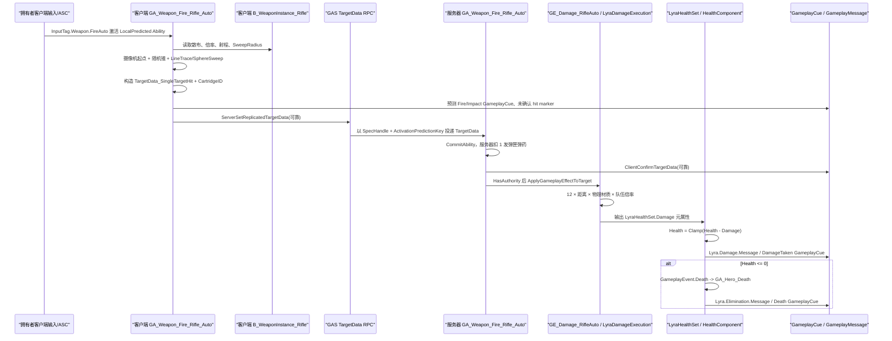

# Lyra 5.8 学习计划与自动步枪开火竖切全链路分析

> 工程：`D:\GameDev\Unreal_Projects\LyraStarterGame`  
> 引擎：Unreal Engine 5.8.0，工程 `EngineAssociation = 5.8`  
> 分析日期：2026-07-15  
> 核心竖切：Enhanced Input -> GameplayTag -> GAS -> 装备 -> 预测 -> TargetData -> 伤害 -> Health/Death -> GameplayMessage -> 动画 -> GameplayCue -> MetaSound -> Niagara

## 0. 文档定位与证据标准

这不是一份只解释概念的 Lyra 导读，而是一份可以拿来逐帧调试的工程地图。文档同时回答三类问题：

1. 初学 Lyra 应按什么顺序学习，才能避免在 Experience、GameFeature、GAS、装备和资产之间来回迷路。
2. 玩家装备自动步枪并按住开火键后，数据究竟经过哪些对象、函数、网络边界和资产图。
3. 当表现不对、伤害不对、客户端与服务器不同步时，应在哪个文件、函数、资产节点或参数处验证。

本报告采用四级证据标记。正文中没有反复写标记时，默认遵守以下原则：

| 级别 | 含义 | 本报告的使用方式 |
|---|---|---|
| A | 直接代码证据 | C++/配置文件给出绝对路径、函数名和当前工程行号 |
| B | 编辑器内结构化资产证据 | UE 5.8 实际加载 `.uasset` 后读取 CDO、属性、蓝图图表、节点、引脚、MetaSound 文档或 Niagara 拓扑 |
| C | 资产依赖和引用证据 | Asset Registry、GameplayTag、GameplayCue、Object/Asset Toolset 的 dependency/referencer 结果 |
| D | 由 A～C 推导的运行时解释 | 明确使用“因此”“意味着”“推断”措辞，不伪装成直接观测 |

资产没有文本源码行号，因此资产定位统一使用：

```text
绝对 .uasset 路径
  + 对象路径 / GeneratedClass / CDO
  + Graph 名称
  + Node 标题或类型
  + 关键输入值
  + 引脚连接方向
```

本次分析没有修改 Lyra 的源码或内容资产。为读取资产图，启动了单独的只读 UE 5.8 编辑器/MCP 会话；报告生成完成后关闭该辅助进程。

## 1. 先建立正确的总模型

Lyra 自动步枪开火不是“左键调用 Rifle Actor 的 Fire()”。它是两条数据链在 AbilitySpec 上汇合，再由 GAS 预测协议把本地响应和服务器权威连接起来：

```mermaid
flowchart LR
    A["LeftMouseButton / Gamepad Right Trigger"] --> B["IMC_Default"]
    B --> C["IA_Weapon_Fire_Auto"]
    C --> D["InputData_Hero: InputTag.Weapon.FireAuto"]
    D --> E["LyraInputComponent / HeroComponent"]
    E --> F["Lyra ASC input queues"]

    G["ID_Rifle inventory item"] --> H["WID_Rifle equipment definition"]
    H --> I["B_WeaponInstance_Rifle"]
    H --> J["AbilitySet_ShooterRifle"]
    J --> K["GA_Weapon_Fire_Rifle_Auto AbilitySpec"]
    I -->|"SourceObject"| K
    J -->|"DynamicSpecSourceTags += FireAuto"| K

    F -->|"HasTagExact"| K
    K --> L["LocalPredicted activation"]
    L --> M["Local trace + TargetData"]
    M --> N["Predicted Fire/Impact Cue"]
    M --> O["ServerSetReplicatedTargetData"]
    O --> P["Server Commit and ammo cost"]
    P --> Q["GE_Damage_RifleAuto"]
    Q --> R["LyraDamageExecution"]
    R --> S["LyraHealthSet / HealthComponent"]
    S --> T["Damage / Elimination messages"]
    S --> U["Death ability / cues"]
```



必须先记住六个边界：

| 边界 | 结论 |
|---|---|
| 输入与 Ability | InputAction 不直接引用 Rifle Ability；`InputTag.Weapon.FireAuto` 是路由键 |
| 物品与装备 | `ID_Rifle` 是库存定义；`WID_Rifle` 决定装备实例、授予能力和生成表现 Actor |
| 装备实例与表现 Actor | `B_WeaponInstance_Rifle` 持有散布等运行状态；`B_Rifle` 主要是附着 Mesh/表现 |
| 预测与权威 | 客户端预测激活、Trace、Cue 和 hit marker；服务器权威扣弹、GE、Health 和死亡 |
| GameplayCue 与 GameplayMessage | Cue 负责 GAS 表现事件及其网络语义；Message 是每个 World 内的解耦消息总线 |
| 动画、音频与 VFX | Ability/Cue 只发送上下文；动画层、MetaSound 参数和 Niagara User Parameters 决定最终表现 |

## 2. 最重要的审计结论

### 2.1 自动步枪真正使用 `FireAuto`

`IMC_Default` 把同一左键同时映射给 `IA_Weapon_Fire` 和 `IA_Weapon_Fire_Auto`。`InputData_Hero` 又分别映射成 `InputTag.Weapon.Fire` 与 `InputTag.Weapon.FireAuto`。当前装备授予的 AbilitySpec 是否拥有对应 DynamicSpecSourceTag，决定哪个动作真正命中能力。

`AbilitySet_ShooterRifle` 给 `GA_Weapon_Fire_Rifle_Auto` 配置的是 `InputTag.Weapon.FireAuto`，所以调试自动步枪时只观察 `InputTag.Weapon.Fire` 会得出错误结论。

### 2.2 全自动是“反复激活短 Ability”，不是一个无限循环 Ability

每次射击 Ability 用 `FireDelayTimeSecs = 0.12` 的 Timer 结束。只要输入仍在 `InputHeldSpecHandles` 中，`ActivationPolicy = WhileInputActive` 会让 ASC 在后续帧再次尝试激活。理论节拍约为 `8.33` 发/秒。

这使每发子弹都有独立的 ActivationPredictionKey、Commit、成本、TargetData 和 Cue 上下文，便于预测和失败处理。

### 2.3 命中几何由拥有者客户端产生，当前服务器不重算

`PerformLocalTargeting()` 仅在 locally controlled Pawn 上执行。拥有者客户端构造完整 `FHitResult`，通过可靠 GAS TargetData RPC 发送给服务器。服务器使用 AbilitySpecHandle 与 ActivationPredictionKey 投递给对应 Ability。

当前 Lyra 示例把 `bIsTargetDataValid` 直接设为 `true`；引擎 RPC `_Validate` 仅确认 TargetData 元素指针有效，不验证距离、遮挡、视角、散布、射速或物理材质。因此：

- 服务器仍然权威决定弹药、GE、队伍规则、Health、Death。
- 服务器并不权威证明客户端报告的命中几何真实。
- 生产级对战项目必须增加服务器重射线、回溯或至少距离/角度/遮挡/射速/材质合理性验证。

### 2.4 当前步枪的基础伤害是 12

`GE_Damage_RifleAuto` 将 BaseDamage 配为 `12`。`B_WeaponInstance_Rifle` 的距离倍率在 `0～2800 cm` 为 `1.0`，从 `2801 cm` 起近似阶跃为 `0.5`；`Gameplay.Zone.WeakSpot` 物理材质再乘 `1.5`。

| 距离 | 普通部位 | WeakSpot |
|---|---:|---:|
| 0～2800 cm | 12 | 18 |
| 2801～25000 cm | 6 | 9 |

上表仍需乘队伍交互倍率，并可能被 DamageImmunity、GodMode 或其他 GE 规则阻断。

### 2.5 `TraceMaxDistance=10000` 不是这条 Native 路径的真实射程

`GA_Weapon_Fire` 上可看到旧的/遗留蓝图变量 `TraceMaxDistance=10000`，但 Native Targeting 从 `B_WeaponInstance_Rifle.MaxDamageRange=25000` 读取实际射线长度。学习资产时不能只靠变量名猜调用者，必须回到函数读取点。

### 2.6 GameplayCue 注册工具返回空不等于 Cue 不存在

本次 `GameplayCueToolset.FindCueNotifyAssets/GetCueInfo` 对 GameFeature 下的 Rifle Cue 返回空，但以下独立证据共同证明映射存在：

- GameplayTag 引用器找到 `GA_Weapon_Fire` 与 Rifle Cue 资产。
- `GCN_Weapon_Rifle_Fire` CDO 的 `gameplayCueTag` 为 `GameplayCue.Weapon.Rifle.Fire`。
- Ability 的 Class Defaults 与蓝图节点显式执行该 Cue。

这属于 Toolset Cue 注册视图的限制或未刷新状态，不应被解释成运行时没有 Cue。

## 3. 如何使用这份报告

第一次阅读不要从 MetaSound 的 100 多个节点开始。建议按以下顺序：

1. 先完成第 4 节的 12 周计划中第 1～4 周，建立 Experience、PawnData、Input、ASC、Equipment 的对象关系。
2. 按“卷一”逐断点走通输入 Tag 到 Ability 激活。
3. 按“卷二”走通装备、TargetData、Commit、GE、Health 和消息。
4. 最后阅读表现资产卷，跟踪同一份 CueParameters/HitResult 如何变成 Montage、声音和粒子。
5. 修改任何参数前，先在报告中找到“谁读取该字段”。只有被当前路径读取的字段才会改变结果。

调试网络问题时，日志至少包含：

```text
World NetMode
Actor LocalRole / RemoteRole
AbilitySpecHandle
ActivationPredictionKey
ScopedPredictionKey
CartridgeID
TargetData UniqueId
IsLocallyControlled
HasAuthority
```

只打印函数名会把客户端预测调用和服务器权威调用混在一起。

# 第一卷：12 周详细学习计划

## 4. 学习策略与环境准备

### 4.1 每周固定工作法

每周按五个动作循环：

| 动作 | 目的 | 最低产出 |
|---|---|---|
| 读 | 只读本周列出的入口文件和资产 | 一张对象关系图，标出 Owner/Outer/SourceObject |
| 跟 | 在 PIE 中按推荐断点走一次 | 一份带 NetMode、Role、Handle、Tag 的日志 |
| 改 | 只改一个参数或节点 | 写下预期、实际结果、读取该参数的函数 |
| 破 | 故意制造一个失败条件 | 能解释失败 Tag、预测失败或表现缺失发生在哪一层 |
| 复盘 | 用自己的话重画调用链 | 不看报告仍能从入口说到本周终点 |

### 4.2 推荐 PIE 配置

至少保存三套测试配置：

| 配置 | 用途 |
|---|---|
| Standalone | 先理解纯本地对象生命周期和资产表现 |
| 2 Players + Listen Server | 观察主机玩家与远端玩家的 locally controlled 差异 |
| 2 Players + Dedicated Server | 验证客户端 Trace、TargetData RPC 与服务器权威边界 |

网络测试时开启 AbilitySystem 和 GameplayCue 相关调试显示，并在客户端与服务器窗口中区分颜色或前缀。不要只在单人 PIE 中得出预测结论。

### 4.3 建立个人索引

在学习笔记中为每个对象固定记录以下字段：

| 字段 | 示例 |
|---|---|
| 静态定义 | `ID_Rifle`、`WID_Rifle`、`AbilitySet_ShooterRifle` |
| 运行实例 | `InventoryItemInstance`、`B_WeaponInstance_Rifle`、AbilitySpec |
| Owner/Outer | EquipmentInstance 的 Outer 是 Pawn；ASC Owner 是 PlayerState |
| 网络创建者 | Equipment 和 Ability 授予由 Authority 执行 |
| 复制方式 | FastArray、replicated subobject、属性复制、GAS RPC |
| 路由键 | InputTag、AbilityTag、GameplayCue Tag、Message Channel |
| 表现消费者 | Anim Layer、Cue Notify、MetaSound、Niagara |

## 5. 第 1 周：Experience、GameFeature 与 Pawn 初始化

目标：回答“为什么 ShooterMap 会得到 Shooter Hero、输入上下文和 ShooterCore 资产”。

| 天 | 阅读/操作 | 必须得到的结论 |
|---:|---|---|
| 1 | 阅读 `LyraStarterGame.uproject`、GameFeature 插件目录、ShooterCore 的 `GameFeatureData` | 区分工程插件、GameFeature 插件和内容挂载路径 `/ShooterCore` |
| 2 | 追 `LyraExperienceDefinition`、`LyraExperienceActionSet`、Experience Manager | 理解 Experience 是运行时组合，而不是传统 GameMode 的全部配置 |
| 3 | 打开 `HeroData_ShooterGame`、`AbilitySet_ShooterHero`、`TagRelationships_ShooterHero` | 记录 PawnClass、常驻 AbilitySet、InputConfig、TagRelationshipMapping |
| 4 | 追 `LyraPlayerState::SetPawnData` 与 `LyraPawnExtensionComponent::InitializeAbilitySystem` | 解释为什么 ASC 在 PlayerState、Avatar 是 Pawn |
| 5 | 两客户端 PIE，记录 Experience Loaded、PawnData 设置和 ASC ActorInfo 初始化顺序 | 能画出 Experience -> PawnData -> PlayerState ASC -> Pawn Avatar |

本周关键文件/资产：

```text
D:\GameDev\Unreal_Projects\LyraStarterGame\Source\LyraGame\GameModes\LyraExperienceDefinition.*
D:\GameDev\Unreal_Projects\LyraStarterGame\Source\LyraGame\GameModes\LyraExperienceManagerComponent.*
D:\GameDev\Unreal_Projects\LyraStarterGame\Source\LyraGame\Player\LyraPlayerState.cpp
D:\GameDev\Unreal_Projects\LyraStarterGame\Source\LyraGame\Character\LyraPawnExtensionComponent.cpp
D:\GameDev\Unreal_Projects\LyraStarterGame\Plugins\GameFeatures\ShooterCore\Content\Game\HeroData_ShooterGame.uasset
```

实验：把 HeroData 的一个非核心 CameraMode 或测试 AbilitySet 换成可观察变体，验证变更来自 PawnData，而不是 Pawn 蓝图硬编码。完成后还原。

验收：能解释 PlayerState ASC 的持久性收益，也能指出装备 Ability 为什么不属于 `AbilitySet_ShooterHero`。

## 6. 第 2 周：Enhanced Input 与 GameplayTag 路由

目标：从物理按键走到 `ULyraAbilitySystemComponent::AbilityInputTagPressed/Released`。

| 天 | 阅读/操作 | 必须得到的结论 |
|---:|---|---|
| 1 | 打开 `IMC_Default`、`IA_Weapon_Fire`、`IA_Weapon_Fire_Auto` | 同一物理键可以驱动半自动和全自动两个 Action |
| 2 | 打开 `InputData_Hero`，阅读 `LyraInputConfig` | InputAction 与 InputTag 是数据资产关系，不是 Ability 引用 |
| 3 | 阅读 `LyraInputComponent::BindAbilityActions` | `Triggered` 与 `Completed` 如何把 Tag 作为 delegate 参数传递 |
| 4 | 阅读 `LyraHeroComponent::InitializePlayerInput` 与 Input 回调 | 映射上下文和 Action binding 是两层机制 |
| 5 | 在 FireAuto pressed/released 处断点，观察左右键、手柄和 Tag | 确认自动步枪命中 `InputTag.Weapon.FireAuto` |

本周实验：

1. 暂时把 `IA_Weapon_Fire_Auto` 映射到另一个键，只改变 Input Mapping，不改 Ability。
2. 暂时把 `InputData_Hero` 的 FireAuto Tag 改成不存在于 Rifle Spec 的 Tag，观察输入事件仍发生但 Ability 不激活。
3. 记录 `RemoveAdditionalInputConfig` 当前未实现对 GameFeature 热停用的影响。

验收：能够明确区分 MappingContext、InputConfig、InputTag、AbilityTag 四个概念。

## 7. 第 3 周：GAS AbilitySpec、AbilitySet 与 Tag 资格检查

目标：理解 Ability 如何被授予、如何被输入选中、如何被 Tag 阻止。

| 天 | 阅读/操作 | 必须得到的结论 |
|---:|---|---|
| 1 | 阅读 `LyraAbilitySet.h/.cpp` | AbilitySet 如何创建 Spec、写 SourceObject 和 DynamicSpecSourceTags |
| 2 | 阅读 `LyraAbilitySystemComponent::ProcessAbilityInput` | Pressed、Held、Released 三组 Handle 与激活策略 |
| 3 | 阅读 `LyraGameplayAbility` ActivationPolicy/Group | `OnInputTriggered`、`WhileInputActive`、`OnSpawn` 的调度差异 |
| 4 | 阅读 TagRelationshipMapping 和 `DoesAbilitySatisfyTagRequirements` | AbilityTags 与 ASC OwnedTags 如何参与 required/blocked/cancel |
| 5 | 引擎源码跟 `TryActivateAbility -> InternalTryActivateAbility` | 看到 Lyra 调度如何进入通用 GAS |

实验：给 Pawn 临时添加 `Gameplay.AbilityInputBlocked`，再给武器 Source 添加 `Ability.Weapon.NoFiring`，比较两者阻断范围和 FailureTag。

验收：能解释 `InputTag.Weapon.FireAuto`、`Ability.Type.Action.WeaponFire`、`Event.Movement.WeaponFire`、`Ability.Weapon.NoFiring` 的不同职责。

## 8. 第 4 周：库存、QuickBar、装备与 SourceObject

目标：从 `ID_Rifle` 走到装备实例和 Rifle AbilitySpec。

| 天 | 阅读/操作 | 必须得到的结论 |
|---:|---|---|
| 1 | 打开 `ID_Rifle` 的 5 个 Fragment | ItemDefinition 如何组合 Equippable、Stats、Reticle、Icon |
| 2 | 打开 `WID_Rifle` | InstanceType、AbilitySetsToGrant、ActorsToSpawn 三个数据面 |
| 3 | 阅读 QuickBar Equip/Unequip | 物品实例如何找到 Equippable Fragment 并请求服务器装备 |
| 4 | 阅读 EquipmentManager FastArray 与 EquipmentInstance | Authority 创建、客户端复制、SpawnedActor 附着 |
| 5 | 在 `AbilitySet::GiveToAbilitySystem` 断点检查 SourceObject | 确认 SourceObject 是 `B_WeaponInstance_Rifle`，不是 `B_Rifle` |

实验：临时移除 `AbilitySet_ShooterRifle` 中的 Fire Ability，确认 Mesh 仍可装备但不能开火；再临时移除 ActorsToSpawn，确认 Ability 仍可存在但手中无枪模。

验收：能从定义/实例、玩法/表现、服务器创建/客户端复制三个维度解释装备系统。

## 9. 第 5 周：LocalPredicted 激活与预测键

目标：读懂客户端立即响应、服务器复验和拒绝的通用 GAS 协议。

| 天 | 阅读/操作 | 必须得到的结论 |
|---:|---|---|
| 1 | 检查 Rifle Ability 的 NetExecutionPolicy、ReplicationPolicy、InstancingPolicy | LocalPredicted 不等于客户端权威 |
| 2 | 跟引擎 `TryActivateAbility/InternalTryActivateAbility` | 看到客户端创建 ScopedPredictionWindow |
| 3 | 跟 `CallServerTryActivateAbility` 与服务器复验 | 同一个 SpecHandle 和 PredictionKey 如何会合 |
| 4 | 制造服务器 Cost 不足 | 观察客户端预测开始、服务器 Commit 失败、预测拒绝/结束 |
| 5 | 对比 Standalone、Listen、Dedicated | locally controlled 与 Authority 是两个独立维度 |

实验日志必须包含原始 ActivationPredictionKey 与 ScopedPredictionKey，避免把激活预测键和 TargetData 发送时的新作用域混为一谈。

验收：能够画出 Client Prediction、Server Acceptance、Server Rejection 三条时序。

## 10. 第 6 周：Ranged Weapon Targeting、散布与 HitResult

目标：从 `StartRangedWeaponTargeting` 走到 TargetData 构造。

| 天 | 阅读/操作 | 必须得到的结论 |
|---:|---|---|
| 1 | 阅读 `GetTargetingTransform` | 命中方向以摄像机/准星为主，不以枪口 Mesh 为主 |
| 2 | 阅读随机锥采样和 WeaponInstance Heat/Spread | BaseSpread、姿态倍率、FirstShotAccuracy 如何合成 |
| 3 | 阅读 LineTrace + 辅助 SphereSweep | 5.5 cm Sweep 是瞄准宽容，且不能越过更早阻挡物 |
| 4 | 观察 PhysicalMaterial 和 WeakSpot | Complex Trace、PhysMat Tag 与 1.5 倍材质倍率 |
| 5 | 在近墙、远距离、蹲伏、跳跃、ADS 条件测试 | 将参数变化与实际读取函数逐一对应 |

实验：把 `BulletTraceSweepRadius` 改为 0 和 20 对比角色边缘命中；把 2800/2801 距离曲线改为平滑曲线，确认伤害变化而非射线长度变化。

验收：能指出 `TraceMaxDistance=10000` 为什么不是本路径真实射程。

## 11. 第 7 周：TargetData RPC、服务器接收与安全边界

目标：理解 TargetData 如何使用 AbilityHandle/PredictionKey 缓存与投递。

| 天 | 阅读/操作 | 必须得到的结论 |
|---:|---|---|
| 1 | 阅读 `FLyraGameplayAbilityTargetData_SingleTargetHit` | 基类 HitResult 加 CartridgeID，二者都在 TargetData RPC 中序列化 |
| 2 | 阅读 `OnTargetDataReadyCallback` | 客户端上传、本地 Commit、服务器确认和蓝图事件共用同一回调 |
| 3 | 阅读引擎 `ServerSetReplicatedTargetData` | 缓存键、Reliable RPC、delegate 广播与消费 |
| 4 | 审计 `_Validate` 和 `bIsTargetDataValid` | 明确当前没有几何、射速、材质服务器验证 |
| 5 | 写一份生产验证方案 | 至少覆盖距离、角度、遮挡、历史位置、射速、PhysMat |

实验：在测试分支人为修改客户端 TraceEnd 或 HitResult，观察服务器仍可能接受 TargetData；不要在公共联机环境使用该实验。

验收：能区分“服务器权威应用伤害”与“服务器权威验证命中”这两个不同命题。

## 12. 第 8 周：GameplayEffect、ExecutionCalculation 与 Health/Death

目标：走通 `GE_Damage_RifleAuto -> LyraDamageExecution -> HealthSet -> HealthComponent`。

| 天 | 阅读/操作 | 必须得到的结论 |
|---:|---|---|
| 1 | 打开 Damage GE 继承链 | Instant、Execution、BaseDamage=12、DamageTaken Cue 从何处继承 |
| 2 | 阅读 `LyraDamageExecution` | BaseDamage × Distance × PhysMat × TeamMultiplier |
| 3 | 阅读 EffectContext | HitResult、Origin、AbilitySource、EffectCauser 的职责 |
| 4 | 阅读 HealthSet Pre/Post Execute | Damage 元属性、免伤、扣 Health、Damage Message |
| 5 | 阅读 HealthComponent 与 Death Ability | GameplayEvent.Death、Dying/Dead Tag、Elimination Message |

实验：分别测试普通命中、WeakSpot、28 m 前后、同队目标、DamageImmunity、致死伤害，记录每一层是否执行。

验收：能解释 hit marker 成功为什么不必然等于 Health 真正下降。

## 13. 第 9 周：GameplayCue 与 GameplayMessage

目标：分清 Cue 的网络表现语义和 Message 的本地解耦语义。

| 天 | 阅读/操作 | 必须得到的结论 |
|---:|---|---|
| 1 | 打开 `GA_Weapon_Fire` 的 Fire/Impact Cue 节点 | 预测客户端与服务器为何都会执行图 |
| 2 | 打开 `GCN_Weapon_Rifle_Fire.OnBurst` | CueParameters 如何拆成武器、表面、音频和 VFX 输入 |
| 3 | 打开 `GCN_Weapon_Impact` 数据 | SurfaceType 如何选择不同 MetaSound/粒子 |
| 4 | 打开 `GCNL_Character_DamageTaken` | Cue 如何转换并广播 `Lyra.Damage.Taken.Message` |
| 5 | 阅读 Assist/Elim processors | 核心 Health 如何通过 VerbMessage 解耦模式玩法 |

实验：分别关闭 Fire Cue、Impact Cue、DamageTaken Cue，记录“枪口表现、世界冲击、扣血反馈、计分消息”哪些仍存在。

验收：能明确回答 GameplayMessageSubsystem 的 Broadcast 为什么不会自动跨网络。

## 14. 第 10 周：动画层、Montage 与武器姿态

目标：把装备动画、开火 Montage、AnimLayer 与状态 Tag 连起来。

| 天 | 阅读/操作 | 必须得到的结论 |
|---:|---|---|
| 1 | 阅读 `B_WeaponInstance_Base` 的 OnEquipped/OnUnequipped | Cosmetic Tags 如何选择 Rifle/Unarmed/Feminine Anim Layer |
| 2 | 打开 `ABP_RifleAnimLayers` | 逐 Slot/Layer 查找 Rifle pose 覆盖点 |
| 3 | 打开 `AM_MM_Rifle_Fire` | Montage Slot、Section、Notify、长度与 0.12 s Ability 周期的关系 |
| 4 | 观察 `Event.Movement.WeaponFire` | 状态 Tag 是否被 AnimBP/移动逻辑消费，不要凭命名假设 |
| 5 | 高延迟测试 Montage | 区分预测播放、服务器实例和远端观察者表现 |

实验：替换 CharacterFireMontage 的 Slot 或缩放 AutoRate，记录 Ability Timer 与 Montage 生命周期是否仍匹配。

验收：能说明 Ability End 时 `bStopWhenAbilityEnds=false` 为什么不会强制截断 Montage。

## 15. 第 11 周：MetaSound 与 Niagara

目标：从 GameplayCue 的参数设置走到音频图和粒子发射器。

| 天 | 阅读/操作 | 必须得到的结论 |
|---:|---|---|
| 1 | 追 `GCN_Weapon_Rifle_Fire -> TriggerFireAudio/SetWeaponSoundParams` | MagazineAmmo、距离、表面/空间参数如何进入音频组件 |
| 2 | 打开 `MSS_Weapons_Rifle_Fire` | 识别 Close/Mech/Interior/Distant/Far/Tail 层、随机、距离映射、压缩和混音 |
| 3 | 打开 `sfx_Weapon_FullyAutomatic_lp_meta` | 识别 OnPlay/OnStop、ShotsPerSecond、Click/Tail/SubLayer 等循环自动武器结构 |
| 4 | 打开 `B_WeaponFire` 与三个 Niagara System | Trigger、Direction、ImpactPositions、Shell Mesh 等 User Parameter 的写入点 |
| 5 | 打开 `NS_ImpactDataChannel` | Impact Data Channel 如何让多个 Surface/VFX emitter 共享命中数据 |

实验：把 `User.Trigger` 固定为 false、移除 ImpactPositions 或把 ShotsPerSecond 改为 4/16，确认是哪一层停止响应。

验收：能从蓝图 SetNiagaraVariable/Audio 参数节点一直说到具体 MetaSound/Niagara 模块。

## 16. 第 12 周：独立重建与生产化改造

目标：不复制 Lyra 资产，自己实现一个最小但网络正确的武器竖切。

| 天 | 实作 | 验收标准 |
|---:|---|---|
| 1 | 新建 ItemDefinition、EquipmentDefinition、WeaponInstance、AbilitySet | 装备/卸下正确授予和移除 Ability |
| 2 | 新建 InputAction/InputConfig/Tag | 同一 Ability 可换键而不修改 Ability 代码 |
| 3 | 新建 LocalPredicted fire ability 与 TargetData | 两客户端 Dedicated Server 下无重复伤害 |
| 4 | 新建 Damage GE/Execution/Cue/Message | 普通、弱点、死亡和 UI 消息可验证 |
| 5 | 增加服务器命中验证 | 能拒绝伪造距离、穿墙、非法射速或不一致 PhysMat |

最终交付物应包含：

1. 一张完整时序图，分别标出 owning client、server、simulated proxy。
2. 一份资产清单，说明每个 Definition/Instance/Actor 的职责和生命周期。
3. 一份断点日志，包含 SpecHandle、PredictionKey、CartridgeID 和 TargetData 数量。
4. 一份作弊/错误用例表，说明服务器在哪一层拒绝。
5. 一份性能记录，至少统计 Trace、Cue、Niagara emitter 和 MetaSound voice 数量。

验收：在不打开 Lyra 原 Rifle 资产的情况下，能够从自己的输入资产一路解释到远端玩家看到和听到的结果。

## 17. 贯穿 12 周的断点阶梯

以下顺序可以在一次 Dedicated Server + 2 Clients 测试中贯穿整条竖切：

| # | 断点 | 观察值 |
|---:|---|---|
| 1 | `FLyraEquipmentList::AddEntry` | Authority、EquipmentDefinition、InstanceType |
| 2 | `ULyraAbilitySet::GiveToAbilitySystem` | SourceObject、InputTag、返回 SpecHandle |
| 3 | `ULyraHeroComponent::Input_AbilityInputTagPressed` | `InputTag.Weapon.FireAuto` |
| 4 | `ULyraAbilitySystemComponent::AbilityInputTagPressed` | `HasTagExact` 命中的 Spec |
| 5 | `ULyraAbilitySystemComponent::ProcessAbilityInput` | Held、WhileInputActive、AbilitiesToActivate |
| 6 | GAS `InternalTryActivateAbility` | LocalPredicted、PredictionKey、CanActivate 结果 |
| 7 | `ULyraGameplayAbility_RangedWeapon::ActivateAbility` | SpecHandle 与 ActivationPredictionKey |
| 8 | `StartRangedWeaponTargeting` | 只在 locally controlled 侧 Trace |
| 9 | `OnTargetDataReadyCallback` | 客户端一次、服务器一次；TargetData、CartridgeID |
| 10 | GAS `ServerSetReplicatedTargetData_Implementation` | 缓存键和服务器收到的 HitResult |
| 11 | `ULyraAbilityCost_ItemTagStack::ApplyCost` | 仅 Authority 扣 MagazineAmmo |
| 12 | `ULyraDamageExecution::Execute_Implementation` | BaseDamage、距离、PhysMat、TeamMultiplier |
| 13 | `ULyraHealthSet::PostGameplayEffectExecute` | Damage 元属性、旧/新 Health |
| 14 | `ULyraHealthComponent::HandleOutOfHealth` | GameplayEvent.Death、Elimination Message |
| 15 | `ULyraGameplayAbility_Death::ActivateAbility` | Ability 取消、Death Tags、Cue |

## 18. 建议的二次阅读问题

完成每一卷后，尝试不用搜索回答：

1. 为什么 Rifle Ability 不放在 Hero 的 AbilitySet？
2. 为什么左键同时映射两个 InputAction 不会让 Rifle 同时开两次火？
3. AbilitySpec.SourceObject 与 EffectCauser 有何不同？
4. `ActivationPredictionKey` 和发送 TargetData 时的 `ScopedPredictionKey` 各自解决什么问题？
5. 为什么 Dedicated Server 不调用本地 Trace，却仍能运行同一 Ability 蓝图的伤害分支？
6. 为什么服务器确认 hit marker 后仍可能不扣血？
7. `GameplayCue.Weapon.Rifle.Impact` 与 `GameplayCue.Character.DamageTaken` 分别代表什么事件？
8. 为什么 `B_Rifle` 没有核心开火图，而 `B_WeaponFire` 有大量 VFX 节点？
9. MetaSound 中距离分层与 Niagara 中 User Parameters 的数据来源分别在哪里？
10. 如果要做反作弊，最应该替换或扩展哪一个 TargetData 验证点？

# 第二卷：Enhanced Input、GameplayTag 与 GAS 激活

---

# Lyra 步枪开火：Enhanced Input -> GameplayTag -> GAS 激活完整链路

> 分析工程：`D:\GameDev\Unreal_Projects\LyraStarterGame`
>
> 工程版本证据：`D:\GameDev\Unreal_Projects\LyraStarterGame\LyraStarterGame.uproject:3` 指定 `EngineAssociation = 5.8`；同文件 `:36-38` 和 `:68-70` 分别启用 `GameplayAbilities`、`EnhancedInput`。
>
> 本文只覆盖“输入进入 GAS 并激活步枪开火 Ability”这段。命中判定、伤害、消息、动画、GameplayCue、音频和 Niagara 应接续其他章节。

## 1. 一句话总览

Lyra 的步枪开火不是 `InputAction` 直接调用某个 Ability，也不是靠 GAS 的旧式整数 `InputID`：

```text
LeftMouseButton / Gamepad_RightTrigger
  -> IMC_Default 同时驱动 IA_Weapon_Fire 与 IA_Weapon_Fire_Auto
  -> InputData_Hero 把 IA_Weapon_Fire_Auto 映射为 InputTag.Weapon.FireAuto
  -> ULyraInputComponent 将 Triggered / Completed 绑定到 HeroComponent
  -> HeroComponent 把 GameplayTag 转交给 ULyraAbilitySystemComponent
  -> ASC 在 ActivatableAbilities 中按 AbilitySpec.DynamicSpecSourceTags 精确匹配
  -> 匹配到装备步枪时授予的 GA_Weapon_Fire_Rifle_Auto Spec
  -> PostProcessInput 中按 WhileInputActive 策略统一调用 TryActivateAbility
  -> GAS 依据 LocalPredicted 生成 PredictionKey，客户端立即执行并 RPC 到服务器复验
```

最关键的解耦点是 `InputTag.Weapon.FireAuto`：输入资产只知道 Tag；装备 AbilitySet 只把同一个 Tag 写到 AbilitySpec；ASC 在运行时把两端匹配起来。

## 2. 关键资产清单与实测值

以下 `.uasset` 的字段来自本机 UE 5.8 通过 `UnrealEditor-Cmd` 实际加载后的 CDO/属性反射；蓝图父类和少量节点信息同时由资产二进制元数据复核。二进制资产不存在“源码行号”，所以资产部分精确到对象、字段、数组索引和节点类型。

### 2.1 角色与输入资产

#### `D:\GameDev\Unreal_Projects\LyraStarterGame\Plugins\GameFeatures\ShooterCore\Content\Game\HeroData_ShooterGame.uasset`

对象路径：`/ShooterCore/Game/HeroData_ShooterGame.HeroData_ShooterGame`

类型：`ULyraPawnData`

字段：

| 字段 | 实际值 | 作用 |
|---|---|---|
| `PawnClass` | `/ShooterCore/Game/B_Hero_ShooterMannequin.B_Hero_ShooterMannequin_C` | 射手角色 Pawn |
| `AbilitySets[0]` | `/ShooterCore/Game/AbilitySet_ShooterHero.AbilitySet_ShooterHero` | 角色常驻 Ability；不含步枪开火 |
| `TagRelationshipMapping` | `/ShooterCore/Game/TagRelationships_ShooterHero.TagRelationships_ShooterHero` | 扩展 Ability Tag 的 required/blocked/cancel 关系 |
| `InputConfig` | `/Game/Input/InputData_Hero.InputData_Hero` | InputAction -> GameplayTag 映射 |
| `DefaultCameraMode` | `/Game/Characters/Cameras/CM_ThirdPerson.CM_ThirdPerson_C` | 默认相机 |

#### `D:\GameDev\Unreal_Projects\LyraStarterGame\Content\Input\InputData_Hero.uasset`

对象路径：`/Game/Input/InputData_Hero.InputData_Hero`

类型：`ULyraInputConfig`

`AbilityInputActions` 实测共 6 项：

| 数组索引 | InputAction | InputTag |
|---:|---|---|
| 0 | `/Game/Input/Actions/IA_Jump` | `InputTag.Jump` |
| 1 | `/Game/Input/Actions/IA_Weapon_Reload` | `InputTag.Weapon.Reload` |
| 2 | `/Game/Input/Actions/IA_Ability_Heal` | `InputTag.Ability.Heal` |
| 3 | `/Game/Input/Actions/IA_Ability_Dash` | `InputTag.Ability.Dash` |
| 4 | `/Game/Input/Actions/IA_Weapon_Fire` | `InputTag.Weapon.Fire` |
| 5 | `/Game/Input/Actions/IA_Weapon_Fire_Auto` | `InputTag.Weapon.FireAuto` |

这里同时保留半自动与全自动两个逻辑动作。装备的 AbilitySet 决定哪个 Tag 最终能命中 AbilitySpec，而不是输入层判断当前拿的是哪把枪。

#### `D:\GameDev\Unreal_Projects\LyraStarterGame\Content\Input\Actions\IA_Weapon_Fire.uasset`

类型：`UInputAction`

字段：

- `ValueType = Boolean`
- `bConsumeInput = true`
- `bTriggerWhenPaused = false`
- `Triggers[0] = UInputTriggerPressed`
- `Modifiers = []`

因此它是一次按下型输入，面向手枪、霰弹枪一类 `InputTag.Weapon.Fire` Ability。

#### `D:\GameDev\Unreal_Projects\LyraStarterGame\Content\Input\Actions\IA_Weapon_Fire_Auto.uasset`

类型：`UInputAction`

字段：

- `ValueType = Boolean`
- `bConsumeInput = true`
- `bTriggerWhenPaused = false`
- `Triggers = []`
- `Modifiers = []`

没有显式 `Pressed` Trigger；按键值保持非零时，Enhanced Input 的 `Triggered` 可持续发生。该动作映射到 `InputTag.Weapon.FireAuto`，与步枪 AbilitySet 对接。

#### `D:\GameDev\Unreal_Projects\LyraStarterGame\Content\Input\Mappings\IMC_Default.uasset`

对象路径：`/Game/Input/Mappings/IMC_Default.IMC_Default`

类型：`UInputMappingContext`

与步枪开火直接相关的 4 项映射：

| InputAction | Key | Mapping 级 Trigger/Modifier |
|---|---|---|
| `IA_Weapon_Fire` | `LeftMouseButton` | 无 |
| `IA_Weapon_Fire_Auto` | `LeftMouseButton` | 无 |
| `IA_Weapon_Fire` | `Gamepad_RightTrigger` | 无 |
| `IA_Weapon_Fire_Auto` | `Gamepad_RightTrigger` | 无 |

同一物理键故意同时喂给半自动和全自动两个 Action。是否真正激活由“当前装备授予了哪个 InputTag 的 AbilitySpec”决定。

#### `D:\GameDev\Unreal_Projects\LyraStarterGame\Plugins\GameFeatures\ShooterCore\Content\ShooterCore.uasset`

类型：`UGameFeatureData`

内部 `Actions` 包含 `UGameFeatureAction_AddInputContextMapping`；资产依赖和序列化字段明确引用：

- `/Game/Input/Mappings/IMC_Default`
- `/ShooterCore/Input/Mappings/IMC_ShooterGame`

射手 Pawn 的 `HeroComponent` 初始化时会先 `ClearAllMappings()`，随后发送 `BindInputsNow` 扩展事件；ShooterCore 的该 GameFeature Action 收到事件后重新加入映射上下文。对应 C++ 见第 4 节。

#### `D:\GameDev\Unreal_Projects\LyraStarterGame\Plugins\GameFeatures\ShooterCore\Content\Experiences\LAS_ShooterGame_SharedInput.uasset`

类型：`ULyraExperienceActionSet`

内部两个 Action：

1. `UGameFeatureAction_AddInputBinding`
   - `InputConfigs` 引用 `/ShooterCore/Input/Actions/InputData_ShooterGame_AddOns`
2. `UGameFeatureAction_AddInputContextMapping`
   - `InputMappings` 引用 `/ShooterCore/Input/Mappings/IMC_ShooterGame`

`InputData_ShooterGame_AddOns` 用于 ADS、手雷、快捷栏等 ShooterCore 附加能力。基础开火 Tag 来自 `InputData_Hero`，不要把两套 InputConfig 混为一谈。

### 2.2 步枪装备与 Ability 资产

#### `D:\GameDev\Unreal_Projects\LyraStarterGame\Plugins\GameFeatures\ShooterCore\Content\Weapons\Rifle\ID_Rifle.uasset`

蓝图生成类：`ID_Rifle_C`

Native Parent：`ULyraInventoryItemDefinition`

CDO `Fragments` 共 5 项：

1. `InventoryFragment_EquippableItem_0`
2. `InventoryFragment_QuickBarIcon_0`
3. `InventoryFragment_SetStats_0`
4. `InventoryFragment_PickupIcon_0`
5. `InventoryFragment_ReticleConfig_0`

其中 `InventoryFragment_EquippableItem_0.EquipmentDefinition` 引用 `WID_Rifle_C`。这使库存物品进入 QuickBar 激活槽时能转化为装备定义。

#### `D:\GameDev\Unreal_Projects\LyraStarterGame\Plugins\GameFeatures\ShooterCore\Content\Weapons\Rifle\WID_Rifle.uasset`

蓝图生成类：`WID_Rifle_C`

Native Parent：`ULyraEquipmentDefinition`

CDO 字段：

| 字段 | 实际值 |
|---|---|
| `InstanceType` | `/ShooterCore/Weapons/Rifle/B_WeaponInstance_Rifle.B_WeaponInstance_Rifle_C` |
| `AbilitySetsToGrant[0]` | `/ShooterCore/Weapons/Rifle/AbilitySet_ShooterRifle.AbilitySet_ShooterRifle` |
| `ActorsToSpawn` | 1 项，步枪装备 Actor |

#### `D:\GameDev\Unreal_Projects\LyraStarterGame\Plugins\GameFeatures\ShooterCore\Content\Weapons\Rifle\AbilitySet_ShooterRifle.uasset`

类型：`ULyraAbilitySet`

`GrantedGameplayAbilities` 实测：

| 索引 | Ability | Level | InputTag |
|---:|---|---:|---|
| 0 | `/ShooterCore/Weapons/Rifle/GA_Weapon_Fire_Rifle_Auto.GA_Weapon_Fire_Rifle_Auto_C` | 1 | `InputTag.Weapon.FireAuto` |
| 1 | `/ShooterCore/Weapons/Rifle/GA_Weapon_Reload_Rifle.GA_Weapon_Reload_Rifle_C` | 1 | `InputTag.Weapon.Reload` |
| 2 | `/Game/Weapons/GA_Weapon_AutoReload.GA_Weapon_AutoReload_C` | 1 | 无 |

这张表是“为什么按住左键会命中步枪开火 Ability”的资产侧最终答案。

#### `D:\GameDev\Unreal_Projects\LyraStarterGame\Plugins\GameFeatures\ShooterCore\Content\Game\AbilitySet_ShooterHero.uasset`

角色常驻 AbilitySet 共授予 11 个 Ability，例如 Jump、Dash、ADS、Grenade、Melee、Quickbar、SpawnEffect、Reset；它**不授予步枪开火**。步枪开火能力只在装备步枪时由 `AbilitySet_ShooterRifle` 授予，这保证卸下武器后 Spec 会一起移除。

#### `D:\GameDev\Unreal_Projects\LyraStarterGame\Plugins\GameFeatures\ShooterCore\Content\Weapons\Rifle\GA_Weapon_Fire_Rifle_Auto.uasset`

蓝图层级：

```text
GA_Weapon_Fire_Rifle_Auto_C
  -> /Game/Weapons/GA_Weapon_Fire.GA_Weapon_Fire_C
  -> /Script/LyraGame.LyraGameplayAbility_RangedWeapon
  -> ULyraGameplayAbility_FromEquipment
  -> ULyraGameplayAbility
  -> UGameplayAbility
```

资产元数据标记 `IsDataOnly = true`。EventGraph 中只保留父调用壳：

```text
K2Node_Event: K2_ActivateAbility
  -> K2Node_CallParentFunction: ActivateAbility
```

也就是说，步枪子类主要覆盖数据，核心开火图在 `/Game/Weapons/GA_Weapon_Fire.uasset`，核心本地瞄准/TargetData 支撑在 `ULyraGameplayAbility_RangedWeapon`。

CDO 实测关键属性：

| 属性 | 值 | 含义 |
|---|---|---|
| `ActivationPolicy` | `WhileInputActive` | 输入仍处于 active 时持续尝试激活 |
| `InstancingPolicy` | `InstancedPerActor` | 每个 Actor 保留一个 Ability 实例 |
| `NetExecutionPolicy` | `LocalPredicted` | 本地客户端先执行，再由服务器确认/拒绝 |
| `ReplicationPolicy` | `ReplicateYes` | Ability 实例参与复制 |
| `AbilityTags` | `Ability.Type.Action.WeaponFire` | 用于 Tag Relationship、阻断/取消分类 |
| `ActivationOwnedTags` | `Event.Movement.WeaponFire` | 激活期间 ASC 持有，动画/移动等系统可监听 |
| `SourceBlockedTags` | `Ability.Weapon.NoFiring` | 武器源被标记不可开火时拒绝激活 |

对应 Tag 注册：

- `Ability.Type.Action.WeaponFire`：`D:\GameDev\Unreal_Projects\LyraStarterGame\Config\DefaultGameplayTags.ini:25`
- `Event.Movement.WeaponFire`：`D:\GameDev\Unreal_Projects\LyraStarterGame\Plugins\GameFeatures\ShooterCore\Config\Tags\ShooterCoreTags.ini:8`
- `Ability.Weapon.NoFiring`：C++ Native Tag，见 `LyraGameplayAbility_RangedWeapon.cpp:40-41`

## 3. 输入和 GAS 的数据结构

### 3.1 InputAction -> InputTag

文件：`D:\GameDev\Unreal_Projects\LyraStarterGame\Source\LyraGame\Input\LyraInputConfig.h`

- `:19-31`：`FLyraInputAction` 只有两个核心字段：`InputAction` 与 `InputTag`。
- `:29-30`：编辑器把 Tag 选择器限制在 `InputTag` 分类。
- `:38-40`：`ULyraInputConfig` 是 `BlueprintType, Const` 的 `UDataAsset`。
- `:54-60`：明确分成 `NativeInputActions` 和 `AbilityInputActions`。

设计含义：移动、视角、蹲伏等 Native 输入由组件内 C++ 函数消费；Ability 输入走统一 Tag 路由。

文件：`D:\GameDev\Unreal_Projects\LyraStarterGame\Source\LyraGame\Input\LyraInputConfig.cpp`

- `:14-30`：`FindNativeInputActionForTag` 在线性数组中精确比较 Tag。
- `:32-48`：`FindAbilityInputActionForTag` 同理。

步枪主链在初始化时直接遍历 `AbilityInputActions`，并不调用 `FindAbilityInputActionForTag`；后者主要供外部按 Tag 查询。

### 3.2 AbilitySet InputTag -> AbilitySpec 动态标签

文件：`D:\GameDev\Unreal_Projects\LyraStarterGame\Source\LyraGame\AbilitySystem\LyraAbilitySet.h`

- `:25-43`：`FLyraAbilitySet_GameplayAbility` 定义 `Ability`、`AbilityLevel`、`InputTag`。
- `:40-42`：`InputTag` 的注释直接说明它用于 Ability 输入处理。
- `:123-148`：`ULyraAbilitySet` 是不可变 PrimaryDataAsset，分别保存要授予的 Ability、Effect、AttributeSet。

文件：`D:\GameDev\Unreal_Projects\LyraStarterGame\Source\LyraGame\AbilitySystem\LyraAbilitySet.cpp`

- `:73-81`：`GiveToAbilitySystem` 只允许 Authority 执行。
- `:103-126`：遍历 `GrantedGameplayAbilities`。
- `:114-116`：取 Ability CDO，构造 `FGameplayAbilitySpec`。
- `:117`：把调用方传入的装备实例写入 `AbilitySpec.SourceObject`。
- `:118`：把 AbilitySet 配置的 `InputTag` 写进 `AbilitySpec.GetDynamicSpecSourceTags()`。
- `:120`：调用 `LyraASC->GiveAbility(AbilitySpec)`。

这里没有旧式 `Spec.InputID`。Lyra 的“输入绑定”本质是 AbilitySpec 上的动态 GameplayTag。

## 4. 初始化阶段：输入上下文、绑定和 ASC ActorInfo

### 4.1 配置强制使用 Lyra 输入类

文件：`D:\GameDev\Unreal_Projects\LyraStarterGame\Config\DefaultInput.ini`

- `:32`：`DefaultPlayerInputClass=/Script/LyraGame.LyraPlayerInput`
- `:33`：`DefaultInputComponentClass=/Script/LyraGame.LyraInputComponent`
- `:49-52`：Enhanced Input User Settings 使用 Lyra 自定义设置类。

文件：`D:\GameDev\Unreal_Projects\LyraStarterGame\Source\LyraGame\Input\LyraInputComponent.h`

- `:20-21`：`ULyraInputComponent : UEnhancedInputComponent`。
- `:32-38`：暴露 `BindNativeAction`、`BindAbilityActions`、`RemoveBinds`。

### 4.2 PawnData 到 ASC 初始化

文件：`D:\GameDev\Unreal_Projects\LyraStarterGame\Source\LyraGame\Character\LyraPawnData.h`

- `:35-41`：PawnClass 与角色常驻 AbilitySets。
- `:43-49`：TagRelationshipMapping 与 InputConfig。

文件：`D:\GameDev\Unreal_Projects\LyraStarterGame\Source\LyraGame\Player\LyraPlayerState.cpp`

- `:167-182`：`PostInitializeComponents` 先给 ASC 初始化 Owner/Avatar，并等待 Experience 加载。
- `:185-202`：Authority 设置 `PawnData`。
- `:203-209`：把 `PawnData->AbilitySets` 授予 ASC。对 Shooter Hero，这里授予的是 `AbilitySet_ShooterHero`，不是步枪 AbilitySet。

文件：`D:\GameDev\Unreal_Projects\LyraStarterGame\Source\LyraGame\Character\LyraPawnExtensionComponent.cpp`

- `:105-142`：`InitializeAbilitySystem` 处理旧 Avatar，随后 `InitAbilityActorInfo(InOwnerActor, Pawn)`。
- `:144-147`：把 `PawnData->TagRelationshipMapping` 设置给 ASC。

文件：`D:\GameDev\Unreal_Projects\LyraStarterGame\Source\LyraGame\AbilitySystem\LyraAbilitySystemComponent.cpp`

- `:39-82`：`InitAbilityActorInfo` 检测新 Pawn Avatar，通知已有 Ability，注册全局 ASC，给 AnimInstance 注入 ASC，并尝试 OnSpawn Ability。

### 4.3 HeroComponent 何时绑定输入

文件：`D:\GameDev\Unreal_Projects\LyraStarterGame\Source\LyraGame\Character\LyraHeroComponent.cpp`

- `:90-128`：从 `Spawned -> DataAvailable` 时，本地真人玩家必须已经有 Controller、InputComponent、LocalPlayer。
- `:129-135`：进入 `DataInitialized` 前等待 PawnExtension 完成。
- `:145-165`：状态切换时读取 PawnData，并将 PlayerState 上的 ASC 初始化到当前 Pawn Avatar。
- `:167-172`：存在 PlayerController 和 InputComponent 时调用 `InitializePlayerInput`。

`InitializePlayerInput` 的核心：

- `:225-242`：拿 Pawn、Controller、`ULyraLocalPlayer` 和 `UEnhancedInputLocalPlayerSubsystem`。
- `:244`：先 `Subsystem->ClearAllMappings()`，避免旧 Pawn/Experience 的上下文残留。
- `:246-250`：从 `PawnExtension -> PawnData -> InputConfig` 得到实际 `InputData_Hero`。
- `:252-269`：加入 HeroComponent 自身 `DefaultInputMappings`；Shooter 模式的主要上下文同时由 GameFeature Action 在稍后扩展事件中加入。
- `:274-275`：强制把 Pawn InputComponent 转为 `ULyraInputComponent`，否则 Ability 输入不会绑定。
- `:277-278`：调用 `AddInputMappings`；当前实现是扩展点空壳。
- `:280-283`：调用 `BindAbilityActions(InputConfig, HeroComponent, PressedCallback, ReleasedCallback)`。
- `:295-298`：设置 `bReadyToBindInputs`。
- `:300-301`：向 PlayerController 和 Pawn 发送 `NAME_BindInputsNow`。

### 4.4 GameFeature 在 BindInputsNow 后追加上下文/绑定

文件：`D:\GameDev\Unreal_Projects\LyraStarterGame\Source\LyraGame\GameFeatures\GameFeatureAction_AddInputContextMapping.cpp`

- `:230-243`：Controller 扩展处理器在 `ExtensionAdded` 或 `ULyraHeroComponent::NAME_BindInputsNow` 时调用 `AddInputMappingForPlayer`。
- `:246-258`：遍历资产配置的 `InputMappings`，调用 `InputSystem->AddMappingContext(IMC, Priority)`。
- `:267-279`：Feature 移除时移除上下文。

这解释了为什么 `HeroComponent:244` 清空上下文后，ShooterCore 的 `IMC_Default`/`IMC_ShooterGame` 仍会重新出现。

文件：`D:\GameDev\Unreal_Projects\LyraStarterGame\Source\LyraGame\GameFeatures\GameFeatureAction_AddInputBinding.cpp`

- `:69-85`：对所有 Pawn 注册扩展处理器。
- `:107-119`：在 `ExtensionAdded` 或 `BindInputsNow` 时追加绑定。
- `:122-140`：确认本地玩家、EnhancedInput 子系统和 HeroComponent 已就绪，然后对每个附加 InputConfig 调用 `HeroComponent->AddAdditionalInputConfig`。

对于 Shooter SharedInput，这里追加 `InputData_ShooterGame_AddOns`；基础步枪开火已经由 `HeroData_ShooterGame.InputConfig = InputData_Hero` 绑定。

## 5. 绑定阶段：Enhanced Input 事件如何携带 GameplayTag

文件：`D:\GameDev\Unreal_Projects\LyraStarterGame\Source\LyraGame\Input\LyraInputComponent.h`

`ULyraInputComponent::BindAbilityActions` 位于 `:52-72`：

1. `:57` 遍历 `InputConfig->AbilityInputActions`。
2. `:59` 要求 InputAction 非空、InputTag 有效。
3. `:61-64` 把每个 Action 的 `ETriggerEvent::Triggered` 绑定到 Pressed 回调，并把 `Action.InputTag` 作为额外实参保存进 delegate。
4. `:66-69` 把 `ETriggerEvent::Completed` 绑定到 Released 回调，同样附带 Tag。

对自动步枪，实际形成：

```cpp
BindAction(
    IA_Weapon_Fire_Auto,
    ETriggerEvent::Triggered,
    HeroComponent,
    &ULyraHeroComponent::Input_AbilityInputTagPressed,
    FGameplayTag("InputTag.Weapon.FireAuto"));

BindAction(
    IA_Weapon_Fire_Auto,
    ETriggerEvent::Completed,
    HeroComponent,
    &ULyraHeroComponent::Input_AbilityInputTagReleased,
    FGameplayTag("InputTag.Weapon.FireAuto"));
```

这是模板展开后的逻辑等价形式，不是工程中手写的两行代码。

## 6. 装备阶段：步枪 AbilitySpec 如何进入 ASC

### 6.1 库存物品转装备

文件：`D:\GameDev\Unreal_Projects\LyraStarterGame\Source\LyraGame\Inventory\InventoryFragment_EquippableItem.h`

- `:13-20`：`UInventoryFragment_EquippableItem` 保存 `TSubclassOf<ULyraEquipmentDefinition> EquipmentDefinition`。

文件：`D:\GameDev\Unreal_Projects\LyraStarterGame\Source\LyraGame\Inventory\LyraInventoryItemInstance.cpp`

- `:55-58`：ItemInstance 保存 ItemDef。
- `:60-67`：`FindFragmentByClass` 转到 ItemDef CDO 查 Fragment。

文件：`D:\GameDev\Unreal_Projects\LyraStarterGame\Source\LyraGame\Equipment\LyraQuickBarComponent.cpp`

- `:86-100`：`EquipItemInSlot` 从 ActiveSlot 的 InventoryItem 找 `UInventoryFragment_EquippableItem`，取得 `EquipmentDefinition`，调用 `EquipmentManager->EquipItem`。
- `:101-104`：把原 InventoryItemInstance 写入 EquipmentInstance 的 Instigator。
- `:135-145`：切换 ActiveSlot 时先卸旧装备，再装备新槽位。

### 6.2 EquipmentDefinition 授予 Rifle AbilitySet

文件：`D:\GameDev\Unreal_Projects\LyraStarterGame\Source\LyraGame\Equipment\LyraEquipmentDefinition.h`

- `:37-51`：定义 `InstanceType` 与 `AbilitySetsToGrant`。
- `:53-55`：定义装备时生成的 Actor 列表。

文件：`D:\GameDev\Unreal_Projects\LyraStarterGame\Source\LyraGame\Equipment\LyraEquipmentManagerComponent.cpp`

- `:68-76`：`FLyraEquipmentList::AddEntry` 只允许 Authority，读取 EquipmentDefinition CDO。
- `:78-87`：按 `InstanceType` 创建 `B_WeaponInstance_Rifle_C` 实例。
- `:89-94`：遍历 `AbilitySetsToGrant`，调用 `AbilitySet->GiveToAbilitySystem(ASC, GrantedHandles, Result)`；`Result` 就是 Weapon EquipmentInstance，作为 SourceObject 传入。
- `:101`：生成装备 Actor。
- `:148-164`：`ULyraEquipmentManagerComponent::EquipItem` 调用 AddEntry、触发 `OnEquipped` 并注册复制子对象。

卸装链：

- `LyraEquipmentManagerComponent.cpp:109-128`：RemoveEntry 调 `GrantedHandles.TakeFromAbilitySystem`。
- `LyraAbilitySet.cpp:32-66`：依次 `ClearAbility`、移除 GameplayEffect、移除 AttributeSet。

因此卸下步枪后，带 `InputTag.Weapon.FireAuto` 的 AbilitySpec 会被清掉；之后左键仍产生 InputTag，但 ASC 已找不到匹配 Spec，不会开火。

### 6.3 SourceObject 让 Ability 找回具体武器实例

文件：`D:\GameDev\Unreal_Projects\LyraStarterGame\Source\LyraGame\Equipment\LyraGameplayAbility_FromEquipment.cpp`

- `:18-25`：`GetAssociatedEquipment` 从当前 AbilitySpec 的 `SourceObject` 取 EquipmentInstance。
- `:28-34`：再通过 EquipmentInstance.Instigator 取 InventoryItemInstance。

文件：`D:\GameDev\Unreal_Projects\LyraStarterGame\Source\LyraGame\Weapons\LyraGameplayAbility_RangedWeapon.cpp`

- `:73-77`：构造函数把 `Ability.Weapon.NoFiring` 加入 `SourceBlockedTags`。
- `:79-82`：`GetWeaponInstance` 把 AssociatedEquipment 转为 `ULyraRangedWeaponInstance`。
- `:84-100`：`CanActivateAbility` 先走父类所有 GAS 检查，再强制要求有效的 RangedWeaponInstance。

这证明 `SourceObject` 不是装饰信息：没有由装备系统传入正确 WeaponInstance，开火 Ability 会在 `CanActivateAbility` 明确失败。

## 7. 运行时按下/按住链路

### 7.1 Enhanced Input -> HeroComponent

物理输入：`LeftMouseButton` 或 `Gamepad_RightTrigger`

1. `IMC_Default` 同时更新 `IA_Weapon_Fire` 与 `IA_Weapon_Fire_Auto`。
2. 对步枪真正有用的是 `IA_Weapon_Fire_Auto`。
3. `ULyraInputComponent` 的 `Triggered` binding 调用：

文件：`D:\GameDev\Unreal_Projects\LyraStarterGame\Source\LyraGame\Character\LyraHeroComponent.cpp`

- `:343-355`：`Input_AbilityInputTagPressed(InputTag)`。
- `:345-351`：从 Pawn 找 PawnExtension，再取 `ULyraAbilitySystemComponent`，调用 `AbilityInputTagPressed(InputTag)`。

### 7.2 ASC 按 DynamicSpecSourceTags 找 AbilitySpec

文件：`D:\GameDev\Unreal_Projects\LyraStarterGame\Source\LyraGame\AbilitySystem\LyraAbilitySystemComponent.cpp`

`AbilityInputTagPressed`：

- `:186-199`：遍历 `ActivatableAbilities.Items`。
- `:192`：用 `AbilitySpec.GetDynamicSpecSourceTags().HasTagExact(InputTag)` 精确匹配。
- `:194`：加入 `InputPressedSpecHandles`。
- `:195`：加入 `InputHeldSpecHandles`。

对步枪：

```text
传入 Tag = InputTag.Weapon.FireAuto
AbilitySet_ShooterRifle 在授予时写入的 DynamicSpecSourceTag = InputTag.Weapon.FireAuto
HasTagExact = true
SpecHandle 同时进入 Pressed 与 Held 队列
```

`HasTagExact` 很重要：父 Tag/子 Tag 不会模糊命中；资产两端必须配置同一个精确 Tag。

### 7.3 为什么不在 Input 回调里立刻激活

文件：`D:\GameDev\Unreal_Projects\LyraStarterGame\Source\LyraGame\Player\LyraPlayerController.cpp`

- `:370-373`：`PreProcessInput` 只调用父类。
- `:375-383`：`PostProcessInput` 在所有输入事件处理完后统一调用 `LyraASC->ProcessAbilityInput`。

这种两阶段设计让 ASC 在同一帧先收齐 Pressed/Held/Released 状态，再决定激活，避免回调顺序导致同一 Ability 重复激活或激活后立刻收到额外 Pressed。

### 7.4 ProcessAbilityInput 的 WhileInputActive 分支

文件：`D:\GameDev\Unreal_Projects\LyraStarterGame\Source\LyraGame\AbilitySystem\LyraAbilitySystemComponent.cpp`

全局输入阻断：

- `:17`：定义 Native Tag `Gameplay.AbilityInputBlocked`。
- `:216-222`：ASC 持有该 Tag 时清空所有输入队列并返回。

Held 处理：

- `:224-225`：重置本帧 `AbilitiesToActivate`。
- `:232-245`：遍历 `InputHeldSpecHandles`。
- `:236`：只考虑当前未激活的 Spec。
- `:238-241`：若 Ability CDO 的 `ActivationPolicy == WhileInputActive`，加入待激活数组。

Pressed 处理：

- `:250-274`：遍历本帧 Pressed 队列。
- `:256`：设置 `AbilitySpec->InputPressed = true`。
- `:258-262`：Ability 已激活时，转发 `AbilitySpecInputPressed` 事件。
- `:263-270`：Ability 未激活时，只有 `OnInputTriggered` 策略会由 Pressed 分支加入待激活数组。

统一激活：

- `:276-284`：最后统一遍历 `AbilitiesToActivate`，调用 GAS `TryActivateAbility(Handle)`。

步枪 CDO 是 `WhileInputActive`，所以主要从 Held 分支进入；半自动武器通常是 `OnInputTriggered`，从 Pressed 分支进入。

### 7.5 Ability 基类策略定义

文件：`D:\GameDev\Unreal_Projects\LyraStarterGame\Source\LyraGame\AbilitySystem\Abilities\LyraGameplayAbility.h`

- `:38-49`：`ELyraAbilityActivationPolicy` 三种值：`OnInputTriggered`、`WhileInputActive`、`OnSpawn`。
- `:125-128`：ASC 通过 `GetActivationPolicy` 查询策略。
- `:193-199`：ActivationPolicy 与 ActivationGroup 是可在 Ability 蓝图默认值中配置的属性。

文件：`D:\GameDev\Unreal_Projects\LyraStarterGame\Source\LyraGame\AbilitySystem\Abilities\LyraGameplayAbility.cpp`

- `:36-45`：默认值是 `LocalPredicted`、`InstancedPerActor`、`OnInputTriggered`、`Independent`。
- 步枪子资产把默认 `OnInputTriggered` 覆盖为 `WhileInputActive`。
- `:136-160`：`CanActivateAbility` 先走 GAS 父类检查，再检查 Lyra ActivationGroup 是否被阻断。

## 8. 松开输入链路

1. `IA_Weapon_Fire_Auto` 结束时，`ETriggerEvent::Completed` 调 HeroComponent Released 回调。

文件：`D:\GameDev\Unreal_Projects\LyraStarterGame\Source\LyraGame\Character\LyraHeroComponent.cpp`

- `:357-371`：`Input_AbilityInputTagReleased` 找到 ASC，调用 `AbilityInputTagReleased`。

文件：`D:\GameDev\Unreal_Projects\LyraStarterGame\Source\LyraGame\AbilitySystem\LyraAbilitySystemComponent.cpp`

- `:201-213`：再次按 DynamicSpecSourceTags 精确匹配。
- `:209`：加入 `InputReleasedSpecHandles`。
- `:210`：从 `InputHeldSpecHandles` 移除，停止 WhileInputActive 的后续重试。
- `:289-303`：`ProcessAbilityInput` 设置 `Spec.InputPressed = false`；若 Ability 仍 active，调用 `AbilitySpecInputReleased`。
- `:309-310`：清空本帧 Pressed/Released 队列；Held 队列跨帧保留，直到 Released 才移除。

`AbilitySpecInputReleased` 位于 `:168-183`：

- 先调用 GAS 父类。
- Ability active 时用原始 ActivationPredictionKey 调 `InvokeReplicatedEvent(InputReleased, Handle, PredictionKey)`。
- 这支持 `UAbilityTask_WaitInputRelease`，而不是使用已不推荐的 `bReplicateInputDirectly`。

注意：松开是否立即结束开火 Ability，最终取决于父开火蓝图是否监听 InputReleased/自身定时逻辑；ASC 的职责是停止 Held 重试并可靠转发事件。

## 9. LocalPredicted：客户端预测与服务器复验

### 9.1 Lyra 侧决定采用预测

`GA_Weapon_Fire_Rifle_Auto` CDO：

- `NetExecutionPolicy = LocalPredicted`
- `InstancingPolicy = InstancedPerActor`
- `ReplicationPolicy = ReplicateYes`

Lyra `ProcessAbilityInput` 只调用通用 `TryActivateAbility`；PredictionKey 的创建和 RPC 协议由 GAS 引擎实现。

### 9.2 UE 5.8 GAS TryActivateAbility

引擎文件：`D:\GameEngine\Epic Games\UE_5.8\Engine\Plugins\Runtime\GameplayAbilities\Source\GameplayAbilities\Private\AbilitySystemComponent_Abilities.cpp`

入口：

- `:1604-1626`：`TryActivateAbility` 按 Handle 找 Spec 和 Ability。
- `:1628-1643`：要求 ActorInfo/Owner/Avatar 有效，并拒绝 SimulatedProxy 主动激活。
- `:1645-1657`：LocalPredicted Ability 必须在 locally controlled 一侧发起；远端可请求 owner client 激活。
- `:1682`：进入 `InternalTryActivateAbility`。

统一资格检查：

- `:1704-1724`：重置失败 Tag、重新找 Spec、锁住 Ability 列表。
- `:1753-1794`：按本地性与 NetExecutionPolicy 检查当前机器能否执行。
- `:1796-1799`：选取实例或 CDO 作为 AbilitySource。
- `:1812-1828`：调用 `AbilitySource->CanActivateAbility`；失败则产生 FailureTags 并通知。
- `:1831-1859`：确保 `InstancedPerActor` 不发生非法重复实例激活。

客户端预测分支：

- `:1925-1932`：命中 `LocalPredicted`，创建 `FScopedPredictionWindow(this, true)`，生成新的 ScopedPredictionKey，并把 ActivationInfo 设为 Predicting。
- `:1934-1942`：立即携带该 PredictionKey 调 `ServerTryActivateAbility`/`CallServerTryActivateAbility`。
- `:1944-1945`：注册 prediction key caught-up 回调。
- `:1963-1966`：客户端立即 `CallActivateAbility`，不等待服务器往返。

RPC 发送：

- `:4254-4276`：`CallServerTryActivateAbility` 若处于 RPC Batch 就缓存，否则直接发 `ServerTryActivateAbility(Handle, InputPressed, PredictionKey)`。

服务器复验：

- `:2054-2075`：`InternalServerTryActivateAbility` 查找服务器 Spec，非法 Handle 立即拒绝客户端预测。
- `:2086-2093`：检查 NetSecurityPolicy。
- `:2095-2099`：清旧 TargetData，并用客户端 PredictionKey 建服务器 PredictionWindow。
- `:2105-2109`：服务器设置 `Spec.InputPressed = true`，再次调用 `InternalTryActivateAbility`，即再次执行 `CanActivateAbility`、Tag、Cost、实例状态等全部检查。
- `:2110-2123`：成功则接受；失败则 `ClientActivateAbilityFailed`，清输入状态并标脏 Spec。

因此“预测开火”准确含义是：客户端先开始 Ability/表现和本地 Targeting，服务器独立复验同一个 AbilitySpec；不是客户端单方面决定伤害成立。

## 10. Tag 资格检查和射击阻断

### 10.1 Pawn 的 TagRelationshipMapping

文件：`D:\GameDev\Unreal_Projects\LyraStarterGame\Source\LyraGame\Character\LyraPawnExtensionComponent.cpp:144-147`

把 `HeroData_ShooterGame.TagRelationshipMapping` 写入 ASC。

文件：`D:\GameDev\Unreal_Projects\LyraStarterGame\Source\LyraGame\AbilitySystem\LyraAbilitySystemComponent.cpp`

- `:379-385`：按 AbilityTags 查询额外 Required/Blocked Activation Tags。
- `:387-390`：保存当前 Mapping。

文件：`D:\GameDev\Unreal_Projects\LyraStarterGame\Source\LyraGame\AbilitySystem\Abilities\LyraGameplayAbility.cpp`

- `:316-331`：先检查 AbilityTags 是否被 ASC block。
- `:333-344`：把 Ability 自身 Required/Blocked Tags 与 TagRelationshipMapping 扩展结果合并。
- `:346-369`：对 ASC OwnedTags 检查 blocked/missing；死亡阻断会补 `Ability.ActivateFail.IsDead`。
- `:371-385`：若提供 SourceTags，再检查 `SourceBlockedTags/SourceRequiredTags`。

步枪 Ability 的 `AbilityTags = Ability.Type.Action.WeaponFire`，因此 `TagRelationships_ShooterHero` 可以在不修改开火蓝图的情况下统一规定死亡、交互、独占能力等状态下能否开火。

### 10.2 全局输入阻断与武器源阻断是两个层级

1. `Gameplay.AbilityInputBlocked`
   - 定义：`LyraAbilitySystemComponent.cpp:17`
   - 检查：`:216-222`
   - 效果：整套 Ability 输入队列被清空，任何输入型 Ability 都不处理。
2. `Ability.Weapon.NoFiring`
   - 定义：`LyraGameplayAbility_RangedWeapon.cpp:40-41`
   - 加入 SourceBlockedTags：`:73-77`
   - 效果：只阻断武器开火 Ability 的资格检查。

这两个 Tag 不应互换：前者是玩家输入总闸，后者是武器/射击域规则。

## 11. 完整函数级时序

### 11.1 装备步枪

```text
ULyraQuickBarComponent::SetActiveSlotIndex_Implementation
  [LyraQuickBarComponent.cpp:135-145]
  -> UnequipItemInSlot
  -> EquipItemInSlot
     [LyraQuickBarComponent.cpp:86-109]
     -> ULyraInventoryItemInstance::FindFragmentByClass<UInventoryFragment_EquippableItem>
        [LyraInventoryItemInstance.cpp:60-67]
     -> EquipmentDefinition = WID_Rifle_C
     -> ULyraEquipmentManagerComponent::EquipItem
        [LyraEquipmentManagerComponent.cpp:148-164]
        -> FLyraEquipmentList::AddEntry
           [LyraEquipmentManagerComponent.cpp:68-107]
           -> NewObject<B_WeaponInstance_Rifle_C>
           -> AbilitySet_ShooterRifle::GiveToAbilitySystem(ASC, Handles, WeaponInstance)
              [LyraAbilitySet.cpp:73-147]
              -> Spec.SourceObject = WeaponInstance
              -> Spec.DynamicSpecSourceTags += InputTag.Weapon.FireAuto
              -> ASC.GiveAbility(Spec)
```

### 11.2 按住开火

```text
IMC_Default: LeftMouseButton / Gamepad_RightTrigger
  -> IA_Weapon_Fire_Auto (Boolean, no explicit Trigger)
  -> ULyraInputComponent binding, ETriggerEvent::Triggered
     [LyraInputComponent.h:52-72]
  -> ULyraHeroComponent::Input_AbilityInputTagPressed(InputTag.Weapon.FireAuto)
     [LyraHeroComponent.cpp:343-355]
  -> ULyraAbilitySystemComponent::AbilityInputTagPressed
     [LyraAbilitySystemComponent.cpp:186-199]
  -> Spec.DynamicSpecSourceTags.HasTagExact(InputTag.Weapon.FireAuto)
  -> InputPressedSpecHandles += RifleSpec
  -> InputHeldSpecHandles += RifleSpec
  -> ALyraPlayerController::PostProcessInput
     [LyraPlayerController.cpp:375-383]
  -> ULyraAbilitySystemComponent::ProcessAbilityInput
     [LyraAbilitySystemComponent.cpp:216-311]
  -> Held + WhileInputActive => AbilitiesToActivate
  -> UAbilitySystemComponent::TryActivateAbility
  -> InternalTryActivateAbility
  -> ULyraGameplayAbility_RangedWeapon::CanActivateAbility
  -> LocalPredicted PredictionKey + ServerTryActivateAbility
  -> 客户端 CallActivateAbility
  -> 服务器用同一 PredictionKey 再次 InternalTryActivateAbility
```

### 11.3 松开开火

```text
IA_Weapon_Fire_Auto -> ETriggerEvent::Completed
  -> ULyraHeroComponent::Input_AbilityInputTagReleased
     [LyraHeroComponent.cpp:357-371]
  -> ULyraAbilitySystemComponent::AbilityInputTagReleased
     [LyraAbilitySystemComponent.cpp:201-213]
  -> InputReleasedSpecHandles += RifleSpec
  -> InputHeldSpecHandles -= RifleSpec
  -> ProcessAbilityInput Released pass
     [LyraAbilitySystemComponent.cpp:287-303]
  -> Spec.InputPressed = false
  -> AbilitySpecInputReleased
  -> InvokeReplicatedEvent(InputReleased, SpecHandle, OriginalPredictionKey)
```

## 12. 设计要点与容易误读的地方

### 12.1 `InputTag.Weapon.Fire` 不是自动步枪的实际激活 Tag

配置文件同时声明：

- `D:\GameDev\Unreal_Projects\LyraStarterGame\Config\DefaultGameplayTags.ini:84`：`InputTag.Weapon.Fire`
- `:85`：`InputTag.Weapon.FireAuto`

自动步枪 AbilitySet 使用 `FireAuto`。只在断点中观察 `InputTag.Weapon.Fire` 会误以为步枪没有接到输入；实际上同一左键还会驱动 `IA_Weapon_Fire_Auto`。

### 12.2 InputTag 与 AbilityTags 是不同命名空间、不同职责

- `InputTag.Weapon.FireAuto`：只负责“哪个输入应该选中哪个 AbilitySpec”。存于 Spec DynamicSpecSourceTags。
- `Ability.Type.Action.WeaponFire`：描述 Ability 类型，用于阻断、取消和 TagRelationshipMapping。
- `Event.Movement.WeaponFire`：Ability 激活期间拥有的状态 Tag，供动画/移动等消费。

它们看起来都含 Weapon/Fire，但不能互相替代。

### 12.3 AbilitySet_ShooterHero 与 AbilitySet_ShooterRifle 生命周期不同

- `AbilitySet_ShooterHero` 在 `ALyraPlayerState::SetPawnData` 由 Authority 授予，跨当前武器存在。
- `AbilitySet_ShooterRifle` 在 `FLyraEquipmentList::AddEntry` 装备时授予，卸装时通过 GrantedHandles 清除。

这是 Lyra 将“角色固有能力”和“装备提供能力”拆开的核心模式。

### 12.4 ASC 在 PlayerState，Avatar 是 Pawn

`LyraHeroComponent.cpp:162-165` 明确说明 ASC/AttributeSet 住在 PlayerState；PawnExtension 调 `InitAbilityActorInfo(PlayerState, Pawn)`。这让 Ability/属性在死亡换 Pawn 时可持续存在，但 EquipmentSet 会随当前装备按 Authority 增删。

### 12.5 输入回调只缓存，不直接激活

`AbilityInputTagPressed` 只写数组；真正激活延迟到 PlayerController `PostProcessInput`。调试时在 Pressed 回调看不到立即进入 Ability 蓝图是正常的。

### 12.6 `AddInputMappings` 目前是空扩展点

文件：`D:\GameDev\Unreal_Projects\LyraStarterGame\Source\LyraGame\Input\LyraInputComponent.cpp:17-31`

`AddInputMappings`/`RemoveInputMappings` 当前只有参数检查和注释。真正 MappingContext 由 HeroComponent 默认列表和 GameFeatureAction 管理；真正 InputAction binding 由 `BindAbilityActions` 管理。

### 12.7 Additional InputConfig 的移除尚未实现

文件：`D:\GameDev\Unreal_Projects\LyraStarterGame\Source\LyraGame\Character\LyraHeroComponent.cpp`

- `:304-329`：`AddAdditionalInputConfig` 创建局部 `BindHandles` 并绑定，但没有持久保存 handles。
- `:333-336`：`RemoveAdditionalInputConfig` 仍是 `TODO`。

而 `GameFeatureAction_AddInputBinding.cpp:150-171` 在 Feature 移除时确实会调用这个空函数。因此频繁热激活/停用 Feature 时存在附加 binding 无法正确卸载或重复绑定的结构性限制。它不影响一次正常 Shooter Experience 的基础步枪开火链，但学习项目时应明确看见这个未完成边界。

## 13. 推荐断点顺序

为了在 PIE 中一次走通，按以下顺序下断点：

1. `D:\GameDev\Unreal_Projects\LyraStarterGame\Source\LyraGame\Equipment\LyraEquipmentManagerComponent.cpp:91`
   - 验证装备 Rifle 时正在遍历 `AbilitySet_ShooterRifle`。
2. `D:\GameDev\Unreal_Projects\LyraStarterGame\Source\LyraGame\AbilitySystem\LyraAbilitySet.cpp:118`
   - 检查 `AbilityToGrant.InputTag == InputTag.Weapon.FireAuto`。
3. `D:\GameDev\Unreal_Projects\LyraStarterGame\Source\LyraGame\AbilitySystem\LyraAbilitySet.cpp:120`
   - 记录返回的 Rifle AbilitySpecHandle。
4. `D:\GameDev\Unreal_Projects\LyraStarterGame\Source\LyraGame\Character\LyraHeroComponent.cpp:351`
   - 按住左键，检查传入 `InputTag.Weapon.FireAuto`。
5. `D:\GameDev\Unreal_Projects\LyraStarterGame\Source\LyraGame\AbilitySystem\LyraAbilitySystemComponent.cpp:192`
   - 查看哪个 Spec 的 DynamicSpecSourceTags 精确命中。
6. `D:\GameDev\Unreal_Projects\LyraStarterGame\Source\LyraGame\AbilitySystem\LyraAbilitySystemComponent.cpp:239`
   - 验证 Rifle Ability CDO 策略为 `WhileInputActive`。
7. `D:\GameDev\Unreal_Projects\LyraStarterGame\Source\LyraGame\AbilitySystem\LyraAbilitySystemComponent.cpp:283`
   - 从 Lyra 跨入 GAS `TryActivateAbility`。
8. `D:\GameDev\Unreal_Projects\LyraStarterGame\Source\LyraGame\Weapons\LyraGameplayAbility_RangedWeapon.cpp:84`
   - 验证 SourceObject 能还原为 `B_WeaponInstance_Rifle_C`。
9. `D:\GameEngine\Epic Games\UE_5.8\Engine\Plugins\Runtime\GameplayAbilities\Source\GameplayAbilities\Private\AbilitySystemComponent_Abilities.cpp:1930`
   - 只在 owning client 命中，观察新 PredictionKey。
10. 同引擎文件 `:1941`
    - 观察发送给服务器的 Handle、InputPressed、PredictionKey。
11. 同引擎文件 `:2109`
    - 在服务器进程/线程观察复验。
12. `D:\GameDev\Unreal_Projects\LyraStarterGame\Source\LyraGame\AbilitySystem\LyraAbilitySystemComponent.cpp:207`
    - 松开左键，验证同一 Spec 被匹配并从 Held 集合移除。

## 14. 最终结论

步枪开火输入链的核心不是某一个类，而是两份数据在 AbilitySpec 上汇合：

1. `InputData_Hero` 规定 `IA_Weapon_Fire_Auto -> InputTag.Weapon.FireAuto`。
2. `AbilitySet_ShooterRifle` 规定 `GA_Weapon_Fire_Rifle_Auto -> InputTag.Weapon.FireAuto`。
3. `ULyraAbilitySet::GiveToAbilitySystem` 把后者写进 `DynamicSpecSourceTags`。
4. `ULyraInputComponent` 把前者作为 delegate 参数交给 HeroComponent。
5. `ULyraAbilitySystemComponent` 用 `HasTagExact` 让二者相遇，再按 `WhileInputActive` 调度。
6. `LocalPredicted` 让 owning client 立即执行，同时通过 PredictionKey 让服务器复验和纠错。

这套结构使输入方案、角色、装备和 Ability 蓝图互不直接引用：更换键位不改 Ability；更换武器只更换 AbilitySet；同一左键可同时映射半自动/全自动 Action，由当前装备持有的 Spec 决定实际响应者。

---

# 第三卷：装备、TargetData、伤害、Health、Death 与消息

# Lyra 自动步枪：装备、射击预测、命中、伤害与死亡竖切分析

> 分析工程：`D:\GameDev\Unreal_Projects\LyraStarterGame`，UE 5.8。  
> 本文聚焦 `ID_Rifle -> WID_Rifle -> B_WeaponInstance_Rifle -> GA_Weapon_Fire_Rifle_Auto -> TargetData -> GE_Damage_RifleAuto -> Health/Death/Message`。Enhanced Input 到 Ability 激活之前的输入映射由总报告的输入章节承接。  
> `.uasset` 的默认值、父类、图表、节点与引脚连接均通过 UE 5.8 编辑器内 Python/Toolset 读取；资产没有源码行号，因此按“资产绝对路径 + Graph/节点/关键引脚”定位。

## 1. 先给出最重要的结论

1. **步枪不是一个 Actor 包办所有功能。** `ID_Rifle` 是物品定义；`WID_Rifle` 是装备定义；`B_WeaponInstance_Rifle` 是每次装备产生的状态对象；`B_Rifle` 只是附着到角色骨骼的表现 Actor；射击、装填、自动装填是 `AbilitySet_ShooterRifle` 授予 ASC 的三个 GameplayAbility。
2. **装备实例是射击 Ability 的 `SourceObject`。** 这条连接让 `ULyraGameplayAbility_FromEquipment` 能从当前 `FGameplayAbilitySpec` 找回枪械实例，再由枪械实例提供散布、射程、距离衰减和弱点材质倍率。
3. **命中扫描在拥有者客户端本地执行。** `StartRangedWeaponTargeting()` 只对 locally controlled Pawn 做射线；专用服务器不会为该客户端重新瞄准或重做射线。
4. **客户端通过 GAS 的可靠 TargetData RPC 把完整 `FHitResult` 发送给服务器。** 服务器使用同一 AbilitySpecHandle 和 ActivationPredictionKey 找到等待中的 Ability，再调用 `OnTargetDataReadyCallback()`。
5. **服务器当前没有验证射线几何。** Lyra 代码将 `bIsTargetDataValid` 直接设为 `true`；引擎 RPC 的 `_Validate` 只检查 TargetData 元素指针有效，不检查距离、遮挡、视角、散布、射速或目标是否可达。这是这条示例竖切最重要的安全边界。
6. **权威性仍在服务器。** 弹药扣除、伤害 GE、队伍过滤、距离/弱点倍率、Health 扣减、死亡事件和淘汰消息都在服务器产生。客户端只是预测开火动作、枪口/冲击反馈和未确认命中标记，不预测真实 Health。
7. **这把自动步枪基础伤害为 12。** 0～2800 cm 为 `12`，2801 cm 后曲线突降为 `6`；`Gameplay.Zone.WeakSpot` 再乘 `1.5`，所以弱点为 `18/9`。最终还要乘队伍/自伤系数，并被免伤、GodMode 等规则过滤。

## 2. 端到端时序



## 3. 资产拓扑与关键配置

### 3.1 `ID_Rifle`：库存物品定义

资产：`D:\GameDev\Unreal_Projects\LyraStarterGame\Plugins\GameFeatures\ShooterCore\Content\Weapons\Rifle\ID_Rifle.uasset`

- DisplayName：`Rifle`。
- `InventoryFragment_EquippableItem` 指向 `/ShooterCore/Weapons/Rifle/WID_Rifle.WID_Rifle_C`。
- QuickBar Fragment：装备显示名 `Auto Rifle`，图标为步枪图标。
- SetStats Fragment 初始栈：
  - `Lyra.ShooterGame.Weapon.MagazineSize = 30`
  - `Lyra.ShooterGame.Weapon.MagazineAmmo = 30`
  - `Lyra.ShooterGame.Weapon.SpareAmmo = 60`
- Reticle Fragment：`W_Reticle_Rifle` 与 `W_AmmoCounter_Rifle`。
- Pickup Mesh：步枪 Skeletal Mesh `SK_Rifle`。

这里需要区分两类状态：弹药放在 `ULyraInventoryItemInstance` 的 GameplayTag Stack 中；散布/热量放在装备产生的 `ULyraRangedWeaponInstance` 中。物品可在库存中长期存在，而装备实例只在装备期间存在。

### 3.2 `WID_Rifle`：装备定义

资产：`D:\GameDev\Unreal_Projects\LyraStarterGame\Plugins\GameFeatures\ShooterCore\Content\Weapons\Rifle\WID_Rifle.uasset`

- 父类：原生 `ULyraEquipmentDefinition`。
- `InstanceType = B_WeaponInstance_Rifle`。
- `AbilitySetsToGrant = [AbilitySet_ShooterRifle]`。
- `ActorsToSpawn = [B_Rifle]`，附着到 Character Mesh 的 `weapon_r` Socket，局部旋转约为 Yaw `-90`。

### 3.3 `AbilitySet_ShooterRifle`：装备时授予的能力

资产：`D:\GameDev\Unreal_Projects\LyraStarterGame\Plugins\GameFeatures\ShooterCore\Content\Weapons\Rifle\AbilitySet_ShooterRifle.uasset`

| Ability | Level | Dynamic InputTag |
|---|---:|---|
| `GA_Weapon_Fire_Rifle_Auto` | 1 | `InputTag.Weapon.FireAuto` |
| `GA_Weapon_Reload_Rifle` | 1 | `InputTag.Weapon.Reload` |
| `GA_Weapon_AutoReload` | 1 | 无 |

该 AbilitySet 没有额外授予 GameplayEffect 或 AttributeSet。弹药不是新 AttributeSet，而是已经存在于关联 InventoryItemInstance 的 Tag Stack。

### 3.4 `B_Rifle`：纯表现 Actor

资产：`D:\GameDev\Unreal_Projects\LyraStarterGame\Plugins\GameFeatures\ShooterCore\Content\Weapons\Rifle\B_Rifle.uasset`

- 父类：`/Game/Weapons/B_Weapon`。
- 子资产 `EventGraph` 为 0 节点；`ConstructionScript` 只有入口，没有步枪射击逻辑。
- 因而不要从 `B_Rifle` 追射击：它主要承载 Mesh、枪口 Socket 等视觉表现，权威状态在 Item/Equipment/ASC 中。

## 4. 装备创建、Ability 授予与 SourceObject

### 4.1 QuickBar 将物品定义转成装备定义

文件：`D:\GameDev\Unreal_Projects\LyraStarterGame\Source\LyraGame\Equipment\LyraQuickBarComponent.cpp`

- `EquipItemInSlot()`，86-109 行：取得活动槽中的 `ULyraInventoryItemInstance`；读取 `UInventoryFragment_EquippableItem`；从 Fragment 得到 `EquipmentDefinition`；调用 EquipmentManager 的 `EquipItem()`；最后把物品实例写入装备实例的 `Instigator`。
- `SetActiveSlotIndex_Implementation()`，135-146 行：服务器 RPC 实现先卸下旧槽，再装备新槽。

文件：`D:\GameDev\Unreal_Projects\LyraStarterGame\Source\LyraGame\Equipment\LyraQuickBarComponent.h`

- 30-31 行：`SetActiveSlotIndex(int32)` 是 `Server, Reliable`。也就是说，槽位切换和真正创建装备实例由服务器权威执行。

文件：`D:\GameDev\Unreal_Projects\LyraStarterGame\Source\LyraGame\Inventory\InventoryFragment_EquippableItem.h`

- 13-20 行：Fragment 只保存 `TSubclassOf<ULyraEquipmentDefinition>`，它是 ItemDefinition 到 EquipmentDefinition 的数据桥。

### 4.2 EquipmentManager 创建实例、授予能力、生成表现 Actor

文件：`D:\GameDev\Unreal_Projects\LyraStarterGame\Source\LyraGame\Equipment\LyraEquipmentManagerComponent.cpp`

- `FLyraEquipmentList::AddEntry()`，68-107 行：
  - 74 行断言 Owner 有 Authority；
  - 78-86 行读取 EquipmentDefinition CDO，并用 `InstanceType` 创建实例；
  - 89-95 行遍历 `AbilitySetsToGrant`，把能力授予 ASC，且把新建装备实例 `Result` 作为 SourceObject；
  - 101 行调用 `SpawnEquipmentActors()`；
  - 104-105 行 `MarkItemDirty()` 进入 FastArray 复制。
- `EquipItem()`，148-165 行：服务器 AddEntry 后调用实例 `OnEquipped()`；若使用注册子对象列表，还将实例注册为 replicated subobject。
- 28-49 行：FastArray `PostReplicatedAdd/Change` 在客户端调用 `OnEquipped()`，`PreReplicatedRemove` 调用 `OnUnequipped()`，让动画层和本地表现随复制状态重建。
- 141-146 行：EquipmentList 参与组件复制。

文件：`D:\GameDev\Unreal_Projects\LyraStarterGame\Source\LyraGame\Equipment\LyraEquipmentManagerComponent.h`

- 122-126 行：蓝图暴露的 Equip/Unequip 均标记 `BlueprintAuthorityOnly`。
- 154-155 行：`FLyraEquipmentList EquipmentList` 是复制属性。

文件：`D:\GameDev\Unreal_Projects\LyraStarterGame\Source\LyraGame\Equipment\LyraEquipmentDefinition.h`

- 37-55 行：一个装备定义的三个核心数据面正是 `InstanceType`、`AbilitySetsToGrant`、`ActorsToSpawn`。

### 4.3 `ULyraAbilitySet` 把装备实例写入 AbilitySpec.SourceObject

文件：`D:\GameDev\Unreal_Projects\LyraStarterGame\Source\LyraGame\AbilitySystem\LyraAbilitySet.cpp`

- `GiveToAbilitySystem()`，73-81 行：仅 Authority 可以授予。
- 103-126 行：逐条创建 `FGameplayAbilitySpec`；116 行指定 Ability 和 Level；117 行执行 `AbilitySpec.SourceObject = SourceObject`；118 行把配置的 InputTag 加入 `DynamicAbilityTags`；120 行 `GiveAbility()`。
- 32-66 行：装备卸下时利用保存的 handles 清理 Ability、GE 和 AttributeSet。

由此 `GA_Weapon_Fire_Rifle_Auto` 的 Spec.SourceObject 是 `B_WeaponInstance_Rifle` 实例，而不是 `B_Rifle` Actor，也不是 `ID_Rifle`。

### 4.4 Ability 如何从 SourceObject 找回枪和物品

文件：`D:\GameDev\Unreal_Projects\LyraStarterGame\Source\LyraGame\Equipment\LyraGameplayAbility_FromEquipment.cpp`

- `GetAssociatedEquipment()`，18-26 行：取得当前 AbilitySpec，再把 `SourceObject` Cast 为 `ULyraEquipmentInstance`。
- `GetAssociatedItem()`，28-35 行：从 EquipmentInstance 的 `Instigator` Cast 为 `ULyraInventoryItemInstance`。

文件：`D:\GameDev\Unreal_Projects\LyraStarterGame\Source\LyraGame\Equipment\LyraGameplayAbility_FromEquipment.h`

- 13-30 行定义这两个 BlueprintPure 访问器。射击参数走 Equipment，弹药成本走 Associated Item，这就是两种状态的汇合点。

### 4.5 EquipmentInstance 复制和 Actor 附着

文件：`D:\GameDev\Unreal_Projects\LyraStarterGame\Source\LyraGame\Equipment\LyraEquipmentInstance.cpp`

- `GetLifetimeReplicatedProps()`，35-41 行：复制 `Instigator` 和 `SpawnedActors`。
- `GetPawn()`，51-54 行：EquipmentInstance 的 Outer 是 Pawn。
- `SpawnEquipmentActors()`，69-88 行：Deferred Spawn；设置 Owner；FinishSpawning 后附着到 Character Mesh 的配置 Socket。
- `OnEquipped()/OnUnequipped()`，102-110 行：调用蓝图事件 `K2_OnEquipped/K2_OnUnequipped`。

## 5. `B_WeaponInstance_Rifle`：散布、衰减、动画层

### 5.1 资产参数

资产：`D:\GameDev\Unreal_Projects\LyraStarterGame\Plugins\GameFeatures\ShooterCore\Content\Weapons\Rifle\B_WeaponInstance_Rifle.uasset`

- 父类链：`B_WeaponInstance_Base -> ULyraRangedWeaponInstance`。
- 子蓝图没有新增有效运行图，主要是数据配置。
- `SpreadExponent = 0.8`。
- HeatToSpread 曲线关键点：`(0,2.5)`、`(0.0854425,3)`、`(7,8)`、`(12,15)`。
- HeatPerShot：`(0,1)`、`(4,1)`、`(5,1.25)`。
- CooldownPerSecond：`(0,4)`；开火后 `0.15 s` 才开始恢复。
- `bAllowFirstShotAccuracy = true`。
- ADS 倍率 `0.65`；静止 `0.8`；蹲伏 `0.6`；跳跃/下落 `1.6`。
- 各姿态过渡速率均为 `5`；静止阈值 `20 cm/s`，额外 `20 cm/s` 区间淡出。
- `BulletsPerCartridge = 1`。
- `MaxDamageRange = 25000 cm`。
- `BulletTraceSweepRadius = 5.5 cm`。
- 距离衰减关键点：`(0,1)`、`(2800,1)`、`(2801,0.5)`；曲线外推保持常量。
- 材质倍率：`Gameplay.Zone.WeakSpot -> 1.5`。
- 装备动画层默认 `ABP_RifleAnimLayers`；带 `Cosmetic.AnimationStyle.Feminine` 时选择 `ABP_RifleAnimLayers_Feminine`。卸下时切回对应 Unarmed 动画层。

这里有一个容易忽略的差异：资产的 `MaxDamageRange=25000` 是 Native Targeting 实际读取的射线长度；`GA_Weapon_Fire` 基类蓝图上看到的 `TraceMaxDistance=10000` 是旧/遗留蓝图变量，本条 Native 路径并未用它决定射程。

### 5.2 Native 运行状态

文件：`D:\GameDev\Unreal_Projects\LyraStarterGame\Source\LyraGame\Weapons\LyraRangedWeaponInstance.cpp`

- 构造函数 15-20 行设置默认热量曲线兜底值。
- `OnEquipped()`，48-66 行：从 HeatToSpread 曲线求热量上下界；初始化当前 Heat/Spread；把站立、蹲伏、跳跃、瞄准倍率复位为 1。
- `Tick()`，73-86 行：持续更新热量恢复和各姿态倍率；仅在武器与姿态都回到最小散布时恢复 FirstShotAccuracy。
- `UpdateSpread()`，148-164 行：`TimeSinceLastFired > SpreadRecoveryCooldownDelay` 后，才按 Cooldown 曲线降热。
- `UpdateMultipliers()`，166-217 行：
  - Pawn 水平速度映射到静止倍率；
  - `bIsCrouched` 插值到蹲伏倍率；
  - MovementComponent 的 Falling 状态插值到跳跃倍率；
  - CameraMode 的 BlendInfo 必须精确带 `Lyra.Weapon.SteadyAimingCamera` 才应用 ADS 倍率；
  - FirstShotAccuracy 成立时组合倍率直接返回 0，使第一发无随机角度。
- `AddSpread()`，111-123 行：每次 Commit 成功后，按当前热量曲线增加热量并更新散布角。
- `GetDistanceAttenuation()`，125-129 行：从距离曲线取倍率。
- `GetPhysicalMaterialAttenuation()`，131-146 行：遍历 PhysicalMaterial 的 GameplayTags，对所有命中的配置倍率相乘。

文件：`D:\GameDev\Unreal_Projects\LyraStarterGame\Source\LyraGame\Weapons\LyraRangedWeaponInstance.h`

- 97-128 行定义 Heat/Spread/FirstShotAccuracy 配置。
- 130-167 行定义 ADS、静止、蹲伏、跳跃倍率。
- 169-190 行定义子弹数、射程、Sweep 半径、距离衰减和材质倍率。
- 193-215 行是当前 Heat/Spread 和各姿态倍率运行状态。

### 5.3 `B_WeaponInstance_Base` 蓝图节点级逻辑

资产：`D:\GameDev\Unreal_Projects\LyraStarterGame\Plugins\GameFeatures\ShooterCore\Content\Weapons\B_WeaponInstance_Base.uasset`

`DetermineCosmeticTags` 函数图共 8 个节点：

1. FunctionEntry `DetermineCosmeticTags`。
2. `GetPawn`。
3. `GetComponentByClass` 查找角色的 Cosmetic Component。
4. `Set CosmeticComponent` 缓存引用。
5. `Is Valid`。
6. `GetCombinedTags`。
7. `Set CosmeticAnimStyleTags`。

`ActivateAnimLayerAndPlayPairedAnim` Macro 图的有效节点：

- `PickBestAnimLayer(AnimLayerSelectionSet, CosmeticAnimStyleTags)` 选择 Rifle/Unarmed 及 Feminine 变体。
- `IsValidClass -> Branch`；有有效 Layer 时对角色 Mesh 调 `LinkAnimClassLayers`。
- 随后 `Play Montage`，传入角色 Mesh 的 AnimInstance 与 `WeaponMontageToPlay`。

`EventGraph` 的两条主线：

- `Event OnEquipped -> DetermineCosmeticTags -> Activate Anim Layer and Play Paired Anim`，Macro 的 `bEquipped=true`，Montage 输入为 `WeaponEquipMontage`。
- `Event OnUnequipped -> GetTypedPawn(B_Hero_ShooterMannequin) -> HealthComponent -> IsDeadOrDying`；只有 False 才执行 Macro，`bEquipped=false`，Montage 为 `WeaponUnequipMontage`。角色死亡中卸枪不再播放正常卸枪动画。

## 6. 自动步枪 Ability 与弹药成本

### 6.1 Native Ability 基线

文件：`D:\GameDev\Unreal_Projects\LyraStarterGame\Source\LyraGame\AbilitySystem\Abilities\LyraGameplayAbility.cpp`

- 构造函数 36-50 行默认：`ReplicationPolicy=ReplicateNo`、`InstancingPolicy=InstancedPerActor`、`NetExecutionPolicy=LocalPredicted`、`NetSecurityPolicy=ClientOrServer`。步枪蓝图会把 ReplicationPolicy 覆盖为 ReplicateYes。
- `CheckCost()`/`ApplyCost()`，202-276 行：统一调用 Ability 的 AdditionalCosts；`CommitAbility()` 最终走这里。`bOnlyApplyCostOnHit` 的判断只在 Authority 上根据 TargetData 判断是否命中。
- `MakeEffectContext()`，278-301 行：创建 Lyra Context；读取 AbilitySource；记录 AbilitySource、Instigator、EffectCauser 和 SourceObject。
- `ApplyAbilityTagsToGameplayEffectSpec()`，303-313 行：如果 Context 中有 PhysicalMaterialWithTags，将其标签追加到 EffectSpec 的 TargetSpecTags。
- `GetAbilitySource()`，428-440 行：EffectCauser 默认 AvatarActor；将 SourceObject Cast 为 `ILyraAbilitySourceInterface`。`ULyraRangedWeaponInstance` 正是这个接口实现。

文件：`D:\GameDev\Unreal_Projects\LyraStarterGame\Source\LyraGame\AbilitySystem\LyraAbilitySourceInterface.h`

- 13-35 行：定义 `GetDistanceAttenuation()`、`GetPhysicalMaterialAttenuation()` 等伤害来源接口。DamageExecution 不依赖具体 Rifle 类，只依赖该接口。

### 6.2 `GA_Weapon_Fire` 基类资产

资产：`D:\GameDev\Unreal_Projects\LyraStarterGame\Content\Weapons\GA_Weapon_Fire.uasset`

关键 Class Defaults：

- 父类：原生 `ULyraGameplayAbility_RangedWeapon`。
- `NetExecutionPolicy = LocalPredicted`；`ReplicationPolicy = ReplicateYes`；`InstancedPerActor`；`ClientOrServer`。
- `ActivationPolicy = OnInputTriggered`（子类覆盖为 WhileInputActive）。
- AbilityTag：`Ability.Type.Action.WeaponFire`。
- ActivationOwnedTag：`Event.Movement.WeaponFire`。
- SourceBlockedTag：`Ability.Weapon.NoFiring`。
- `CharacterFireMontage = AM_MM_Rifle_Fire`。
- 默认 `FireDelayTimeSecs = 0.1`；子类为 0.12。
- Fire Cue：`GameplayCue.Weapon.Rifle.Fire`；Impact Cue：`GameplayCue.Weapon.Rifle.Impact`。

### 6.3 `GA_Weapon_Fire_Rifle_Auto` 子类资产

资产：`D:\GameDev\Unreal_Projects\LyraStarterGame\Plugins\GameFeatures\ShooterCore\Content\Weapons\Rifle\GA_Weapon_Fire_Rifle_Auto.uasset`

- 父类：`GA_Weapon_Fire`。
- `GE_Damage = GE_Damage_RifleAuto`。
- `FireDelayTimeSecs = 0.12`，理论节拍约 `8.33 发/秒`。
- `ActivationPolicy = WhileInputActive`；持有输入时 Ability 结束后由 Lyra ASC 输入处理再次激活，形成全自动循环。
- AdditionalCost：`ULyraAbilityCost_ItemTagStack`；Tag 为 `Lyra.ShooterGame.Weapon.MagazineAmmo`，Quantity=1，失败标签 `Ability.ActivateFail.Cost`，`bOnlyApplyCostOnHit=false`。
- 子类 EventGraph 只有 3 个节点：`Event ActivateAbility -> Parent: ActivateAbility`；另有孤立的 `Event OnEndAbility`。所以射击图逻辑全部在基类资产中。

### 6.4 弹药 Cost 的权威边界

文件：`D:\GameDev\Unreal_Projects\LyraStarterGame\Source\LyraGame\AbilitySystem\Abilities\LyraAbilityCost_ItemTagStack.cpp`

- `CheckCost()`，19-39 行：从 `GetAssociatedItem()` 读取 TagStack 数量；不足时加入配置的 Ability failure tag。
- `ApplyCost()`，42-59 行：只有 ActorInfo `IsNetAuthority()` 才从 ItemInstance 移除 TagStack。

这意味着客户端可用本地复制的弹药进行激活前检查，但预测开火时不会本地真实扣除 InventoryTagStack；服务器 Commit 才权威扣 1 发。服务器若判定 Cost 不足，Commit 失败并结束权威 Ability，GAS 再处理预测失败/回滚通知。

## 7. 本地瞄准、散布与命中扫描

文件：`D:\GameDev\Unreal_Projects\LyraStarterGame\Source\LyraGame\Weapons\LyraGameplayAbility_RangedWeapon.cpp`

对应 Header：`D:\GameDev\Unreal_Projects\LyraStarterGame\Source\LyraGame\Weapons\LyraGameplayAbility_RangedWeapon.h`

- 21-37 行定义 TargetingSource 枚举；当前运行路径使用 `CameraTowardsFocus`。
- 42-47 行声明 Ability 类继承 `ULyraGameplayAbility_FromEquipment`。
- 55-61 行暴露 `GetWeaponInstance()`，把 Spec.SourceObject 收窄为 `ULyraRangedWeaponInstance`。
- 65-88 行定义 `FRangeWeaponFiringInput`，包含起点、朝向、TraceEnd、SweepRadius 等一次发射输入。
- 91-119 行声明 Trace、TargetData callback、客户端/服务器共用的 `StartRangedWeaponTargeting()` 与蓝图事件 `OnRangedWeaponTargetDataReady`。

### 7.1 Ability 激活时建立 TargetData 接收器

- 构造函数 73-77 行：Native 层额外加入 `Ability.Weapon.NoFiring` SourceBlockedTag。
- `CanActivateAbility()`，84-101 行：在通用 GAS 检查外，确保 SourceObject 可取得 `ULyraRangedWeaponInstance`。
- `ActivateAbility()`，440-454 行：用 `CurrentSpecHandle + CurrentActivationInfo.GetActivationPredictionKey()` 找到 ASC 的 TargetData delegate，并绑定 `OnTargetDataReadyCallback()`；同时更新 WeaponInstance 的 LastFiredTime。
- `EndAbility()`，456-475 行：移除 delegate，并消费该 Spec/PredictionKey 下缓存的 TargetData。

同一对 `(AbilitySpecHandle, ActivationPredictionKey)` 是客户端发送、服务器缓存和 Ability 接收 TargetData 的会合键，而不是 GameplayTag。

### 7.2 摄像机起点，不是枪口起点

- `GetWeaponTargetingSourceLocation()`，193-207 行：当前返回 Pawn ActorLocation，源码 TODO 明确尚未使用真实枪口位置。
- `GetTargetingTransform()`，209-290 行：取得 PlayerController ViewPoint；用相机 AimDir 与武器位置构造起点，并把起点沿瞄准平面修正，避免简单从角色原点发射。
- 当前 `PerformLocalTargeting()` 选择 `CameraTowardsFocus`，对应 265-269 行返回相机方向的 TargetingTransform。

因此这是典型第三人称“准星/摄像机决定命中”的设计。武器 Mesh 枪口只负责表现；近墙、掩体和枪管穿模问题需要额外 muzzle obstruction 逻辑才能完全解决，本函数中的起点修正不是完整的枪口二次检查。

### 7.3 散布方向

- `VRandConeNormalDistribution()`，45-70 行：在 `ConeHalfAngle` 内采样随机方向；对随机半径应用 `SpreadExponent`。指数越高越集中于中心；步枪设为 `0.8`，相对均匀分布略偏外。
- `TraceBulletsInCartridge()`，382-438 行：
  - 读取 `BaseSpreadAngle * CurrentSpreadAngleMultiplier`；
  - 角度转为 half-angle radians；
  - 对 `BulletsPerCartridge` 每颗弹丸独立采样方向；
  - TraceEnd 为 `Start + Dir * MaxDamageRange`；
  - 步枪每发只有 1 颗弹丸。
- 425-436 行的假 Miss HitResult 只在 `OutHits.Num()==0` 时追加。对未来的多弹丸枪，如果前一弹丸已有命中，后续完全 Miss 不会各自生成 Miss 条目；步枪 `BulletsPerCartridge=1` 不受影响。

### 7.4 LineTrace 与辅助 SphereSweep

- `WeaponTrace()`，143-190 行：`bTraceComplex=true`、`bReturnPhysicalMaterial=true`；忽略 Avatar 及其附着 Actor；使用 `Lyra_TraceChannel_Weapon` 做 MultiLineTrace 或 MultiSweep；按 HitObjectHandle 去重。
- `DoSingleBulletTrace()`，292-350 行：先 LineTrace；若没有命中 Pawn 且 SweepRadius>0，再做 SphereSweep。只有 Sweep 找到 Pawn，且初始 LineTrace 没有更早的阻挡物时，才采用 Sweep 结果。
- `FindFirstPawnHitResult()`，103-125 行：直接 Actor 是 Pawn，或命中 Actor 附着在 Pawn 上，都算 Pawn 命中。
- `PerformLocalTargeting()`，352-380 行：**仅当 Pawn locally controlled 时执行**；读取相机起点、WeaponInstance MaxDamageRange 后 Trace。

SweepRadius `5.5 cm` 是轻量的瞄准宽容，不是子弹物理半径；“初始直线更早撞墙”规则避免宽容 Sweep 穿过薄掩体吸附到后方角色。

### 7.5 碰撞通道

文件：`D:\GameDev\Unreal_Projects\LyraStarterGame\Source\LyraGame\Physics\LyraCollisionChannels.h`

- 15 行：`Lyra_TraceChannel_Weapon = ECC_GameTraceChannel2`。

文件：`D:\GameDev\Unreal_Projects\LyraStarterGame\Config\DefaultEngine.ini`

- 217-230 行配置 Pawn Capsule、Pawn Mesh 和 Weapon Trace 的 CollisionProfile。
- 223 行把 GameTraceChannel2 命名为 Weapon。
- 43 行注册 `LyraGameplayAbilityTargetData_SingleTargetHit` 的结构化网络序列化支持。

## 8. TargetData、预测键和服务器接收

### 8.1 客户端构造 TargetData

`ULyraGameplayAbility_RangedWeapon::StartRangedWeaponTargeting()`，552-595 行：

1. 创建 `FScopedPredictionWindow`。
2. 566-567 行调用 `PerformLocalTargeting()`。
3. 571 行用 `WeaponStateComponent->GetUnconfirmedServerSideHitMarkerCount()` 作为本批 `UniqueId`。
4. 573 行生成随机 `CartridgeID`；同一枪膛的一组弹丸共享该 ID。
5. 576-584 行为每个 HitResult 创建 `FLyraGameplayAbilityTargetData_SingleTargetHit` 并写入 CartridgeID。
6. 587-591 行把命中加入本地未确认 Hit Marker 列表。
7. 593-594 行直接调用本 Ability 的 TargetData delegate，因此预测端不等待网络往返。

文件：`D:\GameDev\Unreal_Projects\LyraStarterGame\Source\LyraGame\AbilitySystem\LyraGameplayAbilityTargetData_SingleTargetHit.h` 与 `.cpp`

- Header 13-35 行：派生自引擎 `FGameplayAbilityTargetData_SingleTargetHit`，增加 `CartridgeID`。
- CPP 13-22 行：`AddTargetDataToContext()` 先把 HitResult/Origin 加入 EffectContext，再把 CartridgeID 写进 `FLyraGameplayEffectContext`。
- CPP 24-30 行：TargetData 自身网络序列化基类 HitResult 和 CartridgeID。

### 8.2 `OnTargetDataReadyCallback()` 的客户端与服务器共用路径

`OnTargetDataReadyCallback()`，477-550 行：

- 484 行打开 `FScopedPredictionWindow`，让后续服务器接收动作和当前预测键关联。
- 487 行把 incoming handle Move 到局部 `LocalTargetDataHandle`。
- 489-493 行：若 locally controlled 且非 Authority，调用 ASC `CallServerSetReplicatedTargetData(CurrentSpecHandle, ActivationPredictionKey, TargetData, ApplicationTag, ScopedPredictionKey)`。
- 495 行把 `bIsTargetDataValid` **硬编码为 true**。
- 499-527 行：Authority 遍历数据，处理 `bHitReplaced` 标志并调用可靠 `ClientConfirmTargetData()`。
- 531 行服务器和预测客户端都调用 `CommitAbility()`；只有服务器真正扣 ItemTagStack。
- 534-536 行 Commit 成功后两端各自 `WeaponInstance->AddSpread()`。
- 538-540 行调用蓝图 `OnRangedWeaponTargetDataReady()`。
- 549 行消费 ASC 缓存的 TargetData。

`bProjectileWeapon=false` 且代码没有进入任何弹道/飞行物验证分支；这条 Rifle 是即时命中扫描。

### 8.3 GAS 引擎侧 RPC 和缓存

引擎文件：`D:\GameEngine\Epic Games\UE_5.8\Engine\Plugins\Runtime\GameplayAbilities\Source\GameplayAbilities\Public\AbilitySystemComponent.h`

- 1571-1577 行：`ServerSetReplicatedTargetData` 是 `Server, Reliable, WithValidation`。
- 1585-1588 行：TargetData 缓存可以按 AbilityHandle/ActivationKey 消费。

引擎文件：`D:\GameEngine\Epic Games\UE_5.8\Engine\Plugins\Runtime\GameplayAbilities\Source\GameplayAbilities\Private\AbilitySystemComponent_Abilities.cpp`

- 4007-4031 行：服务器用 AbilityHandle + ActivationPredictionKey 找缓存；保存 TargetData、ApplicationTag、CurrentPredictionKey；广播 delegate。
- 4033-4044 行：RPC `_Validate` 仅检查每个 TargetData `TSharedPtr` 有效。
- 4279-4308 行：`CallServerSetReplicatedTargetData()` 可以放进 Server Ability RPC Batch，否则立刻发可靠 RPC。
- 3900-3908 行：消费后清理缓存和状态。

### 8.4 明确的安全结论

当前示例路径没有以下服务器验证：

- 不按服务器历史位置重做射线，也没有 lag compensation/rewind。
- 不检查 HitResult.TraceStart 是否接近服务器认可的摄像机/角色位置。
- 不检查命中距离是否小于 25000 cm。
- 不检查命中方向是否落在服务器散布锥内。
- 不检查遮挡、射速或客户端随机数是否合理。
- 不检查客户端报告的 PhysicalMaterial 是否与服务器重射线一致。

服务器仍会用 `ULyraTeamSubsystem::CanCauseDamage` 阻止不允许的队伍伤害，并用权威弹药/GE/Health 决定结果，但**如果面对不可信客户端，这不足以防伪造远距离、穿墙或弱点 HitResult**。生产项目应在 TargetData 验证层做服务器重射线、服务器回溯或至少进行距离/角度/遮挡/射速/物理材质合理性检查。

另一个小型实现风险：批次 UniqueId 来自“当前未确认 marker 数”，不是单调递增计数器；数据结构构造处使用 `uint8`，确认 RPC 参数是 `uint16`。正常顺序确认通常工作，但若大量并发批次乱序增删，理论上存在 ID 复用/碰撞空间。

引擎 `GameplayAbilityTargetTypes.h:617-637` 的 `ReplaceHitWith()` 会设置 `bHitReplaced`，该字段标记为不复制；Lyra 服务器确认代码专门返回 replacement bit array，让客户端忽略被服务器替换的预测 Marker。但本工程搜索不到 Rifle 路径调用 `ReplaceHitWith()`，所以这套“服务器替换命中”的接口目前是预留能力，并未形成服务器重射线校正。

## 9. `GA_Weapon_Fire` 蓝图节点级执行图

资产：`D:\GameDev\Unreal_Projects\LyraStarterGame\Content\Weapons\GA_Weapon_Fire.uasset`，`EventGraph` 共 70 个节点。以下是开火竖切中的有效执行链，而不是按视觉位置猜测。

### 9.1 `ActivateAbility` 链

```text
Event ActivateAbility
  -> Sequence
     -> Then 0: IsLocallyControlled
          -> True: StartRangedWeaponTargeting
     -> Then 1: PlayMontageAndWait(CharacterFireMontage,
                 Rate=AutoRate, bStopWhenAbilityEnds=false)
          -> OnCompleted/Interrupted/Cancelled: EndAbility
          -> 即时执行输出: SetTimerByEvent(Time=FireDelayTimeSecs, Looping=false)
                -> CustomEvent FireComplete
                     -> EndAbility
```

关键含义：

- Dedicated Server 上该 Pawn 对服务器不是 locally controlled，所以不会自己 Trace；等待客户端 TargetData RPC。
- Listen Server 本地玩家/AI 的 locally controlled 语义可能让服务器本地 Trace。
- Timer 保证 Ability 在 `FireDelayTimeSecs` 后结束；子类的 `WhileInputActive` 再触发下一次 Ability 激活，因此全自动不是单个 Ability 内的无限循环。
- Montage 完成、取消或打断同样结束 Ability；`bStopWhenAbilityEnds=false` 避免 Ability Timer 结束时强行截断已开始的开火 Montage。

### 9.2 `OnRangedWeaponTargetDataReady` 链

```text
Event OnRangedWeaponTargetDataReady(TargetData)
  -> GetHitResultFromTargetData(Index=0)
  -> MakeGameplayCueParametersFromHitResult
  -> Set GCNParameter
  -> ExecuteGameplayCueWithParamsOnOwner(GameplayCue.Weapon.Rifle.Fire)
  -> ForLoop(0 .. GetDataCountFromTargetData(TargetData)-1)
       -> GetHitResultFromTargetData(Index)
       -> BreakHitResult
       -> Branch(bBlockingHit)
            -> True: MakeGameplayCueParametersFromHitResult
                     -> ExecuteGameplayCueWithParamsOnOwner(
                          GameplayCue.Weapon.Rifle.Impact)
  -> Loop Completed
       -> HasAuthority
            -> True: ApplyGameplayEffectToTarget(
                 TargetData=完整 TargetData,
                 GameplayEffectClass=GE_Damage,
                 Level=1, Stacks=1)
            -> 可选：FieldActorToSpawnOnImpact 有效时生成 Field Actor
```

两个容易误读的点：

1. Fire/Impact Cue 在预测客户端立即执行；服务器收到数据后也执行同一图。GAS GameplayCue 的预测键负责压制/协调重复表现，而实际 Health 不在客户端预测。
2. ForLoop 只负责逐命中播放 Impact Cue；伤害节点使用的是**完整 TargetDataHandle**。引擎 `ApplyGameplayEffectSpecToTargetData` 会遍历 Handle 中每个 TargetData 条目并给其目标 ASC 应用 Effect。

引擎文件：`D:\GameEngine\Epic Games\UE_5.8\Engine\Plugins\Runtime\GameplayAbilities\Source\GameplayAbilities\Private\Abilities\GameplayAbility.cpp`

- 2081-2123 行：蓝图 ApplyGE 包装。
- 2094-2098 行：当预测不允许时阻止非 Authority 应用；本资产本身又显式用 HasAuthority 门控。
- 2131-2150 行：遍历 TargetData Handle 的各条记录。

引擎文件：`D:\GameEngine\Epic Games\UE_5.8\Engine\Plugins\Runtime\GameplayAbilities\Source\GameplayAbilities\Private\GameplayAbilityTargetTypes.cpp`

- 31-65 行：为每个 TargetData 复制 Spec/Context，调用 `AddTargetDataToContext()`，再应用到目标 ASC。
- 68-88 行：SingleTargetHit 把 HitResult 和 TraceStart Origin 写进 EffectContext。

## 10. EffectContext：把 HitResult 与 WeaponSource 带入伤害

文件：`D:\GameDev\Unreal_Projects\LyraStarterGame\Source\LyraGame\AbilitySystem\LyraGameplayEffectContext.h`

- 15-37 行：`FLyraGameplayEffectContext` 扩展 GAS Context，并提供 AbilitySource 访问。
- 39-48 行：`Duplicate()` 深拷贝 HitResult。
- 59-65 行：从 HitResult 读取 PhysicalMaterial，并保存 CartridgeID。
- 68-70 行：`AbilitySourceObject` 是弱引用，注释明确“当前不复制”。

文件：`D:\GameDev\Unreal_Projects\LyraStarterGame\Source\LyraGame\AbilitySystem\LyraGameplayEffectContext.cpp`

- 16-25 行：从通用 Handle 提取 Lyra Context。
- 27-35 行：NetSerialize 调用基类；CartridgeID 明确标为不做 EffectContext 后续网络序列化。
- 44-53 行：保存/读取 AbilitySourceObject。
- 55-62 行：从 HitResult.PhysMaterial 取材质。

文件：`D:\GameDev\Unreal_Projects\LyraStarterGame\Config\DefaultGame.ini`

- 15 行：`AbilitySystemGlobalsClassName` 指向 `ULyraAbilitySystemGlobals`。

文件：`D:\GameDev\Unreal_Projects\LyraStarterGame\Source\LyraGame\AbilitySystem\LyraAbilitySystemGlobals.cpp`

- 16-18 行：`AllocGameplayEffectContext()` 创建 `FLyraGameplayEffectContext`，否则前述扩展字段不会存在。

`AbilitySourceObject` 不复制并不妨碍本条服务器伤害：服务器收到 TargetData 后，服务器 Ability 自己调用 `MakeEffectContext()`，从服务器 AbilitySpec 的 SourceObject 找到服务器武器实例，再在服务器上执行 DamageExecution。它并不依赖客户端把武器对象序列化进 Context。

## 11. `GE_Damage_RifleAuto` 与伤害公式

### 11.1 GameplayEffect 资产继承链

1. `D:\GameDev\Unreal_Projects\LyraStarterGame\Content\GameplayEffects\Damage\GameplayEffectParent_Damage_Basic.uasset`
2. `D:\GameDev\Unreal_Projects\LyraStarterGame\Content\GameplayEffects\Damage\GE_Damage_Basic_Instant.uasset`
3. `D:\GameDev\Unreal_Projects\LyraStarterGame\Plugins\GameFeatures\ShooterCore\Content\Weapons\Rifle\GE_Damage_RifleAuto.uasset`

关键默认值：

- DurationPolicy：Instant。
- ExecutionCalculation：`ULyraDamageExecution`。
- Execution 捕获 Source 的 `ULyraCombatSet.BaseDamage`，Snapshot=true。
- Rifle Auto 在 Execution Calculation Modifier 上把 BaseDamage 设为 `12`。
- Asset Tags 继承 Basic、Instant，并增加 Rifle 类型标签。
- 父 Damage GE 配置 GameplayCue `GameplayCue.Character.DamageTaken`，Magnitude Attribute 为 `ULyraHealthSet.Damage`。

### 11.2 `ULyraDamageExecution`

文件：`D:\GameDev\Unreal_Projects\LyraStarterGame\Source\LyraGame\AbilitySystem\Executions\LyraDamageExecution.cpp`

- 14-28 行：声明 Source `BaseDamage` 捕获，Snapshot=true。
- 31-34 行：注册相关 Captures。
- `Execute_Implementation()`，36-139 行，只在服务器执行：
  - 39-44 行取得 Spec、Context、Source/Target Tags。
  - 46-52 行 Evaluate `BaseDamage`。
  - 53-87 行优先从 Context.HitResult 取得 HitActor/ImpactPoint；缺失时回退到 Target ASC Avatar。
  - 89-98 行调用 TeamSubsystem `CanCauseDamage()`；允许时 TeamMultiplier=1，否则=0。
  - 100-114 行用 Context Origin 到 ImpactPoint 的距离；无 Origin 才回退 EffectCauser 位置。
  - 116-127 行从 Context 的 AbilitySourceInterface 取得 PhysicalMaterial 与 Distance Attenuation。
  - 128 行保证距离倍率不小于 0。
  - 131 行公式：`max(BaseDamage * DistanceAttenuation * PhysicalMaterialAttenuation * TeamInteractionMultiplier, 0)`。
  - 133-137 行把结果输出到 `ULyraHealthSet::Damage` 元属性。

弱点资产：`D:\GameDev\Unreal_Projects\LyraStarterGame\Content\Characters\Heroes\PhysMat_Player_WeakSpot.uasset`

- 物理材质标签为 `Gameplay.Zone.WeakSpot`。
- `WeaponTrace` 开启了 `bReturnPhysicalMaterial`，因此 Complex Trace 命中的身体材质可进入 EffectContext。
- Rifle Instance 将该标签映射为 `1.5` 倍；同时 `LyraGameplayAbility.cpp:303-313` 将材质标签加入 TargetSpecTags，供 Cue/其他效果逻辑消费。

### 11.3 数值结果

| 距离 | 普通部位 | WeakSpot | 说明 |
|---|---:|---:|---|
| 0～2800 cm | 12 | 18 | 距离倍率 1.0 |
| 2801～25000 cm | 6 | 9 | 距离倍率 0.5 |
| 超过 25000 cm | 通常无命中数据 | 通常无命中数据 | 本地射线长度已经截止 |

这条距离曲线在 2800/2801 cm 间是近似阶跃，不是平滑衰减。上表还假定 TeamMultiplier=1、没有 DamageImmunity/GodMode，且没有其他 GE 修改 BaseDamage。

## 12. Health、Damage Message 与死亡

### 12.1 `ULyraHealthSet` 把 Damage 元属性转成 Health

文件：`D:\GameDev\Unreal_Projects\LyraStarterGame\Source\LyraGame\AbilitySystem\Attributes\LyraHealthSet.cpp`

- 15-19 行定义关键标签：`Lyra.Damage`、DamageImmunity、SelfDestruct、FellOutOfWorld、`Lyra.Damage.Message`。
- 21-28 行默认 `Health=100`、`MaxHealth=100`。
- 30-57 行复制 Health/MaxHealth 并触发客户端 Attribute change notify；客户端复制回调没有原始 Instigator。
- `PreGameplayEffectExecute()`，68-106 行：
  - Damage>0 且目标有 DamageImmunity 时阻断，SelfDestruct 例外；
  - 非 Shipping 的 GodMode 也阻断；
  - 保存执行前 Health/MaxHealth。
- `PostGameplayEffectExecute()`，108-183 行：
  - 124-126 行读取 OriginalInstigator 与 EffectCauser；
  - 128-145 行若 Damage>0，广播本地 GameplayMessage `Lyra.Damage.Message`，Magnitude 为正伤害值；
  - Message.Instigator 使用 EffectCauser，Target 使用 HealthSet OwningActor，并携带 captured source/target tags；
  - 147-150 行 `Health = Clamp(Health - Damage)`，随后把 Damage 元属性清零；
  - 170-179 行触发 HealthChanged 和首次 OutOfHealth 委托。

Damage 是“临时输入槽”而不是持久血量：Execution 输出 Damage，HealthSet 消费它修改 Health，然后立即归零。这让不同伤害执行都能共享免伤、消息和死亡门槛逻辑。

### 12.2 `ULyraHealthComponent` 把 0 血转成 GameplayEvent.Death

文件：`D:\GameDev\Unreal_Projects\LyraStarterGame\Source\LyraGame\Character\LyraHealthComponent.cpp`

- `InitializeWithAbilitySystem()`，52-89 行：找到 HealthSet，并绑定 Health/Max/OutOfHealth 委托。
- 106-113 行初始化/清理 Death 的 Loose GameplayTags。
- `HandleOutOfHealth()`，148-188 行，仅服务器继续：
  - 153-167 行构造 `FGameplayEventData`，EventTag=`GameplayEvent.Death`，带 Instigator、Target、EffectContext、GE Definition、Captured Tags 和伤害 Magnitude；
  - 打开 `FScopedPredictionWindow` 后对 ASC `HandleGameplayEvent()`；
  - 169-182 行广播 `Lyra.Elimination.Message`，Instigator 为 DamageInstigator，Target 解析为被淘汰者 PlayerState。
- `StartDeath()`，235-255 行：DeathState 变为 DeathStarted，添加 LooseTag `Status.Death.Dying`，广播并 ForceNetUpdate。
- `FinishDeath()`，257-277 行：DeathState 变为 DeathFinished，添加 `Status.Death.Dead`。
- `OnRep_DeathState()`，190-233 行：防止服务器较旧状态把客户端预测得更靠前的 DeathState 回滚，并补调 Start/Finish 事件。

### 12.3 原生 Death Ability

文件：`D:\GameDev\Unreal_Projects\LyraStarterGame\Source\LyraGame\AbilitySystem\Abilities\LyraGameplayAbility_Death.cpp`

- 14-29 行：`NetExecutionPolicy=ServerInitiated`，CDO Trigger 为 `GameplayEvent.Death`，默认自动开始死亡。
- 32-57 行：取消除 `Ability.Behavior.SurvivesDeath` 外的 Ability；把自身设为不可取消和 Exclusive_Blocking；调用 HealthComponent.StartDeath。
- 59-68 行：Ability 结束时调用 FinishDeath。

文件：`D:\GameDev\Unreal_Projects\LyraStarterGame\Source\LyraGame\LyraGameplayTags.cpp`

- 19 行：`Ability.Behavior.SurvivesDeath`。
- 32 行：`GameplayEvent.Death`，注释指明 server-only listener。
- 44-46 行：`Status.Death`、`Status.Death.Dying`、`Status.Death.Dead`。

### 12.4 `GA_Hero_Death` 资产节点

资产：`D:\GameDev\Unreal_Projects\LyraStarterGame\Content\Characters\Heroes\Abilities\GA_Hero_Death.uasset`

Defaults：Duration=`8 s`；CameraMode=`CM_ThirdPerson_Death`；AbilityTag=`Ability.Type.StatusChange.Death`；ServerInitiated；Trigger=`GameplayEvent.Death`。

EventGraph 共 9 节点，主链为：

```text
Event ActivateAbilityFromEvent(EventData)
  -> SetCameraMode(CM_ThirdPerson_Death)
  -> Break GameplayEventData
  -> MakeGameplayCueParametersFromHitResult/ContextData
  -> ExecuteGameplayCueWithParamsOnOwner(GameplayCue.Character.Death)
  -> WaitDelay(Duration=8)
  -> EndAbility
  -> Native EndAbility 调 HealthComponent.FinishDeath()
```

`Break GameplayEventData` 的 Magnitude、ContextHandle、EventTag/TargetData、Instigator、Target、SourceTags 被送入 Cue 参数，使死亡 Cue 能知道伤害来源和上下文，而不只是播放固定动画。

## 13. 命中标记、GameplayCue 与 GameplayMessage

### 13.1 预测 Hit Marker 与服务器确认

文件：`D:\GameDev\Unreal_Projects\LyraStarterGame\Source\LyraGame\Weapons\LyraWeaponStateComponent.cpp`

- 19-26 行：组件复制并 Tick。
- 28-42 行：Tick 中从 EquipmentManager 找当前 RangedWeaponInstance 并更新其散布恢复/姿态倍率。
- `ShouldShowHitAsSuccess()`，44-56 行：仅用 TeamSubsystem `CanCauseDamage()` 判断；源码 TODO 明确未考虑目标当时的无敌/免伤等真实伤害失败条件。
- `AddUnconfirmedServerSideHitMarkers()`，103-134 行：把本地 HitResult 投影到屏幕；从 PhysicalMaterial 的 tags 中取首个 `Gameplay.Zone.*` 标签；保存 UniqueId 和未确认状态。
- `ClientConfirmTargetData_Implementation()`，66-101 行：可靠客户端 RPC；按 UniqueId 找 Marker 批次；跳过 `bHitReplaced` 的项；将成功项写入 `FoundHits` 并更新时间。

文件：`D:\GameDev\Unreal_Projects\LyraStarterGame\Source\LyraGame\Weapons\LyraWeaponStateComponent.h`

- 51-54 行：`ClientConfirmTargetData` 为 `Client, Reliable`。

“服务器确认命中标记”不等于“确认实际扣血”：确认路径在 Damage GE 前就能执行，Success 只看队伍规则。目标如果有 DamageImmunity，玩家可能得到成功 hit marker，但 HealthSet 随后阻断伤害。真正权威的受伤反馈还会通过 DamageTaken GameplayCue/Message 到达。

### 13.2 `GameplayCue.Character.DamageTaken`

资产：`D:\GameDev\Unreal_Projects\LyraStarterGame\Content\GameplayCueNotifies\GCNL_Character_DamageTaken.uasset`

该 GameplayCue Notify 的 `BroadcastDamageTaken` 函数图共 6 个节点：

```text
CueParametersToVerbMessage(CueParameters)
  -> Set Members in LyraVerbMessage(Target = TargetActor)
  -> GetGameplayMessageSubsystem
  -> BroadcastMessage(
       Channel = Lyra.Damage.Taken.Message,
       Message = LyraVerbMessage)
```

转换辅助代码：`D:\GameDev\Unreal_Projects\LyraStarterGame\Source\LyraGame\Messages\LyraVerbMessageHelpers.cpp`

- 83-95 行：OriginalTag -> Verb；EffectCauser -> Target；复制 Instigator/Target tags 和 RawMagnitude。Cue 蓝图随后把 Target 明确覆盖为 Cue 的 TargetActor。

资产还有 `EvaluateWeakSpot` 函数：把 PhysicalMaterial Cast 为带 Tags 的物理材质，并精确检查 `Gameplay.Zone.WeakSpot`。OnExecute/OnActive 图用该结果决定 Critical NumberPop/VFX/Audio/受击反馈，并调用上面的 BroadcastDamageTaken。

因此同一伤害产生两类消息：

| 消息通道 | 产生位置 | 典型用途 |
|---|---|---|
| `Lyra.Damage.Message` | 服务器 `ULyraHealthSet::PostGameplayEffectExecute` | 权威玩法统计、助攻/服务端逻辑 |
| `Lyra.Damage.Taken.Message` | DamageTaken GameplayCue Notify | UI、音画和客户端反馈 |

GameplayMessageSubsystem 本身是本 World 的本地消息总线，不会因为 Broadcast 自动跨网络。跨网络反馈来自 GameplayEffect/GameplayCue 和属性复制，随后各端在自己的 World 广播对应消息。

### 13.3 淘汰与助攻消费者

文件：`D:\GameDev\Unreal_Projects\LyraStarterGame\Source\LyraGame\Messages\LyraVerbMessage.h`

- 10-35 行：标准消息载荷含 Verb、Instigator、Target、InstigatorTags、TargetTags、ContextTags 和 Magnitude。

文件：`D:\GameDev\Unreal_Projects\LyraStarterGame\Source\LyraGame\Messages\LyraVerbMessageHelpers.cpp`

- 26-45 行：把 PlayerController、PlayerState、Pawn 等对象归一解析到 PlayerState，方便统计系统稳定比较玩家身份。

文件：`D:\GameDev\Unreal_Projects\LyraStarterGame\Plugins\GameFeatures\ShooterCore\Source\ShooterCoreRuntime\Private\MessageProcessors\AssistProcessor.cpp`

- 16-21 行：监听 Damage 与 Elimination 两类消息。
- 23-37 行：按伤害者/受害者 PlayerState 累积正伤害，排除自己伤害自己。
- 40-73 行：淘汰发生时，对非最终击杀者但曾造成伤害者广播 `Lyra.Assist.Message`，随后清理该受害者记录。

`ElimStreakProcessor.cpp:16-51` 和 `ElimChainProcessor.cpp:16-58` 消费 `Lyra.Elimination.Message`，分别维护连续淘汰和短时间连杀状态。这说明 HealthComponent 不直接耦合计分模式，而是发布标准 VerbMessage，由 Experience/GameFeature 启用的处理器订阅。

## 14. GameplayTag 在这条竖切中的实际角色

配置：`D:\GameDev\Unreal_Projects\LyraStarterGame\Config\DefaultGameplayTags.ini`

- 39 行：`Gameplay.Zone.WeakSpot`。
- 40 行：`GameplayCue.Character.DamageTaken`。
- 54-55 行：Rifle Fire/Impact GameplayCue。
- 59-66 行：伤害类型/特征标签。
- 85 行：`InputTag.Weapon.FireAuto`。
- 88 行：`Lyra.Damage.Taken.Message`。

配置：`D:\GameDev\Unreal_Projects\LyraStarterGame\Plugins\GameFeatures\ShooterCore\Config\Tags\ShooterCoreTags.ini`

- 8 行：`Event.Movement.WeaponFire`。
- 48 行：`Lyra.ShooterGame.Weapon.MagazineAmmo`。

它们不是同一种用途：

- `InputTag.Weapon.FireAuto`：AbilitySpec 的动态输入路由标签。
- `Ability.Type.Action.WeaponFire`：Ability 分类/取消/阻塞关系。
- `Ability.Weapon.NoFiring`：SourceBlockedTag，持枪状态不允许开火时阻止激活。
- `Event.Movement.WeaponFire`：ActivationOwnedTag，开火期间暴露给移动/动画等系统。
- `MagazineAmmo`：Inventory Item TagStack 的数值键。
- `Gameplay.Zone.WeakSpot`：PhysicalMaterial 语义与伤害倍率键。
- `GameplayCue.*`：GAS 表现事件路由。
- `Lyra.Damage.Message`、`Lyra.Damage.Taken.Message`、`Lyra.Elimination.Message`：GameplayMessage channel。
- `GameplayEvent.Death`：触发 Death Ability 的 GameplayEvent tag。
- `Status.Death.Dying/Dead`：持续状态标签。

这正是 Lyra 的核心思想：GameplayTag 不是一个“万能枚举”，而是跨输入、Ability、状态、数据键、Cue 和消息总线共享的稳定语义地址；每个标签仍必须放在相应系统的契约中理解。

## 15. 客户端与服务器逐步对照

| 阶段 | 拥有者客户端 | 服务器 |
|---|---|---|
| 装备 | 接收 FastArray/Subobject 复制，调用 OnEquipped 表现 | 权威创建 EquipmentInstance、授予 Ability、生成 Actor |
| Ability 激活 | LocalPredicted，立即响应输入 | 接收/确认预测激活，运行对应实例 |
| 瞄准/射线 | 本地相机、散布随机、LineTrace/Sweep | Dedicated Server 对远端玩家不重做射线 |
| TargetData | 立即本地回调；可靠 RPC 上传 HitResult | 以 SpecHandle+PredictionKey 缓存并广播 delegate |
| 弹药 | CheckCost 可读本地复制值；ApplyCost 不扣 | Commit 时权威移除 1 个 MagazineAmmo TagStack |
| 散布 | Commit 成功后本地 AddSpread，获得即时后坐/散布节奏 | 服务器实例也 AddSpread，但不用于复核本次客户端命中 |
| Cue | 预测 Fire/Impact | 收到数据后执行权威路径，GAS 以预测键协调 |
| Hit Marker | 先显示/缓存未确认标记 | 按队伍规则发可靠确认 RPC |
| Damage GE | 蓝图 HasAuthority 阻止客户端应用 | Apply GE，执行距离/材质/队伍公式 |
| Health/Death | 等属性/Cue/死亡状态复制与消息反馈 | 权威扣血、发死亡 GameplayEvent 和 Elimination Message |

## 16. 阅读源码时最值得带走的设计模式

1. **Definition/Instance 分离。** `ID_Rifle` 和 `WID_Rifle` 是静态配置；InventoryItemInstance 与 EquipmentInstance 是运行状态；Visual Actor 不拥有核心玩法状态。
2. **AbilitySet 是模块边界。** 装备只声明授予什么，ASC 统一管理激活、预测、取消、Tag 和网络。
3. **SourceObject 是跨系统依赖注入。** Ability 不用全局查找当前枪；授予时已经把确切 EquipmentInstance 注入 Spec。
4. **EffectContext 是一次命中的上下文载体。** HitResult、TraceStart、PhysicalMaterial、EffectCauser 与 AbilitySource 汇入 DamageExecution。
5. **ExecutionCalculation 负责公式，AttributeSet 负责落地规则。** 距离/弱点/队伍在 DamageExecution；免伤、扣 Health、消息和 OutOfHealth 在 HealthSet。
6. **GameplayMessage 解耦模式玩法。** 核心 Health 发布 Damage/Elimination，助攻、连杀等 Feature 处理器按需订阅。
7. **预测不等于全部客户端权威。** Lyra 预测输入、动画、Cue 和标记，但弹药/GE/Health/Death 在服务器；然而命中几何的信任策略仍需项目方加强。

## 17. 建议的调试断点顺序

为了在 PIE 两客户端 + Dedicated Server 中验证上述链路，按以下顺序设断点或日志最有效：

1. `FLyraEquipmentList::AddEntry()`：确认 SourceObject 是哪个 WeaponInstance。
2. `ULyraGameplayAbility_RangedWeapon::ActivateAbility()`：记录 SpecHandle、ActivationPredictionKey、LocalRole。
3. `StartRangedWeaponTargeting()`：仅拥有者客户端应进入；检查 TraceStart、HitResult、CartridgeID、UniqueId。
4. `OnTargetDataReadyCallback()`：客户端和服务器各命中一次；比较 `IsLocallyControlled/HasAuthority/ScopedPredictionKey`。
5. 引擎 `ServerSetReplicatedTargetData_Implementation()`：确认 TargetData 是客户端上传，而非服务器重建。
6. `ULyraAbilityCost_ItemTagStack::ApplyCost()`：只有服务器扣 MagazineAmmo。
7. `ULyraDamageExecution::Execute_Implementation()`：检查 BaseDamage=12、Distance、PhysMat、TeamMultiplier。
8. `ULyraHealthSet::PostGameplayEffectExecute()`：观察 Damage 元属性转成 Health。
9. `ULyraHealthComponent::HandleOutOfHealth()`：观察 GameplayEvent.Death 和 Elimination Message。
10. `ULyraGameplayAbility_Death::ActivateAbility()`：确认取消能力、Death Tags 和 Death Cue。

建议每条日志都输出 `World->GetNetMode()`、Actor Role、AbilitySpecHandle、ActivationPredictionKey、CartridgeID。只打印函数名会把客户端预测调用和服务器权威调用混在一起，难以看懂。

## 18. 需要警惕的实现细节

- **安全：** 客户端 HitResult 没有服务器几何验证，是教学项目与生产反作弊之间最大的差距。
- **命中标记语义：** 服务器确认只代表 TeamSubsystem 允许造成伤害，不保证 Health 真正下降。
- **摄像机与枪口：** Trace 从相机关注方向出发，不是枪管；近掩体需要额外枪口遮挡检查。
- **距离曲线：** 28 m 后伤害瞬间减半，不是平滑衰减；修改时要看 2800/2801 两个紧邻 Key。
- **FirstShotAccuracy：** 要同时满足武器 Heat/Spread 回到最小和姿态倍率最小；开火后至少等 0.15 s 才开始恢复。
- **弱点信任：** PhysicalMaterial 来自客户端 HitResult，又直接影响 1.5 倍伤害；生产验证必须重视。
- **EffectContext 复制：** AbilitySourceObject 和 CartridgeID 不通过 EffectContext 继续复制；CartridgeID 在 TargetData RPC 中复制，服务器再写入本地 Context。
- **多弹丸扩展：** `OutHits.Num()==0` 的 Miss 补点条件是全局 Handle 级；扩展 Shotgun 时应重新检查每颗弹丸的 Miss/Cue 语义。
- **UniqueId：** 未确认列表长度充当批次 ID，复杂乱序条件下可能复用。

## 19. 核心文件索引

| 层 | 文件/资产 |
|---|---|
| 物品 | `D:\GameDev\Unreal_Projects\LyraStarterGame\Plugins\GameFeatures\ShooterCore\Content\Weapons\Rifle\ID_Rifle.uasset` |
| 装备定义 | `D:\GameDev\Unreal_Projects\LyraStarterGame\Plugins\GameFeatures\ShooterCore\Content\Weapons\Rifle\WID_Rifle.uasset` |
| AbilitySet | `D:\GameDev\Unreal_Projects\LyraStarterGame\Plugins\GameFeatures\ShooterCore\Content\Weapons\Rifle\AbilitySet_ShooterRifle.uasset` |
| 装备管理 | `D:\GameDev\Unreal_Projects\LyraStarterGame\Source\LyraGame\Equipment\LyraEquipmentManagerComponent.cpp/.h` |
| 装备实例 | `D:\GameDev\Unreal_Projects\LyraStarterGame\Source\LyraGame\Equipment\LyraEquipmentInstance.cpp/.h` |
| Ability 授予 | `D:\GameDev\Unreal_Projects\LyraStarterGame\Source\LyraGame\AbilitySystem\LyraAbilitySet.cpp/.h` |
| 枪械实例 | `D:\GameDev\Unreal_Projects\LyraStarterGame\Plugins\GameFeatures\ShooterCore\Content\Weapons\Rifle\B_WeaponInstance_Rifle.uasset` |
| 枪械基类资产 | `D:\GameDev\Unreal_Projects\LyraStarterGame\Plugins\GameFeatures\ShooterCore\Content\Weapons\B_WeaponInstance_Base.uasset` |
| 枪械原生类 | `D:\GameDev\Unreal_Projects\LyraStarterGame\Source\LyraGame\Weapons\LyraRangedWeaponInstance.cpp/.h` |
| 射击蓝图基类 | `D:\GameDev\Unreal_Projects\LyraStarterGame\Content\Weapons\GA_Weapon_Fire.uasset` |
| 自动步枪 Ability | `D:\GameDev\Unreal_Projects\LyraStarterGame\Plugins\GameFeatures\ShooterCore\Content\Weapons\Rifle\GA_Weapon_Fire_Rifle_Auto.uasset` |
| 射击原生类 | `D:\GameDev\Unreal_Projects\LyraStarterGame\Source\LyraGame\Weapons\LyraGameplayAbility_RangedWeapon.cpp/.h` |
| TargetData | `D:\GameDev\Unreal_Projects\LyraStarterGame\Source\LyraGame\AbilitySystem\LyraGameplayAbilityTargetData_SingleTargetHit.cpp/.h` |
| 弹药 Cost | `D:\GameDev\Unreal_Projects\LyraStarterGame\Source\LyraGame\AbilitySystem\Abilities\LyraAbilityCost_ItemTagStack.cpp/.h` |
| Hit Marker | `D:\GameDev\Unreal_Projects\LyraStarterGame\Source\LyraGame\Weapons\LyraWeaponStateComponent.cpp/.h` |
| Rifle Damage GE | `D:\GameDev\Unreal_Projects\LyraStarterGame\Plugins\GameFeatures\ShooterCore\Content\Weapons\Rifle\GE_Damage_RifleAuto.uasset` |
| Damage Execution | `D:\GameDev\Unreal_Projects\LyraStarterGame\Source\LyraGame\AbilitySystem\Executions\LyraDamageExecution.cpp/.h` |
| Effect Context | `D:\GameDev\Unreal_Projects\LyraStarterGame\Source\LyraGame\AbilitySystem\LyraGameplayEffectContext.cpp/.h` |
| HealthSet | `D:\GameDev\Unreal_Projects\LyraStarterGame\Source\LyraGame\AbilitySystem\Attributes\LyraHealthSet.cpp/.h` |
| HealthComponent | `D:\GameDev\Unreal_Projects\LyraStarterGame\Source\LyraGame\Character\LyraHealthComponent.cpp/.h` |
| Death Ability | `D:\GameDev\Unreal_Projects\LyraStarterGame\Source\LyraGame\AbilitySystem\Abilities\LyraGameplayAbility_Death.cpp/.h` |
| Hero Death asset | `D:\GameDev\Unreal_Projects\LyraStarterGame\Content\Characters\Heroes\Abilities\GA_Hero_Death.uasset` |
| DamageTaken Cue | `D:\GameDev\Unreal_Projects\LyraStarterGame\Content\GameplayCueNotifies\GCNL_Character_DamageTaken.uasset` |
| GameplayMessage | `D:\GameDev\Unreal_Projects\LyraStarterGame\Source\LyraGame\Messages\LyraVerbMessage.h`、`LyraVerbMessageHelpers.cpp` |

---

# 第四卷：GameplayCue、动画、音频、Niagara 与 UI 资产审计

# Lyra 步枪开火竖切：引擎资产与蓝图节点级分析

> 分析对象：`D:\GameDev\Unreal_Projects\LyraStarterGame`，UE 5.8。
>
> 本文只覆盖 `.uasset`、蓝图图表、动画、GameplayCue、MetaSound、Niagara、UI 等引擎资产侧证据；C++ 文件和行号应由总报告的代码章节补齐。

## 1. 结论先行

Lyra 的步枪自动开火不是由一个“步枪蓝图”独立完成，而是以下几层组合出来的：

1. `IA_Weapon_Fire_Auto` 产生持续输入，`InputData_Hero` 把它标记为 `InputTag.Weapon.FireAuto`。
2. `WID_Rifle` 装备时授予 `AbilitySet_ShooterRifle`；Ability Set 将 `GA_Weapon_Fire_Rifle_Auto` 与 `InputTag.Weapon.FireAuto` 绑定。
3. `GA_Weapon_Fire_Rifle_Auto` 是数据子类；它继承 `/Game/Weapons/GA_Weapon_Fire` 的目标采集、预测目标数据、伤害与 Cue 调用图，只覆盖自动激活策略、弹药 Cost、伤害 GE、射速、Montage 和 Cue Tag。
4. 父能力收到目标数据后立即执行 `GameplayCue.Weapon.Rifle.Fire`，逐命中执行 `GameplayCue.Weapon.Rifle.Impact`，服务端再应用 `GE_Damage_RifleAuto`。
5. `GCN_Weapon_Rifle_Fire.OnBurst` 不是简单“播声音”：它获取 `B_Weapon`，调用 `B_Weapon.Fire`，再触发 MetaSound、早期反射与 WhizBy。
6. `B_Weapon.Fire` 把同一组命中位置、法线和物理表面类型分发给 `B_WeaponFire`、`B_WeaponImpacts`、`B_WeaponDecals`。
7. `B_WeaponFire` 负责弹壳、枪口焰和曳光 Niagara；`B_WeaponImpacts` 负责命中粒子和 Niagara Data Channel；`GCN_Weapon_Impact` 负责按物理表面选择冲击声、相机震动和触觉反馈。
8. 人物开火 Montage 上的 `AN_PlayWeaponMontage` 找到当前装备实例及其武器 Actor，在武器 AnimInstance 上播放 `AM_Weap_Rifle_Fire`，并通过 `MontageSync_Follow` 与人物 Montage 同步。

一个容易误判的点：当前 `GCN_Weapon_Rifle_Fire.OnBurst` 实际引用的是：

`/Game/Audio/Sounds/Weapons/Rifle2/MSS_Weapons_Rifle2_Fire`

而不是：

`/Game/Audio/Sounds/Weapons/Rifle/MSS_Weapons_Rifle_Fire`

后者在当前步枪 Cue 中没有 Referencer，属于相邻的旧版/实验资产。`sfx_Weapon_FullyAutomatic_lp_meta` 同样没有被当前步枪开火 Cue 引用，不能把它误写成当前运行时主链。

## 2. 证据等级与读取方法

### 2.1 节点级已读取

以下资产获得了真实图节点、引脚默认值和连接关系：

- `/Game/Weapons/GA_Weapon_Fire`
- `/ShooterCore/Weapons/Rifle/GCN_Weapon_Rifle_Fire`
- `/Game/Weapons/B_Weapon`
- `/Game/Effects/Blueprints/B_WeaponFire`
- `/Game/Effects/Blueprints/B_WeaponImpacts`
- `/Game/Characters/Heroes/Mannequin/Animations/AnimNotifies/AN_PlayWeaponMontage`
- `/ShooterCore/Weapons/Rifle/W_Reticle_Rifle`
- `/ShooterCore/Weapons/Rifle/W_AmmoCounter_Rifle`
- MetaSound 的 `rootMetasoundDocument`：节点、类、边、变量、接口默认 Literal 均已读取。

蓝图图表通过编辑器 `GETALL EdGraphNode` 枚举真实节点对象，再用编辑器 API 读取 Node Title、位置、Pins、默认值和 Links。完整原始证据在：

- `work/ue_asset_dump.json`：40 个资产，14 个蓝图的节点/引脚图。
- `work/mcp_metasound_rifle2.json`：实际 Rifle2 MetaSound 前端图。
- `work/mcp_metasound_rifle_legacy.json`：旧 Rifle MetaSound 前端图。
- `work/mcp_metasound_fullyautomatic.json`：FullyAutomatic MetaSound 前端图。
- `work/mcp_niagara_results.json`、`work/mcp_niagara_topology.json`：Niagara 系统、发射器、用户变量和模块栈证据。

### 2.2 属性/依赖级已读取

数据蓝图、Input Action、Input Mapping Context、Ability Set、Gameplay Effect、GameplayCue CDO、Montage、Niagara System 用户参数等均获得 CDO 属性、父子差异和 Asset Registry 依赖/反向引用。

### 2.3 限制

- Unreal Python 默认不公开 `UEdGraph::Nodes`；本文通过控制台枚举节点对象规避，因此蓝图部分达到节点/引脚级。
- MetaSound 编辑器 UI 的注释框、视觉排版不是运行语义；本文读取的是完整前端文档，包含实际节点、边、变量和 Literal，语义证据比截图更强。
- Niagara 的 System/Emitter/Module Stack 可由 MCP 读取；部分模块内部脚本图没有稳定的通用 Python 反射接口。本文对 Niagara 区分“系统/发射器/模块栈级”和“蓝图怎样设置 User 参数”的证据。
- 全过程未保存、重编译或改写原项目资产。

## 3. 资产总表

| 层 | 关键资产 | 作用 |
|---|---|---|
| 输入 | `/Game/Input/Actions/IA_Weapon_Fire` | 单次 Fire，Action 自带 `Pressed` Trigger |
| 输入 | `/Game/Input/Actions/IA_Weapon_Fire_Auto` | 自动 Fire，保持 Active，无 Action 级 Trigger |
| 输入 | `/Game/Input/Mappings/IMC_Default` | 鼠标左键、手柄右扳机同时映射 Fire 与 FireAuto |
| 输入语义 | `/Game/Input/InputData_Hero` | IA -> `InputTag.Weapon.Fire` / `FireAuto` |
| 物品 | `/ShooterCore/Weapons/Rifle/ID_Rifle` | Inventory Definition、图标、拾取 Mesh、准星 UI |
| 装备 | `/ShooterCore/Weapons/Rifle/WID_Rifle` | Equipment Definition，实例、Ability Set、武器 Actor |
| 武器实例 | `/ShooterCore/Weapons/Rifle/B_WeaponInstance_Rifle` | 散布、热量、衰减、动画层、弱点倍率 |
| 武器表现 Actor | `/ShooterCore/Weapons/Rifle/B_Rifle` | 数据子类，指定 Rifle Mesh/AnimBP/Niagara |
| 武器表现父类 | `/Game/Weapons/B_Weapon` | Fire 表现总编排器 |
| GAS 授予 | `/ShooterCore/Weapons/Rifle/AbilitySet_ShooterRifle` | 授予 Fire/Reload/AutoReload |
| GAS 能力 | `/ShooterCore/Weapons/Rifle/GA_Weapon_Fire_Rifle_Auto` | 自动开火数据子类 |
| GAS 父能力 | `/Game/Weapons/GA_Weapon_Fire` | 目标采集、Cue、伤害、失败反馈图 |
| 伤害 | `/ShooterCore/Weapons/Rifle/GE_Damage_RifleAuto` | 12 点基础伤害，Rifle DamageTrait |
| 开火 Cue | `/ShooterCore/Weapons/Rifle/GCN_Weapon_Rifle_Fire` | 表现分发、声音、反馈 |
| 命中 Cue | `/Game/GameplayCueNotifies/GCN_Weapon_Impact` | 按表面类型选冲击声/反馈 |
| 人物动画 | `/Game/Weapons/Rifle/Animations/AM_MM_Rifle_Fire` | 人物开火 Montage |
| 武器动画 | `/Game/Weapons/Rifle/Animations/AM_Weap_Rifle_Fire` | 武器开火 Montage |
| 动画通知 | `/Game/Characters/Heroes/Mannequin/Animations/AnimNotifies/AN_PlayWeaponMontage` | 人物/武器 Montage 同步 |
| 武器 AnimBP | `/Game/Weapons/Rifle/Animations/ABP_Weap_Rifle` | Rifle 武器骨骼 AnimInstance |
| 枪口/弹壳/曳光 | `NS_WeaponFire_MuzzleFlash_Rifle`、`NS_WeaponFire_ShellEject`、`NS_WeaponFire_Tracer` | Niagara 开火表现 |
| 命中表现 | `/Game/Effects/Blueprints/B_WeaponImpacts` | 表面分桶、Niagara/Data Channel |
| 声音 | `/Game/Audio/Sounds/Weapons/Rifle2/MSS_Weapons_Rifle2_Fire` | 当前实际开火 MetaSound |
| UI | `W_Reticle_Rifle`、`W_AmmoCounter_Rifle` | 散布准星、弹药显示、消灭反馈 |

## 4. 输入资产

### 4.1 `IA_Weapon_Fire`

- 类型：Boolean Input Action。
- Action 级 Trigger：`InputTriggerPressed`。
- Actuation Threshold：`0.5`。
- Player Mappable Name：`Weapon_Fire`。
- Display Name：`Weapon Fire`。
- 被 `InputData_Hero`、`IMC_Default`、移动端 `W_FireButton` 等引用。

语义：它把物理按键的按下边沿变成一次 Action 触发，更适合半自动/单发。

### 4.2 `IA_Weapon_Fire_Auto`

- 类型：Boolean Input Action。
- 无 Action 级 Trigger。
- Player Mappable Name：`WeaponFireAuto`。
- Display Name：`Weapon Fire (Auto)`。

语义：按住时 Action 保持 Active，由 Ability 的 `WHILE_INPUT_ACTIVE` 激活策略实现连续射击。

### 4.3 `IMC_Default`

精确映射：

- `IA_Weapon_Fire` -> `LeftMouseButton`
- `IA_Weapon_Fire` -> `Gamepad_RightTrigger`
- `IA_Weapon_Fire_Auto` -> `LeftMouseButton`
- `IA_Weapon_Fire_Auto` -> `Gamepad_RightTrigger`

同一物理按键同时进入两条 Action；差异来自 IA Trigger 与 Ability 授予时绑定的 InputTag，而不是来自按键本身。

### 4.4 `InputData_Hero`

Ability Input Actions 中的精确映射：

- `IA_Weapon_Fire` -> `InputTag.Weapon.Fire`
- `IA_Weapon_Fire_Auto` -> `InputTag.Weapon.FireAuto`

同时还包含 Reload、Jump、Heal、Dash 等，因此它是“输入动作到 GameplayTag 语义”的资产化桥梁。

## 5. Inventory、Equipment 与武器实例

### 5.1 `ID_Rifle`

父类：`LyraInventoryItemDefinition`；数据蓝图，无事件图。

CDO：

- `DisplayName = Rifle`
- Fragment `InventoryFragment_EquippableItem`：指向 Rifle Equipment Definition。
- Fragment `InventoryFragment_QuickBarIcon`：
  - `DisplayNameWhenEquipped = Auto Rifle`
  - 主图标 `T_UI_Icon_RangedWeapons_Rifle`
  - 弹药图标 `T_UI_Icon_RangedWeapons_Rifle_Ammo`
- Fragment `InventoryFragment_SetStats`：保存 Rifle 初始 ItemTagStack（弹匣/备弹初始化由此 Fragment 与游戏规则共同提供）。
- Fragment `InventoryFragment_PickupIcon`：
  - `DisplayName = Rifle`
  - `SkeletalMesh = /Game/Weapons/Rifle/Mesh/SK_Rifle`
  - `PadColor = (0, 0.331943, 1, 1)`
- Fragment `InventoryFragment_ReticleConfig`：
  - `W_Reticle_Rifle`
  - `W_AmmoCounter_Rifle`

反向引用：`WeaponPickupData_Rifle`。

### 5.2 `WID_Rifle`

父类：`LyraEquipmentDefinition`；数据蓝图。

- `InstanceType = B_WeaponInstance_Rifle_C`
- `AbilitySetsToGrant = [AbilitySet_ShooterRifle]`
- `ActorsToSpawn`：
  - Actor：`B_Rifle_C`
  - Socket：`weapon_r`
  - Rotation Quaternion：`(0, 0, -0.707107, 0.707107)`

这说明装备流程同时产生三个结果：武器运行时实例、GAS Ability Set 和角色手上的武器表现 Actor。

### 5.3 `B_WeaponInstance_Rifle`

父类：`B_WeaponInstance_Base`，底层原生类为 `LyraRangedWeaponInstance`。该资产负责武器数值，不负责直接播放枪口焰。

精确覆盖值：

- `BulletsPerCartridge = 1`
- `MaxDamageRange = 25000`
- `BulletTraceSweepRadius = 5.5`
- 距离伤害曲线：`0 -> 1.0`，`2800 -> 1.0`，`2801 -> 0.5`
- Heat -> Spread：`0 -> 2.5`，`0.085443 -> 3`，`7 -> 8`，`12 -> 15`
- Heat -> HeatPerShot：`0 -> 1`，`4 -> 1`，`5 -> 1.25`
- Heat -> CoolDownPerSecond：常量 `4`
- `SpreadExponent = 0.8`
- `SpreadRecoveryCooldownDelay = 0.15`
- 瞄准散布倍率 `0.65`
- 静止散布倍率 `0.8`
- 蹲伏散布倍率 `0.6`
- 跳跃/下落散布倍率 `1.6`
- 静止速度阈值 `20`
- 各姿态 Transition Rate `5`
- `MaterialDamageMultiplier` 包含 `Gameplay.Zone.WeakSpot`

动画层：

- 默认装备层：`ABP_RifleAnimLayers`
- 当 Cosmetic Tag 含 `Cosmetic.AnimationStyle.Feminine`：`ABP_RifleAnimLayers_Feminine`
- 卸下后切回 Unarmed Anim Layers。

## 6. Ability Set、自动开火能力与伤害 GE

### 6.1 `AbilitySet_ShooterRifle`

授予项：

- `GA_Weapon_Fire_Rifle_Auto_C`，Level 1，InputTag=`InputTag.Weapon.FireAuto`
- Rifle Reload Ability，InputTag=`InputTag.Weapon.Reload`
- Auto Reload Ability，无输入 Tag

没有额外 AttributeSet 或初始 GameplayEffect。

关键点：Rifle 实际授予的是 `FireAuto` Spec；父能力虽然还声明了 `InputTag.Weapon.Fire` GameplayEvent Trigger，但步枪的常规输入路径由 Ability Set 中的 `FireAuto` 绑定驱动。

### 6.2 `GA_Weapon_Fire_Rifle_Auto`

它是 `/Game/Weapons/GA_Weapon_Fire` 的数据子类，事件图逻辑继承父类。

覆盖项：

- `ActivationPolicy = WHILE_INPUT_ACTIVE`
- `NetExecutionPolicy = LocalPredicted`（继承）
- `ReplicationPolicy = ReplicateYes`（继承）
- `TraceMaxDistance = 10000`
- `CharacterFireMontage = AM_MM_Rifle_Fire`
- `FireDelayTimeSecs = 0.12`
- `AutoRate = 1.0`
- `Gameplay Cue TagFiring = GameplayCue.Weapon.Rifle.Fire`
- `GameplayCue_Impact = GameplayCue.Weapon.Rifle.Impact`
- `GE_Damage = GE_Damage_RifleAuto`
- `Failure Montage Delay Time = 1`
- `FieldActorToSpawnOnImpact = None`

Additional Cost：`LyraAbilityCost_ItemTagStack`

- Tag：`Lyra.ShooterGame.Weapon.MagazineAmmo`
- Quantity：`1`
- `OnlyApplyCostOnHit = false`
- Failure Tag：`Ability.ActivateFail.Cost`

能力继承的 Tag：

- Ability Tag：`Ability.Type.Action.WeaponFire`
- Activation Owned Tag：`Event.Movement.WeaponFire`
- Source Blocked Tag：`Ability.Weapon.NoFiring`

### 6.3 父能力 `GA_Weapon_Fire` 节点级流程

`EventGraph` 中的主要节点链：

1. `Event ActivateAbility`
2. `Sequence`
3. 本地控制分支调用原生 `StartRangedWeaponTargeting`
4. `PlayMontageAndWait(CharacterFireMontage, Rate=AutoRate, StopWhenAbilityEnds=false)`
5. 设置一次性 Timer，Delay=`FireDelayTimeSecs`，回调 `FireComplete`
6. Montage Complete/Interrupted/Cancelled 与 `FireComplete` 最终都调用 `EndAbility`

`OnRangedWeaponTargetDataReady(TargetData)`：

1. 从第一条 Hit 构造 `GameplayCueParameters`。
2. `Execute Gameplay Cue On Owner`，Tag=`Gameplay Cue TagFiring`。
3. 遍历 TargetData 的所有 Hit Result。
4. `Break Hit Result`，只处理 `Blocking Hit`。
5. 每个有效命中执行 `GameplayCue_Impact`。
6. Authority 分支执行 `ApplyGameplayEffectToTarget(TargetData, GE_Damage, Level=1, Stacks=1)`。
7. 若配置 `FieldActorToSpawnOnImpact`，Authority 可在 ImpactPoint 生成 Field Actor；Rifle 当前为空。

`OnAbilityAdded` 的失败反馈图：

- 监听消息频道 `Ability.PlayMontageOnActivateFail.Message`。
- Payload 类型 `LyraAbilityMontageFailureMessage`。
- 检查 Avatar、死亡状态、失败 Tag 与 `Can Trigger Failure Montage`。
- 播放失败 Montage，并用 1 秒 Timer 防止连续刷屏。

函数图 `Slelect Hit Montage`：

- 输入 Hit Normal、Hit Actor。
- 分别与 Actor Forward/Right 做 Dot Product。
- Forward Dot 位于 `[-0.5, 0.5]` 时判定左右，否则判定前后。
- 每个方向从对应 Hit React Montage 数组随机选择。

### 6.4 `GE_Damage_RifleAuto`

- 父链：`GE_Damage_RifleAuto` -> `GE_Damage_Basic_Instant` -> `GameplayEffectParent_Damage_Basic`
- Execution Calculation：`LyraDamageExecution`
- 捕获属性：`LyraCombatSet.BaseDamage`，Snapshot
- Rifle BaseDamage：`12`
- GameplayEffect Tags：Basic、Instant、Rifle Damage Trait
- 父 GE 配置 Cue：`GameplayCue.Character.DamageTaken`
- Magnitude Attribute：`LyraHealthSet.Damage`

伤害与淘汰消息不是 Rifle 专用 `.uasset`。伤害执行和 Health 代码向共享频道广播 `Lyra.Damage.Message`、`Lyra.Elimination.Message`；UI 资产监听这些频道。

## 7. 开火 GameplayCue：`GCN_Weapon_Rifle_Fire`

CDO：

- Cue Tag：`GameplayCue.Weapon.Rifle.Fire`
- 父类：`GameplayCueNotify_Burst`
- Camera Shake：`CS_Weapon_Fire_Rifle`
- Force Feedback：`FFE_Weapon_Fire_Auto`
- Placement Socket：`weapon_r_muzzle`
- Attach Policy：DoNotAttach，KeepWorld

`OnBurst` 共 30 个节点。语义主链及精确默认值：

1. `OnBurst(Target, Parameters, SpawnResults)`。
2. `SendWeaponFire(Player=Target, Strength=0.15)`。
3. 宏 `Lyra Get Weapon(Pawn=Target)`，得到 `As B Weapon`。
4. `BreakGameplayCueParameters` 取 `Location`、`Normal`、`PhysicalMaterial`。
5. 分别创建单元素数组：ImpactPositions、ImpactNormals。
6. 对 PhysicalMaterial 调用 `IsValid`；有效时读 `SurfaceType`，否则 `SurfaceType_Default`。
7. 调用 `B_Weapon.Fire`，传入上述三个数组。
8. `TriggerFireAudio`：
   - Sound=`/Game/Audio/Sounds/Weapons/Rifle2/MSS_Weapons_Rifle2_Fire`
   - Actor=Target
9. `SetWeaponSoundParams(Actor, GCN Spawn Result)`。
10. `EarlyReflections(Target)`。
11. `WhizBy(Actor, Parameters)`。
12. Return true。

这张图清楚表明 GameplayCue 是表现域的总入口：既触发武器 Actor 的 Niagara/Decal/Impact，又触发音频空间化辅助函数。

## 8. `B_Weapon`：表现分发中心

`B_Rifle` 本身是数据子类；实际 Fire 图位于 `/Game/Weapons/B_Weapon`。

### 8.1 `Fire` 事件

输入：

- `ImpactPositions`
- `Impact Normals`
- `ImpactSurfaceTypes`

节点流程：

1. 保存三个数组到成员变量。
2. `SkeletalMesh.GetSocketLocation("Muzzle")` 保存 `MuzzlePosition`。
3. 若 `NeedsFakeProjectileData`：调用 `Add Fake Projectile Data`。
4. `Sequence` 分三支：WeaponFire、WeaponImpacts、WeaponDecals。

### 8.2 可选 `Add Fake Projectile Data`

- 从 1 循环到 `Numer Of Fake Projectiles`。
- 在 `Cone Half Angle In Degrees=5` 的锥形内生成随机方向。
- Line Trace 获取 Hit。
- 将命中 Location、Normal、SurfaceType 追加到现有数组。

它用于在低数量真实弹丸数据之外补视觉弹道，不改变权威伤害 TargetData。

### 8.3 WeaponFire 分支

若缓存 `WeaponFire` 无效：

- `SpawnActor B_WeaponFire`
- 暴露默认值：
  - `Enable Shell Eject = true`
  - `Enable Muzzle Flash = true`
  - `Enable Tracer = true`
  - Shell Eject System、Muzzle Flash System、Tracer System、Shell Mesh 由 `B_Rifle` 变量传入
- Attach 到武器 `SkeletalMesh`

随后设置其 ImpactPositions、ImpactNormals、ImpactSurfaceTypes，并调用 `B_WeaponFire.Fire`。

### 8.4 WeaponImpacts 分支

若缓存无效：

- `SpawnActor B_WeaponImpacts`
- `Distance Threshold = 500`
- Attach 到武器 SkeletalMesh

随后传入三个 Impact 数组和 `MuzzlePosition`，调用 `B_WeaponImpacts.Fire`。

### 8.5 WeaponDecals 分支

若缓存无效：

- `SpawnActor B_WeaponDecals`
- Attach 到武器 SkeletalMesh

随后传入 ImpactPositions、ImpactNormals、ImpactSurfaceTypes，调用其 `fire`。

## 9. `B_WeaponFire` 与 Niagara 开火表现

`B_WeaponFire.EventGraph` 共 111 个节点。`Fire` 是一个四路 Sequence：弹壳、枪口焰、曳光以及辅助分支。

### 9.1 弹壳分支

1. 检查 `Enable Shell Eject`。
2. 若缓存的 `NS_ShellEject` 无效或非 Active：
   - 读取武器 Mesh 的 `ShellEject` Socket Transform。
   - `SpawnSystemAttached(Shell Eject System)`。
   - 设置 `User.ShellEjectStaticMesh = Shell Eject Mesh`。
3. 用 `NOT Shell Eject Trigger` 翻转 Bool。
4. `Set Niagara Variable (Bool)`：`User.Trigger`。

翻转 Trigger 而不是反复销毁 System，使 Niagara 可以持续复用并对每枪产生边沿变化。

### 9.2 枪口焰分支

1. 检查 `Enable Muzzle Flash`。
2. 从 `Muzzle` Socket 取 Transform。
3. 无有效 Active Component 时 `SpawnSystemAttached(Muzzle Flash System)`。
4. 翻转 `Muzzle Flash Trigger`，设置 `User.Trigger`。
5. 取 `ImpactPositions[0] - MuzzleWorldLocation`，Normalize。
6. 设置 `User.Direction`，让火焰/烟雾朝射击方向定向。

### 9.3 曳光分支

1. 检查 `Enable Tracer`。
2. 复用或 `SpawnSystemAttached(Tracer System)`。
3. 翻转 `Tracer Trigger`，设置 `User.Trigger`。
4. `Niagara Set Vector Array`：将全部 `ImpactPositions` 写入 `User.ImpactPositions`。
5. 设置 `User.MuzzlePosition`。

### 9.4 Rifle 指定的系统

`B_Rifle` 的受保护 CDO 值：

- Muzzle Flash：`NS_WeaponFire_MuzzleFlash_Rifle`
- Shell Eject：`NS_WeaponFire_ShellEject`
- Tracer：`NS_WeaponFire_Tracer`
- Shell Mesh：`SM_rifleshell`（由资产依赖和 Spawn 默认值共同确认）

### 9.5 `NS_WeaponFire_MuzzleFlash_Rifle`

用户参数：

- `User.Direction`：Vector3f，默认 `(0,0,0)`
- `User.SmokePuffTexture`：默认 `SmokeSwirl_3_Flipbook_CHANNELPACK`
- `User.Trigger`：Niagara Bool，默认 false

发射器：

- `NE_MuzzleFlashSparks`：GPUComputeSim，Sprite Renderer
- `NE_ParticleLight`：CPUSim，Light Renderer
- `MuzzleFlashFlipbookCards_0`：CPUSim，Sprite Renderer
- `MuzzleStarBurstFlipBookCards_1`：CPUSim，Sprite Renderer
- `NE_MuzzleFlashSmoke`：CPUSim，Sprite Renderer

### 9.6 `NS_WeaponFire_ShellEject`

用户参数：

- `User.ShellEjectStaticMesh`：默认 `SM_rifleshell`
- `User.Trigger`：false

发射器：`Shell_Eject`，CPUSim，Mesh Renderer。

### 9.7 `NS_WeaponFire_Tracer`

用户参数：

- `User.ImpactPositions`：`NiagaraDataInterfaceArrayFloat3`
- `User.MuzzlePosition`：Niagara Position
- `User.Trigger`：false

发射器：`Tracer`，CPUSim，同时使用 Sprite Renderer 和 Light Renderer。

## 10. `B_WeaponImpacts` 与命中 Niagara/Data Channel

该蓝图把多命中数组转成适合 Niagara 的批处理数据。

主要函数图：

- `AddImpactsToBuckets`：47 节点，按距离/表面把命中分桶。
- `SpawnParticlesFromImpacts`：23 节点，选择 Data Channel 或数组生成路径。
- `SpawnFromArrays`：63 节点。
- `SpawnFromDataChannels`：36 节点。
- `EventGraph`：23 节点。

`SpawnFromArrays`：

1. 复用或 `SpawnSystemAtLocation(CurrentSystemTemplate, CurrentPosition)`。
2. 写入位置数组、向量数组。
3. 设置 `MuzzlePosition`。
4. 设置 Impact 数量、起始偏移等 Int/Position User 参数。

`SpawnFromDataChannels`：

1. 构造 `NiagaraDataChannelSearchParameters`，OwningComponent 为 DefaultSceneRoot，Location 使用命中点。
2. `Write To Niagara Data Channel (Batch) (Legacy)`，Count 为数组长度。
3. 批量写入 Position、Normal、MuzzlePosition、Surface/索引等数据。

设计意义：大量命中特效不需要为每个 Hit 单独 Spawn 一个 Actor/System；Data Channel 能把 CPU 侧批量事件交给 Niagara 消费。

## 11. 命中 GameplayCue：`GCN_Weapon_Impact`

- Cue Tag：`GameplayCue.Weapon.Rifle.Impact`
- 数据型 `GameplayCueNotify_Burst`
- 默认 Placement：DoNotAttach、KeepWorld

按 Physical Surface 过滤的声音：

- `SurfaceType2`：`sfx_ImpactPlaster_nl_meta`
- `SurfaceType3`：`sfx_ImpactGlass_nl_meta_Preset`
- `SurfaceType_Default`：`sfx_ImpactDefault_nl_meta_Preset`
- `SurfaceType1`：槽存在，但 Sound 为空

其中 Plaster 槽还配置 `sfx_Weapon_BaseImpact_nl_metaPreset` 作为 SoundCue/基础层。

反馈：

- Camera Shake：`CS_Weapon_Fire`
- Force Feedback：`FFE_Weapon_Fire`

BurstParticles 也存在 SurfaceType3、SurfaceType2、Default 三个过滤槽；实际大规模命中粒子主要由 `B_WeaponImpacts`/Niagara 路径承担，因此不能只根据 BurstParticles 槽判断全部 VFX。

## 12. 动画链

### 12.1 人物 Montage `AM_MM_Rifle_Fire`

- Skeleton：Mannequin
- Length：约 `0.533s`
- Slot：`FullBodyAdditivePreAim`
- Anim Sequence：`MM_Rifle_Fire`
- Blend In：`0`
- Blend Out：`0.25`

Montage Notify：

- Time `0`（Trigger Offset `0.0001`）：`AN_PlayWeaponMontage`
- `SaveAttack`：LinkValue `0.858115` / EndLink `0.457375`
- `ResetCombo`：LinkValue `0.533`

与开火竖切直接相关的是第一个通知。

### 12.2 `AN_PlayWeaponMontage.Received_Notify` 节点级流程

共 35 个节点：

1. `Received_Notify(MeshComp, Animation)`。
2. `Cast To AnimMontage(Animation)`，保存 `MontageLeader`。
3. `MeshComp.GetOwner()`。
4. `GetComponentByClass(LyraEquipmentManagerComponent)`。
5. `GetEquipmentInstancesOfType(LyraWeaponInstance)`。
6. 检查数组 Length > 0，取第 0 个 Weapon Instance。
7. `GetSpawnedActors()`，检查 Length > 0，取第 0 个武器 Actor。
8. 从 Actor 获取 `SkeletalMeshComponent`，再取 `GetAnimInstance()`。
9. 保存 `FollowerAnimInstance`。
10. `Montage_Play(MontageToPlay, InPlayRate=RateScale, bStopAllMontages=true)`。
11. 人物 Mesh 的 AnimInstance 作为 `OtherAnimInstance`。
12. `MontageSync_Follow(MontageLeader)`。

这就是人物开火 Montage 如何驱动武器骨骼动画并保持相位同步。

### 12.3 武器动画资产

- `/Game/Weapons/Rifle/Animations/AM_Weap_Rifle_Fire`
- `/Game/Weapons/Rifle/Animations/Weap_Rifle_Fire`
- `/Game/Weapons/Rifle/Animations/ABP_Weap_Rifle`

`ABP_Weap_Rifle` 使用 `SK_Rifle_Skeleton`；其 EventGraph 只有 `BlueprintUpdateAnimation` 和 `TryGetPawnOwner` 两个孤立/基础节点，主要职责是承载武器 Montage Slot，而非复杂状态机。

## 13. 当前实际 MetaSound：`MSS_Weapons_Rifle2_Fire`

### 13.1 图规模和运行属性

- 前端图：138 节点、187 条 Edge、7 个 Variable。
- 输出：Stereo L/R + `UE.Source.OneShot.OnFinished`。
- `OutputFormat = Stereo`
- `Duration = 9999`：通过 Fire/OnStop/Repeat 控制生命周期，不代表实际连续播放 9999 秒。
- `MaxDistance = 15100`
- `Priority = 50`
- SoundClass：`SFX`
- Submix：`SFXSubmix`
- Early Reflections Send：`EarlyReflectionsSubmix`
- Concurrency：`SCON_Guns_LimitToOwner`、`SCON_Guns_StopFarthest`
- Virtualization：Restart

### 13.2 输入接口与默认值

控制输入：

- `UE.Source.OnPlay`：Trigger
- `Fire`：Trigger
- `OnStop`：Trigger
- `ShotInterval = 0.15s`
- `Period = 0.10939985s`
- `MagazineAmmo = 30`
- `PawnSeed = -1`
- `UE.Attenuation.Distance = 0`

混音/处理：

- `FinalGain = 0.6`
- `Ratio = 10`
- `Threshold dB = -25.8`
- `Attack Time = 0.212s`
- `Release Time = 0.0052s`
- `Cutoff Frequency = 408Hz`
- `Gain = -3.1406188dB`
- `Frequency = 5472Hz`

Wave 数组：

- `Punch-Close`：Rifle2 Punch 01..13
- `Mech`：Rifle2 Mech 01..13
- `Noise-Interior-Close`：Rifle2 Close 01..08
- `Noise-Interior-Distant`：Rifle2 Distant 01..12
- `Punch-Distant`：旧 Rifle Distant 01..16
- `Punch-Far`：旧 Rifle Far 01..20
- `Sweetener`：Rifle2 Sweetener 01..04
- `NoiseTail`：默认 None

### 13.3 关键节点类

节点数量：

- Input Template 28
- WaveAsset Array Input 8
- Reroute 8
- Float Input 7
- `MapRange(Float)` 7
- `RandomFloat` 5
- `Trigger Toggle` 5
- Bool Clamp 5
- `Trigger Delay` 4
- Time Input 4
- `RandomTime` 3
- Float Multiply 3
- `MS_GatedWavePlayer` 2
- `MS_WavePlayerCrossfader` 2
- Compressor 2
- 8 路 Stereo Mixer 1
- `MS_LowAmmoTone` 1
- `MS_RandomEQ` 1
- `MS_HomeMadeShelf` 1
- `MS_StereoGain` 1
- `Trigger Any (4)` 1
- `TriggerRepeat` 1

### 13.4 关键 Literal

8 路 Stereo Mixer Gain：

- Gain0=1，Gain1=1，Gain2=0.15，Gain3=1，Gain4=0.2，其余为 1。

距离映射：

- `800..6000 -> 1..-12`，Clamped
- `300..1000 -> 1..0`
- `2000..10000 -> 0..300`，Clamped
- `150..600 -> 1..0.6`
- `400..1500 -> 1..0`

弹药/随机层：

- `1..7 -> 1..0.5`
- `1..7 -> 0.7..0`
- Random Gain `0.8..1`
- Random Pitch/Variation：`-4..4`、`-3..3`
- Random Delay：`0.015..0.02`、`0.048..0.06`、`0.2..0.25`

Patch 节点：

- `MS_WavePlayerCrossfader` 第一实例：Fade1 `800..2300`，Fade2 `4500..8000`。
- 第二实例：Fade1Begin `200`，Fade2Begin `999999`，Fade2End `9999999`，CloseAmp `0.2`，DistantAmp `0.5`。
- `MS_LowAmmoTone`：Frequency `5472`，Release `0.15`。
- Compressor：一层参数由外部 Ratio/Threshold/Attack/Release 输入驱动，末级默认 Ratio `4`、Threshold `-20`、Attack `0.01`、Release `0.1`、Lookahead `0.01`、Knee `10`、Analog=true。
- `TriggerRepeat` 节点 Literal Period `0.005`，实际周期还受外部/变量链连接控制。

语义：Fire/OnStop 和 Trigger Toggle/Repeat 形成持续武器音事件；不同距离使用 Close/Distant/Far Crossfade；Mech、Punch、Sweetener、低弹药 Tone 经 Mixer、随机 EQ、Shelf、Compressor 和 FinalGain 输出。

## 14. 旧版 `MSS_Weapons_Rifle_Fire`

该图可节点级读取，但当前 Rifle Cue 没有引用它。

- 117 节点、160 Edge、6 Variables。
- 接口总体与 Rifle2 相似，但无 Sweetener/Frequency 输入。
- `FinalGain`、Compressor、MagazineAmmo、PawnSeed、Fire、OnStop、ShotInterval 均存在。
- 旧版 `ShotInterval = 0.15`，`Period = 0.10939985`。
- 旧版 Cutoff `572Hz`；Rifle2 为 `408Hz`。
- 旧版 Crossfader 第二实例 CloseAmp `0.35`、ClosePitchShift `-6`；Rifle2 为 CloseAmp `0.2`、DistantAmp `0.5`、PitchShift `0`。
- 旧版没有当前 Rifle2 的 Sweetener 四层和额外 MapRange/RandomFloat。

用途：学习时可以把两张图 Diff，观察 Lyra 如何只替换声源层与若干混音参数，而保留通用自动武器音频结构。

## 15. `sfx_Weapon_FullyAutomatic_lp_meta`

该资产也获得完整节点级图，但 Asset Registry 反向引用只有 `DefaultGame_Label`，不是当前 Rifle Cue 的运行时依赖。

- 131 节点、186 Edge、0 Variables。
- Wave 数组：MainLayer、SecondaryLayer、MainTail、DryClick、AutoClick，各 4 个 Wave。
- `ShotsPerSecond = 16.712`
- `SubLayer = true`
- `ClickToFirstShotTime = 0.05`
- `AutoClickTiming = 0.5`
- `TailDelay = 0`
- `SubRatio = 1`
- `DecayTime = 1.5`
- `SustainLevel = 1`
- Levels：DryClick `-0.01664`、Main `-2.92564`、Sweetener `-4.33525`、Sub `-12.8047`、AutoClick `-2.599`、Tail `1`

主要节点：

- `Random Get(WaveAsset:Array)` 9
- `Wave Player(Stereo)` 9
- `Trigger Delay` 6
- `Decibels to Linear Gain` 6
- `TriggerRepeat` 3
- Stereo Mixer 3 路/6 路
- AD Envelope、ADSR Envelope
- Trigger Counter、Trigger Sequence、Trigger Accumulate、Trigger Any
- Sine 40Hz，用于低频 Sub Layer

语义：这是“ShotsPerSecond 驱动的完整自动循环合成模板”，包含首枪 Click、持续主层/副层、Sub、尾音和 Dry Click；它很适合作为 MetaSound 学习样本，但不能写成当前 Rifle2 的直接被调资产。

## 16. `WeaponAudioMacros` 与 `WeaponAudioFunctions`

`GCN_Weapon_Rifle_Fire.OnBurst` 直接调用/依赖：

- `/Game/Audio/Blueprints/WeaponAudioMacros`
- `/ShooterCore/System/Audio/WeaponAudioFunctions`

图上的可见调用点：

- `SendWeaponFire(Target, Strength=0.15)`
- `TriggerFireAudio(Sound=MSS_Weapons_Rifle2_Fire, Actor=Target)`
- `SetWeaponSoundParams(Actor, GCN Spawn Result)`
- `EarlyReflections(Target)`
- `WhizBy(Actor, GameplayCueParameters)`

职责分解：

- Weapon Actor 负责暴露弹药、射速、Pawn Seed 等 MetaSound 参数。
- `TriggerFireAudio` 创建/触发实际 MetaSound 实例。
- `SetWeaponSoundParams` 把武器状态和 Spawn Result 写入音频参数接口。
- `EarlyReflections` 结合环境/空间信息驱动早期反射。
- `WhizBy` 使用 Cue Parameters 的空间位置/命中信息生成掠过声。

这两个库的资产引用和调用节点已确认；其内部宏/函数图在当前自动导出接口中没有像普通 Blueprint EventGraph 一样完整暴露，因此内部实现应标记为函数调用级，而不是伪造未读取的内部节点。

## 17. UI 与消息

### 17.1 `W_Reticle_Rifle`

EventGraph 共 66 节点。

准星扩散：

- Tick 调用 `ComputeMaxScreenspaceSpreadRadius`。
- 把结果乘 2 后传给 CrossHairs `SetRadius`。
- 当直径超过 48/96 时通过 Select 调整 `SBOuterReticle` Width/Height Override，避免外圈裁切。

ADS：

- 监听 `Gameplay.Message.ADS`，Payload=`Struct_UIMessaging`。
- 校验消息 Controller 等于 OwningPlayer。
- 调用本地 `ADS(ON)`，正播/倒播 `AimDownSights` UI Animation。

Elimination：

- 监听 `Lyra.Elimination.Message`，Payload=`LyraVerbMessage`。
- 校验 Instigator 对应本地 PlayerController 且 Target 不是自己。
- 调用 `Eliminate`，重播 Elimination UI Animation。

Destruct 时 Cancel 两个 Async Message Listener。

### 17.2 `W_AmmoCounter_Rifle`

EventGraph 14 节点；从当前装备/Inventory Item Stack 读取 Rifle 弹匣与备弹 Tag Stack，并更新显示。它通过 `ID_Rifle.ReticleConfig` 进入 HUD，不由开火 GameplayCue 直接调用。

## 18. 推荐的资产调试断点顺序

在编辑器里按以下顺序打开资产，可以最快形成完整心智模型：

1. `IMC_Default` + 两个 IA：确认相同物理键的两种 Action 语义。
2. `InputData_Hero`：确认 IA -> InputTag。
3. `WID_Rifle` -> `AbilitySet_ShooterRifle` -> `GA_Weapon_Fire_Rifle_Auto`。
4. 打开父 `GA_Weapon_Fire`，重点看 ActivateAbility 与 OnRangedWeaponTargetDataReady。
5. 打开 `GCN_Weapon_Rifle_Fire.OnBurst`，沿 `B_Weapon.Fire` 进入表现域。
6. 打开 `B_Weapon.EventGraph.Fire`，观察三路 Actor 缓存/复用。
7. 打开 `B_WeaponFire.Fire`，观察 Bool Trigger 翻转和 User 参数写入。
8. 打开三个 Niagara System，逐个对应 `User.Trigger`、`User.Direction`、`User.ImpactPositions`、`User.MuzzlePosition`。
9. 打开 `AM_MM_Rifle_Fire`，双击 `AN_PlayWeaponMontage`，跟到武器 Montage 同步。
10. 最后打开 `MSS_Weapons_Rifle2_Fire`，从 Fire/OnStop、TriggerRepeat、Crossfader、Mixer、Compressor 向输出追踪。

## 19. 资产侧最终调用链

```text
LeftMouse / Gamepad RT
  -> IA_Weapon_Fire_Auto
  -> InputTag.Weapon.FireAuto
  -> AbilitySet_ShooterRifle granted spec
  -> GA_Weapon_Fire_Rifle_Auto (LocalPredicted, WhileInputActive)
  -> StartRangedWeaponTargeting
  -> OnRangedWeaponTargetDataReady
     -> GameplayCue.Weapon.Rifle.Fire
        -> GCN_Weapon_Rifle_Fire.OnBurst
           -> B_Weapon.Fire
              -> B_WeaponFire.Fire
                 -> ShellEject / MuzzleFlash / Tracer Niagara
              -> B_WeaponImpacts.Fire
                 -> Array spawning or Niagara Data Channel
              -> B_WeaponDecals.fire
           -> TriggerFireAudio(MSS_Weapons_Rifle2_Fire)
           -> SetWeaponSoundParams
           -> EarlyReflections
           -> WhizBy
     -> GameplayCue.Weapon.Rifle.Impact per blocking hit
        -> surface-filtered MetaSound + feedback
     -> Authority Apply GE_Damage_RifleAuto
  -> AM_MM_Rifle_Fire
     -> AN_PlayWeaponMontage
        -> AM_Weap_Rifle_Fire on weapon AnimInstance
        -> MontageSync_Follow
```

该链的核心设计不是“用 GameplayTag 替代函数调用”，而是让各层只掌握稳定契约：输入层产出 InputTag，装备层授予 Ability，Ability 产出权威 TargetData/GE 与表现 Cue，GameplayCue 把表现事件交给武器 Actor，武器 Actor 再把结构化命中数组交给 Niagara、Decal 和音频。各子系统仍通过真实对象和参数协作，但资产引用方向受到明确控制。

---

# 第五卷：MetaSound 完整节点与连线附录

> 顺序按“当前实际 Rifle2 -> 旧版 Rifle -> FullyAutomatic 对照模板”。每个附录列出完整节点表和全部 Edge。

### MetaSound 机器提取附录：`MSS_Weapons_Rifle2_Fire`

- 资产对象：`/Game/Audio/Sounds/Weapons/Rifle2/MSS_Weapons_Rifle2_Fire.MSS_Weapons_Rifle2_Fire`
- Root Graph Author：`gusta`
- 图规模：`138` 个节点、`187` 条边、`7` 个变量、`44` 个节点类依赖。
- 声音属性：`OutputFormat=Stereo`，`Duration=9999`，`MaxDistance=15100`，`Priority=50`。

下表和连线清单由 UE 5.8 在编辑器进程内读取 `rootMetasoundDocument` 生成；GUID 只是资产内部稳定定位，理解图时以节点显示名、节点类和引脚名为主。

| # | 节点显示名 | 节点类 | 未接线默认输入 | Node GUID |
|---:|---|---|---|---|
| 1 | UE.Source.OnPlay | Input / Trigger |  | `D162A8B2-4798-6926-FD3E-57A20FA25C35` |
| 2 | Audio Mixer (Stereo, 8) | AudioMixer / Audio Mixer (Stereo, 8) | Gain 0=Float:1; Gain 1=Float:1; Gain 2=Float:0.15000000596046448; Gain 3=Float:1; Gain 4=Float:0.20000000298023224; Gain 5=Float:1; Gain 6=Float:1; Gain 7=Float:1 | `7FF794D4-4E23-02C1-2375-ED9219F6688D` |
| 3 | Trigger Delay | UE / Trigger Delay | In=Bool:false; Reset=Bool:false; Delay Time=Float:1 | `48967734-46FE-4C0C-DF15-93B3F1F40B76` |
| 4 | Trigger Delay | UE / Trigger Delay | In=Bool:false; Reset=Bool:false; Delay Time=Float:1 | `1C13B97D-4343-2688-21F1-2B988B377E36` |
| 5 | Punch-Close | Input / WaveAsset:Array |  | `8431E49D-4D5C-D54A-9AEF-E391A7A336F8` |
| 6 | Mech | Input / WaveAsset:Array |  | `7D4C7ED3-48C5-D47D-752B-E7887C50B8EF` |
| 7 | Noise-Interior-Close | Input / WaveAsset:Array |  | `1B832DAA-4DBF-08FF-24F2-5F9B69702655` |
| 8 | UE.Attenuation.Distance | Input / Float |  | `EC6D2875-4776-1258-BB4B-FEA149C6AEA0` |
| 9 | UE.OutputFormat.Stereo.Audio:1 | Output / Audio |  | `5A2C5203-4E6B-D169-D30D-8CA1FA648C95` |
| 10 | UE.OutputFormat.Stereo.Audio:0 | Output / Audio |  | `26F8F9DB-4A6D-A18A-1CB9-89BF6B3CDFB5` |
| 11 | OnStop | Input / Trigger |  | `86798629-4DFC-DC68-BC35-4D894A1C9259` |
| 12 | Bool | InitVariable / Bool |  | `B69FE8C0-4899-42ED-230D-7BB35BF8B734` |
| 13 | NoiseTail | Input / WaveAsset:Array |  | `5B143833-4D2F-B0EF-6461-C380B90B2C0E` |
| 14 | Trigger | InitVariable / Trigger |  | `B5CBC3B4-4E8A-6319-8D76-CAA75839BA59` |
| 15 | Period | Input / Time |  | `BD2D08EA-4A97-F7DD-6F7E-6FB40FC3D032` |
| 16 | RandomTime | UE / RandomTime | Reset=Bool:false; Next=Bool:false; Max=Float:0.019999999552965164; Min=Float:0.014999999664723873; Seed=Int:-1 | `D6318381-4CBF-4597-D409-CB905B9AEDB4` |
| 17 | RandomTime | UE / RandomTime | Reset=Bool:false; Next=Bool:false; Max=Float:0.05999999865889549; Min=Float:0.04800000041723251; Seed=Int:-1 | `8321BB7D-4F8D-A03E-9189-859705BD6830` |
| 18 | RandomFloat | UE / RandomFloat | Reset=Bool:false; Next=Bool:false; Max=Float:1; Min=Float:0.800000011920929; Seed=Int:-1 | `1D790E87-4E78-CE65-F28E-F1963212130A` |
| 19 | Noise-Interior-Distant | Input / WaveAsset:Array |  | `1CE6DCDC-4AD4-B363-9999-F784C5949743` |
| 20 | UE.Source.OneShot.OnFinished | Output / Trigger |  | `9217C302-4B90-9386-2777-69A4C9C53BE6` |
| 21 | MapRange | MapRange / MapRange / Float | In=Float:0; In Range A=Float:800; In Range B=Float:6000; Out Range A=Float:1; Out Range B=Float:-12; Clamped=Bool:true | `0457C247-4958-DCE0-A93D-F5A76A532ED8` |
| 22 | FinalGain | Input / Float |  | `8D985B1D-41AD-C93A-CBDB-C397A674DCFA` |
| 23 | Punch-Distant | Input / WaveAsset:Array |  | `C0622151-4BF3-2ADE-30DC-20ACC7CC75FC` |
| 24 | Punch-Far | Input / WaveAsset:Array |  | `6EE0A3B3-4850-C40C-7DBE-E1882F9A3810` |
| 25 | MapRange | MapRange / MapRange / Float | In=Float:0; In Range A=Float:300; In Range B=Float:1000; Out Range A=Float:1; Out Range B=Float:0 | `2B064DDF-4207-3CD9-9482-388ABD396A8A` |
| 26 | MapRange | MapRange / MapRange / Float | In=Float:0; In Range A=Float:2000; In Range B=Float:10000; Out Range A=Float:0; Out Range B=Float:300; Clamped=Bool:true | `282B1A3F-401D-EE38-5FAF-0180D001DDD3` |
| 27 | One-Pole High Pass Filter | UE / One-Pole High Pass Filter / Audio | Cutoff Frequency=Float:10 | `14920C2F-4688-95EA-9C7A-7087C3B4C85F` |
| 28 | One-Pole High Pass Filter | UE / One-Pole High Pass Filter / Audio | Cutoff Frequency=Float:10 | `570C9AF3-4EB2-DB73-4DC2-E695A640E2A6` |
| 29 | Ratio | Input / Float |  | `22A94D2E-4D41-7A7D-2A57-1A959DDD5258` |
| 30 | Threshold dB | Input / Float |  | `74A966C1-4F0F-F80F-9F7B-C793FE33860E` |
| 31 | Attack Time | Input / Time |  | `B138739C-4E55-3589-6BAF-AE812AAF8D3E` |
| 32 | Release Time | Input / Time |  | `71AF529F-45F0-EDFA-BC04-A294EAC212D2` |
| 33 | Biquad Filter | UE / Biquad Filter / Audio | Gain=Float:-4; Cutoff Frequency=Float:500; Type=Int:4; Bandwidth=Float:1 | `A0A4ECD5-491E-D2D4-6AEE-4FBB09E889BC` |
| 34 | Biquad Filter | UE / Biquad Filter / Audio | Cutoff Frequency=Float:500; Bandwidth=Float:1; Gain=Float:-4; Type=Int:4 | `C4F98AB6-401B-A98B-94FE-82BAD93FA229` |
| 35 | Cutoff Frequency | Input / Float |  | `898A6602-4E4C-31FB-9F23-A794EE569734` |
| 36 | Gain | Input / Float |  | `9A029C59-464E-A031-71D0-D1A25D30B040` |
| 37 | MagazineAmmo | Input / Int32 |  | `95DD4C41-4BF5-B6B3-0561-318D513B874D` |
| 38 | Float | Convert / Float / Int32 | Int32=Int:0 | `79030AE0-446B-D582-D755-0BB0EEE4EE65` |
| 39 | MapRange | MapRange / MapRange / Float | In=Float:0; In Range A=Float:1; In Range B=Float:7; Out Range A=Float:1; Out Range B=Float:0.5; Clamped=Bool:true | `92D15DCA-4F11-CA29-DEBC-E28EB794B0A0` |
| 40 | Multiply | UE / Multiply / Float |  | `74A7494B-4BE2-FEA0-55D3-139DD7DD7AB2` |
| 41 | Multiply | UE / Multiply / Float |  | `20B3B427-46E3-34D8-FCDA-679C6D13F183` |
| 42 | MapRange | MapRange / MapRange / Float | In=Float:0; In Range A=Float:1; In Range B=Float:7; Out Range A=Float:0.699999988079071; Out Range B=Float:0; Clamped=Bool:true | `7DBE7B01-441B-3571-9C8A-74BEDCC5355C` |
| 43 | PawnSeed | Input / Int32 |  | `D1B66954-4193-0662-179D-87AB6066CA05` |
| 44 | RandomFloat | UE / RandomFloat | Min=Float:-1 | `08D0974A-4E5F-2B2F-F0CB-2DBD4C6467B4` |
| 45 | RandomFloat | UE / RandomFloat | Min=Float:0; Max=Float:0 | `DC3260A5-4A89-F545-DD2E-C5B2EC615E03` |
| 46 | MS_LowAmmoTone | 7E5EA8D34156D229936AA7B3393C6DAC | Frequency=Float:5472; Release Time=Float:0.15000000596046448 | `14BCBA73-429C-69BB-5780-9D9A3B152B2F` |
| 47 | Float | InitVariable / Float |  | `CCE29A32-4DB8-D251-8EFE-DAA558B97424` |
| 48 | MS_RandomEQ | C0904C9840D545D0B423BAA1FD2720A2 |  | `AF80ADE7-497B-1641-E541-56B3A4FF7A18` |
| 49 | MS_HomeMadeShelf | B4AC825943D61E7B6375C1B8FD433061 |  | `65A5385C-42F6-ADFE-994C-23A8563A005A` |
| 50 | MS_StereoGain | 555DB64343C323DACA13F2A3570F78A2 |  | `6C9C0DED-44E3-EA8D-0DE6-1B9C42FA3B09` |
| 51 | MapRange | MapRange / MapRange / Float | In=Float:0; In Range A=Float:150; In Range B=Float:600; Out Range A=Float:1; Out Range B=Float:0.6000000238418579 | `E0B80BFB-4064-1300-B236-2DBEC393961C` |
| 52 | Multiply | UE / Multiply / Float |  | `D2DA9A30-4B95-0750-EF97-48821569CA4D` |
| 53 | RandomFloat | UE / RandomFloat | Min=Float:-4; Max=Float:4 | `CE4FD2B8-4928-067D-49C5-D192C4F79759` |
| 54 | Fire | Input / Trigger |  | `F10A9BEE-4149-343D-7D9A-50A0EC02083C` |
| 55 | Int32 | InitVariable / Int32 |  | `C576E36F-4A94-AEF9-F33D-57AADE46DB12` |
| 56 | Int32 | VariableMutator / Int32 | Value=Int:0 | `D8D63DF9-4FC0-949B-C9B9-F597D75CCF93` |
| 57 | Int32 | InitVariable / Int32 |  | `D95B227A-4F25-668E-9568-7CA309D968AE` |
| 58 | Int32 | VariableMutator / Int32 | Value=Int:0 | `070014A2-4407-5527-7A68-AC8B1A57A371` |
| 59 | Int32 | VariableDeferredAccessor / Int32 |  | `629B4431-4E37-BCDC-2CAE-E388758C542E` |
| 60 | Int32 | VariableDeferredAccessor / Int32 |  | `B9146177-42B4-ECA8-8051-BF97A3639C5F` |
| 61 | Int32 | VariableAccessor / Int32 |  | `EAC4FFB2-419E-622A-AED4-D0805FDE0E48` |
| 62 | Int32 | VariableAccessor / Int32 |  | `6326AFE5-4D90-79F7-2EE1-89A6B4D55522` |
| 63 | Trigger Toggle | UE / Trigger Toggle |  | `420EEBD1-4809-7FA6-3CAA-89AF351B3C64` |
| 64 | Trigger Toggle | UE / Trigger Toggle | Init=Bool:false | `FF52ADFF-42F3-9000-C9A8-A8A25AE10B0C` |
| 65 | Trigger Toggle | UE / Trigger Toggle | Init=Bool:false | `E45F3E7A-415D-3F42-D2C2-1D916C2CC91F` |
| 66 | Value | Value / Value / Int32 |  | `CD75D5F6-478D-A684-8936-57855A9DDC52` |
| 67 | Int32 | VariableDeferredAccessor / Int32 |  | `6C4C7A5D-4C7F-63C1-7477-6F950251A0EA` |
| 68 | Add | UE / Add / Int32 | AdditionalOperands=Int:1 | `D82F2382-4393-B79D-0FDD-58AD49D95A67` |
| 69 | Value | Value / Value / Int32 |  | `101B4D03-4A49-EA59-7404-CCACD0F44462` |
| 70 | Int32 | VariableDeferredAccessor / Int32 |  | `EAA2CC52-48C1-6C33-CEC5-0C867964CD3C` |
| 71 | Add | UE / Add / Int32 | AdditionalOperands=Int:1 | `1DACD9DF-4A45-B0B4-1B7B-5396EDCCBF2C` |
| 72 | Trigger Delay | UE / Trigger Delay | Delay Time=Float:0.014999999664723873 | `0C4412D9-4B8E-E4BA-86A2-6E9ADECEA056` |
| 73 | Bool | InitVariable / Bool |  | `9DBE3684-4D31-4624-1A16-97991D400FE5` |
| 74 | Bool | VariableDeferredAccessor / Bool |  | `724CFF95-42BB-E15B-9994-E48F7330043D` |
| 75 | Bool | VariableMutator / Bool |  | `1243E756-430E-C1BF-C1A6-00AF6194D2AD` |
| 76 | Trigger Toggle | UE / Trigger Toggle | Init=Bool:true | `053203F0-4CC1-C017-44EB-309C140D32F2` |
| 77 | ShotInterval | Input / Time |  | `DA446497-4865-5939-27A7-1AA3D88515B5` |
| 78 | RandomTime | UE / RandomTime | Min=Float:0.20000000298023224; Max=Float:0.25 | `FA91CF77-4462-B8A0-FEBF-71AA583F5CD0` |
| 79 | Trigger Delay | UE / Trigger Delay |  | `D702306B-4687-9945-329F-4CB327771DFC` |
| 80 | MapRange | MapRange / MapRange / Float | In=Float:0; In Range A=Float:400; In Range B=Float:1500; Out Range A=Float:1; Out Range B=Float:0 | `9ACD4575-4E07-F2BB-2B52-51A38A39819D` |
| 81 | Trigger Toggle | UE / Trigger Toggle |  | `520BECE4-477A-2B7A-4842-11A97707B220` |
| 82 | Sweetener | Input / WaveAsset:Array |  | `82EA5E4E-45A4-5C3A-DCA7-BE91DE5689EC` |
| 83 | Trigger Any (4) | TriggerAny / Trigger Any (4) |  | `B0196CEF-4DE4-EDD4-FA6A-86BB79DC71EA` |
| 84 | Multiply | UE / Multiply / Int32 | AdditionalOperands=Int:3 | `C70557A0-43AA-2B88-EB5E-F086304D6614` |
| 85 | RandomFloat | UE / RandomFloat | Min=Float:-3; Max=Float:3 | `574AAEDC-44FC-2B8B-1EB6-8BAF69505B5E` |
| 86 | Frequency | Input / Float |  | `5ECD355D-4845-BC29-F2CF-EF9B071100CB` |
| 87 | MS_GatedWavePlayer | 728E71154FBB3AE99A828492471ED856 |  | `FE6D7F11-4AE4-A51D-C499-10A7FA89F93C` |
| 88 | MS_GatedWavePlayer | 728E71154FBB3AE99A828492471ED856 |  | `B5A3E960-45ED-A57A-26B2-15B6D6150765` |
| 89 | MS_WavePlayerCrossfader | 014521A74B80A4F9A1EBA2B41083D2A2 | Fade1Begin=Float:800; Fade1End=Float:2300; Fade2Begin=Float:4500; Fade2End=Float:8000; Close Amp=Float:1 | `541F452F-4993-C4FE-7B7B-61B321D0FCD2` |
| 90 | MS_WavePlayerCrossfader | 014521A74B80A4F9A1EBA2B41083D2A2 | Fade1Begin=Float:200; Fade2Begin=Float:999999; Fade2End=Float:9999999; Close Amp=Float:0.20000000298023224; Distant Amp=Float:0.5; Close Pitch Shift=Float:0 | `21568FEB-4387-C440-D325-EFB39F27FFCD` |
| 91 | Time | InitVariable / Time |  | `02A7A30B-4430-9346-E120-12B7A97A2C8B` |
| 92 | Time | VariableAccessor / Time |  | `AF441D92-47BB-69C8-5FAB-32892AAD0775` |
| 93 | Reroute | UE / Reroute |  | `6C946805-4B1A-136A-0EC5-76936338629B` |
| 94 | Reroute | UE / Reroute |  | `62770B96-453B-F358-029C-AB9DC54CBCA1` |
| 95 | Reroute | UE / Reroute |  | `6B9AE304-4C46-F3F0-C75D-A9B0A12E0514` |
| 96 | Reroute | UE / Reroute |  | `AA7B7354-490E-A986-CCF0-70BFD5B71A9D` |
| 97 | Reroute | UE / Reroute |  | `F2F3D24F-4AAB-54E6-7304-7392D21584D6` |
| 98 | Reroute | UE / Reroute |  | `DD0C3351-4E34-D6A3-279C-C89FF4843237` |
| 99 | Reroute | UE / Reroute |  | `5E70FE5D-4465-F75E-380E-71B8C581F0EA` |
| 100 | Reroute | UE / Reroute |  | `903534CE-4460-C871-614A-CC84AF997238` |
| 101 | Compressor | UE / Compressor / Audio | Ratio=Float:4; Wet/Dry=Float:1 | `38598FF7-4994-2D7C-51B2-939CC0B63414` |
| 102 | Compressor | UE / Compressor / Audio | Ratio=Float:4; Threshold dB=Float:-20; Attack Time=Float:0.009999999776482582; Release Time=Float:0.10000000149011612; Lookahead Time=Float:0.009999999776482582; Knee=Float:10; Envelope Mode=Int:0; Analog Mode=Bool:true; Upwards Mode=Bool:false; Wet/Dry=Float:1 | `18A2E88A-44B6-5331-3FAF-E39DF39FDB33` |
| 103 | Clamp | TriggerCompare / Clamp / Int32 | Type=Int:2 | `6D9AF016-4213-DD0E-486B-CA8069189587` |
| 104 | Clamp | TriggerCompare / Clamp / Int32 |  | `02540F72-45A1-30F1-C44A-9CB338AFDCFD` |
| 105 | Clamp | TriggerCompare / Clamp / Bool | B=Bool:false | `53AD9A3A-4094-DA92-6735-21A36E069358` |
| 106 | Clamp | TriggerCompare / Clamp / Bool | B=Bool:false; Type=Int:0 | `8F74B420-4CB3-E1E0-E7B1-96800F42FD8A` |
| 107 | Clamp | TriggerCompare / Clamp / Bool | B=Bool:false; Type=Int:0 | `46DEDFC5-404F-05E3-7078-B48C0D08AE87` |
| 108 | TriggerRepeat | UE / TriggerRepeat | Period=Float:0.004999999888241291 | `A0782C1B-4F3B-210F-97BC-CFA9C8829EE5` |
| 109 | Clamp | TriggerCompare / Clamp / Bool | B=Bool:true | `9AAE5159-4B60-02F9-C5CC-4FBE2032EF40` |
| 110 | Clamp | TriggerCompare / Clamp / Bool |  | `B6CA9F35-4370-B625-A3ED-3EA4F9DF08C4` |
| 111 | Input | UE / Input / Template |  | `AA462378-48AC-9360-7EE4-C989AB3BA750` |
| 112 | Input | UE / Input / Template |  | `B63C58D9-4118-966C-4636-A2B7B00D3029` |
| 113 | Input | UE / Input / Template |  | `11E72069-4E36-1457-B343-889A06538D09` |
| 114 | Input | UE / Input / Template |  | `054E7CF5-4723-80D0-40E4-A3A4A21A29E2` |
| 115 | Input | UE / Input / Template |  | `4FFFEF62-4BF6-D174-0608-32A0343C850E` |
| 116 | Input | UE / Input / Template |  | `2493B358-4F19-558A-DAC0-E7BCF56682DB` |
| 117 | Input | UE / Input / Template |  | `E15A8A9F-4119-2C78-0DF6-7DA7E9159449` |
| 118 | Input | UE / Input / Template |  | `A8737551-40AE-837A-FC32-FF9A74031F76` |
| 119 | Input | UE / Input / Template |  | `7A4C0647-4C14-2ACB-3D77-1C9499137D4E` |
| 120 | Input | UE / Input / Template |  | `856EE3CD-47A9-F314-026C-7DA5068D004A` |
| 121 | Input | UE / Input / Template |  | `120D491B-426B-A633-B42D-B2AECFEAD81A` |
| 122 | Input | UE / Input / Template |  | `6250F8FD-40CD-2873-1024-8DB9748E2BE0` |
| 123 | Input | UE / Input / Template |  | `2FD6608D-42C9-2BB4-5472-57B8618D5705` |
| 124 | Input | UE / Input / Template |  | `F48DF5D8-4505-D3B5-E574-118BCCCB84CE` |
| 125 | Input | UE / Input / Template |  | `C1775CB2-4D76-3469-A504-4EBCC0916B29` |
| 126 | Input | UE / Input / Template |  | `7684A6EB-4810-AE6C-19C8-E691F91CB605` |
| 127 | Input | UE / Input / Template |  | `7C292271-4B90-1CF0-90A2-7D9B61687243` |
| 128 | Input | UE / Input / Template |  | `AEE76D70-4A75-0A7A-FB99-F8A186326461` |
| 129 | Input | UE / Input / Template |  | `12162FCE-427C-A40A-1DD4-C2840B74ADD5` |
| 130 | Input | UE / Input / Template |  | `DCAB404C-4E17-821F-FB00-F7B3E07C2402` |
| 131 | Input | UE / Input / Template |  | `03171953-4596-DEE9-9361-7DABDB6E1FBA` |
| 132 | Input | UE / Input / Template |  | `03814C19-4597-9B34-6B90-7AB006D616BA` |
| 133 | Input | UE / Input / Template |  | `41D58383-4644-3910-9002-49BD5FD130D9` |
| 134 | Input | UE / Input / Template |  | `C407AC0B-4D16-F75A-5E02-3FB7230A84BA` |
| 135 | Input | UE / Input / Template |  | `034001A8-4C31-0779-F0E6-819A3608C20C` |
| 136 | Input | UE / Input / Template |  | `2B10CA84-466D-4241-CF05-8F86BA470372` |
| 137 | Input | UE / Input / Template |  | `41D0A74C-45EE-4FA9-818D-E0BBB97A1909` |
| 138 | Input | UE / Input / Template |  | `BDA449CE-4524-EFAB-BB19-D98E78A41060` |

#### MetaSound 全部连线

1. `MapRange.Out Value [out]` -> `One-Pole High Pass Filter.Cutoff Frequency`
2. `Bool.Variable [out]` -> `Bool.Variable`
3. `UE.Attenuation.Distance.UE.Attenuation.Distance [out]` -> `Input.Value`
4. `MS_LowAmmoTone.Out [out]` -> `Audio Mixer (Stereo, 8).In 2 L`
5. `RandomTime.On Next [out]` -> `Trigger Delay.In`
6. `MapRange.Out Value [out]` -> `One-Pole High Pass Filter.Cutoff Frequency`
7. `Trigger Toggle.Out [out]` -> `Trigger Any (4).In 3`
8. `MS_RandomEQ.Out R [out]` -> `MS_StereoGain.In R`
9. `Biquad Filter.Out [out]` -> `Reroute.Value`
10. `MapRange.Out Value [out]` -> `Multiply.AdditionalOperands`
11. `RandomTime.Value [out]` -> `Trigger Delay.Delay Time`
12. `UE.Attenuation.Distance.UE.Attenuation.Distance [out]` -> `Input.Value`
13. `RandomTime.Value [out]` -> `Trigger Delay.Delay Time`
14. `RandomTime.On Next [out]` -> `Trigger Delay.In`
15. `RandomFloat.Value [out]` -> `Audio Mixer (Stereo, 8).Gain 0`
16. `Trigger Toggle.Out [out]` -> `Trigger Any (4).In 2`
17. `Input.Value [out]` -> `Biquad Filter.Gain`
18. `Trigger Toggle.Out [out]` -> `Trigger Any (4).In 1`
19. `MS_StereoGain.Out L [out]` -> `UE.OutputFormat.Stereo.Audio:0.UE.OutputFormat.Stereo.Audio:0`
20. `MS_StereoGain.Out R [out]` -> `UE.OutputFormat.Stereo.Audio:1.UE.OutputFormat.Stereo.Audio:1`
21. `MS_RandomEQ.Out L [out]` -> `MS_StereoGain.In L`
22. `Input.Value [out]` -> `MapRange.In`
23. `MS_HomeMadeShelf.Out R [out]` -> `MS_RandomEQ.In R`
24. `Biquad Filter.Out [out]` -> `Reroute.Value`
25. `Cutoff Frequency.Cutoff Frequency [out]` -> `Input.Value`
26. `Gain.Gain [out]` -> `Input.Value`
27. `Input.Value [out]` -> `Biquad Filter.Cutoff Frequency`
28. `MS_LowAmmoTone.Out [out]` -> `Audio Mixer (Stereo, 8).In 2 R`
29. `Float.Float [out]` -> `MapRange.In`
30. `MagazineAmmo.MagazineAmmo [out]` -> `Input.Value`
31. `MapRange.Out Value [out]` -> `Multiply.PrimaryOperand`
32. `MapRange.Out Value [out]` -> `Multiply.AdditionalOperands`
33. `MapRange.Out Value [out]` -> `Multiply.PrimaryOperand`
34. `Float.Float [out]` -> `MapRange.In`
35. `UE.Attenuation.Distance.UE.Attenuation.Distance [out]` -> `Input.Value`
36. `PawnSeed.PawnSeed [out]` -> `Input.Value`
37. `UE.Source.OnPlay.UE.Source.OnPlay [out]` -> `Input.Value`
38. `MapRange.Out Value [out]` -> `Multiply.AdditionalOperands`
39. `PawnSeed.PawnSeed [out]` -> `Input.Value`
40. `Multiply.Out [out]` -> `MS_LowAmmoTone.Gain`
41. `Trigger Delay.Out [out]` -> `RandomFloat.Next`
42. `Multiply.Out [out]` -> `MS_StereoGain.Gain`
43. `One-Pole High Pass Filter.Out [out]` -> `MS_HomeMadeShelf.In L`
44. `One-Pole High Pass Filter.Out [out]` -> `MS_HomeMadeShelf.In R`
45. `MapRange.Out Value [out]` -> `MS_HomeMadeShelf.High Gain`
46. `MS_HomeMadeShelf.Out L [out]` -> `MS_RandomEQ.In L`
47. `FinalGain.FinalGain [out]` -> `Input.Value`
48. `Input.Value [out]` -> `MS_RandomEQ.Distance`
49. `Reroute.Value [out]` -> `Trigger Delay.In`
50. `Int32.Value [out]` -> `Add.PrimaryOperand`
51. `Add.Out [out]` -> `Value.Target Value`
52. `Int32.Variable [out]` -> `Int32.Variable`
53. `Int32.Variable [out]` -> `Int32.Variable`
54. `Int32.Variable [out]` -> `Int32.Variable`
55. `Value.Output Value [out]` -> `Int32.Value`
56. `Int32.Variable [out]` -> `Int32.Variable`
57. `Reroute.Value [out]` -> `RandomFloat.Next`
58. `Trigger Toggle.Value [out]` -> `Bool.Value`
59. `Bool.Variable [out]` -> `Bool.Variable`
60. `ShotInterval.ShotInterval [out]` -> `Input.Value`
61. `Int32.Variable [out]` -> `Int32.Variable`
62. `Reroute.Value [out]` -> `Trigger Toggle.Off`
63. `Int32.Value [out]` -> `Add.PrimaryOperand`
64. `Add.Out [out]` -> `Value.Target Value`
65. `Value.On Set [out]` -> `Reroute.Value`
66. `Value.Output Value [out]` -> `Int32.Value`
67. `Fire.Fire [out]` -> `Input.Value`
68. `Int32.Variable [out]` -> `Int32.Variable`
69. `Int32.Variable [out]` -> `Int32.Variable`
70. `Int32.Variable [out]` -> `Int32.Variable`
71. `Trigger Delay.Out [out]` -> `Trigger Toggle.On`
72. `Trigger Toggle.Out [out]` -> `Trigger Any (4).In 0`
73. `Reroute.Value [out]` -> `Reroute.Value`
74. `RandomTime.Value [out]` -> `Trigger Delay.Delay Time`
75. `RandomTime.On Next [out]` -> `Trigger Delay.In`
76. `UE.Attenuation.Distance.UE.Attenuation.Distance [out]` -> `Input.Value`
77. `Time.Variable [out]` -> `Time.Variable`
78. `PawnSeed.PawnSeed [out]` -> `Input.Value`
79. `Multiply.Out [out]` -> `RandomFloat.Seed`
80. `Trigger Delay.Out [out]` -> `RandomFloat.Next`
81. `RandomFloat.On Next [out]` -> `MS_GatedWavePlayer.Trigger`
82. `Multiply.Out [out]` -> `MS_GatedWavePlayer.Amplitude`
83. `RandomFloat.Value [out]` -> `MS_GatedWavePlayer.Pitch Shift`
84. `MS_GatedWavePlayer.On Play [out]` -> `MS_LowAmmoTone.Trigger`
85. `MS_GatedWavePlayer.On Play [out]` -> `Trigger Toggle.On`
86. `MS_GatedWavePlayer.On Finished [out]` -> `Trigger Toggle.Off`
87. `MS_GatedWavePlayer.Out Left [out]` -> `Audio Mixer (Stereo, 8).In 1 L`
88. `MS_GatedWavePlayer.Out Right [out]` -> `Audio Mixer (Stereo, 8).In 1 R`
89. `Trigger Delay.Out [out]` -> `MS_GatedWavePlayer.Trigger`
90. `MapRange.Out Value [out]` -> `Reroute.Value`
91. `MS_GatedWavePlayer.On Play [out]` -> `Trigger Toggle.On`
92. `MS_GatedWavePlayer.On Finished [out]` -> `Trigger Toggle.Off`
93. `MS_GatedWavePlayer.Out Left [out]` -> `Audio Mixer (Stereo, 8).In 4 L`
94. `MS_GatedWavePlayer.Out Right [out]` -> `Audio Mixer (Stereo, 8).In 4 R`
95. `Mech.Mech [out]` -> `Input.Value`
96. `Sweetener.Sweetener [out]` -> `Input.Value`
97. `UE.Attenuation.Distance.UE.Attenuation.Distance [out]` -> `Input.Value`
98. `Punch-Close.Punch-Close [out]` -> `Input.Value`
99. `Punch-Distant.Punch-Distant [out]` -> `Input.Value`
100. `Punch-Far.Punch-Far [out]` -> `Input.Value`
101. `RandomFloat.On Next [out]` -> `MS_WavePlayerCrossfader.Trigger`
102. `RandomFloat.Value [out]` -> `MS_WavePlayerCrossfader.Close Pitch Shift`
103. `MS_WavePlayerCrossfader.Out L [out]` -> `Audio Mixer (Stereo, 8).In 0 L`
104. `MS_WavePlayerCrossfader.Out R [out]` -> `Audio Mixer (Stereo, 8).In 0 R`
105. `MS_WavePlayerCrossfader.On Play [out]` -> `RandomFloat.Next`
106. `MS_WavePlayerCrossfader.On Play [out]` -> `Trigger Toggle.On`
107. `MS_WavePlayerCrossfader.On Finished [out]` -> `Trigger Toggle.Off`
108. `UE.Attenuation.Distance.UE.Attenuation.Distance [out]` -> `Input.Value`
109. `Noise-Interior-Close.Noise-Interior-Close [out]` -> `Input.Value`
110. `Noise-Interior-Distant.Noise-Interior-Distant [out]` -> `Input.Value`
111. `RandomFloat.On Next [out]` -> `MS_WavePlayerCrossfader.Trigger`
112. `MS_WavePlayerCrossfader.Out L [out]` -> `Audio Mixer (Stereo, 8).In 3 L`
113. `MS_WavePlayerCrossfader.Out R [out]` -> `Audio Mixer (Stereo, 8).In 3 R`
114. `MS_WavePlayerCrossfader.On Play [out]` -> `Trigger Toggle.On`
115. `MS_WavePlayerCrossfader.On Finished [out]` -> `Trigger Toggle.Off`
116. `Value.On Set [out]` -> `Reroute.Value`
117. `Reroute.Value [out]` -> `RandomTime.Next`
118. `Reroute.Value [out]` -> `RandomFloat.Next`
119. `Reroute.Value [out]` -> `RandomTime.Next`
120. `Reroute.Value [out]` -> `RandomTime.Next`
121. `Reroute.Value [out]` -> `MS_GatedWavePlayer.Amplitude`
122. `Reroute.Value [out]` -> `One-Pole High Pass Filter.In`
123. `Reroute.Value [out]` -> `One-Pole High Pass Filter.In`
124. `Reroute.Value [out]` -> `Reroute.Value`
125. `Reroute.Value [out]` -> `MapRange.In`
126. `Audio Mixer (Stereo, 8).Out L [out]` -> `Compressor.Audio`
127. `Input.Value [out]` -> `Compressor.Ratio`
128. `Input.Value [out]` -> `Compressor.Threshold dB`
129. `Input.Value [out]` -> `Compressor.Attack Time`
130. `Input.Value [out]` -> `Compressor.Release Time`
131. `Audio Mixer (Stereo, 8).Out L [out]` -> `Compressor.Sidechain`
132. `Compressor.Audio [out]` -> `Biquad Filter.In`
133. `Audio Mixer (Stereo, 8).Out R [out]` -> `Compressor.Audio`
134. `Ratio.Ratio [out]` -> `Input.Value`
135. `Threshold dB.Threshold dB [out]` -> `Input.Value`
136. `Attack Time.Attack Time [out]` -> `Input.Value`
137. `Release Time.Release Time [out]` -> `Input.Value`
138. `Audio Mixer (Stereo, 8).Out R [out]` -> `Compressor.Sidechain`
139. `Compressor.Audio [out]` -> `Biquad Filter.In`
140. `Int32.Value [out]` -> `Clamp.A`
141. `Int32.Value [out]` -> `Clamp.B`
142. `Clamp.True [out]` -> `Value.Set`
143. `Int32.Value [out]` -> `Clamp.A`
144. `Int32.Value [out]` -> `Clamp.B`
145. `Clamp.True [out]` -> `UE.Source.OneShot.OnFinished.UE.Source.OneShot.OnFinished`
146. `Trigger Toggle.Value [out]` -> `Clamp.A`
147. `Trigger Toggle.Value [out]` -> `Clamp.A`
148. `Clamp.True [out]` -> `Clamp.Compare`
149. `Trigger Any (4).Out [out]` -> `Clamp.Compare`
150. `Trigger Toggle.Value [out]` -> `Clamp.A`
151. `Clamp.True [out]` -> `Clamp.Compare`
152. `UE.Source.OnPlay.UE.Source.OnPlay [out]` -> `Input.Value`
153. `Time.Value [out]` -> `TriggerRepeat.Period`
154. `TriggerRepeat.RepeatOut [out]` -> `Clamp.Compare`
155. `Bool.Value [out]` -> `Clamp.A`
156. `Clamp.True [out]` -> `Clamp.Compare`
157. `Clamp.True [out]` -> `Clamp.Compare`
158. `Trigger Toggle.Value [out]` -> `Clamp.A`
159. `Clamp.True [out]` -> `Clamp.Compare`
160. `Input.Value [out]` -> `TriggerRepeat.Start`
161. `Input.Value [out]` -> `MS_RandomEQ.Next`
162. `Input.Value [out]` -> `MS_WavePlayerCrossfader.Close`
163. `Input.Value [out]` -> `MS_GatedWavePlayer.SFX Array`
164. `Input.Value [out]` -> `MS_WavePlayerCrossfader.Close`
165. `Input.Value [out]` -> `Reroute.Value`
166. `Input.Value [out]` -> `MS_WavePlayerCrossfader.Distance`
167. `Input.Value [out]` -> `MapRange.In`
168. `Input.Value [out]` -> `MS_WavePlayerCrossfader.Distance`
169. `Input.Value [out]` -> `MapRange.In`
170. `Input.Value [out]` -> `MapRange.In`
171. `Input.Value [out]` -> `MS_WavePlayerCrossfader.Distant`
172. `Input.Value [out]` -> `Multiply.PrimaryOperand`
173. `Input.Value [out]` -> `MS_WavePlayerCrossfader.Distant`
174. `Input.Value [out]` -> `MS_WavePlayerCrossfader.Far`
175. `Input.Value [out]` -> `Compressor.Ratio`
176. `Input.Value [out]` -> `Compressor.Threshold dB`
177. `Input.Value [out]` -> `Compressor.Attack Time`
178. `Input.Value [out]` -> `Compressor.Release Time`
179. `Input.Value [out]` -> `Biquad Filter.Cutoff Frequency`
180. `Input.Value [out]` -> `Biquad Filter.Gain`
181. `Input.Value [out]` -> `Float.Int32`
182. `Input.Value [out]` -> `MS_RandomEQ.Seed`
183. `Input.Value [out]` -> `RandomFloat.Seed`
184. `Input.Value [out]` -> `Multiply.PrimaryOperand`
185. `Input.Value [out]` -> `Value.Set`
186. `Input.Value [out]` -> `Trigger Delay.Delay Time`
187. `Input.Value [out]` -> `MS_GatedWavePlayer.SFX Array`

#### MetaSound 图变量

- `IsFiring`：`{"name":"IsFiring","displayName":"","description":"","typeName":"Bool","literal":{"type":"Boolean","asNumDefault":0,"asBoolean":[false],"asInteger":[],"asFloat":[],"asString":[],"asUObject":[]},"iD":"199699CB-48A4-CBF6-D7A3-188F2EEE451B","variableNodeId":"B69FE8C0-4899-42ED-230D-7BB35BF8B734","mutatorNodeId":"00000000-0000-0000-0000-000000000000","accessorNodeIds":[],"deferredAccessorNodeIds":[]}`
- `Noise On Nearly Finished`：`{"name":"Noise On Nearly Finished","displayName":"","description":"","typeName":"Trigger","literal":{"type":"Boolean","asNumDefault":0,"asBoolean":[false],"asInteger":[],"asFloat":[],"asString":[],"asUObject":[]},"iD":"CF52FF86-4395-49BB-9BD9-C080DC33F3F8","variableNodeId":"B5CBC3B4-4E8A-6319-8D76-CAA75839BA59","mutatorNodeId":"00000000-0000-0000-0000-000000000000","accessorNodeIds":[],"deferredAccessorNodeIds":[]}`
- `NoiseInteriorPitc`：`{"name":"NoiseInteriorPitc","displayName":"","description":"","typeName":"Float","literal":{"type":"Float","asNumDefault":0,"asBoolean":[],"asInteger":[],"asFloat":[0],"asString":[],"asUObject":[]},"iD":"2DE32401-4543-0228-877F-46A21AD1BD52","variableNodeId":"CCE29A32-4DB8-D251-8EFE-DAA558B97424","mutatorNodeId":"00000000-0000-0000-0000-000000000000","accessorNodeIds":[],"deferredAccessorNodeIds":[]}`
- `TriggerQueue`：`{"name":"TriggerQueue","displayName":"","description":"","typeName":"Int32","literal":{"type":"Integer","asNumDefault":0,"asBoolean":[],"asInteger":[0],"asFloat":[],"asString":[],"asUObject":[]},"iD":"46FE867B-4FCD-BD91-0A71-5393E10AD723","variableNodeId":"C576E36F-4A94-AEF9-F33D-57AADE46DB12","mutatorNodeId":"D8D63DF9-4FC0-949B-C9B9-F597D75CCF93","accessorNodeIds":["6326AFE5-4D90-79F7-2EE1-89A6B4D55522"],"deferredAccessorNodeIds":["B9146177-42B4-ECA8-8051-BF97A3639C5F","EAA2CC52-48C1-6C33-CEC5-0C867964CD3C"]}`
- `TriggerCounter`：`{"name":"TriggerCounter","displayName":"","description":"","typeName":"Int32","literal":{"type":"Integer","asNumDefault":0,"asBoolean":[],"asInteger":[0],"asFloat":[],"asString":[],"asUObject":[]},"iD":"6C6199ED-4D14-F716-B806-328928E5B212","variableNodeId":"D95B227A-4F25-668E-9568-7CA309D968AE","mutatorNodeId":"070014A2-4407-5527-7A68-AC8B1A57A371","accessorNodeIds":["EAC4FFB2-419E-622A-AED4-D0805FDE0E48"],"deferredAccessorNodeIds":["629B4431-4E37-BCDC-2CAE-E388758C542E","6C4C7A5D-4C7F-63C1-7477-6F950251A0EA"]}`
- `AllowShot`：`{"name":"AllowShot","displayName":"","description":"","typeName":"Bool","literal":{"type":"Boolean","asNumDefault":0,"asBoolean":[false],"asInteger":[],"asFloat":[],"asString":[],"asUObject":[]},"iD":"DE43DCD3-460E-CAB8-39B9-D3A697D0DF53","variableNodeId":"9DBE3684-4D31-4624-1A16-97991D400FE5","mutatorNodeId":"1243E756-430E-C1BF-C1A6-00AF6194D2AD","accessorNodeIds":[],"deferredAccessorNodeIds":["724CFF95-42BB-E15B-9994-E48F7330043D"]}`
- `Period`：`{"name":"Period","displayName":"","description":"","typeName":"Time","literal":{"type":"Float","asNumDefault":0,"asBoolean":[],"asInteger":[],"asFloat":[0.004999999888241291],"asString":[],"asUObject":[]},"iD":"B3391247-4C6B-B203-743C-E1B7CE45B125","variableNodeId":"02A7A30B-4430-9346-E120-12B7A97A2C8B","mutatorNodeId":"00000000-0000-0000-0000-000000000000","accessorNodeIds":["AF441D92-47BB-69C8-5FAB-32892AAD0775"],"deferredAccessorNodeIds":[]}`

### MetaSound 机器提取附录：`MSS_Weapons_Rifle_Fire`

- 资产对象：`/Game/Audio/Sounds/Weapons/Rifle/MSS_Weapons_Rifle_Fire.MSS_Weapons_Rifle_Fire`
- Root Graph Author：`gusta`
- 图规模：`117` 个节点、`160` 条边、`6` 个变量、`40` 个节点类依赖。
- 声音属性：`OutputFormat=Stereo`，`Duration=9999`，`MaxDistance=15100`，`Priority=50`。

下表和连线清单由 UE 5.8 在编辑器进程内读取 `rootMetasoundDocument` 生成；GUID 只是资产内部稳定定位，理解图时以节点显示名、节点类和引脚名为主。

| # | 节点显示名 | 节点类 | 未接线默认输入 | Node GUID |
|---:|---|---|---|---|
| 1 | UE.Source.OnPlay | Input / Trigger |  | `D162A8B2-4798-6926-FD3E-57A20FA25C35` |
| 2 | Audio Mixer (Stereo, 8) | AudioMixer / Audio Mixer (Stereo, 8) | Gain 0=Float:1; Gain 1=Float:1; Gain 2=Float:0.10000000149011612; Gain 3=Float:0.20000000298023224; Gain 4=Float:1; Gain 5=Float:1; Gain 6=Float:1; Gain 7=Float:1 | `7FF794D4-4E23-02C1-2375-ED9219F6688D` |
| 3 | Trigger Delay | UE / Trigger Delay | In=Bool:false; Reset=Bool:false; Delay Time=Float:1 | `48967734-46FE-4C0C-DF15-93B3F1F40B76` |
| 4 | Trigger Delay | UE / Trigger Delay | In=Bool:false; Reset=Bool:false; Delay Time=Float:1 | `7226B1C1-4DC5-0C24-D84F-2FA967BE35F0` |
| 5 | Trigger Delay | UE / Trigger Delay | In=Bool:false; Reset=Bool:false; Delay Time=Float:1 | `1C13B97D-4343-2688-21F1-2B988B377E36` |
| 6 | Punch-Close | Input / WaveAsset:Array |  | `8431E49D-4D5C-D54A-9AEF-E391A7A336F8` |
| 7 | Mech | Input / WaveAsset:Array |  | `7D4C7ED3-48C5-D47D-752B-E7887C50B8EF` |
| 8 | Noise-Interior-Close | Input / WaveAsset:Array |  | `1B832DAA-4DBF-08FF-24F2-5F9B69702655` |
| 9 | UE.Attenuation.Distance | Input / Float |  | `EC6D2875-4776-1258-BB4B-FEA149C6AEA0` |
| 10 | UE.OutputFormat.Stereo.Audio:1 | Output / Audio |  | `5A2C5203-4E6B-D169-D30D-8CA1FA648C95` |
| 11 | UE.OutputFormat.Stereo.Audio:0 | Output / Audio |  | `26F8F9DB-4A6D-A18A-1CB9-89BF6B3CDFB5` |
| 12 | OnStop | Input / Trigger |  | `86798629-4DFC-DC68-BC35-4D894A1C9259` |
| 13 | Bool | InitVariable / Bool |  | `B69FE8C0-4899-42ED-230D-7BB35BF8B734` |
| 14 | NoiseTail | Input / WaveAsset:Array |  | `5B143833-4D2F-B0EF-6461-C380B90B2C0E` |
| 15 | Trigger | InitVariable / Trigger |  | `B5CBC3B4-4E8A-6319-8D76-CAA75839BA59` |
| 16 | Period | Input / Time |  | `BD2D08EA-4A97-F7DD-6F7E-6FB40FC3D032` |
| 17 | RandomTime | UE / RandomTime | Reset=Bool:false; Next=Bool:false; Max=Float:0.014999999664723873; Min=Float:0.009999999776482582; Seed=Int:-1 | `D6318381-4CBF-4597-D409-CB905B9AEDB4` |
| 18 | RandomTime | UE / RandomTime | Reset=Bool:false; Next=Bool:false; Max=Float:0; Min=Float:0; Seed=Int:-1 | `6797A4AA-4548-9604-1FD0-AF9C189AED70` |
| 19 | RandomTime | UE / RandomTime | Reset=Bool:false; Next=Bool:false; Max=Float:0.07999999821186066; Min=Float:0.05999999865889549; Seed=Int:-1 | `8321BB7D-4F8D-A03E-9189-859705BD6830` |
| 20 | RandomFloat | UE / RandomFloat | Reset=Bool:false; Next=Bool:false; Max=Float:1; Min=Float:0.800000011920929; Seed=Int:-1 | `1D790E87-4E78-CE65-F28E-F1963212130A` |
| 21 | Noise-Interior-Distant | Input / WaveAsset:Array |  | `1CE6DCDC-4AD4-B363-9999-F784C5949743` |
| 22 | UE.Source.OneShot.OnFinished | Output / Trigger |  | `9217C302-4B90-9386-2777-69A4C9C53BE6` |
| 23 | MapRange | MapRange / MapRange / Float | In=Float:0; In Range A=Float:800; In Range B=Float:6000; Out Range A=Float:1; Out Range B=Float:-12; Clamped=Bool:true | `0457C247-4958-DCE0-A93D-F5A76A532ED8` |
| 24 | FinalGain | Input / Float |  | `8D985B1D-41AD-C93A-CBDB-C397A674DCFA` |
| 25 | Punch-Distant | Input / WaveAsset:Array |  | `C0622151-4BF3-2ADE-30DC-20ACC7CC75FC` |
| 26 | Punch-Far | Input / WaveAsset:Array |  | `6EE0A3B3-4850-C40C-7DBE-E1882F9A3810` |
| 27 | MapRange | MapRange / MapRange / Float | In=Float:0; In Range A=Float:300; In Range B=Float:1000; Out Range A=Float:1; Out Range B=Float:0 | `2B064DDF-4207-3CD9-9482-388ABD396A8A` |
| 28 | MapRange | MapRange / MapRange / Float | In=Float:0; In Range A=Float:2000; In Range B=Float:10000; Out Range A=Float:0; Out Range B=Float:300; Clamped=Bool:true | `282B1A3F-401D-EE38-5FAF-0180D001DDD3` |
| 29 | One-Pole High Pass Filter | UE / One-Pole High Pass Filter / Audio | Cutoff Frequency=Float:10 | `14920C2F-4688-95EA-9C7A-7087C3B4C85F` |
| 30 | One-Pole High Pass Filter | UE / One-Pole High Pass Filter / Audio | Cutoff Frequency=Float:10 | `570C9AF3-4EB2-DB73-4DC2-E695A640E2A6` |
| 31 | Ratio | Input / Float |  | `22A94D2E-4D41-7A7D-2A57-1A959DDD5258` |
| 32 | Threshold dB | Input / Float |  | `74A966C1-4F0F-F80F-9F7B-C793FE33860E` |
| 33 | Attack Time | Input / Time |  | `B138739C-4E55-3589-6BAF-AE812AAF8D3E` |
| 34 | Release Time | Input / Time |  | `71AF529F-45F0-EDFA-BC04-A294EAC212D2` |
| 35 | Biquad Filter | UE / Biquad Filter / Audio | Gain=Float:-4; Cutoff Frequency=Float:500; Type=Int:4; Bandwidth=Float:1 | `A0A4ECD5-491E-D2D4-6AEE-4FBB09E889BC` |
| 36 | Biquad Filter | UE / Biquad Filter / Audio | Cutoff Frequency=Float:500; Bandwidth=Float:1; Gain=Float:-4; Type=Int:4 | `C4F98AB6-401B-A98B-94FE-82BAD93FA229` |
| 37 | Cutoff Frequency | Input / Float |  | `898A6602-4E4C-31FB-9F23-A794EE569734` |
| 38 | Gain | Input / Float |  | `9A029C59-464E-A031-71D0-D1A25D30B040` |
| 39 | MagazineAmmo | Input / Int32 |  | `95DD4C41-4BF5-B6B3-0561-318D513B874D` |
| 40 | Float | Convert / Float / Int32 | Int32=Int:0 | `79030AE0-446B-D582-D755-0BB0EEE4EE65` |
| 41 | MapRange | MapRange / MapRange / Float | In=Float:0; In Range A=Float:1; In Range B=Float:7; Out Range A=Float:1; Out Range B=Float:0.5; Clamped=Bool:true | `92D15DCA-4F11-CA29-DEBC-E28EB794B0A0` |
| 42 | Multiply | UE / Multiply / Float |  | `74A7494B-4BE2-FEA0-55D3-139DD7DD7AB2` |
| 43 | Multiply | UE / Multiply / Float |  | `20B3B427-46E3-34D8-FCDA-679C6D13F183` |
| 44 | MapRange | MapRange / MapRange / Float | In=Float:0; In Range A=Float:1; In Range B=Float:7; Out Range A=Float:0.699999988079071; Out Range B=Float:0; Clamped=Bool:true | `7DBE7B01-441B-3571-9C8A-74BEDCC5355C` |
| 45 | PawnSeed | Input / Int32 |  | `D1B66954-4193-0662-179D-87AB6066CA05` |
| 46 | RandomFloat | UE / RandomFloat | Min=Float:-1 | `08D0974A-4E5F-2B2F-F0CB-2DBD4C6467B4` |
| 47 | RandomFloat | UE / RandomFloat | Min=Float:0; Max=Float:2 | `DC3260A5-4A89-F545-DD2E-C5B2EC615E03` |
| 48 | MS_LowAmmoTone | 7E5EA8D34156D229936AA7B3393C6DAC | Frequency=Float:5240; Release Time=Float:0.15000000596046448 | `14BCBA73-429C-69BB-5780-9D9A3B152B2F` |
| 49 | Float | InitVariable / Float |  | `CCE29A32-4DB8-D251-8EFE-DAA558B97424` |
| 50 | MS_RandomEQ | C0904C9840D545D0B423BAA1FD2720A2 |  | `AF80ADE7-497B-1641-E541-56B3A4FF7A18` |
| 51 | MS_HomeMadeShelf | B4AC825943D61E7B6375C1B8FD433061 |  | `65A5385C-42F6-ADFE-994C-23A8563A005A` |
| 52 | MS_StereoGain | 555DB64343C323DACA13F2A3570F78A2 |  | `6C9C0DED-44E3-EA8D-0DE6-1B9C42FA3B09` |
| 53 | MapRange | MapRange / MapRange / Float | In=Float:0; In Range A=Float:150; In Range B=Float:600; Out Range A=Float:1; Out Range B=Float:0.6000000238418579 | `E0B80BFB-4064-1300-B236-2DBEC393961C` |
| 54 | Multiply | UE / Multiply / Float |  | `D2DA9A30-4B95-0750-EF97-48821569CA4D` |
| 55 | RandomFloat | UE / RandomFloat | Min=Float:-4; Max=Float:4 | `CE4FD2B8-4928-067D-49C5-D192C4F79759` |
| 56 | Fire | Input / Trigger |  | `F10A9BEE-4149-343D-7D9A-50A0EC02083C` |
| 57 | Int32 | InitVariable / Int32 |  | `C576E36F-4A94-AEF9-F33D-57AADE46DB12` |
| 58 | Int32 | VariableMutator / Int32 | Value=Int:0 | `D8D63DF9-4FC0-949B-C9B9-F597D75CCF93` |
| 59 | Int32 | InitVariable / Int32 |  | `D95B227A-4F25-668E-9568-7CA309D968AE` |
| 60 | Int32 | VariableMutator / Int32 | Value=Int:0 | `070014A2-4407-5527-7A68-AC8B1A57A371` |
| 61 | Int32 | VariableDeferredAccessor / Int32 |  | `629B4431-4E37-BCDC-2CAE-E388758C542E` |
| 62 | Int32 | VariableDeferredAccessor / Int32 |  | `B9146177-42B4-ECA8-8051-BF97A3639C5F` |
| 63 | Int32 | VariableAccessor / Int32 |  | `EAC4FFB2-419E-622A-AED4-D0805FDE0E48` |
| 64 | Int32 | VariableAccessor / Int32 |  | `6326AFE5-4D90-79F7-2EE1-89A6B4D55522` |
| 65 | Trigger Toggle | UE / Trigger Toggle |  | `420EEBD1-4809-7FA6-3CAA-89AF351B3C64` |
| 66 | Trigger Toggle | UE / Trigger Toggle | Init=Bool:false | `FF52ADFF-42F3-9000-C9A8-A8A25AE10B0C` |
| 67 | Trigger Toggle | UE / Trigger Toggle | Init=Bool:false | `E45F3E7A-415D-3F42-D2C2-1D916C2CC91F` |
| 68 | Trigger Any (3) | TriggerAny / Trigger Any (3) |  | `04B54EC9-416F-3CE3-FC8F-B08EDA1A16F0` |
| 69 | Value | Value / Value / Int32 |  | `CD75D5F6-478D-A684-8936-57855A9DDC52` |
| 70 | Int32 | VariableDeferredAccessor / Int32 |  | `6C4C7A5D-4C7F-63C1-7477-6F950251A0EA` |
| 71 | Add | UE / Add / Int32 | AdditionalOperands=Int:1 | `D82F2382-4393-B79D-0FDD-58AD49D95A67` |
| 72 | Value | Value / Value / Int32 |  | `101B4D03-4A49-EA59-7404-CCACD0F44462` |
| 73 | Int32 | VariableDeferredAccessor / Int32 |  | `EAA2CC52-48C1-6C33-CEC5-0C867964CD3C` |
| 74 | Add | UE / Add / Int32 | AdditionalOperands=Int:1 | `1DACD9DF-4A45-B0B4-1B7B-5396EDCCBF2C` |
| 75 | Trigger Delay | UE / Trigger Delay | Delay Time=Float:0.014999999664723873 | `0C4412D9-4B8E-E4BA-86A2-6E9ADECEA056` |
| 76 | Bool | InitVariable / Bool |  | `9DBE3684-4D31-4624-1A16-97991D400FE5` |
| 77 | Bool | VariableDeferredAccessor / Bool |  | `724CFF95-42BB-E15B-9994-E48F7330043D` |
| 78 | Bool | VariableMutator / Bool |  | `1243E756-430E-C1BF-C1A6-00AF6194D2AD` |
| 79 | Trigger Toggle | UE / Trigger Toggle | Init=Bool:true | `053203F0-4CC1-C017-44EB-309C140D32F2` |
| 80 | ShotInterval | Input / Time |  | `DA446497-4865-5939-27A7-1AA3D88515B5` |
| 81 | MS_GatedWavePlayer | 728E71154FBB3AE99A828492471ED856 |  | `FE6D7F11-4AE4-A51D-C499-10A7FA89F93C` |
| 82 | MS_WavePlayerCrossfader | 014521A74B80A4F9A1EBA2B41083D2A2 | Fade1Begin=Float:800; Fade1End=Float:2300; Fade2Begin=Float:4500; Fade2End=Float:8000; Close Amp=Float:1 | `541F452F-4993-C4FE-7B7B-61B321D0FCD2` |
| 83 | MS_WavePlayerCrossfader | 014521A74B80A4F9A1EBA2B41083D2A2 | Fade1Begin=Float:200; Fade2Begin=Float:999999; Fade2End=Float:9999999; Close Amp=Float:0.3499999940395355; Close Pitch Shift=Float:-6 | `21568FEB-4387-C440-D325-EFB39F27FFCD` |
| 84 | Compressor | UE / Compressor / Audio | Ratio=Float:4; Wet/Dry=Float:1 | `38598FF7-4994-2D7C-51B2-939CC0B63414` |
| 85 | Compressor | UE / Compressor / Audio | Ratio=Float:4; Threshold dB=Float:-20; Attack Time=Float:0.009999999776482582; Release Time=Float:0.10000000149011612; Lookahead Time=Float:0.009999999776482582; Knee=Float:10; Envelope Mode=Int:0; Analog Mode=Bool:true; Upwards Mode=Bool:false; Wet/Dry=Float:1 | `18A2E88A-44B6-5331-3FAF-E39DF39FDB33` |
| 86 | Clamp | TriggerCompare / Clamp / Int32 | Type=Int:2 | `6D9AF016-4213-DD0E-486B-CA8069189587` |
| 87 | Clamp | TriggerCompare / Clamp / Int32 |  | `02540F72-45A1-30F1-C44A-9CB338AFDCFD` |
| 88 | Clamp | TriggerCompare / Clamp / Bool | B=Bool:false | `53AD9A3A-4094-DA92-6735-21A36E069358` |
| 89 | Clamp | TriggerCompare / Clamp / Bool | B=Bool:false; Type=Int:0 | `8F74B420-4CB3-E1E0-E7B1-96800F42FD8A` |
| 90 | Clamp | TriggerCompare / Clamp / Bool | B=Bool:false; Type=Int:0 | `46DEDFC5-404F-05E3-7078-B48C0D08AE87` |
| 91 | TriggerRepeat | UE / TriggerRepeat | Period=Float:0.004999999888241291 | `A0782C1B-4F3B-210F-97BC-CFA9C8829EE5` |
| 92 | Clamp | TriggerCompare / Clamp / Bool | B=Bool:true | `9AAE5159-4B60-02F9-C5CC-4FBE2032EF40` |
| 93 | Input | UE / Input / Template |  | `2EC1C59B-4363-DEE5-72CE-D98E1BB22866` |
| 94 | Input | UE / Input / Template |  | `C9DE82E6-4DA4-4421-E15D-BF8B846C2AE1` |
| 95 | Input | UE / Input / Template |  | `2CDA69C5-49B4-C9FC-76B0-B0AAB14E613D` |
| 96 | Input | UE / Input / Template |  | `D712EB34-40EA-3BF7-9467-7F8943570D82` |
| 97 | Input | UE / Input / Template |  | `D2828EF5-42E6-49FC-205A-A7B06707837D` |
| 98 | Input | UE / Input / Template |  | `B4D83761-441A-EDCD-5776-AC8C5F038FFA` |
| 99 | Input | UE / Input / Template |  | `2FE00C39-4309-7EB4-4EAA-1089D1115CF2` |
| 100 | Input | UE / Input / Template |  | `F1B824B2-4FF1-DD95-C31D-6F98278389AF` |
| 101 | Input | UE / Input / Template |  | `6CD89338-4BA1-E2A6-8A38-92A514029DBE` |
| 102 | Input | UE / Input / Template |  | `118CE200-433F-ADCE-8838-56804F443F6F` |
| 103 | Input | UE / Input / Template |  | `C13942BD-43EC-4385-E68A-EB9EF0C34169` |
| 104 | Input | UE / Input / Template |  | `6036D217-482A-3CC8-5F82-4D9171E21D5A` |
| 105 | Input | UE / Input / Template |  | `4313D56E-400D-ED0B-429C-B29F738E6778` |
| 106 | Input | UE / Input / Template |  | `0215B599-4144-9C30-8E3D-F598FB05F929` |
| 107 | Input | UE / Input / Template |  | `77702139-4F5E-F39B-A121-369317ADB037` |
| 108 | Input | UE / Input / Template |  | `43125C33-4FBC-F124-31AB-6DA3BAC4D29A` |
| 109 | Input | UE / Input / Template |  | `9D4B9AC3-49CC-D215-79AD-349A051936AD` |
| 110 | Input | UE / Input / Template |  | `4E07A014-43A5-15EC-A56E-66BDFE814F0B` |
| 111 | Input | UE / Input / Template |  | `68423F26-4EF3-7158-236F-21967B2F3D4B` |
| 112 | Input | UE / Input / Template |  | `546172CD-4FEF-14CD-9202-A7AB30CE3C36` |
| 113 | Input | UE / Input / Template |  | `EC3733B6-4FFA-A73E-DE8F-5B865A78C858` |
| 114 | Input | UE / Input / Template |  | `00D046BA-4D1A-D034-85C0-A5B5D6CAC4EB` |
| 115 | Input | UE / Input / Template |  | `C20CD997-41A8-CD94-BD48-6791A0E9DAF6` |
| 116 | Input | UE / Input / Template |  | `40C333AC-4CA5-8A11-FD33-DCB1AB105EBD` |
| 117 | Input | UE / Input / Template |  | `88622243-486E-79E3-5B60-3D917E798E79` |

#### MetaSound 全部连线

1. `MapRange.Out Value [out]` -> `One-Pole High Pass Filter.Cutoff Frequency`
2. `Bool.Variable [out]` -> `Bool.Variable`
3. `Input.Value [out]` -> `MapRange.In`
4. `MS_LowAmmoTone.Out [out]` -> `Audio Mixer (Stereo, 8).In 2 L`
5. `RandomTime.On Next [out]` -> `Trigger Delay.In`
6. `MapRange.Out Value [out]` -> `One-Pole High Pass Filter.Cutoff Frequency`
7. `RandomTime.On Next [out]` -> `Trigger Delay.In`
8. `MS_RandomEQ.Out R [out]` -> `MS_StereoGain.In R`
9. `Biquad Filter.Out [out]` -> `One-Pole High Pass Filter.In`
10. `MapRange.Out Value [out]` -> `Multiply.AdditionalOperands`
11. `RandomTime.Value [out]` -> `Trigger Delay.Delay Time`
12. `UE.Attenuation.Distance.UE.Attenuation.Distance [out]` -> `Input.Value`
13. `RandomTime.Value [out]` -> `Trigger Delay.Delay Time`
14. `RandomTime.On Next [out]` -> `Trigger Delay.In`
15. `RandomFloat.Value [out]` -> `Audio Mixer (Stereo, 8).Gain 0`
16. `RandomTime.Value [out]` -> `Trigger Delay.Delay Time`
17. `Input.Value [out]` -> `Biquad Filter.Gain`
18. `Trigger Toggle.Out [out]` -> `Trigger Any (3).In 2`
19. `MS_StereoGain.Out L [out]` -> `UE.OutputFormat.Stereo.Audio:0.UE.OutputFormat.Stereo.Audio:0`
20. `MS_StereoGain.Out R [out]` -> `UE.OutputFormat.Stereo.Audio:1.UE.OutputFormat.Stereo.Audio:1`
21. `MS_RandomEQ.Out L [out]` -> `MS_StereoGain.In L`
22. `UE.Attenuation.Distance.UE.Attenuation.Distance [out]` -> `Input.Value`
23. `MS_HomeMadeShelf.Out R [out]` -> `MS_RandomEQ.In R`
24. `Biquad Filter.Out [out]` -> `One-Pole High Pass Filter.In`
25. `Cutoff Frequency.Cutoff Frequency [out]` -> `Input.Value`
26. `Gain.Gain [out]` -> `Input.Value`
27. `Input.Value [out]` -> `Biquad Filter.Cutoff Frequency`
28. `MS_LowAmmoTone.Out [out]` -> `Audio Mixer (Stereo, 8).In 2 R`
29. `Float.Float [out]` -> `MapRange.In`
30. `MagazineAmmo.MagazineAmmo [out]` -> `Input.Value`
31. `MapRange.Out Value [out]` -> `Multiply.PrimaryOperand`
32. `MapRange.Out Value [out]` -> `Multiply.AdditionalOperands`
33. `MapRange.Out Value [out]` -> `Multiply.PrimaryOperand`
34. `Float.Float [out]` -> `MapRange.In`
35. `UE.Attenuation.Distance.UE.Attenuation.Distance [out]` -> `Input.Value`
36. `PawnSeed.PawnSeed [out]` -> `Input.Value`
37. `UE.Source.OnPlay.UE.Source.OnPlay [out]` -> `Input.Value`
38. `FinalGain.FinalGain [out]` -> `Input.Value`
39. `Trigger Delay.Out [out]` -> `RandomFloat.Next`
40. `PawnSeed.PawnSeed [out]` -> `Input.Value`
41. `Multiply.Out [out]` -> `MS_LowAmmoTone.Gain`
42. `Trigger Delay.Out [out]` -> `RandomFloat.Next`
43. `Trigger Delay.Out [out]` -> `RandomFloat.Next`
44. `Multiply.Out [out]` -> `MS_StereoGain.Gain`
45. `One-Pole High Pass Filter.Out [out]` -> `MS_HomeMadeShelf.In L`
46. `One-Pole High Pass Filter.Out [out]` -> `MS_HomeMadeShelf.In R`
47. `MapRange.Out Value [out]` -> `MS_HomeMadeShelf.High Gain`
48. `MS_HomeMadeShelf.Out L [out]` -> `MS_RandomEQ.In L`
49. `MapRange.Out Value [out]` -> `Multiply.PrimaryOperand`
50. `Input.Value [out]` -> `MS_RandomEQ.Distance`
51. `Value.On Set [out]` -> `RandomTime.Next`
52. `Value.On Set [out]` -> `RandomTime.Next`
53. `Int32.Value [out]` -> `Add.PrimaryOperand`
54. `Add.Out [out]` -> `Value.Target Value`
55. `Int32.Variable [out]` -> `Int32.Variable`
56. `Int32.Variable [out]` -> `Int32.Variable`
57. `Int32.Variable [out]` -> `Int32.Variable`
58. `Value.Output Value [out]` -> `Int32.Value`
59. `Int32.Variable [out]` -> `Int32.Variable`
60. `Value.On Set [out]` -> `Trigger Toggle.Off`
61. `Trigger Toggle.Value [out]` -> `Bool.Value`
62. `Bool.Variable [out]` -> `Bool.Variable`
63. `ShotInterval.ShotInterval [out]` -> `Input.Value`
64. `Int32.Variable [out]` -> `Int32.Variable`
65. `Value.On Set [out]` -> `RandomTime.Next`
66. `Int32.Value [out]` -> `Add.PrimaryOperand`
67. `Add.Out [out]` -> `Value.Target Value`
68. `Value.On Set [out]` -> `Trigger Delay.In`
69. `Value.Output Value [out]` -> `Int32.Value`
70. `Fire.Fire [out]` -> `Input.Value`
71. `Int32.Variable [out]` -> `Int32.Variable`
72. `Int32.Variable [out]` -> `Int32.Variable`
73. `Int32.Variable [out]` -> `Int32.Variable`
74. `Trigger Delay.Out [out]` -> `Trigger Toggle.On`
75. `Trigger Toggle.Out [out]` -> `Trigger Any (3).In 0`
76. `Trigger Toggle.Out [out]` -> `Trigger Any (3).In 1`
77. `RandomFloat.On Next [out]` -> `MS_GatedWavePlayer.Trigger`
78. `Multiply.Out [out]` -> `MS_GatedWavePlayer.Amplitude`
79. `RandomFloat.Value [out]` -> `MS_GatedWavePlayer.Pitch Shift`
80. `MS_GatedWavePlayer.On Play [out]` -> `MS_LowAmmoTone.Trigger`
81. `MS_GatedWavePlayer.On Play [out]` -> `Trigger Toggle.On`
82. `MS_GatedWavePlayer.On Finished [out]` -> `Trigger Toggle.Off`
83. `MS_GatedWavePlayer.Out Left [out]` -> `Audio Mixer (Stereo, 8).In 1 L`
84. `MS_GatedWavePlayer.Out Right [out]` -> `Audio Mixer (Stereo, 8).In 1 R`
85. `Mech.Mech [out]` -> `Input.Value`
86. `UE.Attenuation.Distance.UE.Attenuation.Distance [out]` -> `Input.Value`
87. `Punch-Close.Punch-Close [out]` -> `Input.Value`
88. `Punch-Distant.Punch-Distant [out]` -> `Input.Value`
89. `Punch-Far.Punch-Far [out]` -> `Input.Value`
90. `RandomFloat.On Next [out]` -> `MS_WavePlayerCrossfader.Trigger`
91. `RandomFloat.Value [out]` -> `MS_WavePlayerCrossfader.Close Pitch Shift`
92. `MS_WavePlayerCrossfader.Out L [out]` -> `Audio Mixer (Stereo, 8).In 0 L`
93. `MS_WavePlayerCrossfader.Out R [out]` -> `Audio Mixer (Stereo, 8).In 0 R`
94. `MS_WavePlayerCrossfader.On Play [out]` -> `RandomFloat.Next`
95. `MS_WavePlayerCrossfader.On Play [out]` -> `Trigger Toggle.On`
96. `MS_WavePlayerCrossfader.On Finished [out]` -> `Trigger Toggle.Off`
97. `UE.Attenuation.Distance.UE.Attenuation.Distance [out]` -> `Input.Value`
98. `Noise-Interior-Close.Noise-Interior-Close [out]` -> `Input.Value`
99. `Noise-Interior-Distant.Noise-Interior-Distant [out]` -> `Input.Value`
100. `Trigger Delay.Out [out]` -> `MS_WavePlayerCrossfader.Trigger`
101. `MS_WavePlayerCrossfader.Out L [out]` -> `Audio Mixer (Stereo, 8).In 3 L`
102. `MS_WavePlayerCrossfader.Out R [out]` -> `Audio Mixer (Stereo, 8).In 3 R`
103. `MS_WavePlayerCrossfader.On Play [out]` -> `Trigger Toggle.On`
104. `MS_WavePlayerCrossfader.On Finished [out]` -> `Trigger Toggle.Off`
105. `Audio Mixer (Stereo, 8).Out L [out]` -> `Compressor.Audio`
106. `Input.Value [out]` -> `Compressor.Ratio`
107. `Input.Value [out]` -> `Compressor.Threshold dB`
108. `Input.Value [out]` -> `Compressor.Attack Time`
109. `Input.Value [out]` -> `Compressor.Release Time`
110. `Audio Mixer (Stereo, 8).Out L [out]` -> `Compressor.Sidechain`
111. `Compressor.Audio [out]` -> `Biquad Filter.In`
112. `Audio Mixer (Stereo, 8).Out R [out]` -> `Compressor.Audio`
113. `Ratio.Ratio [out]` -> `Input.Value`
114. `Threshold dB.Threshold dB [out]` -> `Input.Value`
115. `Attack Time.Attack Time [out]` -> `Input.Value`
116. `Release Time.Release Time [out]` -> `Input.Value`
117. `Audio Mixer (Stereo, 8).Out R [out]` -> `Compressor.Sidechain`
118. `Compressor.Audio [out]` -> `Biquad Filter.In`
119. `Int32.Value [out]` -> `Clamp.A`
120. `Int32.Value [out]` -> `Clamp.B`
121. `Clamp.True [out]` -> `Value.Set`
122. `Int32.Value [out]` -> `Clamp.A`
123. `Int32.Value [out]` -> `Clamp.B`
124. `Clamp.True [out]` -> `UE.Source.OneShot.OnFinished.UE.Source.OneShot.OnFinished`
125. `Trigger Toggle.Value [out]` -> `Clamp.A`
126. `Clamp.True [out]` -> `Clamp.Compare`
127. `Trigger Toggle.Value [out]` -> `Clamp.A`
128. `Clamp.True [out]` -> `Clamp.Compare`
129. `Trigger Any (3).Out [out]` -> `Clamp.Compare`
130. `Trigger Toggle.Value [out]` -> `Clamp.A`
131. `Clamp.True [out]` -> `Clamp.Compare`
132. `UE.Source.OnPlay.UE.Source.OnPlay [out]` -> `Input.Value`
133. `TriggerRepeat.RepeatOut [out]` -> `Clamp.Compare`
134. `Bool.Value [out]` -> `Clamp.A`
135. `Clamp.True [out]` -> `Clamp.Compare`
136. `Input.Value [out]` -> `TriggerRepeat.Start`
137. `Input.Value [out]` -> `MS_RandomEQ.Next`
138. `Input.Value [out]` -> `MS_WavePlayerCrossfader.Close`
139. `Input.Value [out]` -> `MS_GatedWavePlayer.SFX Array`
140. `Input.Value [out]` -> `MS_WavePlayerCrossfader.Close`
141. `Input.Value [out]` -> `MapRange.In`
142. `Input.Value [out]` -> `MS_WavePlayerCrossfader.Distance`
143. `Input.Value [out]` -> `MapRange.In`
144. `Input.Value [out]` -> `MS_WavePlayerCrossfader.Distance`
145. `Input.Value [out]` -> `MapRange.In`
146. `Input.Value [out]` -> `MS_WavePlayerCrossfader.Distant`
147. `Input.Value [out]` -> `Multiply.AdditionalOperands`
148. `Input.Value [out]` -> `MS_WavePlayerCrossfader.Distant`
149. `Input.Value [out]` -> `MS_WavePlayerCrossfader.Far`
150. `Input.Value [out]` -> `Compressor.Ratio`
151. `Input.Value [out]` -> `Compressor.Threshold dB`
152. `Input.Value [out]` -> `Compressor.Attack Time`
153. `Input.Value [out]` -> `Compressor.Release Time`
154. `Input.Value [out]` -> `Biquad Filter.Cutoff Frequency`
155. `Input.Value [out]` -> `Biquad Filter.Gain`
156. `Input.Value [out]` -> `Float.Int32`
157. `Input.Value [out]` -> `MS_RandomEQ.Seed`
158. `Input.Value [out]` -> `RandomFloat.Seed`
159. `Input.Value [out]` -> `Value.Set`
160. `Input.Value [out]` -> `Trigger Delay.Delay Time`

#### MetaSound 图变量

- `IsFiring`：`{"name":"IsFiring","displayName":"","description":"","typeName":"Bool","literal":{"type":"Boolean","asNumDefault":0,"asBoolean":[false],"asInteger":[],"asFloat":[],"asString":[],"asUObject":[]},"iD":"199699CB-48A4-CBF6-D7A3-188F2EEE451B","variableNodeId":"B69FE8C0-4899-42ED-230D-7BB35BF8B734","mutatorNodeId":"00000000-0000-0000-0000-000000000000","accessorNodeIds":[],"deferredAccessorNodeIds":[]}`
- `Noise On Nearly Finished`：`{"name":"Noise On Nearly Finished","displayName":"","description":"","typeName":"Trigger","literal":{"type":"Boolean","asNumDefault":0,"asBoolean":[false],"asInteger":[],"asFloat":[],"asString":[],"asUObject":[]},"iD":"CF52FF86-4395-49BB-9BD9-C080DC33F3F8","variableNodeId":"B5CBC3B4-4E8A-6319-8D76-CAA75839BA59","mutatorNodeId":"00000000-0000-0000-0000-000000000000","accessorNodeIds":[],"deferredAccessorNodeIds":[]}`
- `NoiseInteriorPitc`：`{"name":"NoiseInteriorPitc","displayName":"","description":"","typeName":"Float","literal":{"type":"Float","asNumDefault":0,"asBoolean":[],"asInteger":[],"asFloat":[0],"asString":[],"asUObject":[]},"iD":"2DE32401-4543-0228-877F-46A21AD1BD52","variableNodeId":"CCE29A32-4DB8-D251-8EFE-DAA558B97424","mutatorNodeId":"00000000-0000-0000-0000-000000000000","accessorNodeIds":[],"deferredAccessorNodeIds":[]}`
- `TriggerQueue`：`{"name":"TriggerQueue","displayName":"","description":"","typeName":"Int32","literal":{"type":"Integer","asNumDefault":0,"asBoolean":[],"asInteger":[0],"asFloat":[],"asString":[],"asUObject":[]},"iD":"46FE867B-4FCD-BD91-0A71-5393E10AD723","variableNodeId":"C576E36F-4A94-AEF9-F33D-57AADE46DB12","mutatorNodeId":"D8D63DF9-4FC0-949B-C9B9-F597D75CCF93","accessorNodeIds":["6326AFE5-4D90-79F7-2EE1-89A6B4D55522"],"deferredAccessorNodeIds":["B9146177-42B4-ECA8-8051-BF97A3639C5F","EAA2CC52-48C1-6C33-CEC5-0C867964CD3C"]}`
- `TriggerCounter`：`{"name":"TriggerCounter","displayName":"","description":"","typeName":"Int32","literal":{"type":"Integer","asNumDefault":0,"asBoolean":[],"asInteger":[0],"asFloat":[],"asString":[],"asUObject":[]},"iD":"6C6199ED-4D14-F716-B806-328928E5B212","variableNodeId":"D95B227A-4F25-668E-9568-7CA309D968AE","mutatorNodeId":"070014A2-4407-5527-7A68-AC8B1A57A371","accessorNodeIds":["EAC4FFB2-419E-622A-AED4-D0805FDE0E48"],"deferredAccessorNodeIds":["629B4431-4E37-BCDC-2CAE-E388758C542E","6C4C7A5D-4C7F-63C1-7477-6F950251A0EA"]}`
- `AllowShot`：`{"name":"AllowShot","displayName":"","description":"","typeName":"Bool","literal":{"type":"Boolean","asNumDefault":0,"asBoolean":[false],"asInteger":[],"asFloat":[],"asString":[],"asUObject":[]},"iD":"DE43DCD3-460E-CAB8-39B9-D3A697D0DF53","variableNodeId":"9DBE3684-4D31-4624-1A16-97991D400FE5","mutatorNodeId":"1243E756-430E-C1BF-C1A6-00AF6194D2AD","accessorNodeIds":[],"deferredAccessorNodeIds":["724CFF95-42BB-E15B-9994-E48F7330043D"]}`

### MetaSound 机器提取附录：`sfx_Weapon_FullyAutomatic_lp_meta`

- 资产对象：`/Game/Audio/MetaSounds/sfx_Weapon_FullyAutomatic_lp_meta.sfx_Weapon_FullyAutomatic_lp_meta`
- Root Graph Author：`dannt`
- 图规模：`131` 个节点、`186` 条边、`0` 个变量、`33` 个节点类依赖。
- 声音属性：`OutputFormat=Stereo`，`Duration=9999`，`MaxDistance=2097152`，`Priority=1`。

下表和连线清单由 UE 5.8 在编辑器进程内读取 `rootMetasoundDocument` 生成；GUID 只是资产内部稳定定位，理解图时以节点显示名、节点类和引脚名为主。

| # | 节点显示名 | 节点类 | 未接线默认输入 | Node GUID |
|---:|---|---|---|---|
| 1 | OnStop | Input / Trigger |  | `8D0AB22B-4D32-8B32-87B3-0DB2B8EE6C1E` |
| 2 | MainLayer | Input / WaveAsset:Array |  | `F19F6236-44E2-E4A6-9C50-848926755ABD` |
| 3 | SecondaryLayer | Input / WaveAsset:Array |  | `2100CC63-4BA3-1446-54D7-EA93A956BFCE` |
| 4 | MainTail | Input / WaveAsset:Array |  | `058C9A74-465F-9706-C8B3-C3A08F3668EF` |
| 5 | DryClick | Input / WaveAsset:Array |  | `8BAE518C-424E-F5CF-F599-7787098ED3A9` |
| 6 | AutoClick | Input / WaveAsset:Array |  | `885864E5-4447-0EB0-FD34-1A81DB018885` |
| 7 | ShotsPerSecond | Input / Float |  | `A606D604-49EC-A451-8B92-DEA0107A460C` |
| 8 | SubLayer | Input / Bool |  | `91AE0AC3-45FD-F504-1C08-D68A9DEE22CD` |
| 9 | ClickToFirstShotTime | Input / Float |  | `468E69B5-47B8-2CDE-0081-259D94535898` |
| 10 | AutoClickTiming | Input / Float |  | `DEA95D88-4B4E-7EEE-0DA0-4D9D57408C2D` |
| 11 | TailDelay | Input / Float |  | `D69F0086-4020-132D-AD26-4A91D0015E69` |
| 12 | SubRatio | Input / Int32 |  | `1476232D-4544-70F6-DDE8-4A9E3D88B8DA` |
| 13 | Audio Mixer (Stereo, 6) | AudioMixer / Audio Mixer (Stereo, 6) |  | `0E9C3065-411C-C1E2-E7D8-6F83B1484418` |
| 14 | DecayTime | Input / Time |  | `A78601E3-47F4-801C-B15D-94ADC49A1BC2` |
| 15 | SustainLevel | Input / Float |  | `C859147A-496E-62AB-A2D6-5BB191478320` |
| 16 | Input | UE / Input / Template |  | `35E722AE-4AF6-FE5E-AD16-88A4031D4487` |
| 17 | ConversionFloatToTime | UE / ConversionFloatToTime |  | `38286058-48B7-EF11-C01A-1ABB1DEB5FBD` |
| 18 | Trigger Accumulate (2) | TriggerAccumulator / Trigger Accumulate (2) |  | `6F004DA5-413F-6EA6-BB93-59B7C3368A94` |
| 19 | Get Wave Duration | UE / Get Wave Duration /   |  | `5D3F8DCF-4932-4E50-790E-3382EA2EF2F4` |
| 20 | Input | UE / Input / Template |  | `EC9FEE7E-4A23-47DE-51E5-7D9C6FF34841` |
| 21 | Input | UE / Input / Template |  | `FDC4D490-4B88-4B4B-03C3-A39C19B31CD9` |
| 22 | Trigger Sequence (3) | UE / Trigger Sequence (3) |  | `429E03AD-4C5A-C407-EDAC-A8A5A60E9B6C` |
| 23 | Trigger Delay | UE / Trigger Delay | In=Bool:false; Reset=Bool:false; Delay Time=Float:1 | `C499B0F4-482E-A53C-C82D-E8AEAF2942A1` |
| 24 | Input | UE / Input / Template |  | `F9058969-4F1D-9F2A-A484-06B1363D8911` |
| 25 | Input | UE / Input / Template |  | `EA32C3C5-4AFB-33EC-1272-61970653C857` |
| 26 | Input | UE / Input / Template |  | `22CD5005-4B60-B34F-D07A-B49E90E68D57` |
| 27 | Input | UE / Input / Template |  | `1A96DF5E-49BD-9359-DADA-B781D9BDF4EF` |
| 28 | Input | UE / Input / Template |  | `12BFBBC3-4941-F026-4D8F-FA8EC6BB98BD` |
| 29 | ConversionFloatToTime | UE / ConversionFloatToTime |  | `0A76A236-44F5-74BE-CD2B-7EBED18C9634` |
| 30 | Audio Mixer (Stereo, 3) | AudioMixer / Audio Mixer (Stereo, 3) |  | `FDDF34FF-4764-CFC2-3585-A99FFAA91947` |
| 31 | Audio Mixer (Stereo, 3) | AudioMixer / Audio Mixer (Stereo, 3) | Gain 0=Float:1; Gain 1=Float:1; Gain 2=Float:1 | `ACDF5379-47B8-C55F-0049-85A98B74C944` |
| 32 | Trigger Any (3) | TriggerAny / Trigger Any (3) |  | `233202AB-4A3F-DF4B-C3E4-B7AB3679E18C` |
| 33 | Trigger Delay | UE / Trigger Delay | In=Bool:false; Reset=Bool:false; Delay Time=Float:1 | `0D9B1127-499F-EC79-5810-62866BE3BF45` |
| 34 | ConversionFloatToTime | UE / ConversionFloatToTime | In=Float:0 | `92AD804E-4BE6-B70E-A825-28BE49FEEF5F` |
| 35 | Input | UE / Input / Template |  | `90C7D082-485B-6360-F8F0-92B55D6ED6B5` |
| 36 | Trigger Delay | UE / Trigger Delay | In=Bool:false; Reset=Bool:false; Delay Time=Float:1 | `06B0CFC8-4D26-FE2B-ADF6-37BDFFBC80C2` |
| 37 | ConversionFloatToTime | UE / ConversionFloatToTime | In=Float:0 | `C6C6C4F1-4793-5488-A445-EBAD4C225AFA` |
| 38 | Trigger Counter | UE / Trigger Counter |  | `BD82F615-4729-8ABF-23E5-408B65F413B3` |
| 39 | Float | Convert / Float / Int32 |  | `7A71A227-489E-C9AF-701F-5799799AA4A2` |
| 40 | MapRange | MapRange / MapRange / Audio | In Range A=Float:0; Out Range A=Float:0; Out Range B=Float:250 | `589A3550-476D-60B4-C1BC-C38262E9C5BF` |
| 41 | DryClickLevel | Input / Float |  | `D38F693E-49DD-84C5-45D8-57931C2B4F96` |
| 42 | MainLayerLevels | Input / Float |  | `EB52581E-472C-0DA3-7666-ED8ACC4FCA19` |
| 43 | SweetenerLevels | Input / Float |  | `5B51BC93-4160-BFCD-4D9D-43B068111507` |
| 44 | SubLayerLevels | Input / Float |  | `2C6828E6-47E1-9022-1B58-0A95AC53CBA9` |
| 45 | AutoClickLevels | Input / Float |  | `0D7D8B39-4EC4-BCED-7BFA-CA840FD8FFDD` |
| 46 | MainTailsLevel | Input / Float |  | `0A49FEB9-4CAF-D301-8120-8F8DA430CBA7` |
| 47 | Decibels to Linear Gain | UE / Decibels to Linear Gain / Float |  | `9F3D5932-48CF-2B1A-EE3C-A68A7E5E05BC` |
| 48 | Decibels to Linear Gain | UE / Decibels to Linear Gain / Float | Decibels=Float:0 | `55639C04-4371-F518-C9FD-95A1B3028EC8` |
| 49 | Decibels to Linear Gain | UE / Decibels to Linear Gain / Float | Decibels=Float:0 | `1BFF6CA8-4A32-46CC-AEF2-99A4B827D6FD` |
| 50 | Decibels to Linear Gain | UE / Decibels to Linear Gain / Float | Decibels=Float:0 | `811C0BE3-460A-C3F9-C467-4589116ABE9C` |
| 51 | Decibels to Linear Gain | UE / Decibels to Linear Gain / Float | Decibels=Float:0 | `03CCA858-47B9-6C5D-CE91-8BB47D9537F1` |
| 52 | Decibels to Linear Gain | UE / Decibels to Linear Gain / Float | Decibels=Float:0 | `8D338B5B-4A24-64E7-DBDA-2C8155D80675` |
| 53 | Trigger Delay | UE / Trigger Delay | In=Bool:false; Reset=Bool:false; Delay Time=Float:1 | `F0FA2244-40AE-1599-3CBB-27B5ECF4D1F0` |
| 54 | ConversionFloatToTime | UE / ConversionFloatToTime | In=Float:0 | `824CD48B-479D-BDD4-64E3-A08E551D6C42` |
| 55 | Trigger Delay | UE / Trigger Delay | In=Bool:false; Reset=Bool:false; Delay Time=Float:1 | `934AC347-4279-945D-0A00-78A1669CE82E` |
| 56 | ConversionFloatToTime | UE / ConversionFloatToTime | In=Float:0 | `F2E268A1-4004-6E4C-2AA8-FEBB47D6BBD0` |
| 57 | Trigger Delay | UE / Trigger Delay | In=Bool:false; Reset=Bool:false; Delay Time=Float:1 | `D2E20CFC-4F12-6196-BE90-16ADF02ED349` |
| 58 | ConversionFloatToTime | UE / ConversionFloatToTime | In=Float:0 | `F6471621-49E6-8533-43F1-9D821CDB54E5` |
| 59 | UE.OutputFormat.Stereo.Audio:1 | Output / Audio |  | `CC769B64-46DA-1CFC-1F22-B292859B8F43` |
| 60 | UE.OutputFormat.Stereo.Audio:0 | Output / Audio |  | `738D45B4-4B7D-BAB9-810B-778245115387` |
| 61 | UE.Source.OnPlay | Input / Trigger |  | `6B49A6EB-400D-5DB9-2828-F5A51296B012` |
| 62 | UE.Source.OneShot.OnFinished | Output / Trigger |  | `DF4E3F55-49B2-A5B8-EE77-80ADFB99D4AB` |
| 63 | Multiply | UE / Multiply / Audio by Float |  | `16A30A50-48DF-55D0-8220-A6A5DC702133` |
| 64 | Multiply | UE / Multiply / Audio by Float | AdditionalOperands=Float:1 | `6B482CB6-405F-CC5E-430B-AFA38B3AA5B4` |
| 65 | Add | UE / Add / Time |  | `8A93A342-4C83-9372-8700-0F9637766499` |
| 66 | Divide | UE / Divide / Time by Float |  | `8614C68D-4AF0-A474-6EF2-97A026EDE339` |
| 67 | Divide | UE / Divide / Time by Float | AdditionalOperands=Float:1; PrimaryOperand=Float:1 | `45515C99-46B3-F3F3-BDAB-EA954F8F8625` |
| 68 | Add | UE / Add / Time |  | `179EA838-4141-7A17-3A18-C48A2AB475BD` |
| 69 | Multiply | UE / Multiply / Time by Float |  | `79F17FD7-45F7-3AC3-3BE6-F0B52DE18C4B` |
| 70 | Divide | UE / Divide / Time by Float | AdditionalOperands=Float:1; PrimaryOperand=Float:1 | `CBA79083-4227-0193-390A-98B445B83ED1` |
| 71 | Multiply | UE / Multiply / Time by Float |  | `8101FCC0-42C6-07B4-1627-43ABE1AABE72` |
| 72 | Multiply | UE / Multiply / Audio |  | `F0BA7D88-4DC4-5EE8-3E6F-D8BCD50EF45A` |
| 73 | Sine | UE / Sine / Audio | Frequency=Float:40 | `1F9B2D02-45E8-2084-1FBE-DAB272C47F07` |
| 74 | Reroute | UE / Reroute |  | `620D3E20-4D68-FB7B-49F9-5AA5FA2EBE16` |
| 75 | Reroute | UE / Reroute |  | `A95F4511-4BD9-FFE1-58BC-29B63973DE81` |
| 76 | Reroute | UE / Reroute |  | `9B3502B8-4E78-F55A-45EC-30B30C381214` |
| 77 | Reroute | UE / Reroute |  | `4345958A-4736-63F3-57FA-03B83A483B18` |
| 78 | ADSR Envelope | ADSR Envelope / ADSR Envelope / Float | Attack Time=Float:0; Decay Curve=Float:0.5; Release Curve=Float:2 | `41F34D7D-44DC-B386-25AF-819AEF4A2BB0` |
| 79 | Random Get | Array / Random Get / WaveAsset:Array | Next=Bool:false; Reset=Bool:false; Weights=FloatArray; Seed=Int:-1; No Repeats=Int:1; Enable Shared State=Bool:false | `D17FE3B0-4EA6-D780-5D9B-298E7202CD8C` |
| 80 | Random Get | Array / Random Get / WaveAsset:Array | Next=Bool:false; Reset=Bool:false; Weights=FloatArray; Seed=Int:-1; No Repeats=Int:1; Enable Shared State=Bool:false | `D33E0FEE-4BE1-4396-26E3-A79FDF2A2E0F` |
| 81 | Random Get | Array / Random Get / WaveAsset:Array | Next=Bool:false; Reset=Bool:false; Weights=FloatArray; Seed=Int:-1; No Repeats=Int:1; Enable Shared State=Bool:false | `87CCC2C3-4AB8-56D7-33E1-6CB97DE46FC9` |
| 82 | TriggerRepeat | UE / TriggerRepeat | Start=Bool:false; Stop=Bool:false; Period=Float:0.20000000298023224 | `6E0E55AA-433F-7218-8242-3E97970CB916` |
| 83 | Random Get | Array / Random Get / WaveAsset:Array | Next=Bool:false; Reset=Bool:false; Weights=FloatArray; Seed=Int:-1; No Repeats=Int:1; Enable Shared State=Bool:false | `3DD06268-422B-24B1-EFB2-05A1E79AD952` |
| 84 | Random Get | Array / Random Get / WaveAsset:Array | Next=Bool:false; Reset=Bool:false; Weights=FloatArray; Seed=Int:-1; No Repeats=Int:1; Enable Shared State=Bool:false | `D3969C5A-46F9-45AA-C42F-19A4EAAFE3A3` |
| 85 | Random Get | Array / Random Get / WaveAsset:Array | Next=Bool:false; Reset=Bool:false; Weights=FloatArray; Seed=Int:-1; No Repeats=Int:1; Enable Shared State=Bool:false | `54B3AB65-4FD0-1A6A-BD0E-30A3707D573F` |
| 86 | Random Get | Array / Random Get / WaveAsset:Array | Next=Bool:false; Reset=Bool:false; Weights=FloatArray; Seed=Int:-1; No Repeats=Int:1; Enable Shared State=Bool:false | `EB3547EB-4D28-BE98-0EF7-5EBC1FF39FF7` |
| 87 | Random Get | Array / Random Get / WaveAsset:Array | Next=Bool:false; Reset=Bool:false; Weights=FloatArray; Seed=Int:-1; No Repeats=Int:1; Enable Shared State=Bool:false | `1E253234-43C1-5E1D-0CE8-4DB6FA3060DB` |
| 88 | TriggerRepeat | UE / TriggerRepeat | Start=Bool:false; Stop=Bool:false; Period=Float:0.20000000298023224 | `5B07C34B-46E1-6679-B0DE-568D0FC54855` |
| 89 | Random Get | Array / Random Get / WaveAsset:Array |  | `78BB6044-4BD9-1375-0C2A-168F161450F1` |
| 90 | TriggerRepeat | UE / TriggerRepeat | Start=Bool:false; Stop=Bool:false; Period=Float:0.20000000298023224 | `7E73D892-4B2A-1EBE-759C-78BB75EF1DF7` |
| 91 | AD Envelope | AD Envelope / AD Envelope / Audio | Attack Time=Float:0; Decay Curve=Float:2 | `7F056F89-41A6-9F67-509F-93BCB7E6A32B` |
| 92 | AD Envelope | AD Envelope / AD Envelope / Audio | Trigger=Bool:false; Attack Time=Float:0.009999999776482582; Decay Time=Float:1; Attack Curve=Float:1; Decay Curve=Float:0.25; Looping=Bool:false | `4B241590-4D75-4CCF-5883-D3AFF5FE2877` |
| 93 | Input | UE / Input / Template |  | `15C2AB64-4FD0-CFB0-B235-E0AF3E99722C` |
| 94 | Input | UE / Input / Template |  | `E3F81936-4199-60CC-2F78-C48FBFB8866E` |
| 95 | Input | UE / Input / Template |  | `BAFA83C4-4C74-1D04-C33F-6A81DA4AB038` |
| 96 | Input | UE / Input / Template |  | `081A639D-4BEE-4B5B-09C1-3CA6BAAD689D` |
| 97 | Input | UE / Input / Template |  | `534E0BF3-4C1B-94AB-7EB3-8E875E1A6275` |
| 98 | Input | UE / Input / Template |  | `55CD3A11-45B5-60F8-989F-B8B4C8FFDEE6` |
| 99 | Input | UE / Input / Template |  | `DDF1A746-40CF-DDB0-1825-F08BF489BE4A` |
| 100 | Input | UE / Input / Template |  | `0984E3A0-43DF-93C2-57EE-72B4C19C55C9` |
| 101 | Input | UE / Input / Template |  | `513B2D12-4C73-BB83-6755-BBB6B3143F94` |
| 102 | Input | UE / Input / Template |  | `0DE7D9BE-44FA-2207-A705-259330016903` |
| 103 | Input | UE / Input / Template |  | `E9A3CAA7-44B3-0B0B-1705-F98AD6234F8B` |
| 104 | Input | UE / Input / Template |  | `FBEA8DD3-4D43-FD2F-F1EA-5ABA4558EBC8` |
| 105 | Input | UE / Input / Template |  | `D4CA6F09-4FFB-5452-C8E1-FEB40996E453` |
| 106 | Input | UE / Input / Template |  | `AE270B17-4059-4AAB-64E1-0AAA8DEC45B6` |
| 107 | Input | UE / Input / Template |  | `F7B007A0-4652-B03C-66C0-42869757103F` |
| 108 | Input | UE / Input / Template |  | `57E7C973-4038-E675-6273-B8B9F2520E98` |
| 109 | Input | UE / Input / Template |  | `ED3D73BB-49E8-FED7-89AA-58AC5748092C` |
| 110 | Input | UE / Input / Template |  | `1325569A-4549-9321-7C33-A6BB906182AE` |
| 111 | Input | UE / Input / Template |  | `4D1DCBB1-4340-6595-B4F6-70A6F24AF9AE` |
| 112 | Input | UE / Input / Template |  | `F104845F-4D62-EEF9-ECF4-74A57E72B4FC` |
| 113 | Input | UE / Input / Template |  | `63256301-41CA-DC25-D82F-C692558E289D` |
| 114 | Input | UE / Input / Template |  | `0F3B3D9C-4E13-77F6-121D-13A15BB71AB0` |
| 115 | Input | UE / Input / Template |  | `1F87BC69-4FCB-1686-E0C7-C0AF839D64AF` |
| 116 | Input | UE / Input / Template |  | `1F8F7F0A-4F9A-F183-9D3A-5298F7899F07` |
| 117 | Input | UE / Input / Template |  | `63BD5448-4B60-9D20-18E2-ACA8EB779A32` |
| 118 | Input | UE / Input / Template |  | `476CE477-4D25-A86D-B9CA-1580B2E1E7F5` |
| 119 | Input | UE / Input / Template |  | `6A263DC5-4D28-C72D-4906-27A5F6D98BAE` |
| 120 | Input | UE / Input / Template |  | `8E085538-4421-398C-687E-87A0341497C7` |
| 121 | Input | UE / Input / Template |  | `CE340A9B-42BE-E595-5B82-72BAC3EBEEF4` |
| 122 | Input | UE / Input / Template |  | `A2EF71D4-4017-BD8C-1D0E-0B8F1F8AAAB6` |
| 123 | Wave Player | UE / Wave Player / Stereo |  | `DB173D82-4151-1992-6A2A-E08C548A992C` |
| 124 | Wave Player | UE / Wave Player / Stereo | Play=Bool:false; Stop=Bool:false; Start Time=Float:0; Pitch Shift=Float:0; Loop=Bool:false; Loop Start=Float:0; Loop Duration=Float:-1 | `EC83DC81-451A-F866-A4B3-53A2BBB37E98` |
| 125 | Wave Player | UE / Wave Player / Stereo | Play=Bool:false; Stop=Bool:false; Start Time=Float:0; Pitch Shift=Float:0; Loop=Bool:false; Loop Start=Float:0; Loop Duration=Float:-1 | `E340641B-4357-622F-DF7F-4A983ADF7474` |
| 126 | Wave Player | UE / Wave Player / Stereo | Play=Bool:false; Stop=Bool:false; Start Time=Float:0; Pitch Shift=Float:0; Loop=Bool:false; Loop Start=Float:0; Loop Duration=Float:-1 | `B8CCB426-4C3F-1CE8-A010-F59735757FEF` |
| 127 | Wave Player | UE / Wave Player / Stereo | Play=Bool:false; Stop=Bool:false; Start Time=Float:0; Pitch Shift=Float:0; Loop=Bool:false; Loop Start=Float:0; Loop Duration=Float:-1 | `F53603BB-464B-EA5C-5F0A-C6BB34884B5F` |
| 128 | Wave Player | UE / Wave Player / Stereo | Play=Bool:false; Stop=Bool:false; Start Time=Float:0; Pitch Shift=Float:0; Loop=Bool:false; Loop Start=Float:0; Loop Duration=Float:-1 | `05097624-40DD-076E-EB62-E4A00D986574` |
| 129 | Wave Player | UE / Wave Player / Stereo | Play=Bool:false; Stop=Bool:false; Start Time=Float:0; Pitch Shift=Float:0; Loop=Bool:false; Loop Start=Float:0; Loop Duration=Float:-1 | `6D38D0CE-4BB1-01D9-26EA-F8A59D9C1D6C` |
| 130 | Wave Player | UE / Wave Player / Stereo | Play=Bool:false; Stop=Bool:false; Start Time=Float:0; Pitch Shift=Float:0; Loop=Bool:false; Loop Start=Float:0; Loop Duration=Float:-1 | `BC6BB494-411A-BEC4-18B3-9BAF9165850E` |
| 131 | Wave Player | UE / Wave Player / Stereo | Play=Bool:false; Stop=Bool:false; Start Time=Float:0; Pitch Shift=Float:0; Loop=Bool:false; Loop Start=Float:0; Loop Duration=Float:-1 | `CBF5C8FB-49D1-D174-1B64-34BA3DD510CA` |

#### MetaSound 全部连线

1. `TailDelay.TailDelay [out]` -> `Input.Value`
2. `Trigger Delay.Out [out]` -> `Trigger Accumulate (2).In 1`
3. `Get Wave Duration.Duration [out]` -> `Add.AdditionalOperands`
4. `MainTail.MainTail [out]` -> `Input.Value`
5. `Input.Value [out]` -> `Decibels to Linear Gain.Decibels`
6. `DryClick.DryClick [out]` -> `Input.Value`
7. `MainLayer.MainLayer [out]` -> `Input.Value`
8. `SecondaryLayer.SecondaryLayer [out]` -> `Input.Value`
9. `MainLayer.MainLayer [out]` -> `Input.Value`
10. `SecondaryLayer.SecondaryLayer [out]` -> `Input.Value`
11. `MainLayer.MainLayer [out]` -> `Input.Value`
12. `SecondaryLayer.SecondaryLayer [out]` -> `Input.Value`
13. `MapRange.Out Value [out]` -> `Sine.Modulation`
14. `Sine.Audio [out]` -> `Multiply.AdditionalOperands`
15. `Input.Value [out]` -> `ConversionFloatToTime.In`
16. `Input.Value [out]` -> `ConversionFloatToTime.In`
17. `Input.Value [out]` -> `Trigger Delay.In`
18. `Input.Value [out]` -> `Sine.Enabled`
19. `ClickToFirstShotTime.ClickToFirstShotTime [out]` -> `Input.Value`
20. `ConversionFloatToTime.Out [out]` -> `Trigger Delay.Delay Time`
21. `Audio Mixer (Stereo, 3).Out L [out]` -> `Audio Mixer (Stereo, 6).In 1 L`
22. `Audio Mixer (Stereo, 3).Out R [out]` -> `Audio Mixer (Stereo, 6).In 1 R`
23. `Audio Mixer (Stereo, 3).Out L [out]` -> `Audio Mixer (Stereo, 6).In 2 L`
24. `Audio Mixer (Stereo, 3).Out R [out]` -> `Audio Mixer (Stereo, 6).In 2 R`
25. `Trigger Any (3).Out [out]` -> `Trigger Accumulate (2).In 0`
26. `ClickToFirstShotTime.ClickToFirstShotTime [out]` -> `Input.Value`
27. `ConversionFloatToTime.Out [out]` -> `Trigger Delay.Delay Time`
28. `ClickToFirstShotTime.ClickToFirstShotTime [out]` -> `Input.Value`
29. `AutoClick.AutoClick [out]` -> `Input.Value`
30. `ConversionFloatToTime.Out [out]` -> `Trigger Delay.Delay Time`
31. `ClickToFirstShotTime.ClickToFirstShotTime [out]` -> `Input.Value`
32. `SubRatio.SubRatio [out]` -> `Input.Value`
33. `Input.Value [out]` -> `Trigger Counter.Reset Count`
34. `Trigger Delay.Out [out]` -> `Trigger Counter.Reset`
35. `Decibels to Linear Gain.Linear Gain [out]` -> `Audio Mixer (Stereo, 6).Gain 0`
36. `DryClickLevel.DryClickLevel [out]` -> `Input.Value`
37. `MainLayerLevels.MainLayerLevels [out]` -> `Input.Value`
38. `SweetenerLevels.SweetenerLevels [out]` -> `Input.Value`
39. `SubLayerLevels.SubLayerLevels [out]` -> `Input.Value`
40. `AutoClickLevels.AutoClickLevels [out]` -> `Input.Value`
41. `Decibels to Linear Gain.Linear Gain [out]` -> `Audio Mixer (Stereo, 6).Gain 1`
42. `Decibels to Linear Gain.Linear Gain [out]` -> `Audio Mixer (Stereo, 6).Gain 2`
43. `Decibels to Linear Gain.Linear Gain [out]` -> `Audio Mixer (Stereo, 6).Gain 3`
44. `Decibels to Linear Gain.Linear Gain [out]` -> `Audio Mixer (Stereo, 6).Gain 4`
45. `Decibels to Linear Gain.Linear Gain [out]` -> `Audio Mixer (Stereo, 6).Gain 5`
46. `MainTailsLevel.MainTailsLevel [out]` -> `Input.Value`
47. `ConversionFloatToTime.Out [out]` -> `Trigger Delay.Delay Time`
48. `ClickToFirstShotTime.ClickToFirstShotTime [out]` -> `Input.Value`
49. `OnStop.OnStop [out]` -> `Input.Value`
50. `OnStop.OnStop [out]` -> `Input.Value`
51. `ConversionFloatToTime.Out [out]` -> `Trigger Delay.Delay Time`
52. `OnStop.OnStop [out]` -> `Input.Value`
53. `ConversionFloatToTime.Out [out]` -> `Trigger Delay.Delay Time`
54. `ClickToFirstShotTime.ClickToFirstShotTime [out]` -> `Input.Value`
55. `UE.Source.OnPlay.UE.Source.OnPlay [out]` -> `Input.Value`
56. `UE.Source.OnPlay.UE.Source.OnPlay [out]` -> `Input.Value`
57. `UE.Source.OnPlay.UE.Source.OnPlay [out]` -> `Input.Value`
58. `UE.Source.OnPlay.UE.Source.OnPlay [out]` -> `Input.Value`
59. `Audio Mixer (Stereo, 6).Out L [out]` -> `Multiply.PrimaryOperand`
60. `Multiply.Out [out]` -> `UE.OutputFormat.Stereo.Audio:0.UE.OutputFormat.Stereo.Audio:0`
61. `Audio Mixer (Stereo, 6).Out R [out]` -> `Multiply.PrimaryOperand`
62. `Multiply.Out [out]` -> `UE.OutputFormat.Stereo.Audio:1.UE.OutputFormat.Stereo.Audio:1`
63. `Input.Value [out]` -> `Decibels to Linear Gain.Decibels`
64. `ConversionFloatToTime.Out [out]` -> `Add.PrimaryOperand`
65. `ShotsPerSecond.ShotsPerSecond [out]` -> `Input.Value`
66. `ShotsPerSecond.ShotsPerSecond [out]` -> `Input.Value`
67. `ConversionFloatToTime.Out [out]` -> `Add.PrimaryOperand`
68. `AutoClickTiming.AutoClickTiming [out]` -> `Input.Value`
69. `Divide.Out [out]` -> `Multiply.PrimaryOperand`
70. `Multiply.Out [out]` -> `Add.AdditionalOperands`
71. `ShotsPerSecond.ShotsPerSecond [out]` -> `Input.Value`
72. `Float.Float [out]` -> `Multiply.AdditionalOperands`
73. `Divide.Out [out]` -> `Multiply.PrimaryOperand`
74. `Multiply.Out [out]` -> `Audio Mixer (Stereo, 6).In 3 L`
75. `Multiply.Out [out]` -> `Audio Mixer (Stereo, 6).In 3 R`
76. `SubLayer.SubLayer [out]` -> `Input.Value`
77. `Trigger Sequence (3).Out 0 [out]` -> `Reroute.Value`
78. `Trigger Sequence (3).Out 1 [out]` -> `Reroute.Value`
79. `Trigger Sequence (3).Out 2 [out]` -> `Reroute.Value`
80. `Input.Value [out]` -> `ADSR Envelope.Sustain Level`
81. `Input.Value [out]` -> `Multiply.AdditionalOperands`
82. `Input.Value [out]` -> `Decibels to Linear Gain.Decibels`
83. `UE.Source.OnPlay.UE.Source.OnPlay [out]` -> `Input.Value`
84. `DecayTime.DecayTime [out]` -> `Input.Value`
85. `SustainLevel.SustainLevel [out]` -> `Input.Value`
86. `Add.Out [out]` -> `ADSR Envelope.Release Time`
87. `ADSR Envelope.On Done [out]` -> `UE.Source.OneShot.OnFinished.UE.Source.OneShot.OnFinished`
88. `ADSR Envelope.Out Envelope [out]` -> `Multiply.AdditionalOperands`
89. `ADSR Envelope.Out Envelope [out]` -> `Multiply.AdditionalOperands`
90. `Input.Value [out]` -> `Decibels to Linear Gain.Decibels`
91. `Input.Value [out]` -> `Decibels to Linear Gain.Decibels`
92. `Input.Value [out]` -> `Random Get.In Array`
93. `TriggerRepeat.RepeatOut [out]` -> `Random Get.Next`
94. `Random Get.Value [out]` -> `Reroute.Value`
95. `Input.Value [out]` -> `Float.Int32`
96. `Input.Value [out]` -> `ADSR Envelope.Decay Time`
97. `Reroute.Value [out]` -> `Random Get.Next`
98. `Input.Value [out]` -> `Random Get.In Array`
99. `Input.Value [out]` -> `ConversionFloatToTime.In`
100. `Input.Value [out]` -> `ConversionFloatToTime.In`
101. `Reroute.Value [out]` -> `Random Get.Next`
102. `Input.Value [out]` -> `Random Get.In Array`
103. `Reroute.Value [out]` -> `Random Get.Next`
104. `Trigger Delay.Out [out]` -> `TriggerRepeat.Start`
105. `Trigger Delay.Out [out]` -> `TriggerRepeat.Stop`
106. `Divide.Out [out]` -> `TriggerRepeat.Period`
107. `TriggerRepeat.RepeatOut [out]` -> `Trigger Sequence (3).In`
108. `Input.Value [out]` -> `ConversionFloatToTime.In`
109. `Input.Value [out]` -> `ConversionFloatToTime.In`
110. `Reroute.Value [out]` -> `Random Get.Next`
111. `Input.Value [out]` -> `Random Get.In Array`
112. `Input.Value [out]` -> `Divide.AdditionalOperands`
113. `Input.Value [out]` -> `Divide.AdditionalOperands`
114. `Reroute.Value [out]` -> `Random Get.Next`
115. `Input.Value [out]` -> `Random Get.In Array`
116. `Input.Value [out]` -> `Random Get.In Array`
117. `Input.Value [out]` -> `Trigger Delay.In`
118. `Reroute.Value [out]` -> `Get Wave Duration.Wave`
119. `Reroute.Value [out]` -> `Random Get.Next`
120. `Input.Value [out]` -> `Random Get.In Array`
121. `Input.Value [out]` -> `Divide.AdditionalOperands`
122. `Input.Value [out]` -> `ConversionFloatToTime.In`
123. `Trigger Accumulate (2).Out [out]` -> `Random Get.Next`
124. `Input.Value [out]` -> `Random Get.In Array`
125. `Input.Value [out]` -> `Random Get.Next`
126. `Input.Value [out]` -> `Trigger Delay.In`
127. `Input.Value [out]` -> `Trigger Delay.In`
128. `Input.Value [out]` -> `ADSR Envelope.Trigger Attack`
129. `Input.Value [out]` -> `Random Get.In Array`
130. `Trigger Delay.Out [out]` -> `TriggerRepeat.Start`
131. `OnStop.OnStop [out]` -> `Input.Value`
132. `Divide.Out [out]` -> `TriggerRepeat.Period`
133. `Input.Value [out]` -> `TriggerRepeat.Stop`
134. `Input.Value [out]` -> `Trigger Delay.In`
135. `Input.Value [out]` -> `Trigger Delay.In`
136. `Input.Value [out]` -> `Decibels to Linear Gain.Decibels`
137. `AD Envelope.Out Envelope [out]` -> `MapRange.In`
138. `Trigger Delay.Out [out]` -> `TriggerRepeat.Start`
139. `Trigger Delay.Out [out]` -> `TriggerRepeat.Stop`
140. `Divide.Out [out]` -> `TriggerRepeat.Period`
141. `TriggerRepeat.RepeatOut [out]` -> `Trigger Counter.In`
142. `Multiply.Out [out]` -> `AD Envelope.Decay Time`
143. `AD Envelope.Out Envelope [out]` -> `Multiply.PrimaryOperand`
144. `Trigger Counter.On Reset [out]` -> `AD Envelope.Trigger`
145. `Multiply.Out [out]` -> `AD Envelope.Decay Time`
146. `AD Envelope.On Trigger [out]` -> `AD Envelope.Trigger`
147. `Random Get.On Next [out]` -> `Wave Player.Play`
148. `Random Get.Value [out]` -> `Wave Player.Wave Asset`
149. `Wave Player.On Play [out]` -> `ADSR Envelope.Trigger Release`
150. `Wave Player.Out Left [out]` -> `Audio Mixer (Stereo, 6).In 5 L`
151. `Wave Player.Out Right [out]` -> `Audio Mixer (Stereo, 6).In 5 R`
152. `Random Get.On Next [out]` -> `Wave Player.Play`
153. `Random Get.Value [out]` -> `Wave Player.Wave Asset`
154. `Wave Player.Out Left [out]` -> `Audio Mixer (Stereo, 6).In 0 L`
155. `Wave Player.Out Right [out]` -> `Audio Mixer (Stereo, 6).In 0 R`
156. `Random Get.On Next [out]` -> `Wave Player.Play`
157. `Random Get.Value [out]` -> `Wave Player.Wave Asset`
158. `Wave Player.On Finished [out]` -> `Trigger Any (3).In 0`
159. `Wave Player.Out Left [out]` -> `Audio Mixer (Stereo, 3).In 0 L`
160. `Wave Player.Out Right [out]` -> `Audio Mixer (Stereo, 3).In 0 R`
161. `Random Get.On Next [out]` -> `Wave Player.Play`
162. `Random Get.Value [out]` -> `Wave Player.Wave Asset`
163. `Wave Player.Out Left [out]` -> `Audio Mixer (Stereo, 3).In 0 L`
164. `Wave Player.Out Right [out]` -> `Audio Mixer (Stereo, 3).In 0 R`
165. `Random Get.On Next [out]` -> `Wave Player.Play`
166. `Random Get.Value [out]` -> `Wave Player.Wave Asset`
167. `Wave Player.On Finished [out]` -> `Trigger Any (3).In 1`
168. `Wave Player.Out Left [out]` -> `Audio Mixer (Stereo, 3).In 1 L`
169. `Wave Player.Out Right [out]` -> `Audio Mixer (Stereo, 3).In 1 R`
170. `Random Get.On Next [out]` -> `Wave Player.Play`
171. `Random Get.Value [out]` -> `Wave Player.Wave Asset`
172. `Wave Player.Out Left [out]` -> `Audio Mixer (Stereo, 3).In 1 L`
173. `Wave Player.Out Right [out]` -> `Audio Mixer (Stereo, 3).In 1 R`
174. `Random Get.On Next [out]` -> `Wave Player.Play`
175. `Random Get.Value [out]` -> `Wave Player.Wave Asset`
176. `Wave Player.On Finished [out]` -> `Trigger Any (3).In 2`
177. `Wave Player.Out Left [out]` -> `Audio Mixer (Stereo, 3).In 2 L`
178. `Wave Player.Out Right [out]` -> `Audio Mixer (Stereo, 3).In 2 R`
179. `Random Get.On Next [out]` -> `Wave Player.Play`
180. `Random Get.Value [out]` -> `Wave Player.Wave Asset`
181. `Wave Player.Out Left [out]` -> `Audio Mixer (Stereo, 3).In 2 L`
182. `Wave Player.Out Right [out]` -> `Audio Mixer (Stereo, 3).In 2 R`
183. `Random Get.On Next [out]` -> `Wave Player.Play`
184. `Random Get.Value [out]` -> `Wave Player.Wave Asset`
185. `Wave Player.Out Left [out]` -> `Audio Mixer (Stereo, 6).In 4 L`
186. `Wave Player.Out Right [out]` -> `Audio Mixer (Stereo, 6).In 4 R`

#### MetaSound 图变量

- 无。

---

# 第六卷：Niagara System、Emitter 与 Module Stack 附录

# Niagara 机器提取附录

本附录来自 UE 5.8 Niagara Toolset。System 级列出 User Variables、Emitter、Renderer、Data Interface、Module 和 Dynamic Input；对工具已展开的 Emitter，继续列出真实 Stack 顺序及可见输入的当前值。Niagara Module 自身内部脚本图没有被伪装成已读取节点。

## System：`NS_WeaponFire`

资产对象：`/Game/Effects/Particles/Weapons/NS_WeaponFire.NS_WeaponFire`

### User Parameters

| 名称 | 类型 | 默认值 |
|---|---|---|
| User.Direction | Vector3f | x=0,y=0,z=0 |
| User.SmokePuffTexture | Texture | /Game/Effects/Textures/Flipbooks/SmokeSwirl_3_Flipbook_CHANNELPACK.SmokeSwirl_3_Flipbook_CHANNELPACK |
| User.Trigger | NiagaraBool | 0 |

### Emitters

| Emitter | Enabled | Simulation | Renderers |
|---|---|---|---|
| NE_MuzzleFlashSparks | true | GPUComputeSim | NiagaraSpriteRendererProperties |
| NE_ParticleLight | true | CPUSim | NiagaraLightRendererProperties |
| MuzzleFlashFlipbookCards_0 | true | CPUSim | NiagaraSpriteRendererProperties |
| NE_MuzzleFlashSmoke | true | CPUSim | NiagaraSpriteRendererProperties |

### System 依赖

- Renderers：`/Script/Niagara.NiagaraSpriteRendererProperties`、`/Script/Niagara.NiagaraLightRendererProperties`
- Data Interfaces：`/Script/Niagara.NiagaraDataInterfaceColorCurve`、`/Script/Niagara.NiagaraDataInterfaceCurve`、`/Script/Niagara.NiagaraDataInterfaceCamera`
- Modules：`/Niagara/Modules/Emitter/EmitterState.EmitterState`、`/Niagara/Modules/Emitter/SpawnBurst_Instantaneous.SpawnBurst_Instantaneous`、`/Niagara/Modules/Emitter/SpawnPerFrame.SpawnPerFrame`、`/Niagara/Modules/Spawn/Initialization/V2/InitializeParticle.InitializeParticle`、`/Niagara/Modules/Spawn/Location/V2/SphereLocation.SphereLocation`、`/Niagara/Modules/Update/Velocity/InheritVelocity.InheritVelocity`、`/Niagara/Modules/Spawn/Velocity/AddVelocityInCone.AddVelocityInCone`、`/Niagara/Modules/Solvers/ApplyInitialForces.ApplyInitialForces`、`/Niagara/Modules/Update/Lifetime/ParticleState.ParticleState`、`/Niagara/Modules/Update/Forces/Drag.Drag`、`/Niagara/Modules/Update/Forces/V2/CurlNoiseForce.CurlNoiseForce`、`/Niagara/Modules/Solvers/SolveForcesAndVelocity.SolveForcesAndVelocity`、`/Niagara/Modules/Update/Color/ScaleColor.ScaleColor`、`/Niagara/Modules/Update/Size/ScaleSpriteSizeBySpeed.ScaleSpriteSizeBySpeed`、`/Game/Effects/NiagaraModules/NM_ParticleLight.NM_ParticleLight`、`/Game/Effects/Particles/Weapons/NS_WeaponFire.NS_WeaponFire:MuzzleFlashFlipbookCards_1.NiagaraScriptSource_2.NiagaraGraph_0.NiagaraNodeAssignment_0.SetVariables_8E6930464D136FE8D9E28AAD10A13ECE`、`/Game/Effects/Particles/Weapons/NS_WeaponFire.NS_WeaponFire:MuzzleFlashFlipbookCards_1.NiagaraScratchPadContainer_1.MuzzleFlashSpawn_7`、`/Game/Effects/Particles/Weapons/NS_WeaponFire.NS_WeaponFire:MuzzleFlashFlipbookCards_1.NiagaraScratchPadContainer_1.MuzzleFlashUpdate_6`、`/Game/Effects/NiagaraModules/NM_SubImageIndexVariants.NM_SubImageIndexVariants`、`/Game/Effects/Particles/Weapons/NS_WeaponFire.NS_WeaponFire:NE_MuzzleFlashSmoke.NiagaraScriptSource_2.NiagaraGraph_0.NiagaraNodeAssignment_3.SetVariables_4E21DAFC4FA5D226D4D479B102515BF1`、`/Niagara/Modules/Update/SubUV/V2/SubUVAnimation.SubUVAnimation`、`/Niagara/Modules/Update/Size/ScaleSpriteSize.ScaleSpriteSize`、`/Niagara/Modules/Update/Material/DynamicMaterialParameters.DynamicMaterialParameters`、`/Niagara/Modules/System/SystemState.SystemState`、`/Game/Effects/Particles/Weapons/NS_WeaponFire.NS_WeaponFire:DebugFire`、`/Game/Effects/NiagaraModules/NM_WeaponTrigger.NM_WeaponTrigger`
- Dynamic Inputs：`/Niagara/DynamicInputs/UniformRange/V2/RandomRangeInt.RandomRangeInt`、`/Niagara/DynamicInputs/Transforms/ConvertPositionToVector.ConvertPositionToVector`、`/Niagara/DynamicInputs/UniformRange/V2/RandomRangeFloat.RandomRangeFloat`、`/Niagara/DynamicInputs/ValueFromCurve/Vector4FromCurve.Vector4FromCurve`、`/Niagara/DynamicInputs/LinearColor/MultiplyLinearColor.MultiplyLinearColor`、`/Niagara/DynamicInputs/TypeConversions/MakeVector4_FromFloat.MakeVector4_FromFloat`、`/Niagara/DynamicInputs/ValueFromCurve/FloatFromCurve.FloatFromCurve`

## System：`NS_WeaponFire_MuzzleFlash_Rifle`

资产对象：`/Game/Effects/Particles/Weapons/NS_WeaponFire_MuzzleFlash_Rifle.NS_WeaponFire_MuzzleFlash_Rifle`

### User Parameters

| 名称 | 类型 | 默认值 |
|---|---|---|
| User.Direction | Vector3f | x=0,y=0,z=0 |
| User.SmokePuffTexture | Texture | /Game/Effects/Textures/Flipbooks/SmokeSwirl_3_Flipbook_CHANNELPACK.SmokeSwirl_3_Flipbook_CHANNELPACK |
| User.Trigger | NiagaraBool | 0 |

### Emitters

| Emitter | Enabled | Simulation | Renderers |
|---|---|---|---|
| NE_MuzzleFlashSparks | true | GPUComputeSim | NiagaraSpriteRendererProperties |
| NE_ParticleLight | true | CPUSim | NiagaraLightRendererProperties |
| MuzzleFlashFlipbookCards_0 | true | CPUSim | NiagaraSpriteRendererProperties |
| MuzzleStarBurstFlipBookCards_1 | true | CPUSim | NiagaraSpriteRendererProperties |
| NE_MuzzleFlashSmoke | true | CPUSim | NiagaraSpriteRendererProperties |

### System 依赖

- Renderers：`/Script/Niagara.NiagaraSpriteRendererProperties`、`/Script/Niagara.NiagaraLightRendererProperties`
- Data Interfaces：`/Script/Niagara.NiagaraDataInterfaceColorCurve`、`/Script/Niagara.NiagaraDataInterfaceCurve`、`/Script/Niagara.NiagaraDataInterfaceCamera`
- Modules：`/Niagara/Modules/Emitter/EmitterState.EmitterState`、`/Niagara/Modules/Emitter/SpawnBurst_Instantaneous.SpawnBurst_Instantaneous`、`/Niagara/Modules/Emitter/SpawnPerFrame.SpawnPerFrame`、`/Niagara/Modules/Spawn/Initialization/V2/InitializeParticle.InitializeParticle`、`/Niagara/Modules/Spawn/Location/V2/SphereLocation.SphereLocation`、`/Niagara/Modules/Update/Velocity/InheritVelocity.InheritVelocity`、`/Niagara/Modules/Spawn/Velocity/AddVelocityInCone.AddVelocityInCone`、`/Niagara/Modules/Solvers/ApplyInitialForces.ApplyInitialForces`、`/Niagara/Modules/Update/Lifetime/ParticleState.ParticleState`、`/Niagara/Modules/Update/Forces/Drag.Drag`、`/Niagara/Modules/Update/Forces/V2/CurlNoiseForce.CurlNoiseForce`、`/Niagara/Modules/Solvers/SolveForcesAndVelocity.SolveForcesAndVelocity`、`/Niagara/Modules/Update/Color/ScaleColor.ScaleColor`、`/Niagara/Modules/Update/Size/ScaleSpriteSizeBySpeed.ScaleSpriteSizeBySpeed`、`/Game/Effects/NiagaraModules/NM_ParticleLight.NM_ParticleLight`、`/Game/Effects/Particles/Weapons/NS_WeaponFire_MuzzleFlash_Rifle.NS_WeaponFire_MuzzleFlash_Rifle:MuzzleFlashFlipbookCards_1.NiagaraScriptSource_2.NiagaraGraph_0.NiagaraNodeAssignment_0.SetVariables_8E6930464D136FE8D9E28AAD10A13ECE`、`/Game/Effects/Particles/Weapons/NS_WeaponFire_MuzzleFlash_Rifle.NS_WeaponFire_MuzzleFlash_Rifle:MuzzleFlashFlipbookCards_1.NiagaraScratchPadContainer_1.MuzzleFlashSpawn_7`、`/Game/Effects/Particles/Weapons/NS_WeaponFire_MuzzleFlash_Rifle.NS_WeaponFire_MuzzleFlash_Rifle:MuzzleFlashFlipbookCards_1.NiagaraScratchPadContainer_1.MuzzleFlashUpdate_6`、`/Game/Effects/NiagaraModules/NM_SubImageIndexVariants.NM_SubImageIndexVariants`、`/Game/Effects/Particles/Weapons/NS_WeaponFire_MuzzleFlash_Rifle.NS_WeaponFire_MuzzleFlash_Rifle:MuzzleStarBurstFlipBookCards_2.NiagaraScratchPadContainer_1.StarBurstInit_5`、`/Game/Effects/Particles/Weapons/NS_WeaponFire_MuzzleFlash_Rifle.NS_WeaponFire_MuzzleFlash_Rifle:MuzzleStarBurstFlipBookCards_2.NiagaraScratchPadContainer_1.StarBurstAlign_6`、`/Niagara/Modules/Update/Material/DynamicMaterialParameters.DynamicMaterialParameters`、`/Game/Effects/Particles/Weapons/NS_WeaponFire_MuzzleFlash_Rifle.NS_WeaponFire_MuzzleFlash_Rifle:NE_MuzzleFlashSmoke.NiagaraScriptSource_2.NiagaraGraph_0.NiagaraNodeAssignment_3.SetVariables_4E21DAFC4FA5D226D4D479B102515BF1`、`/Niagara/Modules/Update/SubUV/V2/SubUVAnimation.SubUVAnimation`、`/Niagara/Modules/Update/Size/ScaleSpriteSize.ScaleSpriteSize`、`/Niagara/Modules/System/SystemState.SystemState`、`/Game/Effects/Particles/Weapons/NS_WeaponFire_MuzzleFlash_Rifle.NS_WeaponFire_MuzzleFlash_Rifle:DebugFire`、`/Game/Effects/NiagaraModules/NM_WeaponTrigger.NM_WeaponTrigger`
- Dynamic Inputs：`/Niagara/DynamicInputs/UniformRange/V2/RandomRangeInt.RandomRangeInt`、`/Niagara/DynamicInputs/Transforms/ConvertPositionToVector.ConvertPositionToVector`、`/Niagara/DynamicInputs/UniformRange/V2/RandomRangeFloat.RandomRangeFloat`、`/Niagara/DynamicInputs/ValueFromCurve/Vector4FromCurve.Vector4FromCurve`、`/Niagara/DynamicInputs/LinearColor/MultiplyLinearColor.MultiplyLinearColor`、`/Niagara/DynamicInputs/TypeConversions/MakeVector4_FromFloat.MakeVector4_FromFloat`、`/Niagara/DynamicInputs/ValueFromCurve/FloatFromCurve.FloatFromCurve`

## System：`NS_WeaponFire_ShellEject`

资产对象：`/Game/Effects/Particles/Weapons/NS_WeaponFire_ShellEject.NS_WeaponFire_ShellEject`

### User Parameters

| 名称 | 类型 | 默认值 |
|---|---|---|
| User.ShellEjectStaticMesh | StaticMesh | /Game/Effects/Meshes/BulletShells/SM_rifleshell.SM_rifleshell |
| User.Trigger | NiagaraBool | 0 |

### Emitters

| Emitter | Enabled | Simulation | Renderers |
|---|---|---|---|
| Shell_Eject | true | CPUSim | NiagaraMeshRendererProperties |

### System 依赖

- Renderers：`/Script/Niagara.NiagaraMeshRendererProperties`
- Data Interfaces：无
- Modules：`/Niagara/Modules/Emitter/EmitterState.EmitterState`、`/Niagara/Modules/Emitter/SpawnPerFrame.SpawnPerFrame`、`/Niagara/Modules/Emitter/SpawnRate.SpawnRate`、`/Niagara/Modules/Spawn/Initialization/V2/InitializeParticle.InitializeParticle`、`/Niagara/Modules/Update/Velocity/InheritVelocity.InheritVelocity`、`/Niagara/Modules/Spawn/Orientation/V3/InitialMeshOrientation.InitialMeshOrientation`、`/Niagara/Modules/Spawn/Velocity/AddVelocityInCone.AddVelocityInCone`、`/Niagara/Modules/Collision/AddRotationalVelocity.AddRotationalVelocity`、`/Niagara/Modules/Update/Lifetime/ParticleState.ParticleState`、`/Niagara/Modules/Update/Forces/GravityForce.GravityForce`、`/Niagara/Modules/Update/Forces/Drag.Drag`、`/Niagara/Modules/Collision/Collision.Collision`、`/Niagara/Modules/Solvers/SolveForcesAndVelocity.SolveForcesAndVelocity`、`/Niagara/Modules/Solvers/SolveRotationalForcesAndVelocity.SolveRotationalForcesAndVelocity`、`/Niagara/Modules/System/SystemState.SystemState`、`/Game/Effects/Particles/Weapons/NS_WeaponFire_ShellEject.NS_WeaponFire_ShellEject:DebugFire`、`/Game/Effects/NiagaraModules/NM_WeaponTrigger.NM_WeaponTrigger`
- Dynamic Inputs：`/Niagara/DynamicInputs/UniformRange/V2/RandomRangeVector.RandomRangeVector`

## System：`NS_WeaponFire_Tracer`

资产对象：`/Game/Effects/Particles/Weapons/NS_WeaponFire_Tracer.NS_WeaponFire_Tracer`

### User Parameters

| 名称 | 类型 | 默认值 |
|---|---|---|
| User.ImpactPositions | NiagaraDataInterfaceArrayFloat3 | {"dataInterfaceClass":{"refPath":"/Script/Niagara.NiagaraDataInterfaceArrayFloat3"},"dataInterface":{"refPath":"/Game/Effects/Particles/Weapons/NS_WeaponFire_Tracer.NS_WeaponFire_Tracer:NiagaraDataInterfaceArrayFloat3_0"}} |
| User.MuzzlePosition | NiagaraPosition |  |
| User.Trigger | NiagaraBool | 0 |

### Emitters

| Emitter | Enabled | Simulation | Renderers |
|---|---|---|---|
| Tracer | true | CPUSim | NiagaraSpriteRendererProperties, NiagaraLightRendererProperties |

### System 依赖

- Renderers：`/Script/Niagara.NiagaraSpriteRendererProperties`、`/Script/Niagara.NiagaraLightRendererProperties`
- Data Interfaces：`/Script/Niagara.NiagaraDataInterfaceColorCurve`
- Modules：`/Niagara/Modules/Emitter/EmitterState.EmitterState`、`/Niagara/Modules/Emitter/SpawnPerFrame.SpawnPerFrame`、`/Niagara/Modules/Spawn/Initialization/V2/InitializeParticle.InitializeParticle`、`/Game/Effects/Particles/Weapons/NS_WeaponFire_Tracer.NS_WeaponFire_Tracer:Tracer_1.NiagaraScriptSource_0.NiagaraGraph_0.NiagaraNodeAssignment_0.SetVariables_3B6986E04CC404B611FFB18D13D56014`、`/Game/Effects/Particles/Weapons/NS_WeaponFire_Tracer.NS_WeaponFire_Tracer:Tracer_1.NiagaraScriptSource_0.NiagaraGraph_0.NiagaraNodeAssignment_2.SetVariables_5480848C42BF2DD4408CD8B7CAC30E7E`、`/Niagara/Modules/Update/Lifetime/ParticleState.ParticleState`、`/Game/Effects/Particles/Weapons/NS_WeaponFire_Tracer.NS_WeaponFire_Tracer:TracerUpdate`、`/Game/Effects/Particles/Weapons/NS_WeaponFire_Tracer.NS_WeaponFire_Tracer:Tracer_1.NiagaraScriptSource_0.NiagaraGraph_0.NiagaraNodeAssignment_1.SetVariables_3FC214294CC509B6445B459AFD516757`、`/Niagara/Modules/Update/Color/ScaleColor.ScaleColor`、`/Game/Effects/NiagaraModules/NM_ParticleLight.NM_ParticleLight`、`/Niagara/Modules/System/SystemState.SystemState`、`/Game/Effects/Particles/Weapons/NS_WeaponFire_Tracer.NS_WeaponFire_Tracer:DebugFire`、`/Game/Effects/NiagaraModules/NM_WeaponTrigger.NM_WeaponTrigger`、`/Game/Effects/Particles/Weapons/NS_WeaponFire_Tracer.NS_WeaponFire_Tracer:ScratchModule`
- Dynamic Inputs：`/Niagara/DynamicInputs/Transforms/ConvertPositionToVector.ConvertPositionToVector`、`/Niagara/DynamicInputs/Transforms/ConvertVectorToPosition.ConvertVectorToPosition`、`/Niagara/DynamicInputs/Arrays/SelectVectorFromArray.SelectVectorFromArray`、`/Niagara/DynamicInputs/Execution/ReturnExecIndex.ReturnExecIndex`、`/Niagara/DynamicInputs/ValueFromCurve/ColorFromCurve.ColorFromCurve`、`/Niagara/DynamicInputs/TypeConversions/MakeCustomVectorFromBool.MakeCustomVectorFromBool`、`/Niagara/DynamicInputs/TypeConversions/MakeCustomFloatFromBool.MakeCustomFloatFromBool`、`/Niagara/DynamicInputs/Bool/InvertBool.InvertBool`、`/Niagara/DynamicInputs/LinearColor/MultiplyLinearColor.MultiplyLinearColor`、`/Niagara/DynamicInputs/TypeConversions/MakeVector4_FromFloat.MakeVector4_FromFloat`

## System：`NS_ImpactDataChannel`

资产对象：`/Game/Effects/Particles/Impacts/NS_ImpactDataChannel.NS_ImpactDataChannel`

### User Parameters

| 名称 | 类型 | 默认值 |
|---|---|---|
| User.ImpactNormals | NiagaraDataInterfaceArrayFloat3 | {"dataInterfaceClass":{"refPath":"/Script/Niagara.NiagaraDataInterfaceArrayFloat3"},"dataInterface":{"refPath":"/Game/Effects/Particles/Impacts/NS_ImpactDataChannel.NS_ImpactDataChannel:NiagaraDataInterfaceArrayFloat3_0"}} |
| User.ImpactPositions | NiagaraDataInterfaceArrayPosition | {"dataInterfaceClass":{"refPath":"/Script/Niagara.NiagaraDataInterfaceArrayPosition"},"dataInterface":{"refPath":"/Game/Effects/Particles/Impacts/NS_ImpactDataChannel.NS_ImpactDataChannel:NiagaraDataInterfaceArrayPosition_1"}} |
| User.MuzzlePosition | NiagaraPosition |  |
| User.NumberOfHits | NiagaraInt32 | 1 |
| User.StartOffset | NiagaraInt32 | 0 |

### Emitters

| Emitter | Enabled | Simulation | Renderers |
|---|---|---|---|
| NE_DustyFlipbook | true | CPUSim | NiagaraSpriteRendererProperties |
| NE_Rocks | true | GPUComputeSim | NiagaraMeshRendererProperties |
| NE_ImpactSparks | true | GPUComputeSim | NiagaraSpriteRendererProperties |
| NE_ImpactSparksConcrete | true | GPUComputeSim | NiagaraSpriteRendererProperties |
| NE_ImpactParticleLight | true | CPUSim | NiagaraLightRendererProperties |
| NE_ImpactCore | true | CPUSim | NiagaraSpriteRendererProperties |
| NE_ImpactCone | true | CPUSim | NiagaraSpriteRendererProperties |

### System 依赖

- Renderers：`/Script/Niagara.NiagaraSpriteRendererProperties`、`/Script/Niagara.NiagaraMeshRendererProperties`、`/Script/Niagara.NiagaraLightRendererProperties`
- Data Interfaces：`/Script/Niagara.NiagaraDataInterfaceDataChannelRead`、`/Script/Niagara.NiagaraDataInterfaceCurve`、`/Script/Niagara.NiagaraDataInterfaceColorCurve`
- Modules：`/Niagara/Modules/Emitter/EmitterState.EmitterState`、`/Game/Effects/NiagaraModules/NM_ImpactSpawnDataChannel.NM_ImpactSpawnDataChannel`、`/Niagara/Modules/Spawn/Initialization/V2/InitializeParticle.InitializeParticle`、`/Game/Effects/NiagaraModules/NM_ImpactReadDataChannel.NM_ImpactReadDataChannel`、`/Game/Effects/Particles/Impacts/NS_ImpactDataChannel.NS_ImpactDataChannel:InitDustFromSurface`、`/Niagara/Modules/Update/Lifetime/ParticleState.ParticleState`、`/Niagara/Modules/Update/SubUV/V2/SubUVAnimation.SubUVAnimation`、`/Niagara/Modules/Update/Camera/CameraOffset.CameraOffset`、`/Niagara/Modules/Update/Size/ScaleSpriteSize.ScaleSpriteSize`、`/Niagara/Modules/Update/Color/ScaleColor.ScaleColor`、`/Niagara/Modules/Update/Material/DynamicMaterialParameters.DynamicMaterialParameters`、`/Game/Effects/Particles/Impacts/NS_ImpactDataChannel.NS_ImpactDataChannel:NE_Rocks.NiagaraScriptSource_2_2.NiagaraGraph_0.NiagaraNodeAssignment_0.SetVariables_303893324066B025A3C86EA4E1C2060A`、`/Niagara/Modules/Spawn/Location/V2/ShapeLocation.ShapeLocation`、`/Game/Effects/Particles/Impacts/NS_ImpactDataChannel.NS_ImpactDataChannel:InitRocksFromSurface`、`/Niagara/Modules/Spawn/Velocity/AddVelocity.AddVelocity`、`/Niagara/Modules/Update/Orientation/V2/MeshRotationForce.MeshRotationForce`、`/Niagara/Modules/Solvers/ApplyInitialForces.ApplyInitialForces`、`/Niagara/Modules/Spawn/Orientation/V3/InitialMeshOrientation.InitialMeshOrientation`、`/Niagara/Modules/Update/Mass/CalculateMassAndRotationalInertiaByVolume.CalculateMassAndRotationalInertiaByVolume`、`/Niagara/Modules/Update/Forces/Drag.Drag`、`/Niagara/Modules/Update/Forces/GravityForce.GravityForce`、`/Niagara/Modules/Collision/Collision.Collision`、`/Niagara/Modules/Solvers/SolveForcesAndVelocity.SolveForcesAndVelocity`、`/Niagara/Modules/Update/Size/ScaleMeshSize.ScaleMeshSize`、`/Game/Effects/Particles/Impacts/NS_ImpactDataChannel.NS_ImpactDataChannel:InitSparksFromSurface`、`/Niagara/Modules/Update/Forces/V2/CurlNoiseForce.CurlNoiseForce`、`/Game/Effects/NiagaraModules/NM_ImpactSpawnDataChannelConditional.NM_ImpactSpawnDataChannelConditional`、`/Game/Effects/Particles/Impacts/NS_ImpactDataChannel.NS_ImpactDataChannel:InitLightFromSurface`、`/Game/Effects/Particles/Impacts/NS_ImpactDataChannel.NS_ImpactDataChannel:LightColorScaleFactorFromSurface`、`/Game/Effects/NiagaraModules/NM_ParticleLight.NM_ParticleLight`、`/Game/Effects/Particles/Impacts/NS_ImpactDataChannel.NS_ImpactDataChannel:InitCoreFromSurface`、`/Niagara/Modules/Update/Color/Color.Color`、`/Game/Effects/Particles/Impacts/NS_ImpactDataChannel.NS_ImpactDataChannel:NE_ImpactCone.NiagaraScriptSource_2_2.NiagaraGraph_0.NiagaraNodeAssignment_0.SetVariables_58773CAB4275F1F1509867BF43776A37`、`/Niagara/Modules/Update/Renderers/Sprite/SpriteFacingAndAlignment.SpriteFacingAndAlignment`、`/Niagara/Modules/System/SystemState.SystemState`、`/Niagara/Modules/System/CompleteIfUnused.CompleteIfUnused`
- Dynamic Inputs：`/Niagara/DynamicInputs/UniformRange/V3/RandomRangeLinearColor.RandomRangeLinearColor`、`/Niagara/DynamicInputs/UniformRange/V2/RandomRangeFloat.RandomRangeFloat`、`/Niagara/DynamicInputs/ValueFromCurve/Vector4FromCurve.Vector4FromCurve`、`/Niagara/DynamicInputs/UniformRange/V2/RandomRangeInt.RandomRangeInt`、`/Niagara/DynamicInputs/Math/Max_Int.Max_Int`、`/Niagara/DynamicInputs/Add/Add_Integer.Add_Integer`、`/Niagara/DynamicInputs/ValueFromCurve/FloatFromCurve.FloatFromCurve`、`/Niagara/DynamicInputs/TypeConversions/VectorFromFloat.VectorFromFloat`、`/Niagara/DynamicInputs/TypeConversions/MakeFloatFromVector.MakeFloatFromVector`、`/Niagara/DynamicInputs/LinearColor/MultiplyLinearColor.MultiplyLinearColor`、`/Niagara/DynamicInputs/TypeConversions/MakeVector4_FromFloat.MakeVector4_FromFloat`、`/Niagara/DynamicInputs/Vectors/CrossProduct.CrossProduct`

# Emitter Stack 逐模块附录

## Emitter：`NE_MuzzleFlashSparks`

- 对象：`/Game/Effects/Particles/Weapons/NS_WeaponFire.NS_WeaponFire.NE_MuzzleFlashSparks`
- Enabled：`true`；Simulation：`GPUComputeSim`；Renderers：`/Script/Niagara.NiagaraSpriteRendererProperties`

### Stack：`emitterSpawnScript` / `EmitterSpawnScript`

- 无模块。

### Stack：`emitterUpdateScript` / `EmitterUpdateScript`

| # | Module | Enabled | Script | 当前可见输入值 |
|---:|---|---|---|---|
| 1 | EmitterState | true | /Niagara/Modules/Emitter/EmitterState.EmitterState | Life Cycle Mode [static]; Scalability Mode [static] |
| 2 | SpawnBurst_Instantaneous | false | /Niagara/Modules/Emitter/SpawnBurst_Instantaneous.SpawnBurst_Instantaneous | Spawn Count [dynamic]; Spawn Time; Use Spawn Probability; Spawn Probability; UseLoopCountLimit; Loop Count Limit; Spawn Group; Age |
| 3 | SpawnPerFrame | true | /Niagara/Modules/Emitter/SpawnPerFrame.SpawnPerFrame | Spawn Count [dynamic]; Use Spawn Probability; Spawn Probability; Spawn; Spawn Group |

### Stack：`particleSpawnScript` / `ParticleSpawnScript`

| # | Module | Enabled | Script | 当前可见输入值 |
|---:|---|---|---|---|
| 1 | InitializeParticle | true | /Niagara/Modules/Spawn/Initialization/V2/InitializeParticle.InitializeParticle | Lifetime Mode [static]; Lifetime Min; Lifetime Max; Lifetime Randomness Mode [static]; Color Mode [static]; Color; Position Mode [static]; UsePositionOffset; Position Offset [dynamic]; Mass Mode [static]; Write Material Random; Material Random; Sprite Size Mode [static]; Uniform Sprite Size Min; Uniform Sprite Size Max; Sprite Size Randomness Mode [static]; Sprite Rotation Mode [static]; Sprite UV Mode [static]; Mesh Scale Mode [static]; Mesh Renderer Array Visibility Mode [static]; Ribbon Width Mode [static]; Ribbon Facing Mode [static]; Ribbon Twist Mode [static] |
| 2 | SphereLocation | true | /Niagara/Modules/Spawn/Location/V2/SphereLocation.SphereLocation | Sphere Radius; UseOffset; Offset; Offset Coordinate Space; UseNonUniformScale; Non Uniform Scale; UseSphereOrientation; Sphere Orientation Axis; Sphere Origin; Sphere Coordinate Space; Write to Intrinsic Variables [static]; Sphere Distribution [static]; Hemisphere X; Hemisphere Y; Hemisphere Z; Surface Only; Surface Only Band Thickness; Randomness Mode [static]; Override Seed; Random Seed; MaskSpawnGroup; Spawn Group Mask |
| 3 | InheritVelocity | true | /Niagara/Modules/Update/Velocity/InheritVelocity.InheritVelocity | Inherited Velocity Amount Scale; Speed Limit; Inherited Velocity Speed Limit; UseSpeedThreshold; Source Speed Threshold; Velocity Source |
| 4 | AddVelocityInCone | true | /Niagara/Modules/Spawn/Velocity/AddVelocityInCone.AddVelocityInCone | Velocity Strength [dynamic]; Cone Angle; Cone Axis; Cone Axis Coordinate Space; Velocity Distribution Along Cone Axis; Module.Use Velocity Falloff On Cone Axis; Velocity Falloff Away From Cone Axis |
| 5 | ApplyInitialForces | true | /Niagara/Modules/Solvers/ApplyInitialForces.ApplyInitialForces | Apply Force to Velocity; Apply Rotational Force to Rotational Velocity; Apply Force to Position; Positional Force Warmup Time |

### Stack：`particleUpdateScript` / `ParticleUpdateScript`

| # | Module | Enabled | Script | 当前可见输入值 |
|---:|---|---|---|---|
| 1 | ParticleState | true | /Niagara/Modules/Update/Lifetime/ParticleState.ParticleState | Kill Particles When Lifetime Has Elapsed [static]; Lifetime; DeltaTime |
| 2 | Drag | true | /Niagara/Modules/Update/Forces/Drag.Drag | Use Linear Drag; Drag; Use Rotational Drag; Rotational Drag |
| 3 | CurlNoiseForce | true | /Niagara/Modules/Update/Forces/V2/CurlNoiseForce.CurlNoiseForce | Noise Strength; Noise Frequency; Noise Quality / Cost [static]; Pan Noise; Pan Noise Field; Write to Intrinsic Parameters [static]; Sample Position; Randomize Noise Sample [static]; Random Seed; Randomization Vector; Scale Curl Lookup By Engine Owner Scale [static]; Mask Curl Noise [static] |
| 4 | SolveForcesAndVelocity | true | /Niagara/Modules/Solvers/SolveForcesAndVelocity.SolveForcesAndVelocity | Clamp Velocity; Speed Limit; Limit Acceleration; Acceleration Limit; Manually Enable Rotational Solver; Write to Intrinsic Properties; Write to Presolve Properties [static]; DeltaTime; Mass; Position; Velocity; PreviousVelocity; Force |
| 5 | ScaleColor | true | /Niagara/Modules/Update/Color/ScaleColor.ScaleColor | Scale Mode [static]; ScaleRGBA; Scale RGBA [dynamic]; Color Value To Scale |
| 6 | ScaleSpriteSizeBySpeed | false | /Niagara/Modules/Update/Size/ScaleSpriteSizeBySpeed.ScaleSpriteSizeBySpeed | Min Scale Factor; Max Scale Factor; Velocity Threshold; Sample Scale Factor By Curve; Initial Sprite Size; Source Velocity |

## Emitter：`NE_ParticleLight`

- 对象：`/Game/Effects/Particles/Weapons/NS_WeaponFire.NS_WeaponFire.NE_ParticleLight`
- Enabled：`true`；Simulation：`CPUSim`；Renderers：`/Script/Niagara.NiagaraLightRendererProperties`

### Stack：`emitterSpawnScript` / `EmitterSpawnScript`

- 无模块。

### Stack：`emitterUpdateScript` / `EmitterUpdateScript`

| # | Module | Enabled | Script | 当前可见输入值 |
|---:|---|---|---|---|
| 1 | EmitterState | true | /Niagara/Modules/Emitter/EmitterState.EmitterState | Life Cycle Mode [static]; Scalability Mode [static] |
| 2 | SpawnPerFrame | true | /Niagara/Modules/Emitter/SpawnPerFrame.SpawnPerFrame | Spawn Count; Use Spawn Probability; Spawn Probability; Spawn; Spawn Group |
| 3 | SpawnBurst_Instantaneous | false | /Niagara/Modules/Emitter/SpawnBurst_Instantaneous.SpawnBurst_Instantaneous | Spawn Count; Spawn Time; Use Spawn Probability; Spawn Probability; UseLoopCountLimit; Loop Count Limit; Spawn Group; Age |

### Stack：`particleSpawnScript` / `ParticleSpawnScript`

| # | Module | Enabled | Script | 当前可见输入值 |
|---:|---|---|---|---|
| 1 | InitializeParticle | true | /Niagara/Modules/Spawn/Initialization/V2/InitializeParticle.InitializeParticle | Lifetime Mode [static]; Lifetime; Color Mode [static]; Color; Position Mode [static]; Position; UsePositionOffset; Position Offset; Mass Mode [static]; Write Material Random; Material Random; Sprite Size Mode [static]; Sprite Rotation Mode [static]; Sprite UV Mode [static]; Mesh Scale Mode [static]; Mesh Renderer Array Visibility Mode [static]; Ribbon Width Mode [static]; Ribbon Facing Mode [static]; Ribbon Twist Mode [static] |

### Stack：`particleUpdateScript` / `ParticleUpdateScript`

| # | Module | Enabled | Script | 当前可见输入值 |
|---:|---|---|---|---|
| 1 | ParticleState | true | /Niagara/Modules/Update/Lifetime/ParticleState.ParticleState | Kill Particles When Lifetime Has Elapsed [static]; Lifetime; DeltaTime |
| 2 | NM_ParticleLight | true | /Game/Effects/NiagaraModules/NM_ParticleLight.NM_ParticleLight | LightEnabled; Write Separate LightColor [static]; LightColor [dynamic]; LightRadius; LightExponent |

## Emitter：`MuzzleFlashFlipbookCards_0`

- 对象：`/Game/Effects/Particles/Weapons/NS_WeaponFire.NS_WeaponFire.MuzzleFlashFlipbookCards_0`
- Enabled：`true`；Simulation：`CPUSim`；Renderers：`/Script/Niagara.NiagaraSpriteRendererProperties`

### Stack：`emitterSpawnScript` / `EmitterSpawnScript`

| # | Module | Enabled | Script | 当前可见输入值 |
|---:|---|---|---|---|
| 1 | SetVariables_8E6930464D136FE8D9E28AAD10A13ECE | true | /Game/Effects/Particles/Weapons/NS_WeaponFire.NS_WeaponFire:MuzzleFlashFlipbookCards_1.NiagaraScriptSource_2.NiagaraGraph_0.NiagaraNodeAssignment_0.SetVariables_8E6930464D136FE8D9E28AAD10A13ECE | Emitter.TextureChannelSelect=3 |

### Stack：`emitterUpdateScript` / `EmitterUpdateScript`

| # | Module | Enabled | Script | 当前可见输入值 |
|---:|---|---|---|---|
| 1 | EmitterState | true | /Niagara/Modules/Emitter/EmitterState.EmitterState | Life Cycle Mode [static]; Scalability Mode [static] |
| 2 | SpawnPerFrame | true | /Niagara/Modules/Emitter/SpawnPerFrame.SpawnPerFrame | Spawn Count=1; Use Spawn Probability=0; Spawn Probability=1; Spawn=Linked:System.Trigger; Spawn Group=0 |

### Stack：`particleSpawnScript` / `ParticleSpawnScript`

| # | Module | Enabled | Script | 当前可见输入值 |
|---:|---|---|---|---|
| 1 | InitializeParticle | true | /Niagara/Modules/Spawn/Initialization/V2/InitializeParticle.InitializeParticle | Lifetime Mode [static]; Lifetime=0.07999999821186066; Color Mode [static]; Color=r=2.4000000953674316,g=1.100000023841858,b=0.25999999046325684,a=1; Position Mode [static]; UsePositionOffset=0; Position Offset [dynamic]=Dynamic:/Niagara/DynamicInputs/Transforms/ConvertPositionToVector.ConvertPositionToVector; Mass Mode [static]; Write Material Random=-1; Material Random; Sprite Size Mode [static]; Sprite Size=x=30,y=60; Sprite Rotation Mode [static]; Sprite UV Mode [static]; Mesh Scale Mode [static]; Mesh Renderer Array Visibility Mode [static]; Ribbon Width Mode [static]; Ribbon Facing Mode [static]; Ribbon Twist Mode [static] |
| 2 | MuzzleFlashSpawn | true | /Game/Effects/Particles/Weapons/NS_WeaponFire.NS_WeaponFire:MuzzleFlashFlipbookCards_1.NiagaraScratchPadContainer_1.MuzzleFlashSpawn_7 | New Vector=Linked:User.Direction |

### Stack：`particleUpdateScript` / `ParticleUpdateScript`

| # | Module | Enabled | Script | 当前可见输入值 |
|---:|---|---|---|---|
| 1 | ParticleState | true | /Niagara/Modules/Update/Lifetime/ParticleState.ParticleState | Kill Particles When Lifetime Has Elapsed [static]=-1; Lifetime=Linked:Particles.Lifetime; DeltaTime=Linked:Engine.DeltaTime |
| 2 | MuzzleFlashUpdate | true | /Game/Effects/Particles/Weapons/NS_WeaponFire.NS_WeaponFire:MuzzleFlashFlipbookCards_1.NiagaraScratchPadContainer_1.MuzzleFlashUpdate_6 | New Camera Query={"propertyValues":"{\"PlayerControllerIndex\":0,\"bRequireCurrentFrameData\":true}"} |
| 3 | NM_SubImageIndexVariants | true | /Game/Effects/NiagaraModules/NM_SubImageIndexVariants.NM_SubImageIndexVariants | AnimateRate=1; NormalizedAge=Linked:Particles.NormalizedAge; NumberVariants=4; NumFrames=16; RandomOffset=0; VariantIndex [dynamic]=Dynamic:/Niagara/DynamicInputs/UniformRange/V2/RandomRangeInt.RandomRangeInt |

## Emitter：`NE_MuzzleFlashSmoke`

- 对象：`/Game/Effects/Particles/Weapons/NS_WeaponFire.NS_WeaponFire.NE_MuzzleFlashSmoke`
- Enabled：`true`；Simulation：`CPUSim`；Renderers：`/Script/Niagara.NiagaraSpriteRendererProperties`

### Stack：`emitterSpawnScript` / `EmitterSpawnScript`

| # | Module | Enabled | Script | 当前可见输入值 |
|---:|---|---|---|---|
| 1 | SetVariables_4E21DAFC4FA5D226D4D479B102515BF1 | true | /Game/Effects/Particles/Weapons/NS_WeaponFire.NS_WeaponFire:NE_MuzzleFlashSmoke.NiagaraScriptSource_2.NiagaraGraph_0.NiagaraNodeAssignment_3.SetVariables_4E21DAFC4FA5D226D4D479B102515BF1 | Emitter.TextureOpacityChannel |

### Stack：`emitterUpdateScript` / `EmitterUpdateScript`

| # | Module | Enabled | Script | 当前可见输入值 |
|---:|---|---|---|---|
| 1 | EmitterState | true | /Niagara/Modules/Emitter/EmitterState.EmitterState | Life Cycle Mode [static]; Scalability Mode [static] |
| 2 | SpawnPerFrame | true | /Niagara/Modules/Emitter/SpawnPerFrame.SpawnPerFrame | Spawn Count [dynamic]; Use Spawn Probability; Spawn Probability; Spawn; Spawn Group |

### Stack：`particleSpawnScript` / `ParticleSpawnScript`

| # | Module | Enabled | Script | 当前可见输入值 |
|---:|---|---|---|---|
| 1 | InitializeParticle | true | /Niagara/Modules/Spawn/Initialization/V2/InitializeParticle.InitializeParticle | Lifetime Mode [static]; Lifetime Min; Lifetime Max; Lifetime Randomness Mode [static]; Color Mode [static]; Color; Position Mode [static]; UsePositionOffset; Position Offset; Mass Mode [static]; Write Material Random; Material Random; Sprite Size Mode [static]; Uniform Sprite Size Min; Uniform Sprite Size Max; Sprite Size Randomness Mode [static]; Sprite Rotation Mode [static]; Sprite Rotation Angle [dynamic]; Sprite UV Mode [static]; Mesh Scale Mode [static]; Mesh Renderer Array Visibility Mode [static]; Ribbon Width Mode [static]; Ribbon Facing Mode [static]; Ribbon Twist Mode [static] |
| 2 | SphereLocation | true | /Niagara/Modules/Spawn/Location/V2/SphereLocation.SphereLocation | Sphere Radius; UseOffset; Offset; Offset Coordinate Space; UseNonUniformScale; Non Uniform Scale; UseSphereOrientation; Sphere Orientation Axis; Sphere Origin; Sphere Coordinate Space; Write to Intrinsic Variables [static]; Sphere Distribution [static]; Hemisphere X; Hemisphere Y; Hemisphere Z; Surface Only; Surface Only Band Thickness; Randomness Mode [static]; Override Seed; Random Seed; MaskSpawnGroup; Spawn Group Mask |
| 3 | InheritVelocity | false | /Niagara/Modules/Update/Velocity/InheritVelocity.InheritVelocity | Inherited Velocity Amount Scale; Speed Limit; Inherited Velocity Speed Limit; UseSpeedThreshold; Source Speed Threshold; Velocity Source |
| 4 | AddVelocityInCone | true | /Niagara/Modules/Spawn/Velocity/AddVelocityInCone.AddVelocityInCone | Velocity Strength; Cone Angle; Cone Axis; Cone Axis Coordinate Space; Velocity Distribution Along Cone Axis; Module.Use Velocity Falloff On Cone Axis; Velocity Falloff Away From Cone Axis |
| 5 | ApplyInitialForces | true | /Niagara/Modules/Solvers/ApplyInitialForces.ApplyInitialForces | Apply Force to Velocity; Apply Rotational Force to Rotational Velocity; Apply Force to Position; Positional Force Warmup Time |

### Stack：`particleUpdateScript` / `ParticleUpdateScript`

| # | Module | Enabled | Script | 当前可见输入值 |
|---:|---|---|---|---|
| 1 | ParticleState | true | /Niagara/Modules/Update/Lifetime/ParticleState.ParticleState | Kill Particles When Lifetime Has Elapsed [static]; Lifetime; DeltaTime |
| 2 | SubUVAnimation | true | /Niagara/Modules/Update/SubUV/V2/SubUVAnimation.SubUVAnimation | SubUV Animation Mode [static]; Start Frame; End Frame; SubUV Loop Count; SubUV Lookup Index |
| 3 | Drag | true | /Niagara/Modules/Update/Forces/Drag.Drag | Use Linear Drag; Drag; Use Rotational Drag; Rotational Drag |
| 4 | SolveForcesAndVelocity | true | /Niagara/Modules/Solvers/SolveForcesAndVelocity.SolveForcesAndVelocity | Clamp Velocity; Speed Limit; Limit Acceleration; Acceleration Limit; Manually Enable Rotational Solver; Write to Intrinsic Properties; Write to Presolve Properties [static]; DeltaTime; Mass; Position; Velocity; PreviousVelocity; Force |
| 5 | ScaleColor | true | /Niagara/Modules/Update/Color/ScaleColor.ScaleColor | Scale Mode [static]; Linear Color Curve; Curve Index; Color Value To Scale |
| 6 | ScaleSpriteSize | true | /Niagara/Modules/Update/Size/ScaleSpriteSize.ScaleSpriteSize | Scale Sprite Size Mode [static]; Uniform Curve Sprite Scale; Uniform Curve Index; Uniform Curve Scale; Initial Sprite Size |
| 7 | DynamicMaterialParameters | true | /Niagara/Modules/Update/Material/DynamicMaterialParameters.DynamicMaterialParameters | Write Parameter Index 0 [static]; Write Parameter Index 1 [static]; Module.Param0WriteEnabled1; Index 1 Param 1; Module.Param1WriteEnabled1; Index 1 Param 2; Module.Param2WriteEnabled1; Index 1 Param 3; Module.Param3WriteEnabled1; Index 1 Param 4; Write Parameter Index 2 [static]; Write Parameter Index 3 [static] |

## Emitter：`Shell_Eject`

- 对象：`/Game/Effects/Particles/Weapons/NS_WeaponFire_ShellEject.NS_WeaponFire_ShellEject.Shell_Eject`
- Enabled：`true`；Simulation：`CPUSim`；Renderers：`/Script/Niagara.NiagaraMeshRendererProperties`

### Stack：`emitterSpawnScript` / `EmitterSpawnScript`

- 无模块。

### Stack：`emitterUpdateScript` / `EmitterUpdateScript`

| # | Module | Enabled | Script | 当前可见输入值 |
|---:|---|---|---|---|
| 1 | EmitterState | true | /Niagara/Modules/Emitter/EmitterState.EmitterState | Life Cycle Mode [static]; Scalability Mode [static] |
| 2 | SpawnPerFrame | true | /Niagara/Modules/Emitter/SpawnPerFrame.SpawnPerFrame | Spawn Count=1; Use Spawn Probability=0; Spawn Probability=1; Spawn=Linked:System.Trigger; Spawn Group=0 |
| 3 | SpawnRate | false | /Niagara/Modules/Emitter/SpawnRate.SpawnRate | SpawnRate=1; Use Spawn Probability=0; Spawn Probability=1; SpawnGroup=0 |

### Stack：`particleSpawnScript` / `ParticleSpawnScript`

| # | Module | Enabled | Script | 当前可见输入值 |
|---:|---|---|---|---|
| 1 | InitializeParticle | true | /Niagara/Modules/Spawn/Initialization/V2/InitializeParticle.InitializeParticle | Lifetime Mode [static]; Lifetime=5; Color Mode [static]; Position Mode [static]; UsePositionOffset=0; Position Offset=x=0,y=0,z=0; Mass Mode [static]; Write Material Random=-1; Material Random; Sprite Size Mode [static]; Sprite Rotation Mode [static]; Sprite UV Mode [static]; Mesh Scale Mode [static]; Mesh Scale=x=1,y=1,z=1; Mesh Renderer Array Visibility Mode [static]; Ribbon Width Mode [static]; Ribbon Facing Mode [static]; Ribbon Twist Mode [static] |
| 2 | InheritVelocity | true | /Niagara/Modules/Update/Velocity/InheritVelocity.InheritVelocity | Inherited Velocity Amount Scale=x=0.5,y=0.5,z=0.5; Speed Limit=0; Inherited Velocity Speed Limit=100; UseSpeedThreshold=0; Source Speed Threshold=25; Velocity Source=Linked:Engine.Owner.Velocity |
| 3 | InitialMeshOrientation | true | /Niagara/Modules/Spawn/Orientation/V3/InitialMeshOrientation.InitialMeshOrientation | Mesh Orientation Mode [static]; Orientation Vector=x=1,y=0,z=0; Orientation Coordinate Space [static]; Mesh Axis To Orient=x=0,y=0,z=1; Use Rotation Vector=0; Rotation=x=0,y=0,z=0; Rotation Coordinate Space [static] |
| 4 | AddVelocityInCone | true | /Niagara/Modules/Spawn/Velocity/AddVelocityInCone.AddVelocityInCone | Velocity Strength=300; Cone Angle=45; Cone Axis=x=0,y=1,z=0; Cone Axis Coordinate Space; Velocity Distribution Along Cone Axis=0.5; Module.Use Velocity Falloff On Cone Axis=0; Velocity Falloff Away From Cone Axis=2 |
| 5 | AddRotationalVelocity | true | /Niagara/Modules/Collision/AddRotationalVelocity.AddRotationalVelocity | Rotation Rate [dynamic]=Dynamic:/Niagara/DynamicInputs/UniformRange/V2/RandomRangeVector.RandomRangeVector; Coordinate Space [static] |

### Stack：`particleUpdateScript` / `ParticleUpdateScript`

| # | Module | Enabled | Script | 当前可见输入值 |
|---:|---|---|---|---|
| 1 | ParticleState | true | /Niagara/Modules/Update/Lifetime/ParticleState.ParticleState | Kill Particles When Lifetime Has Elapsed [static]=-1; Lifetime=Linked:Particles.Lifetime; DeltaTime=Linked:Engine.DeltaTime |
| 2 | GravityForce | true | /Niagara/Modules/Update/Forces/GravityForce.GravityForce | Gravity=x=0,y=0,z=-980; Coordinate Space [static] |
| 3 | Drag | true | /Niagara/Modules/Update/Forces/Drag.Drag | Use Linear Drag=-1; Drag=1; Use Rotational Drag=0; Rotational Drag=1 |
| 4 | Collision | true | /Niagara/Modules/Collision/Collision.Collision | Correct Interpenetration=Linked:Transient.FirstFrame; Particle Mass=Linked:Particles.Mass; PhysicsForce=Linked:Transient.PhysicsForce; CPU Collision Type [static]; Collision Enabled=-1; Radius Calculation Type [static]; Method for Calculating Particle Radius [static]; Mesh Dimensions=x=3,y=3,z=3; Particle Radius Scale=1; Restitution=0.6000000238418579; Restitution Coefficient Blending [static]; Module.Randomize Collision Normal Vector=0; Randomize Collision Normal=0.10000000149011612; Control Roll On Collision [static]=-1; ScaleRateOfRotation=0; Radius Scale for Rotation=1; Simple Friction [static]=-1; CPU Friction Blending [static]; Friction=0.25; Friction During a Bounce=0; Age Colliding Particles=0; Advanced Aging Rate=0; CPU Collision Trace Channel; CPU Trace Vector Length Multiplier=5; Max CPU Trace Length=500; Enable Rest State=-1; Manually Enter Rest=0; Module.EnableMaxCollisionCount=0; Max Number Of Collisions=1; Maximum Penetration Correction Distance=0.5; Percentage of Penetration Before Rest=1; Rest State Time Range=0.5; Module.Control Rest State Via Surface Normal=0; Valid Collision Plane Normal For Rest=x=0,y=0,z=1 |
| 5 | SolveForcesAndVelocity | true | /Niagara/Modules/Solvers/SolveForcesAndVelocity.SolveForcesAndVelocity | Clamp Velocity=0; Speed Limit=1000; Limit Acceleration=0; Acceleration Limit=9999; Manually Enable Rotational Solver=0; Write to Intrinsic Properties=-1; Write to Presolve Properties [static]=-1; DeltaTime=Linked:Transient.PhysicsDeltaTime; Mass=Linked:Particles.Mass; Position=Linked:Particles.Position; Velocity=Linked:Particles.Velocity; PreviousVelocity=Linked:Particles.Previous.Velocity; Force=Linked:Transient.PhysicsForce; Mesh Orientation=Linked:Particles.MeshOrientation; Rotational Velocity=Linked:Particles.RotationalVelocity; Rotational Force=Linked:Transient.PhysicsRotationalForce; Rotational Inertia=Linked:Particles.RotationalInertia |
| 6 | SolveRotationalForcesAndVelocity | true | /Niagara/Modules/Solvers/SolveRotationalForcesAndVelocity.SolveRotationalForcesAndVelocity | DeltaTime=Linked:Transient.PhysicsDeltaTime; Mesh Orientation=Linked:Particles.MeshOrientation; Rotational Inertia=Linked:Particles.Mass; Rotational Velocity=Linked:Particles.RotationalVelocity; Write to Intrinsic Properties=-1 |

## Emitter：`Tracer`

- 对象：`/Game/Effects/Particles/Weapons/NS_WeaponFire_Tracer.NS_WeaponFire_Tracer.Tracer`
- Enabled：`true`；Simulation：`CPUSim`；Renderers：`/Script/Niagara.NiagaraSpriteRendererProperties`、`/Script/Niagara.NiagaraLightRendererProperties`

### Stack：`emitterSpawnScript` / `EmitterSpawnScript`

- 无模块。

### Stack：`emitterUpdateScript` / `EmitterUpdateScript`

| # | Module | Enabled | Script | 当前可见输入值 |
|---:|---|---|---|---|
| 1 | EmitterState | true | /Niagara/Modules/Emitter/EmitterState.EmitterState | Life Cycle Mode [static]; Scalability Mode [static] |
| 2 | SpawnPerFrame | true | /Niagara/Modules/Emitter/SpawnPerFrame.SpawnPerFrame | Spawn Count=Linked:System.Num; Use Spawn Probability=0; Spawn Probability=1; Spawn=Linked:System.Trigger; Spawn Group=0 |

### Stack：`particleSpawnScript` / `ParticleSpawnScript`

| # | Module | Enabled | Script | 当前可见输入值 |
|---:|---|---|---|---|
| 1 | InitializeParticle | true | /Niagara/Modules/Spawn/Initialization/V2/InitializeParticle.InitializeParticle | Lifetime Mode [static]; Lifetime=0.5; Color Mode [static]; Color=r=24,g=11,b=2.5999999046325684,a=1; Position Mode [static]; UsePositionOffset=0; Position Offset [dynamic]=Dynamic:/Niagara/DynamicInputs/Transforms/ConvertPositionToVector.ConvertPositionToVector; Mass Mode [static]; Write Material Random=-1; Material Random; Sprite Size Mode [static]; Uniform Sprite Size=3; Sprite Rotation Mode [static]; Sprite UV Mode [static]; Mesh Scale Mode [static]; Mesh Renderer Array Visibility Mode [static]; Ribbon Width Mode [static]; Ribbon Facing Mode [static]; Ribbon Twist Mode [static] |
| 2 | SetVariables_3B6986E04CC404B611FFB18D13D56014 | true | /Game/Effects/Particles/Weapons/NS_WeaponFire_Tracer.NS_WeaponFire_Tracer:Tracer_1.NiagaraScriptSource_0.NiagaraGraph_0.NiagaraNodeAssignment_0.SetVariables_3B6986E04CC404B611FFB18D13D56014 | Particles.HitPosition [dynamic]=Dynamic:/Niagara/DynamicInputs/Transforms/ConvertVectorToPosition.ConvertVectorToPosition |
| 3 | SetVariables_5480848C42BF2DD4408CD8B7CAC30E7E | true | /Game/Effects/Particles/Weapons/NS_WeaponFire_Tracer.NS_WeaponFire_Tracer:Tracer_1.NiagaraScriptSource_0.NiagaraGraph_0.NiagaraNodeAssignment_2.SetVariables_5480848C42BF2DD4408CD8B7CAC30E7E | Particles.Color=r=24,g=11,b=2.5999999046325684,a=1 |

### Stack：`particleUpdateScript` / `ParticleUpdateScript`

| # | Module | Enabled | Script | 当前可见输入值 |
|---:|---|---|---|---|
| 1 | ParticleState | true | /Niagara/Modules/Update/Lifetime/ParticleState.ParticleState | Kill Particles When Lifetime Has Elapsed [static]=-1; Lifetime=Linked:Particles.Lifetime; DeltaTime=Linked:Engine.DeltaTime |
| 2 | TracerUpdate | true | /Game/Effects/Particles/Weapons/NS_WeaponFire_Tracer.NS_WeaponFire_Tracer:TracerUpdate | HitPosition=Linked:Particles.Initial.HitPosition; Speed=40000; SpriteSize=Linked:Particles.SpriteSize; TracerLength=1; TracerStartOffset=x=0,y=0,z=0 |
| 3 | SetVariables_3FC214294CC509B6445B459AFD516757 | true | /Game/Effects/Particles/Weapons/NS_WeaponFire_Tracer.NS_WeaponFire_Tracer:Tracer_1.NiagaraScriptSource_0.NiagaraGraph_0.NiagaraNodeAssignment_1.SetVariables_3FC214294CC509B6445B459AFD516757 | Particles.SmokeColor [dynamic]=Dynamic:/Niagara/DynamicInputs/ValueFromCurve/ColorFromCurve.ColorFromCurve |
| 4 | ScaleColor | true | /Niagara/Modules/Update/Color/ScaleColor.ScaleColor | Scale Mode [static]; ScaleRGB=-1; Scale RGB [dynamic]=Dynamic:/Niagara/DynamicInputs/TypeConversions/MakeCustomVectorFromBool.MakeCustomVectorFromBool; ScaleA=-1; Scale Alpha [dynamic]=Dynamic:/Niagara/DynamicInputs/TypeConversions/MakeCustomFloatFromBool.MakeCustomFloatFromBool; Color Value To Scale=Linked:Particles.Initial.Color |
| 5 | NM_ParticleLight | true | /Game/Effects/NiagaraModules/NM_ParticleLight.NM_ParticleLight | LightEnabled [dynamic]=Dynamic:/Niagara/DynamicInputs/Bool/InvertBool.InvertBool; Write Separate LightColor [static]=-1; LightColor [dynamic]=Dynamic:/Niagara/DynamicInputs/LinearColor/MultiplyLinearColor.MultiplyLinearColor; LightRadius=600; LightExponent=0 |

## Emitter：`NE_ImpactCore`

- 对象：`/Game/Effects/Particles/Impacts/NS_ImpactDataChannel.NS_ImpactDataChannel.NE_ImpactCore`
- Enabled：`true`；Simulation：`CPUSim`；Renderers：`/Script/Niagara.NiagaraSpriteRendererProperties`

### Stack：`emitterSpawnScript` / `EmitterSpawnScript`

- 无模块。

### Stack：`emitterUpdateScript` / `EmitterUpdateScript`

| # | Module | Enabled | Script | 当前可见输入值 |
|---:|---|---|---|---|
| 1 | EmitterState | true | /Niagara/Modules/Emitter/EmitterState.EmitterState | Life Cycle Mode [static]; Scalability Mode [static] |
| 2 | NM_ImpactSpawnDataChannel | true | /Game/Effects/NiagaraModules/NM_ImpactSpawnDataChannel.NM_ImpactSpawnDataChannel | Data Channel Reader; Min Spawn Count; Max Spawn Count |

### Stack：`particleSpawnScript` / `ParticleSpawnScript`

| # | Module | Enabled | Script | 当前可见输入值 |
|---:|---|---|---|---|
| 1 | NM_ImpactReadDataChannel | true | /Game/Effects/NiagaraModules/NM_ImpactReadDataChannel.NM_ImpactReadDataChannel | Normal Offset |
| 2 | InitCoreFromSurface | true | /Game/Effects/Particles/Impacts/NS_ImpactDataChannel.NS_ImpactDataChannel:InitCoreFromSurface |  |
| 3 | InitializeParticle | true | /Niagara/Modules/Spawn/Initialization/V2/InitializeParticle.InitializeParticle | Lifetime Mode [static]; Lifetime; Color Mode [static]; Position Mode [static]; Mass Mode [static]; Write Material Random; Material Random; Sprite Size Mode [static]; Uniform Sprite Size; Sprite Rotation Mode [static]; Sprite UV Mode [static]; Mesh Scale Mode [static]; Mesh Renderer Array Visibility Mode [static]; Ribbon Width Mode [static]; Ribbon Facing Mode [static]; Ribbon Twist Mode [static] |
| 4 | Color | true | /Niagara/Modules/Update/Color/Color.Color | Color; Scale Color; Scale Alpha |

### Stack：`particleUpdateScript` / `ParticleUpdateScript`

| # | Module | Enabled | Script | 当前可见输入值 |
|---:|---|---|---|---|
| 1 | ParticleState | true | /Niagara/Modules/Update/Lifetime/ParticleState.ParticleState | Kill Particles When Lifetime Has Elapsed [static]; Lifetime; DeltaTime |

## Emitter：`NE_ImpactSparksConcrete`

- 对象：`/Game/Effects/Particles/Impacts/NS_ImpactDataChannel.NS_ImpactDataChannel.NE_ImpactSparksConcrete`
- Enabled：`true`；Simulation：`GPUComputeSim`；Renderers：`/Script/Niagara.NiagaraSpriteRendererProperties`

### Stack：`emitterSpawnScript` / `EmitterSpawnScript`

- 无模块。

### Stack：`emitterUpdateScript` / `EmitterUpdateScript`

| # | Module | Enabled | Script | 当前可见输入值 |
|---:|---|---|---|---|
| 1 | EmitterState | true | /Niagara/Modules/Emitter/EmitterState.EmitterState | Life Cycle Mode [static]; Scalability Mode [static] |
| 2 | NM_ImpactSpawnDataChannelConditional | true | /Game/Effects/NiagaraModules/NM_ImpactSpawnDataChannelConditional.NM_ImpactSpawnDataChannelConditional | Data Channel Reader; Min Spawn Count; Max Spawn Count; Conditional Surface |
| 3 | NM_ImpactSpawnDataChannel | false | /Game/Effects/NiagaraModules/NM_ImpactSpawnDataChannel.NM_ImpactSpawnDataChannel | Data Channel Reader; Min Spawn Count; Max Spawn Count |

### Stack：`particleSpawnScript` / `ParticleSpawnScript`

| # | Module | Enabled | Script | 当前可见输入值 |
|---:|---|---|---|---|
| 1 | NM_ImpactReadDataChannel | true | /Game/Effects/NiagaraModules/NM_ImpactReadDataChannel.NM_ImpactReadDataChannel | Normal Offset |
| 2 | InitializeParticle | true | /Niagara/Modules/Spawn/Initialization/V2/InitializeParticle.InitializeParticle | Lifetime Mode [static]; Lifetime Min; Lifetime Max; Lifetime Randomness Mode [static]; Color Mode [static]; Color; Position Mode [static]; Mass Mode [static]; Write Material Random; Material Random; Sprite Size Mode [static]; Uniform Sprite Size Min; Uniform Sprite Size Max; Sprite Size Randomness Mode [static]; Sprite Rotation Mode [static]; Sprite UV Mode [static]; Mesh Scale Mode [static]; Mesh Renderer Array Visibility Mode [static]; Ribbon Width Mode [static]; Ribbon Facing Mode [static]; Ribbon Twist Mode [static] |
| 3 | ShapeLocation | true | /Niagara/Modules/Spawn/Location/V2/ShapeLocation.ShapeLocation | Shape Primitive [static]; Sphere Radius; Apply To Particle Position [static]; Sphere Distribution [static]; Sphere Surface Distribution; Hemisphere Distribution; Hemisphere Angle Type [static]; MaskSpawnGroup; Spawn Group Mask; Randomness Mode [static]; Override Seed; Random Seed; Transform Order [static]; Scale Mode [static]; Non Uniform Scale; UseOwnerScale; Apply Owner Scale; Rotation Mode [static]; Rotation Coordinate Space; Offset Mode [static]; Shape Origin; Offset; Offset Coordinate Space; Transform Method [static] |
| 4 | AddVelocity | true | /Niagara/Modules/Spawn/Velocity/AddVelocity.AddVelocity | Velocity Mode [static]; Velocity Speed [dynamic]; Module.UseVelDistribution; Distribution Along Cone Axis; Module.UseConeFalloff; Speed Falloff From Cone Axis; Override Seed; Random Seed; Randomness Mode [static]; Cone Axis; Cone Angle; Inner Cone Angle; Cone Angle Mode [static]; Rotation Mode [static]; Rotation Coordinate Space |

### Stack：`particleUpdateScript` / `ParticleUpdateScript`

| # | Module | Enabled | Script | 当前可见输入值 |
|---:|---|---|---|---|
| 1 | ParticleState | true | /Niagara/Modules/Update/Lifetime/ParticleState.ParticleState | Kill Particles When Lifetime Has Elapsed [static]; Lifetime; DeltaTime |
| 2 | Drag | true | /Niagara/Modules/Update/Forces/Drag.Drag | Use Linear Drag; Drag; Use Rotational Drag; Rotational Drag |
| 3 | CurlNoiseForce | true | /Niagara/Modules/Update/Forces/V2/CurlNoiseForce.CurlNoiseForce | Noise Strength; Noise Frequency; Noise Quality / Cost [static]; Pan Noise; Pan Noise Field; Write to Intrinsic Parameters [static]; Sample Position; Randomize Noise Sample [static]; Random Seed; Randomization Vector; Scale Curl Lookup By Engine Owner Scale [static]; Mask Curl Noise [static] |
| 4 | GravityForce | true | /Niagara/Modules/Update/Forces/GravityForce.GravityForce | Gravity; Coordinate Space [static] |
| 5 | Collision | true | /Niagara/Modules/Collision/Collision.Collision | Correct Interpenetration; Particle Mass; PhysicsForce; GPU Collision Type [static]; Collision Enabled; Query Custom Depth Buffer [static]; Radius Calculation Type [static]; Method for Calculating Particle Radius [static]; Particle Radius Scale; Restitution; Module.Randomize Collision Normal Vector; Randomize Collision Normal; Control Roll On Collision [static]; Simple Friction [static]; Friction; Friction During a Bounce; Age Colliding Particles; Advanced Aging Rate; Allow Offscreen Depth Buffer Collision Particles To Live After a Bounce; Kill Occluded Particles; Max Distance To Collision Plane; Kill Offscreen Particles; Maximum time offscreen; Enable Rest State; Manually Enter Rest; Module.EnableMaxCollisionCount; Max Number Of Collisions; Maximum Penetration Correction Distance; Percentage of Penetration Before Rest; Rest State Time Range; Module.Control Rest State Via Surface Normal; Valid Collision Plane Normal For Rest |
| 6 | SolveForcesAndVelocity | true | /Niagara/Modules/Solvers/SolveForcesAndVelocity.SolveForcesAndVelocity | Clamp Velocity; Speed Limit; Limit Acceleration; Acceleration Limit; Manually Enable Rotational Solver; Write to Intrinsic Properties; Write to Presolve Properties [static]; DeltaTime; Mass; Position; Velocity; PreviousVelocity; Force |
| 7 | ScaleColor | true | /Niagara/Modules/Update/Color/ScaleColor.ScaleColor | Scale Mode [static]; ScaleRGBA; Scale RGBA [dynamic]; Color Value To Scale |

---

# 第七卷：总索引、验证实验与生产化建议

## 19. 当前自动步枪的真实运行链总表

| 阶段 | 当前实际对象/函数/资产 | 输入 | 输出 | 网络侧 |
|---|---|---|---|---|
| 物理输入 | `IMC_Default` | LMB / Gamepad RT | 同时驱动 Fire 与 FireAuto IA | Owning Client |
| 输入语义 | `InputData_Hero` | `IA_Weapon_Fire_Auto` | `InputTag.Weapon.FireAuto` | Owning Client |
| Binding | `LyraInputComponent::BindAbilityActions` | IA Triggered/Completed | HeroComponent Tag callback | Owning Client |
| 输入队列 | `LyraASC::AbilityInputTagPressed/Released` | InputTag | Pressed/Held/Released Spec Handles | Owning Client |
| 装备授予 | `AbilitySet_ShooterRifle` | Rifle EquipmentInstance | FireAuto AbilitySpec + SourceObject + Dynamic Tag | Server Authority，随后复制 |
| GAS 调度 | `ProcessAbilityInput` | Held Spec + WhileInputActive | `TryActivateAbility` | Owning Client 发起预测；Server 复验 |
| Ability 激活 | `GA_Weapon_Fire_Rifle_Auto` | SpecHandle / PredictionKey | Targeting delegate、Montage、Timer | Client + Server Ability 实例 |
| 本地命中 | `StartRangedWeaponTargeting` | Camera、Spread、Range、Sweep | HitResult / TargetData / CartridgeID | Locally Controlled 侧 |
| 预测上传 | `CallServerSetReplicatedTargetData` | 完整 TargetData | Server TargetData cache/delegate | Reliable Client -> Server |
| 成本 | `LyraAbilityCost_ItemTagStack` | MagazineAmmo TagStack | 扣 1 发 | Server Authority |
| 开火 Cue | `GameplayCue.Weapon.Rifle.Fire` | 第一条 HitResult 的 CueParameters | 武器表现、声音、反馈 | 预测 Cue + GAS 协调 |
| 表现总入口 | `GCN_Weapon_Rifle_Fire.OnBurst` | Target、Location、Normal、PhysMat | B_Weapon.Fire、Rifle2 MetaSound、反射、WhizBy | 各表现端 |
| 武器表现分发 | `B_Weapon.Fire` | Impact arrays / MuzzlePosition | WeaponFire、Impacts、Decals | 各表现端 |
| 枪口 VFX | `B_WeaponFire.Fire` | Trigger、Direction、ImpactPositions | Shell/Muzzle/Tracer Niagara | 各表现端 |
| 当前枪声 | `MSS_Weapons_Rifle2_Fire` | Fire、OnStop、ShotInterval、Ammo、Distance | Stereo gunshot layers | 各音频端 |
| 冲击 Cue | `GameplayCue.Weapon.Rifle.Impact` | 每个 Blocking Hit | Surface-filtered audio/feedback | 各表现端 |
| 伤害 GE | `GE_Damage_RifleAuto` | 完整 TargetData | BaseDamage 12 的 EffectSpec | Server Authority |
| 伤害公式 | `LyraDamageExecution` | BaseDamage、Origin、PhysMat、Source、Team | `LyraHealthSet.Damage` | Server Authority |
| Health | `LyraHealthSet::PostGameplayEffectExecute` | Damage 元属性 | Health、Damage Message、OutOfHealth | Server Authority，Health 复制 |
| Death | `LyraHealthComponent` + Death Ability | Health <= 0 | Death Event/Tags/Cue/Elimination Message | ServerInitiated + 复制 |
| UI | `W_Reticle_Rifle` / `W_AmmoCounter_Rifle` | Spread、Ammo、ADS/Elim Messages | Crosshair、Ammo、Elim feedback | Local UI |

## 20. 三端网络责任矩阵

| 行为 | Owning Client | Server | Simulated Proxy |
|---|---|---|---|
| 采集 Enhanced Input | 是 | 否 | 否 |
| 创建 Rifle EquipmentInstance | 否 | 是 | 否，接收复制 |
| 初始预测激活 | 是 | 接收并复验 | 否 |
| 使用玩家摄像机做 Rifle Trace | 是 | 远端玩家否；本地控制对象可能是 | 否 |
| 生成并上传 TargetData | 是 | 接收/缓存/广播 | 否 |
| 扣 MagazineAmmo | 否，只有本地检查 | 是 | 否，接收状态 |
| AddSpread | 预测实例执行 | 服务器实例也执行 | 由表现/复制状态间接观察 |
| 应用 Damage GE | 被 Ability 的 Authority 分支阻止 | 是 | 否 |
| 修改 Health / 触发死亡 | 否 | 是 | 接收属性、DeathState、Cue |
| 预测 Fire/Impact Cue | 是 | 也执行权威路径并由 GAS 协调 | 接收/执行相关 Cue 表现 |
| 播放本地 hit marker | 先创建未确认项 | 可靠 RPC 确认 | 否 |

## 21. 失败模式定位表

| 症状 | 第一检查点 | 第二检查点 | 常见原因 |
|---|---|---|---|
| 左键完全无 Ability | `HeroComponent` pressed Tag | ASC DynamicSpecSourceTags | 看错 Fire/FireAuto；Rifle AbilitySet 未授予 |
| 只打一发不能连射 | `ActivationPolicy` / Held handles | Ability Timer 是否结束 | 子类不是 WhileInputActive；Released 过早；Ability 未结束 |
| 有动画无弹药消耗 | Server Commit/Cost | Associated Item / MagazineAmmo Tag | SourceObject/Instigator 链断；只看客户端 |
| 有枪口焰无伤害 | Server TargetData callback | HasAuthority ApplyGE | TargetData 未到；TargetData 无目标 ASC；队伍倍率 0 |
| 有 hit marker 但不掉血 | HealthSet PreExecute | DamageImmunity/GodMode | marker 只确认 TeamSubsystem 允许，不代表 Health 成功下降 |
| 掉血但没有 Impact VFX | BlockingHit / Impact Cue | B_WeaponImpacts/DataChannel | Cue 参数缺失；Surface/数组写入；Niagara Trigger 未翻转 |
| 有 Cue 但无枪声 | GCN `TriggerFireAudio` | Rifle2 MetaSound Fire 参数/并发 | 打开了旧 Rifle MetaSound；Concurrency 限制；音频参数未写入 |
| 人物动、武器不动 | Montage Notify | Weapon Actor SkeletalMesh AnimInstance | `AN_PlayWeaponMontage` 未触发；SpawnedActors 为空；Follower Montage 缺失 |
| 远端重复表现 | PredictionKey/Cue execution | Cue 调用方式 | 没有使用 GAS 预测 Cue 语义；额外手动 Multicast |
| 服务器能被穿墙伪造 | TargetData 验证 | 服务器重射线/回溯 | 当前示例没有命中几何权威验证 |

## 22. 生产级命中验证建议

Lyra 当前实现非常适合学习 GAS TargetData 和预测，但不应直接视为完整反作弊方案。可按成本从低到高增加：

| 层级 | 验证 | 能阻止的问题 | 代价/限制 |
|---|---|---|---|
| 1 | 服务器检查射速、弹药、Ability 状态 | 超射速、无弹开火、非法激活 | 不能阻止穿墙/假弱点 |
| 2 | 检查 TraceStart 距 Pawn/Camera 合理范围，方向夹角，命中距离 | 远距离、背后命中、任意起点 | 高延迟下需要容差 |
| 3 | 用服务器当前世界重射线并覆盖 PhysMat | 多数穿墙、伪造弱点 | 对高延迟移动目标不公平 |
| 4 | 服务器保存命中历史并按客户端时间回溯 | 高延迟下更公平的 hitscan | 内存、CPU、同步和安全复杂度高 |
| 5 | 服务器决定随机种子/散布并验证 | 客户端收束散布 | 需要预测随机流与服务器一致 |

建议不要只返回“有效/无效”。服务器可以使用 `ReplaceHitWith()` 风格的校正结果：接受合理目标、替换不一致 Hit、并把 replacement bit 返回客户端，使预测 hit marker 能纠正。

## 23. 性能与可扩展性观察

1. `B_WeaponFire` 复用 Niagara Component，并通过翻转 `User.Trigger` 制造每枪边沿，减少持续 Spawn/Destroy。
2. `B_WeaponImpacts` 可使用 Niagara Data Channel 批量上传多命中，避免每个 Impact 单独 Actor/System。
3. Rifle2 MetaSound 使用 Concurrency 限制 owner 和远距 voice，且把 Close/Distant/Far 层放在一个图中混合。
4. 每发都是一个短 Ability，网络上会产生 Ability 激活/TargetData/预测确认语义；提高射速前应做 RPC、Cue 和 voice 压力测试。
5. TargetData 发送完整 HitResult 和 PhysicalMaterial。多弹丸、高射速武器应评估包体，并考虑更紧凑的可验证命中表示。
6. GameplayMessage 是本 World 内广播。大量 UI/统计监听器需要在 Destruct/Feature deactivation 时正确注销。

## 24. 资产证据边界

本报告做到的资产深度：

- Blueprint：真实 Node、Pin 默认值和 Links；正文用可读执行链表达。
- MetaSound：完整 `rootMetasoundDocument`；附录列出全部节点、未接线 Literal、全部边和变量。
- Niagara：System、User Parameters、Emitter、Renderer、Data Interface、Module、Dynamic Input；对 MCP 已展开的 8 个武器 emitter 和 2 个 Impact emitter 给出 Stack 与可见输入值。
- Montage/AnimNotify：Montage 属性、Notify 位置，以及 `AN_PlayWeaponMontage` 蓝图真实节点链。
- GameplayCue：CDO/Burst 数据、OnBurst 图、Surface 过滤配置和调用参数。

仍需在编辑器中人工查看的内容：

- MetaSound/Niagara 的注释框、视觉排版和颜色仅影响可读性，不影响本文提取的运行图语义。
- MCP 没有稳定展开每个 Niagara Module/ScratchPad 的内部节点图；本文只声明到 Module Stack 和已公开输入，不伪造内部节点。
- `WeaponAudioMacros` / `WeaponAudioFunctions` 的内部宏图未像普通 EventGraph 一样完整暴露；本文只把已确认调用点写到函数调用级。
- 动画 Pose 质量、音色主观质量和粒子视觉构图仍需要在编辑器/PIE 中实际观看和听取。

## 25. 本报告机器证据文件

以下是生成报告时的中间证据位置，不属于 Lyra 工程内容资产：

```text
C:\Users\ZYZ\Documents\Codex\2026-07-15\lyra-enhanced-input-gameplaytag-gas-gameplaycue\work\ue_asset_dump.json
C:\Users\ZYZ\Documents\Codex\2026-07-15\lyra-enhanced-input-gameplaytag-gas-gameplaycue\work\toolset_probe.json
C:\Users\ZYZ\Documents\Codex\2026-07-15\lyra-enhanced-input-gameplaytag-gas-gameplaycue\work\mcp_batch_results.json
C:\Users\ZYZ\Documents\Codex\2026-07-15\lyra-enhanced-input-gameplaytag-gas-gameplaycue\work\mcp_metasound_rifle2.json
C:\Users\ZYZ\Documents\Codex\2026-07-15\lyra-enhanced-input-gameplaytag-gas-gameplaycue\work\mcp_metasound_rifle_legacy.json
C:\Users\ZYZ\Documents\Codex\2026-07-15\lyra-enhanced-input-gameplaytag-gas-gameplaycue\work\mcp_metasound_fullyautomatic.json
C:\Users\ZYZ\Documents\Codex\2026-07-15\lyra-enhanced-input-gameplaytag-gas-gameplaycue\work\mcp_niagara_results.json
C:\Users\ZYZ\Documents\Codex\2026-07-15\lyra-enhanced-input-gameplaytag-gas-gameplaycue\work\mcp_niagara_topology.json
```

## 26. 最终学习目标

学完这条竖切，不应只记住 Lyra 的类名。真正应带走的是一套可迁移的架构判断：

1. 用 Data Asset/Definition 声明静态组合，用 Instance 保存运行状态。
2. 用 AbilitySet 在装备生命周期内授予和回收能力。
3. 用 GameplayTag 做稳定语义路由，但不让 Tag 取代系统契约。
4. 用 AbilitySpec.SourceObject 把精确装备实例注入 Ability。
5. 用预测键连接客户端即时反馈与服务器复验，而不是把全部权威交给客户端。
6. 用 EffectContext 携带一次命中的来源与结果，用 ExecutionCalculation 集中公式，用 AttributeSet 落地状态规则。
7. 用 GameplayCue 表达可预测/可复制的表现事件，用 GameplayMessage 解耦本地消费者。
8. 用结构化参数把 Cue 连接到 Animation、MetaSound 和 Niagara，而不是把所有表现硬写进 Ability。
9. 始终独立审计“服务器应用结果是否权威”和“服务器是否验证输入真实”这两件事。

当你能独立实现第 12 周的重建任务，并能解释这九点在自己的项目里分别落在哪个文件和资产中，才算真正学会了这条 Lyra 竖切。
